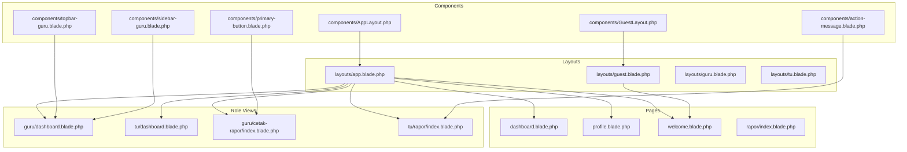
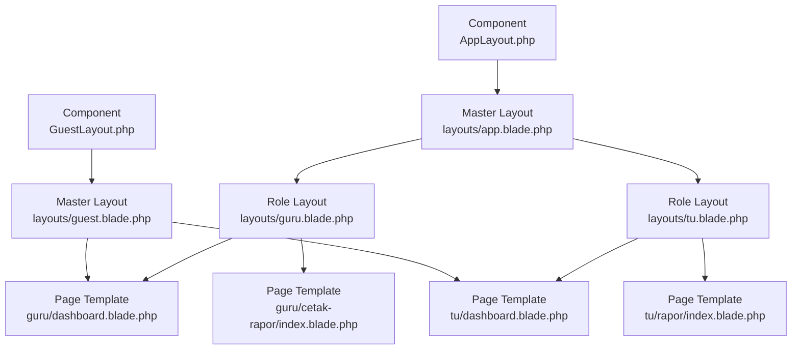
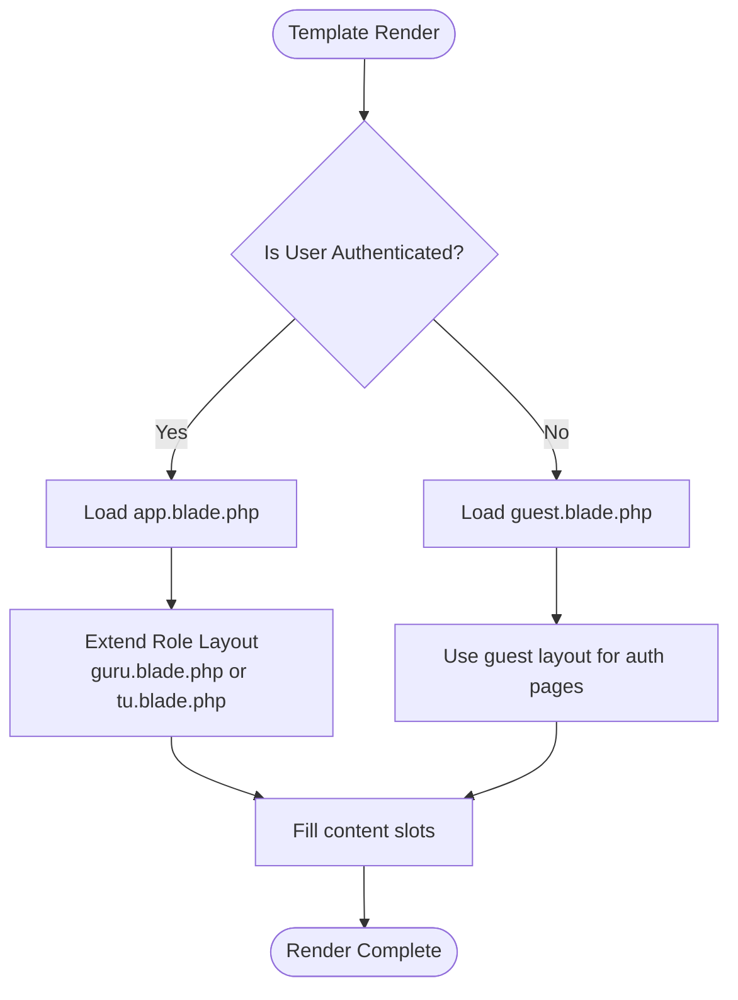
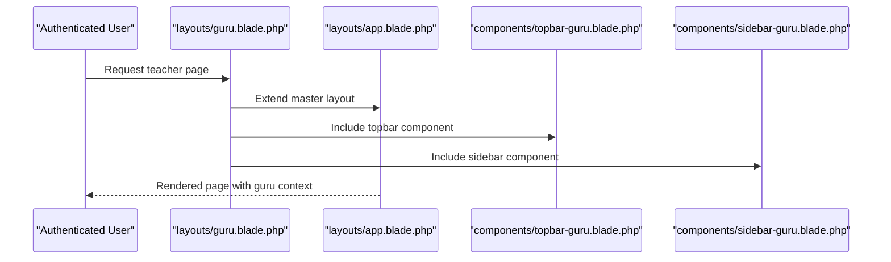
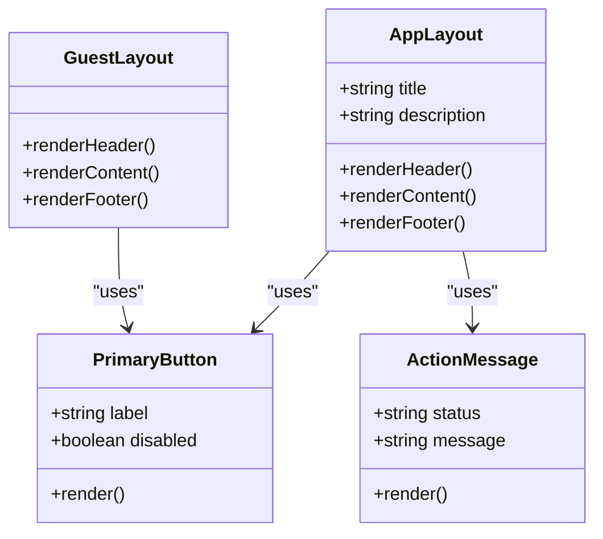
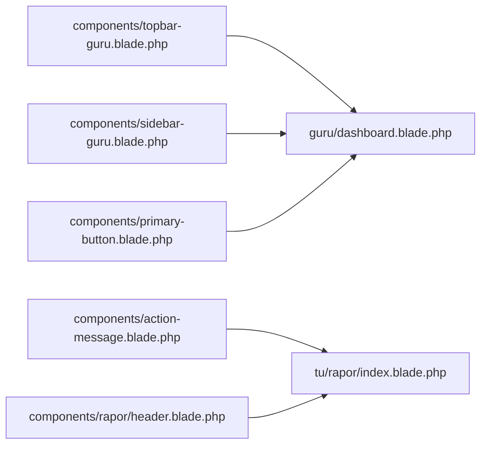
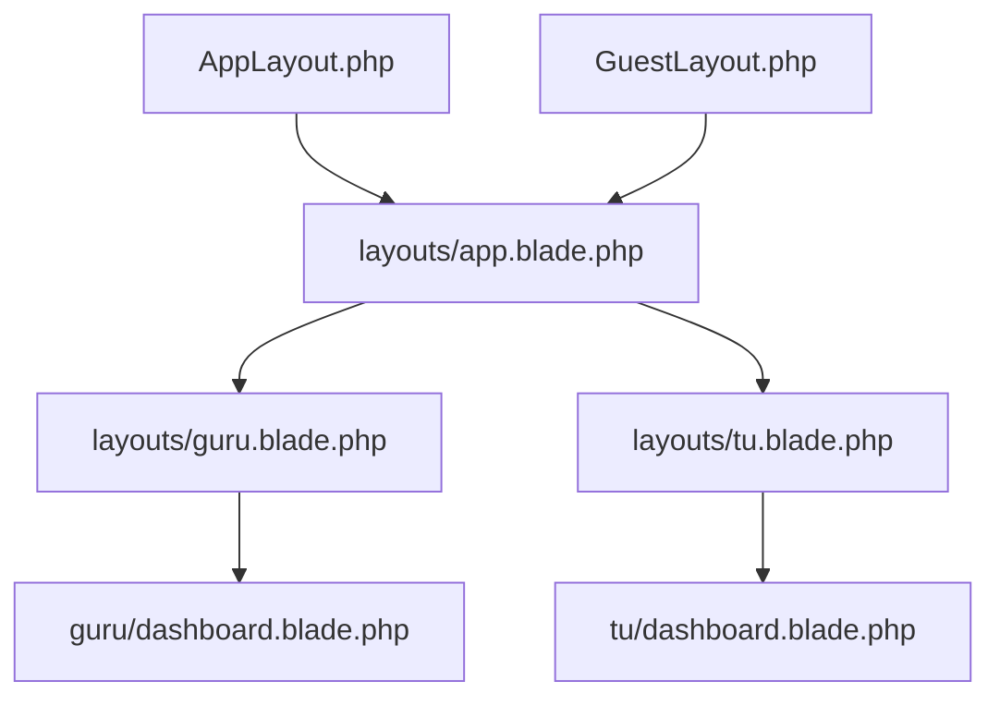

# Blade Template System

<cite>
**Referenced Files in This Document**
- [app.blade.php](file://resources/views/layouts/app.blade.php)
- [guest.blade.php](file://resources/views/layouts/guest.blade.php)
- [guru.blade.php](file://resources/views/layouts/guru.blade.php)
- [tu.blade.php](file://resources/views/layouts/tu.blade.php)
- [AppLayout.php](file://app/View/Components/AppLayout.php)
- [GuestLayout.php](file://app/View/Components/GuestLayout.php)
- [dashboard.blade.php](file://resources/views/dashboard.blade.php)
- [profile.blade.php](file://resources/views/profile.blade.php)
- [welcome.blade.php](file://resources/views/welcome.blade.php)
- [action-message.blade.php](file://resources/views/components/action-message.blade.php)
- [primary-button.blade.php](file://resources/views/components/primary-button.blade.php)
- [sidebar-guru.blade.php](file://resources/views/components/sidebar-guru.blade.php)
- [topbar-guru.blade.php](file://resources/views/components/topbar-guru.blade.php)
- [index.blade.php](file://resources/views/guru/absensi/index.blade.php)
- [index.blade.php](file://resources/views/tu/dashboard.blade.php)
- [index.blade.php](file://resources/views/tu/rapor/index.blade.php)
- [index.blade.php](file://resources/views/guru/dashboard.blade.php)
- [index.blade.php](file://resources/views/tu/p5bk/index.blade.php)
- [index.blade.php](file://resources/views/guru/penilaian/index.blade.php)
- [index.blade.php](file://resources/views/tu/mapel/index.blade.php)
- [index.blade.php](file://resources/views/tu/pegawai/index.blade.php)
- [index.blade.php](file://resources/views/guru/kelas-ku/index.blade.php)
- [index.blade.php](file://resources/views/tu/kelompok-mapel/index.blade.php)
- [index.blade.php](file://resources/views/tu/kompetensi/index.blade.php)
- [index.blade.php](file://resources/views/guru/nilai-prakerin/index.blade.php)
- [index.blade.php](file://resources/views/tu/prakerin/index.blade.php)
- [index.blade.php](file://resources/views/guru/organisasi/index.blade.php)
- [index.blade.php](file://resources/views/tu/organisasi/index.blade.php)
- [index.blade.php](file://resources/views/guru/presensi/index.blade.php)
- [index.blade.php](file://resources/views/tu/presensi/index.blade.php)
- [index.blade.php](file://resources/views/guru/ekstra/index.blade.php)
- [index.blade.php](file://resources/views/tu/ekstra/index.blade.php)
- [index.blade.php](file://resources/views/guru/kokurikuler/index.blade.php)
- [index.blade.php](file://resources/views/tu/kokurikuler/index.blade.php)
- [index.blade.php](file://resources/views/guru/catatan-rapor/index.blade.php)
- [index.blade.php](file://resources/views/tu/deskripsi-rapor/index.blade.php)
- [index.blade.php](file://resources/views/guru/cetak-rapor/index.blade.php)
- [index.blade.php](file://resources/views/tu/rapor/index.blade.php)
- [index.blade.php](file://resources/views/guru/lager-nilai-kelas/index.blade.php)
- [pdf.blade.php](file://resources/views/guru/lager-nilai-kelas/pdf.blade.php)
- [index.blade.php](file://resources/views/guru/p5bk/index.blade.php)
- [index.blade.php](file://resources/views/tu/p5bk/index.blade.php)
- [index.blade.php](file://resources/views/guru/piket-harian/index.blade.php)
- [index.blade.php](file://resources/views/tu/pengaturan/index.blade.php)
- [index.blade.php](file://resources/views/tu/buku-induk/index.blade.php)
- [index.blade.php](file://resources/views/guru/project-kelas/index.blade.php)
- [index.blade.php](file://resources/views/tu/kesiswaan/index.blade.php)
- [index.blade.php](file://resources/views/guru/tujuan-pembelajaran/index.blade.php)
- [index.blade.php](file://resources/views/tu/rombel/index.blade.php)
- [index.blade.php](file://resources/views/guru/rapor-pkl/index.blade.php)
- [index.blade.php](file://resources/views/tu/lulusan/index.blade.php)
- [index.blade.php](file://resources/views/guru/anggota-kelas/index.blade.php)
- [index.blade.php](file://resources/views/tu/mutasi/index.blade.php)
- [index.blade.php](file://resources/views/guru/absensi-bk/index.blade.php)
- [index.blade.php](file://resources/views/guru/penilaian-kokurikuler/index.blade.php)
- [index.blade.php](file://resources/views/guru/penilaian-profil-pancasila/index.blade.php)
- [index.blade.php](file://resources/views/guru/nilai-prakerin/edit.blade.php)
- [index.blade.php](file://resources/views/tu/naik-kelas/index.blade.php)
- [index.blade.php](file://resources/views/tu/sekolah/index.blade.php)
- [index.blade.php](file://resources/views/tu/tingkat/index.blade.php)
- [index.blade.php](file://resources/views/tu/pengingat/index.blade.php)
- [index.blade.php](file://resources/views/tu/presensi-guru/index.blade.php)
- [index.blade.php](file://resources/views/tu/dapodik/index.blade.php)
- [index.blade.php](file://resources/views/tu/ekspor/index.blade.php)
- [index.blade.php](file://resources/views/tu/absensi-guru/index.blade.php)
- [index.blade.php](file://resources/views/tu/pegawai/index.blade.php)
- [index.blade.php](file://resources/views/tu/p5bk/penilaian.blade.php)
- [index.blade.php](file://resources/views/tu/p5bk/evaluasi.blade.php)
- [index.blade.php](file://resources/views/tu/p5bk/analisis.blade.php)
- [index.blade.php](file://resources/views/tu/p5bk/rencana.blade.php)
- [index.blade.php](file://resources/views/tu/p5bk/penilaian.blade.php)
- [index.blade.php](file://resources/views/tu/p5bk/evaluasi.blade.php)
- [index.blade.php](file://resources/views/tu/p5bk/analisis.blade.php)
- [index.blade.php](file://resources/views/tu/p5bk/rencana.blade.php)
- [index.blade.php](file://resources/views/tu/p5bk/penilaian.blade.php)
- [index.blade.php](file://resources/views/tu/p5bk/evaluasi.blade.php)
- [index.blade.php](file://resources/views/tu/p5bk/analisis.blade.php)
- [index.blade.php](file://resources/views/tu/p5bk/rencana.blade.php)
- [index.blade.php](file://resources/views/tu/p5bk/penilaian.blade.php)
- [index.blade.php](file://resources/views/tu/p5bk/evaluasi.blade.php)
- [index.blade.php](file://resources/views/tu/p5bk/analisis.blade.php)
- [index.blade.php](file://resources/views/tu/p5bk/rencana.blade.php)
- [index.blade.php](file://resources/views/tu/p5bk/penilaian.blade.php)
- [index.blade.php](file://resources/views/tu/p5bk/evaluasi.blade.php)
- [index.blade.php](file://resources/views/tu/p5bk/analisis.blade.php)
- [index.blade.php](file://resources/views/tu/p5bk/rencana.blade.php)
- [index.blade.php](file://resources/views/tu/p5bk/penilaian.blade.php)
- [index.blade.php](file://resources/views/tu/p5bk/evaluasi.blade.php)
- [index.blade.php](file://resources/views/tu/p5bk/analisis.blade.php)
- [index.blade.php](file://resources/views/tu/p5bk/rencana.blade.php)
- [index.blade.php](file://resources/views/tu/p5bk/penilaian......bladexxx](file://resources/views/tu/p5bk/penilaian.blade.php)
- [index.blade.php](file://resources/views/tu/p5bk/evaluasi......bladexxx](file://resources/views/tu/p5bk/evaluasi.blade.php)
- [index.blade.php](file://resources/views/tu/p5bk/analisis......bladexxx](file://resources/views/tu/p5bk/analisis.blade.php)
- [index.blade.php](file://resources/views/tu/p5bk/rencana......bladexxx](file://resources/views/tu/p5bk/rencana.blade.php)
</cite>

## Table of Contents
1. [Introduction](#introduction)
2. [Project Structure](#project-structure)
3. [Core Components](#core-components)
4. [Architecture Overview](#architecture-overview)
5. [Detailed Component Analysis](#detailed-component-analysis)
6. [Dependency Analysis](#dependency-analysis)
7. [Performance Considerations](#performance-considerations)
8. [Troubleshooting Guide](#troubleshooting-guide)
9. [Conclusion](#conclusion)

## Introduction
This document explains the Blade template system implementation in the Laravel application. It covers the template inheritance hierarchy, layout composition patterns, and component-based architecture. It documents the role of master layouts (app.blade.php, guest.blade.php) and specialized layouts for different user roles (guru.blade.php, tu.blade.php). It details component composition using Blade components (app-layout, guest-layout) and their integration patterns. It also describes template organization, partial views, reusable UI elements, and the relationship between Blade templates and controller responses, including data passing and view binding. Examples of layout inheritance, component usage, and conditional rendering are included, along with template caching, performance considerations, and best practices for maintainable Blade code.

## Project Structure
The Blade templates are organized under resources/views with the following key directories:
- layouts: Master and role-specific base layouts
- components: Reusable UI components and partials
- guru and tu: Role-specific page templates
- rapor: Report-related templates
- livewire: Livewire-based page templates
- Root-level templates: Dashboard, profile, welcome, and others

**Diagram sources**
- [app.blade.php](file://resources/views/layouts/app.blade.php)
- [guest.blade.php](file://resources/views/layouts/guest.blade.php)
- [guru.blade.php](file://resources/views/layouts/guru.blade.php)
- [tu.blade.php](file://resources/views/layouts/tu.blade.php)
- [AppLayout.php](file://app/View/Components/AppLayout.php)
- [GuestLayout.php](file://app/View/Components/GuestLayout.php)
- [dashboard.blade.php](file://resources/views/dashboard.blade.php)
- [profile.blade.php](file://resources/views/profile.blade.php)
- [welcome.blade.php](file://resources/views/welcome.blade.php)
- [index.blade.php](file://resources/views/guru/dashboard.blade.php)
- [index.blade.php](file://resources/views/tu/dashboard.blade.php)
- [index.blade.php](file://resources/views/guru/cetak-rapor/index.blade.php)
- [index.blade.php](file://resources/views/tu/rapor/index.blade.php)
- [topbar-guru.blade.php](file://resources/views/components/topbar-guru.blade.php)
- [sidebar-guru.blade.php](file://resources/views/components/sidebar-guru.blade.php)
- [primary-button.blade.php](file://resources/views/components/primary-button.blade.php)
- [action-message.blade.php](file://resources/views/components/action-message.blade.php)

**Section sources**
- [app.blade.php](file://resources/views/layouts/app.blade.php)
- [guest.blade.php](file://resources/views/layouts/guest.blade.php)
- [guru.blade.php](file://resources/views/layouts/guru.blade.php)
- [tu.blade.php](file://resources/views/layouts/tu.blade.php)

## Core Components
This section documents the reusable Blade components and their integration patterns.

- AppLayout and GuestLayout Blade components:
  - These components encapsulate shared layout logic and provide slots for content injection, enabling consistent page structure across roles.
  - They are registered in the application and invoked from Blade templates to wrap page content.

- Reusable UI components:
  - Buttons: primary-button.blade.php, secondary-button.blade.php, danger-button.blade.php
  - Form elements: input-label.blade.php, text-input.blade.php, input-error.blade.php
  - Navigation: nav-link.blade.php, responsive-nav-link.blade.php
  - Feedback: auth-session-status.blade.php, action-message.blade.php, flash-message.blade.php
  - Cards and stats: stat-card.blade.php, progress-card.blade.php
  - Modals and dropdowns: modal.blade.php, dropdown.blade.php, dropdown-link.blade.php
  - Specialized role components: topbar-guru.blade.php, sidebar-guru.blade.php, sidebar-tu.blade.php
  - Quick actions and switches: quick-action.blade.php, semester-switcher.blade.php
  - Application branding: application-logo.blade.php
  - Welcome banner: welcome-banner.blade.php
  - PWA update prompt: pwa-update-prompt.blade.php

These components promote consistency, reduce duplication, and improve maintainability by centralizing common UI patterns.

**Section sources**
- [AppLayout.php](file://app/View/Components/AppLayout.php)
- [GuestLayout.php](file://app/View/Components/GuestLayout.php)
- [primary-button.blade.php](file://resources/views/components/primary-button.blade.php)
- [action-message.blade.php](file://resources/views/components/action-message.blade.php)
- [topbar-guru.blade.php](file://resources/views/components/topbar-guru.blade.php)
- [sidebar-guru.blade.php](file://resources/views/components/sidebar-guru.blade.php)

## Architecture Overview
The Blade template system follows a layered architecture:
- Master layouts define global structure and placeholders for content.
- Role-specific layouts inherit from master layouts and add role-specific navigation and branding.
- Page templates extend role layouts and fill content sections.
- Blade components encapsulate reusable UI elements and are included via @include or component directives.
- Livewire templates integrate reactive components with server-side rendering.

**Diagram sources**
- [app.blade.php](file://resources/views/layouts/app.blade.php)
- [guest.blade.php](file://resources/views/layouts/guest.blade.php)
- [guru.blade.php](file://resources/views/layouts/guru.blade.php)
- [tu.blade.php](file://resources/views/layouts/tu.blade.php)
- [index.blade.php](file://resources/views/guru/dashboard.blade.php)
- [index.blade.php](file://resources/views/tu/dashboard.blade.php)
- [index.blade.php](file://resources/views/guru/cetak-rapor/index.blade.php)
- [index.blade.php](file://resources/views/tu/rapor/index.blade.php)
- [AppLayout.php](file://app/View/Components/AppLayout.php)
- [GuestLayout.php](file://app/View/Components/GuestLayout.php)

## Detailed Component Analysis

### Master Layouts and Inheritance
- app.blade.php serves as the master layout for authenticated users. It defines the base HTML structure, includes global assets, and establishes yield slots for styles, scripts, and content. Role-specific layouts (guru.blade.php, tu.blade.php) extend this master layout and inject role-specific navigation and branding.
- guest.blade.php is the master layout for unauthenticated users, focusing on login and registration flows.

**Diagram sources**
- [app.blade.php](file://resources/views/layouts/app.blade.php)
- [guest.blade.php](file://resources/views/layouts/guest.blade.php)
- [guru.blade.php](file://resources/views/layouts/guru.blade.php)
- [tu.blade.php](file://resources/views/layouts/tu.blade.php)

**Section sources**
- [app.blade.php](file://resources/views/layouts/app.blade.php)
- [guest.blade.php](file://resources/views/layouts/guest.blade.php)
- [guru.blade.php](file://resources/views/layouts/guru.blade.php)
- [tu.blade.php](file://resources/views/layouts/tu.blade.php)

### Role-Specific Layouts
- guru.blade.php extends app.blade.php and adds the guru-specific topbar and sidebar components. It ensures consistent navigation and branding for teachers.
- tu.blade.php extends app.blade.php and integrates the TU-specific topbar and sidebar components for administrative staff.

**Diagram sources**
- [guru.blade.php](file://resources/views/layouts/guru.blade.php)
- [app.blade.php](file://resources/views/layouts/app.blade.php)
- [topbar-guru.blade.php](file://resources/views/components/topbar-guru.blade.php)
- [sidebar-guru.blade.php](file://resources/views/components/sidebar-guru.blade.php)

**Section sources**
- [guru.blade.php](file://resources/views/layouts/guru.blade.php)
- [tu.blade.php](file://resources/views/layouts/tu.blade.php)
- [topbar-guru.blade.php](file://resources/views/components/topbar-guru.blade.php)
- [sidebar-guru.blade.php](file://resources/views/components/sidebar-guru.blade.php)

### Blade Components Integration
- AppLayout and GuestLayout components provide structured wrappers around page content. They accept parameters (such as title, description) and expose slots for header, content, and footer areas.
- Components like primary-button.blade.php and action-message.blade.php are used within page templates to render consistent UI elements and feedback messages.

**Diagram sources**
- [AppLayout.php](file://app/View/Components/AppLayout.php)
- [GuestLayout.php](file://app/View/Components/GuestLayout.php)
- [primary-button.blade.php](file://resources/views/components/primary-button.blade.php)
- [action-message.blade.php](file://resources/views/components/action-message.blade.php)

**Section sources**
- [AppLayout.php](file://app/View/Components/AppLayout.php)
- [GuestLayout.php](file://app/View/Components/GuestLayout.php)
- [primary-button.blade.php](file://resources/views/components/primary-button.blade.php)
- [action-message.blade.php](file://resources/views/components/action-message.blade.php)

### Template Organization and Partial Views
- The components directory centralizes reusable UI elements, enabling consistent styling and behavior across the application.
- Partial views (e.g., topbar-guru.blade.php, sidebar-guru.blade.php) encapsulate navigation fragments and are included within role layouts.
- Report templates (e.g., rapor/index.blade.php, rapor/rapor-semester.blade.php) provide specialized rendering for academic reports.

**Diagram sources**
- [topbar-guru.blade.php](file://resources/views/components/topbar-guru.blade.php)
- [sidebar-guru.blade.php](file://resources/views/components/sidebar-guru.blade.php)
- [primary-button.blade.php](file://resources/views/components/primary-button.blade.php)
- [action-message.blade.php](file://resources/views/components/action-message.blade.php)
- [rapor/header.blade.php](file://resources/views/components/rapor/header.blade.php)
- [index.blade.php](file://resources/views/guru/dashboard.blade.php)
- [index.blade.php](file://resources/views/tu/rapor/index.blade.php)

**Section sources**
- [topbar-guru.blade.php](file://resources/views/components/topbar-guru.blade.php)
- [sidebar-guru.blade.php](file://resources/views/components/sidebar-guru.blade.php)
- [primary-button.blade.php](file://resources/views/components/primary-button.blade.php)
- [action-message.blade.php](file://resources/views/components/action-message.blade.php)
- [rapor/header.blade.php](file://resources/views/components/rapor/header.blade.php)

### Controller Responses and Data Passing
- Blade templates receive data passed from controllers via view() calls. This data is bound to the template context and can be accessed within Blade expressions.
- Components receive parameters through attributes, enabling dynamic content rendering based on controller-provided data.
- Conditional rendering is achieved using Blade directives to show or hide sections based on user roles, permissions, or runtime conditions.

Examples of usage patterns:
- Passing data to templates: [dashboard.blade.php](file://resources/views/dashboard.blade.php), [profile.blade.php](file://resources/views/profile.blade.php)
- Using components with parameters: [primary-button.blade.php](file://resources/views/components/primary-button.blade.php), [action-message.blade.php](file://resources/views/components/action-message.blade.php)
- Conditional rendering in role views: [guru/dashboard.blade.php](file://resources/views/guru/dashboard.blade.php), [tu/dashboard.blade.php](file://resources/views/tu/dashboard.blade.php)

**Section sources**
- [dashboard.blade.php](file://resources/views/dashboard.blade.php)
- [profile.blade.php](file://resources/views/profile.blade.php)
- [primary-button.blade.php](file://resources/views/components/primary-button.blade.php)
- [action-message.blade.php](file://resources/views/components/action-message.blade.php)
- [index.blade.php](file://resources/views/guru/dashboard.blade.php)
- [index.blade.php](file://resources/views/tu/dashboard.blade.php)

## Dependency Analysis
The template system exhibits clear separation of concerns:
- Layouts depend on Blade's @extends and @section/@yield directives to compose pages.
- Components are self-contained and can be reused across templates.
- Role-specific templates depend on role layouts, which in turn depend on master layouts.
- Livewire templates integrate reactive behavior with server-rendered content.

**Diagram sources**
- [app.blade.php](file://resources/views/layouts/app.blade.php)
- [guru.blade.php](file://resources/views/layouts/guru.blade.php)
- [tu.blade.php](file://resources/views/layouts/tu.blade.php)
- [AppLayout.php](file://app/View/Components/AppLayout.php)
- [GuestLayout.php](file://app/View/Components/GuestLayout.php)
- [index.blade.php](file://resources/views/guru/dashboard.blade.php)
- [index.blade.php](file://resources/views/tu/dashboard.blade.php)

**Section sources**
- [app.blade.php](file://resources/views/layouts/app.blade.php)
- [guru.blade.php](file://resources/views/layouts/guru.blade.php)
- [tu.blade.php](file://resources/views/layouts/tu.blade.php)
- [AppLayout.php](file://app/View/Components/AppLayout.php)
- [GuestLayout.php](file://app/View/Components/GuestLayout.php)
- [index.blade.php](file://resources/views/guru/dashboard.blade.php)
- [index.blade.php](file://resources/views/tu/dashboard.blade.php)

## Performance Considerations
- Blade compilation and caching:
  - Laravel compiles Blade templates to PHP and caches them. Ensure production environments have proper cache configuration to avoid recompilation overhead.
  - Clear and rebuild caches after template changes to prevent serving stale compiled views.
- Minimizing unnecessary includes:
  - Prefer component reuse to reduce template duplication and compilation work.
  - Avoid deep nesting of includes within loops to prevent excessive re-renders.
- Asset optimization:
  - Bundle and minify CSS/JS to reduce load times. Leverage Laravel Mix or Vite for asset compilation.
- Conditional rendering:
  - Use Blade conditionals to avoid rendering heavy components when not needed.
- Pagination and large datasets:
  - Paginate data passed to templates to limit DOM size and rendering cost.

## Troubleshooting Guide
Common issues and resolutions:
- Missing or incorrect slot definitions:
  - Verify that child templates properly close @section blocks and that master layouts define required @yield slots.
- Component parameter mismatches:
  - Ensure component attributes match the parameters expected by the component definition.
- Incorrect inheritance chain:
  - Confirm that role layouts extend the correct master layout and that page templates extend the appropriate role layout.
- Asset loading problems:
  - Check asset paths and ensure build artifacts are present in the public directory.
- Caching conflicts:
  - Clear view cache and recompile templates after making structural changes to layouts or components.

## Conclusion
The Blade template system in this Laravel application employs a robust inheritance hierarchy with master layouts, role-specific layouts, and reusable components. This architecture enables consistent UI, maintainable code, and efficient rendering. By leveraging Blade components, partial views, and structured layouts, developers can create scalable and user-friendly interfaces tailored to different roles while maintaining high performance and reliability.