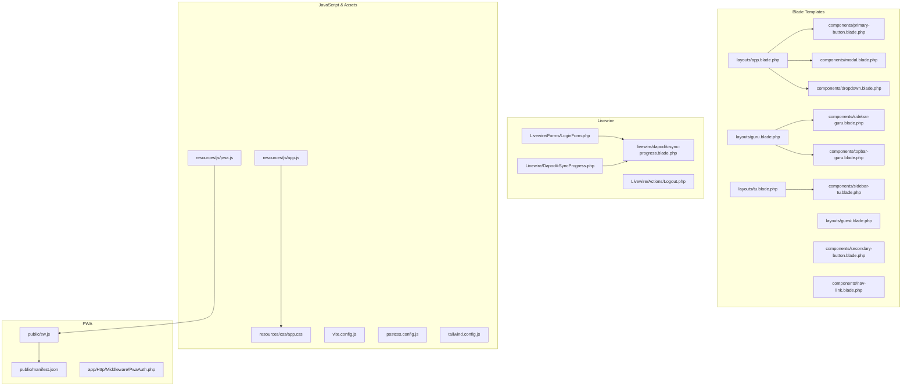
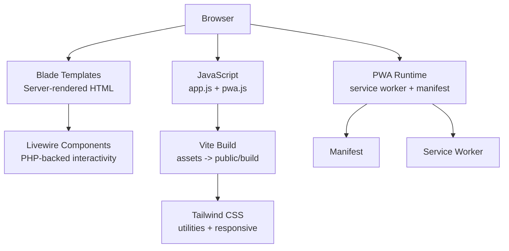
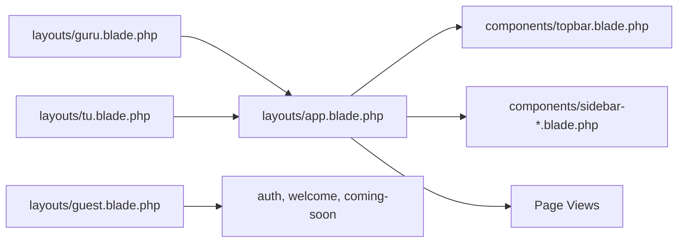
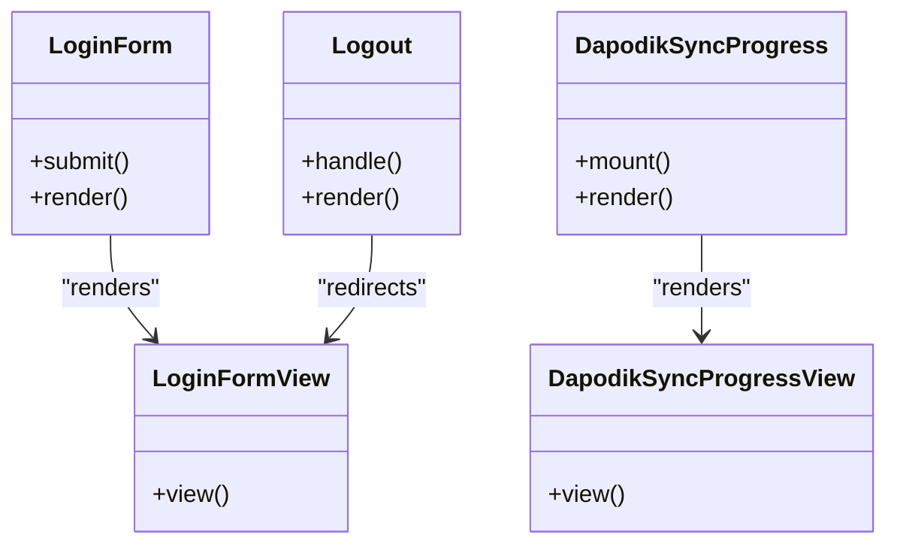
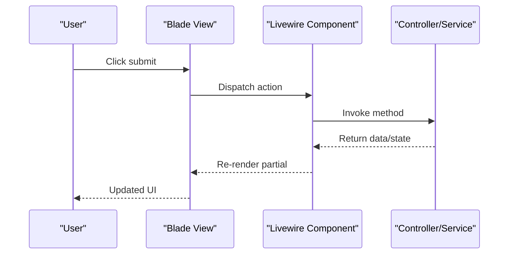
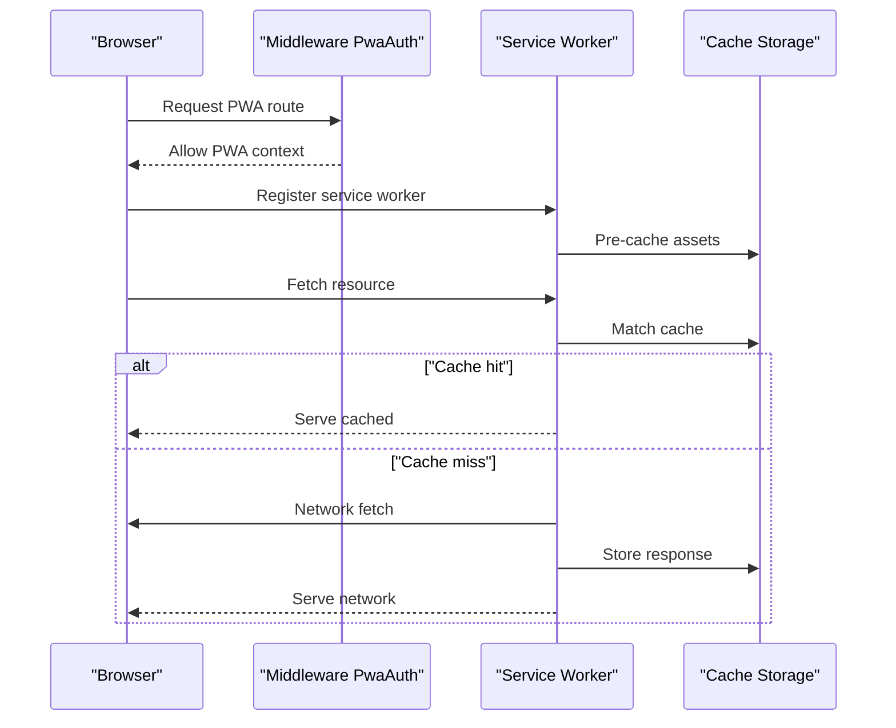
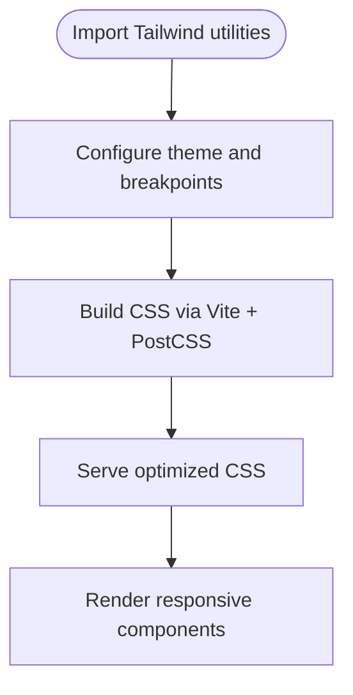
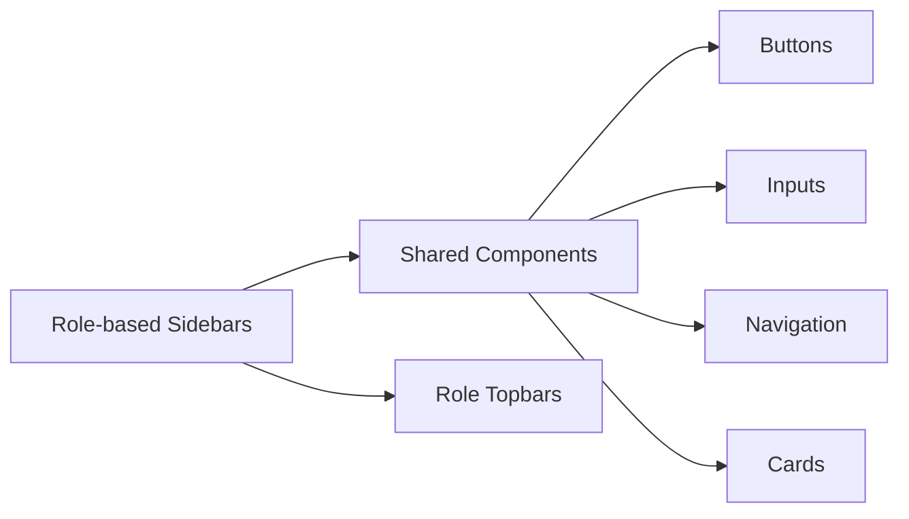
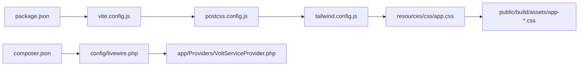

# Frontend Architecture

<cite>
**Referenced Files in This Document**
- [app.css](file://resources/css/app.css)
- [app.js](file://resources/js/app.js)
- [pwa.js](file://resources/js/pwa.js)
- [manifest.json](file://public/manifest.json)
- [sw.js](file://public/sw.js)
- [app.blade.php](file://resources/views/layouts/app.blade.php)
- [guest.blade.php](file://resources/views/layouts/guest.blade.php)
- [guru.blade.php](file://resources/views/layouts/guru.blade.php)
- [tu.blade.php](file://resources/views/layouts/tu.blade.php)
- [dashboard.blade.php](file://resources/views/dashboard.blade.php)
- [welcome.blade.php](file://resources/views/welcome.blade.php)
- [coming-soon.blade.php](file://resources/views/coming-soon.blade.php)
- [profile.blade.php](file://resources/views/profile.blade.php)
- [primary-button.blade.php](file://resources/views/components/primary-button.blade.php)
- [secondary-button.blade.php](file://resources/views/components/secondary-button.blade.php)
- [danger-button.blade.php](file://resources/views/components/danger-button.blade.php)
- [text-input.blade.php](file://resources/views/components/text-input.blade.php)
- [input-label.blade.php](file://resources/views/components/input-label.blade.php)
- [input-error.blade.php](file://resources/views/components/input-error.blade.php)
- [nav-link.blade.php](file://resources/views/components/nav-link.blade.php)
- [responsive-nav-link.blade.php](file://resources/views/components/responsive-nav-link.blade.php)
- [dropdown.blade.php](file://resources/views/components/dropdown.blade.php)
- [dropdown-link.blade.php](file://resources/views/components/dropdown-link.blade.php)
- [modal.blade.php](file://resources/views/components/modal.blade.php)
- [stat-card.blade.php](file://resources/views/components/stat-card.blade.php)
- [progress-card.blade.php](file://resources/views/components/progress-card.blade.php)
- [quick-action.blade.php](file://resources/views/components/quick-action.blade.php)
- [semester-switcher.blade.php](file://resources/views/components/semester-switcher.blade.php)
- [topbar.blade.php](file://resources/views/components/topbar.blade.php)
- [topbar-guru.blade.php](file://resources/views/components/topbar-guru.blade.php)
- [sidebar-guru.blade.php](file://resources/views/components/sidebar-guru.blade.php)
- [sidebar-tu.blade.php](file://resources/views/components/sidebar-tu.blade.php)
- [welcome-banner.blade.php](file://resources/views/components/welcome-banner.blade.php)
- [pwa-update-prompt.blade.php](file://resources/views/components/pwa-update-prompt.blade.php)
- [rapor/header.blade.php](file://resources/views/components/rapor/header.blade.php)
- [LoginForm.php](file://app/Livewire/Forms/LoginForm.php)
- [Logout.php](file://app/Livewire/Actions/Logout.php)
- [DapodikSyncProgress.php](file://app/Livewire/DapodikSyncProgress.php)
- [dapodik-sync-progress.blade.php](file://resources/views/livewire/dapodik-sync-progress.blade.php)
- [tailwind.config.js](file://tailwind.config.js)
- [vite.config.js](file://vite.config.js)
- [postcss.config.js](file://postcss.config.js)
- [package.json](file://package.json)
- [composer.json](file://composer.json)
- [Livewire config](file://config/livewire.php)
- [PWA Auth middleware](file://app/Http/Middleware/PwaAuth.php)
- [Session Timeout middleware](file://app/Http/Middleware/SessionTimeout.php)
- [AppLayout.php](file://app/View/Components/AppLayout.php)
- [GuestLayout.php](file://app/View/Components/GuestLayout.php)
- [SekolahComposer.php](file://app/View/Composers/SekolahComposer.php)
- [VoltServiceProvider.php](file://app/Providers/VoltServiceProvider.php)
</cite>

## Table of Contents
1. [Introduction](#introduction)
2. [Project Structure](#project-structure)
3. [Core Components](#core-components)
4. [Architecture Overview](#architecture-overview)
5. [Detailed Component Analysis](#detailed-component-analysis)
6. [Dependency Analysis](#dependency-analysis)
7. [Performance Considerations](#performance-considerations)
8. [Troubleshooting Guide](#troubleshooting-guide)
9. [Conclusion](#conclusion)
10. [Appendices](#appendices)

## Introduction
This document describes the frontend architecture of the application with a focus on the Blade template system, Livewire reactive components, JavaScript and Progressive Web App (PWA) implementation, and Tailwind CSS-based responsive design. It explains how views are organized, how components are composed, how Livewire enables reactive UI updates, and how the PWA stack supports offline capabilities and mobile responsiveness. It also covers performance optimization strategies, accessibility considerations, and integration patterns with backend services.

## Project Structure
The frontend is organized around three pillars:
- Blade templates for server-rendered views and component composition
- Livewire for reactive PHP-backed components
- JavaScript assets bundled via Vite with Tailwind CSS for styling and responsive design

Key areas:
- Blade layouts define page scaffolding and role-specific navigation
- Blade components encapsulate reusable UI elements
- Livewire components handle dynamic interactions and real-time updates
- JavaScript assets include app-wide scripts and PWA support
- Tailwind CSS provides utility-first styling and responsive breakpoints

**Diagram sources**
- [app.blade.php](file://resources/views/layouts/app.blade.php)
- [guru.blade.php](file://resources/views/layouts/guru.blade.php)
- [tu.blade.php](file://resources/views/layouts/tu.blade.php)
- [primary-button.blade.php](file://resources/views/components/primary-button.blade.php)
- [modal.blade.php](file://resources/views/components/modal.blade.php)
- [dropdown.blade.php](file://resources/views/components/dropdown.blade.php)
- [sidebar-guru.blade.php](file://resources/views/components/sidebar-guru.blade.php)
- [sidebar-tu.blade.php](file://resources/views/components/sidebar-tu.blade.php)
- [topbar-guru.blade.php](file://resources/views/components/topbar-guru.blade.php)
- [LoginForm.php](file://app/Livewire/Forms/LoginForm.php)
- [DapodikSyncProgress.php](file://app/Livewire/DapodikSyncProgress.php)
- [dapodik-sync-progress.blade.php](file://resources/views/livewire/dapodik-sync-progress.blade.php)
- [app.js](file://resources/js/app.js)
- [pwa.js](file://resources/js/pwa.js)
- [app.css](file://resources/css/app.css)
- [vite.config.js](file://vite.config.js)
- [postcss.config.js](file://postcss.config.js)
- [tailwind.config.js](file://tailwind.config.js)
- [sw.js](file://public/sw.js)
- [manifest.json](file://public/manifest.json)
- [PwaAuth.php](file://app/Http/Middleware/PwaAuth.php)

**Section sources**
- [app.blade.php](file://resources/views/layouts/app.blade.php)
- [guru.blade.php](file://resources/views/layouts/guru.blade.php)
- [tu.blade.php](file://resources/views/layouts/tu.blade.php)
- [primary-button.blade.php](file://resources/views/components/primary-button.blade.php)
- [modal.blade.php](file://resources/views/components/modal.blade.php)
- [dropdown.blade.php](file://resources/views/components/dropdown.blade.php)
- [sidebar-guru.blade.php](file://resources/views/components/sidebar-guru.blade.php)
- [sidebar-tu.blade.php](file://resources/views/components/sidebar-tu.blade.php)
- [LoginForm.php](file://app/Livewire/Forms/LoginForm.php)
- [DapodikSyncProgress.php](file://app/Livewire/DapodikSyncProgress.php)
- [dapodik-sync-progress.blade.php](file://resources/views/livewire/dapodik-sync-progress.blade.php)
- [app.js](file://resources/js/app.js)
- [pwa.js](file://resources/js/pwa.js)
- [app.css](file://resources/css/app.css)
- [vite.config.js](file://vite.config.js)
- [postcss.config.js](file://postcss.config.js)
- [tailwind.config.js](file://tailwind.config.js)
- [sw.js](file://public/sw.js)
- [manifest.json](file://public/manifest.json)
- [PwaAuth.php](file://app/Http/Middleware/PwaAuth.php)

## Core Components
This section documents the foundational frontend building blocks: Blade layouts, reusable components, and Livewire reactive elements.

- Blade Layouts
  - Application layout defines shared HTML structure, meta tags, and includes topbar and sidebar components for authenticated users.
  - Role-specific layouts (guru and tu) extend the base layout and inject role-based navigation and content areas.
  - Guest layout provides minimal scaffolding for authentication and landing pages.

- Blade Components
  - Buttons: primary, secondary, and danger variants for consistent affordances.
  - Inputs: labeled inputs, errors, and text inputs with validation feedback.
  - Navigation: standard and responsive navigation links, dropdown menus, and topbar elements.
  - Cards: stat cards and progress cards for summary and status displays.
  - Modals and quick actions for contextual interactions.
  - Semester switcher for academic year navigation.
  - Welcome banner and PWA update prompt for user engagement and updates.

- Livewire Components
  - LoginForm: handles credential submission and authentication flow.
  - Logout: performs secure logout actions.
  - DapodikSyncProgress: displays synchronization progress for external data integration.

**Section sources**
- [app.blade.php](file://resources/views/layouts/app.blade.php)
- [guru.blade.php](file://resources/views/layouts/guru.blade.php)
- [tu.blade.php](file://resources/views/layouts/tu.blade.php)
- [guest.blade.php](file://resources/views/layouts/guest.blade.php)
- [primary-button.blade.php](file://resources/views/components/primary-button.blade.php)
- [secondary-button.blade.php](file://resources/views/components/secondary-button.blade.php)
- [danger-button.blade.php](file://resources/views/components/danger-button.blade.php)
- [text-input.blade.php](file://resources/views/components/text-input.blade.php)
- [input-label.blade.php](file://resources/views/components/input-label.blade.php)
- [input-error.blade.php](file://resources/views/components/input-error.blade.php)
- [nav-link.blade.php](file://resources/views/components/nav-link.blade.php)
- [responsive-nav-link.blade.php](file://resources/views/components/responsive-nav-link.blade.php)
- [dropdown.blade.php](file://resources/views/components/dropdown.blade.php)
- [dropdown-link.blade.php](file://resources/views/components/dropdown-link.blade.php)
- [modal.blade.php](file://resources/views/components/modal.blade.php)
- [stat-card.blade.php](file://resources/views/components/stat-card.blade.php)
- [progress-card.blade.php](file://resources/views/components/progress-card.blade.php)
- [quick-action.blade.php](file://resources/views/components/quick-action.blade.php)
- [semester-switcher.blade.php](file://resources/views/components/semester-switcher.blade.php)
- [topbar.blade.php](file://resources/views/components/topbar.blade.php)
- [topbar-guru.blade.php](file://resources/views/components/topbar-guru.blade.php)
- [sidebar-guru.blade.php](file://resources/views/components/sidebar-guru.blade.php)
- [sidebar-tu.blade.php](file://resources/views/components/sidebar-tu.blade.php)
- [welcome-banner.blade.php](file://resources/views/components/welcome-banner.blade.php)
- [pwa-update-prompt.blade.php](file://resources/views/components/pwa-update-prompt.blade.php)
- [LoginForm.php](file://app/Livewire/Forms/LoginForm.php)
- [Logout.php](file://app/Livewire/Actions/Logout.php)
- [DapodikSyncProgress.php](file://app/Livewire/DapodikSyncProgress.php)

## Architecture Overview
The frontend architecture blends server-rendered Blade templates with client-side interactivity powered by Livewire and JavaScript. Asset compilation is handled by Vite with Tailwind CSS for utility-first styling. The PWA stack ensures offline readiness and installability.

**Diagram sources**
- [app.blade.php](file://resources/views/layouts/app.blade.php)
- [LoginForm.php](file://app/Livewire/Forms/LoginForm.php)
- [app.js](file://resources/js/app.js)
- [pwa.js](file://resources/js/pwa.js)
- [vite.config.js](file://vite.config.js)
- [tailwind.config.js](file://tailwind.config.js)
- [manifest.json](file://public/manifest.json)
- [sw.js](file://public/sw.js)

## Detailed Component Analysis

### Blade Template System
- Composition and Inheritance
  - Base layout composes topbar, sidebar, and content area; role-specific layouts extend it to tailor navigation and permissions.
  - Components are included via Blade directives to promote reuse and consistency.
- View Organization
  - Views are grouped by feature (e.g., guru, tu, rapor) and shared components are centralized under components/.
  - Authentication and landing pages reside in root views for clarity.

**Diagram sources**
- [app.blade.php](file://resources/views/layouts/app.blade.php)
- [guru.blade.php](file://resources/views/layouts/guru.blade.php)
- [tu.blade.php](file://resources/views/layouts/tu.blade.php)
- [guest.blade.php](file://resources/views/layouts/guest.blade.php)
- [topbar.blade.php](file://resources/views/components/topbar.blade.php)
- [sidebar-guru.blade.php](file://resources/views/components/sidebar-guru.blade.php)
- [sidebar-tu.blade.php](file://resources/views/components/sidebar-tu.blade.php)

**Section sources**
- [app.blade.php](file://resources/views/layouts/app.blade.php)
- [guru.blade.php](file://resources/views/layouts/guru.blade.php)
- [tu.blade.php](file://resources/views/layouts/tu.blade.php)
- [guest.blade.php](file://resources/views/layouts/guest.blade.php)
- [topbar.blade.php](file://resources/views/components/topbar.blade.php)
- [sidebar-guru.blade.php](file://resources/views/components/sidebar-guru.blade.php)
- [sidebar-tu.blade.php](file://resources/views/components/sidebar-tu.blade.php)

### Livewire Reactive Components
Livewire enables reactive UI without writing custom JavaScript. Components are PHP classes with Blade views.

**Diagram sources**
- [LoginForm.php](file://app/Livewire/Forms/LoginForm.php)
- [Logout.php](file://app/Livewire/Actions/Logout.php)
- [DapodikSyncProgress.php](file://app/Livewire/DapodikSyncProgress.php)
- [dapodik-sync-progress.blade.php](file://resources/views/livewire/dapodik-sync-progress.blade.php)

**Diagram sources**
- [LoginForm.php](file://app/Livewire/Forms/LoginForm.php)
- [DapodikSyncProgress.php](file://app/Livewire/DapodikSyncProgress.php)

**Section sources**
- [LoginForm.php](file://app/Livewire/Forms/LoginForm.php)
- [Logout.php](file://app/Livewire/Actions/Logout.php)
- [DapodikSyncProgress.php](file://app/Livewire/DapodikSyncProgress.php)
- [dapodik-sync-progress.blade.php](file://resources/views/livewire/dapodik-sync-progress.blade.php)

### JavaScript and PWA Implementation
- Service Worker and Manifest
  - Service worker script and manifest enable offline caching and installability.
  - Middleware enforces PWA context for protected routes.
- Offline Capabilities
  - Static assets and critical HTML are cached; dynamic content falls back gracefully.
- Mobile Responsiveness
  - Tailwind utilities and responsive breakpoints ensure consistent rendering across devices.

**Diagram sources**
- [PwaAuth.php](file://app/Http/Middleware/PwaAuth.php)
- [sw.js](file://public/sw.js)
- [manifest.json](file://public/manifest.json)

**Section sources**
- [pwa.js](file://resources/js/pwa.js)
- [sw.js](file://public/sw.js)
- [manifest.json](file://public/manifest.json)
- [PwaAuth.php](file://app/Http/Middleware/PwaAuth.php)

### Tailwind CSS Integration
- Utility-first styling promotes consistency and rapid iteration.
- Responsive design leverages Tailwind breakpoints and spacing scales.
- Design system emerges from shared component libraries and color tokens.

**Diagram sources**
- [tailwind.config.js](file://tailwind.config.js)
- [postcss.config.js](file://postcss.config.js)
- [vite.config.js](file://vite.config.js)
- [app.css](file://resources/css/app.css)

**Section sources**
- [tailwind.config.js](file://tailwind.config.js)
- [postcss.config.js](file://postcss.config.js)
- [vite.config.js](file://vite.config.js)
- [app.css](file://resources/css/app.css)

### Component Composition Patterns
- Reusable UI Elements
  - Buttons, inputs, modals, dropdowns, cards, and navigation components are consistently styled and behaviorally aligned.
- Design Consistency
  - Shared components enforce uniform spacing, typography, and interaction patterns.
- Role-based Navigation
  - Role-specific sidebars and topbars adapt the interface to user roles while preserving shared layout.

**Diagram sources**
- [primary-button.blade.php](file://resources/views/components/primary-button.blade.php)
- [secondary-button.blade.php](file://resources/views/components/secondary-button.blade.php)
- [text-input.blade.php](file://resources/views/components/text-input.blade.php)
- [input-label.blade.php](file://resources/views/components/input-label.blade.php)
- [input-error.blade.php](file://resources/views/components/input-error.blade.php)
- [nav-link.blade.php](file://resources/views/components/nav-link.blade.php)
- [responsive-nav-link.blade.php](file://resources/views/components/responsive-nav-link.blade.php)
- [stat-card.blade.php](file://resources/views/components/stat-card.blade.php)
- [progress-card.blade.php](file://resources/views/components/progress-card.blade.php)
- [dropdown.blade.php](file://resources/views/components/dropdown.blade.php)
- [sidebar-guru.blade.php](file://resources/views/components/sidebar-guru.blade.php)
- [sidebar-tu.blade.php](file://resources/views/components/sidebar-tu.blade.php)
- [topbar-guru.blade.php](file://resources/views/components/topbar-guru.blade.php)

**Section sources**
- [primary-button.blade.php](file://resources/views/components/primary-button.blade.php)
- [secondary-button.blade.php](file://resources/views/components/secondary-button.blade.php)
- [danger-button.blade.php](file://resources/views/components/danger-button.blade.php)
- [text-input.blade.php](file://resources/views/components/text-input.blade.php)
- [input-label.blade.php](file://resources/views/components/input-label.blade.php)
- [input-error.blade.php](file://resources/views/components/input-error.blade.php)
- [nav-link.blade.php](file://resources/views/components/nav-link.blade.php)
- [responsive-nav-link.blade.php](file://resources/views/components/responsive-nav-link.blade.php)
- [stat-card.blade.php](file://resources/views/components/stat-card.blade.php)
- [progress-card.blade.php](file://resources/views/components/progress-card.blade.php)
- [dropdown.blade.php](file://resources/views/components/dropdown.blade.php)
- [sidebar-guru.blade.php](file://resources/views/components/sidebar-guru.blade.php)
- [sidebar-tu.blade.php](file://resources/views/components/sidebar-tu.blade.php)
- [topbar-guru.blade.php](file://resources/views/components/topbar-guru.blade.php)

## Dependency Analysis
- Asset Pipeline
  - Vite orchestrates build steps; PostCSS transforms Tailwind utilities; compiled assets are served from public/build.
- Styling Dependencies
  - Tailwind CSS is configured centrally; utilities cascade into Blade components.
- Middleware Integration
  - PWA Auth middleware governs PWA context for protected routes.
- Livewire Integration
  - Livewire configuration and Volt provider integrate with the framework.

**Diagram sources**
- [package.json](file://package.json)
- [vite.config.js](file://vite.config.js)
- [postcss.config.js](file://postcss.config.js)
- [tailwind.config.js](file://tailwind.config.js)
- [app.css](file://resources/css/app.css)
- [composer.json](file://composer.json)
- [Livewire config](file://config/livewire.php)
- [VoltServiceProvider.php](file://app/Providers/VoltServiceProvider.php)

**Section sources**
- [package.json](file://package.json)
- [vite.config.js](file://vite.config.js)
- [postcss.config.js](file://postcss.config.js)
- [tailwind.config.js](file://tailwind.config.js)
- [app.css](file://resources/css/app.css)
- [composer.json](file://composer.json)
- [Livewire config](file://config/livewire.php)
- [VoltServiceProvider.php](file://app/Providers/VoltServiceProvider.php)

## Performance Considerations
- Asset Bundling and Lazy Loading
  - Vite bundles and splits assets; defer non-critical JavaScript to reduce initial load.
- Caching Strategies
  - Service worker caches static assets; leverage HTTP caching headers for long-lived resources.
- Rendering Optimization
  - Livewire re-renders only changed fragments; minimize unnecessary re-renders by scoping state.
- Tailwind Optimization
  - Purge unused styles in production builds; keep design system tokens centralized to avoid duplication.

[No sources needed since this section provides general guidance]

## Troubleshooting Guide
- PWA Not Installing or Offline Issues
  - Verify service worker registration and manifest availability; confirm middleware allows PWA context for protected routes.
- Livewire Interactions Not Updating
  - Ensure component state changes trigger re-render; check for missing wire:key or incorrect event dispatching.
- Styling Not Applied
  - Confirm Tailwind build runs and CSS is served; check for conflicting styles or missing utility classes.
- Session and Timeout Behavior
  - Review session timeout middleware to prevent premature redirects during PWA usage.

**Section sources**
- [PwaAuth.php](file://app/Http/Middleware/PwaAuth.php)
- [Session Timeout middleware](file://app/Http/Middleware/SessionTimeout.php)
- [LoginForm.php](file://app/Livewire/Forms/LoginForm.php)
- [DapodikSyncProgress.php](file://app/Livewire/DapodikSyncProgress.php)

## Conclusion
The frontend architecture combines Blade’s composability with Livewire’s reactive simplicity and Tailwind’s utility-first design. The PWA stack enhances accessibility and reliability across contexts. By adhering to shared component patterns, centralized configuration, and performance-conscious practices, teams can maintain consistency and scalability.

[No sources needed since this section summarizes without analyzing specific files]

## Appendices
- Example Usage Scenarios
  - Login flow: render LoginForm component; on success, redirect to role-specific dashboard.
  - Progress monitoring: render DapodikSyncProgress to show live sync status.
  - Role-based navigation: include role-specific sidebar and topbar components in layouts.
- Accessibility and Cross-browser Compatibility
  - Use semantic HTML and ARIA attributes where appropriate; test across supported browsers; ensure focus management in modals and dropdowns.
- Backend Integration Patterns
  - Livewire components can call controllers/services; Blade views can pass data to components; PWA routes can cache and sync with APIs.

[No sources needed since this section provides general guidance]