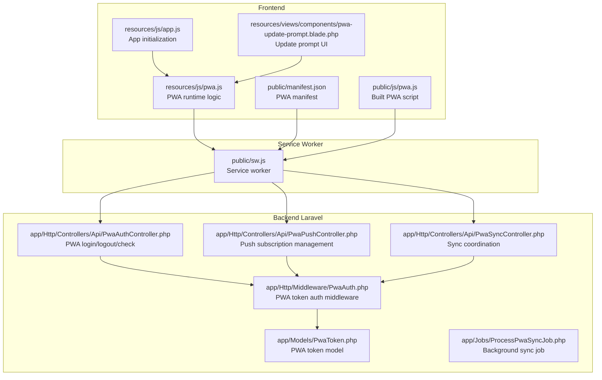
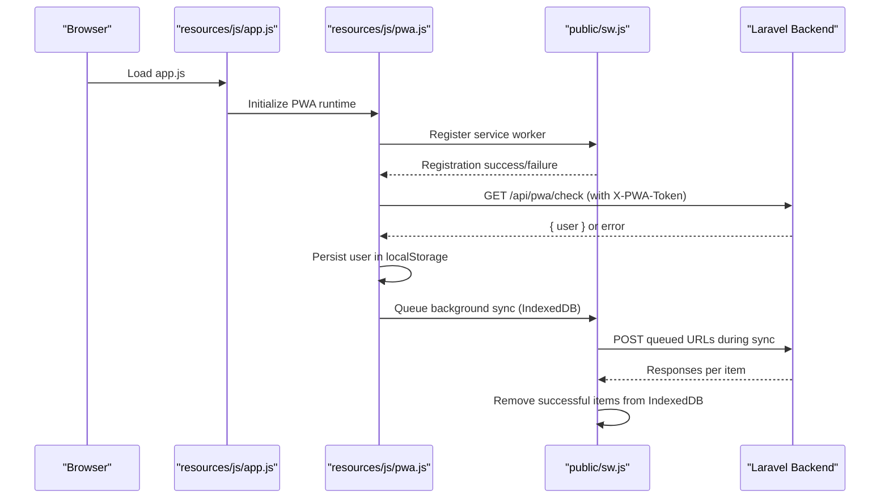
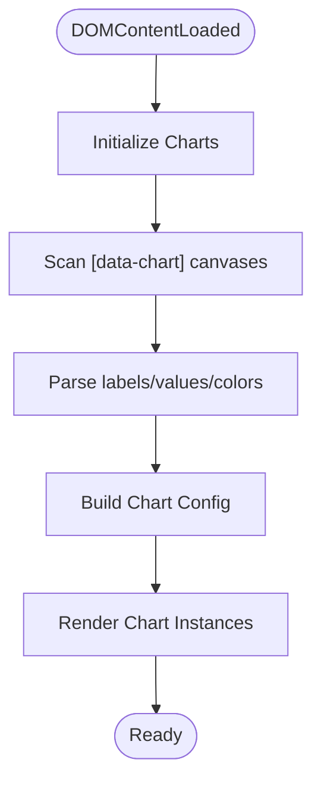
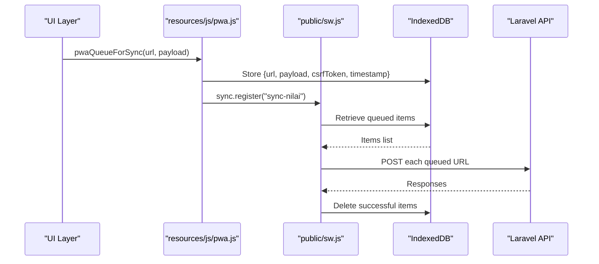
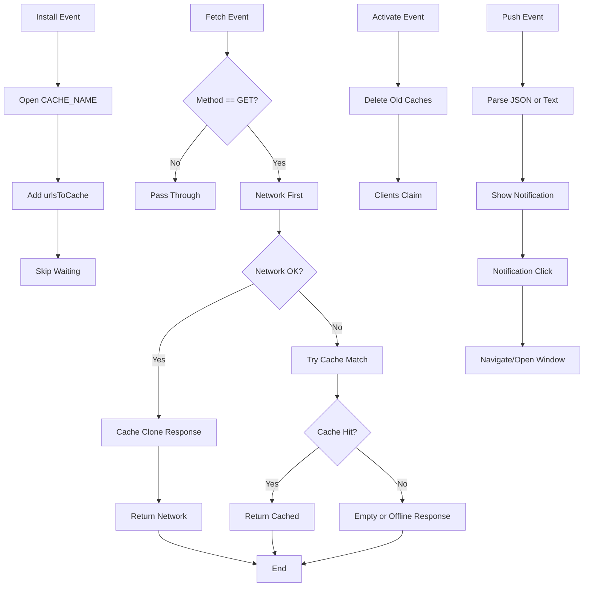
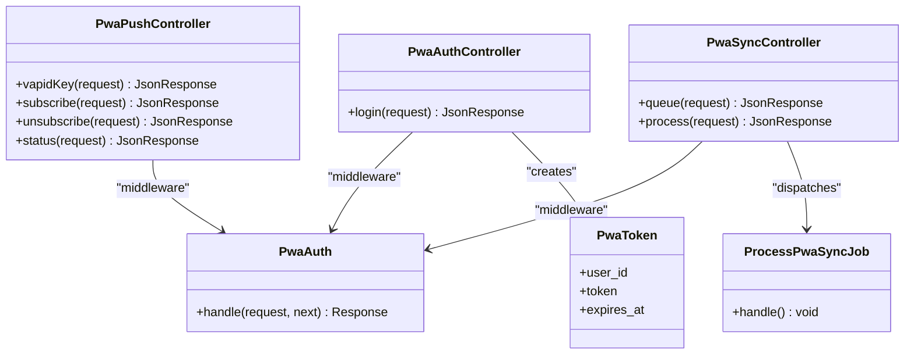
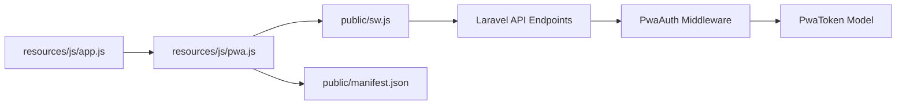

# JavaScript & PWA Implementation

<cite>
**Referenced Files in This Document**
- [app.js](file://resources/js/app.js)
- [pwa.js](file://resources/js/pwa.js)
- [sw.js](file://public/sw.js)
- [manifest.json](file://public/manifest.json)
- [pwa.js](file://public/js/pwa.js)
- [PwaAuthController.php](file://app/Http/Controllers/Api/PwaAuthController.php)
- [PwaPushController.php](file://app/Http/Controllers/Api/PwaPushController.php)
- [PwaSyncController.php](file://app/Http/Controllers/Api/PwaSyncController.php)
- [PwaAuth.php](file://app/Http/Middleware/PwaAuth.php)
- [PwaToken.php](file://app/Models/PwaToken.php)
- [ProcessPwaSyncJob.php](file://app/Jobs/ProcessPwaSyncJob.php)
- [pwa-update-prompt.blade.php](file://resources/views/components/pwa-update-prompt.blade.php)
</cite>

## Table of Contents
1. [Introduction](#introduction)
2. [Project Structure](#project-structure)
3. [Core Components](#core-components)
4. [Architecture Overview](#architecture-overview)
5. [Detailed Component Analysis](#detailed-component-analysis)
6. [Dependency Analysis](#dependency-analysis)
7. [Performance Considerations](#performance-considerations)
8. [Troubleshooting Guide](#troubleshooting-guide)
9. [Conclusion](#conclusion)

## Introduction
This document explains the JavaScript and Progressive Web App (PWA) implementation for the e-learning reporting system. It covers the main application entry point, PWA-specific functionality, service worker implementation for offline capabilities, background sync, and push notifications. It also documents the PWA manifest configuration, mobile app installation features, asset bundling, modern JavaScript features, browser compatibility considerations, and the integration between frontend JavaScript and the Laravel backend via API endpoints and real-time features. Practical guidance is included for PWA installation prompts, offline data handling, background synchronization, performance optimization, and debugging PWA functionality.

## Project Structure
The PWA implementation spans three layers:
- Frontend JavaScript: Application initialization and PWA runtime logic
- Service Worker: Offline caching, push notifications, and background sync
- Backend Laravel: PWA authentication, push subscriptions, and sync coordination

**Diagram sources**
- [app.js:1-87](file://resources/js/app.js#L1-L87)
- [pwa.js:1-336](file://resources/js/pwa.js#L1-L336)
- [manifest.json:1-29](file://public/manifest.json#L1-L29)
- [pwa.js:1-336](file://public/js/pwa.js#L1-L336)
- [pwa-update-prompt.blade.php:1-56](file://resources/views/components/pwa-update-prompt.blade.php#L1-L56)
- [sw.js:1-161](file://public/sw.js#L1-L161)
- [PwaAuthController.php:1-50](file://app/Http/Controllers/Api/PwaAuthController.php#L1-L50)
- [PwaPushController.php](file://app/Http/Controllers/Api/PwaPushController.php)
- [PwaSyncController.php](file://app/Http/Controllers/Api/PwaSyncController.php)
- [PwaAuth.php:1-43](file://app/Http/Middleware/PwaAuth.php#L1-L43)
- [PwaToken.php:1-200](file://app/Models/PwaToken.php#L1-L200)
- [ProcessPwaSyncJob.php:1-200](file://app/Jobs/ProcessPwaSyncJob.php#L1-L200)

**Section sources**
- [app.js:1-87](file://resources/js/app.js#L1-L87)
- [pwa.js:1-336](file://resources/js/pwa.js#L1-L336)
- [sw.js:1-161](file://public/sw.js#L1-L161)
- [manifest.json:1-29](file://public/manifest.json#L1-L29)
- [PwaAuthController.php:1-50](file://app/Http/Controllers/Api/PwaAuthController.php#L1-L50)
- [PwaAuth.php:1-43](file://app/Http/Middleware/PwaAuth.php#L1-L43)
- [PwaToken.php:1-200](file://app/Models/PwaToken.php#L1-L200)
- [ProcessPwaSyncJob.php:1-200](file://app/Jobs/ProcessPwaSyncJob.php#L1-L200)
- [pwa-update-prompt.blade.php:1-56](file://resources/views/components/pwa-update-prompt.blade.php#L1-L56)

## Core Components
- Application entry point initializes jQuery, Select2, and Chart.js, and bootstraps chart rendering on DOM ready.
- PWA runtime logic handles service worker registration, auto-login, push notification subscription, background sync, and update prompts.
- Service worker manages offline caching, push notifications, and IndexedDB-backed background sync.
- Laravel backend provides PWA authentication, push subscription management, and sync coordination with middleware enforcement.

**Section sources**
- [app.js:1-87](file://resources/js/app.js#L1-L87)
- [pwa.js:1-336](file://resources/js/pwa.js#L1-L336)
- [sw.js:1-161](file://public/sw.js#L1-L161)
- [PwaAuthController.php:1-50](file://app/Http/Controllers/Api/PwaAuthController.php#L1-L50)
- [PwaAuth.php:1-43](file://app/Http/Middleware/PwaAuth.php#L1-L43)

## Architecture Overview
The PWA architecture integrates frontend JavaScript, a service worker, and Laravel backend APIs. The frontend registers the service worker, persists PWA tokens in localStorage, and coordinates push subscriptions and background sync. The service worker intercepts network requests, serves cached content offline, displays push notifications, and performs background synchronization using IndexedDB. The backend enforces PWA authentication via a dedicated middleware and exposes endpoints for login, logout, push status, and sync.

**Diagram sources**
- [app.js:1-87](file://resources/js/app.js#L1-L87)
- [pwa.js:1-336](file://resources/js/pwa.js#L1-L336)
- [sw.js:1-161](file://public/sw.js#L1-L161)
- [PwaAuthController.php:1-50](file://app/Http/Controllers/Api/PwaAuthController.php#L1-L50)
- [PwaAuth.php:1-43](file://app/Http/Middleware/PwaAuth.php#L1-L43)

## Detailed Component Analysis

### Application Entry Point (app.js)
- Initializes jQuery and Select2 globally.
- Registers Chart.js and applies global theme defaults.
- Scans DOM for chart canvases and renders charts on DOMContentLoaded.

**Diagram sources**
- [app.js:38-86](file://resources/js/app.js#L38-L86)

**Section sources**
- [app.js:1-87](file://resources/js/app.js#L1-L87)

### PWA Runtime Logic (pwa.js)
- Service worker registration and update detection.
- PWA auto-login using localStorage token and backend check endpoint.
- PWA login/logout with token persistence and cleanup.
- Push notification subscription using VAPID keys and backend subscription endpoint.
- Background sync queue persisted in IndexedDB with sync tag registration.
- Update prompt UI integration and acceptance flow.

**Diagram sources**
- [pwa.js:271-309](file://resources/js/pwa.js#L271-L309)
- [sw.js:112-152](file://public/sw.js#L112-L152)

**Section sources**
- [pwa.js:1-336](file://resources/js/pwa.js#L1-L336)
- [pwa-update-prompt.blade.php:1-56](file://resources/views/components/pwa-update-prompt.blade.php#L1-L56)

### Service Worker (sw.js)
- Installs with a cache name and precaches selected URLs.
- Network-first fetch strategy with cache fallback and empty responses for certain destinations.
- Activates by deleting old caches and claiming clients.
- Handles push notifications with customizable title/body/icons and notification click navigation.
- Implements background sync for "sync-nilai" tag, reading from IndexedDB and posting to backend.

**Diagram sources**
- [sw.js:6-56](file://public/sw.js#L6-L56)
- [sw.js:16-43](file://public/sw.js#L16-L43)
- [sw.js:45-56](file://public/sw.js#L45-L56)
- [sw.js:58-110](file://public/sw.js#L58-L110)
- [sw.js:112-161](file://public/sw.js#L112-L161)

**Section sources**
- [sw.js:1-161](file://public/sw.js#L1-L161)

### PWA Manifest (manifest.json)
- Defines app metadata, display mode, theme colors, orientation, categories, scope, and icon set.
- Ensures proper installation on mobile devices and desktop shortcuts.

**Section sources**
- [manifest.json:1-29](file://public/manifest.json#L1-L29)

### Backend Integration
- PWA authentication controller validates credentials, generates long-lived tokens, and returns user info.
- PWA authentication middleware enforces token presence and validity for protected endpoints.
- Push subscription controller manages VAPID key retrieval and subscription persistence.
- Sync controller coordinates background sync operations and job processing.

**Diagram sources**
- [PwaAuthController.php:1-50](file://app/Http/Controllers/Api/PwaAuthController.php#L1-L50)
- [PwaAuth.php:1-43](file://app/Http/Middleware/PwaAuth.php#L1-L43)
- [PwaToken.php:1-200](file://app/Models/PwaToken.php#L1-L200)
- [PwaPushController.php](file://app/Http/Controllers/Api/PwaPushController.php)
- [PwaSyncController.php](file://app/Http/Controllers/Api/PwaSyncController.php)
- [ProcessPwaSyncJob.php:1-200](file://app/Jobs/ProcessPwaSyncJob.php#L1-L200)

**Section sources**
- [PwaAuthController.php:1-50](file://app/Http/Controllers/Api/PwaAuthController.php#L1-L50)
- [PwaAuth.php:1-43](file://app/Http/Middleware/PwaAuth.php#L1-L43)
- [PwaToken.php:1-200](file://app/Models/PwaToken.php#L1-L200)
- [PwaPushController.php](file://app/Http/Controllers/Api/PwaPushController.php)
- [PwaSyncController.php](file://app/Http/Controllers/Api/PwaSyncController.php)
- [ProcessPwaSyncJob.php:1-200](file://app/Jobs/ProcessPwaSyncJob.php#L1-L200)

## Dependency Analysis
- Frontend depends on service worker for offline behavior and IndexedDB for background sync persistence.
- Service worker depends on backend endpoints for push VAPID keys, subscription management, and sync processing.
- Backend middleware ensures all PWA endpoints are protected by token validation.

**Diagram sources**
- [app.js:1-87](file://resources/js/app.js#L1-L87)
- [pwa.js:1-336](file://resources/js/pwa.js#L1-L336)
- [sw.js:1-161](file://public/sw.js#L1-L161)
- [PwaAuth.php:1-43](file://app/Http/Middleware/PwaAuth.php#L1-L43)
- [PwaToken.php:1-200](file://app/Models/PwaToken.php#L1-L200)

**Section sources**
- [pwa.js:1-336](file://resources/js/pwa.js#L1-L336)
- [sw.js:1-161](file://public/sw.js#L1-L161)
- [PwaAuth.php:1-43](file://app/Http/Middleware/PwaAuth.php#L1-L43)

## Performance Considerations
- Code splitting and lazy loading: Split large JavaScript bundles and defer non-critical features until needed. Use dynamic imports for optional modules.
- Asset bundling: Leverage the build pipeline to bundle and minify assets. Ensure the service worker cache strategy targets static assets efficiently.
- Caching strategies: Implement cache-first for static assets and network-first for dynamic content. Use cache versioning to avoid stale assets.
- Background sync: Queue only essential write operations (e.g., grades) to reduce IndexedDB growth and improve reliability.
- Chart rendering: Defer chart initialization until DOM is ready and limit concurrent instances to reduce memory usage.
- Push notifications: Request permission only when necessary and avoid excessive notifications to preserve battery life.

## Troubleshooting Guide
- Service worker lifecycle:
  - Verify registration in the browser console and check for errors.
  - Use the Application tab to inspect registrations, versions, and cache storage.
  - Force refresh to trigger the install and activate events.
- PWA update prompt:
  - Confirm the update prompt component is present and listens for service worker messages.
  - Test accepting updates and reloading the page to apply the new service worker.
- Background sync:
  - Inspect IndexedDB entries under the "erapor-pwa" database.
  - Trigger sync manually via DevTools Application panel and monitor network requests.
- Push notifications:
  - Ensure VAPID keys are fetched successfully and subscriptions are stored server-side.
  - Test notification click navigation and badge/icon rendering.
- Authentication:
  - Confirm X-PWA-Token header is present on protected endpoints.
  - Validate token expiration and user existence in the database.

**Section sources**
- [pwa-update-prompt.blade.php:1-56](file://resources/views/components/pwa-update-prompt.blade.php#L1-L56)
- [sw.js:112-161](file://public/sw.js#L112-L161)
- [pwa.js:271-309](file://resources/js/pwa.js#L271-L309)
- [PwaAuth.php:1-43](file://app/Http/Middleware/PwaAuth.php#L1-L43)

## Conclusion
The PWA implementation provides robust offline capabilities, push notifications, and background synchronization integrated with Laravel backend APIs. The frontend initializes efficiently, the service worker optimizes caching and background tasks, and the backend enforces secure PWA authentication. Following the performance and troubleshooting guidance ensures a reliable, high-performing PWA experience across devices and network conditions.