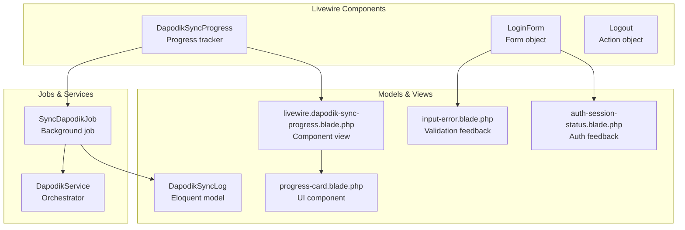
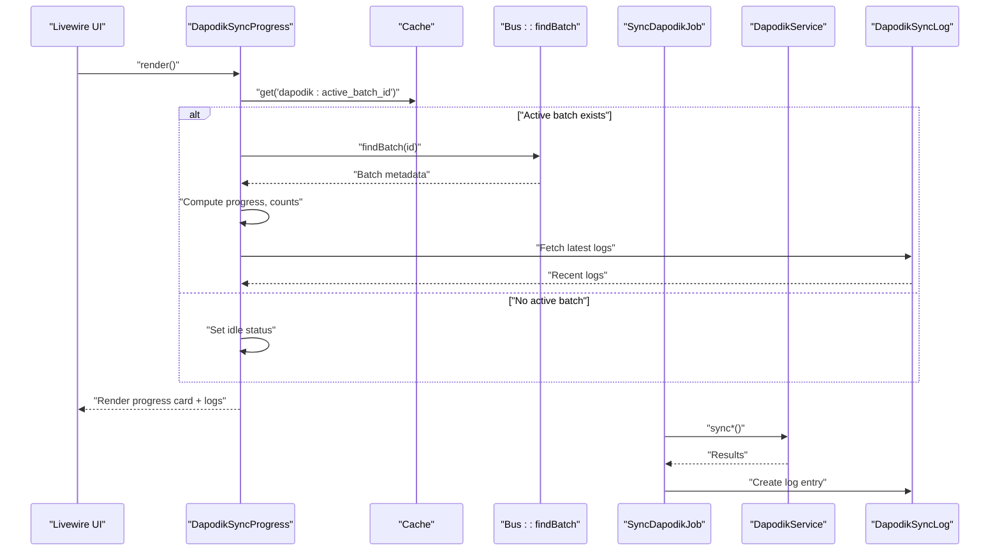
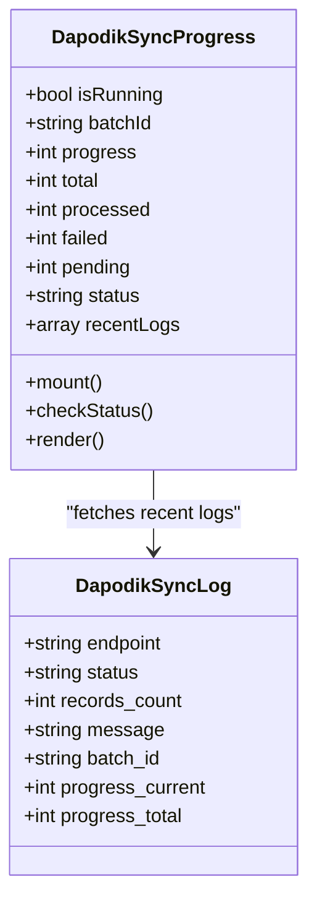
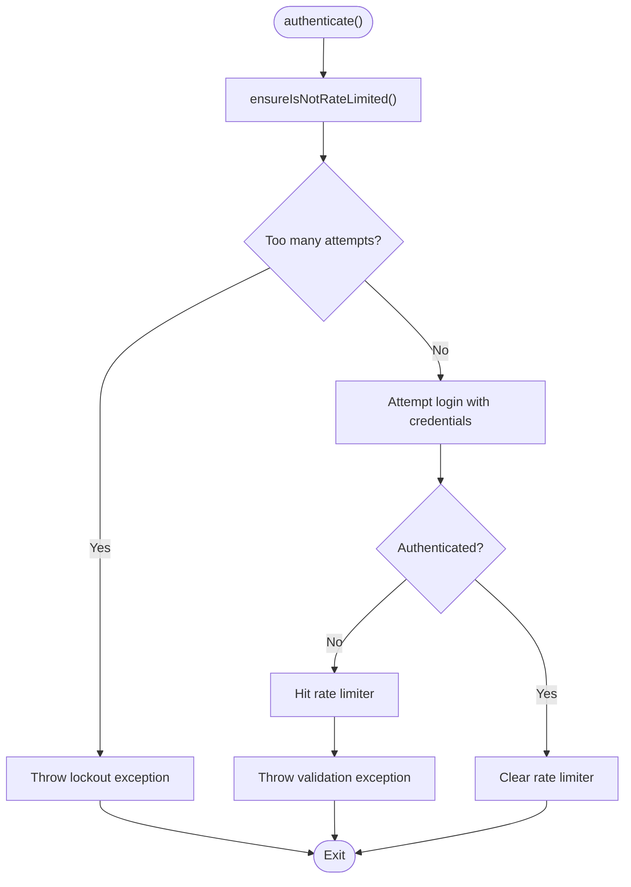
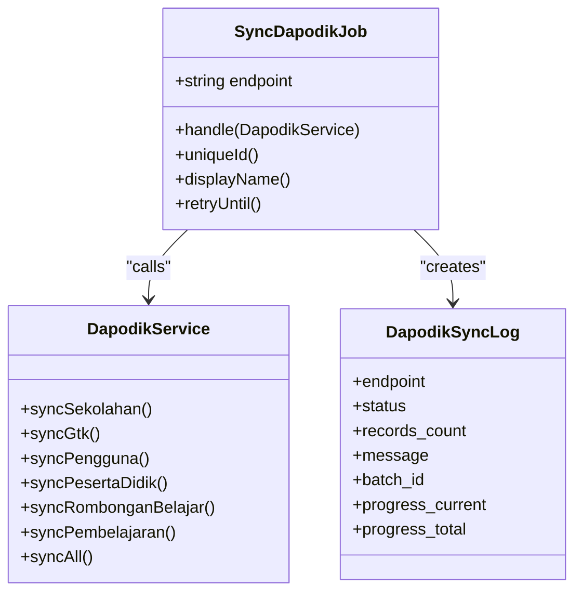
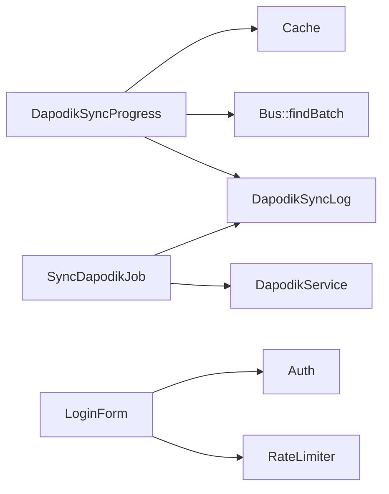

# Livewire Components

<cite>
**Referenced Files in This Document**
- [DapodikSyncProgress.php](file://app/Livewire/DapodikSyncProgress.php)
- [LoginForm.php](file://app/Livewire/Forms/LoginForm.php)
- [Logout.php](file://app/Livewire/Actions/Logout.php)
- [SyncDapodikJob.php](file://app/Jobs/SyncDapodikJob.php)
- [DapodikService.php](file://app/Services/DapodikService.php)
- [DapodikSyncLog.php](file://app/Models/DapodikSyncLog.php)
- [livewire.dapodik-sync-progress.blade.php](file://resources/views/livewire/dapodik-sync-progress.blade.php)
- [progress-card.blade.php](file://resources/views/components/progress-card.blade.php)
- [input-error.blade.php](file://resources/views/components/input-error.blade.php)
- [auth-session-status.blade.php](file://resources/views/components/auth-session-status.blade.php)
- [livewire.php](file://config/livewire.php)
</cite>

## Table of Contents
1. [Introduction](#introduction)
2. [Project Structure](#project-structure)
3. [Core Components](#core-components)
4. [Architecture Overview](#architecture-overview)
5. [Detailed Component Analysis](#detailed-component-analysis)
6. [Dependency Analysis](#dependency-analysis)
7. [Performance Considerations](#performance-considerations)
8. [Troubleshooting Guide](#troubleshooting-guide)
9. [Conclusion](#conclusion)
10. [Appendices](#appendices)

## Introduction
This document explains the Livewire reactive components in the project, focusing on component architecture, reactive data binding, state management, real-time updates, lifecycle, event handling, inter-component communication, form validation, error handling, and user feedback. It also documents the Dapodik sync progress component as a practical example of background job tracking and progress updates, along with component composition patterns, prop passing, slot usage, performance optimization, and guidance for building custom Livewire components integrated with existing Blade templates.

## Project Structure
The Livewire-related code is organized under:
- Components: app/Livewire
- Forms: app/Livewire/Forms
- Actions: app/Livewire/Actions
- Jobs: app/Jobs
- Services: app/Services/Dapodik*
- Models: app/Models
- Blade templates: resources/views/livewire and resources/views/components

**Diagram sources**
- [DapodikSyncProgress.php:11-79](file://app/Livewire/DapodikSyncProgress.php#L11-L79)
- [LoginForm.php:13-61](file://app/Livewire/Forms/LoginForm.php#L13-L61)
- [Logout.php:8-20](file://app/Livewire/Actions/Logout.php#L8-L20)
- [SyncDapodikJob.php:14-79](file://app/Jobs/SyncDapodikJob.php#L14-L79)
- [DapodikService.php:20-108](file://app/Services/DapodikService.php#L20-L108)
- [DapodikSyncLog.php:9-15](file://app/Models/DapodikSyncLog.php#L9-L15)
- [livewire.dapodik-sync-progress.blade.php](file://resources/views/livewire/dapodik-sync-progress.blade.php)
- [progress-card.blade.php](file://resources/views/components/progress-card.blade.php)
- [input-error.blade.php](file://resources/views/components/input-error.blade.php)
- [auth-session-status.blade.php](file://resources/views/components/auth-session-status.blade.php)

**Section sources**
- [DapodikSyncProgress.php:11-79](file://app/Livewire/DapodikSyncProgress.php#L11-L79)
- [LoginForm.php:13-61](file://app/Livewire/Forms/LoginForm.php#L13-L61)
- [Logout.php:8-20](file://app/Livewire/Actions/Logout.php#L8-L20)
- [SyncDapodikJob.php:14-79](file://app/Jobs/SyncDapodikJob.php#L14-L79)
- [DapodikService.php:20-108](file://app/Services/DapodikService.php#L20-L108)
- [DapodikSyncLog.php:9-15](file://app/Models/DapodikSyncLog.php#L9-L15)
- [livewire.dapodik-sync-progress.blade.php](file://resources/views/livewire/dapodik-sync-progress.blade.php)
- [progress-card.blade.php](file://resources/views/components/progress-card.blade.php)
- [input-error.blade.php](file://resources/views/components/input-error.blade.php)
- [auth-session-status.blade.php](file://resources/views/components/auth-session-status.blade.php)

## Core Components
- DapodikSyncProgress: Reactive component that tracks and displays Dapodik synchronization progress using batch metadata and recent logs.
- LoginForm: Form object encapsulating validation and authentication logic for login.
- Logout: Action object performing logout via Auth and Session guards.

Key reactive data and state management:
- Public properties serve as reactive state (e.g., progress counters, status, recent logs).
- Lifecycle hook mount initializes status checks.
- Event handler @poll triggers periodic status refresh.
- Real-time updates occur via Livewire’s reactivity without full-page reloads.

**Section sources**
- [DapodikSyncProgress.php:13-73](file://app/Livewire/DapodikSyncProgress.php#L13-L73)
- [LoginForm.php:15-37](file://app/Livewire/Forms/LoginForm.php#L15-L37)
- [Logout.php:13-19](file://app/Livewire/Actions/Logout.php#L13-L19)

## Architecture Overview
The Dapodik sync workflow integrates Livewire components, queued jobs, and persistent logs. Livewire polls for batch status and renders progress cards and recent log entries. Background jobs perform endpoint-specific synchronization and record outcomes.

**Diagram sources**
- [DapodikSyncProgress.php:36-73](file://app/Livewire/DapodikSyncProgress.php#L36-L73)
- [SyncDapodikJob.php:26-63](file://app/Jobs/SyncDapodikJob.php#L26-L63)
- [DapodikService.php:48-76](file://app/Services/DapodikService.php#L48-L76)
- [DapodikSyncLog.php:9-15](file://app/Models/DapodikSyncLog.php#L9-L15)

## Detailed Component Analysis

### DapodikSyncProgress Component
Purpose:
- Track and display the progress of a queued Dapodik synchronization batch.
- Show processed, failed, pending, total counts, and percentage progress.
- Present recent sync logs with endpoint, status, records count, and timestamp.

Reactive state:
- Properties include running flag, batch ID, progress metrics, status, and recent logs array.

Lifecycle and polling:
- Mount triggers initial status check.
- Polling event handler updates state periodically while the batch is active.

Real-time rendering:
- Uses a Blade view to render a progress card and recent logs list.

**Diagram sources**
- [DapodikSyncProgress.php:11-79](file://app/Livewire/DapodikSyncProgress.php#L11-L79)
- [DapodikSyncLog.php:9-15](file://app/Models/DapodikSyncLog.php#L9-L15)

**Section sources**
- [DapodikSyncProgress.php:13-73](file://app/Livewire/DapodikSyncProgress.php#L13-L73)
- [livewire.dapodik-sync-progress.blade.php](file://resources/views/livewire/dapodik-sync-progress.blade.php)
- [progress-card.blade.php](file://resources/views/components/progress-card.blade.php)

### LoginForm Form Object
Purpose:
- Encapsulate login form fields and validation.
- Authenticate users with rate limiting and lockout events.
- Provide a clean interface for Blade forms to bind and submit.

Validation and throttling:
- Uses Livewire Form attributes for field-level validation.
- Implements rate limiter checks and emits lockout events.
- Throws validation exceptions with localized messages.

**Diagram sources**
- [LoginForm.php:24-55](file://app/Livewire/Forms/LoginForm.php#L24-L55)

**Section sources**
- [LoginForm.php:15-61](file://app/Livewire/Forms/LoginForm.php#L15-L61)
- [input-error.blade.php](file://resources/views/components/input-error.blade.php)
- [auth-session-status.blade.php](file://resources/views/components/auth-session-status.blade.php)

### Logout Action Object
Purpose:
- Centralized logout logic invoked by UI actions.
- Logs out the guard, invalidates session, and regenerates CSRF token.

**Section sources**
- [Logout.php:13-19](file://app/Livewire/Actions/Logout.php#L13-L19)

### Dapodik Sync Job and Service
Purpose:
- Execute endpoint-specific synchronization tasks in the background.
- Record outcomes to the sync log with counts and progress totals.

Job orchestration:
- Matches endpoint to a service method and writes structured log entries.
- Handles exceptions by recording error logs and marking failure.

Service orchestration:
- Provides a unified interface delegating to specialized sync services.
- Supports a combined sync-all operation aggregating results.

**Diagram sources**
- [SyncDapodikJob.php:22-79](file://app/Jobs/SyncDapodikJob.php#L22-L79)
- [DapodikService.php:48-107](file://app/Services/DapodikService.php#L48-L107)
- [DapodikSyncLog.php:9-15](file://app/Models/DapodikSyncLog.php#L9-L15)

**Section sources**
- [SyncDapodikJob.php:26-63](file://app/Jobs/SyncDapodikJob.php#L26-L63)
- [DapodikService.php:78-107](file://app/Services/DapodikService.php#L78-L107)
- [DapodikSyncLog.php:9-15](file://app/Models/DapodikSyncLog.php#L9-L15)

## Dependency Analysis
- DapodikSyncProgress depends on:
  - Cache for active batch ID
  - Bus for batch metadata
  - DapodikSyncLog model for recent logs
- LoginForm depends on:
  - Auth for authentication
  - RateLimiter for throttling
  - ValidationException for feedback
- SyncDapodikJob depends on:
  - DapodikService for endpoint-specific sync
  - DapodikSyncLog for persistence
- DapodikService composes multiple specialized services for different endpoints.

**Diagram sources**
- [DapodikSyncProgress.php:39-72](file://app/Livewire/DapodikSyncProgress.php#L39-L72)
- [LoginForm.php:24-55](file://app/Livewire/Forms/LoginForm.php#L24-L55)
- [SyncDapodikJob.php:26-63](file://app/Jobs/SyncDapodikJob.php#L26-L63)

**Section sources**
- [DapodikSyncProgress.php:39-72](file://app/Livewire/DapodikSyncProgress.php#L39-L72)
- [LoginForm.php:24-55](file://app/Livewire/Forms/LoginForm.php#L24-L55)
- [SyncDapodikJob.php:26-63](file://app/Jobs/SyncDapodikJob.php#L26-L63)

## Performance Considerations
- Non-blocking polling: Livewire polling does not block other requests, enabling smooth UX during long-running batches.
- Parallel live updates: Live bindings update in parallel for faster responsiveness.
- Efficient state updates: Consolidated array/object updates reduce redundant re-renders.
- Debouncing: Prefer batching frequent updates (e.g., polling intervals) to avoid excessive backend calls.
- Caching: Use Cache for active batch ID to minimize repeated lookups.
- Minimal re-rendering: Keep reactive properties coarse-grained; compute derived values in the component rather than per-sub-property updates.

[No sources needed since this section provides general guidance]

## Troubleshooting Guide
Common issues and remedies:
- Authentication throttling: Excessive failed attempts trigger lockout; verify rate limiter thresholds and user feedback messages.
- Login errors: Validation exceptions surface form-level errors; ensure Blade input-error components are present.
- Sync progress not updating: Confirm polling event is emitted and Cache holds the active batch ID.
- Job failures: Inspect DapodikSyncLog entries for error statuses and messages; review job retries and timeout settings.
- Session logout: Ensure the action invokes guard logout and session invalidation.

**Section sources**
- [LoginForm.php:39-55](file://app/Livewire/Forms/LoginForm.php#L39-L55)
- [input-error.blade.php](file://resources/views/components/input-error.blade.php)
- [auth-session-status.blade.php](file://resources/views/components/auth-session-status.blade.php)
- [DapodikSyncProgress.php:36-73](file://app/Livewire/DapodikSyncProgress.php#L36-L73)
- [SyncDapodikJob.php:50-62](file://app/Jobs/SyncDapodikJob.php#L50-L62)
- [DapodikSyncLog.php:9-15](file://app/Models/DapodikSyncLog.php#L9-L15)
- [Logout.php:13-19](file://app/Livewire/Actions/Logout.php#L13-L19)

## Conclusion
Livewire enables reactive, real-time UI without full-page reloads. The Dapodik sync component demonstrates robust patterns: polling for batch status, rendering progress cards, and surfacing recent logs. Form objects centralize validation and authentication, while action objects encapsulate imperative behaviors. Jobs and services separate concerns for background processing and endpoint-specific logic. By leveraging Livewire’s performance improvements and best practices, developers can build scalable, user-friendly interactive experiences.

[No sources needed since this section summarizes without analyzing specific files]

## Appendices

### Component Composition Patterns
- Props and slots: Pass props to Blade components and use slots for flexible layouts.
- Progress card: Reuse progress-card.blade.php to render consistent progress UI.
- Validation and auth feedback: Use input-error.blade.php and auth-session-status.blade.php for consistent messaging.

**Section sources**
- [progress-card.blade.php](file://resources/views/components/progress-card.blade.php)
- [input-error.blade.php](file://resources/views/components/input-error.blade.php)
- [auth-session-status.blade.php](file://resources/views/components/auth-session-status.blade.php)

### Creating Custom Livewire Components
- Define a new Component class with public properties for reactive state.
- Implement lifecycle hooks (mount, hydrate, dehydrate) as needed.
- Emit events to trigger cross-component updates.
- Bind Blade directives (e.g., wire:model, wire:click) to component methods.
- Use config/livewire.php to tune runtime behavior.

**Section sources**
- [livewire.php](file://config/livewire.php)