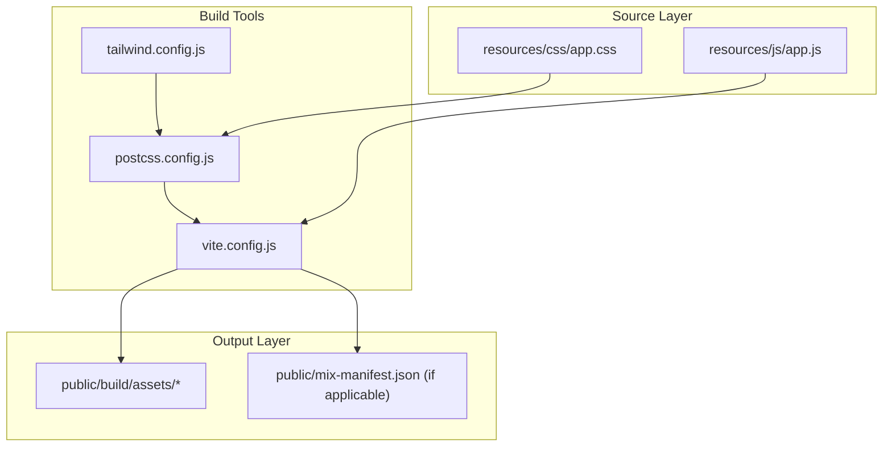
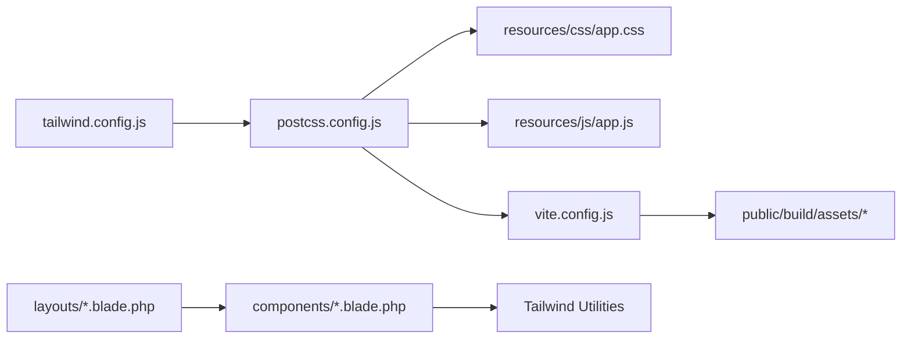

# Responsive Design & Styling

<cite>
**Referenced Files in This Document**
- [tailwind.config.js](file://tailwind.config.js)
- [postcss.config.js](file://postcss.config.js)
- [vite.config.js](file://vite.config.js)
- [app.css](file://resources/css/app.css)
- [app.js](file://resources/js/app.js)
- [app.blade.php](file://resources/views/layouts/app.blade.php)
- [guest.blade.php](file://resources/views/layouts/guest.blade.php)
- [topbar.blade.php](file://resources/views/components/topbar.blade.php)
- [sidebar-guru.blade.php](file://resources/views/components/sidebar-guru.blade.php)
- [responsive-nav-link.blade.php](file://resources/views/components/responsive-nav-link.blade.php)
- [nav-link.blade.php](file://resources/views/components/nav-link.blade.php)
- [primary-button.blade.php](file://resources/views/components/primary-button.blade.php)
- [secondary-button.blade.php](file://resources/views/components/secondary-button.blade.php)
- [text-input.blade.php](file://resources/views/components/text-input.blade.php)
- [dropdown.blade.php](file://resources/views/components/dropdown.blade.php)
- [modal.blade.php](file://resources/views/components/modal.blade.php)
- [stat-card.blade.php](file://resources/views/components/stat-card.blade.php)
- [progress-card.blade.php](file://resources/views/components/progress-card.blade.php)
- [welcome-banner.blade.php](file://resources/views/components/welcome-banner.blade.php)
- [semester-switcher.blade.php](file://resources/views/components/semester-switcher.blade.php)
- [quick-action.blade.php](file://resources/views/components/quick-action.blade.php)
- [flash-message.blade.php](file://resources/views/components/flash-message.blade.php)
- [action-message.blade.php](file://resources/views/components/action-message.blade.php)
- [input-error.blade.php](file://resources/views/components/input-error.blade.php)
- [input-label.blade.php](file://resources/views/components/input-label.blade.php)
- [dashboard.blade.php](file://resources/views/dashboard.blade.php)
- [profile.blade.php](file://resources/views/profile.blade.php)
- [guru dashboard.blade.php](file://resources/views/guru/dashboard.blade.php)
- [tu dashboard.blade.php](file://resources/views/tu/dashboard.blade.php)
- [pwa-update-prompt.blade.php](file://resources/views/components/pwa-update-prompt.blade.php)
- [pwa.js](file://public/js/pwa.js)
- [manifest.json](file://public/manifest.json)
- [sw.js](file://public/sw.js)
</cite>

## Table of Contents
1. [Introduction](#introduction)
2. [Project Structure](#project-structure)
3. [Core Components](#core-components)
4. [Architecture Overview](#architecture-overview)
5. [Detailed Component Analysis](#detailed-component-analysis)
6. [Dependency Analysis](#dependency-analysis)
7. [Performance Considerations](#performance-considerations)
8. [Troubleshooting Guide](#troubleshooting-guide)
9. [Conclusion](#conclusion)
10. [Appendices](#appendices)

## Introduction
This document explains the responsive design and styling system of the application, focusing on Tailwind CSS integration, PostCSS processing, and Vite asset compilation. It covers the design system architecture, responsive breakpoints, mobile-first principles, cross-device compatibility, component-specific styles, global themes, utility-first approach, design tokens, color schemes, typography, spacing conventions, accessibility, and practical guidance for extending the system.

## Project Structure
The styling pipeline is organized around three pillars:
- Tailwind CSS configuration defines design tokens, breakpoints, and plugins.
- PostCSS orchestrates transformations and plugin execution.
- Vite compiles and bundles assets for development and production.

**Diagram sources**
- [app.css](file://resources/css/app.css)
- [postcss.config.js](file://postcss.config.js)
- [tailwind.config.js](file://tailwind.config.js)
- [vite.config.js](file://vite.config.js)

**Section sources**
- [app.css](file://resources/css/app.css)
- [postcss.config.js](file://postcss.config.js)
- [tailwind.config.js](file://tailwind.config.js)
- [vite.config.js](file://vite.config.js)

## Core Components
- Tailwind CSS configuration controls design tokens, breakpoints, and plugins.
- PostCSS configuration enables Tailwind, nesting, and autoprefixing.
- Vite handles asset entry points, dev server, and production builds.
- Blade components encapsulate reusable UI with utility-first Tailwind classes.
- Layout templates apply global themes and responsive scaffolding.

Key implementation references:
- Tailwind configuration: [tailwind.config.js](file://tailwind.config.js)
- PostCSS configuration: [postcss.config.js](file://postcss.config.js)
- Asset entry points: [app.css](file://resources/css/app.css), [app.js](file://resources/js/app.js)
- Layout templates: [app.blade.php](file://resources/views/layouts/app.blade.php), [guest.blade.php](file://resources/views/layouts/guest.blade.php)
- Component library: [topbar.blade.php](file://resources/views/components/topbar.blade.php), [sidebar-guru.blade.php](file://resources/views/components/sidebar-guru.blade.php), [responsive-nav-link.blade.php](file://resources/views/components/responsive-nav-link.blade.php), [nav-link.blade.php](file://resources/views/components/nav-link.blade.php), [primary-button.blade.php](file://resources/views/components/primary-button.blade.php), [secondary-button.blade.php](file://resources/views/components/secondary-button.blade.php), [text-input.blade.php](file://resources/views/components/text-input.blade.php), [dropdown.blade.php](file://resources/views/components/dropdown.blade.php), [modal.blade.php](file://resources/views/components/modal.blade.php), [stat-card.blade.php](file://resources/views/components/stat-card.blade.php), [progress-card.blade.php](file://resources/views/components/progress-card.blade.php), [welcome-banner.blade.php](file://resources/views/components/welcome-banner.blade.php), [semester-switcher.blade.php](file://resources/views/components/semester-switcher.blade.php), [quick-action.blade.php](file://resources/views/components/quick-action.blade.php), [flash-message.blade.php](file://resources/views/components/flash-message.blade.php), [action-message.blade.php](file://resources/views/components/action-message.blade.php), [input-error.blade.php](file://resources/views/components/input-error.blade.php), [input-label.blade.php](file://resources/views/components/input-label.blade.php)

**Section sources**
- [tailwind.config.js](file://tailwind.config.js)
- [postcss.config.js](file://postcss.config.js)
- [app.css](file://resources/css/app.css)
- [app.js](file://resources/js/app.js)
- [app.blade.php](file://resources/views/layouts/app.blade.php)
- [guest.blade.php](file://resources/views/layouts/guest.blade.php)
- [topbar.blade.php](file://resources/views/components/topbar.blade.php)
- [sidebar-guru.blade.php](file://resources/views/components/sidebar-guru.blade.php)
- [responsive-nav-link.blade.php](file://resources/views/components/responsive-nav-link.blade.php)
- [nav-link.blade.php](file://resources/views/components/nav-link.blade.php)
- [primary-button.blade.php](file://resources/views/components/primary-button.blade.php)
- [secondary-button.blade.php](file://resources/views/components/secondary-button.blade.php)
- [text-input.blade.php](file://resources/views/components/text-input.blade.php)
- [dropdown.blade.php](file://resources/views/components/dropdown.blade.php)
- [modal.blade.php](file://resources/views/components/modal.blade.php)
- [stat-card.blade.php](file://resources/views/components/stat-card.blade.php)
- [progress-card.blade.php](file://resources/views/components/progress-card.blade.php)
- [welcome-banner.blade.php](file://resources/views/components/welcome-banner.blade.php)
- [semester-switcher.blade.php](file://resources/views/components/semester-switcher.blade.php)
- [quick-action.blade.php](file://resources/views/components/quick-action.blade.php)
- [flash-message.blade.php](file://resources/views/components/flash-message.blade.php)
- [action-message.blade.php](file://resources/views/components/action-message.blade.php)
- [input-error.blade.php](file://resources/views/components/input-error.blade.php)
- [input-label.blade.php](file://resources/views/components/input-label.blade.php)

## Architecture Overview
The responsive styling architecture follows a utility-first approach with Tailwind CSS, processed through PostCSS and built via Vite. Layouts and components consistently apply responsive modifiers to adapt to various screen sizes.

```mermaid
graph TB
subgraph "Configuration"
TW["tailwind.config.js"]
PC["postcss.config.js"]
VI["vite.config.js"]
end
subgraph "Templates"
L_APP["layouts/app.blade.php"]
L_GUEST["layouts/guest.blade.php"]
end
subgraph "Components"
C_TOPBAR["components/topbar.blade.php"]
C_SIDEBAR["components/sidebar-guru.blade.php"]
C_NAV["components/responsive-nav-link.blade.php"]
C_BTN["components/primary-button.blade.php"]
C_INPUT["components/text-input.blade.php"]
C_DROP["components/dropdown.blade.php"]
C_MODAL["components/modal.blade.php"]
C_CARD["components/stat-card.blade.php"]
C_PROGRESS["components/progress-card.blade.php"]
C_BANNER["components/welcome-banner.blade.php"]
C_SWITCH["components/semester-switcher.blade.php"]
C_ACTION["components/quick-action.blade.php"]
C_FLASH["components/flash-message.blade.php"]
C_MSG["components/action-message.blade.php"]
C_ERROR["components/input-error.blade.php"]
C_LABEL["components/input-label.blade.php"]
end
subgraph "Assets"
CSS["resources/css/app.css"]
JS["resources/js/app.js"]
OUT["public/build/assets/*"]
end
CSS --> PC
PC --> TW
JS --> VI
VI --> OUT
L_APP --> C_TOPBAR
L_APP --> C_SIDEBAR
L_APP --> C_NAV
L_APP --> C_BTN
L_APP --> C_INPUT
L_APP --> C_DROP
L_APP --> C_MODAL
L_APP --> C_CARD
L_APP --> C_PROGRESS
L_APP --> C_BANNER
L_APP --> C_SWITCH
L_APP --> C_ACTION
L_APP --> C_FLASH
L_APP --> C_MSG
L_APP --> C_ERROR
L_APP --> C_LABEL
```

**Diagram sources**
- [tailwind.config.js](file://tailwind.config.js)
- [postcss.config.js](file://postcss.config.js)
- [vite.config.js](file://vite.config.js)
- [app.css](file://resources/css/app.css)
- [app.js](file://resources/js/app.js)
- [app.blade.php](file://resources/views/layouts/app.blade.php)
- [guest.blade.php](file://resources/views/layouts/guest.blade.php)
- [topbar.blade.php](file://resources/views/components/topbar.blade.php)
- [sidebar-guru.blade.php](file://resources/views/components/sidebar-guru.blade.php)
- [responsive-nav-link.blade.php](file://resources/views/components/responsive-nav-link.blade.php)
- [nav-link.blade.php](file://resources/views/components/nav-link.blade.php)
- [primary-button.blade.php](file://resources/views/components/primary-button.blade.php)
- [secondary-button.blade.php](file://resources/views/components/secondary-button.blade.php)
- [text-input.blade.php](file://resources/views/components/text-input.blade.php)
- [dropdown.blade.php](file://resources/views/components/dropdown.blade.php)
- [modal.blade.php](file://resources/views/components/modal.blade.php)
- [stat-card.blade.php](file://resources/views/components/stat-card.blade.php)
- [progress-card.blade.php](file://resources/views/components/progress-card.blade.php)
- [welcome-banner.blade.php](file://resources/views/components/welcome-banner.blade.php)
- [semester-switcher.blade.php](file://resources/views/components/semester-switcher.blade.php)
- [quick-action.blade.php](file://resources/views/components/quick-action.blade.php)
- [flash-message.blade.php](file://resources/views/components/flash-message.blade.php)
- [action-message.blade.php](file://resources/views/components/action-message.blade.php)
- [input-error.blade.php](file://resources/views/components/input-error.blade.php)
- [input-label.blade.php](file://resources/views/components/input-label.blade.php)

## Detailed Component Analysis

### Tailwind CSS Integration and Configuration
- Breakpoints: The configuration defines responsive breakpoint scales used across components.
- Plugins: Tailwind is extended with official plugins for forms and similar utilities.
- Content paths: Purge scanning targets Blade templates and JS files to remove unused CSS.
- Theme overrides: Colors, spacing, typography, and other tokens are centralized here.

Implementation references:
- [tailwind.config.js](file://tailwind.config.js)

**Section sources**
- [tailwind.config.js](file://tailwind.config.js)

### PostCSS Processing Pipeline
- Plugins: Tailwind, nested CSS, and autoprefixer are enabled to process styles.
- Order matters: Tailwind directives must precede nesting and vendor prefixes.
- Build-time transforms: Ensures modern CSS is compatible across browsers.

Implementation references:
- [postcss.config.js](file://postcss.config.js)

**Section sources**
- [postcss.config.js](file://postcss.config.js)

### Asset Compilation with Vite
- Entry points: CSS and JS entry points compile to hashed assets under the build directory.
- Dev server: Hot reload and fast rebuild during development.
- Production: Minified assets with deterministic filenames for cache busting.

Implementation references:
- [vite.config.js](file://vite.config.js)
- [app.css](file://resources/css/app.css)
- [app.js](file://resources/js/app.js)

**Section sources**
- [vite.config.js](file://vite.config.js)
- [app.css](file://resources/css/app.css)
- [app.js](file://resources/js/app.js)

### Layout Templates and Global Themes
- App layout: Provides shared scaffolding, navigation, and responsive topbar/sidebars.
- Guest layout: Simplified theme for authentication and landing pages.
- Consistent spacing and typography: Derived from Tailwind theme tokens.

Implementation references:
- [app.blade.php](file://resources/views/layouts/app.blade.php)
- [guest.blade.php](file://resources/views/layouts/guest.blade.php)

**Section sources**
- [app.blade.php](file://resources/views/layouts/app.blade.php)
- [guest.blade.php](file://resources/views/layouts/guest.blade.php)

### Component Library and Utility-First Patterns
Reusable components demonstrate:
- Mobile-first responsive modifiers for padding, margin, grid, flexbox, and typography.
- Semantic button variants and form controls with consistent focus and disabled states.
- Dropdowns, modals, cards, and banners styled with utility classes for readability and maintainability.

Implementation references:
- [topbar.blade.php](file://resources/views/components/topbar.blade.php)
- [sidebar-guru.blade.php](file://resources/views/components/sidebar-guru.blade.php)
- [responsive-nav-link.blade.php](file://resources/views/components/responsive-nav-link.blade.php)
- [nav-link.blade.php](file://resources/views/components/nav-link.blade.php)
- [primary-button.blade.php](file://resources/views/components/primary-button.blade.php)
- [secondary-button.blade.php](file://resources/views/components/secondary-button.blade.php)
- [text-input.blade.php](file://resources/views/components/text-input.blade.php)
- [dropdown.blade.php](file://resources/views/components/dropdown.blade.php)
- [modal.blade.php](file://resources/views/components/modal.blade.php)
- [stat-card.blade.php](file://resources/views/components/stat-card.blade.php)
- [progress-card.blade.php](file://resources/views/components/progress-card.blade.php)
- [welcome-banner.blade.php](file://resources/views/components/welcome-banner.blade.php)
- [semester-switcher.blade.php](file://resources/views/components/semester-switcher.blade.php)
- [quick-action.blade.php](file://resources/views/components/quick-action.blade.php)
- [flash-message.blade.php](file://resources/views/components/flash-message.blade.php)
- [action-message.blade.php](file://resources/views/components/action-message.blade.php)
- [input-error.blade.php](file://resources/views/components/input-error.blade.php)
- [input-label.blade.php](file://resources/views/components/input-label.blade.php)

**Section sources**
- [topbar.blade.php](file://resources/views/components/topbar.blade.php)
- [sidebar-guru.blade.php](file://resources/views/components/sidebar-guru.blade.php)
- [responsive-nav-link.blade.php](file://resources/views/components/responsive-nav-link.blade.php)
- [nav-link.blade.php](file://resources/views/components/nav-link.blade.php)
- [primary-button.blade.php](file://resources/views/components/primary-button.blade.php)
- [secondary-button.blade.php](file://resources/views/components/secondary-button.blade.php)
- [text-input.blade.php](file://resources/views/components/text-input.blade.php)
- [dropdown.blade.php](file://resources/views/components/dropdown.blade.php)
- [modal.blade.php](file://resources/views/components/modal.blade.php)
- [stat-card.blade.php](file://resources/views/components/stat-card.blade.php)
- [progress-card.blade.php](file://resources/views/components/progress-card.blade.php)
- [welcome-banner.blade.php](file://resources/views/components/welcome-banner.blade.php)
- [semester-switcher.blade.php](file://resources/views/components/semester-switcher.blade.php)
- [quick-action.blade.php](file://resources/views/components/quick-action.blade.php)
- [flash-message.blade.php](file://resources/views/components/flash-message.blade.php)
- [action-message.blade.php](file://resources/views/components/action-message.blade.php)
- [input-error.blade.php](file://resources/views/components/input-error.blade.php)
- [input-label.blade.php](file://resources/views/components/input-label.blade.php)

### Responsive Breakpoint Strategy
- Mobile-first approach: Base styles target small screens; modifiers scale up for larger devices.
- Breakpoint usage: Components apply responsive variants for layout, spacing, typography, and navigation visibility.
- Cross-device compatibility: Grid and flex utilities ensure consistent rendering across phones, tablets, and desktops.

Implementation references:
- [responsive-nav-link.blade.php](file://resources/views/components/responsive-nav-link.blade.php)
- [sidebar-guru.blade.php](file://resources/views/components/sidebar-guru.blade.php)
- [stat-card.blade.php](file://resources/views/components/stat-card.blade.php)
- [progress-card.blade.php](file://resources/views/components/progress-card.blade.php)
- [welcome-banner.blade.php](file://resources/views/components/welcome-banner.blade.php)

**Section sources**
- [responsive-nav-link.blade.php](file://resources/views/components/responsive-nav-link.blade.php)
- [sidebar-guru.blade.php](file://resources/views/components/sidebar-guru.blade.php)
- [stat-card.blade.php](file://resources/views/components/stat-card.blade.php)
- [progress-card.blade.php](file://resources/views/components/progress-card.blade.php)
- [welcome-banner.blade.php](file://resources/views/components/welcome-banner.blade.php)

### Design Tokens, Color Schemes, Typography, and Spacing
- Colors: Centralized palette used across buttons, backgrounds, borders, and accents.
- Typography: Font families, font weights, line heights, and sizes applied consistently.
- Spacing: Scale-based spacing tokens for margins, paddings, gaps, and gutters.
- Utilities: Extensive spacing and sizing utilities enable rapid composition.

Implementation references:
- [tailwind.config.js](file://tailwind.config.js)
- [primary-button.blade.php](file://resources/views/components/primary-button.blade.php)
- [secondary-button.blade.php](file://resources/views/components/secondary-button.blade.php)
- [text-input.blade.php](file://resources/views/components/text-input.blade.php)
- [stat-card.blade.php](file://resources/views/components/stat-card.blade.php)

**Section sources**
- [tailwind.config.js](file://tailwind.config.js)
- [primary-button.blade.php](file://resources/views/components/primary-button.blade.php)
- [secondary-button.blade.php](file://resources/views/components/secondary-button.blade.php)
- [text-input.blade.php](file://resources/views/components/text-input.blade.php)
- [stat-card.blade.php](file://resources/views/components/stat-card.blade.php)

### Accessibility and Keyboard Navigation
- Focus states: Buttons and inputs define visible focus rings for keyboard users.
- Semantic markup: Headings, labels, and roles ensure screen reader compatibility.
- Interactive components: Dropdowns and modals manage focus trapping and ARIA attributes.

Implementation references:
- [primary-button.blade.php](file://resources/views/components/primary-button.blade.php)
- [text-input.blade.php](file://resources/views/components/text-input.blade.php)
- [dropdown.blade.php](file://resources/views/components/dropdown.blade.php)
- [modal.blade.php](file://resources/views/components/modal.blade.php)
- [input-label.blade.php](file://resources/views/components/input-label.blade.php)

**Section sources**
- [primary-button.blade.php](file://resources/views/components/primary-button.blade.php)
- [text-input.blade.php](file://resources/views/components/text-input.blade.php)
- [dropdown.blade.php](file://resources/views/components/dropdown.blade.php)
- [modal.blade.php](file://resources/views/components/modal.blade.php)
- [input-label.blade.php](file://resources/views/components/input-label.blade.php)

### Examples of Responsive Component Design
- Mobile navigation: A responsive navigation link collapses into a mobile menu on smaller screens.
- Adaptive cards: Stat and progress cards adjust column counts and spacing per breakpoint.
- Banner responsiveness: Welcome banner adapts headline sizes and padding for optimal readability.

Implementation references:
- [responsive-nav-link.blade.php](file://resources/views/components/responsive-nav-link.blade.php)
- [stat-card.blade.php](file://resources/views/components/stat-card.blade.php)
- [progress-card.blade.php](file://resources/views/components/progress-card.blade.php)
- [welcome-banner.blade.php](file://resources/views/components/welcome-banner.blade.php)

**Section sources**
- [responsive-nav-link.blade.php](file://resources/views/components/responsive-nav-link.blade.php)
- [stat-card.blade.php](file://resources/views/components/stat-card.blade.php)
- [progress-card.blade.php](file://resources/views/components/progress-card.blade.php)
- [welcome-banner.blade.php](file://resources/views/components/welcome-banner.blade.php)

### Cross-Device Compatibility and PWA Considerations
- PWA assets: Manifest and service worker are served from the public directory.
- Progressive enhancement: Components degrade gracefully without JavaScript.
- Device-optimized layouts: Media queries and responsive utilities ensure consistent rendering.

Implementation references:
- [manifest.json](file://public/manifest.json)
- [sw.js](file://public/sw.js)
- [pwa-update-prompt.blade.php](file://resources/views/components/pwa-update-prompt.blade.php)
- [pwa.js](file://public/js/pwa.js)

**Section sources**
- [manifest.json](file://public/manifest.json)
- [sw.js](file://public/sw.js)
- [pwa-update-prompt.blade.php](file://resources/views/components/pwa-update-prompt.blade.php)
- [pwa.js](file://public/js/pwa.js)

## Dependency Analysis
The styling system depends on Tailwind CSS, PostCSS, and Vite. Blade components depend on Tailwind utilities and layout templates for consistent scaffolding.

**Diagram sources**
- [tailwind.config.js](file://tailwind.config.js)
- [postcss.config.js](file://postcss.config.js)
- [app.css](file://resources/css/app.css)
- [app.js](file://resources/js/app.js)
- [vite.config.js](file://vite.config.js)
- [app.blade.php](file://resources/views/layouts/app.blade.php)
- [guest.blade.php](file://resources/views/layouts/guest.blade.php)
- [topbar.blade.php](file://resources/views/components/topbar.blade.php)
- [sidebar-guru.blade.php](file://resources/views/components/sidebar-guru.blade.php)
- [responsive-nav-link.blade.php](file://resources/views/components/responsive-nav-link.blade.php)

**Section sources**
- [tailwind.config.js](file://tailwind.config.js)
- [postcss.config.js](file://postcss.config.js)
- [app.css](file://resources/css/app.css)
- [app.js](file://resources/js/app.js)
- [vite.config.js](file://vite.config.js)
- [app.blade.php](file://resources/views/layouts/app.blade.php)
- [guest.blade.php](file://resources/views/layouts/guest.blade.php)
- [topbar.blade.php](file://resources/views/components/topbar.blade.php)
- [sidebar-guru.blade.php](file://resources/views/components/sidebar-guru.blade.php)
- [responsive-nav-link.blade.php](file://resources/views/components/responsive-nav-link.blade.php)

## Performance Considerations
- Tree shaking: Tailwind purges unused CSS based on configured content paths.
- Asset hashing: Vite generates hashed filenames for long-term caching.
- Lazy loading: Non-critical assets can be deferred; ensure interactive components remain responsive.
- Minification: PostCSS and Vite minify CSS and JS in production builds.

[No sources needed since this section provides general guidance]

## Troubleshooting Guide
Common issues and resolutions:
- Styles not updating: Rebuild assets after modifying Tailwind or PostCSS configuration.
- Unused CSS warnings: Verify content paths in Tailwind configuration include all template locations.
- Build errors: Confirm PostCSS plugin order and Vite entry points match the project structure.
- PWA updates: Ensure manifest and service worker files are present and cached correctly.

Implementation references:
- [tailwind.config.js](file://tailwind.config.js)
- [postcss.config.js](file://postcss.config.js)
- [vite.config.js](file://vite.config.js)
- [manifest.json](file://public/manifest.json)
- [sw.js](file://public/sw.js)

**Section sources**
- [tailwind.config.js](file://tailwind.config.js)
- [postcss.config.js](file://postcss.config.js)
- [vite.config.js](file://vite.config.js)
- [manifest.json](file://public/manifest.json)
- [sw.js](file://public/sw.js)

## Conclusion
The application employs a robust, utility-first responsive design system powered by Tailwind CSS, PostCSS, and Vite. Layouts and components consistently apply mobile-first strategies, responsive breakpoints, and design tokens to ensure cross-device compatibility. The configuration and build pipeline support maintainability, performance, and accessibility.

[No sources needed since this section summarizes without analyzing specific files]

## Appendices

### Practical Usage Examples
- Creating a new responsive card component:
  - Use spacing tokens for padding and margin.
  - Apply grid or flex utilities for layout.
  - Add responsive variants for column counts and alignment.
  - Reference existing cards for patterns: [stat-card.blade.php](file://resources/views/components/stat-card.blade.php), [progress-card.blade.php](file://resources/views/components/progress-card.blade.php).
- Adding a new button variant:
  - Define semantic variants in the component template.
  - Use color tokens from the central theme configuration.
  - Reference existing button components: [primary-button.blade.php](file://resources/views/components/primary-button.blade.php), [secondary-button.blade.php](file://resources/views/components/secondary-button.blade.php).
- Implementing a mobile navigation pattern:
  - Collapse navigation links into a hamburger menu on small screens.
  - Use responsive utilities to toggle visibility.
  - Reference the responsive navigation component: [responsive-nav-link.blade.php](file://resources/views/components/responsive-nav-link.blade.php).

**Section sources**
- [stat-card.blade.php](file://resources/views/components/stat-card.blade.php)
- [progress-card.blade.php](file://resources/views/components/progress-card.blade.php)
- [primary-button.blade.php](file://resources/views/components/primary-button.blade.php)
- [secondary-button.blade.php](file://resources/views/components/secondary-button.blade.php)
- [responsive-nav-link.blade.php](file://resources/views/components/responsive-nav-link.blade.php)