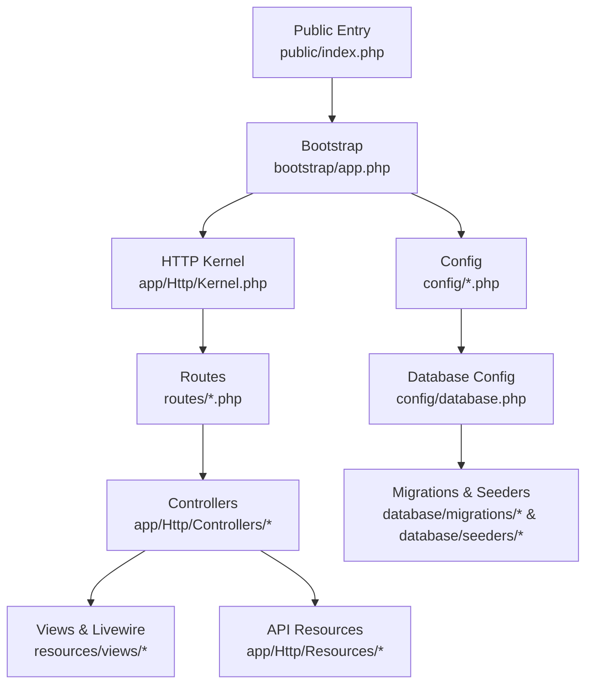
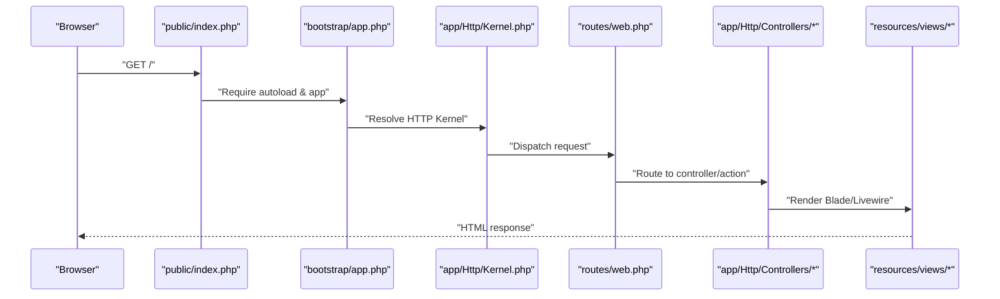
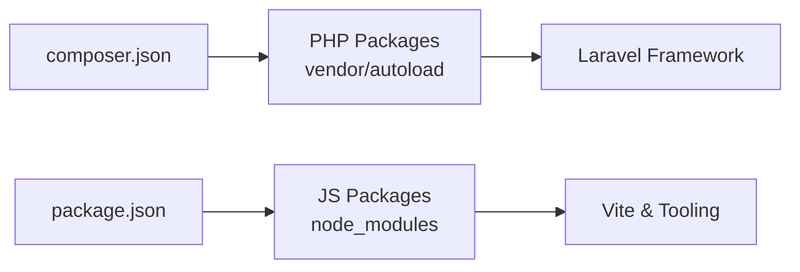

# Getting Started

<cite>
**Referenced Files in This Document**
- [README.md](file://README.md)
- [composer.json](file://composer.json)
- [package.json](file://package.json)
- [.env.example](file://.env.example)
- [config/database.php](file://config/database.php)
- [database/migrations/0001_01_01_000000_create_users_table.php](file://database/migrations/0001_01_01_000000_create_users_table.php)
- [database/seeders/UserSeeder.php](file://database/seeders/UserSeeder.php)
- [routes/web.php](file://routes/web.php)
- [public/index.php](file://public/index.php)
- [config/app.php](file://config/app.php)
</cite>

## Table of Contents
1. [Introduction](#introduction)
2. [Project Structure](#project-structure)
3. [Core Components](#core-components)
4. [Architecture Overview](#architecture-overview)
5. [Detailed Component Analysis](#detailed-component-analysis)
6. [Dependency Analysis](#dependency-analysis)
7. [Performance Considerations](#performance-considerations)
8. [Troubleshooting Guide](#troubleshooting-guide)
9. [Conclusion](#conclusion)
10. [Appendices](#appendices)

## Introduction
This guide helps you install and run RaporKM Laravel locally for development. It covers prerequisites, step-by-step installation, environment configuration, database setup, initial data seeding, development server startup, and first-time access. It also includes troubleshooting tips and optional Docker setup guidance.

## Project Structure
RaporKM is a Laravel application with a standard MVC layout, Livewire components, Blade views, API resources, and extensive database migrations and seeders. Key areas:
- Application code under app/
- HTTP routes in routes/
- Frontend assets managed via Vite (JavaScript/CSS)
- Database migrations and seeders under database/
- Configuration under config/
- Public entry point at public/index.php

**Diagram sources**
- [public/index.php:1-200](file://public/index.php#L1-L200)
- [bootstrap/app.php:1-200](file://bootstrap/app.php#L1-L200)
- [routes/web.php:1-200](file://routes/web.php#L1-L200)
- [config/database.php:1-200](file://config/database.php#L1-L200)

**Section sources**
- [README.md:1-200](file://README.md#L1-L200)
- [composer.json:1-200](file://composer.json#L1-L200)
- [package.json:1-200](file://package.json#L1-L200)

## Core Components
- Laravel Framework: Web application framework powering routing, middleware, controllers, and service providers.
- Database Layer: Eloquent ORM with migrations and seeders for schema and demo data.
- Frontend Toolchain: Vite for asset compilation and Tailwind CSS integration.
- Authentication & Roles: Built-in authentication scaffolding plus role-based access control via policies and middleware.
- API Surface: RESTful API endpoints under routes/api.php with resource classes.

**Section sources**
- [composer.json:1-200](file://composer.json#L1-L200)
- [package.json:1-200](file://package.json#L1-L200)
- [config/app.php:1-200](file://config/app.php#L1-L200)

## Architecture Overview
High-level runtime flow:
- Client requests enter via public/index.php and bootstrap the Laravel application.
- HTTP kernel handles middleware stacks and route dispatching.
- Routes map to controllers or Livewire components.
- Controllers interact with Eloquent models and return views or API responses.
- Database operations use migrations and seeders during setup.

**Diagram sources**
- [public/index.php:1-200](file://public/index.php#L1-L200)
- [bootstrap/app.php:1-200](file://bootstrap/app.php#L1-L200)
- [routes/web.php:1-200](file://routes/web.php#L1-L200)

## Detailed Component Analysis

### Prerequisites
- PHP: Version requirements are defined in composer.json. Ensure your local PHP version satisfies the ^ requirement listed there.
- Laravel: The project declares framework dependencies in composer.json; Composer will resolve compatible Laravel versions.
- Database: MySQL is configured in config/database.php. Ensure MySQL is installed and accessible.
- Node.js and npm: Required for asset compilation (Vite). Install Node.js LTS and npm per package.json engines or recommended versions.
- Git: To clone the repository.

Verification steps:
- Confirm PHP version meets composer.json requirements.
- Verify Composer availability.
- Confirm MySQL service is running and credentials are ready.
- Confirm Node.js and npm versions meet package.json requirements.

**Section sources**
- [composer.json:1-200](file://composer.json#L1-L200)
- [package.json:1-200](file://package.json#L1-L200)
- [config/database.php:1-200](file://config/database.php#L1-L200)

### Step-by-Step Installation

1) Clone the repository
- Use Git to clone the repository to your machine.

2) Install PHP dependencies
- Navigate to the project root and run Composer to install PHP packages.

3) Install JavaScript dependencies
- Install Node.js packages using npm.

4) Create and configure the .env file
- Copy the example environment file to .env and set database credentials and application key.

5) Generate application key
- Run the Artisan command to generate the APP_KEY.

6) Configure database connection
- Set DB_CONNECTION, DB_HOST, DB_PORT, DB_DATABASE, DB_USERNAME, and DB_PASSWORD in .env according to your MySQL setup.

7) Run database migrations
- Execute migrations to create tables.

8) Seed initial data
- Run seeders to populate reference and demo data.

9) Compile assets
- Build frontend assets with npm run build or dev script depending on environment.

10) Start the development server
- Launch the Laravel development server.

11) Access the application
- Open the application URL in your browser.

Verification steps:
- Ensure migrations ran without errors.
- Confirm seeders executed successfully.
- Verify assets compiled without errors.
- Log in using the seeded admin account.

**Section sources**
- [README.md:1-200](file://README.md#L1-L200)
- [.env.example:1-200](file://.env.example#L1-L200)
- [config/database.php:1-200](file://config/database.php#L1-L200)
- [database/migrations/0001_01_01_000000_create_users_table.php:1-200](file://database/migrations/0001_01_01_000000_create_users_table.php#L1-L200)
- [database/seeders/UserSeeder.php:1-200](file://database/seeders/UserSeeder.php#L1-L200)

### Environment Configuration
- Copy .env.example to .env.
- Set APP_ENV=local and APP_DEBUG=true for development.
- Configure database credentials in .env to match your MySQL instance.
- Optionally set APP_URL to your local domain or localhost.

**Section sources**
- [.env.example:1-200](file://.env.example#L1-L200)
- [config/app.php:1-200](file://config/app.php#L1-L200)

### Database Setup
- Ensure MySQL is installed and running.
- Create a database and user with appropriate permissions.
- Update .env with DB_* variables.
- Run migrations to create tables.
- Run seeders to populate initial data.

**Section sources**
- [config/database.php:1-200](file://config/database.php#L1-L200)
- [database/migrations/0001_01_01_000000_create_users_table.php:1-200](file://database/migrations/0001_01_01_000000_create_users_table.php#L1-L200)
- [database/seeders/UserSeeder.php:1-200](file://database/seeders/UserSeeder.php#L1-L200)

### Development Server
- Start the Laravel development server.
- Access the application via the configured APP_URL or default local address.

**Section sources**
- [routes/web.php:1-200](file://routes/web.php#L1-L200)
- [config/app.php:1-200](file://config/app.php#L1-L200)

### Initial User Account and Access
- After running seeders, an administrator user is created.
- Use the credentials provided by the seeder to log in and configure the system.

**Section sources**
- [database/seeders/UserSeeder.php:1-200](file://database/seeders/UserSeeder.php#L1-L200)

### Alternative Local Environments
- XAMPP/WAMP: Use the Apache/PHP stack provided by XAMPP/WAMP. Ensure PHP extensions align with composer.json requirements. Point your browser to the project’s public directory.
- Docker: Define containers for PHP (with Composer), Nginx/Apache, and MySQL. Mount the project directory, expose ports, and initialize services. Set environment variables in docker-compose.yml to match .env.

[No sources needed since this section provides general guidance]

## Dependency Analysis
External dependencies are declared in composer.json and package.json. Composer manages PHP packages and Laravel framework resolution. npm manages JavaScript tooling (Vite, Tailwind, etc.).

**Diagram sources**
- [composer.json:1-200](file://composer.json#L1-L200)
- [package.json:1-200](file://package.json#L1-L200)

**Section sources**
- [composer.json:1-200](file://composer.json#L1-L200)
- [package.json:1-200](file://package.json#L1-L200)

## Performance Considerations
- Use production-ready PHP and MySQL configurations for performance-sensitive environments.
- Keep Composer and npm dependencies updated.
- Leverage Laravel caching for routes, configs, and views in production-like environments.

[No sources needed since this section provides general guidance]

## Troubleshooting Guide
Common issues and resolutions:
- Composer install fails due to PHP version mismatch: Align PHP version with composer.json requirements.
- npm install fails due to Node.js version mismatch: Install Node.js LTS and retry.
- Database connection errors: Verify DB_* variables in .env and MySQL accessibility.
- Migration/seeding errors: Re-run migrations and seeders after fixing configuration.
- Asset compilation failures: Clear node_modules and reinstall packages; ensure Vite config is correct.
- 500 errors after setup: Enable debug mode temporarily, check logs, and re-run setup steps.

**Section sources**
- [composer.json:1-200](file://composer.json#L1-L200)
- [package.json:1-200](file://package.json#L1-L200)
- [config/database.php:1-200](file://config/database.php#L1-L200)

## Conclusion
You now have the essentials to install RaporKM Laravel locally, configure the environment, run migrations and seeders, compile assets, and access the application. For ongoing development, keep dependencies updated and follow the troubleshooting steps when encountering issues.

## Appendices

### Appendix A: Quick Checklist
- PHP version meets requirements
- Composer installed
- MySQL running and credentials configured
- Node.js and npm installed
- .env copied and configured
- APP_KEY generated
- Migrations and seeders executed
- Assets compiled
- Development server started
- Administrator account available

**Section sources**
- [composer.json:1-200](file://composer.json#L1-L200)
- [package.json:1-200](file://package.json#L1-L200)
- [.env.example:1-200](file://.env.example#L1-L200)
- [config/database.php:1-200](file://config/database.php#L1-L200)
- [database/migrations/0001_01_01_000000_create_users_table.php:1-200](file://database/migrations/0001_01_01_000000_create_users_table.php#L1-L200)
- [database/seeders/UserSeeder.php:1-200](file://database/seeders/UserSeeder.php#L1-L200)