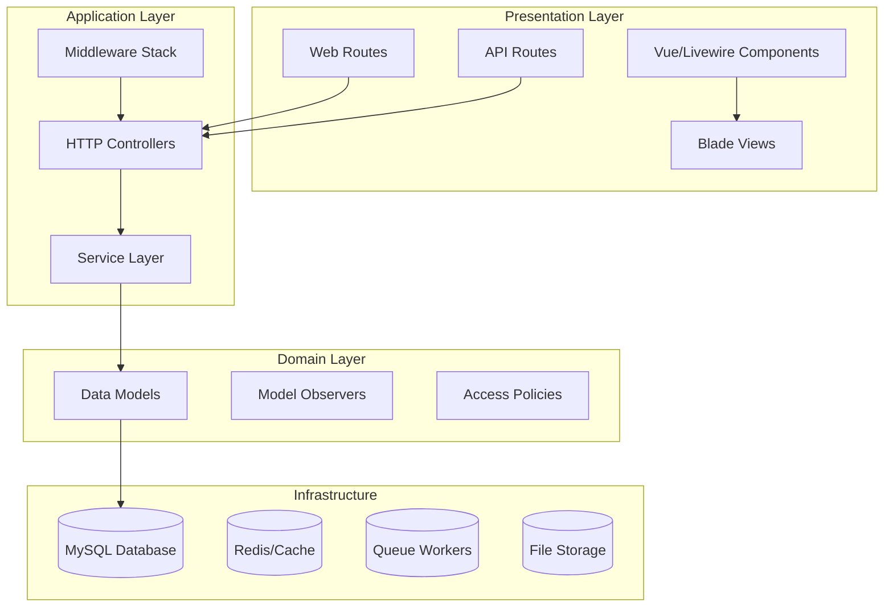
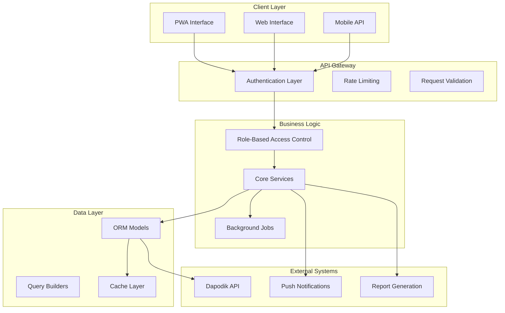
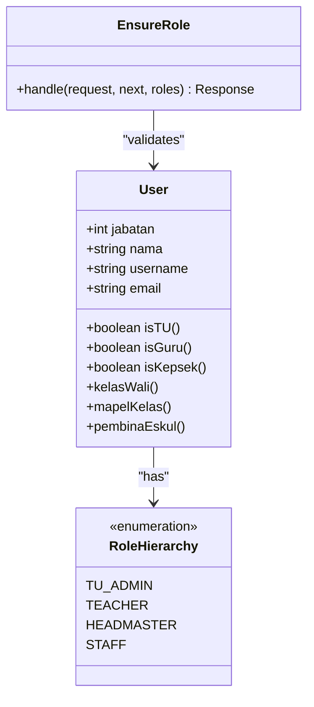
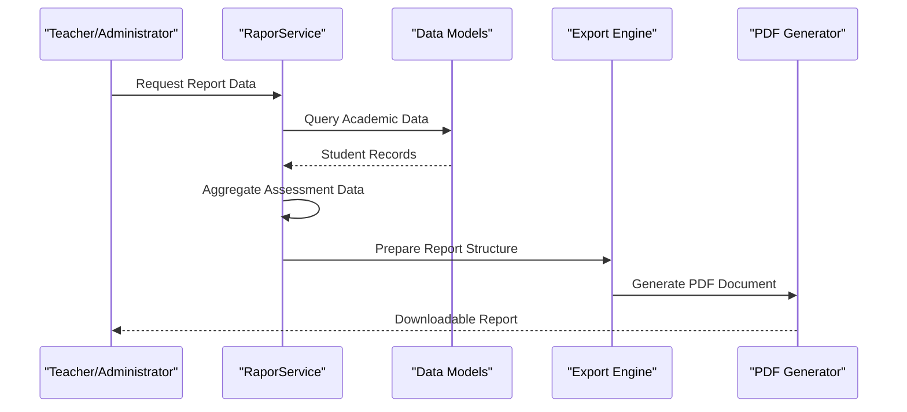
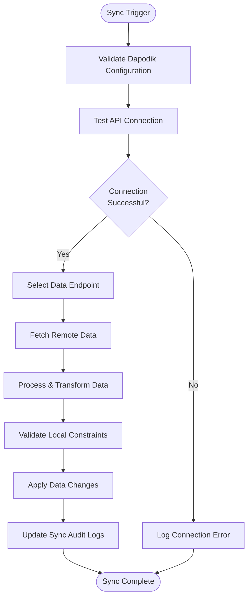
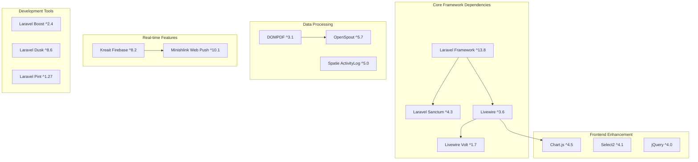

# Project Overview

<cite>
**Referenced Files in This Document**
- [README.md](file://README.md)
- [composer.json](file://composer.json)
- [package.json](file://package.json)
- [config/app.php](file://config/app.php)
- [config/e-rapor.php](file://config/e-rapor.php)
- [routes/web.php](file://routes/web.php)
- [routes/api.php](file://routes/api.php)
- [app/Http/Middleware/EnsureRole.php](file://app/Http/Middleware/EnsureRole.php)
- [app/Services/DapodikService.php](file://app/Services/DapodikService.php)
- [app/Services/RaporService.php](file://app/Services/RaporService.php)
- [app/Models/User.php](file://app/Models/User.php)
- [app/Models/Siswa.php](file://app/Models/Siswa.php)
- [app/Models/Kelas.php](file://app/Models/Kelas.php)
- [resources/js/app.js](file://resources/js/app.js)
- [docs/index.md](file://docs/index.md)
- [docs/manual-guru/index.md](file://docs/manual-guru/index.md)
- [docs/manual-tu/index.md](file://docs/manual-tu/index.md)
</cite>

## Table of Contents
1. [Introduction](#introduction)
2. [Project Structure](#project-structure)
3. [Core Components](#core-components)
4. [Architecture Overview](#architecture-overview)
5. [Detailed Component Analysis](#detailed-component-analysis)
6. [Dependency Analysis](#dependency-analysis)
7. [Performance Considerations](#performance-considerations)
8. [Troubleshooting Guide](#troubleshooting-guide)
9. [Conclusion](#conclusion)

## Introduction
E-Rapor KM is a comprehensive school report management system designed for educational institutions implementing the Merdeka Curriculum. The platform streamlines academic reporting, teacher assessment tools, administrative workflows, and national data synchronization through a unified Laravel-based architecture.

The system serves as a digital transformation solution that replaces traditional paper-based reporting with efficient, real-time, and standardized academic record management. Its core value proposition lies in providing a centralized platform where schools can manage student data, track academic progress, generate official reports, and maintain compliance with national education standards through Dapodik integration.

Key differentiators include:
- Real-time academic data processing and reporting
- Comprehensive teacher and administrator toolsets
- Seamless Dapodik data synchronization
- Role-based access control ensuring appropriate data governance
- Multi-format export capabilities for administrative reporting
- Mobile-responsive interface with Progressive Web App support

Target audience encompasses schools, teachers, administrators, and students who require efficient academic management and reporting solutions tailored to Indonesia's educational landscape.

## Project Structure
The project follows Laravel's conventional MVC architecture with clear separation of concerns across business logic, presentation, and data management layers.

**Diagram sources**
- [routes/web.php:1-298](file://routes/web.php#L1-L298)
- [routes/api.php:1-277](file://routes/api.php#L1-L277)

**Section sources**
- [routes/web.php:1-298](file://routes/web.php#L1-L298)
- [routes/api.php:1-277](file://routes/api.php#L1-L277)
- [composer.json:1-99](file://composer.json#L1-L99)

## Core Components
The system comprises several interconnected components that work together to deliver comprehensive educational management capabilities.

### Academic Management System
The academic management component handles curriculum implementation, assessment tracking, and grade computation for the Merdeka Curriculum framework. It supports multiple assessment types including formative, summative, and competency-based evaluations across various subject areas.

### Teacher Tools Suite
Teachers have access to specialized tools for classroom management, student assessment, attendance tracking, and report generation. The system provides dynamic dashboards that adapt based on user roles and responsibilities.

### Administrative Functions
Administrative capabilities include user management, school data administration, curriculum setup, and report generation. The system supports batch operations and automated workflows for efficient school administration.

### Dapodik Integration
Native integration with the Dapodik national education database ensures compliance with government reporting requirements and enables seamless data synchronization between local systems and national repositories.

### Real-Time Capabilities
The platform leverages Laravel's real-time features including WebSocket connections, background job processing, and instant notifications to provide responsive user experiences across all functional areas.

**Section sources**
- [docs/index.md:1-39](file://docs/index.md#L1-L39)
- [docs/manual-guru/index.md:1-34](file://docs/manual-guru/index.md#L1-L34)
- [docs/manual-tu/index.md:1-27](file://docs/manual-tu/index.md#L1-L27)

## Architecture Overview
The system employs a layered architecture pattern with clear separation between presentation, business logic, and data persistence layers.

**Diagram sources**
- [app/Http/Middleware/EnsureRole.php:1-24](file://app/Http/Middleware/EnsureRole.php#L1-L24)
- [app/Services/DapodikService.php:1-108](file://app/Services/DapodikService.php#L1-L108)
- [routes/api.php:65-271](file://routes/api.php#L65-L271)

The architecture emphasizes scalability, maintainability, and extensibility while maintaining strict data governance and security controls.

**Section sources**
- [config/e-rapor.php:1-9](file://config/e-rapor.php#L1-L9)
- [config/app.php:1-127](file://config/app.php#L1-L127)

## Detailed Component Analysis

### Role-Based Access Control System
The system implements a sophisticated role-based access control mechanism that dynamically adjusts available functionality based on user profiles and institutional responsibilities.

**Diagram sources**
- [app/Models/User.php:1-116](file://app/Models/User.php#L1-L116)
- [app/Http/Middleware/EnsureRole.php:1-24](file://app/Http/Middleware/EnsureRole.php#L1-L24)

The role hierarchy supports three primary user types: school administrators (TU), teachers, and headteachers, each with distinct permissions and functional scopes.

### Report Generation Service
The report generation system provides comprehensive academic reporting capabilities with support for multiple report formats and customization options.

**Diagram sources**
- [app/Services/RaporService.php:1-174](file://app/Services/RaporService.php#L1-L174)

The service orchestrates data collection from multiple sources including student records, assessment results, attendance data, and extracurricular activities to produce comprehensive academic reports.

### Dapodik Integration Architecture
The Dapodik integration provides seamless synchronization between local academic data and national education databases.

**Diagram sources**
- [app/Services/DapodikService.php:1-108](file://app/Services/DapodikService.php#L1-L108)

**Section sources**
- [app/Services/RaporService.php:1-174](file://app/Services/RaporService.php#L1-L174)
- [app/Services/DapodikService.php:1-108](file://app/Services/DapodikService.php#L1-L108)

## Dependency Analysis
The project maintains a clean dependency structure with clear boundaries between core framework components and third-party integrations.

**Diagram sources**
- [composer.json:8-33](file://composer.json#L8-L33)
- [package.json:9-24](file://package.json#L9-L24)

**Section sources**
- [composer.json:1-99](file://composer.json#L1-L99)
- [package.json:1-25](file://package.json#L1-L25)

## Performance Considerations
The system incorporates several performance optimization strategies including database indexing, query optimization, and caching mechanisms. The architecture supports horizontal scaling through queue-based background processing and distributed caching.

## Troubleshooting Guide
Common issues typically involve authentication problems, database connectivity, and report generation failures. The system includes comprehensive logging through the activity log package and provides detailed error responses through the API layer.

**Section sources**
- [config/e-rapor.php:1-9](file://config/e-rapor.php#L1-L9)

## Conclusion
E-Rapor KM represents a comprehensive solution for modern educational institutions seeking efficient academic management and reporting capabilities. The system's architecture balances functionality with maintainability, providing robust features for schools implementing the Merdeka Curriculum while ensuring compliance with national education standards through Dapodik integration.

The platform's modular design facilitates future enhancements and customization, making it adaptable to evolving educational requirements and institutional needs.