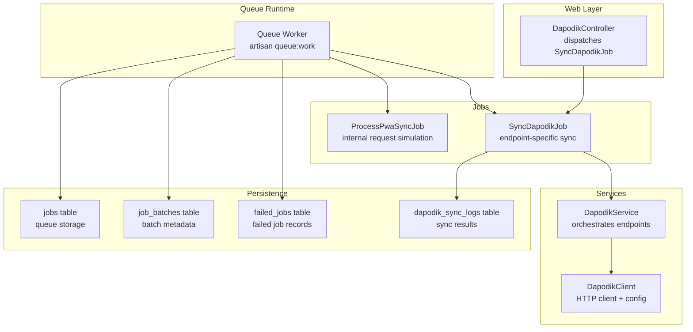
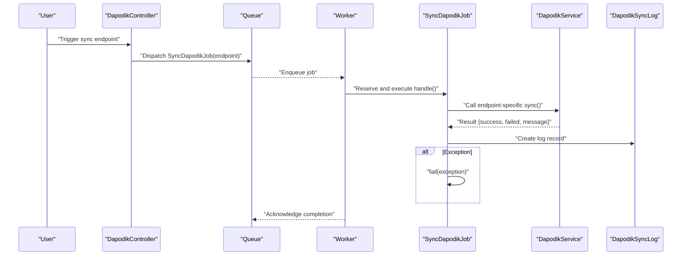
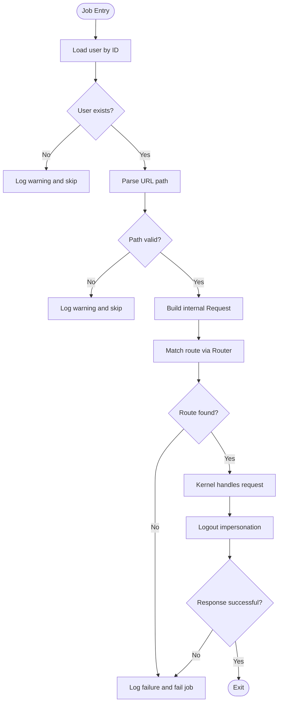
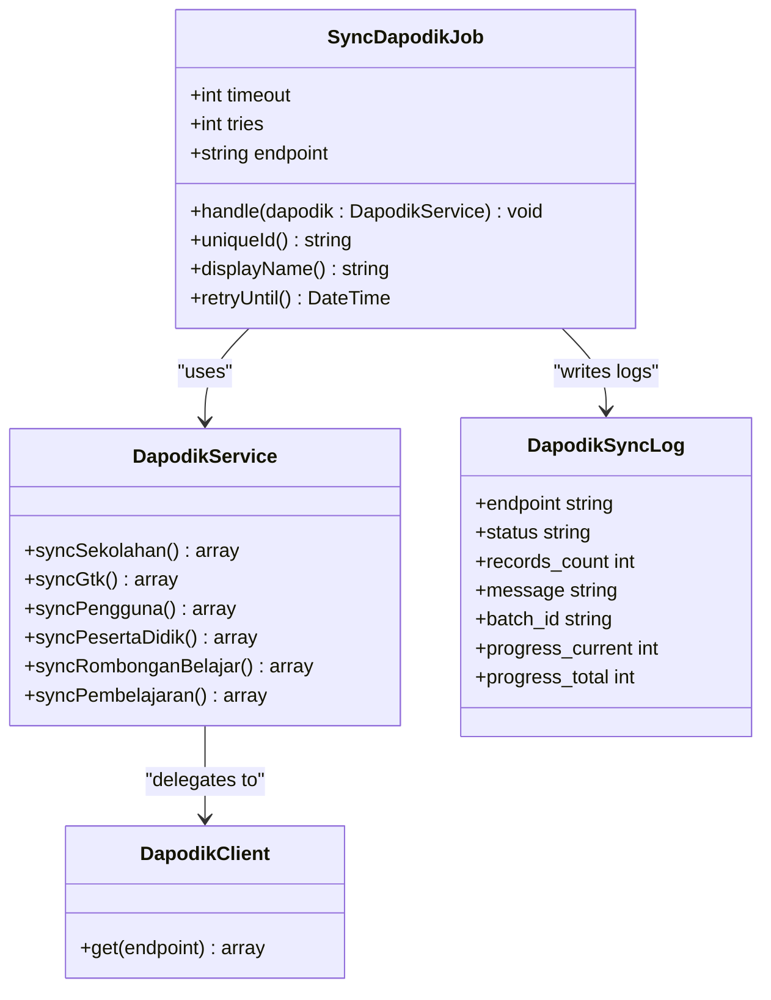
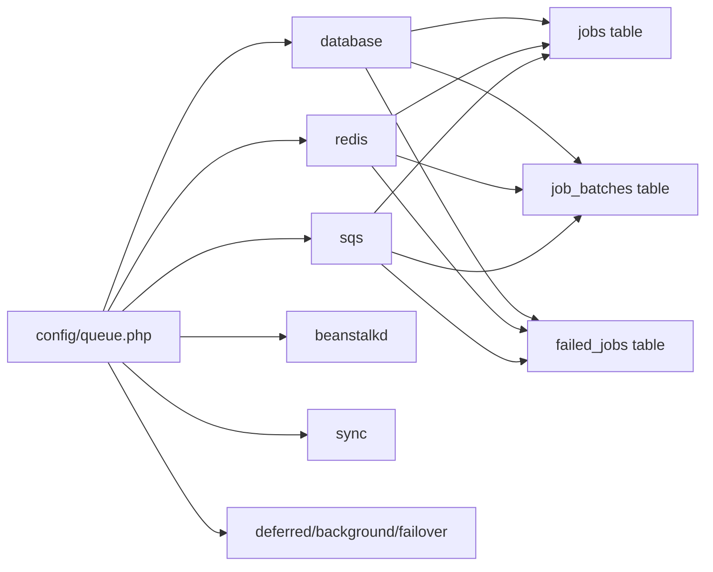
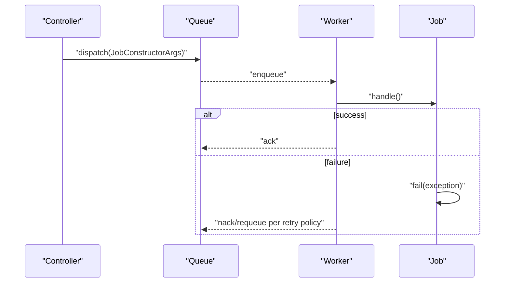
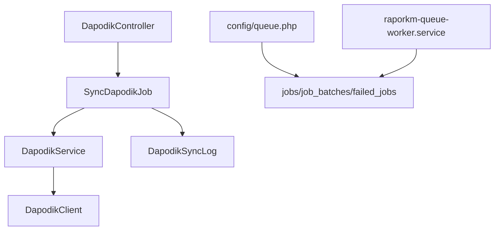

# Background Jobs & Processing

<cite>
**Referenced Files in This Document**
- [ProcessPwaSyncJob.php](file://app/Jobs/ProcessPwaSyncJob.php)
- [SyncDapodikJob.php](file://app/Jobs/SyncDapodikJob.php)
- [queue.php](file://config/queue.php)
- [0001_01_01_000002_create_jobs_table.php](file://database/migrations/0001_01_01_000002_create_jobs_table.php)
- [DapodikController.php](file://app/Http/Controllers/TU/DapodikController.php)
- [DapodikService.php](file://app/Services/DapodikService.php)
- [DapodikClient.php](file://app/Services/Dapodik/DapodikClient.php)
- [DapodikSyncLog.php](file://app/Models/DapodikSyncLog.php)
- [raporkm-queue-worker.service](file://deploy/raporkm-queue-worker.service)
- [raporkm-logrotate.conf](file://deploy/raporkm-logrotate.conf)
- [queue-jobs.md](file://.agents/skills/laravel-best-practices/rules/queue-jobs.md)
- [queue-jobs.md](file://.kiro/skills/laravel-best-practices/rules/queue-jobs.md)
- [queue-jobs.md](file://.claude/skills/laravel-best-practices/rules/queue-jobs.md)
- [DapodikJobTest.php](file://tests/Feature/Tu/Dapodik/DapodikJobTest.php)
- [DapodikSyncTest.php](file://tests/Feature/Tu/Dapodik/DapodikSyncTest.php)
</cite>

## Table of Contents
1. [Introduction](#introduction)
2. [Project Structure](#project-structure)
3. [Core Components](#core-components)
4. [Architecture Overview](#architecture-overview)
5. [Detailed Component Analysis](#detailed-component-analysis)
6. [Dependency Analysis](#dependency-analysis)
7. [Performance Considerations](#performance-considerations)
8. [Troubleshooting Guide](#troubleshooting-guide)
9. [Conclusion](#conclusion)
10. [Appendices](#appendices)

## Introduction
This document explains background job processing and queue management in RaporKM Laravel, focusing on asynchronous task execution and operational reliability. It documents the ProcessPwaSyncJob and SyncDapodikJob implementations as practical examples, details Laravel’s queue system architecture, job creation and dispatching, processing, middleware, failure handling, retry logic, and job chaining. It also covers queue drivers (database, Redis, SQS), configuration, serialization/deserialization, performance considerations, queued event broadcasting, worker management, scaling, and troubleshooting.

## Project Structure
Key areas related to queue and background jobs:
- Jobs: app/Jobs/ProcessPwaSyncJob.php, app/Jobs/SyncDapodikJob.php
- Queue configuration: config/queue.php
- Database schema for jobs and batches: database/migrations/..._create_jobs_table.php
- Controller dispatching jobs: app/Http/Controllers/TU/DapodikController.php
- Service orchestrating Dapodik sync: app/Services/DapodikService.php and app/Services/Dapodik/DapodikClient.php
- Sync logs model: app/Models/DapodikSyncLog.php
- Deployment and worker management: deploy/raporkm-queue-worker.service, deploy/raporkm-logrotate.conf
- Best practices: .agents/..., .kiro/..., .claude/... (queue-jobs.md)
- Tests validating job behavior: tests/Feature/Tu/Dapodik/DapodikJobTest.php, tests/Feature/Tu/Dapodik/DapodikSyncTest.php

**Diagram sources**
- [DapodikController.php:109-113](file://app/Http/Controllers/TU/DapodikController.php#L109-L113)
- [SyncDapodikJob.php:26-63](file://app/Jobs/SyncDapodikJob.php#L26-L63)
- [DapodikService.php:48-76](file://app/Services/DapodikService.php#L48-L76)
- [DapodikClient.php:20-35](file://app/Services/Dapodik/DapodikClient.php#L20-L35)
- [queue.php:32-92](file://config/queue.php#L32-L92)
- [0001_01_01_000002_create_jobs_table.php:14-47](file://database/migrations/0001_01_01_000002_create_jobs_table.php#L14-L47)
- [DapodikSyncLog.php:9-15](file://app/Models/DapodikSyncLog.php#L9-L15)

**Section sources**
- [ProcessPwaSyncJob.php:16-92](file://app/Jobs/ProcessPwaSyncJob.php#L16-L92)
- [SyncDapodikJob.php:14-79](file://app/Jobs/SyncDapodikJob.php#L14-L79)
- [queue.php:16-127](file://config/queue.php#L16-L127)
- [0001_01_01_000002_create_jobs_table.php:14-47](file://database/migrations/0001_01_01_000002_create_jobs_table.php#L14-L47)
- [DapodikController.php:109-113](file://app/Http/Controllers/TU/DapodikController.php#L109-L113)
- [DapodikService.php:48-76](file://app/Services/DapodikService.php#L48-L76)
- [DapodikClient.php:20-35](file://app/Services/Dapodik/DapodikClient.php#L20-L35)
- [DapodikSyncLog.php:9-15](file://app/Models/DapodikSyncLog.php#L9-L15)

## Core Components
- ProcessPwaSyncJob: Asynchronous job that simulates internal HTTP requests for PWA endpoints, with retries and explicit failure logging.
- SyncDapodikJob: Endpoint-specific Dapodik synchronization job with uniqueness during processing, timeouts, retries, batch support, and structured logging.
- Queue configuration: Supports drivers (database, redis, sqs, beanstalkd, sync, deferred, failover) and batch/failed job settings.
- Database schema: Provides jobs, job_batches, and failed_jobs tables for persistence.
- Controller integration: Dispatches SyncDapodikJob upon user-triggered sync actions.
- Service layer: Encapsulates Dapodik endpoint orchestration and HTTP client behavior.
- Logging: DapodikSyncLog captures per-endpoint results and progress.

**Section sources**
- [ProcessPwaSyncJob.php:20-22](file://app/Jobs/ProcessPwaSyncJob.php#L20-L22)
- [SyncDapodikJob.php:18-20](file://app/Jobs/SyncDapodikJob.php#L18-L20)
- [queue.php:32-92](file://config/queue.php#L32-L92)
- [0001_01_01_000002_create_jobs_table.php:14-47](file://database/migrations/0001_01_01_000002_create_jobs_table.php#L14-L47)
- [DapodikController.php:109-113](file://app/Http/Controllers/TU/DapodikController.php#L109-L113)
- [DapodikService.php:48-76](file://app/Services/DapodikService.php#L48-L76)
- [DapodikSyncLog.php:9-15](file://app/Models/DapodikSyncLog.php#L9-L15)

## Architecture Overview
Laravel’s queue architecture in RaporKM:
- Jobs implement ShouldQueue to opt into queue-backed execution.
- Jobs are dispatched from controllers or services.
- Queue workers pull jobs from configured storage (database by default).
- Jobs execute with dependency injection, logging outcomes, and optionally fail with explicit exceptions.
- Batched jobs track progress centrally; failed jobs are recorded for later inspection.

**Diagram sources**
- [DapodikController.php:109-113](file://app/Http/Controllers/TU/DapodikController.php#L109-L113)
- [SyncDapodikJob.php:26-63](file://app/Jobs/SyncDapodikJob.php#L26-L63)
- [DapodikService.php:48-76](file://app/Services/DapodikService.php#L48-L76)
- [DapodikSyncLog.php:9-15](file://app/Models/DapodikSyncLog.php#L9-L15)

## Detailed Component Analysis

### ProcessPwaSyncJob
Purpose:
- Execute PWA-triggered actions asynchronously by simulating internal HTTP requests based on a provided URL and payload.

Key behaviors:
- Retries and backoff via tries and backoff properties.
- Internal request simulation using Laravel’s Router and Kernel.
- Explicit failure logging and permanent failure reporting via failed().
- Defensive checks for invalid URLs and missing user context.

**Diagram sources**
- [ProcessPwaSyncJob.php:30-86](file://app/Jobs/ProcessPwaSyncJob.php#L30-L86)

**Section sources**
- [ProcessPwaSyncJob.php:16-92](file://app/Jobs/ProcessPwaSyncJob.php#L16-L92)

### SyncDapodikJob
Purpose:
- Perform Dapodik endpoint-specific synchronization with robust error handling, logging, and uniqueness guarantees.

Key behaviors:
- Implements ShouldBeUniqueUntilProcessing to prevent concurrent processing of the same endpoint.
- Uses Batchable to integrate with Laravel’s job batching.
- Defines timeout and tries for resilience.
- Unique identifier and display name for observability.
- Retry window via retryUntil().
- Writes structured logs to DapodikSyncLog with counts and progress.

**Diagram sources**
- [SyncDapodikJob.php:14-79](file://app/Jobs/SyncDapodikJob.php#L14-L79)
- [DapodikService.php:48-76](file://app/Services/DapodikService.php#L48-L76)
- [DapodikClient.php:20-35](file://app/Services/Dapodik/DapodikClient.php#L20-L35)
- [DapodikSyncLog.php:9-15](file://app/Models/DapodikSyncLog.php#L9-L15)

**Section sources**
- [SyncDapodikJob.php:14-79](file://app/Jobs/SyncDapodikJob.php#L14-L79)
- [DapodikService.php:48-76](file://app/Services/DapodikService.php#L48-L76)
- [DapodikClient.php:20-35](file://app/Services/Dapodik/DapodikClient.php#L20-L35)
- [DapodikSyncLog.php:9-15](file://app/Models/DapodikSyncLog.php#L9-L15)

### Queue System Architecture and Configuration
Drivers and options:
- database: stores jobs in the jobs table; configurable queue name, retry_after, and connection.
- redis: supports blocking and retry_after tuning.
- sqs: AWS SQS integration with region, keys, and queue naming.
- beanstalkd: alternative backend with block_for tuning.
- sync: synchronous execution for development.
- deferred/background/failover: specialized drivers for specific scenarios.

Batching and failed jobs:
- Batching metadata stored in job_batches.
- Failed jobs recorded in failed_jobs with driver selection.

**Diagram sources**
- [queue.php:32-92](file://config/queue.php#L32-L92)
- [0001_01_01_000002_create_jobs_table.php:14-47](file://database/migrations/0001_01_01_000002_create_jobs_table.php#L14-L47)

**Section sources**
- [queue.php:16-127](file://config/queue.php#L16-L127)
- [0001_01_01_000002_create_jobs_table.php:14-47](file://database/migrations/0001_01_01_000002_create_jobs_table.php#L14-L47)

### Job Creation, Dispatching, and Processing
- Dispatching: Controller triggers job dispatch with endpoint parameter.
- Processing: Worker pulls jobs from the configured queue and executes handle().
- Middleware: Not implemented in the analyzed jobs; see best practices for rate limiting and other middleware.
- Failure handling: Jobs explicitly call fail() on exceptions and implement failed() for logging.

**Diagram sources**
- [DapodikController.php:109-113](file://app/Http/Controllers/TU/DapodikController.php#L109-L113)
- [SyncDapodikJob.php:26-63](file://app/Jobs/SyncDapodikJob.php#L26-L63)

**Section sources**
- [DapodikController.php:109-113](file://app/Http/Controllers/TU/DapodikController.php#L109-L113)
- [SyncDapodikJob.php:26-63](file://app/Jobs/SyncDapodikJob.php#L26-L63)

### Job Middleware, Failure Handling, Retry Logic, and Job Chaining
- Middleware: Not present in the analyzed jobs; recommended for rate limiting external APIs.
- Failure handling: Implemented via failed() method and explicit fail() calls.
- Retry logic: Uses tries and backoff; retryUntil() sets time-based limit.
- Job chaining: Not demonstrated in the analyzed jobs; use Bus::batch() for coordinated execution.

Best practice references:
- Exponential backoff, ShouldBeUnique, ShouldBeUniqueUntilProcessing, retryUntil semantics, and batch usage.

**Section sources**
- [ProcessPwaSyncJob.php:20-22](file://app/Jobs/ProcessPwaSyncJob.php#L20-L22)
- [SyncDapodikJob.php:18-20](file://app/Jobs/SyncDapodikJob.php#L18-L20)
- [SyncDapodikJob.php:75-78](file://app/Jobs/SyncDapodikJob.php#L75-L78)
- [queue-jobs.md:27-47](file://.agents/skills/laravel-best-practices/rules/queue-jobs.md#L27-L47)
- [queue-jobs.md:27-47](file://.kiro/skills/laravel-best-practices/rules/queue-jobs.md#L27-L47)
- [queue-jobs.md:27-47](file://.claude/skills/laravel-best-practices/rules/queue-jobs.md#L27-L47)

### Queue Drivers and Configuration Options
- database: table, queue name, retry_after, connection.
- redis: connection, queue, retry_after, block_for, after_commit.
- sqs: key/secret, prefix/suffix, region, queue.
- beanstalkd: host, queue, retry_after, block_for.
- sync: synchronous execution.
- failover: fallback chain of connections.

Environment variables:
- QUEUE_CONNECTION, DB_QUEUE_CONNECTION, DB_QUEUE_TABLE, DB_QUEUE, DB_QUEUE_RETRY_AFTER, SQS_* variables, REDIS_* variables, BEANSTALKD_* variables.

**Section sources**
- [queue.php:38-74](file://config/queue.php#L38-L74)
- [queue.php:56-65](file://config/queue.php#L56-L65)
- [queue.php:47-54](file://config/queue.php#L47-L54)

### Job Serialization, Deserialization, and Performance Considerations
- Serialization: Jobs use SerializesModels to serialize Eloquent models and basic types.
- Deserialization: Worker reconstructs job arguments and dependencies.
- Performance: Prefer database driver for simplicity; tune retry_after and timeout; use ShouldBeUniqueUntilProcessing to avoid duplicate processing; monitor failed_jobs.

**Section sources**
- [ProcessPwaSyncJob.php:12-18](file://app/Jobs/ProcessPwaSyncJob.php#L12-L18)
- [SyncDapodikJob.php:16-16](file://app/Jobs/SyncDapodikJob.php#L16-L16)
- [queue.php:105-127](file://config/queue.php#L105-L127)

### Examples of Job Creation, Custom Job Classes, Queued Event Broadcasting, and Monitoring
- Job creation: Controller dispatches SyncDapodikJob with endpoint argument.
- Custom job classes: Both ProcessPwaSyncJob and SyncDapodikJob demonstrate customizations (internal request simulation, endpoint routing, unique identifiers).
- Queued event broadcasting: Not implemented in the analyzed code; consider broadcasting events after job completion for UI updates.
- Monitoring: Use Laravel Horizon for production environments; for current setup, inspect failed_jobs and logs; worker systemd unit manages lifecycle.

**Section sources**
- [DapodikController.php:109-113](file://app/Http/Controllers/TU/DapodikController.php#L109-L113)
- [DapodikJobTest.php:27-46](file://tests/Feature/Tu/Dapodik/DapodikJobTest.php#L27-L46)
- [raporkm-queue-worker.service:10-15](file://deploy/raporkm-queue-worker.service#L10-L15)

## Dependency Analysis
High-level dependencies among core components:

**Diagram sources**
- [DapodikController.php:109-113](file://app/Http/Controllers/TU/DapodikController.php#L109-L113)
- [SyncDapodikJob.php:26-63](file://app/Jobs/SyncDapodikJob.php#L26-L63)
- [DapodikService.php:48-76](file://app/Services/DapodikService.php#L48-L76)
- [DapodikClient.php:20-35](file://app/Services/Dapodik/DapodikClient.php#L20-L35)
- [DapodikSyncLog.php:9-15](file://app/Models/DapodikSyncLog.php#L9-L15)
- [queue.php:32-92](file://config/queue.php#L32-L92)
- [0001_01_01_000002_create_jobs_table.php:14-47](file://database/migrations/0001_01_01_000002_create_jobs_table.php#L14-L47)
- [raporkm-queue-worker.service:10-15](file://deploy/raporkm-queue-worker.service#L10-L15)

**Section sources**
- [DapodikController.php:109-113](file://app/Http/Controllers/TU/DapodikController.php#L109-L113)
- [SyncDapodikJob.php:26-63](file://app/Jobs/SyncDapodikJob.php#L26-L63)
- [DapodikService.php:48-76](file://app/Services/DapodikService.php#L48-L76)
- [DapodikClient.php:20-35](file://app/Services/Dapodik/DapodikClient.php#L20-L35)
- [DapodikSyncLog.php:9-15](file://app/Models/DapodikSyncLog.php#L9-L15)
- [queue.php:32-92](file://config/queue.php#L32-L92)
- [0001_01_01_000002_create_jobs_table.php:14-47](file://database/migrations/0001_01_01_000002_create_jobs_table.php#L14-L47)
- [raporkm-queue-worker.service:10-15](file://deploy/raporkm-queue-worker.service#L10-L15)

## Performance Considerations
- Ensure retry_after exceeds job timeout to prevent duplicate executions.
- Use exponential backoff for transient failures.
- Apply ShouldBeUniqueUntilProcessing to reduce contention for long-running endpoints.
- Monitor failed_jobs and adjust queue driver and retry policies accordingly.
- For high throughput, consider Redis or SQS with proper scaling and visibility timeouts.

[No sources needed since this section provides general guidance]

## Troubleshooting Guide
Common issues and remedies:
- Jobs not processed: Verify queue:work is running and configured for the correct connection.
- Duplicate processing: Confirm uniqueness constraints and ShouldBeUniqueUntilProcessing usage.
- Long-running jobs: Increase timeout and align retry_after; consider batch processing.
- Failed jobs accumulation: Inspect failed_jobs and investigate exceptions; adjust retry policy.
- Logs not rotating: Ensure logrotate configuration restarts the worker service.

Operational references:
- Worker service configuration and log rotation.
- Failed job storage configuration.

**Section sources**
- [raporkm-queue-worker.service:10-15](file://deploy/raporkm-queue-worker.service#L10-L15)
- [raporkm-logrotate.conf:1-13](file://deploy/raporkm-logrotate.conf#L1-L13)
- [queue.php:123-127](file://config/queue.php#L123-L127)

## Conclusion
RaporKM leverages Laravel’s queue system to execute background tasks reliably. ProcessPwaSyncJob and SyncDapodikJob illustrate asynchronous processing, resilience via retries and timeouts, and structured logging. The configuration supports multiple drivers and batch/failed job management. For production, adopt best practices such as exponential backoff, uniqueness, and monitoring with Horizon. Scale workers and tune drivers according to workload characteristics.

[No sources needed since this section summarizes without analyzing specific files]

## Appendices

### Appendix A: Job Lifecycle and Best Practices
- Implement failed() for explicit error handling.
- Use ShouldBeUnique or ShouldBeUniqueUntilProcessing to prevent duplicates.
- Prefer exponential backoff for transient failures.
- Use Bus::batch() for coordinated job execution.
- Align retry_after with job timeout to avoid duplicate runs.

**Section sources**
- [queue-jobs.md:65-75](file://.agents/skills/laravel-best-practices/rules/queue-jobs.md#L65-L75)
- [queue-jobs.md:49-63](file://.kiro/skills/laravel-best-practices/rules/queue-jobs.md#L49-L63)
- [queue-jobs.md:27-47](file://.claude/skills/laravel-best-practices/rules/queue-jobs.md#L27-L47)
- [queue-jobs.md:88-100](file://.agents/skills/laravel-best-practices/rules/queue-jobs.md#L88-L100)
- [queue-jobs.md:115-124](file://.kiro/skills/laravel-best-practices/rules/queue-jobs.md#L115-L124)

### Appendix B: Testing Background Jobs
- Validate job dispatch from controller.
- Assert job construction and uniqueId behavior.
- Verify exception handling and logging.

**Section sources**
- [DapodikSyncTest.php:56-66](file://tests/Feature/Tu/Dapodik/DapodikSyncTest.php#L56-L66)
- [DapodikJobTest.php:27-46](file://tests/Feature/Tu/Dapodik/DapodikJobTest.php#L27-L46)
- [DapodikJobTest.php:48-72](file://tests/Feature/Tu/Dapodik/DapodikJobTest.php#L48-L72)
- [DapodikJobTest.php:74-81](file://tests/Feature/Tu/Dapodik/DapodikJobTest.php#L74-L81)