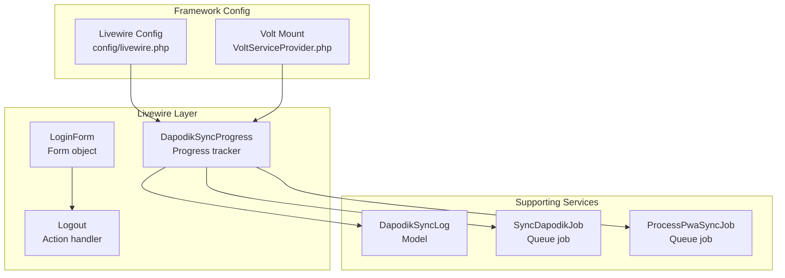
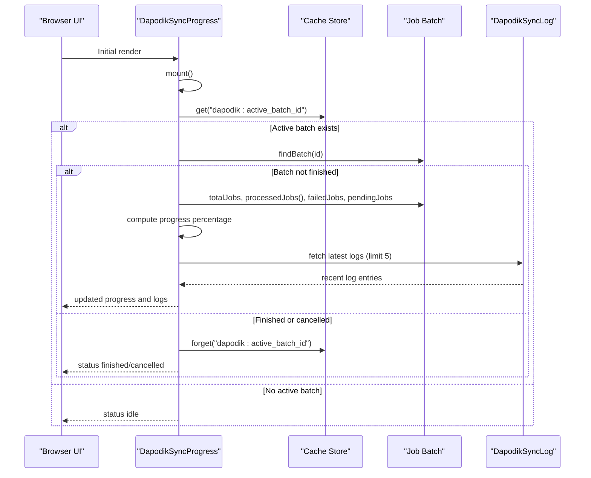
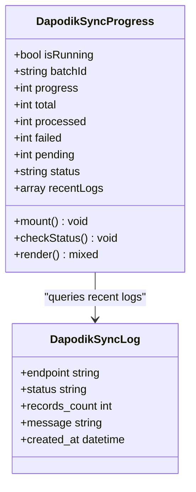
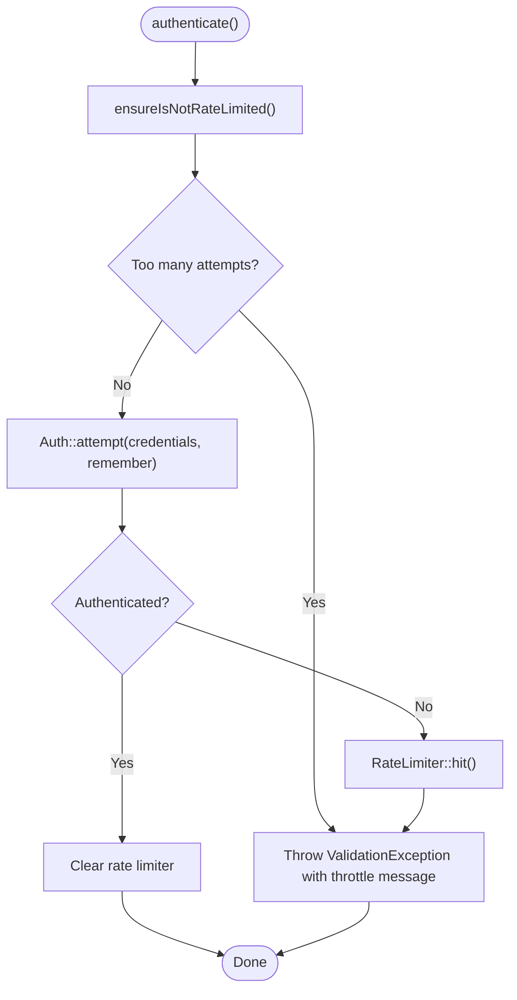
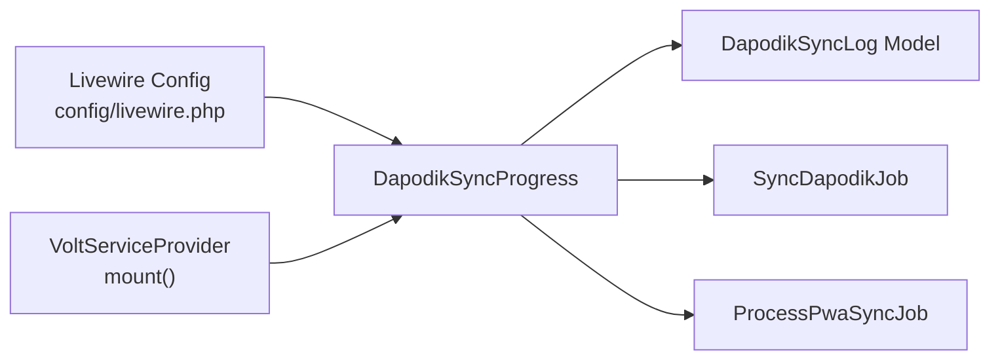

# Livewire Components

<cite>
**Referenced Files in This Document**
- [DapodikSyncProgress.php](file://app/Livewire/DapodikSyncProgress.php)
- [LoginForm.php](file://app/Livewire/Forms/LoginForm.php)
- [Logout.php](file://app/Livewire/Actions/Logout.php)
- [livewire.php](file://config/livewire.php)
- [VoltServiceProvider.php](file://app/Providers/VoltServiceProvider.php)
- [DapodikSyncLog.php](file://app/Models/DapodikSyncLog.php)
- [SyncDapodikJob.php](file://app/Jobs/SyncDapodikJob.php)
- [ProcessPwaSyncJob.php](file://app/Jobs/ProcessPwaSyncJob.php)
</cite>

## Table of Contents
1. [Introduction](#introduction)
2. [Project Structure](#project-structure)
3. [Core Components](#core-components)
4. [Architecture Overview](#architecture-overview)
5. [Detailed Component Analysis](#detailed-component-analysis)
6. [Dependency Analysis](#dependency-analysis)
7. [Performance Considerations](#performance-considerations)
8. [Troubleshooting Guide](#troubleshooting-guide)
9. [Conclusion](#conclusion)
10. [Appendices](#appendices)

## Introduction
This document explains the Livewire component architecture used in RaporKM Laravel, focusing on reactive UI updates without full page reloads. It documents the DapodikSyncProgress component as a real-world example of progress tracking for long-running operations, and covers form components like LoginForm with validation and submission handling. You will learn component lifecycle methods, property binding, event handling, state management, composition patterns, slot usage, Blade integration, data flow between components, performance optimization, and testing strategies for Livewire functionality.

## Project Structure
Livewire components live under the `app/Livewire` namespace and are organized by responsibility:
- Components: `DapodikSyncProgress.php`
- Forms: `LoginForm.php` (in `app/Livewire/Forms`)
- Actions: `Logout.php` (in `app/Livewire/Actions`)
- Configuration: `config/livewire.php`
- Volt mounting: `app/Providers/VoltServiceProvider.php`
- Supporting models and jobs: `DapodikSyncLog.php`, `SyncDapodikJob.php`, `ProcessPwaSyncJob.php`

**Diagram sources**
- [DapodikSyncProgress.php:11-79](file://app/Livewire/DapodikSyncProgress.php#L11-L79)
- [LoginForm.php:13-61](file://app/Livewire/Forms/LoginForm.php#L13-L61)
- [Logout.php:8-20](file://app/Livewire/Actions/Logout.php#L8-L20)
- [livewire.php:1-187](file://config/livewire.php#L1-L187)
- [VoltServiceProvider.php:21-27](file://app/Providers/VoltServiceProvider.php#L21-L27)
- [DapodikSyncLog.php](file://app/Models/DapodikSyncLog.php)
- [SyncDapodikJob.php](file://app/Jobs/SyncDapodikJob.php)
- [ProcessPwaSyncJob.php](file://app/Jobs/ProcessPwaSyncJob.php)

**Section sources**
- [livewire.php:16-41](file://config/livewire.php#L16-L41)
- [VoltServiceProvider.php:21-27](file://app/Providers/VoltServiceProvider.php#L21-L27)

## Core Components
This section introduces the primary Livewire components and their roles in the application.

- DapodikSyncProgress: Reactive component that tracks and displays progress for long-running Dapodik synchronization operations. It polls batch status, computes progress metrics, and renders recent sync logs.
- LoginForm: Form object encapsulating login credentials and validation, with rate limiting and authentication attempts.
- Logout: Action class handling logout logic for the web guard.

These components demonstrate Livewire's reactive capabilities: properties update automatically, rendering is triggered on state changes, and events can drive updates.

**Section sources**
- [DapodikSyncProgress.php:11-79](file://app/Livewire/DapodikSyncProgress.php#L11-L79)
- [LoginForm.php:13-61](file://app/Livewire/Forms/LoginForm.php#L13-L61)
- [Logout.php:8-20](file://app/Livewire/Actions/Logout.php#L8-L20)

## Architecture Overview
Livewire integrates with Laravel through Volt mounting and configuration. Components are mounted under configured view paths and rendered into layouts. The DapodikSyncProgress component demonstrates a polling pattern using Livewire attributes and cache-backed state to reflect asynchronous job batches.

**Diagram sources**
- [DapodikSyncProgress.php:31-73](file://app/Livewire/DapodikSyncProgress.php#L31-L73)
- [DapodikSyncLog.php](file://app/Models/DapodikSyncLog.php)

**Section sources**
- [DapodikSyncProgress.php:31-73](file://app/Livewire/DapodikSyncProgress.php#L31-L73)

## Detailed Component Analysis

### DapodikSyncProgress Component
Purpose: Track and display progress for Dapodik synchronization operations initiated via queued jobs. It polls for active batch status, computes progress, and shows recent sync logs.

Key properties:
- Boolean flag indicating whether a sync is currently running
- Batch identifier
- Progress metrics: total, processed, failed, pending, percentage
- Status string reflecting idle, running, finished, or cancelled
- Recent logs array for UI display

Lifecycle and behavior:
- mount(): Initializes component state by checking active batch status
- checkStatus(@On): Responds to a poll event to refresh progress and logs
- render(): Returns the Blade view for the component

Integration points:
- Uses Cache to persist the active batch ID
- Uses Bus to inspect batch progress and completion
- Queries DapodikSyncLog model for recent entries

**Diagram sources**
- [DapodikSyncProgress.php:11-79](file://app/Livewire/DapodikSyncProgress.php#L11-L79)
- [DapodikSyncLog.php](file://app/Models/DapodikSyncLog.php)

**Section sources**
- [DapodikSyncProgress.php:11-79](file://app/Livewire/DapodikSyncProgress.php#L11-L79)

### LoginForm Form Component
Purpose: Encapsulate login form state and validation, integrate with Laravel's authentication and rate limiting facilities.

Key properties:
- Username, password, remember flags with validation attributes

Behavior:
- authenticate(): Attempts login with credentials and remember flag, throws validation errors on failure
- ensureIsNotRateLimited(): Enforces rate limits and emits lockout events
- throttleKey(): Generates a normalized throttling key based on username and IP

**Diagram sources**
- [LoginForm.php:24-55](file://app/Livewire/Forms/LoginForm.php#L24-L55)

**Section sources**
- [LoginForm.php:13-61](file://app/Livewire/Forms/LoginForm.php#L13-L61)

### Logout Action
Purpose: Provide a centralized logout action for the web guard, invalidating the session and regenerating the CSRF token.

Behavior:
- __invoke(): Logs out the current user, invalidates session, regenerates token

**Section sources**
- [Logout.php:8-20](file://app/Livewire/Actions/Logout.php#L8-L20)

## Dependency Analysis
This section maps dependencies among Livewire components, supporting services, and configuration.

**Diagram sources**
- [livewire.php:16-41](file://config/livewire.php#L16-L41)
- [VoltServiceProvider.php:21-27](file://app/Providers/VoltServiceProvider.php#L21-L27)
- [DapodikSyncProgress.php:11-79](file://app/Livewire/DapodikSyncProgress.php#L11-L79)
- [DapodikSyncLog.php](file://app/Models/DapodikSyncLog.php)
- [SyncDapodikJob.php](file://app/Jobs/SyncDapodikJob.php)
- [ProcessPwaSyncJob.php](file://app/Jobs/ProcessPwaSyncJob.php)

**Section sources**
- [livewire.php:16-41](file://config/livewire.php#L16-L41)
- [VoltServiceProvider.php:21-27](file://app/Providers/VoltServiceProvider.php#L21-L27)

## Performance Considerations
- Polling frequency: The DapodikSyncProgress component relies on periodic polling. Keep polling intervals reasonable to avoid excessive server load.
- Batch progress computation: Use built-in batch helpers to compute progress efficiently without manual iteration.
- Cache-backed state: Persist active batch identifiers in cache to minimize database queries during progress checks.
- Rendering scope: Limit DOM updates by updating only necessary properties and leveraging Livewire's morphing behavior.
- Navigation progress bar: Enable Livewire navigate progress bar for better UX during SPA-like navigation.

[No sources needed since this section provides general guidance]

## Troubleshooting Guide
Common issues and remedies:
- Component not rendering: Verify Volt mounting paths and that the component's render method returns a valid view.
- Polling not updating: Ensure the poll event is emitted and the component responds with the @On attribute.
- Rate limiting failures: Confirm throttle key generation and rate limiter configuration.
- Session invalidation: After logout, ensure session invalidation and token regeneration occur.

**Section sources**
- [LoginForm.php:24-55](file://app/Livewire/Forms/LoginForm.php#L24-L55)
- [Logout.php:13-19](file://app/Livewire/Actions/Logout.php#L13-L19)

## Conclusion
RaporKM leverages Livewire to build reactive, component-based UIs. The DapodikSyncProgress component exemplifies progress tracking for long-running operations using cache-backed state and job batches. LoginForm and Logout demonstrate form handling and authentication actions. With proper configuration and composition patterns, Livewire delivers dynamic user experiences while maintaining clean separation of concerns.

[No sources needed since this section summarizes without analyzing specific files]

## Appendices

### Component Lifecycle Methods
- mount(): Initialize component state on first render
- render(): Return the Blade view for the component
- @On handlers: React to emitted events (e.g., poll)

**Section sources**
- [DapodikSyncProgress.php:31-73](file://app/Livewire/DapodikSyncProgress.php#L31-L73)

### Property Binding and Events
- Properties declared as public become reactive and bindable via wire:model
- Use @On to listen to events and update state accordingly
- Emit events from child components to trigger parent updates

**Section sources**
- [DapodikSyncProgress.php:8-37](file://app/Livewire/DapodikSyncProgress.php#L8-L37)

### Form Components and Validation
- Use Livewire Form objects to encapsulate form state and validation rules
- Integrate with Laravel's validation and rate limiting facilities
- Throw ValidationException to surface validation errors in the UI

**Section sources**
- [LoginForm.php:13-61](file://app/Livewire/Forms/LoginForm.php#L13-L61)

### Component Composition and Slots
- Livewire components can be composed within Blade layouts
- Slots can be forwarded from Livewire templates into layouts during rendering

**Section sources**
- [VoltServiceProvider.php:21-27](file://app/Providers/VoltServiceProvider.php#L21-L27)

### Practical Examples
- Creating a new component: Use the Livewire file creation command and place it under the configured class namespace
- Data flow: Parent components pass data to children via public properties; children emit events upward
- Performance: Minimize unnecessary re-renders by scoping state and using efficient polling

[No sources needed since this section provides general guidance]

### Testing Strategies
- Unit test form objects for validation and authentication logic
- Feature test component interactions and state changes
- Use Dusk for end-to-end browser testing of interactive components
- Mock cache and queues to isolate component behavior

[No sources needed since this section provides general guidance]