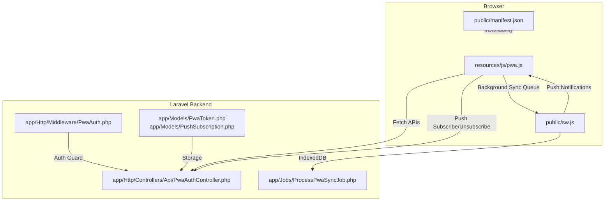
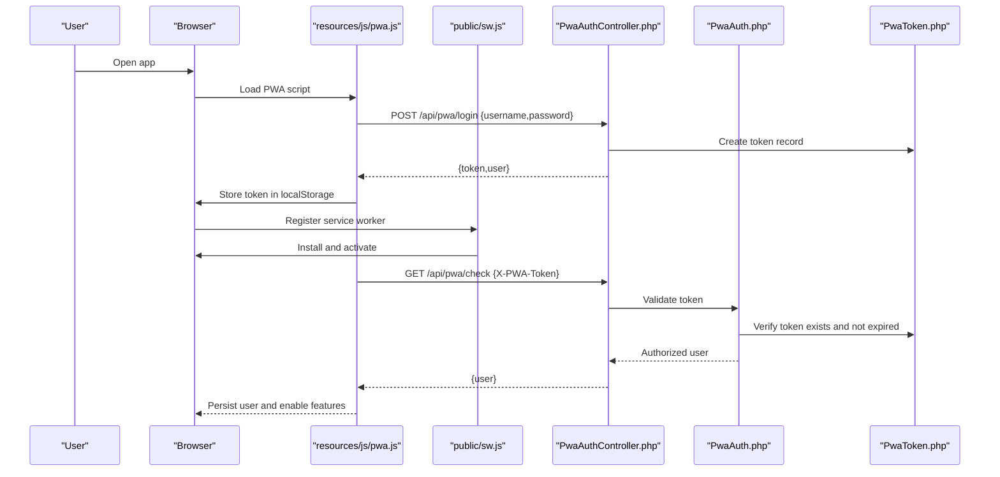
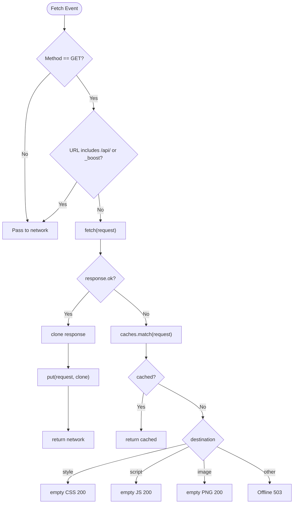
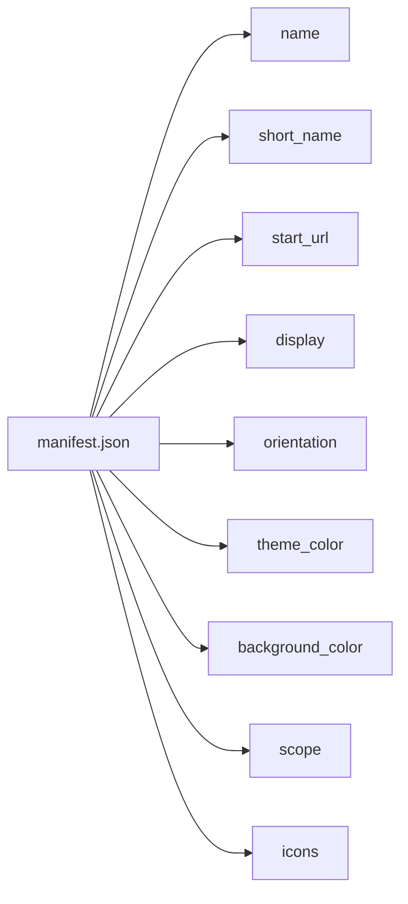
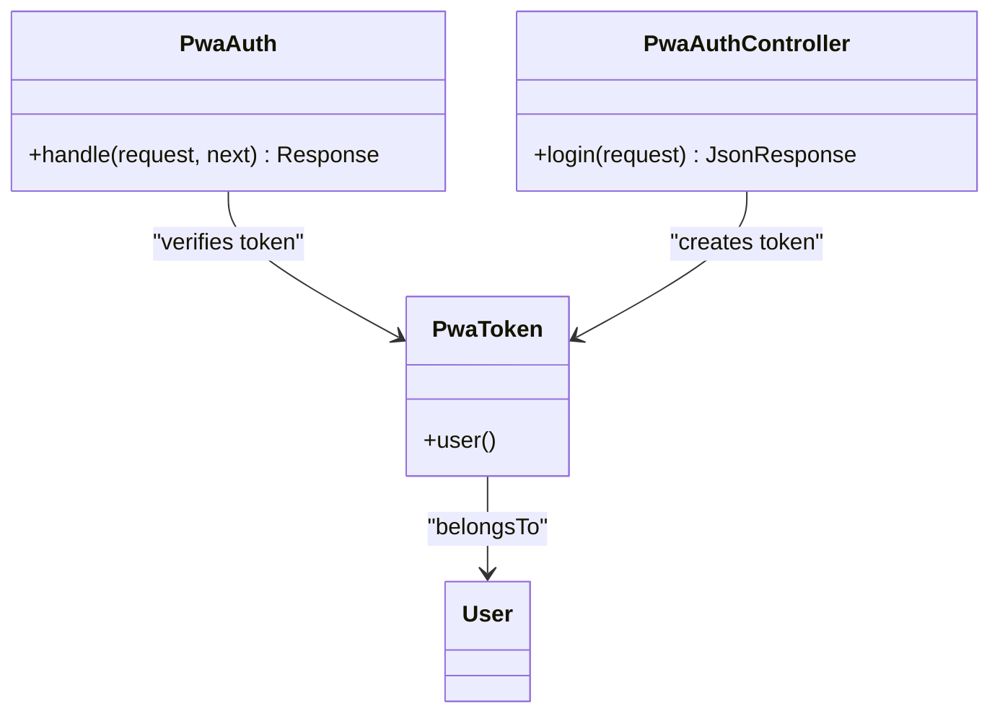
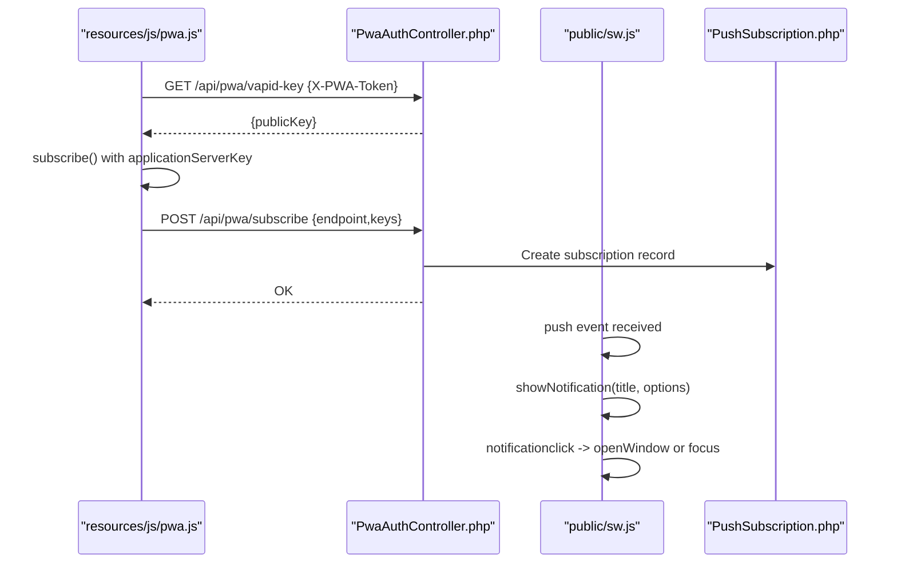
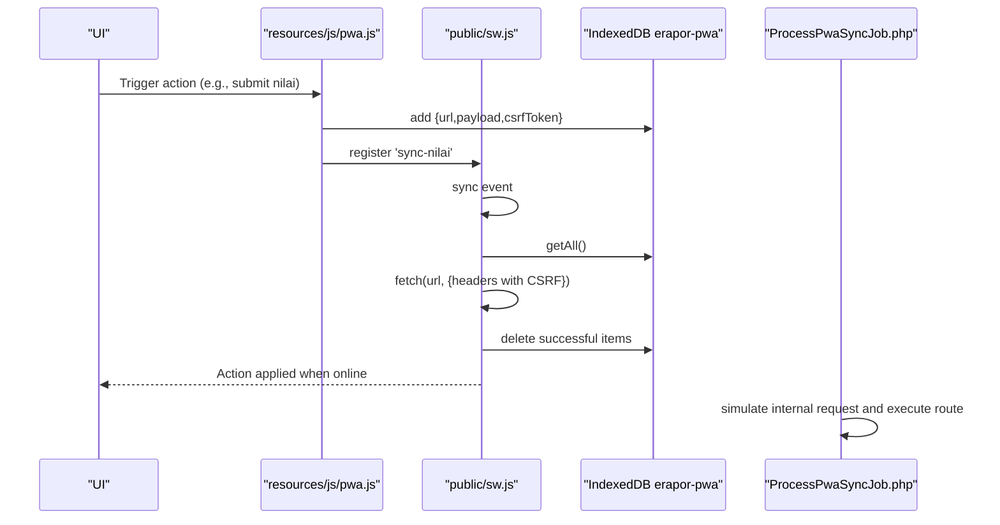
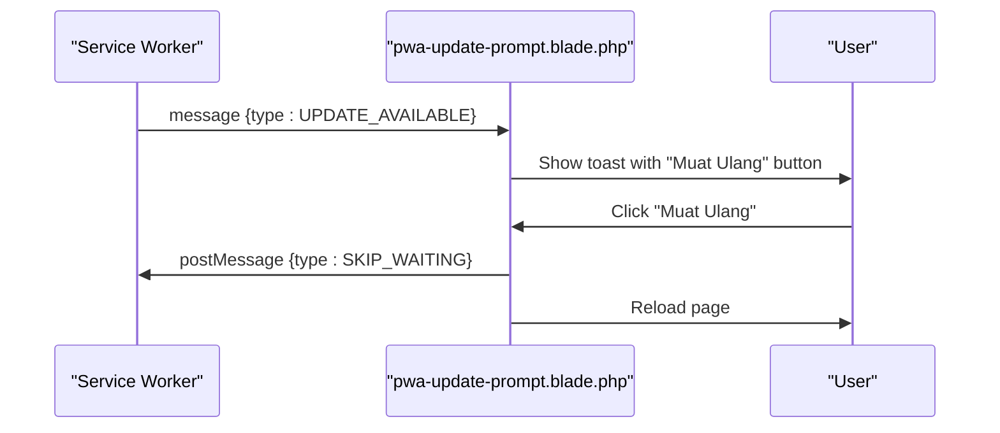
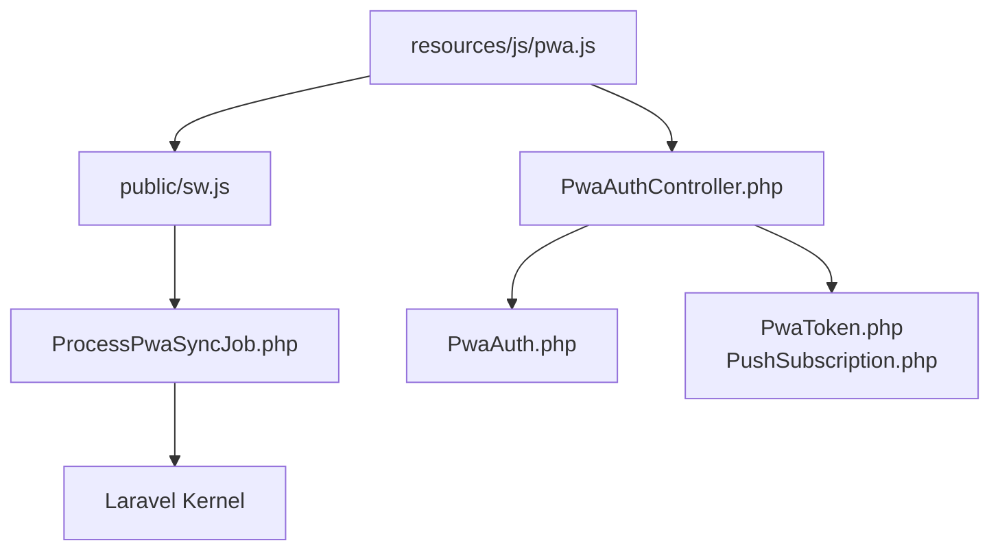

# PWA & Mobile Functionality

<cite>
**Referenced Files in This Document**
- [sw.js](file://public/sw.js)
- [manifest.json](file://public/manifest.json)
- [pwa.js](file://resources/js/pwa.js)
- [PwaAuth.php](file://app/Http/Middleware/PwaAuth.php)
- [PwaAuthController.php](file://app/Http/Controllers/Api/PwaAuthController.php)
- [ProcessPwaSyncJob.php](file://app/Jobs/ProcessPwaSyncJob.php)
- [PwaToken.php](file://app/Models/PwaToken.php)
- [PushSubscription.php](file://app/Models/PushSubscription.php)
- [pwa-update-prompt.blade.php](file://resources/views/components/pwa-update-prompt.blade.php)
- [app.css](file://resources/css/app.css)
- [postcss.config.js](file://postcss.config.js)
- [package.json](file://package.json)
</cite>

## Table of Contents
1. [Introduction](#introduction)
2. [Project Structure](#project-structure)
3. [Core Components](#core-components)
4. [Architecture Overview](#architecture-overview)
5. [Detailed Component Analysis](#detailed-component-analysis)
6. [Dependency Analysis](#dependency-analysis)
7. [Performance Considerations](#performance-considerations)
8. [Troubleshooting Guide](#troubleshooting-guide)
9. [Conclusion](#conclusion)
10. [Appendices](#appendices)

## Introduction
This document explains the Progressive Web App (PWA) and mobile capabilities implemented in RaporKM Laravel. It covers the service worker for offline support, caching strategies, background synchronization, the web app manifest for installability, PWA authentication, push notifications, and mobile-responsive design patterns. It also includes practical examples, testing strategies, browser compatibility notes, and troubleshooting guidance for mobile-specific issues.

## Project Structure
The PWA implementation spans three layers:
- Frontend JavaScript: client-side PWA logic, push notification handling, and background sync queueing
- Service Worker: runtime caching, offline fallbacks, push notifications, and background sync
- Backend: middleware and controller for PWA authentication, IndexedDB-backed sync jobs, and push subscriptions

**Diagram sources**
- [pwa.js:1-336](file://resources/js/pwa.js#L1-L336)
- [sw.js:1-161](file://public/sw.js#L1-L161)
- [manifest.json:1-29](file://public/manifest.json#L1-L29)
- [PwaAuth.php:1-44](file://app/Http/Middleware/PwaAuth.php#L1-L44)
- [PwaAuthController.php:1-50](file://app/Http/Controllers/Api/PwaAuthController.php#L1-L50)
- [ProcessPwaSyncJob.php:1-93](file://app/Jobs/ProcessPwaSyncJob.php#L1-L93)
- [PwaToken.php:1-25](file://app/Models/PwaToken.php#L1-L25)
- [PushSubscription.php:1-50](file://app/Models/PushSubscription.php#L1-L50)

**Section sources**
- [sw.js:1-161](file://public/sw.js#L1-L161)
- [manifest.json:1-29](file://public/manifest.json#L1-L29)
- [pwa.js:1-336](file://resources/js/pwa.js#L1-L336)
- [PwaAuth.php:1-44](file://app/Http/Middleware/PwaAuth.php#L1-L44)
- [PwaAuthController.php:1-50](file://app/Http/Controllers/Api/PwaAuthController.php#L1-L50)
- [ProcessPwaSyncJob.php:1-93](file://app/Jobs/ProcessPwaSyncJob.php#L1-L93)
- [PwaToken.php:1-25](file://app/Models/PwaToken.php#L1-L25)
- [PushSubscription.php:1-50](file://app/Models/PushSubscription.php#L1-L50)

## Core Components
- Service Worker (offline caching, push notifications, background sync)
- Web App Manifest (installability and native presentation)
- PWA Authentication (token-based auth via custom header)
- Push Notifications (VAPID key exchange and subscription persistence)
- Background Sync (offline queue persisted in IndexedDB)
- Mobile UI (responsive design and touch-friendly patterns)

**Section sources**
- [sw.js:1-161](file://public/sw.js#L1-L161)
- [manifest.json:1-29](file://public/manifest.json#L1-L29)
- [pwa.js:1-336](file://resources/js/pwa.js#L1-L336)
- [PwaAuth.php:1-44](file://app/Http/Middleware/PwaAuth.php#L1-L44)
- [PwaAuthController.php:1-50](file://app/Http/Controllers/Api/PwaAuthController.php#L1-L50)
- [ProcessPwaSyncJob.php:1-93](file://app/Jobs/ProcessPwaSyncJob.php#L1-L93)
- [PwaToken.php:1-25](file://app/Models/PwaToken.php#L1-L25)
- [PushSubscription.php:1-50](file://app/Models/PushSubscription.php#L1-L50)

## Architecture Overview
The PWA architecture integrates client-side logic with server-side authentication and background processing:
- Client registers the service worker and performs PWA login/check
- Service worker intercepts network requests, caches selectively, and serves offline
- Push notifications are handled via the service worker with VAPID keys fetched from the backend
- Background sync queues offline actions in IndexedDB and retries when online
- Laravel backend validates tokens via middleware and executes queued jobs internally

**Diagram sources**
- [pwa.js:32-107](file://resources/js/pwa.js#L32-L107)
- [PwaAuthController.php:15-50](file://app/Http/Controllers/Api/PwaAuthController.php#L15-L50)
- [PwaAuth.php:14-42](file://app/Http/Middleware/PwaAuth.php#L14-L42)
- [PwaToken.php:8-24](file://app/Models/PwaToken.php#L8-L24)

## Detailed Component Analysis

### Service Worker (sw.js)
Responsibilities:
- Install: pre-cache the root route
- Fetch: network-first strategy with cache fallback; inject empty responses for styles/scripts/images when offline; serve generic “Offline” for other resources
- Activate: clean up old caches and claim clients
- Push: show notifications with icon/badge and optional deep link
- Notification Click: focus or open window at a given URL
- Background Sync: read IndexedDB queue and replay POST requests with CSRF token

Key behaviors:
- Excludes API and boost endpoints from caching
- Uses a dedicated IndexedDB store for offline sync queue
- Sends X-CSRF-TOKEN along with queued POST requests

**Diagram sources**
- [sw.js:17-43](file://public/sw.js#L17-L43)

**Section sources**
- [sw.js:1-161](file://public/sw.js#L1-L161)

### Web App Manifest (manifest.json)
Defines installability and native presentation:
- Name and short name for app identity
- Start URL and scope for navigation boundaries
- Standalone display mode and orientation preferences
- Theme and background colors
- Icons for various densities

**Diagram sources**
- [manifest.json:1-29](file://public/manifest.json#L1-L29)

**Section sources**
- [manifest.json:1-29](file://public/manifest.json#L1-L29)

### PWA Authentication (Middleware + Controller)
- Middleware validates incoming requests by checking the X-PWA-Token header against hashed tokens stored in the database and ensuring the token is not expired
- Controller handles login by validating credentials, generating a random plaintext token, hashing it, storing it with an expiry, and returning the plaintext token to the client
- The client stores the token and uses it for subsequent authenticated requests

**Diagram sources**
- [PwaAuth.php:14-42](file://app/Http/Middleware/PwaAuth.php#L14-L42)
- [PwaAuthController.php:15-50](file://app/Http/Controllers/Api/PwaAuthController.php#L15-L50)
- [PwaToken.php:20-24](file://app/Models/PwaToken.php#L20-L24)

**Section sources**
- [PwaAuth.php:1-44](file://app/Http/Middleware/PwaAuth.php#L1-L44)
- [PwaAuthController.php:1-50](file://app/Http/Controllers/Api/PwaAuthController.php#L1-L50)
- [PwaToken.php:1-25](file://app/Models/PwaToken.php#L1-L25)

### Push Notifications (Client + Service Worker)
Client-side:
- Requests permission and fetches VAPID public key from the backend
- Subscribes via PushManager with applicationServerKey derived from the VAPID key
- Persists subscription to the backend and marks local subscription state

Service worker:
- Handles push events and shows notifications with icon, badge, and optional deep link
- Handles notification click to focus or open the target URL

**Diagram sources**
- [pwa.js:127-210](file://resources/js/pwa.js#L127-L210)
- [sw.js:59-110](file://public/sw.js#L59-L110)
- [PwaAuthController.php:15-50](file://app/Http/Controllers/Api/PwaAuthController.php#L15-L50)
- [PushSubscription.php:39-48](file://app/Models/PushSubscription.php#L39-L48)

**Section sources**
- [pwa.js:121-267](file://resources/js/pwa.js#L121-L267)
- [sw.js:58-110](file://public/sw.js#L58-L110)
- [PwaAuthController.php:1-50](file://app/Http/Controllers/Api/PwaAuthController.php#L1-L50)
- [PushSubscription.php:1-50](file://app/Models/PushSubscription.php#L1-L50)

### Background Synchronization (Offline Queue)
Client-side:
- Queues offline actions into IndexedDB with URL, payload, and CSRF token
- Registers a sync tag to trigger background sync

Service worker:
- On sync event, replays queued POST requests with CSRF token and deletes successful entries

Backend job:
- Laravel job simulates internal requests to match routes and execute them as the authenticated user

**Diagram sources**
- [pwa.js:271-309](file://resources/js/pwa.js#L271-L309)
- [sw.js:113-152](file://public/sw.js#L113-L152)
- [ProcessPwaSyncJob.php:30-86](file://app/Jobs/ProcessPwaSyncJob.php#L30-L86)

**Section sources**
- [pwa.js:269-309](file://resources/js/pwa.js#L269-L309)
- [sw.js:112-160](file://public/sw.js#L112-L160)
- [ProcessPwaSyncJob.php:1-93](file://app/Jobs/ProcessPwaSyncJob.php#L1-L93)

### Mobile-Responsive Design Patterns
- Touch-friendly targets and spacing are emphasized in the design guidelines
- CSS utilities support animations, glow effects, and scroll adjustments suitable for mobile
- Tailwind CSS is configured for responsive breakpoints and utilities

Recommendations:
- Maintain minimum touch target sizes
- Prefer pill-shaped buttons and rounded corners for mobile friendliness
- Use colored glow shadows sparingly for interactive feedback
- Ensure form inputs and buttons are appropriately sized for thumb reach

**Section sources**
- [app.css:298-338](file://resources/css/app.css#L298-L338)
- [postcss.config.js:1-6](file://postcss.config.js#L1-L6)

### PWA Update Prompt
A reusable Blade component displays a toast when a new service worker is ready. It listens for the UPDATE_AVAILABLE message from the service worker and allows users to reload immediately.

**Diagram sources**
- [sw.js:15-28](file://public/sw.js#L15-L28)
- [pwa-update-prompt.blade.php:30-55](file://resources/views/components/pwa-update-prompt.blade.php#L30-L55)

**Section sources**
- [pwa-update-prompt.blade.php:1-56](file://resources/views/components/pwa-update-prompt.blade.php#L1-L56)
- [sw.js:15-28](file://public/sw.js#L15-L28)

## Dependency Analysis
High-level dependencies:
- resources/js/pwa.js depends on Laravel API endpoints and the service worker
- public/sw.js depends on IndexedDB and the backend for VAPID keys and CSRF tokens
- Laravel middleware/controller depend on Eloquent models for tokens and subscriptions
- Background sync relies on Laravel queue workers to process jobs

**Diagram sources**
- [pwa.js:1-336](file://resources/js/pwa.js#L1-L336)
- [sw.js:1-161](file://public/sw.js#L1-L161)
- [PwaAuthController.php:1-50](file://app/Http/Controllers/Api/PwaAuthController.php#L1-L50)
- [PwaAuth.php:1-44](file://app/Http/Middleware/PwaAuth.php#L1-L44)
- [ProcessPwaSyncJob.php:1-93](file://app/Jobs/ProcessPwaSyncJob.php#L1-L93)
- [PwaToken.php:1-25](file://app/Models/PwaToken.php#L1-L25)
- [PushSubscription.php:1-50](file://app/Models/PushSubscription.php#L1-L50)

**Section sources**
- [pwa.js:1-336](file://resources/js/pwa.js#L1-L336)
- [sw.js:1-161](file://public/sw.js#L1-L161)
- [PwaAuth.php:1-44](file://app/Http/Middleware/PwaAuth.php#L1-L44)
- [PwaAuthController.php:1-50](file://app/Http/Controllers/Api/PwaAuthController.php#L1-L50)
- [ProcessPwaSyncJob.php:1-93](file://app/Jobs/ProcessPwaSyncJob.php#L1-L93)
- [PwaToken.php:1-25](file://app/Models/PwaToken.php#L1-L25)
- [PushSubscription.php:1-50](file://app/Models/PushSubscription.php#L1-L50)

## Performance Considerations
- Use IndexedDB for small offline queues to avoid bloated caches
- Keep cache scope minimal (root path only) to reduce storage overhead
- Prefer network-first caching with cache fallback for dynamic content
- Minimize IndexedDB writes by batching and removing successful entries promptly
- Monitor Core Web Vitals and optimize images and critical rendering paths
- Ensure CSRF tokens are fresh when queuing actions

[No sources needed since this section provides general guidance]

## Troubleshooting Guide
Common issues and resolutions:
- Service worker not registering
  - Verify HTTPS deployment and correct path to sw.js
  - Check browser console for registration errors
- Offline caching not working
  - Confirm GET requests and that API/_boost URLs are excluded
  - Ensure cache activation deleted old caches
- Push notifications not appearing
  - Confirm VAPID key retrieval succeeds and permissions are granted
  - Verify notificationclick handler opens the intended URL
- Background sync not replaying
  - Ensure IndexedDB store exists and items are present
  - Confirm sync tag is registered and queue items are removed on success
- Authentication failures
  - Check X-PWA-Token header presence and validity
  - Confirm token not expired and matches hashed value
- PWA update prompt not showing
  - Ensure service worker updatefound fires and UPDATE_AVAILABLE message is sent

**Section sources**
- [sw.js:15-28](file://public/sw.js#L15-L28)
- [sw.js:113-152](file://public/sw.js#L113-L152)
- [pwa.js:127-210](file://resources/js/pwa.js#L127-L210)
- [PwaAuth.php:16-31](file://app/Http/Middleware/PwaAuth.php#L16-L31)

## Conclusion
RaporKM’s PWA implementation delivers robust offline capabilities, secure authentication, push notifications, and background synchronization. The architecture balances client-side resilience with server-side validation and background processing. By following the outlined patterns and troubleshooting steps, teams can maintain reliability and performance across diverse mobile environments.

[No sources needed since this section summarizes without analyzing specific files]

## Appendices

### Examples Index
- PWA Installation
  - Install the app from the browser using the manifest configuration
  - Verify standalone display mode and theme colors
- Offline Data Access
  - Navigate while offline; observe cached responses for static assets and empty placeholders for dynamic content
- Push Notification Integration
  - Enable notifications and confirm subscription persistence
- Background Synchronization
  - Queue an action while offline; reconnect to network and confirm replay

**Section sources**
- [manifest.json:1-29](file://public/manifest.json#L1-L29)
- [sw.js:17-43](file://public/sw.js#L17-L43)
- [pwa.js:127-210](file://resources/js/pwa.js#L127-L210)
- [sw.js:113-152](file://public/sw.js#L113-L152)

### Testing Strategies
- Lighthouse audits for installability and Core Web Vitals
- Manual verification of offline behavior and push notifications
- Automated tests for PWA endpoints and background sync job execution
- Cross-browser testing (Chrome, Edge, Safari) for compatibility

**Section sources**
- [package.json](file://package.json)