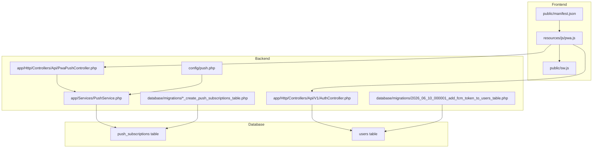
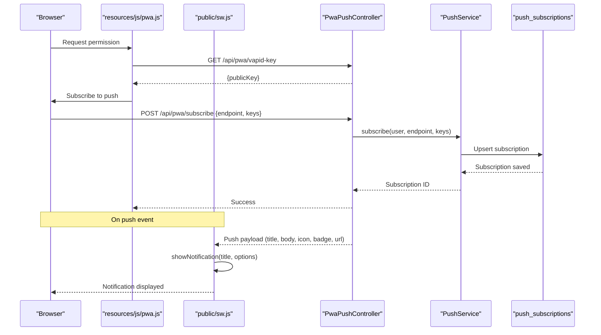
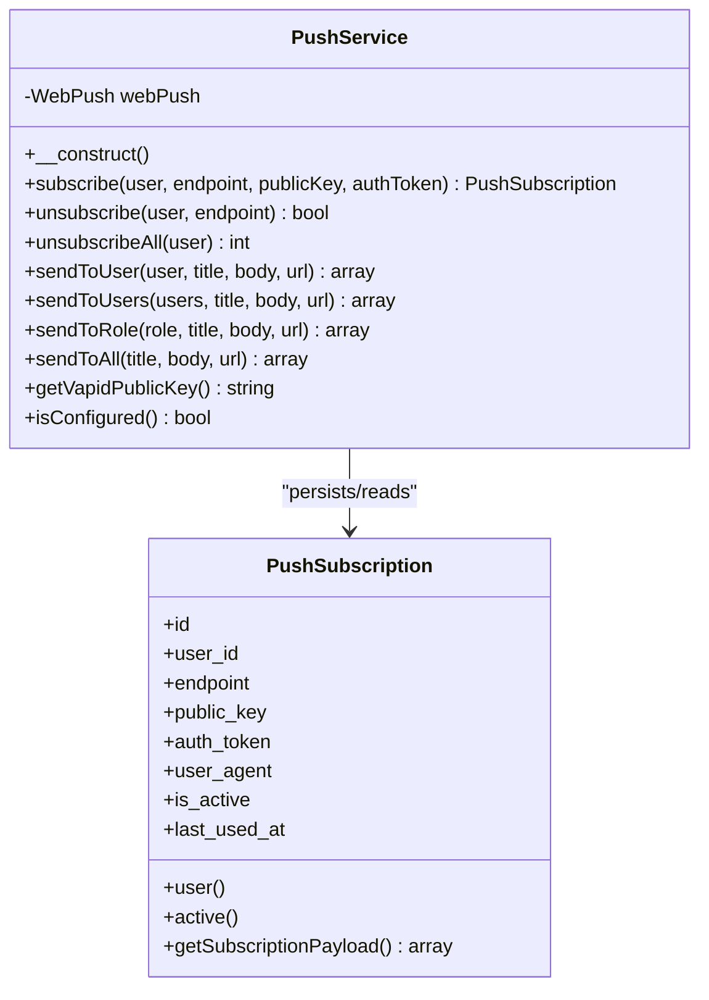
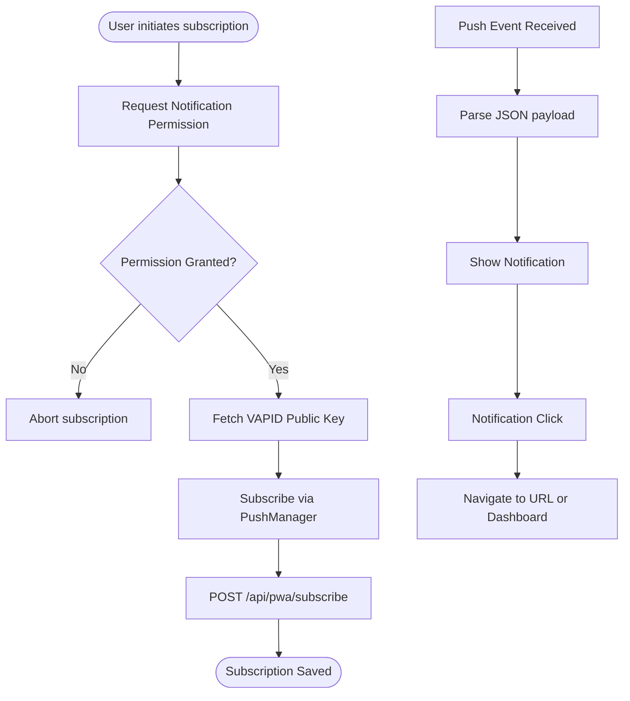
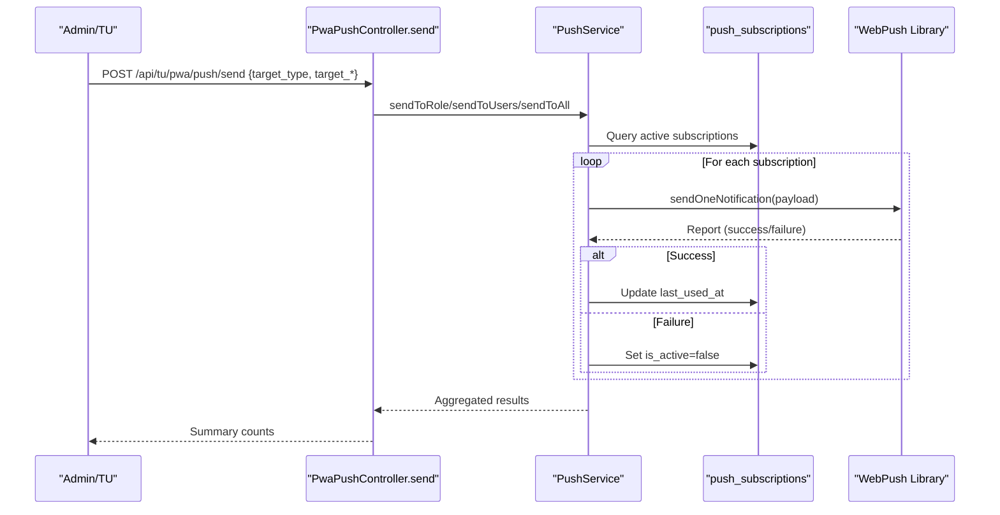
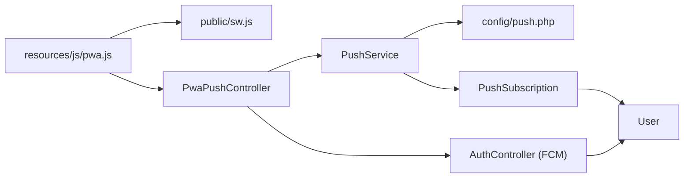

# Push Notification Service

<cite>
**Referenced Files in This Document**
- [PushService.php](file://app/Services/PushService.php)
- [PushSubscription.php](file://app/Models/PushSubscription.php)
- [push.php](file://config/push.php)
- [sw.js](file://public/sw.js)
- [pwa.js](file://resources/js/pwa.js)
- [manifest.json](file://public/manifest.json)
- [PwaPushController.php](file://app/Http/Controllers/Api/PwaPushController.php)
- [AuthController.php](file://app/Http/Controllers/Api/V1/AuthController.php)
- [api.php](file://routes/api.php)
- [PwaAuth.php](file://app/Http/Middleware/PwaAuth.php)
- [2026_06_08_100000_create_push_subscriptions_table.php](file://database/migrations/2026_06_08_100000_create_push_subscriptions_table.php)
- [2026_06_10_000001_add_fcm_token_to_users_table.php](file://database/migrations/2026_06_10_000001_add_fcm_token_to_users_table.php)
</cite>

## Table of Contents
1. [Introduction](#introduction)
2. [Project Structure](#project-structure)
3. [Core Components](#core-components)
4. [Architecture Overview](#architecture-overview)
5. [Detailed Component Analysis](#detailed-component-analysis)
6. [Dependency Analysis](#dependency-analysis)
7. [Performance Considerations](#performance-considerations)
8. [Troubleshooting Guide](#troubleshooting-guide)
9. [Conclusion](#conclusion)
10. [Appendices](#appendices)

## Introduction
This document explains the push notification service implementation in RaporKM Laravel. It covers the Web Push protocol integration for delivering real-time notifications to users via Progressive Web App (PWA) clients, subscription management, payload formatting, and delivery mechanisms. It also documents Firebase Cloud Messaging (FCM) integration for mobile devices, cross-platform compatibility, background synchronization, offline handling, and operational guidance for targeted/broadcast notifications, scheduling, security, rate limiting, and troubleshooting.

## Project Structure
The push notification system spans backend services, models, configuration, frontend PWA logic, and service worker. Key areas:
- Backend service layer: PushService orchestrates Web Push delivery and manages subscriptions.
- Data model: PushSubscription persists user push endpoints and keys.
- Configuration: VAPID keys for Web Push are configured via config/push.php.
- Frontend: PWA JavaScript handles subscription lifecycle and background sync.
- Service Worker: Handles push events, notification display, and background sync.
- Mobile: FCM integration via AuthController for Android/iOS devices.
- Routing: API endpoints exposed under /api/pwa and /api/v1 routes.

**Diagram sources**
- [PushService.php:1-135](file://app/Services/PushService.php#L1-L135)
- [PwaPushController.php:1-120](file://app/Http/Controllers/Api/PwaPushController.php#L1-L120)
- [AuthController.php:101-130](file://app/Http/Controllers/Api/V1/AuthController.php#L101-L130)
- [push.php:1-10](file://config/push.php#L1-L10)
- [2026_06_08_100000_create_push_subscriptions_table.php:1-30](file://database/migrations/2026_06_08_100000_create_push_subscriptions_table.php#L1-L30)
- [2026_06_10_000001_add_fcm_token_to_users_table.php:11-12](file://database/migrations/2026_06_10_000001_add_fcm_token_to_users_table.php#L11-L12)
- [pwa.js:1-336](file://resources/js/pwa.js#L1-L336)
- [sw.js:1-161](file://public/sw.js#L1-161)
- [manifest.json:1-29](file://public/manifest.json#L1-L29)

**Section sources**
- [PushService.php:1-135](file://app/Services/PushService.php#L1-L135)
- [PwaPushController.php:1-120](file://app/Http/Controllers/Api/PwaPushController.php#L1-L120)
- [AuthController.php:101-130](file://app/Http/Controllers/Api/V1/AuthController.php#L101-L130)
- [push.php:1-10](file://config/push.php#L1-L10)
- [2026_06_08_100000_create_push_subscriptions_table.php:1-30](file://database/migrations/2026_06_08_100000_create_push_subscriptions_table.php#L1-L30)
- [2026_06_10_000001_add_fcm_token_to_users_table.php:11-12](file://database/migrations/2026_06_10_000001_add_fcm_token_to_users_table.php#L11-L12)
- [pwa.js:1-336](file://resources/js/pwa.js#L1-L336)
- [sw.js:1-161](file://public/sw.js#L1-L161)
- [manifest.json:1-29](file://public/manifest.json#L1-L29)

## Core Components
- PushService: Central service for Web Push delivery and subscription management. It constructs VAPID-secured payloads, sends notifications per subscription, and updates last-used timestamps.
- PushSubscription model: Persists push endpoint, keys, and subscription state for each user.
- PwaPushController: Exposes endpoints for VAPID key retrieval, subscription CRUD, status checks, and batch sending.
- AuthController: Manages FCM token registration/unregistration for mobile devices.
- PWA JavaScript: Handles browser permission, VAPID key fetching, subscription lifecycle, background sync queueing, and update prompts.
- Service Worker: Processes push messages, displays notifications, handles clicks, and performs background sync.
- Configuration: VAPID subject/public/private keys configured via config/push.php.

Key responsibilities:
- Subscription management: create/update, deactivate on failure, bulk deactivation.
- Delivery: per-user, per-role, per-list of users, or broadcast to all subscribed users.
- Payload: standardized fields (title, body, icon, badge, optional URL).
- Cross-platform: Web Push via VAPID and FCM for mobile.

**Section sources**
- [PushService.php:10-135](file://app/Services/PushService.php#L10-L135)
- [PushSubscription.php:7-50](file://app/Models/PushSubscription.php#L7-L50)
- [PwaPushController.php:11-120](file://app/Http/Controllers/Api/PwaPushController.php#L11-L120)
- [AuthController.php:101-130](file://app/Http/Controllers/Api/V1/AuthController.php#L101-L130)
- [pwa.js:121-267](file://resources/js/pwa.js#L121-L267)
- [sw.js:58-110](file://public/sw.js#L58-L110)
- [push.php:3-9](file://config/push.php#L3-L9)

## Architecture Overview
The system integrates three channels:
- Web Push (VAPID): Browser-based notifications delivered via Web Push protocol.
- FCM (mobile): Device-specific notifications for Android/iOS using FCM tokens.
- Background Sync: Offline data synchronization queued in IndexedDB and executed when connectivity resumes.

**Diagram sources**
- [PwaPushController.php:17-43](file://app/Http/Controllers/Api/PwaPushController.php#L17-L43)
- [PushService.php:25-36](file://app/Services/PushService.php#L25-L36)
- [PushSubscription.php:39-48](file://app/Models/PushSubscription.php#L39-L48)
- [pwa.js:127-210](file://resources/js/pwa.js#L127-L210)
- [sw.js:58-91](file://public/sw.js#L58-L91)

## Detailed Component Analysis

### PushService
Responsibilities:
- Initialize WebPush with VAPID credentials from configuration.
- Manage subscriptions: create/update, deactivate on delivery failure, bulk deactivation.
- Send notifications: per user, per role, per list of users, or broadcast to all subscribed users.
- Build standardized notification payload with title, body, icon, badge, and optional URL.
- Track last successful delivery per subscription.

Implementation highlights:
- VAPID configuration via config/push.php.
- Subscription persistence and retrieval via PushSubscription model.
- Per-subscription delivery loop with success/error handling and automatic deactivation on failure.
- Role-based targeting supports numeric role codes mapped to role names.

**Diagram sources**
- [PushService.php:10-135](file://app/Services/PushService.php#L10-L135)
- [PushSubscription.php:7-50](file://app/Models/PushSubscription.php#L7-L50)

**Section sources**
- [PushService.php:14-23](file://app/Services/PushService.php#L14-L23)
- [PushService.php:25-50](file://app/Services/PushService.php#L25-L50)
- [PushService.php:52-122](file://app/Services/PushService.php#L52-L122)
- [PushService.php:124-133](file://app/Services/PushService.php#L124-L133)

### PushSubscription Model
Responsibilities:
- Persist subscription metadata: endpoint, keys, user agent, activation state, last used timestamp.
- Provide relationship to User and scope for active subscriptions.
- Serialize subscription payload for Web Push library consumption.

Key attributes and methods:
- Fillable fields include endpoint, keys, user agent, activation state, and timestamps.
- Casts: boolean for is_active and datetime for last_used_at.
- Relationship: belongsTo(User).
- Scope: active().
- Helper: getSubscriptionPayload() returns endpoint and keys in Web Push format.

**Section sources**
- [PushSubscription.php:11-27](file://app/Models/PushSubscription.php#L11-L27)
- [PushSubscription.php:29-37](file://app/Models/PushSubscription.php#L29-L37)
- [PushSubscription.php:39-48](file://app/Models/PushSubscription.php#L39-L48)

### PWA Push Controller
Endpoints:
- GET /api/pwa/vapid-key: Returns VAPID public key for browser subscription.
- POST /api/pwa/subscribe: Creates or updates a subscription for the authenticated user.
- POST /api/pwa/unsubscribe: Deactivates a specific subscription.
- POST /api/pwa/unsubscribe-all: Deactivates all subscriptions for the user.
- GET /api/pwa/push-status: Reports whether the user has active subscriptions.
- POST /api/tu/pwa/push/send: Sends notifications to users (TU role only).

Validation and routing:
- Uses PWA authentication middleware to bind user context.
- Validates payload shape for subscription and send operations.
- Supports target_type: all, role, user with appropriate constraints.

**Section sources**
- [PwaPushController.php:17-75](file://app/Http/Controllers/Api/PwaPushController.php#L17-L75)
- [PwaPushController.php:77-118](file://app/Http/Controllers/Api/PwaPushController.php#L77-L118)
- [api.php:40-62](file://routes/api.php#L40-L62)
- [PwaAuth.php:14-42](file://app/Http/Middleware/PwaAuth.php#L14-L42)

### FCM Integration (Mobile)
Purpose:
- Register/unregister FCM tokens for mobile devices to enable push notifications on Android/iOS.

Endpoints:
- POST /api/v1/auth/fcm: Registers or updates the user's FCM token and device name.
- DELETE /api/v1/auth/fcm: Removes the stored FCM token.

Data model:
- Users table extended with fcm_token and device_name fields.

**Section sources**
- [AuthController.php:101-130](file://app/Http/Controllers/Api/V1/AuthController.php#L101-L130)
- [2026_06_10_000001_add_fcm_token_to_users_table.php:11-12](file://database/migrations/2026_06_10_000001_add_fcm_token_to_users_table.php#L11-L12)
- [api.php:74-76](file://routes/api.php#L74-L76)

### PWA JavaScript and Service Worker
PWA JavaScript responsibilities:
- Auto-login via stored token.
- Request browser notification permission.
- Fetch VAPID public key from server.
- Subscribe/unsubscribe to push notifications and persist subscription state.
- Queue background sync operations in IndexedDB and trigger sync when available.
- Handle update prompts and apply updates.

Service Worker responsibilities:
- Cache strategy for offline support.
- Handle push events: parse payload, display notification, set vibration and badges.
- Handle notification click: navigate to URL or dashboard.
- Background sync handler: iterate IndexedDB queue and retry failed requests.

**Diagram sources**
- [pwa.js:127-210](file://resources/js/pwa.js#L127-L210)
- [pwa.js:271-309](file://resources/js/pwa.js#L271-L309)
- [sw.js:58-110](file://public/sw.js#L58-L110)
- [sw.js:112-160](file://public/sw.js#L112-L160)

**Section sources**
- [pwa.js:32-60](file://resources/js/pwa.js#L32-L60)
- [pwa.js:127-210](file://resources/js/pwa.js#L127-L210)
- [pwa.js:271-309](file://resources/js/pwa.js#L271-L309)
- [sw.js:58-110](file://public/sw.js#L58-L110)
- [sw.js:112-160](file://public/sw.js#L112-L160)

### Notification Payload and Delivery Mechanisms
Payload structure:
- Required: title, body.
- Optional: icon, badge, url.
- Delivery: per subscription with per-call reporting success/failure.

Delivery targets:
- Per user: retrieves active subscriptions and sends to each.
- Per role: resolves users by role and sends to each.
- Per user list: accepts array of user IDs.
- Broadcast: finds all users with active subscriptions.

**Diagram sources**
- [PwaPushController.php:77-118](file://app/Http/Controllers/Api/PwaPushController.php#L77-L118)
- [PushService.php:52-122](file://app/Services/PushService.php#L52-L122)
- [PushSubscription.php:34-37](file://app/Models/PushSubscription.php#L34-L37)

**Section sources**
- [PushService.php:58-87](file://app/Services/PushService.php#L58-L87)
- [PwaPushController.php:79-107](file://app/Http/Controllers/Api/PwaPushController.php#L79-L107)

### Cross-Platform Compatibility
- Web Push: Browser-based via VAPID keys and PushManager.
- FCM: Mobile devices using device tokens stored in users table.
- PWA: Standalone experience with service worker for offline and background capabilities.

Manifest and icons:
- Manifest defines app identity, display mode, and icon assets for installability.

**Section sources**
- [manifest.json:1-29](file://public/manifest.json#L1-L29)
- [AuthController.php:108-111](file://app/Http/Controllers/Api/V1/AuthController.php#L108-L111)

## Dependency Analysis
High-level dependencies:
- PushService depends on WebPush library and configuration for VAPID.
- PwaPushController depends on PushService and PWA authentication middleware.
- PushSubscription model depends on User model and database schema.
- PWA JavaScript depends on service worker and API endpoints.
- Service Worker depends on browser APIs and IndexedDB for background sync.

**Diagram sources**
- [PwaPushController.php:13-15](file://app/Http/Controllers/Api/PwaPushController.php#L13-L15)
- [PushService.php:14-23](file://app/Services/PushService.php#L14-L23)
- [PushSubscription.php:29-32](file://app/Models/PushSubscription.php#L29-L32)
- [AuthController.php:108-111](file://app/Http/Controllers/Api/V1/AuthController.php#L108-L111)

**Section sources**
- [PwaPushController.php:13-15](file://app/Http/Controllers/Api/PwaPushController.php#L13-L15)
- [PushService.php:14-23](file://app/Services/PushService.php#L14-L23)
- [PushSubscription.php:29-32](file://app/Models/PushSubscription.php#L29-L32)
- [AuthController.php:108-111](file://app/Http/Controllers/Api/V1/AuthController.php#L108-L111)

## Performance Considerations
- Batch delivery: Sending to many users iterates per subscription; consider queuing and asynchronous processing for large broadcasts.
- Database queries: Active subscription queries are O(n) per user; ensure indexing on user_id and endpoint.
- WebPush throughput: Network latency and provider limits; monitor delivery reports and prune inactive subscriptions.
- Background sync: IndexedDB operations should be batched to avoid blocking the UI thread.
- Caching: Service worker caches static assets; ensure cache invalidation during updates.

## Troubleshooting Guide
Common issues and resolutions:
- Subscription fails immediately:
  - Verify VAPID keys are configured and not empty.
  - Check subscription payload validity and endpoint reachability.
- Notifications not received:
  - Confirm browser permission granted.
  - Ensure service worker is registered and active.
  - Validate push event parsing and notification options.
- Delivery failures reported:
  - Review per-subscription report reasons and automatically deactivate failed subscriptions.
  - Monitor subscription expiration and renewal.
- FCM token errors:
  - Ensure token registration endpoint is called with proper validation.
  - Clear stale tokens when devices change.

Operational checks:
- Use GET /api/pwa/push-status to confirm active subscriptions.
- Use GET /api/pwa/vapid-key to verify VAPID public key availability.
- For mobile, verify fcm_token presence in user record.

**Section sources**
- [PushService.php:76-83](file://app/Services/PushService.php#L76-L83)
- [PwaPushController.php:67-75](file://app/Http/Controllers/Api/PwaPushController.php#L67-L75)
- [AuthController.php:101-130](file://app/Http/Controllers/Api/V1/AuthController.php#L101-L130)

## Conclusion
RaporKM’s push notification system combines Web Push (VAPID) for browsers, FCM for mobile devices, and PWA capabilities for offline and background experiences. The PushService centralizes subscription management and delivery, while the PWA JavaScript and service worker handle user-facing interactions and reliability. Proper configuration, monitoring, and maintenance of VAPID keys, subscription states, and background sync ensure robust, cross-platform real-time communication.

## Appendices

### Configuration Reference
- VAPID subject, public key, private key are loaded from config/push.php and environment variables.

**Section sources**
- [push.php:3-9](file://config/push.php#L3-L9)

### Database Schema Notes
- push_subscriptions table stores endpoint, keys, user association, activation state, and timestamps.
- users table extended with fcm_token and device_name for mobile FCM.

**Section sources**
- [2026_06_08_100000_create_push_subscriptions_table.php:11-23](file://database/migrations/2026_06_08_100000_create_push_subscriptions_table.php#L11-L23)
- [2026_06_10_000001_add_fcm_token_to_users_table.php:11-12](file://database/migrations/2026_06_10_000001_add_fcm_token_to_users_table.php#L11-L12)

### Examples and Patterns
- Targeted notification to a single user: call sendToUser with user and payload.
- Broadcast to all users with active subscriptions: call sendToAll with title/body.
- Role-based broadcast: call sendToRole with role code or name.
- Schedule delivery: queue operations and rely on background sync for retries.

[No sources needed since this section aggregates previously analyzed patterns]