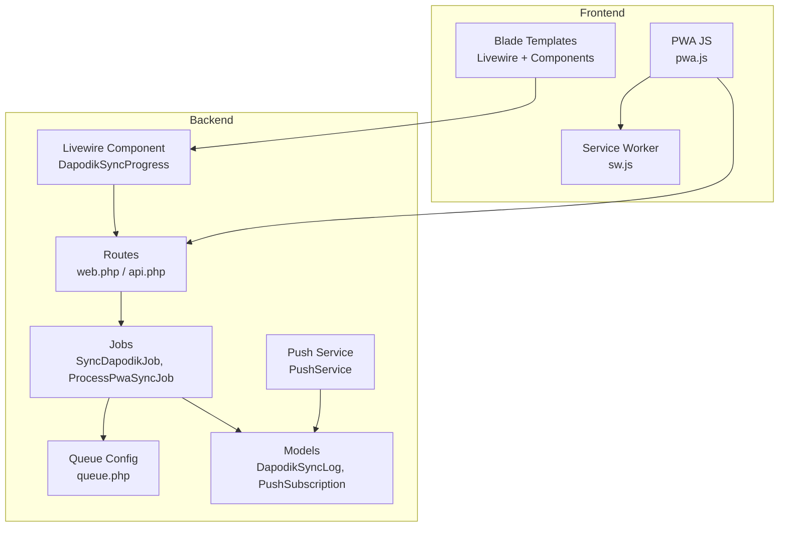
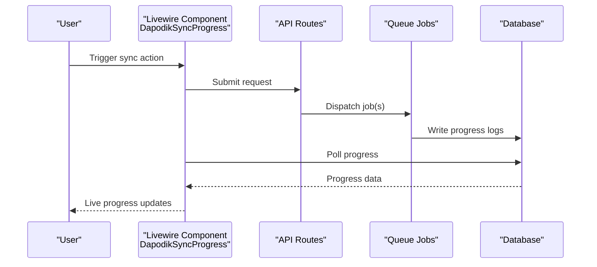
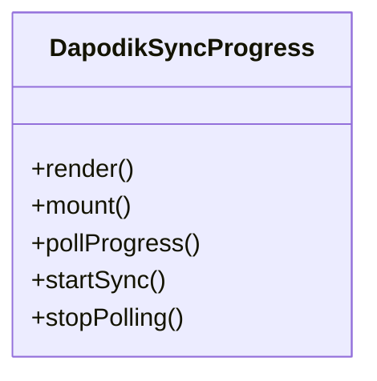
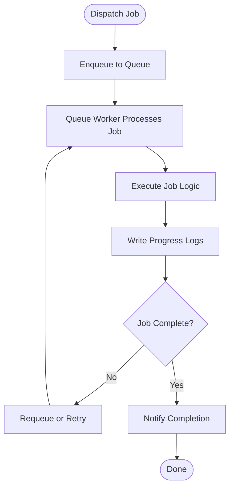
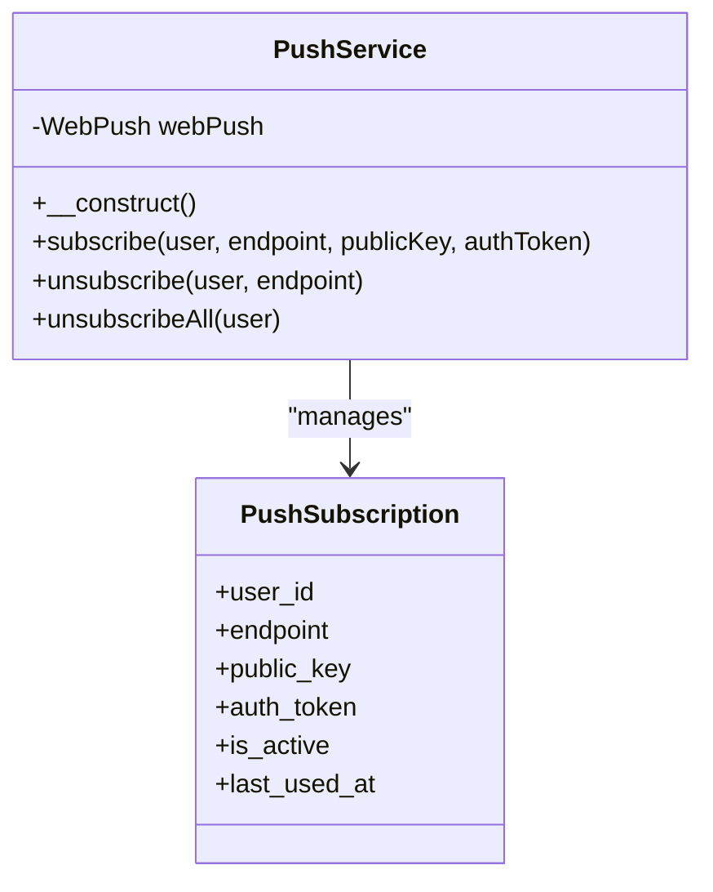
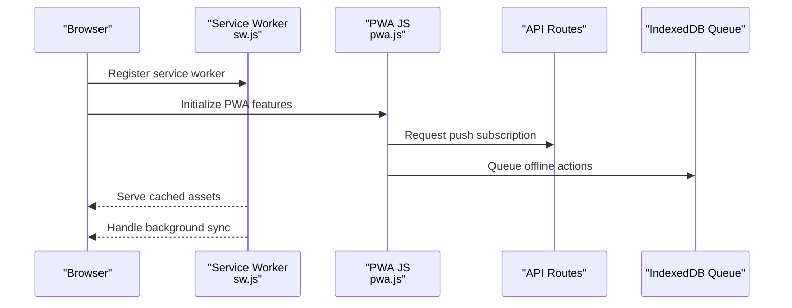
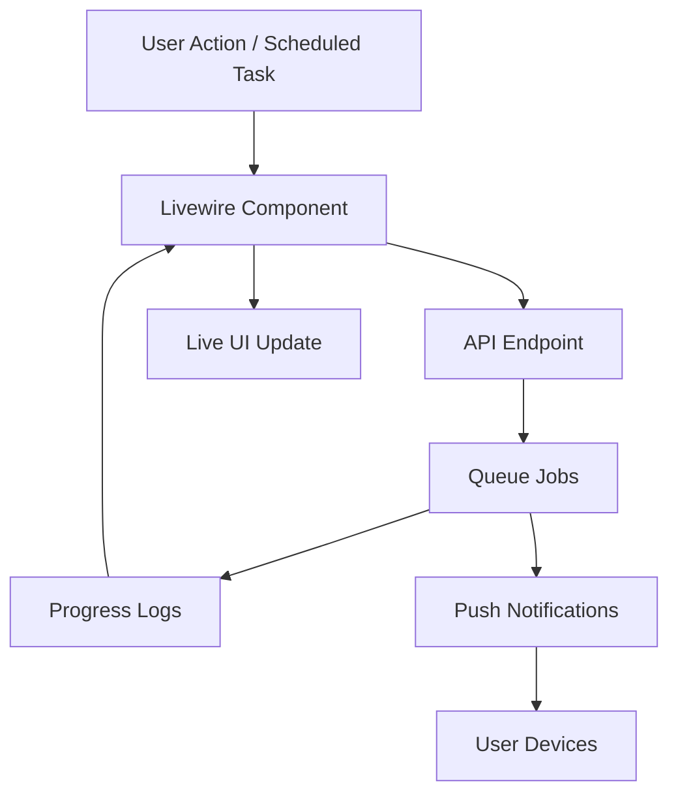
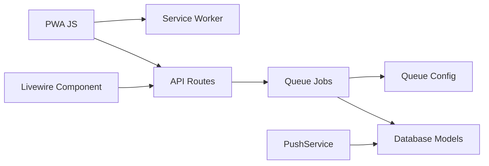

# Real-time Features

<cite>
**Referenced Files in This Document**
- [pwa.js](file://public/js/pwa.js)
- [pwa.js](file://resources/js/pwa.js)
- [PushService.php](file://app/Services/PushService.php)
- [config/push.php](file://config/push.php)
- [routes/web.php](file://routes/web.php)
- [routes/api.php](file://routes/api.php)
- [app/Jobs/SyncDapodikJob.php](file://app/Jobs/SyncDapodikJob.php)
- [app/Jobs/ProcessPwaSyncJob.php](file://app/Jobs/ProcessPwaSyncJob.php)
- [app/Livewire/DapodikSyncProgress.php](file://app/Livewire/DapodikSyncProgress.php)
- [resources/views/livewire/dapodik-sync-progress.blade.php](file://resources/views/livewire/dapodik-sync-progress.blade.php)
- [app/Models/DapodikSyncLog.php](file://app/Models/DapodikSyncLog.php)
- [config/queue.php](file://config/queue.php)
- [database/migrations/2026_06_08_100000_create_push_subscriptions_table.php](file://database/migrations/2026_06_08_100000_create_push_subscriptions_table.php)
- [database/migrations/2026_06_04_000001_add_batch_fields_to_dapodik_sync_logs_table.php](file://database/migrations/2026_06_04_000001_add_batch_fields_to_dapodik_sync_logs_table.php)
- [public/sw.js](file://public/sw.js)
- [public/manifest.json](file://public/manifest.json)
- [resources/views/components/pwa-update-prompt.blade.php](file://resources/views/components/pwa-update-prompt.blade.php)
- [app/Http/Middleware/PwaAuth.php](file://app/Http/Middleware/PwaAuth.php)
- [app/Providers/VoltServiceProvider.php](file://app/Providers/VoltServiceProvider.php)
- [config/livewire.php](file://config/livewire.php)
</cite>

## Table of Contents
1. [Introduction](#introduction)
2. [Project Structure](#project-structure)
3. [Core Components](#core-components)
4. [Architecture Overview](#architecture-overview)
5. [Detailed Component Analysis](#detailed-component-analysis)
6. [Dependency Analysis](#dependency-analysis)
7. [Performance Considerations](#performance-considerations)
8. [Troubleshooting Guide](#troubleshooting-guide)
9. [Conclusion](#conclusion)

## Introduction
This document details the real-time features implemented in the application, focusing on Livewire reactive components, progress tracking for long-running operations, background job processing via Laravel queues, push notification services, and Progressive Web App (PWA) capabilities. It explains how dynamic UI updates occur without full page reloads, how long-running tasks are monitored and reported, how background jobs are scheduled and processed, how push notifications are delivered using Web Push protocols, and how the PWA provides offline-capable, app-like experiences with service workers and background sync.

## Project Structure
The real-time features span several layers:
- Frontend JavaScript for PWA, push notifications, and background sync
- Backend PHP services for push management and queue-backed operations
- Livewire components for reactive UI and progress tracking
- Database models and migrations supporting progress logs and subscriptions
- Route definitions exposing API endpoints for PWA and push operations

**Diagram sources**
- [pwa.js:1-34](file://public/js/pwa.js#L1-L34)
- [routes/web.php](file://routes/web.php)
- [routes/api.php](file://routes/api.php)
- [app/Livewire/DapodikSyncProgress.php](file://app/Livewire/DapodikSyncProgress.php)
- [app/Services/PushService.php:1-50](file://app/Services/PushService.php#L1-L50)
- [config/queue.php:67-108](file://config/queue.php#L67-L108)
- [app/Models/DapodikSyncLog.php](file://app/Models/DapodikSyncLog.php)
- [app/Jobs/SyncDapodikJob.php](file://app/Jobs/SyncDapodikJob.php)
- [app/Jobs/ProcessPwaSyncJob.php](file://app/Jobs/ProcessPwaSyncJob.php)

**Section sources**
- [pwa.js:1-34](file://public/js/pwa.js#L1-L34)
- [routes/web.php](file://routes/web.php)
- [routes/api.php](file://routes/api.php)
- [app/Livewire/DapodikSyncProgress.php](file://app/Livewire/DapodikSyncProgress.php)
- [app/Services/PushService.php:1-50](file://app/Services/PushService.php#L1-L50)
- [config/queue.php:67-108](file://config/queue.php#L67-L108)
- [app/Models/DapodikSyncLog.php](file://app/Models/DapodikSyncLog.php)
- [app/Jobs/SyncDapodikJob.php](file://app/Jobs/SyncDapodikJob.php)
- [app/Jobs/ProcessPwaSyncJob.php](file://app/Jobs/ProcessPwaSyncJob.php)

## Core Components
- Livewire reactive component for Dapodik synchronization progress
- Push notification service using Web Push protocol with VAPID
- PWA infrastructure including service worker, manifest, and background sync
- Laravel queue-backed jobs for long-running operations
- Database models for progress logs and push subscriptions

**Section sources**
- [app/Livewire/DapodikSyncProgress.php](file://app/Livewire/DapodikSyncProgress.php)
- [app/Services/PushService.php:1-50](file://app/Services/PushService.php#L1-L50)
- [pwa.js:1-34](file://public/js/pwa.js#L1-L34)
- [config/queue.php:67-108](file://config/queue.php#L67-L108)
- [app/Models/DapodikSyncLog.php](file://app/Models/DapodikSyncLog.php)

## Architecture Overview
The system integrates Livewire for reactive UI updates, Laravel queues for background processing, and a PWA stack for real-time client-side experiences. Push notifications are delivered via Web Push using VAPID keys configured in the backend.

**Diagram sources**
- [app/Livewire/DapodikSyncProgress.php](file://app/Livewire/DapodikSyncProgress.php)
- [routes/api.php](file://routes/api.php)
- [app/Jobs/SyncDapodikJob.php](file://app/Jobs/SyncDapodikJob.php)
- [app/Models/DapodikSyncLog.php](file://app/Models/DapodikSyncLog.php)

## Detailed Component Analysis

### Livewire Reactive Component for Progress Tracking
The Livewire component orchestrates the UI for long-running operations, enabling dynamic updates without full page reloads. It coordinates with backend jobs and polls progress logs to render live feedback.

**Diagram sources**
- [app/Livewire/DapodikSyncProgress.php](file://app/Livewire/DapodikSyncProgress.php)

**Section sources**
- [app/Livewire/DapodikSyncProgress.php](file://app/Livewire/DapodikSyncProgress.php)
- [resources/views/livewire/dapodik-sync-progress.blade.php](file://resources/views/livewire/dapodik-sync-progress.blade.php)

### Background Job Processing with Laravel Queues
Long-running tasks are offloaded to background jobs. The queue configuration supports Redis and specialized queue types. Jobs write progress to logs and can be batched for coordinated completion.

**Diagram sources**
- [config/queue.php:67-108](file://config/queue.php#L67-L108)
- [app/Jobs/SyncDapodikJob.php](file://app/Jobs/SyncDapodikJob.php)
- [app/Jobs/ProcessPwaSyncJob.php](file://app/Jobs/ProcessPwaSyncJob.php)
- [app/Models/DapodikSyncLog.php](file://app/Models/DapodikSyncLog.php)

**Section sources**
- [config/queue.php:67-108](file://config/queue.php#L67-L108)
- [app/Jobs/SyncDapodikJob.php](file://app/Jobs/SyncDapodikJob.php)
- [app/Jobs/ProcessPwaSyncJob.php](file://app/Jobs/ProcessPwaSyncJob.php)
- [app/Models/DapodikSyncLog.php](file://app/Models/DapodikSyncLog.php)

### Push Notification Service (Web Push)
The push service manages VAPID-enabled Web Push subscriptions, storing endpoint details per user and sending notifications when triggered by backend events.

**Diagram sources**
- [app/Services/PushService.php:1-50](file://app/Services/PushService.php#L1-L50)
- [database/migrations/2026_06_08_100000_create_push_subscriptions_table.php](file://database/migrations/2026_06_08_100000_create_push_subscriptions_table.php)

**Section sources**
- [app/Services/PushService.php:1-50](file://app/Services/PushService.php#L1-L50)
- [config/push.php](file://config/push.php)
- [database/migrations/2026_06_08_100000_create_push_subscriptions_table.php](file://database/migrations/2026_06_08_100000_create_push_subscriptions_table.php)

### PWA Infrastructure and Offline Capabilities
The PWA provides service worker-based offline support, update prompts, push notification registration, and background sync for pending operations. The service worker script and manifest are served statically.

**Diagram sources**
- [pwa.js:1-34](file://public/js/pwa.js#L1-L34)
- [pwa.js:163-276](file://public/js/pwa.js#L163-L276)
- [pwa.js:235-317](file://public/js/pwa.js#L235-L317)
- [public/sw.js](file://public/sw.js)
- [public/manifest.json](file://public/manifest.json)

**Section sources**
- [pwa.js:1-34](file://public/js/pwa.js#L1-L34)
- [pwa.js:163-276](file://public/js/pwa.js#L163-L276)
- [pwa.js:235-317](file://public/js/pwa.js#L235-L317)
- [public/sw.js](file://public/sw.js)
- [public/manifest.json](file://public/manifest.json)
- [resources/views/components/pwa-update-prompt.blade.php:30-55](file://resources/views/components/pwa-update-prompt.blade.php#L30-L55)

### Real-time Data Synchronization and Event-Driven Patterns
Livewire components reactively update UI based on polling backend progress logs. Jobs encapsulate long-running tasks and persist state for UI consumption. Push notifications serve as event-driven alerts to users.

**Diagram sources**
- [app/Livewire/DapodikSyncProgress.php](file://app/Livewire/DapodikSyncProgress.php)
- [routes/api.php](file://routes/api.php)
- [app/Jobs/SyncDapodikJob.php](file://app/Jobs/SyncDapodikJob.php)
- [app/Services/PushService.php:1-50](file://app/Services/PushService.php#L1-L50)

**Section sources**
- [app/Livewire/DapodikSyncProgress.php](file://app/Livewire/DapodikSyncProgress.php)
- [routes/api.php](file://routes/api.php)
- [app/Jobs/SyncDapodikJob.php](file://app/Jobs/SyncDapodikJob.php)
- [app/Services/PushService.php:1-50](file://app/Services/PushService.php#L1-L50)

## Dependency Analysis
The real-time features depend on:
- Livewire for reactive UI updates and component lifecycle
- Laravel queues for background job execution and progress persistence
- Web Push library for VAPID-based push notifications
- Service worker for offline caching and background sync
- Database models for progress logs and push subscriptions

**Diagram sources**
- [app/Livewire/DapodikSyncProgress.php](file://app/Livewire/DapodikSyncProgress.php)
- [routes/api.php](file://routes/api.php)
- [app/Jobs/SyncDapodikJob.php](file://app/Jobs/SyncDapodikJob.php)
- [app/Services/PushService.php:1-50](file://app/Services/PushService.php#L1-L50)
- [config/queue.php:67-108](file://config/queue.php#L67-L108)
- [pwa.js:1-34](file://public/js/pwa.js#L1-L34)
- [public/sw.js](file://public/sw.js)

**Section sources**
- [app/Livewire/DapodikSyncProgress.php](file://app/Livewire/DapodikSyncProgress.php)
- [routes/api.php](file://routes/api.php)
- [app/Jobs/SyncDapodikJob.php](file://app/Jobs/SyncDapodikJob.php)
- [app/Services/PushService.php:1-50](file://app/Services/PushService.php#L1-L50)
- [config/queue.php:67-108](file://config/queue.php#L67-L108)
- [pwa.js:1-34](file://public/js/pwa.js#L1-L34)
- [public/sw.js](file://public/sw.js)

## Performance Considerations
- Queue tuning: Ensure retry_after exceeds job timeouts to prevent duplicate executions.
- Backoff strategies: Use exponential backoff for external API calls within jobs.
- Unique jobs: Prevent duplicate processing using unique job identifiers.
- Batching: Group related jobs to reduce overhead and coordinate completion.
- Livewire polling: Limit polling frequency and use efficient queries to minimize load.
- PWA caching: Optimize service worker caching strategies and IndexedDB usage for background sync.

[No sources needed since this section provides general guidance]

## Troubleshooting Guide
- Livewire progress not updating: Verify component polling logic and backend progress log writes.
- Queue jobs not executing: Confirm queue worker is running and queue configuration matches job drivers.
- Push notifications failing: Check VAPID keys configuration and subscription storage; validate endpoint reachability.
- PWA offline issues: Inspect service worker registration, cache strategies, and IndexedDB queue health.
- Authentication in PWA: Ensure PWA auth middleware and token storage are functioning correctly.

**Section sources**
- [app/Livewire/DapodikSyncProgress.php](file://app/Livewire/DapodikSyncProgress.php)
- [config/queue.php:67-108](file://config/queue.php#L67-L108)
- [app/Services/PushService.php:1-50](file://app/Services/PushService.php#L1-L50)
- [pwa.js:1-34](file://public/js/pwa.js#L1-L34)
- [app/Http/Middleware/PwaAuth.php](file://app/Http/Middleware/PwaAuth.php)

## Conclusion
The application leverages Livewire for reactive UI updates, Laravel queues for robust background processing, Web Push for real-time user alerts, and a comprehensive PWA stack for offline-capable experiences. Together, these technologies deliver responsive, scalable, and resilient real-time features suitable for educational data synchronization and reporting workflows.