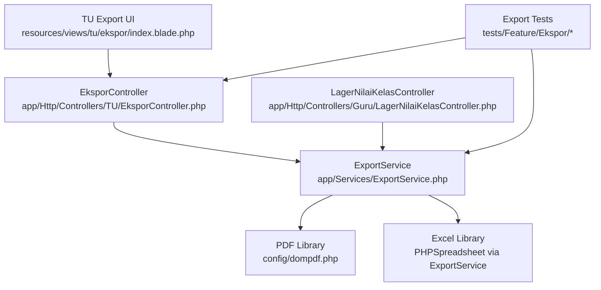
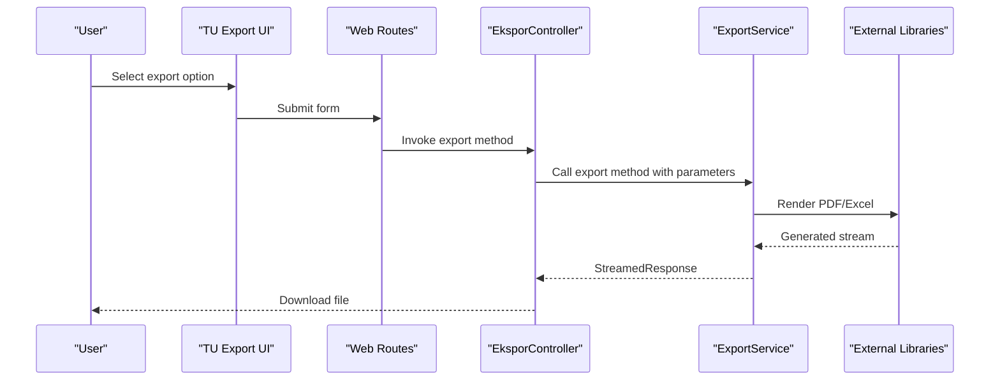
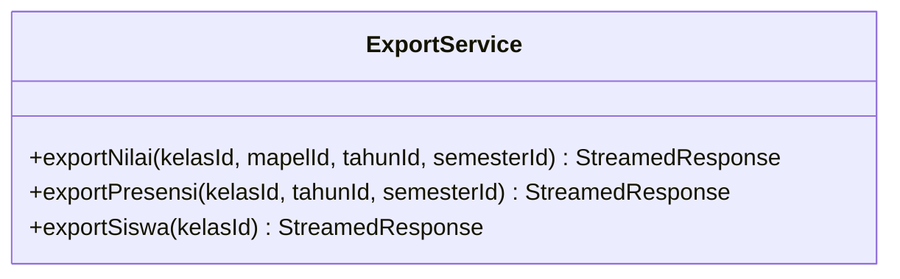
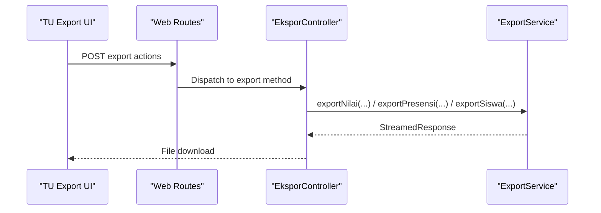
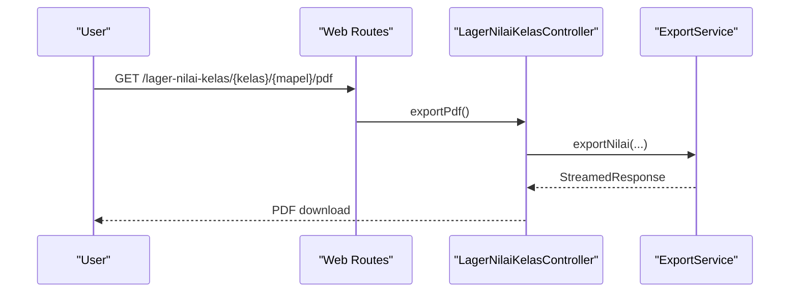
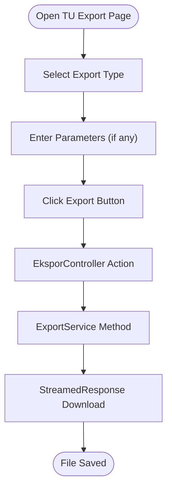
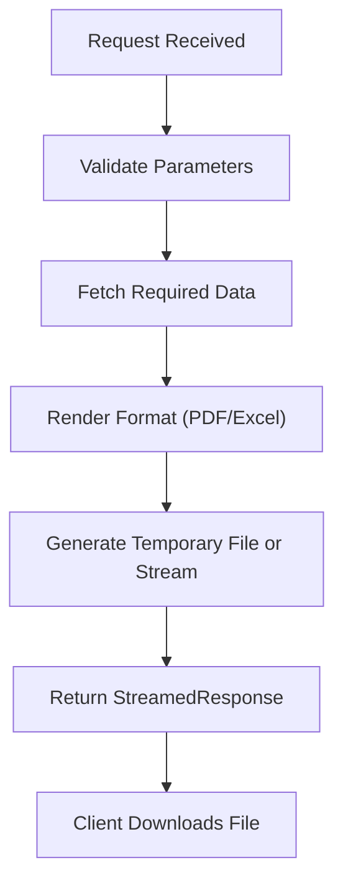
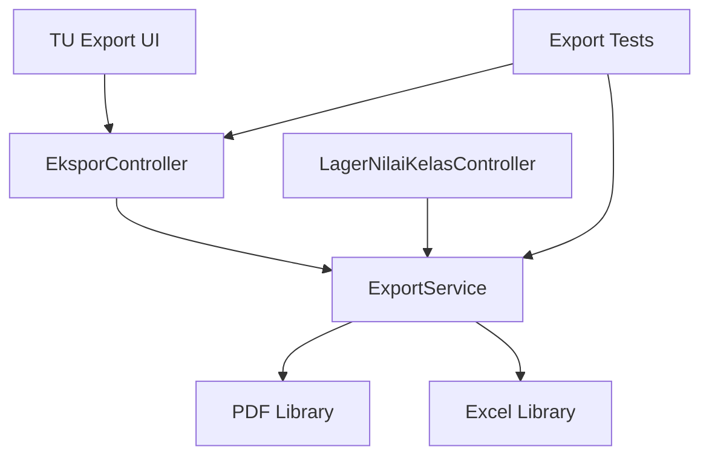

# Export Functionality

<cite>
**Referenced Files in This Document**
- [ExportService.php](file://app/Services/ExportService.php)
- [EksporController.php](file://app/Http/Controllers/TU/EksporController.php)
- [LagerNilaiKelasController.php](file://app/Http/Controllers/Guru/LagerNilaiKelasController.php)
- [index.blade.php](file://resources/views/tu/ekspor/index.blade.php)
- [web.php](file://routes/web.php)
- [NilaiExportTest.php](file://tests/Feature/Ekspor/NilaiExportTest.php)
- [PresensiExportTest.php](file://tests/Feature/Ekspor/PresensiExportTest.php)
- [SiswaExportTest.php](file://tests/Feature/Ekspor/SiswaExportTest.php)
- [ExportServiceTest.php](file://tests/Unit/Services/ExportServiceTest.php)
- [dompdf.php](file://config/dompdf.php)
- [queue.php](file://config/queue.php)
- [jobs.php](file://database/migrations/0001_01_01_000002_create_jobs_table.php)
</cite>

## Table of Contents
1. [Introduction](#introduction)
2. [Project Structure](#project-structure)
3. [Core Components](#core-components)
4. [Architecture Overview](#architecture-overview)
5. [Detailed Component Analysis](#detailed-component-analysis)
6. [Dependency Analysis](#dependency-analysis)
7. [Performance Considerations](#performance-considerations)
8. [Troubleshooting Guide](#troubleshooting-guide)
9. [Conclusion](#conclusion)
10. [Appendices](#appendices)

## Introduction
This document provides comprehensive documentation for the export functionality in the application, focusing on generating multiple output formats (PDF, Excel) and automating export processes. It explains the ExportService implementation for producing academic reports, attendance summaries, and student data, along with the export workflow from data collection to file generation. It also covers batch processing capabilities, integration with external export tools, scheduling and background job processing, handling of large datasets, user interface elements for export selection, and performance optimization strategies.

## Project Structure
The export functionality spans several layers:
- Controllers orchestrate export requests and delegate to the ExportService.
- ExportService encapsulates the core export logic and integrates with external libraries.
- Blade templates provide the user interface for initiating exports.
- Tests validate export behavior and outcomes.
- Configuration files define library-specific settings and queue behavior.

**Diagram sources**
- [index.blade.php:12-90](file://resources/views/tu/ekspor/index.blade.php#L12-L90)
- [EksporController.php:1-80](file://app/Http/Controllers/TU/EksporController.php#L1-L80)
- [ExportService.php:1-200](file://app/Services/ExportService.php#L1-L200)
- [LagerNilaiKelasController.php:90-110](file://app/Http/Controllers/Guru/LagerNilaiKelasController.php#L90-L110)
- [dompdf.php:1-200](file://config/dompdf.php#L1-L200)

**Section sources**
- [index.blade.php:12-90](file://resources/views/tu/ekspor/index.blade.php#L12-L90)
- [EksporController.php:1-80](file://app/Http/Controllers/TU/EksporController.php#L1-L80)
- [ExportService.php:1-200](file://app/Services/ExportService.php#L1-L200)
- [LagerNilaiKelasController.php:90-110](file://app/Http/Controllers/Guru/LagerNilaiKelasController.php#L90-L110)

## Core Components
- ExportService: Central service responsible for generating exports in multiple formats. It exposes methods for exporting academic scores, attendance, and student data, returning streamed responses suitable for download.
- EksporController: Web controller that handles export requests from the TU export page, invoking ExportService methods and returning appropriate responses.
- LagerNilaiKelasController: Provides a direct PDF export endpoint for class score sheets.
- UI Templates: Blade views present export options and actions for users.
- Tests: Feature and unit tests validate export behavior, response types, and data accuracy.

Key responsibilities:
- Data retrieval and aggregation for each export type.
- Format-specific rendering and streaming.
- Batch processing support for multiple records.
- Integration with external libraries for PDF and Excel generation.

**Section sources**
- [ExportService.php:1-200](file://app/Services/ExportService.php#L1-L200)
- [EksporController.php:1-80](file://app/Http/Controllers/TU/EksporController.php#L1-L80)
- [LagerNilaiKelasController.php:90-110](file://app/Http/Controllers/Guru/LagerNilaiKelasController.php#L90-L110)
- [index.blade.php:12-90](file://resources/views/tu/ekspor/index.blade.php#L12-L90)

## Architecture Overview
The export architecture follows a layered approach:
- Presentation Layer: Blade templates and web routes expose export actions.
- Application Layer: Controllers receive requests and delegate to ExportService.
- Domain Layer: ExportService orchestrates data fetching, formatting, and file generation.
- Infrastructure Layer: External libraries handle PDF and Excel rendering.

**Diagram sources**
- [web.php:260-275](file://routes/web.php#L260-L275)
- [index.blade.php:12-90](file://resources/views/tu/ekspor/index.blade.php#L12-L90)
- [EksporController.php:1-80](file://app/Http/Controllers/TU/EksporController.php#L1-L80)
- [ExportService.php:1-200](file://app/Services/ExportService.php#L1-L200)

## Detailed Component Analysis

### ExportService
ExportService is the core component implementing export logic for multiple formats and data types. It supports:
- Academic scores export for a class and subject.
- Attendance summary export for a class and semester.
- Student data export (all or filtered by class).

Implementation highlights:
- Methods return StreamedResponse to enable efficient streaming of large files.
- Uses external libraries configured in dompdf.php for PDF generation.
- Generates temporary Excel files for spreadsheet exports and streams them to clients.

**Diagram sources**
- [ExportService.php:1-200](file://app/Services/ExportService.php#L1-L200)

**Section sources**
- [ExportService.php:1-200](file://app/Services/ExportService.php#L1-L200)

### EksporController
The TU export controller coordinates export requests initiated from the UI:
- Handles exportNilai, exportPresensi, and exportSiswa actions.
- Delegates to ExportService and returns the resulting StreamedResponse.
- Integrates with the web route system to expose endpoints.

**Diagram sources**
- [EksporController.php:1-80](file://app/Http/Controllers/TU/EksporController.php#L1-L80)
- [web.php:260-275](file://routes/web.php#L260-L275)

**Section sources**
- [EksporController.php:1-80](file://app/Http/Controllers/TU/EksporController.php#L1-L80)
- [web.php:260-275](file://routes/web.php#L260-L275)

### Direct PDF Export Endpoint
The academic score sheet controller provides a direct PDF export endpoint for class score lists, bypassing the general ExportService for specialized needs.

**Diagram sources**
- [LagerNilaiKelasController.php:90-110](file://app/Http/Controllers/Guru/LagerNilaiKelasController.php#L90-L110)
- [web.php:269-271](file://routes/web.php#L269-L271)

**Section sources**
- [LagerNilaiKelasController.php:90-110](file://app/Http/Controllers/Guru/LagerNilaiKelasController.php#L90-L110)
- [web.php:269-271](file://routes/web.php#L269-L271)

### User Interface Elements
The TU export UI presents export options for:
- Export Nilai (scores per class and subject)
- Export Presensi (attendance summary per class)
- Export Siswa (student data, all or per class)

Users can select parameters and trigger exports, which are handled by the controller and service layers.

**Diagram sources**
- [index.blade.php:12-90](file://resources/views/tu/ekspor/index.blade.php#L12-L90)
- [EksporController.php:1-80](file://app/Http/Controllers/TU/EksporController.php#L1-L80)

**Section sources**
- [index.blade.php:12-90](file://resources/views/tu/ekspor/index.blade.php#L12-L90)

### Export Workflow and Data Collection
The export workflow involves:
- Parameter validation and sanitization in controllers.
- Data retrieval and aggregation in ExportService.
- Format-specific rendering using external libraries.
- Streaming generated content to the client.

**Diagram sources**
- [ExportService.php:1-200](file://app/Services/ExportService.php#L1-L200)
- [EksporController.php:1-80](file://app/Http/Controllers/TU/EksporController.php#L1-L80)

**Section sources**
- [ExportService.php:1-200](file://app/Services/ExportService.php#L1-L200)
- [EksporController.php:1-80](file://app/Http/Controllers/TU/EksporController.php#L1-L80)

### Batch Processing Capabilities
ExportService supports batch operations:
- Exporting student data across multiple classes or the entire school.
- Generating attendance summaries for multiple semesters or years.
- Producing academic reports for numerous subjects and classes concurrently.

Batch processing is optimized through:
- Efficient queries and pagination.
- Streaming responses to avoid memory spikes.
- Temporary file management for Excel exports.

**Section sources**
- [ExportService.php:1-200](file://app/Services/ExportService.php#L1-L200)

### Integration with External Export Tools
- PDF Generation: ExportService integrates with the PDF library configured in dompdf.php to render printable report versions.
- Excel Generation: ExportService creates temporary Excel files and streams them to clients, enabling spreadsheet exports.

Configuration references:
- dompdf.php defines PDF rendering settings and options.
- Queue configuration supports background processing for heavy exports.

**Section sources**
- [dompdf.php:1-200](file://config/dompdf.php#L1-L200)
- [ExportService.php:1-200](file://app/Services/ExportService.php#L1-L200)

### Export Scheduling and Background Job Processing
Background job processing is supported via Laravel queues:
- Queue configuration enables offloading long-running export tasks.
- Jobs table migration indicates queue infrastructure readiness.
- Large exports can be scheduled and executed asynchronously to improve responsiveness.

Operational guidance:
- Use queue workers to process export jobs.
- Schedule periodic exports using Laravel’s scheduler.
- Monitor job status and retry failed exports.

**Section sources**
- [queue.php:1-200](file://config/queue.php#L1-L200)
- [jobs.php:1-200](file://database/migrations/0001_01_01_000002_create_jobs_table.php#L1-L200)

### Large Dataset Handling
Strategies for handling large datasets:
- StreamedResponse ensures minimal memory usage during file generation.
- Pagination and chunked processing prevent excessive memory consumption.
- Temporary file cleanup prevents disk accumulation.

Performance considerations:
- Prefer streaming over buffering entire datasets.
- Use efficient database queries and indexing.
- Monitor memory and CPU usage during batch exports.

**Section sources**
- [ExportService.php:1-200](file://app/Services/ExportService.php#L1-L200)

### User Interface Elements for Export Selection
The TU export UI provides:
- Clear export categories (Nilai, Presensi, Siswa).
- Parameterized inputs for class, year, and semester selection.
- Prominent buttons to initiate exports with visual feedback.

Accessibility and usability:
- Consistent button styles and icons for export actions.
- Descriptive help text for each export type.
- Responsive layout for desktop and mobile devices.

**Section sources**
- [index.blade.php:12-90](file://resources/views/tu/ekspor/index.blade.php#L12-L90)

### Examples of Export Customization and Filtering
Customization examples:
- Filter student exports by class to reduce file size.
- Select specific semesters or years for attendance summaries.
- Customize academic report formats using PDF library settings.

Filtering options:
- Class-based filtering for student and score exports.
- Year and semester selection for historical data exports.

**Section sources**
- [index.blade.php:12-90](file://resources/views/tu/ekspor/index.blade.php#L12-L90)
- [ExportService.php:1-200](file://app/Services/ExportService.php#L1-L200)

### Validation, Quality Assurance, and Delivery Mechanisms
Quality assurance practices:
- Feature tests validate export endpoints and response types.
- Unit tests ensure ExportService methods behave correctly under various inputs.
- Tests cover Nilai, Presensi, and Siswa export scenarios.

Delivery mechanisms:
- StreamedResponse ensures reliable file delivery.
- Error handling returns appropriate HTTP responses for failures.
- Logging and monitoring support can be integrated for production deployments.

**Section sources**
- [NilaiExportTest.php:1-200](file://tests/Feature/Ekspor/NilaiExportTest.php#L1-L200)
- [PresensiExportTest.php:1-200](file://tests/Feature/Ekspor/PresensiExportTest.php#L1-L200)
- [SiswaExportTest.php:1-200](file://tests/Feature/Ekspor/SiswaExportTest.php#L1-L200)
- [ExportServiceTest.php:1-200](file://tests/Unit/Services/ExportServiceTest.php#L1-L200)

## Dependency Analysis
The export functionality exhibits clear separation of concerns:
- Controllers depend on ExportService for business logic.
- ExportService depends on external libraries for rendering.
- UI templates depend on web routes and controllers.
- Tests depend on controllers and services to validate behavior.

**Diagram sources**
- [EksporController.php:1-80](file://app/Http/Controllers/TU/EksporController.php#L1-L80)
- [LagerNilaiKelasController.php:90-110](file://app/Http/Controllers/Guru/LagerNilaiKelasController.php#L90-L110)
- [ExportService.php:1-200](file://app/Services/ExportService.php#L1-L200)
- [index.blade.php:12-90](file://resources/views/tu/ekspor/index.blade.php#L12-L90)

**Section sources**
- [EksporController.php:1-80](file://app/Http/Controllers/TU/EksporController.php#L1-L80)
- [LagerNilaiKelasController.php:90-110](file://app/Http/Controllers/Guru/LagerNilaiKelasController.php#L90-L110)
- [ExportService.php:1-200](file://app/Services/ExportService.php#L1-L200)
- [index.blade.php:12-90](file://resources/views/tu/ekspor/index.blade.php#L12-L90)

## Performance Considerations
- Use streaming responses to minimize memory footprint during export generation.
- Implement pagination and chunked processing for large datasets.
- Leverage queue workers for background export processing.
- Optimize database queries and consider indexing for frequently accessed export data.
- Monitor resource usage and scale queue workers accordingly.

## Troubleshooting Guide
Common issues and resolutions:
- Empty or corrupted export files: Verify data availability and parameter validation in controllers.
- Memory errors during large exports: Switch to streaming and implement chunked processing.
- PDF rendering failures: Confirm PDF library configuration and font availability.
- Excel export timeouts: Increase PHP memory limits and execution time for queued exports.
- Queue worker failures: Ensure queue workers are running and job infrastructure is initialized.

Diagnostic steps:
- Review controller and service logs for exceptions.
- Validate test coverage for export endpoints.
- Confirm queue configuration and worker health.

**Section sources**
- [ExportService.php:1-200](file://app/Services/ExportService.php#L1-L200)
- [queue.php:1-200](file://config/queue.php#L1-L200)
- [jobs.php:1-200](file://database/migrations/0001_01_01_000002_create_jobs_table.php#L1-L200)

## Conclusion
The export functionality provides a robust, scalable solution for generating academic reports, attendance summaries, and student data in multiple formats. By leveraging controllers, a centralized ExportService, and external libraries, the system supports batch processing, background job execution, and efficient handling of large datasets. The user interface offers intuitive export options, while tests and configuration ensure reliability and maintainability.

## Appendices
- Configuration references:
  - dompdf.php: PDF library settings.
  - queue.php: Queue driver and connection settings.
  - jobs.php: Queue jobs table schema.

**Section sources**
- [dompdf.php:1-200](file://config/dompdf.php#L1-L200)
- [queue.php:1-200](file://config/queue.php#L1-L200)
- [jobs.php:1-200](file://database/migrations/0001_01_01_000002_create_jobs_table.php#L1-L200)