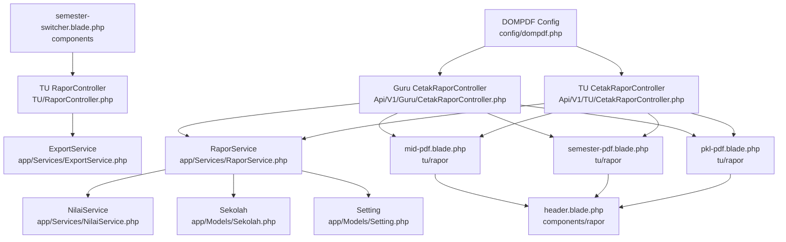
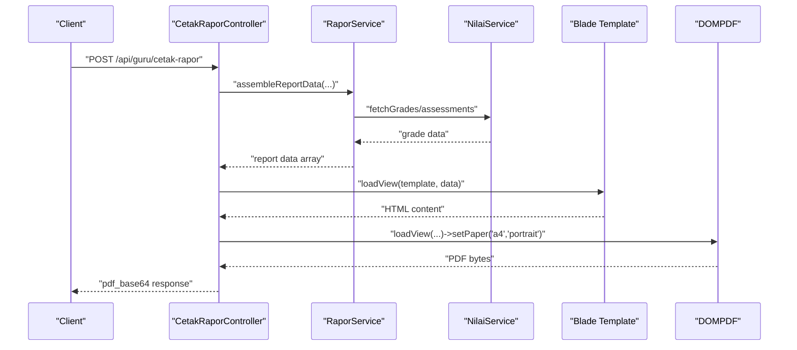
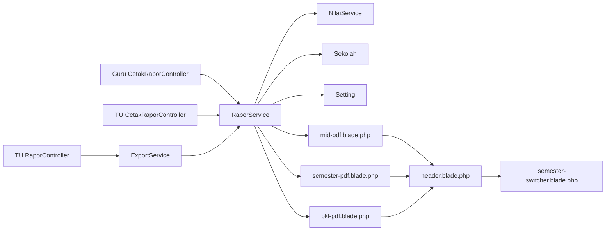

# PDF Generation Engine

<cite>
**Referenced Files in This Document**
- [dompdf.php](file://config/dompdf.php)
- [CetakRaporController.php](file://app/Http/Controllers/Api/V1/Guru/CetakRaporController.php)
- [CetakRaporController.php](file://app/Http/Controllers/Api/V1/TU/CetakRaporController.php)
- [RaporController.php](file://app/Http/Controllers/TU/RaporController.php)
- [semester-switcher.blade.php](file://resources/views/components/semester-switcher.blade.php)
- [mid-pdf.blade.php](file://resources/views/tu/rapor/mid-pdf.blade.php)
- [semester-pdf.blade.php](file://resources/views/tu/rapor/semester-pdf.blade.php)
- [pkl-pdf.blade.php](file://resources/views/tu/rapor/pkl-pdf.blade.php)
- [identitas-pdf.blade.php](file://resources/views/tu/rapor/identitas-pdf.blade.php)
- [header.blade.php](file://resources/views/components/rapor/header.blade.php)
- [pdf.blade.php](file://resources/views/guru/lager-nilai-kelas/pdf.blade.php)
- [pdf.blade.php](file://resources/views/tu/buku-induk/pdf.blade.php)
- [ExportService.php](file://app/Services/ExportService.php)
- [RaporService.php](file://app/Services/RaporService.php)
- [NilaiService.php](file://app/Services/NilaiService.php)
- [Setting.php](file://app/Models/Setting.php)
- [Sekolah.php](file://app/Models/Sekolah.php)
- [RaporPdfTest.php](file://tests/Feature/RaporPdfTest.php)
- [RaporMidPdfTest.php](file://tests/Feature/RaporMidPdfTest.php)
- [RaporPklPdfTest.php](file://tests/Feature/RaporPklPdfTest.php)
- [LagerNilaiPdfTest.php](file://tests/Feature/LagerNilaiPdfTest.php)
</cite>

## Table of Contents
1. [Introduction](#introduction)
2. [Project Structure](#project-structure)
3. [Core Components](#core-components)
4. [Architecture Overview](#architecture-overview)
5. [Detailed Component Analysis](#detailed-component-analysis)
6. [Dependency Analysis](#dependency-analysis)
7. [Performance Considerations](#performance-considerations)
8. [Troubleshooting Guide](#troubleshooting-guide)
9. [Conclusion](#conclusion)
10. [Appendices](#appendices)

## Introduction
This document describes the PDF generation engine built on DOMPDF within the Laravel application. It covers the template structure for semester reports, mid-year reports, practical training (PKL) reports, and other printable documents. It explains the Blade template system used for report formatting, including reusable components such as headers, footers, and styling. It also details the PDF rendering process, memory management, performance optimization techniques, customization options for branding and layout, controller-to-view integration, template inheritance, conditional content display, dynamic data binding, pagination handling, and troubleshooting guidance for common PDF generation issues.

## Project Structure
The PDF generation system spans configuration, controllers, services, and Blade templates:
- Configuration: DOMPDF options define font directories, temporary directories, chroot restrictions, and rendering backend.
- Controllers: API controllers for teachers and TU handle report generation and batch operations.
- Services: Business logic for report data retrieval and export orchestration.
- Templates: Blade views for each report type, with shared components for headers and branding.

**Diagram sources**
- [dompdf.php:23-143](file://config/dompdf.php#L23-L143)
- [CetakRaporController.php](file://app/Http/Controllers/Api/V1/Guru/CetakRaporController.php#L9:130)
- [CetakRaporController.php](file://app/Http/Controllers/Api/V1/TU/CetakRaporController.php#L8:75)
- [RaporController.php:1-200](file://app/Http/Controllers/TU/RaporController.php#L1-L200)
- [ExportService.php:1-200](file://app/Services/ExportService.php#L1-L200)
- [RaporService.php:1-200](file://app/Services/RaporService.php#L1-L200)
- [NilaiService.php:1-200](file://app/Services/NilaiService.php#L1-L200)
- [Setting.php:1-200](file://app/Models/Setting.php#L1-L200)
- [Sekolah.php:1-200](file://app/Models/Sekolah.php#L1-L200)
- [mid-pdf.blade.php:1-200](file://resources/views/tu/rapor/mid-pdf.blade.php#L1-L200)
- [semester-pdf.blade.php:1-200](file://resources/views/tu/rapor/semester-pdf.blade.php#L1-L200)
- [pkl-pdf.blade.php:1-200](file://resources/views/tu/rapor/pkl-pdf.blade.php#L1-L200)
- [header.blade.php:1-200](file://resources/views/components/rapor/header.blade.php#L1-L200)
- [semester-switcher.blade.php:1-48](file://resources/views/components/semester-switcher.blade.php#L1-L48)

**Section sources**
- [dompdf.php:23-143](file://config/dompdf.php#L23-L143)
- [CetakRaporController.php](file://app/Http/Controllers/Api/V1/Guru/CetakRaporController.php#L9:130)
- [CetakRaporController.php](file://app/Http/Controllers/Api/V1/TU/CetakRaporController.php#L8:75)
- [RaporController.php:1-200](file://app/Http/Controllers/TU/RaporController.php#L1-L200)

## Core Components
- DOMPDF Configuration: Defines font directories, cache, temporary directory, chroot, and rendering backend. These settings impact performance, security, and font embedding behavior.
- Controllers: Handle report generation requests, assemble data, render views, and return PDFs as base64-encoded strings or zip archives for batch operations.
- Services: Encapsulate report data retrieval, calculations, and export orchestration.
- Templates: Report-specific Blade views with shared components for consistent branding and layout.

Key implementation references:
- DOMPDF options and backend selection: [dompdf.php:23-143](file://config/dompdf.php#L23-L143)
- Report generation via DOMPDF facade: [CetakRaporController.php](file://app/Http/Controllers/Api/V1/Guru/CetakRaporController.php#L9:130), [CetakRaporController.php](file://app/Http/Controllers/Api/V1/TU/CetakRaporController.php#L8:75)
- Batch PDF creation and zipping: [CetakRaporController.php](file://app/Http/Controllers/Api/V1/Guru/CetakRaporController.php#L160:180), [CetakRaporController.php](file://app/Http/Controllers/Api/V1/TU/CetakRaporController.php#L60:85)
- Export orchestration: [RaporController.php:1-200](file://app/Http/Controllers/TU/RaporController.php#L1-L200)
- Report data services: [RaporService.php:1-200](file://app/Services/RaporService.php#L1-L200), [NilaiService.php:1-200](file://app/Services/NilaiService.php#L1-L200)

**Section sources**
- [dompdf.php:23-143](file://config/dompdf.php#L23-L143)
- [CetakRaporController.php](file://app/Http/Controllers/Api/V1/Guru/CetakRaporController.php#L9:130)
- [CetakRaporController.php](file://app/Http/Controllers/Api/V1/TU/CetakRaporController.php#L8:75)
- [RaporController.php:1-200](file://app/Http/Controllers/TU/RaporController.php#L1-L200)
- [RaporService.php:1-200](file://app/Services/RaporService.php#L1-L200)
- [NilaiService.php:1-200](file://app/Services/NilaiService.php#L1-L200)

## Architecture Overview
The PDF generation pipeline integrates controllers, services, and Blade templates. Controllers receive requests, delegate to services for data assembly, and render Blade templates through the DOMPDF facade. The resulting PDF is returned as a response.

**Diagram sources**
- [CetakRaporController.php](file://app/Http/Controllers/Api/V1/Guru/CetakRaporController.php#L9:130)
- [RaporService.php:1-200](file://app/Services/RaporService.php#L1-L200)
- [NilaiService.php:1-200](file://app/Services/NilaiService.php#L1-L200)
- [mid-pdf.blade.php:1-200](file://resources/views/tu/rapor/mid-pdf.blade.php#L1-L200)
- [semester-pdf.blade.php:1-200](file://resources/views/tu/rapor/semester-pdf.blade.php#L1-L200)
- [pkl-pdf.blade.php:1-200](file://resources/views/tu/rapor/pkl-pdf.blade.php#L1-L200)

## Detailed Component Analysis

### DOMPDF Configuration
- Font directories and cache: Ensures fonts are discoverable and cached for fast rendering.
- Temporary directory: Required for remote image downloads and backend operations.
- Chroot: Restricts DOMPDF to the application base path for security.
- Rendering backend: CPDF is selected for broad compatibility and performance.

Best practices:
- Keep font_dir and font_cache writable by the web server.
- Set temp_dir to a dedicated, secure, and sufficiently large disk partition.
- Use chroot to prevent unauthorized file access.

**Section sources**
- [dompdf.php:23-143](file://config/dompdf.php#L23-L143)

### Report Templates and Reusable Components
Template types:
- Mid-year reports: [mid-pdf.blade.php:1-200](file://resources/views/tu/rapor/mid-pdf.blade.php#L1-L200)
- Semester reports: [semester-pdf.blade.php:1-200](file://resources/views/tu/rapor/semester-pdf.blade.php#L1-L200)
- Practical training (PKL) reports: [pkl-pdf.blade.php:1-200](file://resources/views/tu/rapor/pkl-pdf.blade.php#L1-L200)
- Identity header component: [header.blade.php:1-200](file://resources/views/components/rapor/header.blade.php#L1-L200)
- Semester switcher component: [semester-switcher.blade.php:1-48](file://resources/views/components/semester-switcher.blade.php#L1-L48)

Template inheritance and composition:
- Shared header component ensures consistent branding across reports.
- Components enable reuse of common UI elements like semester selectors.

Dynamic data binding:
- Controllers pass model instances (student, class, subjects, assessments) to templates.
- Blade loops and conditionals render dynamic content based on received datasets.

Conditional content:
- Semester switcher toggles active academic period for report generation.
- Conditional rendering of assessments, descriptors, and kokurikuler activities.

Pagination and page breaks:
- Use CSS break properties in templates to control page breaks between sections.
- Long tables and lists should leverage CSS to avoid orphaned lines.

**Section sources**
- [mid-pdf.blade.php:1-200](file://resources/views/tu/rapor/mid-pdf.blade.php#L1-L200)
- [semester-pdf.blade.php:1-200](file://resources/views/tu/rapor/semester-pdf.blade.php#L1-L200)
- [pkl-pdf.blade.php:1-200](file://resources/views/tu/rapor/pkl-pdf.blade.php#L1-L200)
- [header.blade.php:1-200](file://resources/views/components/rapor/header.blade.php#L1-L200)
- [semester-switcher.blade.php:1-48](file://resources/views/components/semester-switcher.blade.php#L1-L48)

### Controller Actions and View Rendering
Controllers coordinate PDF generation:
- Single report generation: [CetakRaporController.php](file://app/Http/Controllers/Api/V1/Guru/CetakRaporController.php#L9:130), [CetakRaporController.php](file://app/Http/Controllers/Api/V1/TU/CetakRaporController.php#L8:75)
- Batch generation with ZIP packaging: [CetakRaporController.php](file://app/Http/Controllers/Api/V1/Guru/CetakRaporController.php#L160:180), [CetakRaporController.php](file://app/Http/Controllers/Api/V1/TU/CetakRaporController.php#L60:85)
- TU-side PDF export controller: [RaporController.php:1-200](file://app/Http/Controllers/TU/RaporController.php#L1-L200)

Rendering flow:
- Select appropriate template based on report type (mid/semester/pkl).
- Load view with bound data.
- Apply paper size and orientation.
- Convert to PDF bytes and encode as base64 for transport.

**Section sources**
- [CetakRaporController.php](file://app/Http/Controllers/Api/V1/Guru/CetakRaporController.php#L9:130)
- [CetakRaporController.php](file://app/Http/Controllers/Api/V1/TU/CetakRaporController.php#L8:75)
- [RaporController.php:1-200](file://app/Http/Controllers/TU/RaporController.php#L1-L200)

### Services and Data Layer
Services encapsulate report logic:
- RaporService orchestrates report data retrieval and preparation.
- NilaiService handles grade and assessment computations.
- Models (Setting, Sekolah) provide branding and institutional data.

Integration points:
- Services depend on models for school branding (logo, colors, name).
- Data passed to templates is validated and normalized before rendering.

**Section sources**
- [RaporService.php:1-200](file://app/Services/RaporService.php#L1-L200)
- [NilaiService.php:1-200](file://app/Services/NilaiService.php#L1-L200)
- [Setting.php:1-200](file://app/Models/Setting.php#L1-L200)
- [Sekolah.php:1-200](file://app/Models/Sekolah.php#L1-L200)

### Additional PDF Templates
Beyond report templates, other printable documents use DOMPDF:
- Class grade sheet: [pdf.blade.php:1-200](file://resources/views/guru/lager-nilai-kelas/pdf.blade.php#L1-L200)
- Student identity book: [pdf.blade.php:1-200](file://resources/views/tu/buku-induk/pdf.blade.php#L1-L200)

These templates follow similar patterns: bind data, render with DOMPDF, and return PDF output.

**Section sources**
- [pdf.blade.php:1-200](file://resources/views/guru/lager-nilai-kelas/pdf.blade.php#L1-L200)
- [pdf.blade.php:1-200](file://resources/views/tu/buku-induk/pdf.blade.php#L1-L200)

## Dependency Analysis
The PDF generation system exhibits layered dependencies:
- Controllers depend on Services for data.
- Services depend on Models for branding and metadata.
- Templates depend on shared components and data arrays.
- DOMPDF depends on configuration for fonts and rendering.

**Diagram sources**
- [CetakRaporController.php](file://app/Http/Controllers/Api/V1/Guru/CetakRaporController.php#L9:130)
- [CetakRaporController.php](file://app/Http/Controllers/Api/V1/TU/CetakRaporController.php#L8:75)
- [RaporController.php:1-200](file://app/Http/Controllers/TU/RaporController.php#L1-L200)
- [RaporService.php:1-200](file://app/Services/RaporService.php#L1-L200)
- [ExportService.php:1-200](file://app/Services/ExportService.php#L1-L200)
- [NilaiService.php:1-200](file://app/Services/NilaiService.php#L1-L200)
- [Sekolah.php:1-200](file://app/Models/Sekolah.php#L1-L200)
- [Setting.php:1-200](file://app/Models/Setting.php#L1-L200)
- [mid-pdf.blade.php:1-200](file://resources/views/tu/rapor/mid-pdf.blade.php#L1-L200)
- [semester-pdf.blade.php:1-200](file://resources/views/tu/rapor/semester-pdf.blade.php#L1-L200)
- [pkl-pdf.blade.php:1-200](file://resources/views/tu/rapor/pkl-pdf.blade.php#L1-L200)
- [header.blade.php:1-200](file://resources/views/components/rapor/header.blade.php#L1-L200)
- [semester-switcher.blade.php:1-48](file://resources/views/components/semester-switcher.blade.php#L1-L48)

**Section sources**
- [CetakRaporController.php](file://app/Http/Controllers/Api/V1/Guru/CetakRaporController.php#L9:130)
- [CetakRaporController.php](file://app/Http/Controllers/Api/V1/TU/CetakRaporController.php#L8:75)
- [RaporController.php:1-200](file://app/Http/Controllers/TU/RaporController.php#L1-L200)
- [RaporService.php:1-200](file://app/Services/RaporService.php#L1-L200)
- [ExportService.php:1-200](file://app/Services/ExportService.php#L1-L200)
- [NilaiService.php:1-200](file://app/Services/NilaiService.php#L1-L200)
- [Sekolah.php:1-200](file://app/Models/Sekolah.php#L1-L200)
- [Setting.php:1-200](file://app/Models/Setting.php#L1-L200)

## Performance Considerations
- Font management: Configure font_dir and font_cache to reduce repeated font loading overhead.
- Memory limits: Increase PHP memory limit and DOMPDF memory settings when generating large batches.
- Image handling: Store images locally and reference them via absolute paths to avoid network latency.
- CSS optimization: Minimize complex CSS and avoid excessive font embedding to reduce PDF size.
- Batch processing: Use ZIP packaging for bulk exports to minimize per-request overhead.
- Backend choice: CPDF offers good performance and compatibility; evaluate PDFLib if advanced features are required.

[No sources needed since this section provides general guidance]

## Troubleshooting Guide
Common issues and resolutions:
- Fonts not rendering: Verify font_dir and font_cache permissions and existence; ensure fonts are subset when embedding.
- Permission errors: Confirm chroot path and temp_dir are writable by the web server.
- Large PDFs failing: Reduce image sizes, disable unnecessary CSS, and split reports into smaller chunks.
- Missing images: Ensure remote images are downloaded to temp_dir or served via local URLs.
- Batch generation failures: Validate ZIP extension availability and memory limits during archive creation.

Quality assurance:
- Automated tests validate PDF generation for semester, mid-year, PKL, and class grade sheets.

**Section sources**
- [dompdf.php:23-143](file://config/dompdf.php#L23-L143)
- [RaporPdfTest.php:1-200](file://tests/Feature/RaporPdfTest.php#L1-L200)
- [RaporMidPdfTest.php:1-200](file://tests/Feature/RaporMidPdfTest.php#L1-L200)
- [RaporPklPdfTest.php:1-200](file://tests/Feature/RaporPklPdfTest.php#L1-L200)
- [LagerNilaiPdfTest.php:1-200](file://tests/Feature/LagerNilaiPdfTest.php#L1-L200)

## Conclusion
The PDF generation engine leverages DOMPDF within Laravel’s MVC architecture to produce standardized, branded reports. Controllers orchestrate data assembly via services, templates render consistent layouts with reusable components, and configuration ensures reliable, secure, and performant output. By following the outlined practices—component reuse, careful font and memory management, and robust error handling—the system supports scalable report production across multiple formats and volumes.

[No sources needed since this section summarizes without analyzing specific files]

## Appendices

### Template Customization Options
- School branding: Logo insertion and color schemes are managed via shared components and styles.
- Layout modifications: Adjust CSS in report templates and components to change spacing, column widths, and section breaks.
- Dynamic data binding: Pass model attributes (school info, student info, grades) to templates for personalized content.

**Section sources**
- [header.blade.php:1-200](file://resources/views/components/rapor/header.blade.php#L1-L200)
- [semester-switcher.blade.php:1-48](file://resources/views/components/semester-switcher.blade.php#L1-L48)
- [Setting.php:1-200](file://app/Models/Setting.php#L1-L200)
- [Sekolah.php:1-200](file://app/Models/Sekolah.php#L1-L200)

### Pagination and Multi-page Formatting
- Use CSS break properties to control page breaks between sections.
- Break long tables across pages to maintain readability.
- Test page breaks with representative data sets to refine layout.

[No sources needed since this section provides general guidance]