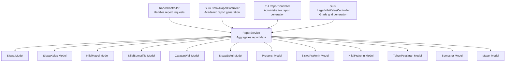
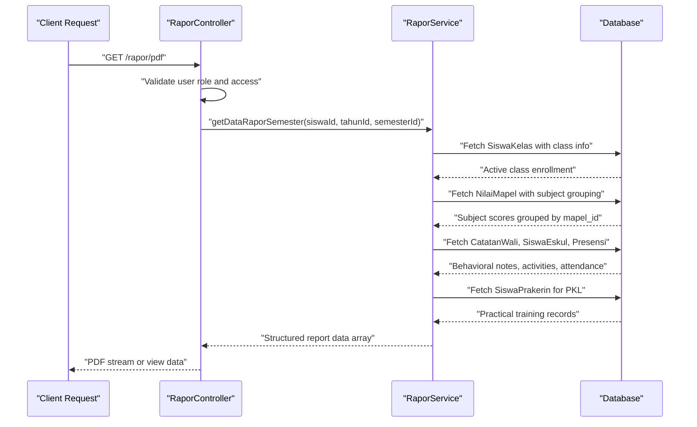
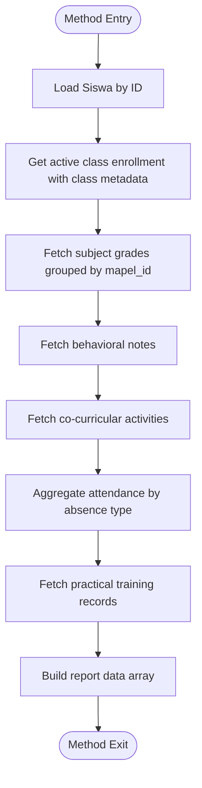
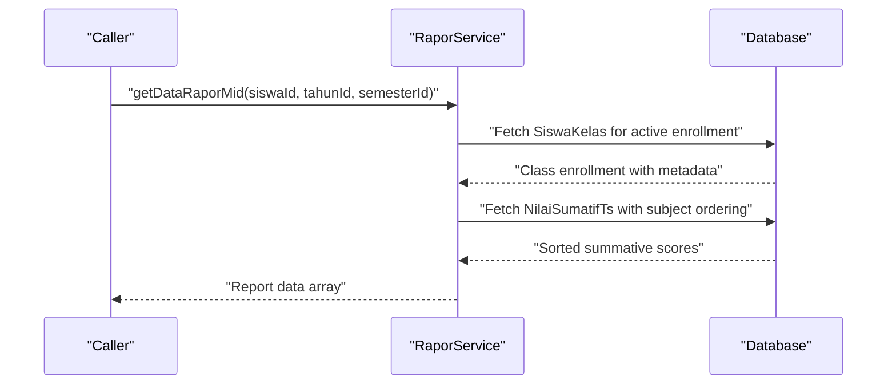
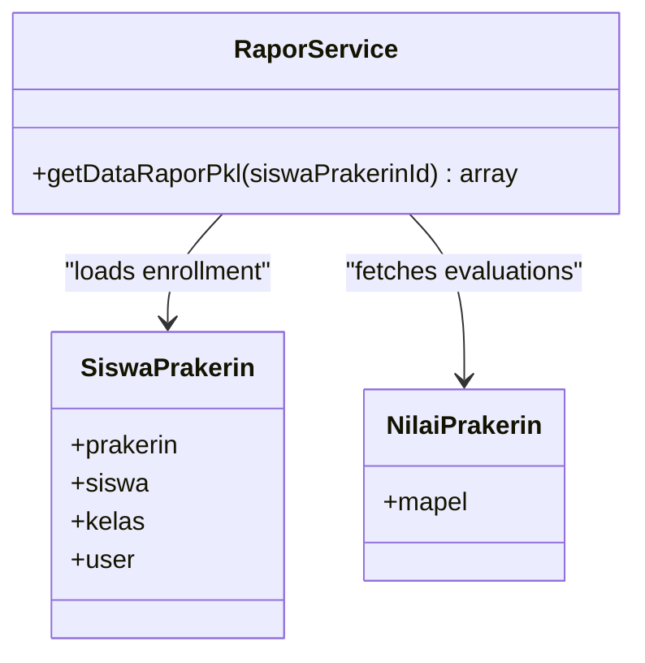
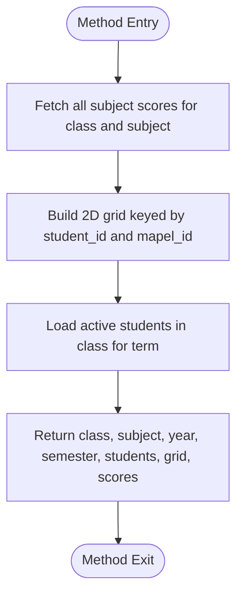
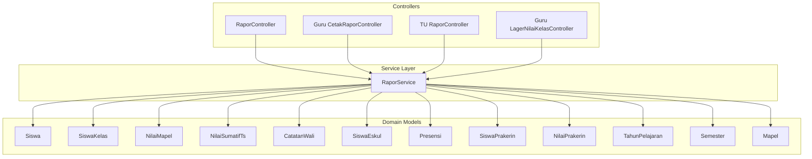

# Report Data Models & Structure

<cite>
**Referenced Files in This Document**
- [RaporService.php](file://app/Services/RaporService.php)
- [RaporController.php](file://app/Http/Controllers/RaporController.php)
- [CetakRaporController.php](file://app/Http/Controllers/Guru/CetakRaporController.php)
- [Siswa.php](file://app/Models/Siswa.php)
- [Kelas.php](file://app/Models/Kelas.php)
- [SiswaKelas.php](file://app/Models/SiswaKelas.php)
- [NilaiMapel.php](file://app/Models/NilaiMapel.php)
- [NilaiSumatifTs.php](file://app/Models/NilaiSumatifTs.php)
- [CatatanWali.php](file://app/Models/CatatanWali.php)
- [SiswaEskul.php](file://app/Models/SiswaEskul.php)
- [Presensi.php](file://app/Models/Presensi.php)
- [SiswaPrakerin.php](file://app/Models/SiswaPrakerin.php)
- [NilaiPrakerin.php](file://app/Models/NilaiPrakerin.php)
- [TahunPelajaran.php](file://app/Models/TahunPelajaran.php)
- [Semester.php](file://app/Models/Semester.php)
- [Mapel.php](file://app/Models/Mapel.php)
- [LagerNilaiKelasController.php](file://app/Http/Controllers/Guru/LagerNilaiKelasController.php)
</cite>

## Table of Contents
1. [Introduction](#introduction)
2. [Project Structure](#project-structure)
3. [Core Components](#core-components)
4. [Architecture Overview](#architecture-overview)
5. [Detailed Component Analysis](#detailed-component-analysis)
6. [Dependency Analysis](#dependency-analysis)
7. [Performance Considerations](#performance-considerations)
8. [Troubleshooting Guide](#troubleshooting-guide)
9. [Conclusion](#conclusion)

## Introduction
This document provides comprehensive documentation for the report data models and structure used in the report generation system. It focuses on the RaporService class methods that handle academic record aggregation, attendance tracking, extracurricular activities, and practical training evaluations. The documentation covers the relationships between students, classes, subjects, and grades, along with the data structures returned by each method. It also includes examples of data retrieval patterns, query optimization techniques, and validation processes, emphasizing the integration with Eloquent ORM for efficient data access.

## Project Structure
The report generation system centers around the RaporService class located in the Services directory. Controllers orchestrate requests and delegate report data extraction to RaporService. The Models directory defines the domain entities and their relationships, while controllers in the Http/Controllers directory coordinate access permissions and PDF generation.

**Diagram sources**
- [RaporController.php:10-57](file://app/Http/Controllers/RaporController.php#L10-L57)
- [RaporService.php:17-174](file://app/Services/RaporService.php#L17-L174)
- [CetakRaporController.php](file://app/Http/Controllers/Guru/CetakRaporController.php)

**Section sources**
- [RaporController.php:10-57](file://app/Http/Controllers/RaporController.php#L10-L57)
- [RaporService.php:17-174](file://app/Services/RaporService.php#L17-L174)

## Core Components
This section documents the four primary report data retrieval methods in RaporService and their responsibilities:

- getDataRaporSemester: Aggregates comprehensive academic and behavioral data for a student's semester report, including grades, attendance statistics, co-curricular activities, and practical training.
- getDataRaporMid: Retrieves mid-term summative assessment data for a student across subjects.
- getDataRaporPkl: Compiles practical training evaluation data for a student's PKL (practical training) report.
- getDataLagerNilai: Generates a grade grid for a class and subject, organizing student scores in a two-dimensional structure.

Each method leverages Eloquent relationships to efficiently fetch related entities and applies grouping and sorting to produce structured datasets suitable for report rendering.

**Section sources**
- [RaporService.php:22-74](file://app/Services/RaporService.php#L22-L74)
- [RaporService.php:76-103](file://app/Services/RaporService.php#L76-L103)
- [RaporService.php:105-122](file://app/Services/RaporService.php#L105-L122)
- [RaporService.php:124-155](file://app/Services/RaporService.php#L124-L155)

## Architecture Overview
The report generation architecture follows a service-layer pattern. Controllers receive requests, enforce authorization, and delegate data aggregation to RaporService. RaporService encapsulates all data retrieval logic, leveraging Eloquent relationships and collection operations to build cohesive report datasets. The resulting arrays include student information, school details, class information, academic performance, behavioral assessments, and attendance statistics.

**Diagram sources**
- [RaporController.php:12-42](file://app/Http/Controllers/RaporController.php#L12-L42)
- [RaporService.php:22-74](file://app/Services/RaporService.php#L22-L74)

## Detailed Component Analysis

### RaporService Methods and Data Aggregation

#### getDataRaporSemester
This method aggregates the most comprehensive set of data for a semester report:
- Student identity and personal details via Siswa
- Active class enrollment with grade level and specialization via SiswaKelas, linked to Kelas and its relationships
- Academic performance grouped by subject using NilaiMapel, joined with Mapel and grouped by mapel_id
- Behavioral notes from CatatanWali
- Co-curricular activities through SiswaEskul linked to Eskul
- Attendance statistics computed from Presensi grouped by absence type
- Practical training records via SiswaPrakerin

The method returns an associative array containing:
- siswa: Student entity
- sekolah: School information from SekolahService
- kelas: Class entity derived from active enrollment
- kelas_aktif: Complete enrollment record with class metadata
- tahun: Academic year entity
- semester: Semester entity
- nilai_mapel: Collection grouped by subject ID
- catatan_wali: Behavioral notes
- ekskul: Co-curricular activity records
- presensi: Attendance summary (total, sick, permission, unexcused)
- pkl: Practical training records

**Diagram sources**
- [RaporService.php:22-74](file://app/Services/RaporService.php#L22-L74)

**Section sources**
- [RaporService.php:22-74](file://app/Services/RaporService.php#L22-L74)

#### getDataRaporMid
This method retrieves mid-term summative assessment data:
- Student identity via Siswa
- Active class enrollment metadata
- Summative assessment scores sorted by subject order using NilaiSumatifTs
- Returns an array with student, school, class, academic year, semester, and sorted summative scores

**Diagram sources**
- [RaporService.php:76-103](file://app/Services/RaporService.php#L76-L103)

**Section sources**
- [RaporService.php:76-103](file://app/Services/RaporService.php#L76-L103)

#### getDataRaporPkl
This method compiles practical training evaluation data:
- Student practical training enrollment with class and specialization metadata
- Practical training institution details
- Student personal information and user details
- Evaluation scores per subject for the practical training period

Returns an array containing:
- siswa_prakerin: Complete enrollment record with class metadata
- siswa: Student entity
- prakerin: Training institution entity
- kelas: Class entity
- sekolah: School information
- nilai_prakerin: Evaluation scores linked to subjects

**Diagram sources**
- [RaporService.php:105-122](file://app/Services/RaporService.php#L105-L122)

**Section sources**
- [RaporService.php:105-122](file://app/Services/RaporService.php#L105-L122)

#### getDataLagerNilai
This method generates a grade grid for a class and subject:
- Fetches all subject scores for the specified class, subject, academic year, and semester
- Builds a two-dimensional grid indexed by student ID and subject ID
- Retrieves all active students enrolled in the class for the given term
- Returns structured data including class, subject, academic year, semester, student list, grid, and raw score records

**Diagram sources**
- [RaporService.php:124-155](file://app/Services/RaporService.php#L124-L155)

**Section sources**
- [RaporService.php:124-155](file://app/Services/RaporService.php#L124-L155)

### Data Retrieval Patterns and Query Optimization
- Relationship Loading: Methods utilize with() to eager load related entities, reducing N+1 query problems. Examples include loading class metadata, subject groupings, and student profiles.
- Conditional Filtering: Queries apply where() conditions for academic year, semester, and enrollment status to ensure accurate data scoping.
- Grouping and Sorting: Collections are grouped by subject ID and sorted by subject order to maintain logical presentation in reports.
- Aggregation Functions: Attendance statistics are computed using collection grouping and counting to avoid additional database round-trips.

These patterns ensure efficient data access and predictable performance across report generations.

**Section sources**
- [RaporService.php:26-31](file://app/Services/RaporService.php#L26-L31)
- [RaporService.php:33-41](file://app/Services/RaporService.php#L33-L41)
- [RaporService.php:87-92](file://app/Services/RaporService.php#L87-L92)
- [RaporService.php:157-172](file://app/Services/RaporService.php#L157-L172)

### Data Validation Processes
- Existence Checks: Methods use findOrFail() for student and enrollment records to ensure valid identifiers before proceeding.
- Status Filtering: Enrollment queries filter by status='aktif' to guarantee active class membership.
- Authorization: Controllers validate user roles and subject-class associations before generating reports, preventing unauthorized access.

These validations protect data integrity and ensure reports reflect current, authorized information.

**Section sources**
- [RaporService.php:24](file://app/Services/RaporService.php#L24)
- [RaporService.php:26-31](file://app/Services/RaporService.php#L26-L31)
- [RaporController.php:19-31](file://app/Http/Controllers/RaporController.php#L19-L31)

## Dependency Analysis
The report generation system exhibits clear separation of concerns:
- Controllers depend on RaporService for data aggregation
- RaporService depends on Eloquent models for data access
- Models define relationships that enable efficient joins and eager loading
- Controllers enforce authorization policies before invoking services

**Diagram sources**
- [RaporController.php:10-57](file://app/Http/Controllers/RaporController.php#L10-L57)
- [RaporService.php:17-174](file://app/Services/RaporService.php#L17-L174)

**Section sources**
- [RaporController.php:10-57](file://app/Http/Controllers/RaporController.php#L10-L57)
- [RaporService.php:17-174](file://app/Services/RaporService.php#L17-L174)

## Performance Considerations
- Eager Loading: Use with() to load relationships and reduce query count during report assembly.
- Selective Columns: Use select() to limit fetched columns to only those needed for reports.
- Collection Operations: Prefer collection grouping and sorting over additional database queries.
- Indexing: Ensure database indexes exist on frequently filtered columns (siswa_id, tahun_pelajaran_id, semester_id, kelas_id, mapel_id).
- Pagination: For large datasets, consider pagination in grid generation to avoid memory issues.

## Troubleshooting Guide
Common issues and resolutions:
- Empty Reports: Verify that academic year and semester sessions are set and match the selected term.
- Missing Students in Grid: Confirm that students are enrolled as 'aktif' in the target class for the selected term.
- Incorrect Grades: Check subject ordering and ensure mapel.urutan is properly maintained.
- Access Denied: Review user role validation and subject-class associations in controllers.

**Section sources**
- [RaporController.php:14-31](file://app/Http/Controllers/RaporController.php#L14-L31)
- [RaporService.php:26-31](file://app/Services/RaporService.php#L26-L31)

## Conclusion
The report generation system leverages RaporService to consolidate diverse academic, behavioral, and administrative data into coherent report datasets. Through strategic use of Eloquent relationships, grouping, and collection operations, the system delivers efficient and maintainable report generation. The documented methods and patterns provide a foundation for extending report capabilities while preserving performance and data integrity.