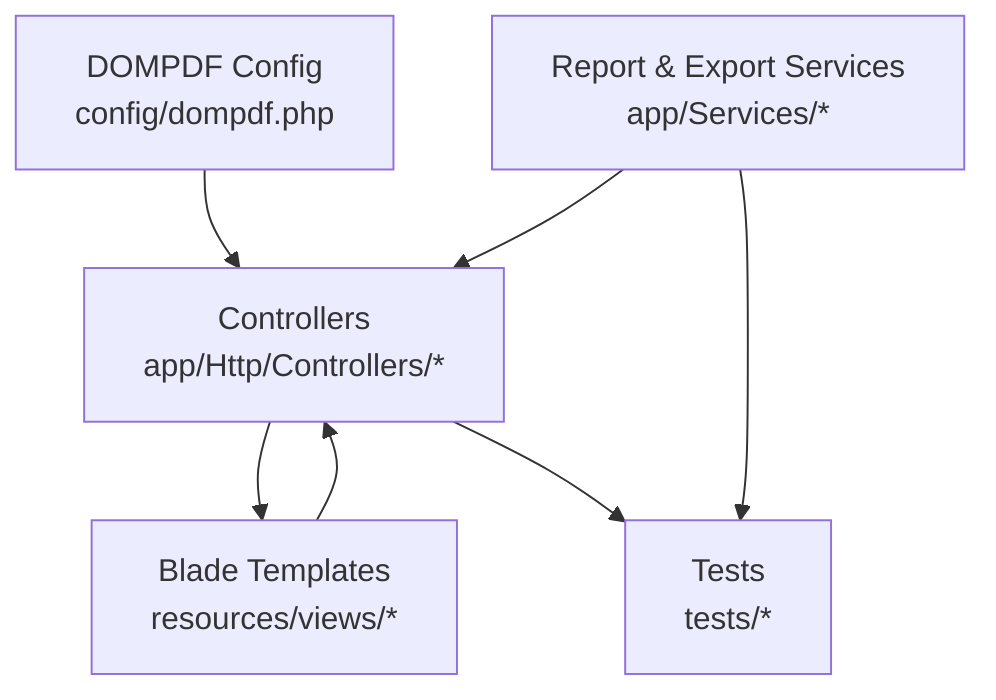
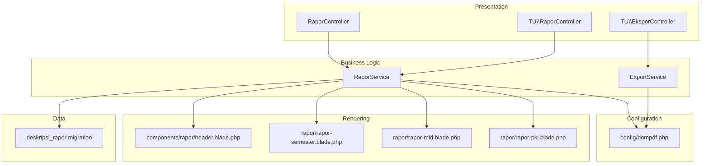
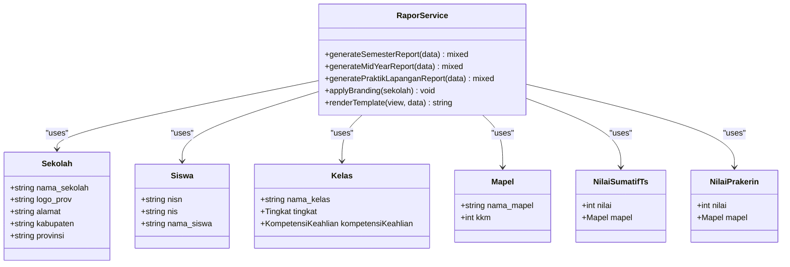
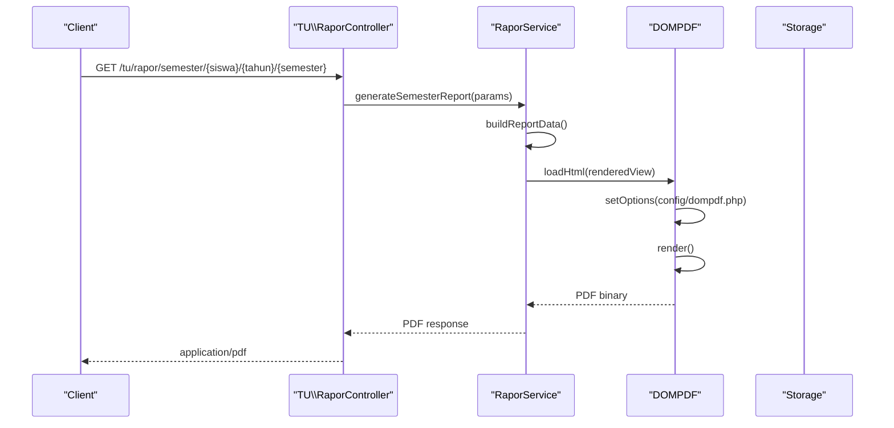
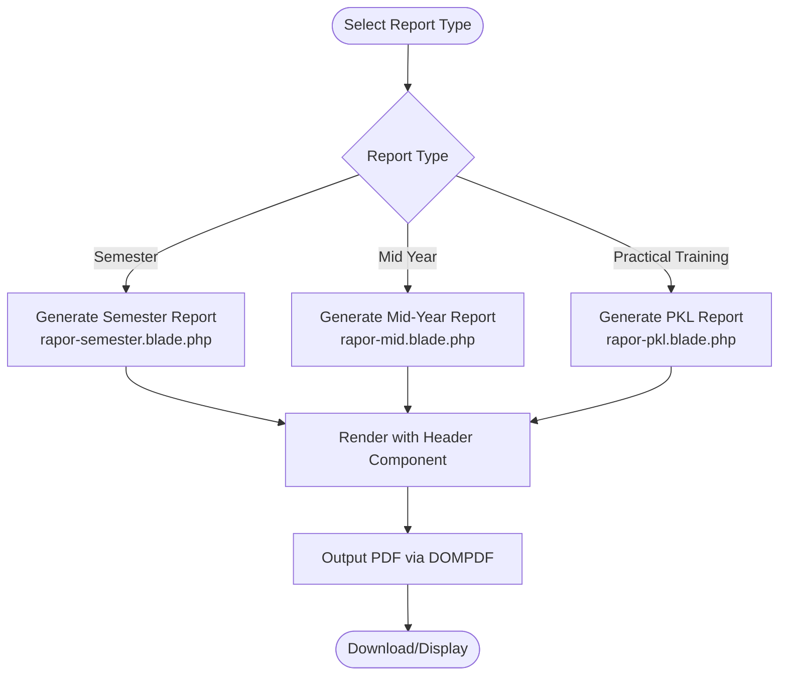
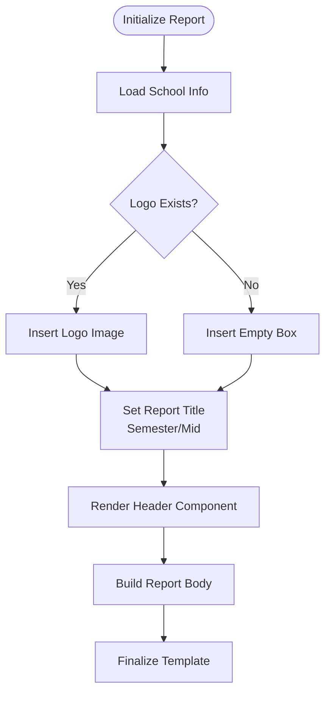
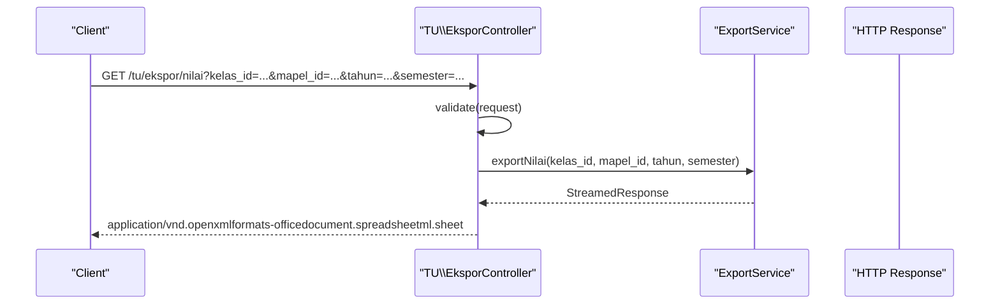
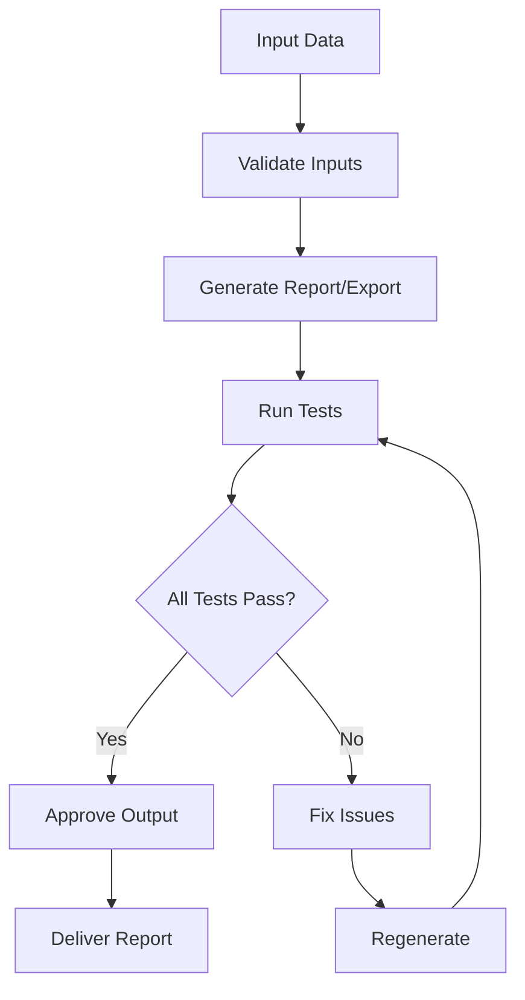
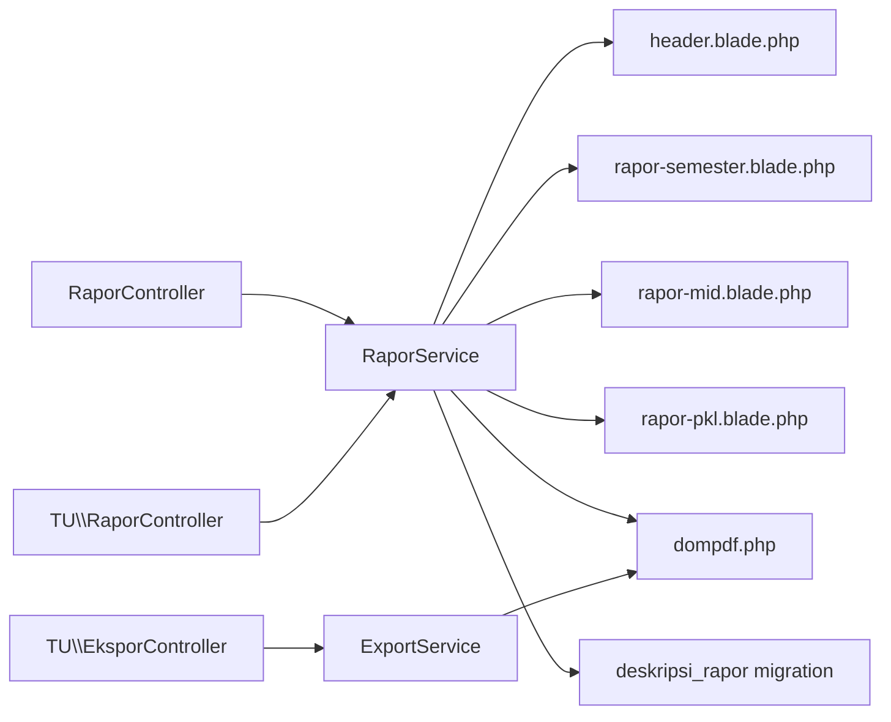

# Report Generation System

<cite>
**Referenced Files in This Document**
- [dompdf.php](file://config/dompdf.php)
- [RaporService.php](file://app/Services/RaporService.php)
- [ExportService.php](file://app/Services/ExportService.php)
- [RaporController.php](file://app/Http/Controllers/RaporController.php)
- [TU/RaporController.php](file://app/Http/Controllers/TU/RaporController.php)
- [EksporController.php](file://app/Http/Controllers/TU/EksporController.php)
- [header.blade.php](file://resources/views/components/rapor/header.blade.php)
- [rapor-semester.blade.php](file://resources/views/rapor/rapor-semester.blade.php)
- [rapor-mid.blade.php](file://resources/views/rapor/rapor-mid.blade.php)
- [rapor-pkl.blade.php](file://resources/views/rapor/rapor-pkl.blade.php)
- [deskripsi_rapor_table.php](file://database/migrations/2026_06_01_010809_create_deskripsi_rapor_table.php)
- [RaporPdfTest.php](file://tests/Feature/RaporPdfTest.php)
- [RaporMidPdfTest.php](file://tests/Feature/RaporMidPdfTest.php)
- [RaporPklPdfTest.php](file://tests/Feature/RaporPklPdfTest.php)
- [SiswaExportTest.php](file://tests/Feature/Ekspor/SiswaExportTest.php)
- [ExportServiceTest.php](file://tests/Unit/Services/ExportServiceTest.php)
</cite>

## Table of Contents
1. [Introduction](#introduction)
2. [Project Structure](#project-structure)
3. [Core Components](#core-components)
4. [Architecture Overview](#architecture-overview)
5. [Detailed Component Analysis](#detailed-component-analysis)
6. [Dependency Analysis](#dependency-analysis)
7. [Performance Considerations](#performance-considerations)
8. [Troubleshooting Guide](#troubleshooting-guide)
9. [Conclusion](#conclusion)

## Introduction
This document describes the report generation system for academic transcripts and related documents. It covers report card creation, PDF generation via DOMPDF, multiple report formats (semester, mid-year, practical training), export capabilities (PDF, Excel), customization features (school branding, logos), validation and quality assurance, and automated workflows. The system integrates with Laravel's Blade templating engine and leverages dedicated services and controllers to orchestrate report generation.

## Project Structure
The report generation system spans configuration, services, controllers, Blade templates, and tests:

- Configuration: DOMPDF settings define rendering backend, font directories, and security chroot.
- Services: Report generation and export logic encapsulated in dedicated service classes.
- Controllers: Web endpoints for report generation and export actions.
- Templates: Blade components and report-specific views for rendering.
- Tests: Feature and unit tests validating PDF generation and export functionality.

**Diagram sources**
- [dompdf.php:1-143](file://config/dompdf.php#L1-L143)
- [RaporService.php](file://app/Services/RaporService.php)
- [ExportService.php](file://app/Services/ExportService.php)
- [RaporController.php](file://app/Http/Controllers/RaporController.php)
- [TU/RaporController.php](file://app/Http/Controllers/TU/RaporController.php)
- [header.blade.php:1-62](file://resources/views/components/rapor/header.blade.php#L1-L62)

**Section sources**
- [dompdf.php:1-143](file://config/dompdf.php#L1-L143)
- [RaporService.php](file://app/Services/RaporService.php)
- [ExportService.php](file://app/Services/ExportService.php)
- [RaporController.php](file://app/Http/Controllers/RaporController.php)
- [TU/RaporController.php](file://app/Http/Controllers/TU/RaporController.php)
- [header.blade.php:1-62](file://resources/views/components/rapor/header.blade.php#L1-L62)

## Core Components
- DOMPDF Configuration: Defines rendering backend, font directories, cache, temporary directory, chroot, and PDF backend selection.
- Report Service: Orchestrates report card generation, including academic performance, behavioral assessments, and descriptive evaluations.
- Export Service: Handles export to Excel and related formats.
- Controllers: Expose endpoints for generating semester, mid-year, and practical training reports; manage exports.
- Blade Templates: Provide reusable header components and report-specific views for rendering.

Key responsibilities:
- Academic performance reporting: Aggregates subject grades and computes outcomes.
- Behavioral assessments: Includes co-curricular descriptors and teacher notes.
- Descriptive evaluations: Uses predefined descriptions per grade predicates.
- Branding and customization: Supports school logos and configurable report headers.

**Section sources**
- [dompdf.php:1-143](file://config/dompdf.php#L1-L143)
- [RaporService.php](file://app/Services/RaporService.php)
- [ExportService.php](file://app/Services/ExportService.php)
- [RaporController.php](file://app/Http/Controllers/RaporController.php)
- [TU/RaporController.php](file://app/Http/Controllers/TU/RaporController.php)
- [header.blade.php:1-62](file://resources/views/components/rapor/header.blade.php#L1-L62)

## Architecture Overview
The system follows a layered architecture:
- Presentation Layer: Controllers handle HTTP requests and delegate to services.
- Business Logic Layer: Services encapsulate report generation and export logic.
- Data Access Layer: Models and migrations define report-related entities (e.g., descriptive evaluations).
- Rendering Layer: Blade templates render HTML, consumed by DOMPDF for PDF generation.
- Testing Layer: Feature and unit tests validate behavior and outputs.

**Diagram sources**
- [RaporController.php](file://app/Http/Controllers/RaporController.php)
- [TU/RaporController.php](file://app/Http/Controllers/TU/RaporController.php)
- [EksporController.php](file://app/Http/Controllers/TU/EksporController.php)
- [RaporService.php](file://app/Services/RaporService.php)
- [ExportService.php](file://app/Services/ExportService.php)
- [header.blade.php:1-62](file://resources/views/components/rapor/header.blade.php#L1-L62)
- [rapor-semester.blade.php](file://resources/views/rapor/rapor-semester.blade.php)
- [rapor-mid.blade.php](file://resources/views/rapor/rapor-mid.blade.php)
- [rapor-pkl.blade.php](file://resources/views/rapor/rapor-pkl.blade.php)
- [dompdf.php:1-143](file://config/dompdf.php#L1-L143)
- [deskripsi_rapor_table.php:1-32](file://database/migrations/2026_06_01_010809_create_deskripsi_rapor_table.php#L1-L32)

## Detailed Component Analysis

### Report Card Generation Engine
The report card generation engine aggregates academic performance, behavioral assessments, and descriptive evaluations. It uses:
- Subject grades and summative assessments to compute outcomes.
- Co-curricular and extracurricular activities for holistic evaluation.
- Descriptive evaluation templates linked to grade predicates.

**Diagram sources**
- [RaporService.php](file://app/Services/RaporService.php)
- [header.blade.php:1-62](file://resources/views/components/rapor/header.blade.php#L1-L62)

**Section sources**
- [RaporService.php](file://app/Services/RaporService.php)
- [header.blade.php:1-62](file://resources/views/components/rapor/header.blade.php#L1-L62)

### PDF Generation Process Using DOMPDF
PDF generation relies on DOMPDF configuration and Blade rendering:
- DOMPDF configuration sets font directories, cache, temporary directory, chroot, and backend.
- Blade templates render HTML content for report cards.
- Controllers trigger service methods and pass rendered HTML to DOMPDF for PDF output.

**Diagram sources**
- [TU/RaporController.php](file://app/Http/Controllers/TU/RaporController.php)
- [RaporService.php](file://app/Services/RaporService.php)
- [dompdf.php:1-143](file://config/dompdf.php#L1-L143)

**Section sources**
- [dompdf.php:1-143](file://config/dompdf.php#L1-L143)
- [RaporService.php](file://app/Services/RaporService.php)
- [TU/RaporController.php](file://app/Http/Controllers/TU/RaporController.php)

### Multiple Report Formats
The system supports several report formats:

- Semester Reports: Academic transcript for the full semester.
- Mid-Year Reports: Interim assessment for mid-semester.
- Practical Training Reports: Specialized report for praktik lapangan.

**Diagram sources**
- [rapor-semester.blade.php](file://resources/views/rapor/rapor-semester.blade.php)
- [rapor-mid.blade.php](file://resources/views/rapor/rapor-mid.blade.php)
- [rapor-pkl.blade.php](file://resources/views/rapor/rapor-pkl.blade.php)
- [header.blade.php:1-62](file://resources/views/components/rapor/header.blade.php#L1-L62)
- [dompdf.php:1-143](file://config/dompdf.php#L1-L143)

**Section sources**
- [rapor-semester.blade.php](file://resources/views/rapor/rapor-semester.blade.php)
- [rapor-mid.blade.php](file://resources/views/rapor/rapor-mid.blade.php)
- [rapor-pkl.blade.php](file://resources/views/rapor/rapor-pkl.blade.php)
- [header.blade.php:1-62](file://resources/views/components/rapor/header.blade.php#L1-L62)

### Report Customization Features
Customization includes:
- School branding: Logo insertion from storage with fallback handling.
- Header customization: Dynamic report type (semester vs mid) and metadata injection.
- Template personalization: Reusable header component shared across report views.

**Diagram sources**
- [header.blade.php:1-62](file://resources/views/components/rapor/header.blade.php#L1-L62)

**Section sources**
- [header.blade.php:1-62](file://resources/views/components/rapor/header.blade.php#L1-L62)

### Export Functionality
Export functionality supports:
- Excel export for student lists and attendance data.
- Validation of request parameters and grouping logic for attendance.

**Diagram sources**
- [EksporController.php:1-63](file://app/Http/Controllers/TU/EksporController.php#L1-L63)
- [ExportService.php](file://app/Services/ExportService.php)
- [SiswaExportTest.php:1-37](file://tests/Feature/Ekspor/SiswaExportTest.php#L1-L37)
- [ExportServiceTest.php:1-116](file://tests/Unit/Services/ExportServiceTest.php#L1-L116)

**Section sources**
- [EksporController.php:1-63](file://app/Http/Controllers/TU/EksporController.php#L1-L63)
- [ExportService.php](file://app/Services/ExportService.php)
- [SiswaExportTest.php:1-37](file://tests/Feature/Ekspor/SiswaExportTest.php#L1-L37)
- [ExportServiceTest.php:1-116](file://tests/Unit/Services/ExportServiceTest.php#L1-L116)

### Report Validation, Quality Assurance, and Approval Workflows
Quality assurance is ensured through:
- Feature tests verifying PDF content type and download behavior.
- Unit tests validating export logic and grouping.
- Migration defining descriptive evaluation templates for standardized descriptions.

**Diagram sources**
- [RaporPdfTest.php](file://tests/Feature/RaporPdfTest.php)
- [RaporMidPdfTest.php:1-52](file://tests/Feature/RaporMidPdfTest.php#L1-L52)
- [RaporPklPdfTest.php:1-56](file://tests/Feature/RaporPklPdfTest.php#L1-L56)
- [deskripsi_rapor_table.php:1-32](file://database/migrations/2026_06_01_010809_create_deskripsi_rapor_table.php#L1-L32)

**Section sources**
- [RaporPdfTest.php](file://tests/Feature/RaporPdfTest.php)
- [RaporMidPdfTest.php:1-52](file://tests/Feature/RaporMidPdfTest.php#L1-L52)
- [RaporPklPdfTest.php:1-56](file://tests/Feature/RaporPklPdfTest.php#L1-L56)
- [deskripsi_rapor_table.php:1-32](file://database/migrations/2026_06_01_010809_create_deskripsi_rapor_table.php#L1-L32)

### Bulk Generation, Batch Processing, and Automated Schedules
- Bulk generation: Controllers accept class-level parameters to generate reports for multiple students.
- Batch processing: Export service handles grouped data for attendance and student lists.
- Automated schedules: Not implemented in the referenced code; can be integrated via Laravel scheduling for recurring report generation.

[No sources needed since this section provides general guidance]

## Dependency Analysis
The report generation system exhibits clear separation of concerns:
- Controllers depend on services for business logic.
- Services depend on Blade templates and DOMPDF configuration.
- Tests validate controller actions and service behavior.

**Diagram sources**
- [RaporController.php](file://app/Http/Controllers/RaporController.php)
- [TU/RaporController.php](file://app/Http/Controllers/TU/RaporController.php)
- [EksporController.php](file://app/Http/Controllers/TU/EksporController.php)
- [RaporService.php](file://app/Services/RaporService.php)
- [ExportService.php](file://app/Services/ExportService.php)
- [header.blade.php:1-62](file://resources/views/components/rapor/header.blade.php#L1-L62)
- [rapor-semester.blade.php](file://resources/views/rapor/rapor-semester.blade.php)
- [rapor-mid.blade.php](file://resources/views/rapor/rapor-mid.blade.php)
- [rapor-pkl.blade.php](file://resources/views/rapor/rapor-pkl.blade.php)
- [dompdf.php:1-143](file://config/dompdf.php#L1-L143)
- [deskripsi_rapor_table.php:1-32](file://database/migrations/2026_06_01_010809_create_deskripsi_rapor_table.php#L1-L32)

**Section sources**
- [RaporController.php](file://app/Http/Controllers/RaporController.php)
- [TU/RaporController.php](file://app/Http/Controllers/TU/RaporController.php)
- [EksporController.php](file://app/Http/Controllers/TU/EksporController.php)
- [RaporService.php](file://app/Services/RaporService.php)
- [ExportService.php](file://app/Services/ExportService.php)
- [header.blade.php:1-62](file://resources/views/components/rapor/header.blade.php#L1-L62)
- [rapor-semester.blade.php](file://resources/views/rapor/rapor-semester.blade.php)
- [rapor-mid.blade.php](file://resources/views/rapor/rapor-mid.blade.php)
- [rapor-pkl.blade.php](file://resources/views/rapor/rapor-pkl.blade.php)
- [dompdf.php:1-143](file://config/dompdf.php#L1-L143)
- [deskripsi_rapor_table.php:1-32](file://database/migrations/2026_06_01_010809_create_deskripsi_rapor_table.php#L1-L32)

## Performance Considerations
- Font management: Configure font_dir and font_cache in DOMPDF to optimize rendering performance.
- Chroot security: Ensure chroot path is correctly set to prevent filesystem traversal.
- Temporary directory: Use a dedicated temp_dir for DOMPDF to avoid conflicts.
- Template complexity: Keep Blade templates efficient to reduce rendering overhead.
- Export streaming: Use streamed responses for large Excel exports to minimize memory usage.

[No sources needed since this section provides general guidance]

## Troubleshooting Guide
Common issues and resolutions:
- PDF generation fails: Verify DOMPDF configuration paths and permissions for font directories and cache.
- Missing logos: Confirm logo storage paths and fallback rendering in header component.
- Export errors: Validate request parameters and ensure grouping logic matches expected data structure.
- Test failures: Review feature and unit tests to identify discrepancies in expected content types or headers.

**Section sources**
- [dompdf.php:1-143](file://config/dompdf.php#L1-L143)
- [header.blade.php:1-62](file://resources/views/components/rapor/header.blade.php#L1-L62)
- [SiswaExportTest.php:1-37](file://tests/Feature/Ekspor/SiswaExportTest.php#L1-L37)
- [ExportServiceTest.php:1-116](file://tests/Unit/Services/ExportServiceTest.php#L1-L116)

## Conclusion
The report generation system provides a robust foundation for academic reporting, combining configurable templates, DOMPDF rendering, and export capabilities. By leveraging services and controllers, it ensures maintainable and testable code while supporting multiple report formats and customization options. Extending automation and approval workflows would further streamline operations.