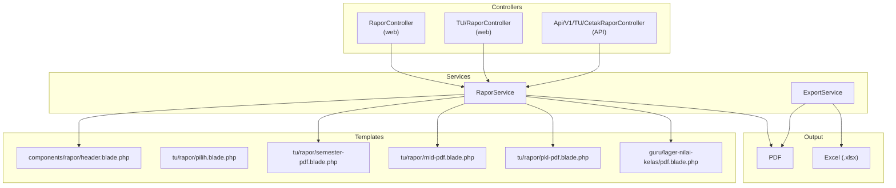
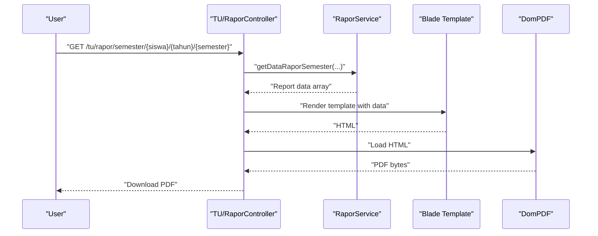
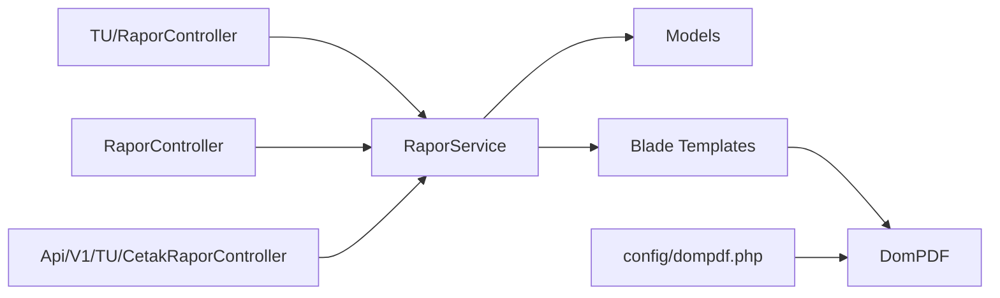

# Report Templates & Formatting

<cite>
**Referenced Files in This Document**
- [dompdf.php](file://config/dompdf.php)
- [RaporService.php](file://app/Services/RaporService.php)
- [RaporController.php](file://app/Http/Controllers/RaporController.php)
- [TU/RaporController.php](file://app/Http/Controllers/TU/RaporController.php)
- [Api/V1/TU/CetakRaporController.php](file://app/Http/Controllers/Api/V1/TU/CetakRaporController.php)
- [ExportService.php](file://app/Services/ExportService.php)
- [rapor/header.blade.php](file://resources/views/components/rapor/header.blade.php)
- [tu/rapor/pilih.blade.php](file://resources/views/tu/rapor/pilih.blade.php)
- [tu/rapor/semester-pdf.blade.php](file://resources/views/tu/rapor/semester-pdf.blade.php)
- [tu/rapor/mid-pdf.blade.php](file://resources/views/tu/rapor/mid-pdf.blade.php)
- [tu/rapor/pkl-pdf.blade.php](file://resources/views/tu/rapor/pkl-pdf.blade.php)
- [guru/lager-nilai-kelas/pdf.blade.php](file://resources/views/guru/lager-nilai-kelas/pdf.blade.php)
- [RaporPdfTest.php](file://tests/Feature/RaporPdfTest.php)
- [RaporMidPdfTest.php](file://tests/Feature/RaporMidPdfTest.php)
- [RaporPklPdfTest.php](file://tests/Feature/RaporPklPdfTest.php)
- [LagerNilaiPdfTest.php](file://tests/Feature/LagerNilaiPdfTest.php)
- [progres-pengerjaan.md](file://progres-pengerjaan.md)
- [09-ekspor-laporan.md](file://docs/manual-tu/09-ekspor-laporan.md)
</cite>

## Table of Contents
1. [Introduction](#introduction)
2. [Project Structure](#project-structure)
3. [Core Components](#core-components)
4. [Architecture Overview](#architecture-overview)
5. [Detailed Component Analysis](#detailed-component-analysis)
6. [Dependency Analysis](#dependency-analysis)
7. [Performance Considerations](#performance-considerations)
8. [Troubleshooting Guide](#troubleshooting-guide)
9. [Conclusion](#conclusion)
10. [Appendices](#appendices)

## Introduction
This document explains the report templates and formatting system used to generate academic transcripts and related printable documents. It covers the different report types (standard semester reports, mid-year progress reports, practical training certificates, and class grade sheets), the Blade template structure, component composition, data binding patterns, CSS styling and responsive/print-optimized layouts, customization features (school logo, headers/footers, color schemes), conditional formatting, data tables, and visual elements. It also documents template inheritance, partial views, reusable components, accessibility considerations, print quality optimization, and cross-browser compatibility for printed reports.

## Project Structure
The report system spans several layers:
- Services collect and aggregate report data.
- Controllers orchestrate requests and render PDFs via DomPDF.
- Blade templates define the visual structure and bind data.
- Shared components encapsulate reusable UI parts (e.g., report header).
- Tests validate PDF generation and export flows.

**Diagram sources**
- [RaporController.php](file://app/Http/Controllers/RaporController.php)
- [TU/RaporController.php](file://app/Http/Controllers/TU/RaporController.php)
- [Api/V1/TU/CetakRaporController.php](file://app/Http/Controllers/Api/V1/TU/CetakRaporController.php)
- [RaporService.php](file://app/Services/RaporService.php)
- [ExportService.php](file://app/Services/ExportService.php)
- [rapor/header.blade.php](file://resources/views/components/rapor/header.blade.php)
- [tu/rapor/pilih.blade.php](file://resources/views/tu/rapor/pilih.blade.php)
- [tu/rapor/semester-pdf.blade.php](file://resources/views/tu/rapor/semester-pdf.blade.php)
- [tu/rapor/mid-pdf.blade.php](file://resources/views/tu/rapor/mid-pdf.blade.php)
- [tu/rapor/pkl-pdf.blade.php](file://resources/views/tu/rapor/pkl-pdf.blade.php)
- [guru/lager-nilai-kelas/pdf.blade.php](file://resources/views/guru/lager-nilai-kelas/pdf.blade.php)

**Section sources**
- [progres-pengerjaan.md](file://progres-pengerjaan.md)

## Core Components
- RaporService: Aggregates report data for semester, mid-year, PKL, and class grade sheets. Provides structured arrays consumed by templates.
- TU/RaporController: Web endpoints to select filters and render PDFs for semester, mid-year, and PKL reports.
- RaporController: Legacy/web controller for report generation.
- Api/V1/TU/CetakRaporController: API to list students and support bulk printing workflows.
- ExportService: Exports data to Excel using OpenSpout.
- Blade Components: Reusable components like the report header.
- Templates: Dedicated Blade views for each report type and layout.

Key responsibilities:
- Data collection and normalization in services.
- Request orchestration and PDF rendering in controllers.
- Template composition and presentation in Blade views.
- Export pipeline for spreadsheets.

**Section sources**
- [RaporService.php](file://app/Services/RaporService.php)
- [TU/RaporController.php](file://app/Http/Controllers/TU/RaporController.php)
- [RaporController.php](file://app/Http/Controllers/RaporController.php)
- [Api/V1/TU/CetakRaporController.php](file://app/Http/Controllers/Api/V1/TU/CetakRaporController.php)
- [ExportService.php](file://app/Services/ExportService.php)
- [rapor/header.blade.php](file://resources/views/components/rapor/header.blade.php)

## Architecture Overview
The report architecture follows a layered pattern:
- Presentation: Blade templates render HTML.
- Transformation: DomPDF converts HTML to PDF.
- Data: Services prepare structured datasets.
- Controls: Controllers expose endpoints and APIs.

**Diagram sources**
- [TU/RaporController.php](file://app/Http/Controllers/TU/RaporController.php)
- [RaporService.php](file://app/Services/RaporService.php)
- [tu/rapor/semester-pdf.blade.php](file://resources/views/tu/rapor/semester-pdf.blade.php)
- [dompdf.php](file://config/dompdf.php)

## Detailed Component Analysis

### Report Types and Templates
- Standard Semester Reports
  - Purpose: Comprehensive academic transcript for a semester.
  - Template: [tu/rapor/semester-pdf.blade.php](file://resources/views/tu/rapor/semester-pdf.blade.php)
  - Data source: [RaporService.php](file://app/Services/RaporService.php)
  - Controller: [TU/RaporController.php](file://app/Http/Controllers/TU/RaporController.php)
  - Tests: [RaporPdfTest.php](file://tests/Feature/RaporPdfTest.php)

- Mid-Year Progress Reports
  - Purpose: Summarized assessment (formative, periodic, and summative) for mid-year.
  - Template: [tu/rapor/mid-pdf.blade.php](file://resources/views/tu/rapor/mid-pdf.blade.php)
  - Data source: [RaporService.php](file://app/Services/RaporService.php)
  - Controller: [TU/RaporController.php](file://app/Http/Controllers/TU/RaporController.php)
  - Tests: [RaporMidPdfTest.php](file://tests/Feature/RaporMidPdfTest.php)

- Practical Training Certificates
  - Purpose: Certificate-style report for PKL with competency descriptors and weighted scores.
  - Template: [tu/rapor/pkl-pdf.blade.php](file://resources/views/tu/rapor/pkl-pdf.blade.php)
  - Data source: [RaporService.php](file://app/Services/RaporService.php)
  - Controller: [TU/RaporController.php](file://app/Http/Controllers/TU/RaporController.php)
  - Tests: [RaporPklPdfTest.php](file://tests/Feature/RaporPklPdfTest.php)

- Class Grade Sheets
  - Purpose: Grid of student grades per subject for a class.
  - Template: [guru/lager-nilai-kelas/pdf.blade.php](file://resources/views/guru/lager-nilai-kelas/pdf.blade.php)
  - Controller: [Guru/LagerNilaiKelasController](file://app/Http/Controllers/Guru/LagerNilaiKelasController.php)
  - Tests: [LagerNilaiPdfTest.php](file://tests/Feature/LagerNilaiPdfTest.php)

**Section sources**
- [progres-pengerjaan.md](file://progres-pengerjaan.md)
- [RaporService.php](file://app/Services/RaporService.php)
- [TU/RaporController.php](file://app/Http/Controllers/TU/RaporController.php)
- [RaporPdfTest.php](file://tests/Feature/RaporPdfTest.php)
- [RaporMidPdfTest.php](file://tests/Feature/RaporMidPdfTest.php)
- [RaporPklPdfTest.php](file://tests/Feature/RaporPklPdfTest.php)
- [LagerNilaiPdfTest.php](file://tests/Feature/LagerNilaiPdfTest.php)

### Blade Template Structure and Component Composition
- Reusable Header Component
  - Component: [rapor/header.blade.php](file://resources/views/components/rapor/header.blade.php)
  - Purpose: Displays school identity, student info, year/semester, and optional logo.
  - Usage: Included in semester, mid-year, and PKL templates to maintain consistent branding.

- Filter and Selection Views
  - Selection: [tu/rapor/pilih.blade.php](file://resources/views/tu/rapor/pilih.blade.php)
  - Purpose: Allows filtering by class, year, and semester before generating reports.

- Report-Specific Templates
  - Semester: [tu/rapor/semester-pdf.blade.php](file://resources/views/tu/rapor/semester-pdf.blade.php)
  - Mid-year: [tu/rapor/mid-pdf.blade.php](file://resources/views/tu/rapor/mid-pdf.blade.php)
  - PKL: [tu/rapor/pkl-pdf.blade.php](file://resources/views/tu/rapor/pkl-pdf.blade.php)
  - Class grades: [guru/lager-nilai-kelas/pdf.blade.php](file://resources/views/guru/lager-nilai-kelas/pdf.blade.php)

Template patterns:
- Inheritance: Templates extend a base layout (e.g., app layout) to share global styles and scripts.
- Partial Views: Components like the header are included to avoid duplication.
- Data Binding: Controllers pass arrays from services to templates; templates iterate over data to render tables, descriptors, and summaries.

**Section sources**
- [rapor/header.blade.php](file://resources/views/components/rapor/header.blade.php)
- [tu/rapor/pilih.blade.php](file://resources/views/tu/rapor/pilih.blade.php)
- [tu/rapor/semester-pdf.blade.php](file://resources/views/tu/rapor/semester-pdf.blade.php)
- [tu/rapor/mid-pdf.blade.php](file://resources/views/tu/rapor/mid-pdf.blade.php)
- [tu/rapor/pkl-pdf.blade.php](file://resources/views/tu/rapor/pkl-pdf.blade.php)
- [guru/lager-nilai-kelas/pdf.blade.php](file://resources/views/guru/lager-nilai-kelas/pdf.blade.php)

### Data Binding Patterns
- Controllers call service methods to fetch structured data.
- Services aggregate related models (grades, attendance, co-curricular activities, PKL descriptors) and compute derived metrics.
- Templates receive associative arrays and lists; they render:
  - Student and class metadata
  - Subject-wise grades and descriptors
  - Attendance summaries
  - Co-curricular and extracurricular records
  - Competency descriptors and weighted averages for PKL

This approach ensures templates remain presentation-focused while services centralize data logic.

**Section sources**
- [RaporService.php](file://app/Services/RaporService.php)
- [TU/RaporController.php](file://app/Http/Controllers/TU/RaporController.php)
- [Api/V1/TU/CetakRaporController.php](file://app/Http/Controllers/Api/V1/TU/CetakRaporController.php)

### CSS Styling Approach and Responsive Design
- Media Type and Paper Settings
  - DomPDF default media type is configured to "screen", but PDF output is intended for print.
  - Default paper size is A4, portrait orientation.
  - Backend rendering engine is set to CPDF.

- Print Optimization
  - Prefer CSS page-break properties to control pagination.
  - Use high-contrast colors and avoid unsupported features (e.g., flexbox/grid where not widely supported).
  - Minimize images and ensure fonts are embedded or available to DomPDF.

- Responsive Considerations
  - While responsive breakpoints are useful for screen media, focus on fixed-page layouts for PDFs.
  - Use tables with constrained widths and wrap long text to prevent overflow.

- Color Scheme Adjustments
  - Apply subtle accent colors for headers and highlights.
  - Ensure WCAG contrast ratios for readability in printed documents.

Note: Specific CSS files and overrides are not included in the referenced files; styling should be scoped to report templates and loaded via the application’s asset pipeline.

**Section sources**
- [dompdf.php](file://config/dompdf.php)

### Conditional Formatting, Data Tables, Charts, and Visual Elements
- Conditional Formatting
  - Render passing/failing indicators based on thresholds (e.g., KKM).
  - Highlight absent or failing rows in grade sheets.

- Data Tables
  - Use semantic HTML tables for grades and descriptors.
  - Ensure borders and spacing are consistent across pages.

- Charts and Visuals
  - Charts are not part of the current report templates; stick to tabular and textual summaries for reliability in PDFs.

- Visual Elements
  - School logo placement via the header component.
  - Signatures and stamps can be inserted as static images if needed.

**Section sources**
- [RaporService.php](file://app/Services/RaporService.php)
- [rapor/header.blade.php](file://resources/views/components/rapor/header.blade.php)

### Template Inheritance, Partial Views, and Reusable Components
- Inheritance
  - Templates extend a shared layout to inherit global styles and scripts.
- Partial Views
  - Components encapsulate repeated UI (e.g., header).
- Reusable Components
  - The report header component is reused across all report types to maintain brand consistency.

**Section sources**
- [rapor/header.blade.php](file://resources/views/components/rapor/header.blade.php)
- [tu/rapor/semester-pdf.blade.php](file://resources/views/tu/rapor/semester-pdf.blade.php)
- [tu/rapor/mid-pdf.blade.php](file://resources/views/tu/rapor/mid-pdf.blade.php)
- [tu/rapor/pkl-pdf.blade.php](file://resources/views/tu/rapor/pkl-pdf.blade.php)

### Accessibility Considerations
- Semantic HTML
  - Use tables for tabular data; provide captions and summaries.
- Alt Text
  - Provide alt text for logos and images.
- Contrast and Fonts
  - Maintain readable font sizes and high-contrast text.
- Page Breaks
  - Use CSS page-break properties to avoid cutting off content.

[No sources needed since this section provides general guidance]

### Print Quality Optimization and Cross-Browser Compatibility
- Print Quality
  - Use vector fonts and avoid raster-only fonts.
  - Keep images low-resolution to reduce file size; ensure clarity.
- Cross-Browser Compatibility
  - PDFs are generated server-side; focus on consistent rendering across browsers.
  - Validate PDF output in multiple viewers.

[No sources needed since this section provides general guidance]

## Dependency Analysis
The report system exhibits clear separation of concerns:
- Controllers depend on Services for data.
- Services depend on Models for persistence.
- Templates depend on data passed by Controllers and on shared Components.
- DomPDF depends on configured media/paper settings.

**Diagram sources**
- [TU/RaporController.php](file://app/Http/Controllers/TU/RaporController.php)
- [RaporController.php](file://app/Http/Controllers/RaporController.php)
- [Api/V1/TU/CetakRaporController.php](file://app/Http/Controllers/Api/V1/TU/CetakRaporController.php)
- [RaporService.php](file://app/Services/RaporService.php)
- [dompdf.php](file://config/dompdf.php)

**Section sources**
- [RaporService.php](file://app/Services/RaporService.php)
- [TU/RaporController.php](file://app/Http/Controllers/TU/RaporController.php)
- [RaporController.php](file://app/Http/Controllers/RaporController.php)
- [Api/V1/TU/CetakRaporController.php](file://app/Http/Controllers/Api/V1/TU/CetakRaporController.php)
- [dompdf.php](file://config/dompdf.php)

## Performance Considerations
- Efficient Queries
  - Use eager loading in services to minimize N+1 queries.
- Pagination and Batch Processing
  - For bulk exports, process in batches to manage memory.
- PDF Rendering
  - Keep HTML minimal and avoid heavy client-side assets.
- Caching
  - Cache frequently accessed metadata (e.g., school info) to speed up rendering.

[No sources needed since this section provides general guidance]

## Troubleshooting Guide
Common issues and resolutions:
- PDF Not Generated
  - Verify DomPDF configuration and media/paper settings.
  - Ensure templates render valid HTML and include required components.
- Missing Data
  - Confirm service methods are called with correct parameters and that models are properly related.
- Export Failures
  - Validate OpenSpout configuration and stream handling in ExportService.
- Test Failures
  - Review feature tests to confirm route names, headers, and response types.

Validation references:
- PDF generation tests for semester, mid-year, PKL, and class grade sheets.
- Manual export guide for Excel downloads.

**Section sources**
- [RaporPdfTest.php](file://tests/Feature/RaporPdfTest.php)
- [RaporMidPdfTest.php](file://tests/Feature/RaporMidPdfTest.php)
- [RaporPklPdfTest.php](file://tests/Feature/RaporPklPdfTest.php)
- [LagerNilaiPdfTest.php](file://tests/Feature/LagerNilaiPdfTest.php)
- [09-ekspor-laporan.md](file://docs/manual-tu/09-ekspor-laporan.md)

## Conclusion
The report system leverages a clean separation of concerns: services handle data aggregation, controllers orchestrate rendering, and Blade templates present standardized, reusable layouts. DomPDF provides reliable print-ready outputs with configurable paper and media settings. The system supports multiple report types, includes reusable components for branding, and is validated by targeted tests. By focusing on semantic HTML, print-optimized CSS, and robust data binding, the templates deliver consistent, accessible, and high-quality printed reports.

## Appendices

### Appendix A: Report Template Types and Data Sources
- Standard Semester Reports: [tu/rapor/semester-pdf.blade.php](file://resources/views/tu/rapor/semester-pdf.blade.php) with data from [RaporService.php](file://app/Services/RaporService.php)
- Mid-Year Progress Reports: [tu/rapor/mid-pdf.blade.php](file://resources/views/tu/rapor/mid-pdf.blade.php) with data from [RaporService.php](file://app/Services/RaporService.php)
- Practical Training Certificates: [tu/rapor/pkl-pdf.blade.php](file://resources/views/tu/rapor/pkl-pdf.blade.php) with data from [RaporService.php](file://app/Services/RaporService.php)
- Class Grade Sheets: [guru/lager-nilai-kelas/pdf.blade.php](file://resources/views/guru/lager-nilai-kelas/pdf.blade.php) with data from [RaporService.php](file://app/Services/RaporService.php)

**Section sources**
- [progres-pengerjaan.md](file://progres-pengerjaan.md)
- [RaporService.php](file://app/Services/RaporService.php)

### Appendix B: DomPDF Configuration Reference
- Backend: CPDF
- Default media type: screen
- Default paper size: A4
- Default orientation: portrait
- Default font family: serif

**Section sources**
- [dompdf.php](file://config/dompdf.php)