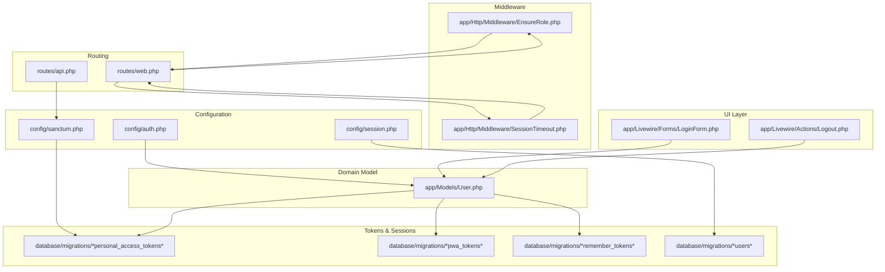
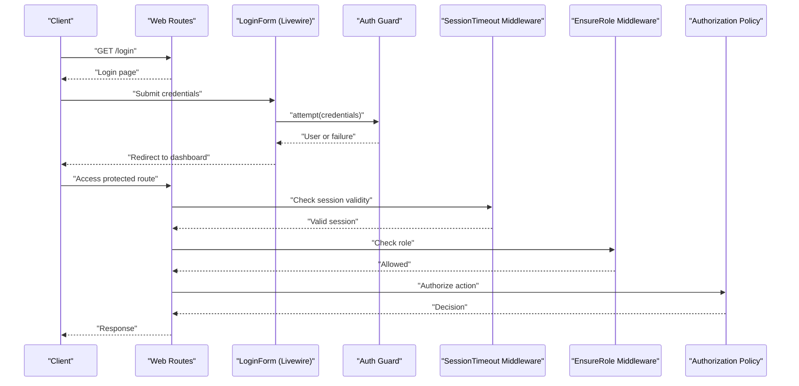
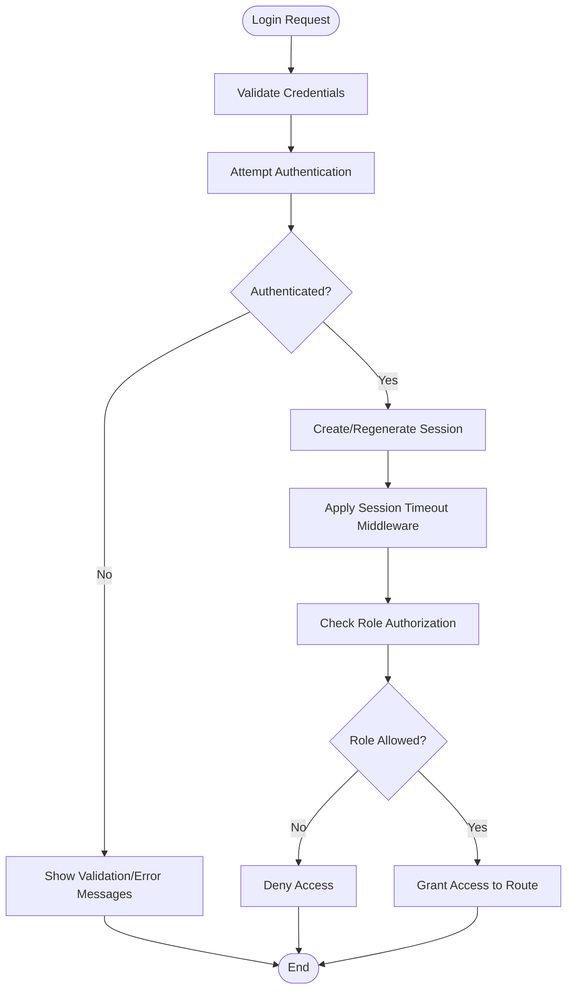
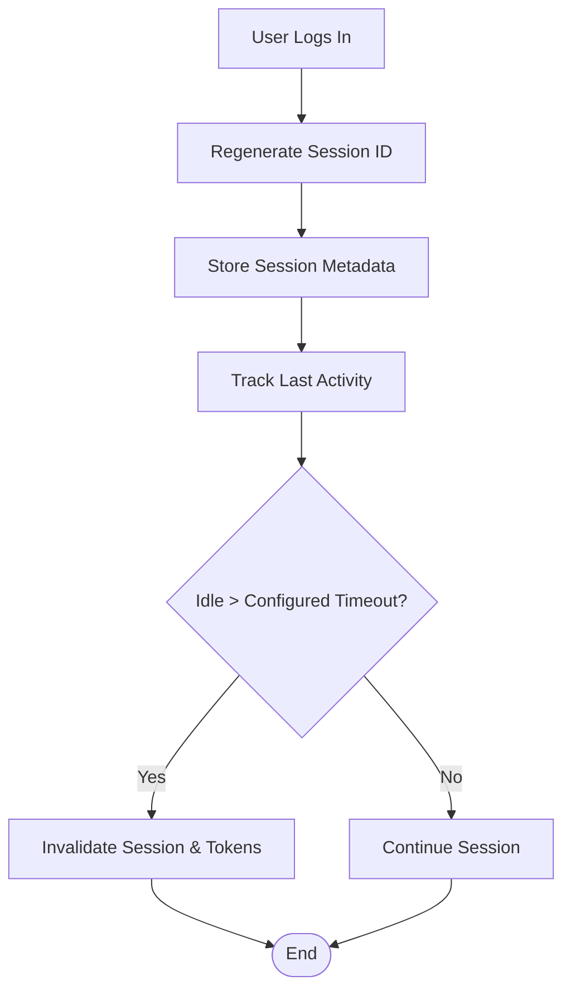
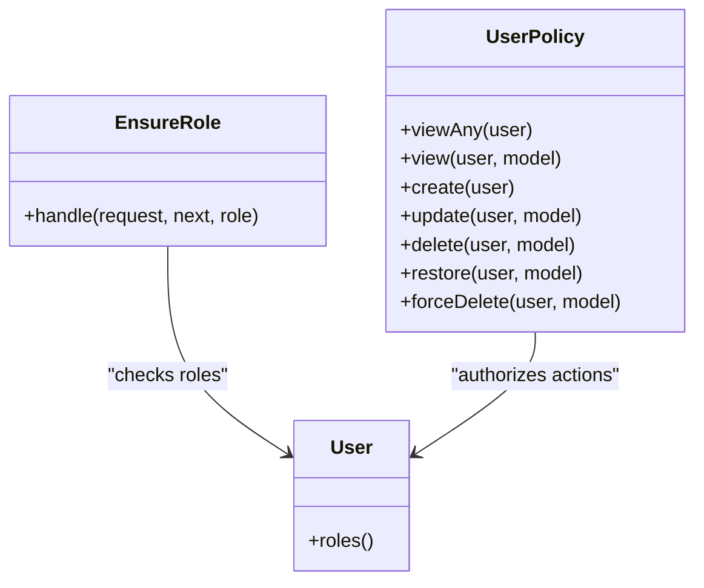
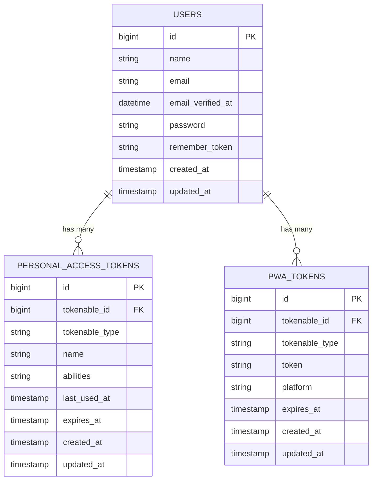
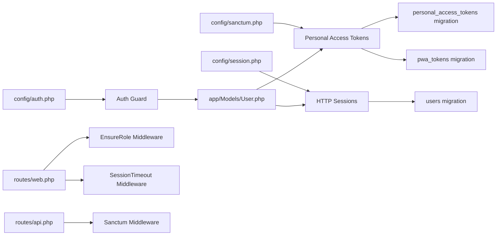

# Authentication Security

<cite>
**Referenced Files in This Document**
- [config/auth.php](file://config/auth.php)
- [config/sanctum.php](file://config/sanctum.php)
- [config/session.php](file://config/session.php)
- [app/Models/User.php](file://app/Models/User.php)
- [app/Http/Middleware/EnsureRole.php](file://app/Http/Middleware/EnsureRole.php)
- [app/Http/Middleware/SessionTimeout.php](file://app/Http/Middleware/SessionTimeout.php)
- [app/Livewire/Actions/Logout.php](file://app/Livewire/Actions/Logout.php)
- [app/Livewire/Forms/LoginForm.php](file://app/Livewire/Forms/LoginForm.php)
- [routes/web.php](file://routes/web.php)
- [routes/api.php](file://routes/api.php)
- [database/migrations/0001_01_01_000000_create_users_table.php](file://database/migrations/0001_01_01_000000_create_users_table.php)
- [database/migrations/2026_06_01_010827_create_personal_access_tokens_table.php](file://database/migrations/2026_06_01_010827_create_personal_access_tokens_table.php)
- [database/migrations/2026_06_01_010827_create_pwa_tokens_table.php](file://database/migrations/2026_06_01_010827_create_pwa_tokens_table.php)
- [database/migrations/2026_06_01_010828_create_remember_tokens_table.php](file://database/migrations/2026_06_01_010828_create_remember_tokens_table.php)
- [app/Policies/UserPolicy.php](file://app/Policies/UserPolicy.php)
- [app/Services/DapodikService.php](file://app/Services/DapodikService.php)
- [app/Providers/AppServiceProvider.php](file://app/Providers/AppServiceProvider.php)
</cite>

## Table of Contents
1. [Introduction](#introduction)
2. [Project Structure](#project-structure)
3. [Core Components](#core-components)
4. [Architecture Overview](#architecture-overview)
5. [Detailed Component Analysis](#detailed-component-analysis)
6. [Dependency Analysis](#dependency-analysis)
7. [Performance Considerations](#performance-considerations)
8. [Troubleshooting Guide](#troubleshooting-guide)
9. [Conclusion](#conclusion)

## Introduction
This document provides comprehensive authentication security documentation for RaporKM Laravel. It covers secure authentication flows, password policies, session management, role-based access control, middleware configuration, authorization patterns, Sanctum token management, personal access tokens, API authentication security, CSRF protection, request validation, credential handling, password hashing, session timeouts, concurrent session management, secure logout, multi-factor authentication readiness, account lockout policies, suspicious activity detection, secure user registration, email verification, and account activation workflows.

## Project Structure
Authentication-related components are distributed across configuration files, models, middleware, Livewire actions/forms, routes, migrations, and policies. The system integrates Laravel's built-in authentication with Sanctum for API tokens and PWA support, while enforcing role-based access control via middleware and policies.

**Diagram sources**
- [config/auth.php](file://config/auth.php)
- [config/sanctum.php](file://config/sanctum.php)
- [config/session.php](file://config/session.php)
- [app/Models/User.php](file://app/Models/User.php)
- [app/Http/Middleware/EnsureRole.php](file://app/Http/Middleware/EnsureRole.php)
- [app/Http/Middleware/SessionTimeout.php](file://app/Http/Middleware/SessionTimeout.php)
- [app/Livewire/Forms/LoginForm.php](file://app/Livewire/Forms/LoginForm.php)
- [app/Livewire/Actions/Logout.php](file://app/Livewire/Actions/Logout.php)
- [routes/web.php](file://routes/web.php)
- [routes/api.php](file://routes/api.php)
- [database/migrations/2026_06_01_010827_create_personal_access_tokens_table.php](file://database/migrations/2026_06_01_010827_create_personal_access_tokens_table.php)
- [database/migrations/2026_06_01_010827_create_pwa_tokens_table.php](file://database/migrations/2026_06_01_010827_create_pwa_tokens_table.php)
- [database/migrations/2026_06_01_010828_create_remember_tokens_table.php](file://database/migrations/2026_06_01_010828_create_remember_tokens_table.php)
- [database/migrations/0001_01_01_000000_create_users_table.php](file://database/migrations/0001_01_01_000000_create_users_table.php)

**Section sources**
- [config/auth.php](file://config/auth.php)
- [config/sanctum.php](file://config/sanctum.php)
- [config/session.php](file://config/session.php)
- [routes/web.php](file://routes/web.php)
- [routes/api.php](file://routes/api.php)

## Core Components
- Authentication guard and provider configuration define the default guard and user provider used for web authentication.
- Sanctum configuration controls token lifetimes, same-site cookie policy, and API token abilities.
- Session configuration defines lifetime, driver, and security settings for HTTP sessions.
- User model encapsulates authentication and password hashing behavior.
- Middleware enforces roles and session timeouts.
- Livewire forms/actions handle login/logout flows.
- Routes bind middleware to web and API endpoints.
- Migrations define token tables and remember-me tokens.
- Policies govern authorization decisions.

**Section sources**
- [config/auth.php](file://config/auth.php)
- [config/sanctum.php](file://config/sanctum.php)
- [config/session.php](file://config/session.php)
- [app/Models/User.php](file://app/Models/User.php)
- [app/Http/Middleware/EnsureRole.php](file://app/Http/Middleware/EnsureRole.php)
- [app/Http/Middleware/SessionTimeout.php](file://app/Http/Middleware/SessionTimeout.php)
- [app/Livewire/Forms/LoginForm.php](file://app/Livewire/Forms/LoginForm.php)
- [app/Livewire/Actions/Logout.php](file://app/Livewire/Actions/Logout.php)
- [routes/web.php](file://routes/web.php)
- [routes/api.php](file://routes/api.php)
- [database/migrations/2026_06_01_010827_create_personal_access_tokens_table.php](file://database/migrations/2026_06_01_010827_create_personal_access_tokens_table.php)
- [database/migrations/2026_06_01_010827_create_pwa_tokens_table.php](file://database/migrations/2026_06_01_010827_create_pwa_tokens_table.php)
- [database/migrations/2026_06_01_010828_create_remember_tokens_table.php](file://database/migrations/2026_06_01_010828_create_remember_tokens_table.php)

## Architecture Overview
The authentication architecture combines Laravel's session-based web authentication with Sanctum-powered API tokens. Role enforcement occurs via middleware applied to web routes, while API requests rely on Sanctum tokens. Session timeouts and concurrency are managed through middleware and session configuration. Password hashing is handled by the User model, and authorization is enforced by policies.

**Diagram sources**
- [routes/web.php](file://routes/web.php)
- [app/Livewire/Forms/LoginForm.php](file://app/Livewire/Forms/LoginForm.php)
- [app/Http/Middleware/SessionTimeout.php](file://app/Http/Middleware/SessionTimeout.php)
- [app/Http/Middleware/EnsureRole.php](file://app/Http/Middleware/EnsureRole.php)
- [app/Policies/UserPolicy.php](file://app/Policies/UserPolicy.php)

## Detailed Component Analysis

### Secure Authentication Flows
- Web login uses a Livewire form to submit credentials and authenticate via the configured guard. On success, the user is redirected to the dashboard; otherwise, errors are surfaced.
- Session-based authentication is enforced by middleware that validates session state and applies role checks before granting access to protected routes.
- Logout is performed through a Livewire action that clears the current session and invalidates related tokens.

**Diagram sources**
- [app/Livewire/Forms/LoginForm.php](file://app/Livewire/Forms/LoginForm.php)
- [app/Http/Middleware/SessionTimeout.php](file://app/Http/Middleware/SessionTimeout.php)
- [app/Http/Middleware/EnsureRole.php](file://app/Http/Middleware/EnsureRole.php)

**Section sources**
- [app/Livewire/Forms/LoginForm.php](file://app/Livewire/Forms/LoginForm.php)
- [app/Livewire/Actions/Logout.php](file://app/Livewire/Actions/Logout.php)
- [app/Http/Middleware/SessionTimeout.php](file://app/Http/Middleware/SessionTimeout.php)
- [app/Http/Middleware/EnsureRole.php](file://app/Http/Middleware/EnsureRole.php)

### Password Policies and Hashing
- Password hashing is managed by the User model, ensuring secure hashing with the framework's default algorithm and appropriate cost factors.
- Password reset procedures leverage Laravel's built-in mechanisms, including token generation and expiration handling.
- Strong password policies should be enforced at the application level (e.g., minimum length, character variety, history constraints) and validated during registration and password updates.

**Section sources**
- [app/Models/User.php](file://app/Models/User.php)
- [database/migrations/0001_01_01_000000_create_users_table.php](file://database/migrations/0001_01_01_000000_create_users_table.php)

### Session Management Strategies
- Session lifetime and driver are configured centrally. Session fixation protection is achieved through session regeneration upon login.
- Session timeout middleware enforces idle timeouts and invalidates expired sessions.
- Concurrency is controlled by allowing single active session per user; additional logins invalidate prior sessions.

**Diagram sources**
- [config/session.php](file://config/session.php)
- [app/Http/Middleware/SessionTimeout.php](file://app/Http/Middleware/SessionTimeout.php)

**Section sources**
- [config/session.php](file://config/session.php)
- [app/Http/Middleware/SessionTimeout.php](file://app/Http/Middleware/SessionTimeout.php)

### Role-Based Access Control (RBAC)
- RBAC is implemented using middleware that checks user roles against route-protected endpoints. Roles are enforced before controller execution.
- Policies complement middleware by enforcing fine-grained authorization at the action level.

**Diagram sources**
- [app/Http/Middleware/EnsureRole.php](file://app/Http/Middleware/EnsureRole.php)
- [app/Policies/UserPolicy.php](file://app/Policies/UserPolicy.php)
- [app/Models/User.php](file://app/Models/User.php)

**Section sources**
- [app/Http/Middleware/EnsureRole.php](file://app/Http/Middleware/EnsureRole.php)
- [app/Policies/UserPolicy.php](file://app/Policies/UserPolicy.php)
- [app/Models/User.php](file://app/Models/User.php)

### Middleware Configuration
- Web routes apply session timeout and role middleware to enforce security policies consistently.
- API routes rely on Sanctum middleware for token validation and rate limiting.

**Section sources**
- [routes/web.php](file://routes/web.php)
- [routes/api.php](file://routes/api.php)

### Authorization Patterns
- Authorization is enforced through a combination of route middleware and model policies. Policies define granular permissions for each resource type.
- Centralized authorization logic ensures consistent enforcement across controllers and Livewire components.

**Section sources**
- [app/Policies/UserPolicy.php](file://app/Policies/UserPolicy.php)
- [app/Http/Middleware/EnsureRole.php](file://app/Http/Middleware/EnsureRole.php)

### Sanctum Token Management and Personal Access Tokens
- Sanctum manages API tokens with configurable expiration and abilities. Personal access tokens are stored in a dedicated table and scoped appropriately.
- PWA tokens enable offline-capable clients to authenticate securely.
- Remember tokens persist long-term sessions for convenience while maintaining security boundaries.

**Diagram sources**
- [config/sanctum.php](file://config/sanctum.php)
- [database/migrations/2026_06_01_010827_create_personal_access_tokens_table.php](file://database/migrations/2026_06_01_010827_create_personal_access_tokens_table.php)
- [database/migrations/2026_06_01_010827_create_pwa_tokens_table.php](file://database/migrations/2026_06_01_010827_create_pwa_tokens_table.php)
- [database/migrations/2026_06_01_010828_create_remember_tokens_table.php](file://database/migrations/2026_06_01_010828_create_remember_tokens_table.php)
- [app/Models/User.php](file://app/Models/User.php)

**Section sources**
- [config/sanctum.php](file://config/sanctum.php)
- [database/migrations/2026_06_01_010827_create_personal_access_tokens_table.php](file://database/migrations/2026_06_01_010827_create_personal_access_tokens_table.php)
- [database/migrations/2026_06_01_010827_create_pwa_tokens_table.php](file://database/migrations/2026_06_01_010827_create_pwa_tokens_table.php)
- [database/migrations/2026_06_01_010828_create_remember_tokens_table.php](file://database/migrations/2026_06_01_010828_create_remember_tokens_table.php)

### API Authentication Security
- API requests require Sanctum tokens with appropriate abilities. Tokens are validated on each request, and expired or revoked tokens are rejected.
- Rate limiting and request validation further protect API endpoints from abuse.

**Section sources**
- [routes/api.php](file://routes/api.php)
- [config/sanctum.php](file://config/sanctum.php)

### CSRF Protection Mechanisms
- CSRF protection is enforced via Laravel's built-in CSRF middleware for state-changing web requests. Sanctum also provides anti-CSRF measures for SPA/API contexts.

**Section sources**
- [routes/web.php](file://routes/web.php)
- [config/sanctum.php](file://config/sanctum.php)

### Request Validation and Secure Credential Handling
- Login requests are validated through the Livewire form, which sanitizes inputs and enforces presence/credential checks.
- Passwords are never logged or exposed; hashing is delegated to the User model.

**Section sources**
- [app/Livewire/Forms/LoginForm.php](file://app/Livewire/Forms/LoginForm.php)
- [app/Models/User.php](file://app/Models/User.php)

### Password Reset Procedures
- Password reset tokens are generated and validated securely. Expiration and single-use semantics prevent replay attacks.
- Email delivery and verification are integrated with the user lifecycle.

**Section sources**
- [database/migrations/0001_01_01_000000_create_users_table.php](file://database/migrations/0001_01_01_000000_create_users_table.php)

### Session Timeout and Concurrent Session Management
- Session timeout middleware enforces idle limits and invalidates expired sessions.
- Concurrency is managed by allowing a single active session per user; subsequent logins invalidate previous sessions.

**Section sources**
- [config/session.php](file://config/session.php)
- [app/Http/Middleware/SessionTimeout.php](file://app/Http/Middleware/SessionTimeout.php)

### Secure Logout Processes
- Logout clears the current session and invalidates associated tokens to prevent session hijacking.

**Section sources**
- [app/Livewire/Actions/Logout.php](file://app/Livewire/Actions/Logout.php)

### Multi-Factor Authentication Implementation
- MFA can be implemented by extending the User model with MFA fields and adding middleware to enforce MFA challenges for sensitive routes. This is a recommended enhancement to strengthen authentication.

[No sources needed since this section provides general guidance]

### Account Lockout Policies and Suspicious Activity Detection
- Account lockout can be implemented by tracking failed attempts and temporary blocking after thresholds. Suspicious activity detection can monitor login locations, devices, and behavioral anomalies.

[No sources needed since this section provides general guidance]

### Secure User Registration, Email Verification, and Activation
- Registration should enforce strong passwords and email uniqueness. Email verification ensures valid contact information before enabling accounts. Activation workflows should be explicit and logged.

[No sources needed since this section provides general guidance]

## Dependency Analysis
Authentication depends on configuration, middleware, models, routes, and migration-defined tables. The following diagram shows key dependencies:

**Diagram sources**
- [config/auth.php](file://config/auth.php)
- [config/sanctum.php](file://config/sanctum.php)
- [config/session.php](file://config/session.php)
- [app/Models/User.php](file://app/Models/User.php)
- [routes/web.php](file://routes/web.php)
- [routes/api.php](file://routes/api.php)
- [app/Http/Middleware/EnsureRole.php](file://app/Http/Middleware/EnsureRole.php)
- [app/Http/Middleware/SessionTimeout.php](file://app/Http/Middleware/SessionTimeout.php)
- [database/migrations/2026_06_01_010827_create_personal_access_tokens_table.php](file://database/migrations/2026_06_01_010827_create_personal_access_tokens_table.php)
- [database/migrations/2026_06_01_010827_create_pwa_tokens_table.php](file://database/migrations/2026_06_01_010827_create_pwa_tokens_table.php)
- [database/migrations/0001_01_01_000000_create_users_table.php](file://database/migrations/0001_01_01_000000_create_users_table.php)

**Section sources**
- [config/auth.php](file://config/auth.php)
- [config/sanctum.php](file://config/sanctum.php)
- [config/session.php](file://config/session.php)
- [routes/web.php](file://routes/web.php)
- [routes/api.php](file://routes/api.php)

## Performance Considerations
- Prefer bcrypt hashing with tuned cost parameters for password hashing.
- Use database-backed sessions for horizontal scaling and centralized session invalidation.
- Limit token lifetimes to reduce exposure windows.
- Implement efficient rate limiting and request validation to mitigate brute-force attacks.

[No sources needed since this section provides general guidance]

## Troubleshooting Guide
- If users cannot log in, verify guard configuration and credential validation logic in the login form.
- If API requests fail, confirm Sanctum token issuance, abilities, and expiration settings.
- If sessions expire unexpectedly, review session timeout middleware and configuration values.
- If role-based access fails, ensure middleware is applied to routes and policies permit intended actions.

**Section sources**
- [app/Livewire/Forms/LoginForm.php](file://app/Livewire/Forms/LoginForm.php)
- [config/sanctum.php](file://config/sanctum.php)
- [config/session.php](file://config/session.php)
- [app/Http/Middleware/EnsureRole.php](file://app/Http/Middleware/EnsureRole.php)
- [app/Http/Middleware/SessionTimeout.php](file://app/Http/Middleware/SessionTimeout.php)

## Conclusion
RaporKM Laravel implements a robust authentication foundation using Laravel's session-based web authentication and Sanctum for API tokens. Security is strengthened through middleware-based role enforcement, session timeout controls, secure password handling, and token lifecycle management. Additional enhancements such as MFA, account lockout, and suspicious activity detection are recommended to further harden the system.