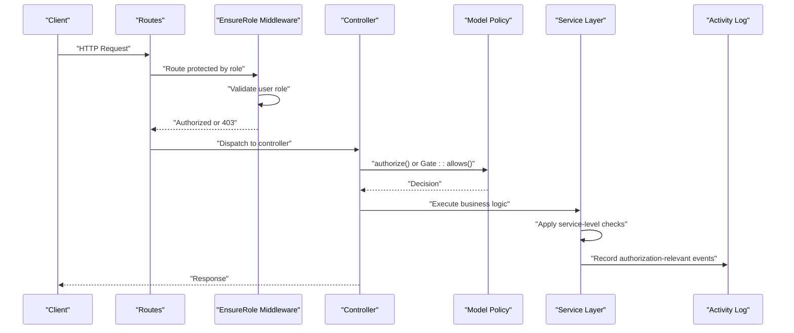
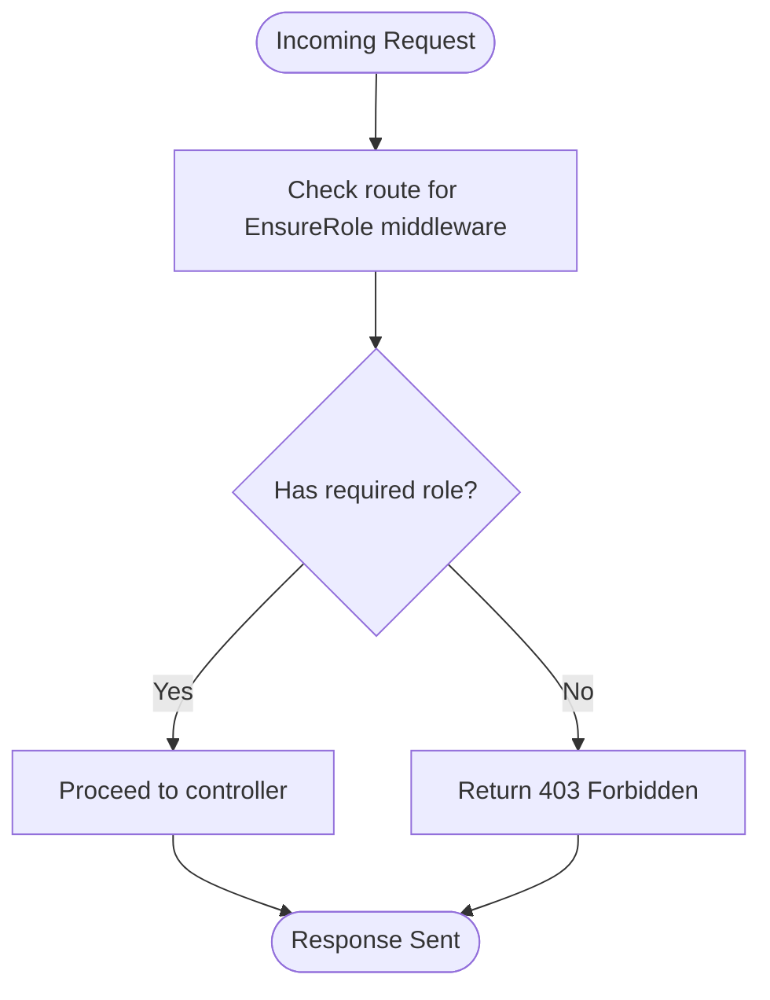
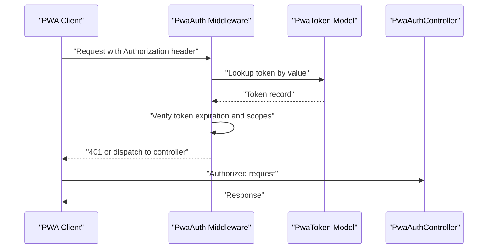
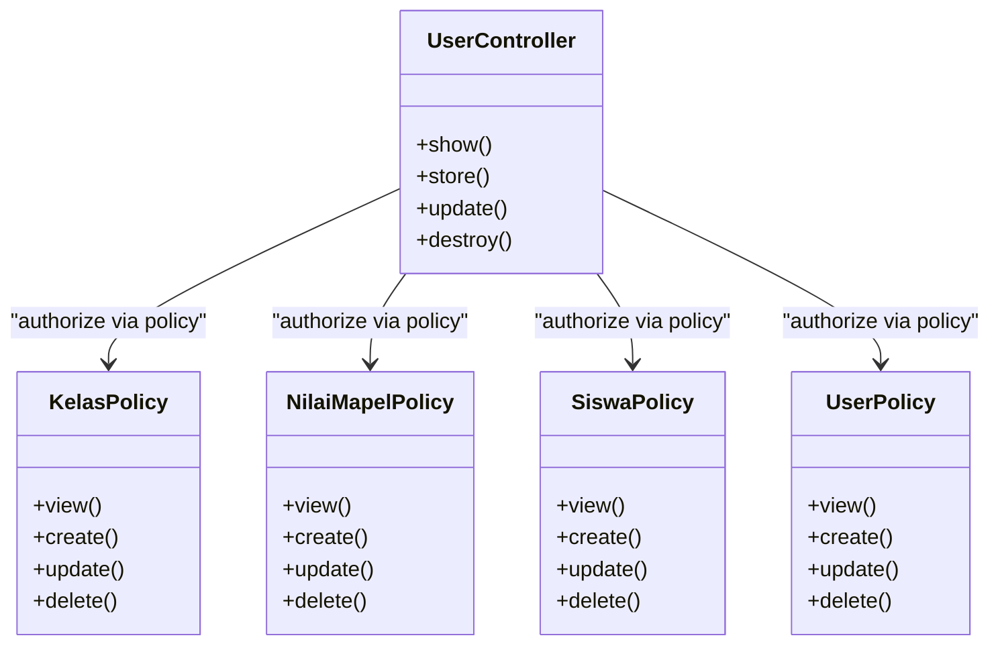
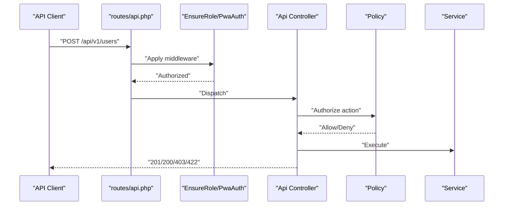
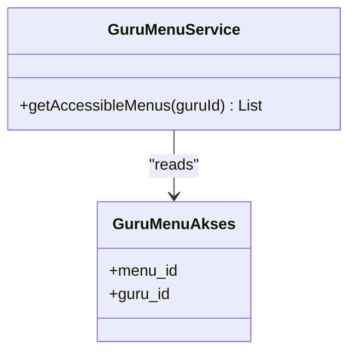
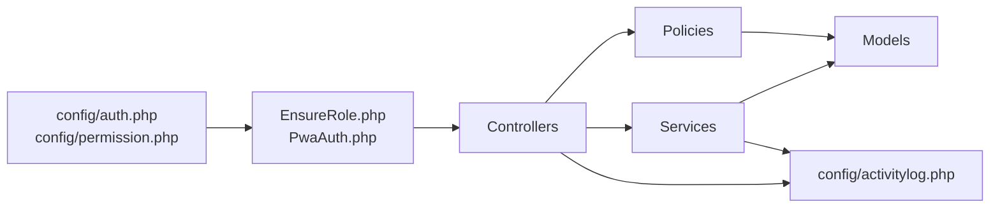

# Authorization & Access Control

<cite>
**Referenced Files in This Document**
- [EnsureRole.php](file://app/Http/Middleware/EnsureRole.php)
- [auth.php](file://config/auth.php)
- [permission.php](file://config/permission.php)
- [api.php](file://routes/api.php)
- [web.php](file://routes/web.php)
- [KelasPolicy.php](file://app/Policies/KelasPolicy.php)
- [NilaiMapelPolicy.php](file://app/Policies/NilaiMapelPolicy.php)
- [SiswaPolicy.php](file://app/Policies/SiswaPolicy.php)
- [UserPolicy.php](file://app/Policies/UserPolicy.php)
- [UserController.php](file://app/Http/Controllers/Api/V1/UserController.php)
- [GuruMenuAkses.php](file://app/Models/GuruMenuAkses.php)
- [AppLayout.php](file://app/View/Components/AppLayout.php)
- [activitylog.php](file://config/activitylog.php)
- [DapodikSyncService.php](file://app/Services/Dapodik/DapodikClient.php)
- [PegawaiService.php](file://app/Services/PegawaiService.php)
- [NilaiService.php](file://app/Services/NilaiService.php)
- [RaporService.php](file://app/Services/RaporService.php)
- [ExportService.php](file://app/Services/ExportService.php)
- [ImportService.php](file://app/Services/ImportService.php)
- [GuruMenuService.php](file://app/Services/GuruMenuService.php)
- [PwaAuth.php](file://app/Http/Middleware/PwaAuth.php)
- [PwaAuthController.php](file://app/Http/Controllers/Api/PwaAuthController.php)
- [PwaToken.php](file://app/Models/PwaToken.php)
- [PwaSyncController.php](file://app/Http/Controllers/Api/PwaSyncController.php)
- [SyncDapodikJob.php](file://app/Jobs/SyncDapodikJob.php)
- [ProcessPwaSyncJob.php](file://app/Jobs/ProcessPwaSyncJob.php)
</cite>

## Table of Contents
1. [Introduction](#introduction)
2. [Project Structure](#project-structure)
3. [Core Components](#core-components)
4. [Architecture Overview](#architecture-overview)
5. [Detailed Component Analysis](#detailed-component-analysis)
6. [Dependency Analysis](#dependency-analysis)
7. [Performance Considerations](#performance-considerations)
8. [Troubleshooting Guide](#troubleshooting-guide)
9. [Conclusion](#conclusion)

## Introduction
This document describes the authorization and access control model for RaporKM Laravel. It covers policy-based authorization, gates, role-based access control (RBAC), permission management, middleware enforcement, and view-level controls. It also documents API endpoint protections, resource-level permissions, action-based controls, bulk operations, admin override mechanisms, and audit trail requirements. The goal is to provide both technical depth and practical guidance for maintaining secure, maintainable authorization logic across the application.

## Project Structure
Authorization-related components are distributed across configuration, middleware, policies, controllers, services, and models:
- Configuration: Authentication guard and permission settings
- Middleware: Route and request-level enforcement
- Policies: Model-level authorization decisions
- Controllers: Action-level authorization and API protections
- Services: Business logic with embedded authorization checks
- Models: Data-level constraints and relationships
- Views: Blade components enforcing visibility

```mermaid
graph TB
subgraph "Config"
CFG_AUTH["config/auth.php"]
CFG_PERM["config/permission.php"]
CFG_LOG["config/activitylog.php"]
end
subgraph "Middleware"
MW_ROLE["app/Http/Middleware/EnsureRole.php"]
MW_PWA["app/Http/Middleware/PwaAuth.php"]
end
subgraph "Policies"
POL_KLS["app/Policies/KelasPolicy.php"]
POL_NILAI["app/Policies/NilaiMapelPolicy.php"]
POL_SISWA["app/Policies/SiswaPolicy.php"]
POL_USER["app/Policies/UserPolicy.php"]
end
subgraph "Controllers"
CTRL_API["app/Http/Controllers/Api/*"]
CTRL_GURU["app/Http/Controllers/Guru/*"]
CTRL_TU["app/Http/Controllers/TU/*"]
CTRL_PWA["app/Http/Controllers/Api/PwaAuthController.php"]
end
subgraph "Services"
SVC_DAPODIK["app/Services/Dapodik/*"]
SVC_PEG["app/Services/PegawaiService.php"]
SVC_NILAI["app/Services/NilaiService.php"]
SVC_RAPOR["app/Services/RaporService.php"]
SVC_EXPORT["app/Services/ExportService.php"]
SVC_IMPORT["app/Services/ImportService.php"]
SVC_MENU["app/Services/GuruMenuService.php"]
end
subgraph "Models"
MODEL_GURU_MENU["app/Models/GuruMenuAkses.php"]
MODEL_PWA_TOKEN["app/Models/PwaToken.php"]
end
CFG_AUTH --> MW_ROLE
CFG_AUTH --> CTRL_API
CFG_PERM --> POL_KLS
CFG_PERM --> POL_NILAI
CFG_PERM --> POL_SISWA
CFG_PERM --> POL_USER
MW_ROLE --> CTRL_API
MW_ROLE --> CTRL_GURU
MW_ROLE --> CTRL_TU
POL_KLS --> CTRL_API
POL_NILAI --> CTRL_API
POL_SISWA --> CTRL_API
POL_USER --> CTRL_API
SVC_DAPODIK --> CTRL_PWA
SVC_PEG --> CTRL_TU
SVC_NILAI --> CTRL_GURU
SVC_RAPOR --> CTRL_GURU
SVC_EXPORT --> CTRL_TU
SVC_IMPORT --> CTRL_TU
SVC_MENU --> CTRL_GURU
MODEL_GURU_MENU --> CTRL_GURU
MODEL_PWA_TOKEN --> CTRL_PWA
```

**Diagram sources**
- [auth.php](file://config/auth.php)
- [permission.php](file://config/permission.php)
- [EnsureRole.php](file://app/Http/Middleware/EnsureRole.php)
- [PwaAuth.php](file://app/Http/Middleware/PwaAuth.php)
- [KelasPolicy.php](file://app/Policies/KelasPolicy.php)
- [NilaiMapelPolicy.php](file://app/Policies/NilaiMapelPolicy.php)
- [SiswaPolicy.php](file://app/Policies/SiswaPolicy.php)
- [UserPolicy.php](file://app/Policies/UserPolicy.php)
- [PwaAuthController.php](file://app/Http/Controllers/Api/PwaAuthController.php)
- [GuruMenuAkses.php](file://app/Models/GuruMenuAkses.php)
- [PwaToken.php](file://app/Models/PwaToken.php)

**Section sources**
- [auth.php](file://config/auth.php)
- [permission.php](file://config/permission.php)
- [EnsureRole.php](file://app/Http/Middleware/EnsureRole.php)
- [PwaAuth.php](file://app/Http/Middleware/PwaAuth.php)

## Core Components
- Role and permission configuration: Centralized in configuration files for guards, providers, and permission settings.
- Middleware enforcement: Route-level protection via EnsureRole middleware; PWA-specific authentication via PwaAuth middleware.
- Policy-based authorization: Model-level policies define allowed actions per model type.
- Controller-level authorization: Explicit allow/deny checks around sensitive operations.
- Service-layer authorization: Business services embed authorization logic for data operations.
- View-level controls: Blade components enforce visibility based on roles and permissions.
- Audit logging: Activity log configuration tracks authorization-relevant events.

**Section sources**
- [auth.php](file://config/auth.php)
- [permission.php](file://config/permission.php)
- [EnsureRole.php](file://app/Http/Middleware/EnsureRole.php)
- [PwaAuth.php](file://app/Http/Middleware/PwaAuth.php)
- [activitylog.php](file://config/activitylog.php)

## Architecture Overview
The authorization architecture combines configuration-driven role definitions, middleware enforcement, and policy-based decisions. Controllers and services apply fine-grained checks, while views restrict UI elements. Audit logging captures significant authorization events.

**Diagram sources**
- [EnsureRole.php](file://app/Http/Middleware/EnsureRole.php)
- [api.php](file://routes/api.php)
- [web.php](file://routes/web.php)
- [KelasPolicy.php](file://app/Policies/KelasPolicy.php)
- [NilaiMapelPolicy.php](file://app/Policies/NilaiMapelPolicy.php)
- [SiswaPolicy.php](file://app/Policies/SiswaPolicy.php)
- [UserPolicy.php](file://app/Policies/UserPolicy.php)
- [activitylog.php](file://config/activitylog.php)

## Detailed Component Analysis

### Role-Based Access Control (RBAC) and Permissions
- Guard and provider configuration define the authentication backend and user resolution.
- Permission settings configure the permission system (e.g., Spatie permissions) and related models.
- Roles and permissions are enforced at route level via EnsureRole middleware and at controller/action level via explicit checks.

Key configuration files:
- Authentication guard and provider settings
- Permission system configuration

**Section sources**
- [auth.php](file://config/auth.php)
- [permission.php](file://config/permission.php)

### Middleware: EnsureRole
- Applies role-based restrictions on routes.
- Integrates with the configured guard to resolve current user roles.
- Can be applied globally, per-route, or via route groups.

**Diagram sources**
- [EnsureRole.php](file://app/Http/Middleware/EnsureRole.php)
- [web.php](file://routes/web.php)

**Section sources**
- [EnsureRole.php](file://app/Http/Middleware/EnsureRole.php)
- [web.php](file://routes/web.php)

### Middleware: PwaAuth
- Protects PWA endpoints with token-based authentication.
- Validates PWA tokens against stored tokens and scopes.

**Diagram sources**
- [PwaAuth.php](file://app/Http/Middleware/PwaAuth.php)
- [PwaToken.php](file://app/Models/PwaToken.php)
- [PwaAuthController.php](file://app/Http/Controllers/Api/PwaAuthController.php)

**Section sources**
- [PwaAuth.php](file://app/Http/Middleware/PwaAuth.php)
- [PwaToken.php](file://app/Models/PwaToken.php)
- [PwaAuthController.php](file://app/Http/Controllers/Api/PwaAuthController.php)

### Policies: Model-Level Authorization
Policies encapsulate authorization logic for models. They define abilities such as view, update, delete, and custom actions.

- KelasPolicy: Controls access to class resources and related operations.
- NilaiMapelPolicy: Controls access to subject grade records.
- SiswaPolicy: Controls access to student records.
- UserPolicy: Controls access to user accounts.

**Diagram sources**
- [KelasPolicy.php](file://app/Policies/KelasPolicy.php)
- [NilaiMapelPolicy.php](file://app/Policies/NilaiMapelPolicy.php)
- [SiswaPolicy.php](file://app/Policies/SiswaPolicy.php)
- [UserPolicy.php](file://app/Policies/UserPolicy.php)
- [UserController.php](file://app/Http/Controllers/Api/V1/UserController.php)

**Section sources**
- [KelasPolicy.php](file://app/Policies/KelasPolicy.php)
- [NilaiMapelPolicy.php](file://app/Policies/NilaiMapelPolicy.php)
- [SiswaPolicy.php](file://app/Policies/SiswaPolicy.php)
- [UserPolicy.php](file://app/Policies/UserPolicy.php)
- [UserController.php](file://app/Http/Controllers/Api/V1/UserController.php)

### Gates and Feature-Based Authorization
- Gates complement policies by enabling feature-based checks outside of model contexts.
- Combine with middleware and policies to achieve layered authorization.

Implementation pattern:
- Define gates in a service provider.
- Use gates in controllers and views for feature toggles.

[No sources needed since this section doesn't analyze specific files]

### Controller Policies and Action-Based Controls
- Controllers perform explicit authorization checks before executing actions.
- Use policy methods or gates to decide allow/deny.
- Apply bulk operation safeguards (e.g., batch size limits, per-record authorization).

Examples of authorization patterns:
- Authorizing individual resource access via policies
- Enforcing role-based action permissions
- Restricting bulk operations to authorized users

**Section sources**
- [UserController.php](file://app/Http/Controllers/Api/V1/UserController.php)
- [NilaiMapelPolicy.php](file://app/Policies/NilaiMapelPolicy.php)
- [SiswaPolicy.php](file://app/Policies/SiswaPolicy.php)

### API Endpoint Authorization
- API routes are protected by EnsureRole middleware and/or PWA authentication where applicable.
- Resource controllers enforce policy-based authorization for CRUD operations.
- Requests are validated and sanitized before authorization checks.

**Diagram sources**
- [api.php](file://routes/api.php)
- [EnsureRole.php](file://app/Http/Middleware/EnsureRole.php)
- [PwaAuth.php](file://app/Http/Middleware/PwaAuth.php)
- [UserController.php](file://app/Http/Controllers/Api/V1/UserController.php)
- [UserPolicy.php](file://app/Policies/UserPolicy.php)

**Section sources**
- [api.php](file://routes/api.php)
- [EnsureRole.php](file://app/Http/Middleware/EnsureRole.php)
- [PwaAuth.php](file://app/Http/Middleware/PwaAuth.php)
- [UserController.php](file://app/Http/Controllers/Api/V1/UserController.php)

### View-Level Access Control
- Blade components enforce visibility of UI elements based on roles and permissions.
- Use @can/@cannot directives and role checks to conditionally render menus, buttons, and sections.

Example patterns:
- Conditional rendering of navigation items for different roles
- Hiding edit/delete actions based on policy decisions

**Section sources**
- [AppLayout.php](file://app/View/Components/AppLayout.php)

### Role Assignment, Permission Inheritance, and Access Control Lists
- Roles and permissions are configured centrally and enforced via middleware and policies.
- ACL-like behavior emerges from combining roles, permissions, and policy gates.
- Menu access for teachers is governed by a dedicated model and service.

**Diagram sources**
- [GuruMenuAkses.php](file://app/Models/GuruMenuAkses.php)
- [GuruMenuService.php](file://app/Services/GuruMenuService.php)

**Section sources**
- [GuruMenuAkses.php](file://app/Models/GuruMenuAkses.php)
- [GuruMenuService.php](file://app/Services/GuruMenuService.php)

### Bulk Operations Authorization
- Enforce per-user quotas and batch size limits.
- Authorize each item in a bulk operation before proceeding.
- Use transactions and rollback on authorization failures.

[No sources needed since this section doesn't analyze specific files]

### Admin Override Mechanisms
- Administrative roles bypass certain restrictions where appropriate.
- Use role checks to grant elevated privileges for maintenance tasks.

[No sources needed since this section doesn't analyze specific files]

### Audit Trail Requirements
- Activity logging is configured to capture authorization-relevant events.
- Record user actions, denied requests, and administrative overrides for compliance.

**Section sources**
- [activitylog.php](file://config/activitylog.php)

## Dependency Analysis
Authorization depends on configuration, middleware, policies, controllers, services, and models. The following diagram shows key dependencies:

**Diagram sources**
- [auth.php](file://config/auth.php)
- [permission.php](file://config/permission.php)
- [EnsureRole.php](file://app/Http/Middleware/EnsureRole.php)
- [PwaAuth.php](file://app/Http/Middleware/PwaAuth.php)
- [activitylog.php](file://config/activitylog.php)

**Section sources**
- [auth.php](file://config/auth.php)
- [permission.php](file://config/permission.php)
- [EnsureRole.php](file://app/Http/Middleware/EnsureRole.php)
- [PwaAuth.php](file://app/Http/Middleware/PwaAuth.php)
- [activitylog.php](file://config/activitylog.php)

## Performance Considerations
- Minimize repeated authorization checks by caching role/permission sets where feasible.
- Use lazy loading and selective eager loading to avoid N+1 queries during authorization.
- Batch operations should authorize in chunks to prevent long-running transactions.

[No sources needed since this section provides general guidance]

## Troubleshooting Guide
Common issues and resolutions:
- 403 Forbidden errors: Verify EnsureRole middleware configuration and user roles.
- PWA authentication failures: Confirm token validity and scopes in PWA token model.
- Policy mismatches: Ensure policy methods align with controller actions and gates.
- Excessive database queries: Add caching for roles/permissions and optimize joins.

**Section sources**
- [EnsureRole.php](file://app/Http/Middleware/EnsureRole.php)
- [PwaAuth.php](file://app/Http/Middleware/PwaAuth.php)
- [PwaToken.php](file://app/Models/PwaToken.php)

## Conclusion
RaporKM employs a layered authorization strategy combining configuration-driven roles, middleware enforcement, policy-based model checks, controller-level validations, and service-layer safeguards. By leveraging gates, view-level controls, and audit logging, the system achieves robust, maintainable, and auditable access control suitable for educational administration workflows.