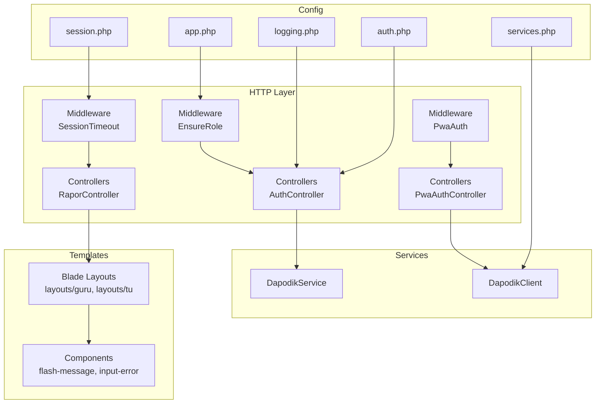
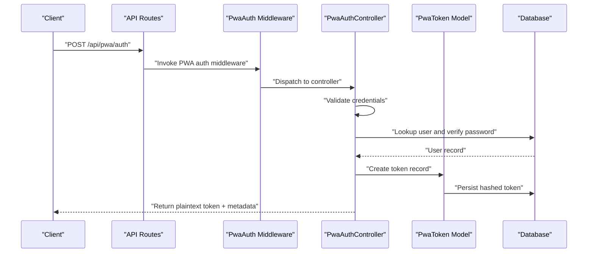
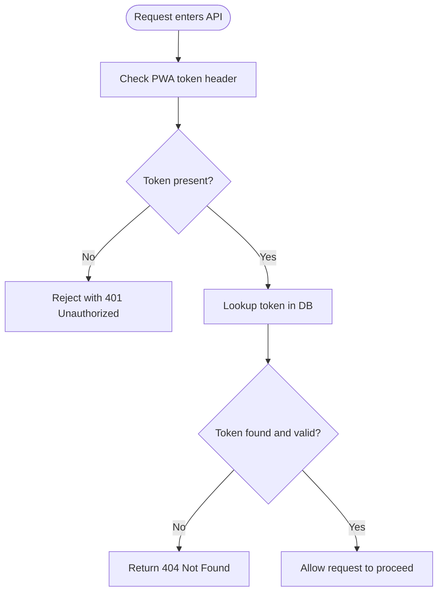
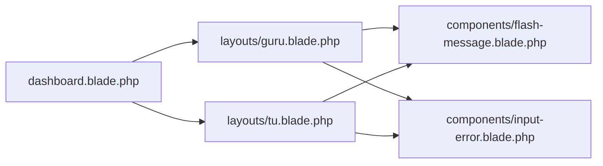
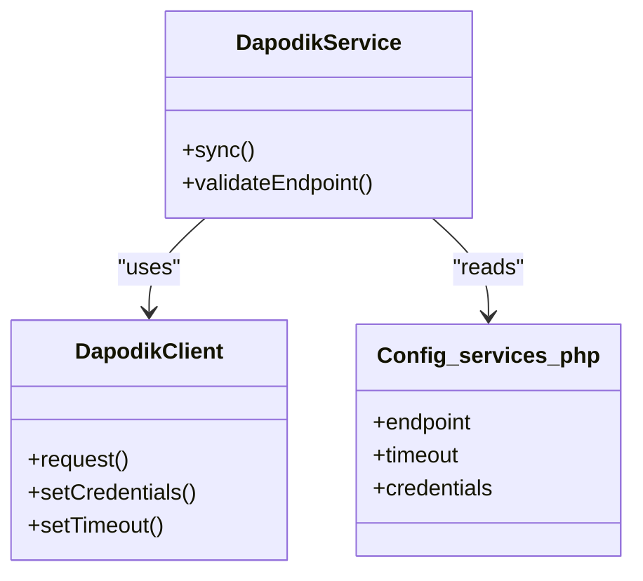
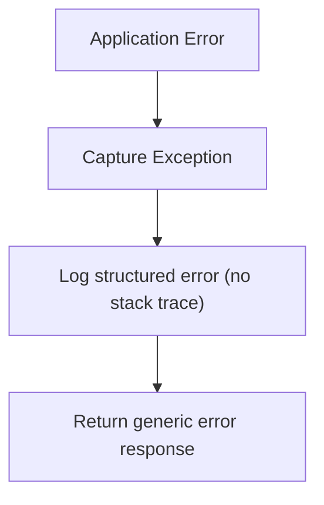
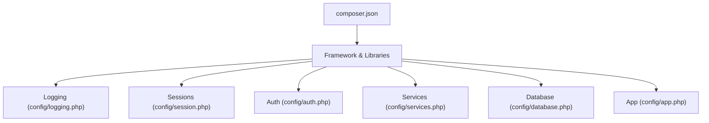

# Code Security Practices

<cite>
**Referenced Files in This Document**
- [README.md](file://README.md)
- [composer.json](file://composer.json)
- [config/app.php](file://config/app.php)
- [config/logging.php](file://config/logging.php)
- [config/cache.php](file://config/cache.php)
- [config/session.php](file://config/session.php)
- [config/auth.php](file://config/auth.php)
- [config/services.php](file://config/services.php)
- [config/database.php](file://config/database.php)
- [routes/web.php](file://routes/web.php)
- [routes/api.php](file://routes/api.php)
- [app/Http/Middleware/EnsureRole.php](file://app/Http/Middleware/EnsureRole.php)
- [app/Http/Middleware/PwaAuth.php](file://app/Http/Middleware/PwaAuth.php)
- [app/Http/Middleware/SessionTimeout.php](file://app/Http/Middleware/SessionTimeout.php)
- [app/Http/Controllers/Api/V1/AuthController.php](file://app/Http/Controllers/Api/V1/AuthController.php)
- [app/Http/Controllers/Api/PwaAuthController.php](file://app/Http/Controllers/Api/PwaAuthController.php)
- [app/Http/Controllers/RaporController.php](file://app/Http/Controllers/RaporController.php)
- [app/Services/DapodikService.php](file://app/Services/DapodikService.php)
- [app/Services/Dapodik/DapodikClient.php](file://app/Services/Dapodik/DapodikClient.php)
- [app/Models/User.php](file://app/Models/User.php)
- [app/Models/PwaToken.php](file://app/Models/PwaToken.php)
- [app/View/Components/AppLayout.php](file://app/View/Components/AppLayout.php)
- [app/View/Components/GuestLayout.php](file://app/View/Components/GuestLayout.php)
- [resources/views/components/flash-message.blade.php](file://resources/views/components/flash-message.blade.php)
- [resources/views/components/input-error.blade.php](file://resources/views/components/input-error.blade.php)
- [resources/views/layouts/guru.blade.php](file://resources/views/layouts/guru.blade.php)
- [resources/views/layouts/tu.blade.php](file://resources/views/layouts/tu.blade.php)
- [resources/views/dashboard.blade.php](file://resources/views/dashboard.blade.php)
- [storage/logs](file://storage/logs)
- [tests/Feature/Api/V1](file://tests/Feature/Api/V1)
- [tests/Feature/Auth](file://tests/Feature/Auth)
- [skills/security-and-hardening/SKILL.md](file://skills/security-and-hardening/SKILL.md)
</cite>

## Table of Contents
1. [Introduction](#introduction)
2. [Project Structure](#project-structure)
3. [Core Components](#core-components)
4. [Architecture Overview](#architecture-overview)
5. [Detailed Component Analysis](#detailed-component-analysis)
6. [Dependency Analysis](#dependency-analysis)
7. [Performance Considerations](#performance-considerations)
8. [Troubleshooting Guide](#troubleshooting-guide)
9. [Conclusion](#conclusion)
10. [Appendices](#appendices)

## Introduction
This document defines code security practices for RaporKM Laravel development. It consolidates secure coding standards, vulnerability prevention techniques, defensive programming practices, and operational controls for dependency management, secure template usage, logging, error handling, third-party integrations, and continuous security monitoring. The guidance is grounded in the repository’s configuration, middleware, controllers, services, and existing skill documentation.

## Project Structure
RaporKM follows a standard Laravel MVC structure with dedicated areas for HTTP controllers, middleware, services, Livewire components, Blade templates, and configuration. Security-relevant areas include:
- Authentication and authorization middleware and controllers
- API routes and request validation
- Services interacting with external systems
- Blade templates and view components
- Logging and environment configuration

**Diagram sources**
- [routes/web.php](file://routes/web.php)
- [routes/api.php](file://routes/api.php)
- [app/Http/Middleware/EnsureRole.php](file://app/Http/Middleware/EnsureRole.php)
- [app/Http/Middleware/PwaAuth.php](file://app/Http/Middleware/PwaAuth.php)
- [app/Http/Middleware/SessionTimeout.php](file://app/Http/Middleware/SessionTimeout.php)
- [app/Http/Controllers/Api/V1/AuthController.php](file://app/Http/Controllers/Api/V1/AuthController.php)
- [app/Http/Controllers/Api/PwaAuthController.php](file://app/Http/Controllers/Api/PwaAuthController.php)
- [app/Http/Controllers/RaporController.php](file://app/Http/Controllers/RaporController.php)
- [app/Services/DapodikService.php](file://app/Services/DapodikService.php)
- [app/Services/Dapodik/DapodikClient.php](file://app/Services/Dapodik/DapodikClient.php)
- [resources/views/layouts/guru.blade.php](file://resources/views/layouts/guru.blade.php)
- [resources/views/layouts/tu.blade.php](file://resources/views/layouts/tu.blade.php)
- [resources/views/components/flash-message.blade.php](file://resources/views/components/flash-message.blade.php)
- [resources/views/components/input-error.blade.php](file://resources/views/components/input-error.blade.php)
- [config/app.php](file://config/app.php)
- [config/logging.php](file://config/logging.php)
- [config/session.php](file://config/session.php)
- [config/auth.php](file://config/auth.php)
- [config/services.php](file://config/services.php)

**Section sources**
- [routes/web.php](file://routes/web.php)
- [routes/api.php](file://routes/api.php)
- [config/app.php](file://config/app.php)
- [config/logging.php](file://config/logging.php)
- [config/session.php](file://config/session.php)
- [config/auth.php](file://config/auth.php)
- [config/services.php](file://config/services.php)

## Core Components
- Authentication and authorization:
  - Role enforcement middleware ensures access control per user roles.
  - API authentication controller validates credentials and manages tokens.
  - PWA authentication controller handles token generation, validation, and refresh for Progressive Web App clients.
- Secure session management:
  - Session timeout middleware enforces session lifecycle policies.
- External integrations:
  - Dapodik service and client encapsulate remote API interactions with configurable timeouts and error handling.
- Template and view security:
  - Blade layouts and components provide consistent rendering and safe output encoding.
- Logging and error handling:
  - Centralized logging configuration supports structured logs and controlled verbosity.
- Environment and secrets:
  - Configuration files define application behavior, database connections, and third-party service endpoints.

**Section sources**
- [app/Http/Middleware/EnsureRole.php](file://app/Http/Middleware/EnsureRole.php)
- [app/Http/Middleware/PwaAuth.php](file://app/Http/Middleware/PwaAuth.php)
- [app/Http/Middleware/SessionTimeout.php](file://app/Http/Middleware/SessionTimeout.php)
- [app/Http/Controllers/Api/V1/AuthController.php](file://app/Http/Controllers/Api/V1/AuthController.php)
- [app/Http/Controllers/Api/PwaAuthController.php](file://app/Http/Controllers/Api/PwaAuthController.php)
- [app/Services/DapodikService.php](file://app/Services/DapodikService.php)
- [app/Services/Dapodik/DapodikClient.php](file://app/Services/Dapodik/DapodikClient.php)
- [resources/views/layouts/guru.blade.php](file://resources/views/layouts/guru.blade.php)
- [resources/views/layouts/tu.blade.php](file://resources/views/layouts/tu.blade.php)
- [config/logging.php](file://config/logging.php)
- [config/session.php](file://config/session.php)
- [config/auth.php](file://config/auth.php)

## Architecture Overview
The system separates concerns across HTTP middleware, controllers, services, and views. Security is enforced at multiple layers:
- Transport and identity: HTTPS and session/token policies
- Authorization: role-based access control
- Input validation: request validation and sanitization
- Output encoding: Blade auto-escaping and component-safe rendering
- External communications: service-layer abstraction with timeouts and error handling

**Diagram sources**
- [routes/api.php](file://routes/api.php)
- [app/Http/Middleware/PwaAuth.php](file://app/Http/Middleware/PwaAuth.php)
- [app/Http/Controllers/Api/PwaAuthController.php](file://app/Http/Controllers/Api/PwaAuthController.php)
- [app/Models/PwaToken.php](file://app/Models/PwaToken.php)

## Detailed Component Analysis

### Authentication and Authorization Controls
- Role enforcement middleware:
  - Validates user roles before allowing access to protected routes.
- API authentication controller:
  - Implements credential validation and secure token issuance.
- PWA authentication controller:
  - Manages token lifecycle, validation via header, and refresh mechanisms.
- Session timeout middleware:
  - Enforces session expiration policies to reduce long-lived session risks.

**Diagram sources**
- [app/Http/Middleware/PwaAuth.php](file://app/Http/Middleware/PwaAuth.php)
- [app/Http/Controllers/Api/PwaAuthController.php](file://app/Http/Controllers/Api/PwaAuthController.php)
- [app/Models/PwaToken.php](file://app/Models/PwaToken.php)

**Section sources**
- [app/Http/Middleware/EnsureRole.php](file://app/Http/Middleware/EnsureRole.php)
- [app/Http/Middleware/PwaAuth.php](file://app/Http/Middleware/PwaAuth.php)
- [app/Http/Middleware/SessionTimeout.php](file://app/Http/Middleware/SessionTimeout.php)
- [app/Http/Controllers/Api/V1/AuthController.php](file://app/Http/Controllers/Api/V1/AuthController.php)
- [app/Http/Controllers/Api/PwaAuthController.php](file://app/Http/Controllers/Api/PwaAuthController.php)

### Secure Template Usage and View Rendering Safety
- Blade layouts:
  - Centralized layouts for roles ensure consistent markup and security posture.
- Components:
  - Flash messages and input errors are rendered via Blade components, leveraging auto-escaping.
- Safe output:
  - Blade auto-escapes variables by default; avoid raw output unless explicitly sanitized.

**Diagram sources**
- [resources/views/layouts/guru.blade.php](file://resources/views/layouts/guru.blade.php)
- [resources/views/layouts/tu.blade.php](file://resources/views/layouts/tu.blade.php)
- [resources/views/components/flash-message.blade.php](file://resources/views/components/flash-message.blade.php)
- [resources/views/components/input-error.blade.php](file://resources/views/components/input-error.blade.php)
- [resources/views/dashboard.blade.php](file://resources/views/dashboard.blade.php)

**Section sources**
- [resources/views/layouts/guru.blade.php](file://resources/views/layouts/guru.blade.php)
- [resources/views/layouts/tu.blade.php](file://resources/views/layouts/tu.blade.php)
- [resources/views/components/flash-message.blade.php](file://resources/views/components/flash-message.blade.php)
- [resources/views/components/input-error.blade.php](file://resources/views/components/input-error.blade.php)
- [resources/views/dashboard.blade.php](file://resources/views/dashboard.blade.php)

### Secure Third-Party Integrations and API Key Management
- Dapodik service and client:
  - Encapsulate remote API interactions with timeouts and error handling.
- Configuration:
  - Service endpoints and credentials are managed via configuration files.
- Best practices:
  - Store secrets in environment variables, avoid hardcoding credentials.
  - Use HTTPS for all external communications.
  - Implement retries with exponential backoff and circuit breaker patterns where appropriate.

**Diagram sources**
- [app/Services/DapodikService.php](file://app/Services/DapodikService.php)
- [app/Services/Dapodik/DapodikClient.php](file://app/Services/Dapodik/DapodikClient.php)
- [config/services.php](file://config/services.php)

**Section sources**
- [app/Services/DapodikService.php](file://app/Services/DapodikService.php)
- [app/Services/Dapodik/DapodikClient.php](file://app/Services/Dapodik/DapodikClient.php)
- [config/services.php](file://config/services.php)

### Logging Security and Error Handling Without Information Disclosure
- Centralized logging configuration:
  - Define log channels, levels, and handlers.
- Error handling:
  - Avoid exposing stack traces or internal details to clients.
  - Return generic error messages while logging detailed diagnostics internally.

**Diagram sources**
- [config/logging.php](file://config/logging.php)
- [storage/logs](file://storage/logs)

**Section sources**
- [config/logging.php](file://config/logging.php)
- [storage/logs](file://storage/logs)

### Dependency Management, Security Updates, and Vulnerable Package Monitoring
- Composer dependencies:
  - Track PHP packages and versions in composer.json.
- Audit and update:
  - Regularly run dependency audits and apply security patches.
- Secrets management:
  - Keep secrets out of version control; use environment variables and configuration files.

**Section sources**
- [composer.json](file://composer.json)
- [skills/security-and-hardening/SKILL.md](file://skills/security-and-hardening/SKILL.md)

### Defensive Programming Practices
- Input validation:
  - Validate and sanitize all external inputs at the boundary.
- Output encoding:
  - Rely on framework auto-escaping; avoid bypassing it.
- Least privilege:
  - Enforce authorization checks on every protected endpoint.
- Secure defaults:
  - Configure HTTPS, security headers, and strict session policies.

**Section sources**
- [skills/security-and-hardening/SKILL.md](file://skills/security-and-hardening/SKILL.md)

### Memory Management, Resource Cleanup, and Secure Disposal
- Temporary files:
  - Use framework-managed temporary storage for short-lived artifacts.
- Sessions:
  - Clear session data upon logout or timeout.
- External resources:
  - Close connections and dispose of resources after use.

**Section sources**
- [config/session.php](file://config/session.php)
- [storage/framework/sessions](file://storage/framework/sessions)

### Continuous Security Monitoring and Code Review
- Static analysis:
  - Integrate static analysis tools into CI/CD pipelines.
- Automated scanning:
  - Run dependency and secret scans on every build.
- Code review checklist:
  - Use the security and hardening skill as a reference for review criteria.

**Section sources**
- [skills/security-and-hardening/SKILL.md](file://skills/security-and-hardening/SKILL.md)

## Dependency Analysis
This section maps security-relevant dependencies and their configuration surfaces.

**Diagram sources**
- [composer.json](file://composer.json)
- [config/logging.php](file://config/logging.php)
- [config/session.php](file://config/session.php)
- [config/auth.php](file://config/auth.php)
- [config/services.php](file://config/services.php)
- [config/database.php](file://config/database.php)
- [config/app.php](file://config/app.php)

**Section sources**
- [composer.json](file://composer.json)
- [config/logging.php](file://config/logging.php)
- [config/session.php](file://config/session.php)
- [config/auth.php](file://config/auth.php)
- [config/services.php](file://config/services.php)
- [config/database.php](file://config/database.php)
- [config/app.php](file://config/app.php)

## Performance Considerations
- Prefer parameterized queries and prepared statements to mitigate injection risks and improve performance predictability.
- Use caching judiciously and ensure cache invalidation does not leak sensitive data.
- Limit logging verbosity in production to reduce I/O overhead.

## Troubleshooting Guide
- Authentication failures:
  - Verify token presence and validity in headers; confirm token records and expiration.
- Session issues:
  - Confirm session configuration and timeout policies.
- External integration errors:
  - Inspect service configuration, network connectivity, and retry policies.
- Logging problems:
  - Check log channel configuration and file permissions.

**Section sources**
- [app/Http/Middleware/PwaAuth.php](file://app/Http/Middleware/PwaAuth.php)
- [app/Http/Controllers/Api/PwaAuthController.php](file://app/Http/Controllers/Api/PwaAuthController.php)
- [app/Http/Middleware/SessionTimeout.php](file://app/Http/Middleware/SessionTimeout.php)
- [config/services.php](file://config/services.php)
- [config/logging.php](file://config/logging.php)

## Conclusion
RaporKM’s security posture relies on layered controls: robust authentication and authorization, secure session management, safe template rendering, disciplined logging, and secure external integrations. By adhering to the practices outlined here—input validation, least privilege, secure defaults, continuous monitoring, and responsible dependency management—the project can maintain a strong and resilient security position.

## Appendices
- Reference materials and guidelines are available in the security and hardening skill documentation.

**Section sources**
- [skills/security-and-hardening/SKILL.md](file://skills/security-and-hardening/SKILL.md)