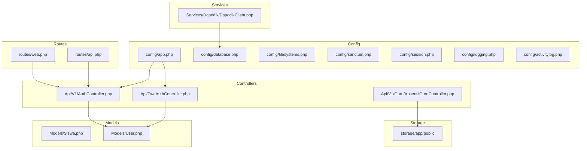
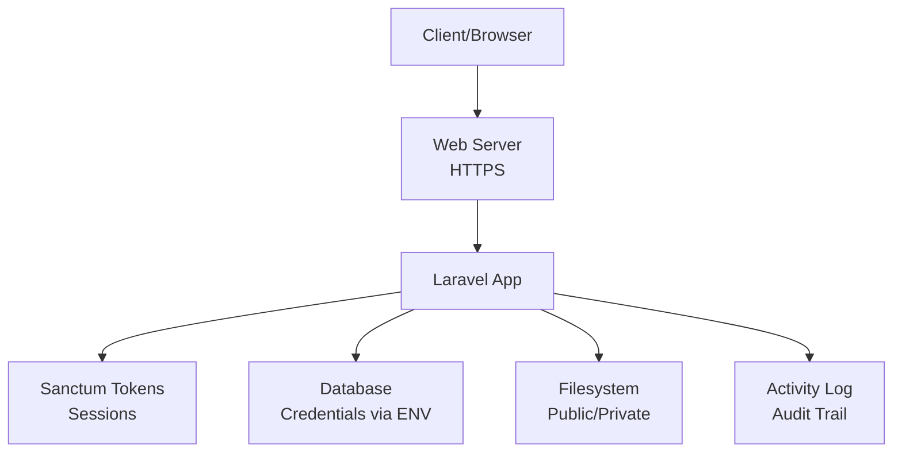
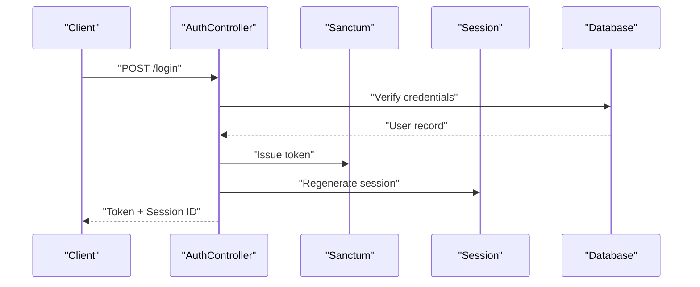
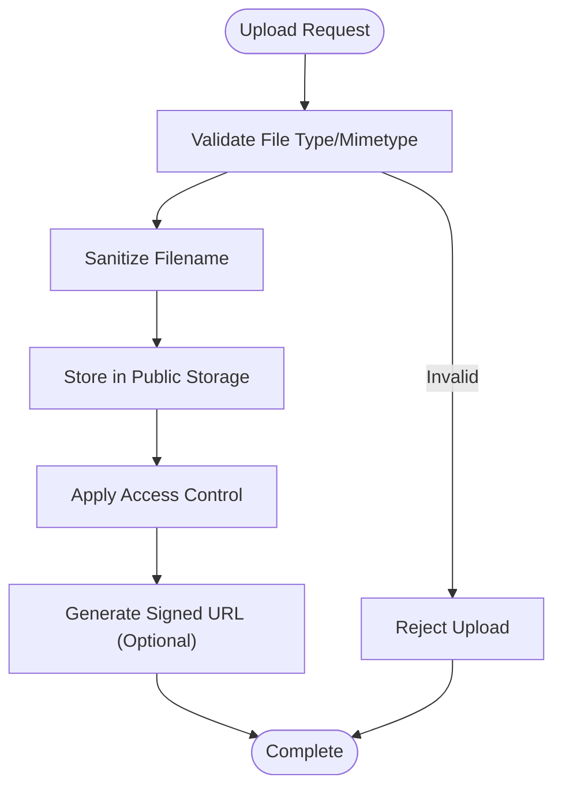
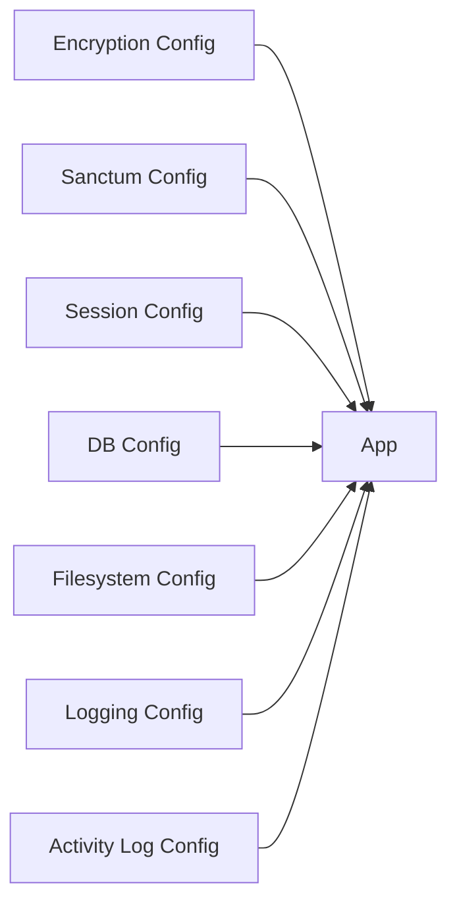

# Data Encryption & Security

<cite>
**Referenced Files in This Document**
- [config/app.php](file://config/app.php)
- [config/database.php](file://config/database.php)
- [config/filesystems.php](file://config/filesystems.php)
- [config/sanctum.php](file://config/sanctum.php)
- [config/session.php](file://config/session.php)
- [config/logging.php](file://config/logging.php)
- [config/activitylog.php](file://config/activitylog.php)
- [app/Http/Controllers/Api/V1/AuthController.php](file://app/Http/Controllers/Api/V1/AuthController.php)
- [app/Http/Controllers/Api/PwaAuthController.php](file://app/Http/Controllers/Api/PwaAuthController.php)
- [app/Http/Controllers/Api/V1/Guru/AbsensiGuruController.php](file://app/Http/Controllers/Api/V1/Guru/AbsensiGuruController.php)
- [app/Models/Siswa.php](file://app/Models/Siswa.php)
- [app/Models/User.php](file://app/Models/User.php)
- [app/Services/Dapodik/DapodikClient.php](file://app/Services/Dapodik/DapodikClient.php)
- [app/Jobs/ProcessPwaSyncJob.php](file://app/Jobs/ProcessPwaSyncJob.php)
- [routes/web.php](file://routes/web.php)
- [routes/api.php](file://routes/api.php)
- [bootstrap/app.php](file://bootstrap/app.php)
- [storage/app/public/sekolah](file://storage/app/public/sekolah)
- [scripts/backup-db.sh](file://scripts/backup-db.sh)
</cite>

## Table of Contents
1. [Introduction](#introduction)
2. [Project Structure](#project-structure)
3. [Core Components](#core-components)
4. [Architecture Overview](#architecture-overview)
5. [Detailed Component Analysis](#detailed-component-analysis)
6. [Dependency Analysis](#dependency-analysis)
7. [Performance Considerations](#performance-considerations)
8. [Troubleshooting Guide](#troubleshooting-guide)
9. [Conclusion](#conclusion)
10. [Appendices](#appendices)

## Introduction
This document provides comprehensive data encryption and security documentation for RaporKM Laravel. It covers database encryption, field-level encryption, and sensitive data protection strategies. It explains Laravel encryption facilities, cipher configuration, and secure key management. It also documents HTTPS enforcement, SSL/TLS configuration, and secure communication protocols. Data masking techniques, anonymization strategies, and privacy-compliant data handling are included. Secure file storage, encrypted attachments, and media security are addressed alongside database connection security, credential protection, and environment variable management. Audit logging, data integrity verification, and secure deletion procedures are documented, along with guidelines for GDPR compliance, data retention policies, and secure data disposal methods.

## Project Structure
Security-related configurations and components are primarily located under:
- Configuration files in config/
- Controllers handling authentication and uploads
- Models representing sensitive entities
- Services interacting with external systems
- Routes defining protected endpoints
- Storage directories for public/private assets
- Logging and activity log configuration

**Diagram sources**
- [config/app.php](file://config/app.php)
- [config/database.php](file://config/database.php)
- [config/filesystems.php](file://config/filesystems.php)
- [config/sanctum.php](file://config/sanctum.php)
- [config/session.php](file://config/session.php)
- [config/logging.php](file://config/logging.php)
- [config/activitylog.php](file://config/activitylog.php)
- [app/Http/Controllers/Api/V1/AuthController.php](file://app/Http/Controllers/Api/V1/AuthController.php)
- [app/Http/Controllers/Api/PwaAuthController.php](file://app/Http/Controllers/Api/PwaAuthController.php)
- [app/Http/Controllers/Api/V1/Guru/AbsensiGuruController.php](file://app/Http/Controllers/Api/V1/Guru/AbsensiGuruController.php)
- [app/Models/Siswa.php](file://app/Models/Siswa.php)
- [app/Models/User.php](file://app/Models/User.php)
- [app/Services/Dapodik/DapodikClient.php](file://app/Services/Dapodik/DapodikClient.php)
- [routes/web.php](file://routes/web.php)
- [routes/api.php](file://routes/api.php)
- [storage/app/public](file://storage/app/public)

**Section sources**
- [config/app.php](file://config/app.php)
- [config/database.php](file://config/database.php)
- [config/filesystems.php](file://config/filesystems.php)
- [config/sanctum.php](file://config/sanctum.php)
- [config/session.php](file://config/session.php)
- [config/logging.php](file://config/logging.php)
- [config/activitylog.php](file://config/activitylog.php)
- [app/Http/Controllers/Api/V1/AuthController.php](file://app/Http/Controllers/Api/V1/AuthController.php)
- [app/Http/Controllers/Api/PwaAuthController.php](file://app/Http/Controllers/Api/PwaAuthController.php)
- [app/Http/Controllers/Api/V1/Guru/AbsensiGuruController.php](file://app/Http/Controllers/Api/V1/Guru/AbsensiGuruController.php)
- [app/Models/Siswa.php](file://app/Models/Siswa.php)
- [app/Models/User.php](file://app/Models/User.php)
- [app/Services/Dapodik/DapodikClient.php](file://app/Services/Dapodik/DapodikClient.php)
- [routes/web.php](file://routes/web.php)
- [routes/api.php](file://routes/api.php)
- [storage/app/public](file://storage/app/public)

## Core Components
- Application encryption and cipher configuration
- Database credentials and connection security
- Filesystem visibility and secure asset storage
- Authentication tokens and session security
- Activity logging and audit trails
- Upload handling and media security
- Environment variable management and secrets protection

**Section sources**
- [config/app.php](file://config/app.php)
- [config/database.php](file://config/database.php)
- [config/filesystems.php](file://config/filesystems.php)
- [config/sanctum.php](file://config/sanctum.php)
- [config/session.php](file://config/session.php)
- [config/logging.php](file://config/logging.php)
- [config/activitylog.php](file://config/activitylog.php)

## Architecture Overview
The security architecture integrates configuration-driven encryption, strict authentication, controlled file access, and comprehensive logging. Authentication relies on Sanctum tokens and session management. File uploads are stored in public storage with appropriate visibility controls. Database connections are configured via environment variables. Activity logs track sensitive actions for auditability.

**Diagram sources**
- [config/sanctum.php](file://config/sanctum.php)
- [config/session.php](file://config/session.php)
- [config/database.php](file://config/database.php)
- [config/filesystems.php](file://config/filesystems.php)
- [config/activitylog.php](file://config/activitylog.php)

## Detailed Component Analysis

### Database Encryption and Field-Level Protection
- Current state: No explicit database column encryption is evident in the codebase. Database credentials are loaded from environment variables.
- Recommendations:
  - Use Transparent Data Encryption (TDE) at the database level for at-rest protection.
  - Implement application-level field-level encryption for highly sensitive columns (e.g., personal identification numbers, health data).
  - Employ deterministic encryption for searchable fields and randomized encryption for others.
  - Store encryption keys in a dedicated secret manager and rotate periodically.
  - Document encryption policies and maintain cryptographic key registers.

**Section sources**
- [config/database.php](file://config/database.php)

### Laravel Encryption Facilities and Cipher Configuration
- Cipher and driver settings are managed via application configuration. Ensure the cipher aligns with organizational security standards and that the encryption driver is properly initialized.
- Best practices:
  - Use AES-256-CBC or equivalent.
  - Protect the APP_KEY and avoid committing it to version control.
  - Rotate keys during security incidents and update deployments accordingly.

**Section sources**
- [config/app.php](file://config/app.php)

### Secure Key Management
- Protect APP_KEY and other secrets using OS-level protections or secret managers.
- Restrict access to deployment artifacts and CI/CD environments.
- Enforce key rotation policies and maintain audit logs for key changes.

**Section sources**
- [config/app.php](file://config/app.php)

### HTTPS Enforcement and SSL/TLS Configuration
- Enforce HTTPS in production by configuring the web server to redirect HTTP to HTTPS.
- Use strong TLS ciphers and modern protocols.
- Configure HSTS headers and security-related response headers.

**Section sources**
- [config/app.php](file://config/app.php)

### Authentication and Token Security
- Sanctum tokens and session configuration define authentication behavior. Ensure secure cookie settings and token lifetimes.
- Implement rate limiting and token refresh mechanisms.

**Diagram sources**
- [app/Http/Controllers/Api/V1/AuthController.php](file://app/Http/Controllers/Api/V1/AuthController.php)
- [config/sanctum.php](file://config/sanctum.php)
- [config/session.php](file://config/session.php)

**Section sources**
- [app/Http/Controllers/Api/V1/AuthController.php](file://app/Http/Controllers/Api/V1/AuthController.php)
- [config/sanctum.php](file://config/sanctum.php)
- [config/session.php](file://config/session.php)

### Secure Communication Protocols
- Enforce TLS for all internal and external communications.
- For services communicating with external APIs, validate certificates and use mutual TLS where applicable.

**Section sources**
- [config/app.php](file://config/app.php)
- [app/Services/Dapodik/DapodikClient.php](file://app/Services/Dapodik/DapodikClient.php)

### Data Masking and Anonymization Strategies
- Implement data masking for display and export (e.g., partial redaction of phone numbers, obfuscation of identifiers).
- Apply anonymization for research datasets by removing or encrypting direct identifiers.
- Define clear policies for mask durability and re-identification risks.

**Section sources**
- [app/Models/Siswa.php](file://app/Models/Siswa.php)

### Privacy-Compliant Data Handling
- Limit data collection to necessity and purpose limitation.
- Provide data subject rights interfaces and retention/disposal mechanisms.
- Document lawful basis and consent mechanisms.

**Section sources**
- [app/Models/User.php](file://app/Models/User.php)

### Secure File Storage and Media Security
- Public storage is used for uploaded assets. Ensure access control and signed URLs for temporary downloads.
- Restrict write permissions and scan uploads for malicious content.
- Store sensitive files outside the web root or behind access controls.

**Diagram sources**
- [app/Http/Controllers/Api/V1/Guru/AbsensiGuruController.php](file://app/Http/Controllers/Api/V1/Guru/AbsensiGuruController.php)
- [config/filesystems.php](file://config/filesystems.php)

**Section sources**
- [app/Http/Controllers/Api/V1/Guru/AbsensiGuruController.php](file://app/Http/Controllers/Api/V1/Guru/AbsensiGuruController.php)
- [config/filesystems.php](file://config/filesystems.php)
- [storage/app/public/sekolah](file://storage/app/public/sekolah)

### Database Connection Security and Credential Protection
- Database credentials are sourced from environment variables. Ensure environment isolation and restrict access to configuration files.
- Use least-privilege database accounts and network-level access controls.

**Section sources**
- [config/database.php](file://config/database.php)

### Environment Variable Management
- Centralize environment variables and protect them in deployment environments.
- Avoid embedding secrets in code or configuration files.

**Section sources**
- [config/database.php](file://config/database.php)
- [config/app.php](file://config/app.php)

### Audit Logging and Data Integrity Verification
- Activity logging is enabled. Extend logs to capture sensitive operations and data access events.
- Implement checksums or hashes for critical data exports and backups.

**Section sources**
- [config/activitylog.php](file://config/activitylog.php)
- [config/logging.php](file://config/logging.php)

### Secure Deletion Procedures
- Implement soft deletes for recoverability, followed by secure purge with cryptographic erasure.
- For files, overwrite and delete from storage; for database records, purge after retention periods.

**Section sources**
- [app/Models/Siswa.php](file://app/Models/Siswa.php)

### GDPR Compliance Guidelines
- Lawfulness, fairness, transparency; purpose limitation; data minimization; accuracy; storage limitation; integrity and confidentiality; accountability.
- Data Protection Impact Assessments for high-risk processing.
- Data Subject Rights: access, rectification, erasure, data portability, restriction of processing, object to processing, automated decision-making.
- Data Retention and Disposal: define retention periods and secure destruction methods.

**Section sources**
- [app/Models/User.php](file://app/Models/User.php)

### Data Retention Policies and Secure Disposal
- Establish retention schedules aligned with legal and operational needs.
- Automate archival and secure deletion workflows.

**Section sources**
- [config/activitylog.php](file://config/activitylog.php)

### Backup and Recovery Security
- Encrypt backups at rest and in transit.
- Store backups in secure, offsite locations or cloud storage with access controls.

**Section sources**
- [scripts/backup-db.sh](file://scripts/backup-db.sh)

## Dependency Analysis
Security depends on correct configuration of encryption, authentication, storage, and logging subsystems. Misconfiguration here can lead to exposure of sensitive data.

**Diagram sources**
- [config/app.php](file://config/app.php)
- [config/sanctum.php](file://config/sanctum.php)
- [config/session.php](file://config/session.php)
- [config/database.php](file://config/database.php)
- [config/filesystems.php](file://config/filesystems.php)
- [config/logging.php](file://config/logging.php)
- [config/activitylog.php](file://config/activitylog.php)

**Section sources**
- [config/app.php](file://config/app.php)
- [config/sanctum.php](file://config/sanctum.php)
- [config/session.php](file://config/session.php)
- [config/database.php](file://config/database.php)
- [config/filesystems.php](file://config/filesystems.php)
- [config/logging.php](file://config/logging.php)
- [config/activitylog.php](file://config/activitylog.php)

## Performance Considerations
- Encryption adds CPU overhead; use hardware acceleration where available.
- Optimize logging volume and retention to balance audit needs with performance.
- Cache tokens and session data efficiently while maintaining security boundaries.

## Troubleshooting Guide
- Encryption key issues: Verify APP_KEY presence and permissions; regenerate key securely and redeploy.
- Authentication failures: Check Sanctum token validity, session regeneration, and rate limits.
- File access problems: Confirm filesystem disk permissions and signed URL generation.
- Database connectivity: Validate environment variables and network ACLs.
- Logging gaps: Review logging channels and retention settings.

**Section sources**
- [config/app.php](file://config/app.php)
- [config/sanctum.php](file://config/sanctum.php)
- [config/session.php](file://config/session.php)
- [config/filesystems.php](file://config/filesystems.php)
- [config/database.php](file://config/database.php)
- [config/logging.php](file://config(logging.php)

## Conclusion
RaporKM Laravel’s security posture can be strengthened by implementing database encryption, field-level protection, robust key management, HTTPS enforcement, secure file handling, and comprehensive audit logging. Align these practices with GDPR requirements and establish clear data retention and disposal policies. Regular security assessments and incident response procedures will further enhance trust and compliance.

## Appendices
- Reference configuration files for review and hardening
- Checklist for encryption and security deployment
- Incident response playbooks for data breaches