# Input Validation & Sanitization

<cite>
**Referenced Files in This Document**
- [FormRequest.php](file://vendor/laravel/framework/src/Illuminate/Foundation/Http/FormRequest.php)
- [validation.md](file://.agents/skills/laravel-best-practices/rules/validation.md)
- [validation.md](file://.claude/skills/laravel-best-practices/rules/validation.md)
- [validation.md](file://.kiro/skills/laravel-best-practices/rules/validation.md)
- [security-and-hardening.md](file://skills/security-and-hardening/SKILL.md)
- [api-and-interface-design.md](file://skills/api-and-interface-design/SKILL.md)
- [PwaAuthController.php](file://app/Http/Controllers/Api/PwaAuthController.php)
- [PwaPushController.php](file://app/Http/Controllers/Api/PwaPushController.php)
- [PwaSyncController.php](file://app/Http/Controllers/Api/PwaSyncController.php)
- [V1\AuthController.php](file://app/Http/Controllers/Api/V1/AuthController.php)
- [AbsensiGuruController.php](file://app/Http/Controllers/Api/V1/Guru/AbsensiGuruController.php)
- [web.php](file://routes/web.php)
- [api.php](file://routes/api.php)
- [app.php](file://bootstrap/app.php)
- [Sanctum.php](file://config/sanctum.php)
- [dompdf.php](file://config/dompdf.php)
- [ExportService.php](file://app/Services/ExportService.php)
- [ImportService.php](file://app/Services/ImportService.php)
- [GuruMenuService.php](file://app/Services/GuruMenuService.php)
- [NilaiService.php](file://app/Services/NilaiService.php)
- [RaporService.php](file://app/Services/RaporService.php)
- [DapodikService.php](file://app/Services/DapodikService.php)
- [DapodikClient.php](file://app/Services/Dapodik/DapodikClient.php)
- [DapodikSiswaSyncService.php](file://app/Services/Dapodik/SiswaSyncService.php)
- [DapodikGtkSyncService.php](file://app/Services/Dapodik/GtkSyncService.php)
- [DapodikSekolahSyncService.php](file://app/Services/Dapodik/SekolahSyncService.php)
- [DapodikPembelajaranSyncService.php](file://app/Services/Dapodik/PembelajaranSyncService.php)
- [DapodikPenggunaSyncService.php](file://app/Services/Dapodik/PenggunaSyncService.php)
- [DapodikRombelSyncService.php](file://app/Services/Dapodik/RombelSyncService.php)
- [GpsValidationService.php](file://app/Services/GpsValidationService.php)
- [PwaToken.php](file://app/Models/PwaToken.php)
- [PushSubscription.php](file://app/Models/PushSubscription.php)
- [Siswa.php](file://app/Models/Siswa.php)
- [SiswaEskul.php](file://app/Models/SiswaEskul.php)
- [SiswaKelas.php](file://app/Models/SiswaKelas.php)
- [SiswaPrakerin.php](file://app/Models/SiswaPrakerin.php)
- [Presensi.php](file://app/Models/Presensi.php)
- [PresensiGuruTu.php](file://app/Models/PresensiGuruTu.php)
- [NilaiMapel.php](file://app/Models/NilaiMapel.php)
- [NilaiKelas.php](file://app/Models/NilaiKelas.php)
- [NilaiMataPelajaran.php](file://app/Models/NilaiMataPelajaran.php)
- [NilaiFormatif.php](file://app/Models/NilaiFormatif.php)
- [NilaiKokurikuler.php](file://app/Models/NilaiKokurikuler.php)
- [NilaiPrakerin.php](file://app/Models/NilaiPrakerin.php)
- [NilaiProyek.php](file://app/Models/NilaiProyek.php)
- [NilaiAssesmenSubelemen.php](file://app/Models/NilaiAssesmenSubelemen.php)
- [DeskripsiRapor.php](file://app/Models/DeskripsiRapor.php)
- [DeskripsiKokurikuler.php](file://app/Models/DeskripsiKokurikuler.php)
- [CatatanWali.php](file://app/Models/CatatanWali.php)
- [Prestasi.php](file://app/Models/Prestasi.php)
- [MutasiMasuk.php](file://app/Models/MutasiMasuk.php)
- [MutasiKeluar.php](file://app/Models/MutasiKeluar.php)
- [Lulusan.php](file://app/Models/Lulusan.php)
- [PembagianRaport.php](file://app/Models/PembagianRaport.php)
- [PembinaEskul.php](file://app/Models/PembinaEskul.php)
- [PiketHarian.php](file://app/Models/PiketHarian.php)
- [Organisasi.php](file://app/Models/Organisasi.php)
- [Eskul.php](file://app/Models/Eskul.php)
- [Prakerin.php](file://app/Models/Prakerin.php)
- [LaporanWa.php](file://app/Models/LaporanWa.php)
- [SuratMasuk.php](file://app/Models/SuratMasuk.php)
- [Pengingat.php](file://app/Models/Pengingat.php)
- [LagerNilaiMapel.php](file://app/Models/LagerNilaiMapel.php)
- [LagerNilaiMid.php](file://app/Models/LagerNilaiMid.php)
- [NilaiSumatifAs.php](file://app/Models/NilaiSumatifAs.php)
- [NilaiSumatifPh.php](file://app/Models/NilaiSumatifPh.php)
- [NilaiSumatifTs.php](file://app/Models/NilaiSumatifTs.php)
- [NilaiKelasMid.php](file://app/Models/NilaiKelasMid.php)
- [NilaiMapelMid.php](file://app/Models/NilaiMapelMid.php)
- [TujuanPembelajaran.php](file://app/Models/TujuanPembelajaran.php)
- [Elemen.php](file://app/Models/Elemen.php)
- [SubElemen.php](file://app/Models/SubElemen.php)
- [Dimensi.php](file://app/Models/Dimensi.php)
- [DimensiKokurikuler.php](file://app/Models/DimensiKokurikuler.php)
- [ProyekKelas.php](file://app/Models/ProyekKelas.php)
- [ProyekSubelemen.php](file://app/Services/ProyekSubelemen.php)
- [ProyekTema.php](file://app/Models/ProyekTema.php)
- [ProyekTujuan.php](file://app/Models/ProyekTujuan.php)
- [KepalaSekolah.php](file://app/Models/KepalaSekolah.php)
- [GuruMenuAkses.php](file://app/Models/GuruMenuAkses.php)
- [JenisAbsen.php](file://app/Models/JenisAbsen.php)
- [RefAgama.php](file://app/Models/RefAgama.php)
- [RefBulan.php](file://app/Models/RefBulan.php)
- [RefHari.php](file://app/Models/RefHari.php)
- [RefHubunganKeluarga.php](file://app/Models/RefHubunganKeluarga.php)
- [RefJabatan.php](file://app/Models/RefJabatan.php)
- [RefJenisKelamin.php](file://app/Models/RefJenisKelamin.php)
- [RefJenisKeluar.php](file://app/Models/RefJenisKeluar.php)
- [RefJenisSiswa.php](file://app/Models/RefJenisSiswa.php)
- [RefKepegawaian.php](file://app/Models/RefKepegawaian.php)
- [RefKurikulum.php](file://app/Models/RefKurikulum.php)
- [RefPendidikan.php](file://app/Models/RefPendidikan.php)
- [RefTugasTambahan.php](file://app/Models/RefTugasTambahan.php)
- [Sekolah.php](file://app/Models/Sekolah.php)
- [Kelas.php](file://app/Models/Kelas.php)
- [KelasWali.php](file://app/Models/KelasWali.php)
- [KelompokMapel.php](file://app/Models/KelompokMapel.php)
- [Mapel.php](file://app/Models/Mapel.php)
- [MapelKelas.php](file://app/Models/MapelKelas.php)
- [MapelSiswa.php](file://app/Models/MapelSiswa.php)
- [Ptk.php](file://app/Models/Ptk.php)
- [User.php](file://app/Models/User.php)
- [Setting.php](file://app/Models/Setting.php)
- [TahunPelajaran.php](file://app/Models/TahunPelajaran.php)
- [Semester.php](file://app/Models/Semester.php)
- [Tingkat.php](file://app/Models/Tingkat.php)
- [DapodikSyncLog.php](file://app/Models/DapodikSyncLog.php)
- [ActivityLog.php](file://app/Models/DapodikSyncLog.php)
- [RememberToken.php](file://app/Models/RememberToken.php)
- [PersonalAccessToken.php](file://app/Models/PersonalAccessToken.php)
- [PwaToken.php](file://app/Models/PwaToken.php)
- [PushSubscription.php](file://app/Models/PushSubscription.php)
- [PwaToken.php](file://app/Models/PwaToken.php)
- [PushSubscription.php](file://app/Models/PushSubscription.php)
</cite>

## Table of Contents
1. [Introduction](#introduction)
2. [Project Structure](#project-structure)
3. [Core Components](#core-components)
4. [Architecture Overview](#architecture-overview)
5. [Detailed Component Analysis](#detailed-component-analysis)
6. [Dependency Analysis](#dependency-analysis)
7. [Performance Considerations](#performance-considerations)
8. [Troubleshooting Guide](#troubleshooting-guide)
9. [Conclusion](#conclusion)
10. [Appendices](#appendices)

## Introduction
This document provides comprehensive input validation and sanitization guidance for RaporKM Laravel. It consolidates best practices for Laravel validation rules, custom validators, and data sanitization techniques, with a focus on request validation patterns, form request classes, parameter filtering, XSS prevention, SQL injection hardening, file upload safety, and API payload validation. It also covers error handling strategies, conditional validation, and secure handling of sensitive data.

## Project Structure
RaporKM leverages Laravel’s built-in validation and request handling mechanisms. Validation is primarily enforced at the boundaries (controllers and API endpoints), often via form request classes and direct request validation. Routes define the entry points for both web and API traffic, while middleware enforces role-based access and session timeouts. Services encapsulate business logic and interact with models, ensuring validated and sanitized data is persisted.

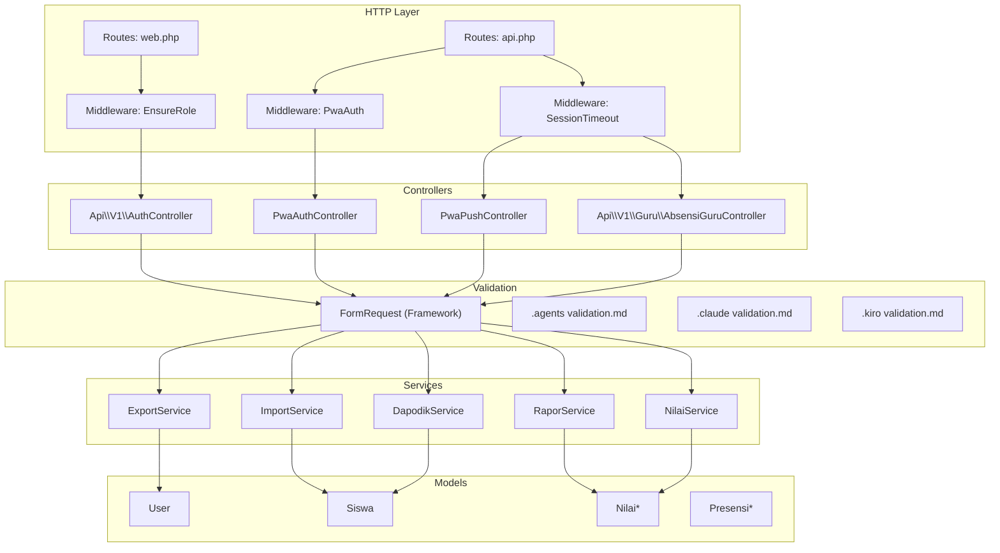

**Diagram sources**
- [web.php](file://routes/web.php)
- [api.php](file://routes/api.php)
- [EnsureRole.php](file://app/Http/Middleware/EnsureRole.php)
- [PwaAuth.php](file://app/Http/Middleware/PwaAuth.php)
- [SessionTimeout.php](file://app/Http/Middleware/SessionTimeout.php)
- [PwaAuthController.php](file://app/Http/Controllers/Api/PwaAuthController.php)
- [PwaPushController.php](file://app/Http/Controllers/Api/PwaPushController.php)
- [PwaSyncController.php](file://app/Http/Controllers/Api/PwaSyncController.php)
- [V1\AuthController.php](file://app/Http/Controllers/Api/V1/AuthController.php)
- [AbsensiGuruController.php](file://app/Http/Controllers/Api/V1/Guru/AbsensiGuruController.php)
- [FormRequest.php](file://vendor/laravel/framework/src/Illuminate/Foundation/Http/FormRequest.php)
- [validation.md](file://.agents/skills/laravel-best-practices/rules/validation.md)
- [validation.md](file://.claude/skills/laravel-best-practices/rules/validation.md)
- [validation.md](file://.kiro/skills/laravel-best-practices/rules/validation.md)
- [ExportService.php](file://app/Services/ExportService.php)
- [ImportService.php](file://app/Services/ImportService.php)
- [RaporService.php](file://app/Services/RaporService.php)
- [NilaiService.php](file://app/Services/NilaiService.php)
- [DapodikService.php](file://app/Services/DapodikService.php)

**Section sources**
- [web.php](file://routes/web.php)
- [api.php](file://routes/api.php)
- [PwaAuthController.php](file://app/Http/Controllers/Api/PwaAuthController.php)
- [PwaPushController.php](file://app/Http/Controllers/Api/PwaPushController.php)
- [PwaSyncController.php](file://app/Http/Controllers/Api/PwaSyncController.php)
- [V1\AuthController.php](file://app/Http/Controllers/Api/V1/AuthController.php)
- [AbsensiGuruController.php](file://app/Http/Controllers/Api/V1/Guru/AbsensiGuruController.php)

## Core Components
- Request validation boundaries: Controllers and API endpoints validate incoming data before processing.
- Form request classes: Encapsulate validation rules and custom logic for reuse and clarity.
- Parameter filtering: Use validated data only for persistence and downstream operations.
- Conditional validation: Apply rules based on request context or user roles.
- Error handling: Centralize validation errors and return structured responses.

**Section sources**
- [validation.md](file://.agents/skills/laravel-best-practices/rules/validation.md)
- [validation.md](file://.claude/skills/laravel-best-practices/rules/validation.md)
- [validation.md](file://.kiro/skills/laravel-best-practices/rules/validation.md)

## Architecture Overview
The validation architecture centers on the principle of validating at boundaries and using form request classes to enforce rules. Controllers receive validated data and delegate business logic to services. Middleware ensures authorized access and session integrity. Models persist validated data, and services coordinate complex operations.

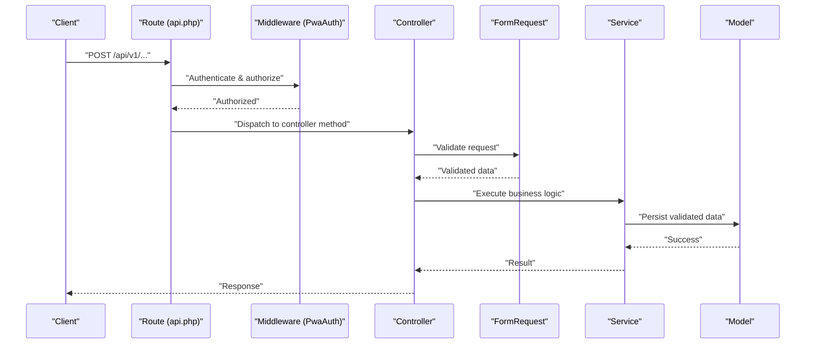

**Diagram sources**
- [api.php](file://routes/api.php)
- [PwaAuth.php](file://app/Http/Middleware/PwaAuth.php)
- [PwaAuthController.php](file://app/Http/Controllers/Api/PwaAuthController.php)
- [PwaPushController.php](file://app/Http/Controllers/Api/PwaPushController.php)
- [PwaSyncController.php](file://app/Http/Controllers/Api/PwaSyncController.php)
- [V1\AuthController.php](file://app/Http/Controllers/Api/V1/AuthController.php)
- [AbsensiGuruController.php](file://app/Http/Controllers/Api/V1/Guru/AbsensiGuruController.php)
- [FormRequest.php](file://vendor/laravel/framework/src/Illuminate/Foundation/Http/FormRequest.php)

## Detailed Component Analysis

### Request Validation Patterns and Form Request Classes
- Use form request classes to centralize validation rules and custom logic.
- Prefer array notation for rules and compose with Rule helpers for readability.
- Always use validated data for persistence; avoid using raw request payloads.
- Apply conditional validation using Rule::when based on request context.
- Use the after hook for multi-field validations that depend on model state.

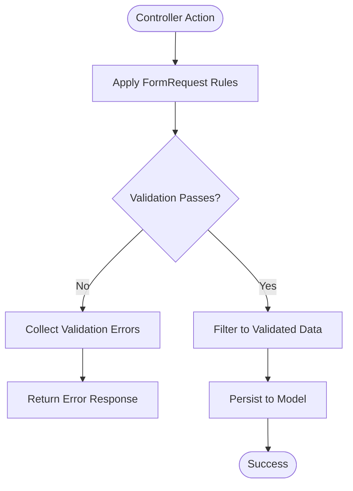

**Diagram sources**
- [FormRequest.php](file://vendor/laravel/framework/src/Illuminate/Foundation/Http/FormRequest.php)
- [validation.md](file://.agents/skills/laravel-best-practices/rules/validation.md)
- [validation.md](file://.claude/skills/laravel-best-practices/rules/validation.md)
- [validation.md](file://.kiro/skills/laravel-best-practices/rules/validation.md)

**Section sources**
- [validation.md](file://.agents/skills/laravel-best-practices/rules/validation.md)
- [validation.md](file://.claude/skills/laravel-best-practices/rules/validation.md)
- [validation.md](file://.kiro/skills/laravel-best-practices/rules/validation.md)

### API Request Validation and JSON Payload Sanitization
- Validate all JSON payloads at the API boundary.
- Enforce strict schemas for endpoint payloads and reject unknown fields.
- Use validated data for downstream processing and avoid passing raw input to services.
- For PWA endpoints, validate headers and tokens before proceeding.

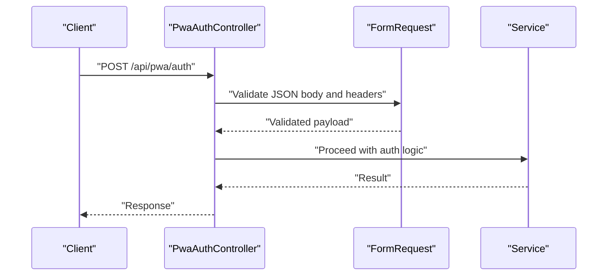

**Diagram sources**
- [PwaAuthController.php](file://app/Http/Controllers/Api/PwaAuthController.php)
- [PwaPushController.php](file://app/Http/Controllers/Api/PwaPushController.php)
- [PwaSyncController.php](file://app/Http/Controllers/Api/PwaSyncController.php)
- [FormRequest.php](file://vendor/laravel/framework/src/Illuminate/Foundation/Http/FormRequest.php)

**Section sources**
- [PwaAuthController.php](file://app/Http/Controllers/Api/PwaAuthController.php)
- [PwaPushController.php](file://app/Http/Controllers/Api/PwaPushController.php)
- [PwaSyncController.php](file://app/Http/Controllers/Api/PwaSyncController.php)

### XSS Prevention Strategies and HTML Escaping
- Treat all user-provided content as untrusted.
- Rely on framework auto-escaping in views; avoid bypassing it.
- Sanitize rich text inputs using allowed tag lists and attribute whitelists.
- Enforce Content Security Policy headers to mitigate XSS risks.

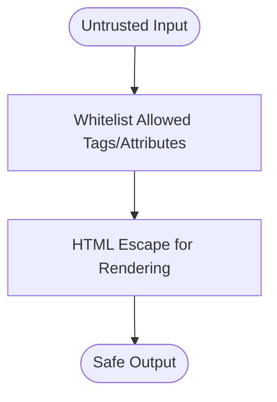

**Diagram sources**
- [security-and-hardening.md](file://skills/security-and-hardening/SKILL.md)

**Section sources**
- [security-and-hardening.md](file://skills/security-and-hardening/SKILL.md)

### SQL Injection Prevention Through Prepared Statements and Parameter Binding
- Always use parameterized queries and ORM methods that bind parameters.
- Avoid dynamic SQL construction with user input.
- Use query builder or Eloquent with bound parameters.

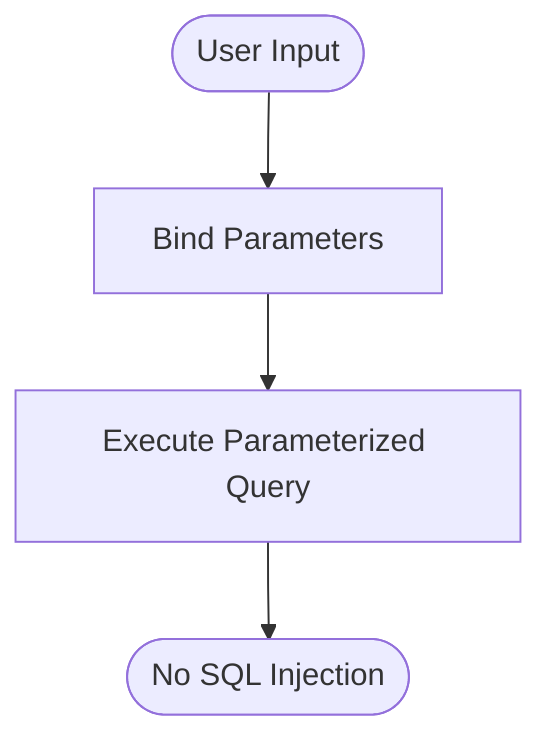

**Diagram sources**
- [security-and-hardening.md](file://skills/security-and-hardening/SKILL.md)

**Section sources**
- [security-and-hardening.md](file://skills/security-and-hardening/SKILL.md)

### File Upload Validation, Image Processing Safety, and Attachment Security
- Restrict allowed MIME types and enforce size limits.
- Validate uploaded files before processing or storing.
- Store uploads outside the web root or apply proper access controls.
- For image processing, validate dimensions and use safe libraries.

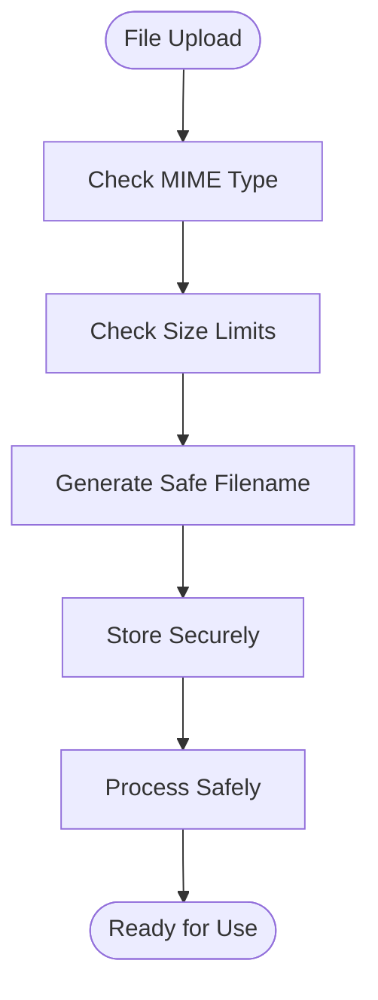

**Diagram sources**
- [security-and-hardening.md](file://skills/security-and-hardening/SKILL.md)
- [AbsensiGuruController.php](file://app/Http/Controllers/Api/V1/Guru/AbsensiGuruController.php)

**Section sources**
- [security-and-hardening.md](file://skills/security-and-hardening/SKILL.md)
- [AbsensiGuruController.php](file://app/Http/Controllers/Api/V1/Guru/AbsensiGuruController.php)

### Validation Rule Customization and Conditional Validation
- Customize rules per endpoint needs using Rule helpers.
- Apply conditional rules based on request fields or user roles.
- Use after hooks for cross-field validations.

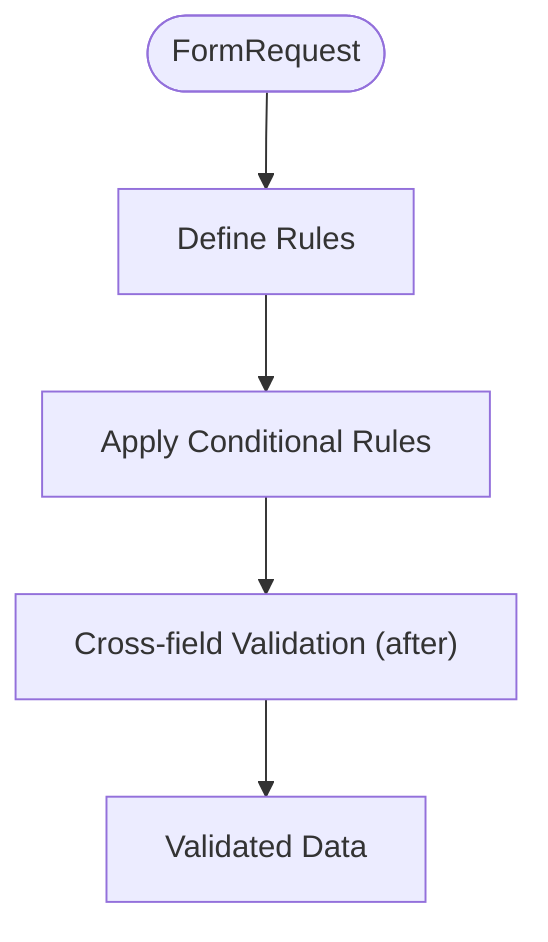

**Diagram sources**
- [validation.md](file://.agents/skills/laravel-best-practices/rules/validation.md)
- [validation.md](file://.claude/skills/laravel-best-practices/rules/validation.md)
- [validation.md](file://.kiro/skills/laravel-best-practices/rules/validation.md)

**Section sources**
- [validation.md](file://.agents/skills/laravel-best-practices/rules/validation.md)
- [validation.md](file://.claude/skills/laravel-best-practices/rules/validation.md)
- [validation.md](file://.kiro/skills/laravel-best-practices/rules/validation.md)

### Error Handling Strategies
- Centralize validation error responses with structured messages.
- Return appropriate HTTP status codes for validation failures.
- Log errors securely without exposing sensitive details.

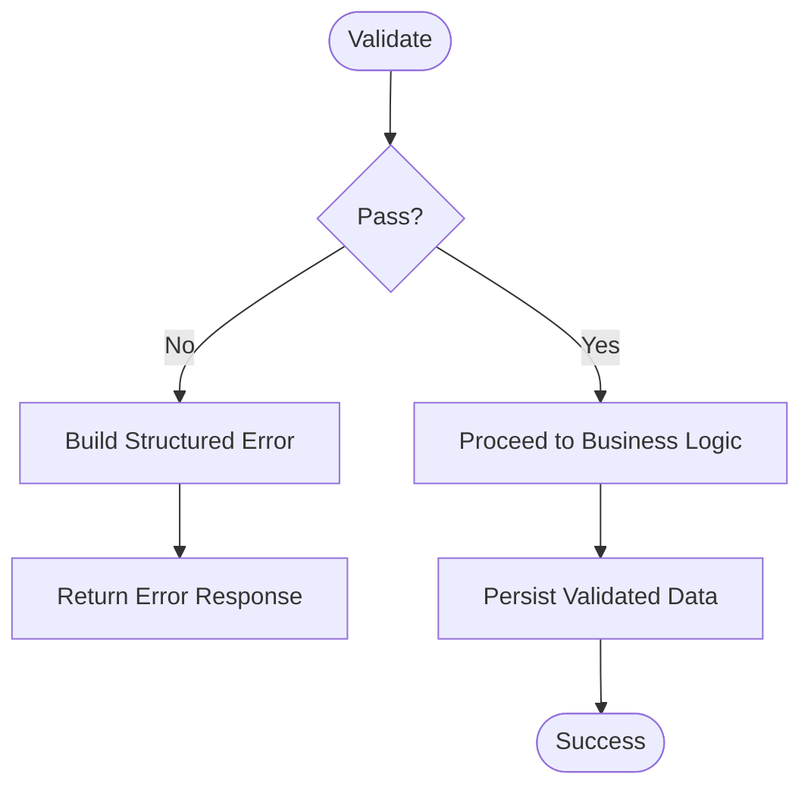

**Diagram sources**
- [api-and-interface-design.md](file://skills/api-and-interface-design/SKILL.md)
- [security-and-hardening.md](file://skills/security-and-hardening/SKILL.md)

**Section sources**
- [api-and-interface-design.md](file://skills/api-and-interface-design/SKILL.md)
- [security-and-hardening.md](file://skills/security-and-hardening/SKILL.md)

### Data Types and Whitelist/Blacklist Validation Patterns
- Enforce strict data types for numeric, boolean, and enum fields.
- Use whitelist validation for allowed values and blacklist for disallowed patterns.
- Validate identifiers and foreign keys before persistence.

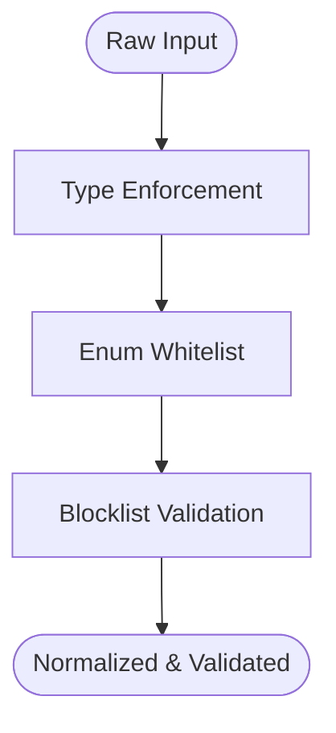

**Diagram sources**
- [api-and-interface-design.md](file://skills/api-and-interface-design/SKILL.md)

**Section sources**
- [api-and-interface-design.md](file://skills/api-and-interface-design/SKILL.md)

## Dependency Analysis
RaporKM’s validation pipeline depends on:
- Laravel’s FormRequest for reusable validation logic.
- Route definitions for entry points.
- Middleware for authorization and session checks.
- Services for business logic and model interactions.

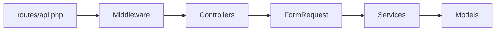

**Diagram sources**
- [api.php](file://routes/api.php)
- [PwaAuth.php](file://app/Http/Middleware/PwaAuth.php)
- [PwaAuthController.php](file://app/Http/Controllers/Api/PwaAuthController.php)
- [FormRequest.php](file://vendor/laravel/framework/src/Illuminate/Foundation/Http/FormRequest.php)

**Section sources**
- [api.php](file://routes/api.php)
- [PwaAuth.php](file://app/Http/Middleware/PwaAuth.php)
- [PwaAuthController.php](file://app/Http/Controllers/Api/PwaAuthController.php)
- [FormRequest.php](file://vendor/laravel/framework/src/Illuminate/Foundation/Http/FormRequest.php)

## Performance Considerations
- Keep validation rules efficient; avoid expensive computations in validation.
- Use early exits for invalid inputs to reduce downstream processing.
- Batch validations when possible and leverage caching for repeated checks.

## Troubleshooting Guide
- If validation fails unexpectedly, inspect the FormRequest rules and ensure they align with the request payload.
- For API endpoints, confirm middleware is not stripping headers or altering the request body.
- Review service-layer logic to ensure only validated data is persisted.

**Section sources**
- [PwaAuthController.php](file://app/Http/Controllers/Api/PwaAuthController.php)
- [PwaPushController.php](file://app/Http/Controllers/Api/PwaPushController.php)
- [PwaSyncController.php](file://app/Http/Controllers/Api/PwaSyncController.php)
- [V1\AuthController.php](file://app/Http/Controllers/Api/V1/AuthController.php)
- [AbsensiGuruController.php](file://app/Http/Controllers/Api/V1/Guru/AbsensiGuruController.php)

## Conclusion
RaporKM’s validation and sanitization strategy relies on robust request boundaries, form request classes, and strict parameter filtering. By enforcing type safety, applying conditional and custom validation, and adhering to XSS and SQL injection prevention practices, the system maintains data integrity and user safety. Consistent application of these patterns across controllers, services, and models ensures predictable and secure behavior.

## Appendices
- Authentication and token handling configurations are defined in Sanctum and related model files.
- PDF generation and export services rely on validated inputs and safe rendering practices.

**Section sources**
- [Sanctum.php](file://config/sanctum.php)
- [dompdf.php](file://config/dompdf.php)
- [ExportService.php](file://app/Services/ExportService.php)
- [RaporService.php](file://app/Services/RaporService.php)
- [NilaiService.php](file://app/Services/NilaiService.php)
- [DapodikService.php](file://app/Services/DapodikService.php)