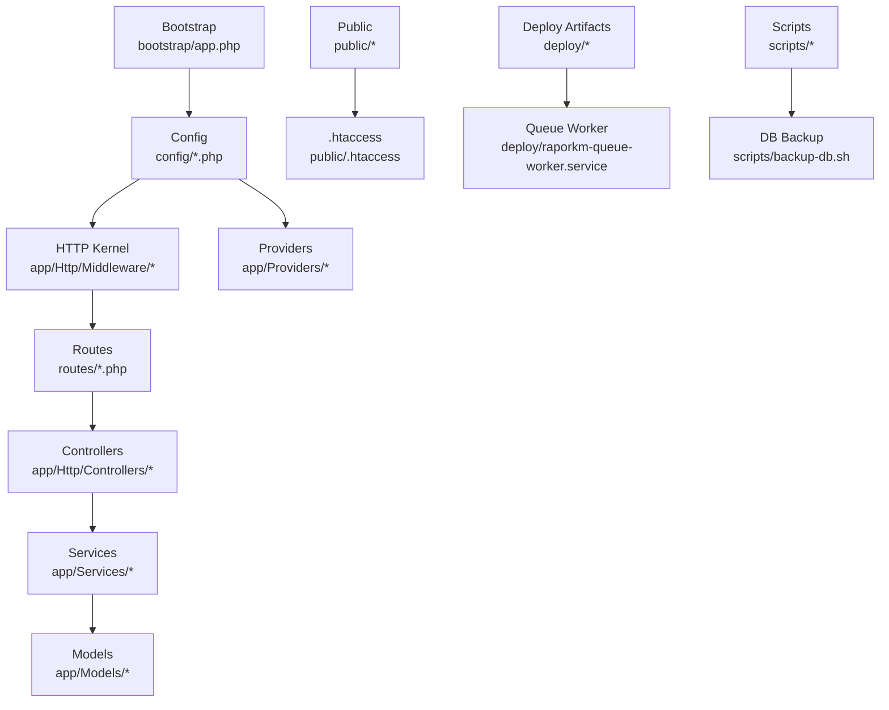
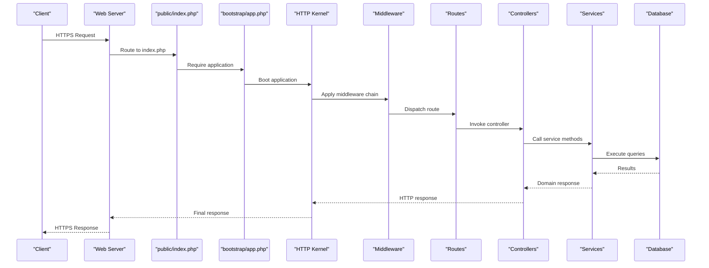
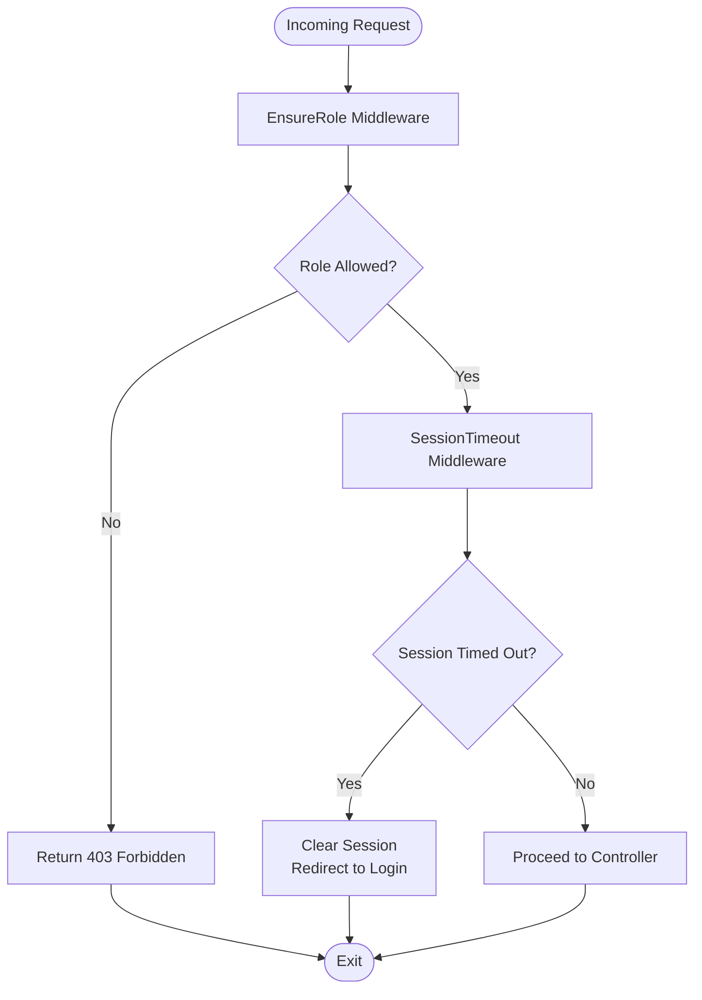
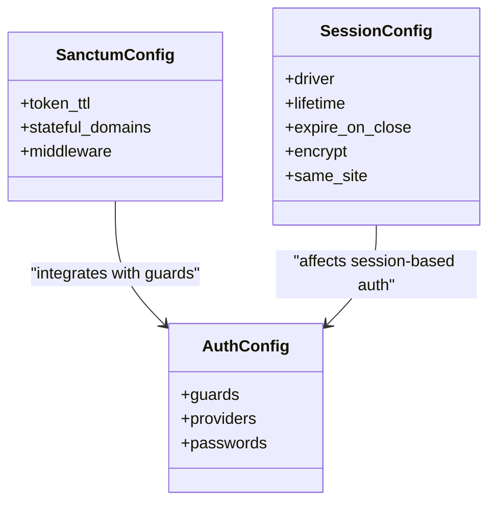
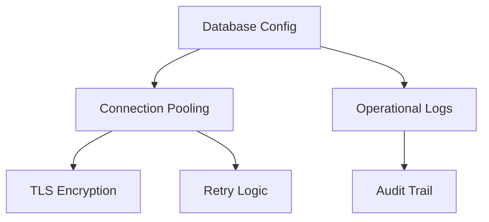
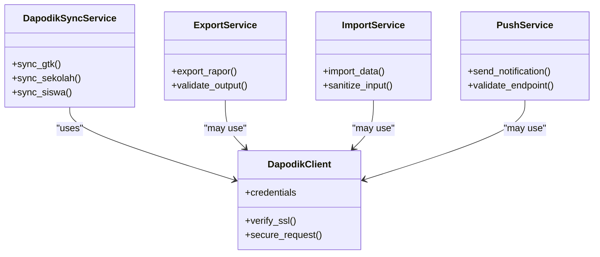
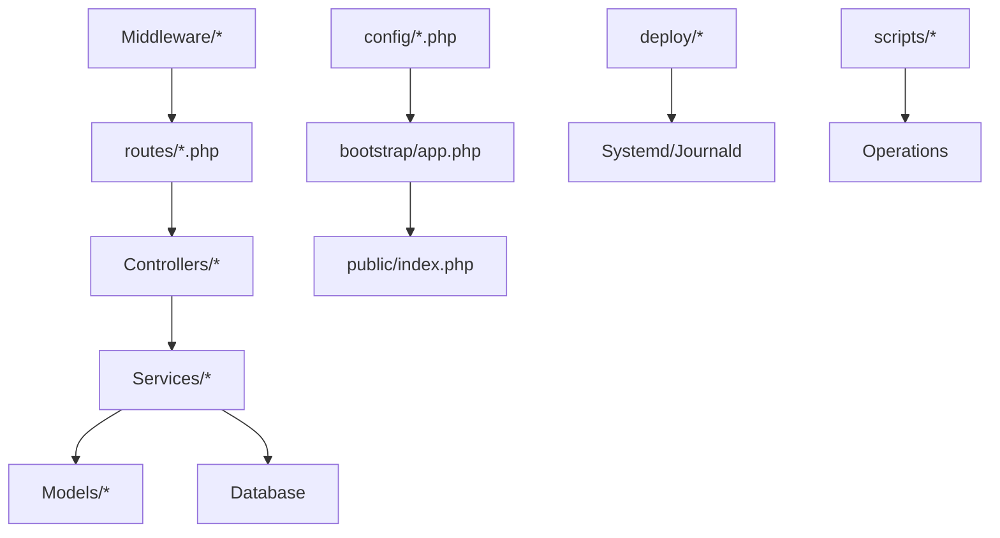

# Secure Deployment & Configuration

<cite>
**Referenced Files in This Document**
- [README.md](file://README.md)
- [DEPLOY.md](file://DEPLOY.md)
- [app.php](file://bootstrap/app.php)
- [app.php](file://config/app.php)
- [auth.php](file://config/auth.php)
- [cache.php](file://config/cache.php)
- [database.php](file://config/database.php)
- [filesystems.php](file://config/filesystems.php)
- [logging.php](file://config/logging.php)
- [mail.php](file://config/mail.php)
- [queue.php](file://config/queue.php)
- [sanctum.php](file://config/sanctum.php)
- [session.php](file://config/session.php)
- [EnsureRole.php](file://app/Http/Middleware/EnsureRole.php)
- [SessionTimeout.php](file://app/Http/Middleware/SessionTimeout.php)
- [.htaccess](file://public/.htaccess)
- [robots.txt](file://public/robots.txt)
- [index.php](file://public/index.php)
- [deploy.sh](file://deploy.sh)
- [raporkm-queue-worker.service](file://deploy/raporkm-queue-worker.service)
- [raporkm-logrotate.conf](file://deploy/raporkm-logrotate.conf)
- [backup-db.sh](file://scripts/backup-db.sh)
- [api.php](file://routes/api.php)
- [web.php](file://routes/web.php)
- [auth.php](file://routes/auth.php)
- [AppServiceProvider.php](file://app/Providers/AppServiceProvider.php)
- [VoltServiceProvider.php](file://app/Providers/VoltServiceProvider.php)
- [PwaToken.php](file://app/Models/PwaToken.php)
- [PushSubscription.php](file://app/Models/PushSubscription.php)
- [DapodikClient.php](file://app/Services/Dapodik/DapodikClient.php)
- [DapodikSyncService.php](file://app/Services/Dapodik/GtkSyncService.php)
- [SekolahSyncService.php](file://app/Services/Dapodik/SekolahSyncService.php)
- [SiswaSyncService.php](file://app/Services/Dapodik/SiswaSyncService.php)
- [DapodikService.php](file://app/Services/DapodikService.php)
- [ExportService.php](file://app/Services/ExportService.php)
- [ImportService.php](file://app/Services/ImportService.php)
- [PushService.php](file://app/Services/PushService.php)
- [RaporService.php](file://app/Services/RaporService.php)
- [activitylog.php](file://config/activitylog.php)
- [livewire.php](file://config/livewire.php)
- [dompdf.php](file://config/dompdf.php)
- [e-rapor.php](file://config/e-rapor.php)
- [test.yml](file://.github/workflows/test.yml)
- [deploy.yml](file://.github/workflows/deploy.yml)
</cite>

## Table of Contents
1. [Introduction](#introduction)
2. [Project Structure](#project-structure)
3. [Core Components](#core-components)
4. [Architecture Overview](#architecture-overview)
5. [Detailed Component Analysis](#detailed-component-analysis)
6. [Dependency Analysis](#dependency-analysis)
7. [Performance Considerations](#performance-considerations)
8. [Security Hardening](#security-hardening)
9. [Deployment Best Practices](#deployment-best-practices)
10. [Reverse Proxy, Load Balancer, and CDN Security](#reverse-proxy-load-balancer-and-cdn-security)
11. [Firewall, IDS, and Monitoring](#firewall-ids-and-monitoring)
12. [Backup, Disaster Recovery, and Incident Response](#backup-disaster-recovery-and-incident-response)
13. [Container and Cloud Security](#container-and-cloud-security)
14. [Troubleshooting Guide](#troubleshooting-guide)
15. [Conclusion](#conclusion)

## Introduction
This document provides a comprehensive guide to securely deploying and configuring RaporKM Laravel in production. It covers environment setup, security-hardened server configuration, deployment best practices, environment variable management, secret key rotation, configuration security, web server hardening, database security, reverse proxy and load balancer security, CDN integration security, firewall and monitoring, backup and disaster recovery, and container/cloud deployment considerations. The guidance is grounded in the repository’s configuration files, middleware, services, and deployment artifacts.

## Project Structure
RaporKM Laravel follows a standard Laravel application layout with modular configuration under config/, HTTP middleware under app/Http/Middleware/, services under app/Services/, and deployment-related scripts under deploy/ and scripts/.

**Diagram sources**
- [app.php:1-50](file://bootstrap/app.php#L1-L50)
- [app.php:1-120](file://config/app.php#L1-L120)
- [EnsureRole.php:1-120](file://app/Http/Middleware/EnsureRole.php#L1-L120)
- [SessionTimeout.php:1-120](file://app/Http/Middleware/SessionTimeout.php#L1-L120)
- [api.php:1-200](file://routes/api.php#L1-L200)
- [web.php:1-200](file://routes/web.php#L1-L200)
- [auth.php:1-200](file://routes/auth.php#L1-L200)
- [AppServiceProvider.php:1-200](file://app/Providers/AppServiceProvider.php#L1-L200)
- [VoltServiceProvider.php:1-200](file://app/Providers/VoltServiceProvider.php#L1-L200)
- [.htaccess:1-200](file://public/.htaccess#L1-L200)
- [raporkm-queue-worker.service:1-200](file://deploy/raporkm-queue-worker.service#L1-L200)
- [backup-db.sh:1-200](file://scripts/backup-db.sh#L1-L200)

**Section sources**
- [app.php:1-120](file://bootstrap/app.php#L1-L120)
- [app.php:1-200](file://config/app.php#L1-L200)

## Core Components
- Application bootstrap and service providers initialize the framework and register bindings.
- Configuration files define application behavior, authentication, caching, database connections, logging, mail, queues, Sanctum, sessions, Livewire, DomPDF, and e-rapor features.
- Middleware enforces role-based access control and session timeout policies.
- Services encapsulate domain logic for Dapodik synchronization, export/import, push notifications, and report generation.
- Routes define API and web endpoints; authentication routes are separated for clarity.

Key configuration areas for security:
- Environment and runtime settings in config/app.php.
- Authentication guard and Sanctum configuration in config/auth.php and config/sanctum.php.
- Session and cookie security in config/session.php.
- Queue and cache backends in config/queue.php and config/cache.php.
- Logging and filesystem visibility in config/logging.php and config/filesystems.php.

**Section sources**
- [app.php:1-200](file://config/app.php#L1-L200)
- [auth.php:1-200](file://config/auth.php#L1-L200)
- [sanctum.php:1-200](file://config/sanctum.php#L1-L200)
- [session.php:1-200](file://config/session.php#L1-L200)
- [queue.php:1-200](file://config/queue.php#L1-L200)
- [cache.php:1-200](file://config/cache.php#L1-L200)
- [logging.php:1-200](file://config/logging.php#L1-L200)
- [filesystems.php:1-200](file://config/filesystems.php#L1-L200)

## Architecture Overview
The application uses Laravel’s MVC pattern with layered services and middleware. Requests flow from the web server to public/index.php, through the framework bootstrap, HTTP kernel, middleware stack, routes, controllers, services, and persistence layers.

**Diagram sources**
- [index.php:1-200](file://public/index.php#L1-L200)
- [app.php:1-120](file://bootstrap/app.php#L1-L120)
- [EnsureRole.php:1-120](file://app/Http/Middleware/EnsureRole.php#L1-L120)
- [SessionTimeout.php:1-120](file://app/Http/Middleware/SessionTimeout.php#L1-L120)
- [api.php:1-200](file://routes/api.php#L1-L200)
- [web.php:1-200](file://routes/web.php#L1-L200)

## Detailed Component Analysis

### Middleware Stack and Access Control
- EnsureRole middleware validates user roles before granting access to protected routes.
- SessionTimeout middleware enforces idle timeouts to reduce session hijacking risks.

**Diagram sources**
- [EnsureRole.php:1-120](file://app/Http/Middleware/EnsureRole.php#L1-L120)
- [SessionTimeout.php:1-120](file://app/Http/Middleware/SessionTimeout.php#L1-L120)

**Section sources**
- [EnsureRole.php:1-120](file://app/Http/Middleware/EnsureRole.php#L1-L120)
- [SessionTimeout.php:1-120](file://app/Http/Middleware/SessionTimeout.php#L1-L120)

### Authentication and Session Security
- Sanctum configuration controls API token behavior and cross-site requests.
- Session configuration defines cookie security, lifetime, and driver selection.
- Authentication guard configuration secures user authentication mechanisms.

**Diagram sources**
- [sanctum.php:1-200](file://config/sanctum.php#L1-L200)
- [session.php:1-200](file://config/session.php#L1-L200)
- [auth.php:1-200](file://config/auth.php#L1-L200)

**Section sources**
- [sanctum.php:1-200](file://config/sanctum.php#L1-L200)
- [session.php:1-200](file://config/session.php#L1-L200)
- [auth.php:1-200](file://config/auth.php#L1-L200)

### Database Security and Connection Management
- Database configuration defines connection parameters, encryption, and pooling behavior.
- Queue and cache backends can leverage the same database or separate stores for isolation.
- Logging captures operational events and errors for auditability.

**Diagram sources**
- [database.php:1-200](file://config/database.php#L1-L200)
- [queue.php:1-200](file://config/queue.php#L1-L200)
- [cache.php:1-200](file://config/cache.php#L1-L200)
- [logging.php:1-200](file://config/logging.php#L1-L200)

**Section sources**
- [database.php:1-200](file://config/database.php#L1-L200)
- [queue.php:1-200](file://config/queue.php#L1-L200)
- [cache.php:1-200](file://config/cache.php#L1-L200)
- [logging.php:1-200](file://config/logging.php#L1-L200)

### Web Server Security and Directory Permissions
- public/.htaccess provides URL rewriting and basic protections.
- public/robots.txt controls crawler behavior.
- public/index.php is the front controller; ensure proper file permissions and ownership.

Recommendations:
- Restrict write permissions to storage/ and bootstrap/cache/.
- Disable directory listing and hide internal paths.
- Enforce HTTPS and HSTS via web server configuration.

**Section sources**
- [.htaccess:1-200](file://public/.htaccess#L1-L200)
- [robots.txt:1-200](file://public/robots.txt#L1-L200)
- [index.php:1-200](file://public/index.php#L1-L200)

### Environment Variable Management and Secret Rotation
- Environment variables drive application behavior and secrets.
- Rotate keys regularly and invalidate compromised tokens.
- Store secrets outside version control; use OS-level secret managers or encrypted vaults.

Guidelines:
- Define environment-specific .env files and CI/CD secret injection.
- Use dedicated keys for production and rotate quarterly.
- Invalidate tokens on key rotation and prompt re-authentication.

**Section sources**
- [app.php:1-200](file://config/app.php#L1-L200)

### Services Layer Security
- Dapodik services handle external integrations; secure client credentials and transport.
- Export/Import services operate on sensitive data; enforce authorization and sanitize inputs.
- Push services require secure token management and endpoint validation.

**Diagram sources**
- [DapodikClient.php:1-200](file://app/Services/Dapodik/DapodikClient.php#L1-L200)
- [DapodikSyncService.php:1-200](file://app/Services/Dapodik/GtkSyncService.php#L1-L200)
- [SekolahSyncService.php:1-200](file://app/Services/Dapodik/SekolahSyncService.php#L1-L200)
- [SiswaSyncService.php:1-200](file://app/Services/Dapodik/SiswaSyncService.php#L1-L200)
- [ExportService.php:1-200](file://app/Services/ExportService.php#L1-L200)
- [ImportService.php:1-200](file://app/Services/ImportService.php#L1-L200)
- [PushService.php:1-200](file://app/Services/PushService.php#L1-L200)

**Section sources**
- [DapodikClient.php:1-200](file://app/Services/Dapodik/DapodikClient.php#L1-L200)
- [DapodikSyncService.php:1-200](file://app/Services/Dapodik/GtkSyncService.php#L1-L200)
- [SekolahSyncService.php:1-200](file://app/Services/Dapodik/SekolahSyncService.php#L1-L200)
- [SiswaSyncService.php:1-200](file://app/Services/Dapodik/SiswaSyncService.php#L1-L200)
- [ExportService.php:1-200](file://app/Services/ExportService.php#L1-L200)
- [ImportService.php:1-200](file://app/Services/ImportService.php#L1-L200)
- [PushService.php:1-200](file://app/Services/PushService.php#L1-L200)

## Dependency Analysis
Application dependencies span configuration, middleware, routes, services, and infrastructure components. The following diagram highlights key relationships.

**Diagram sources**
- [app.php:1-120](file://bootstrap/app.php#L1-L120)
- [EnsureRole.php:1-120](file://app/Http/Middleware/EnsureRole.php#L1-L120)
- [SessionTimeout.php:1-120](file://app/Http/Middleware/SessionTimeout.php#L1-L120)
- [api.php:1-200](file://routes/api.php#L1-L200)
- [web.php:1-200](file://routes/web.php#L1-L200)
- [AppServiceProvider.php:1-200](file://app/Providers/AppServiceProvider.php#L1-L200)
- [VoltServiceProvider.php:1-200](file://app/Providers/VoltServiceProvider.php#L1-L200)
- [raporkm-queue-worker.service:1-200](file://deploy/raporkm-queue-worker.service#L1-L200)
- [backup-db.sh:1-200](file://scripts/backup-db.sh#L1-L200)

**Section sources**
- [app.php:1-120](file://bootstrap/app.php#L1-L120)
- [api.php:1-200](file://routes/api.php#L1-L200)
- [web.php:1-200](file://routes/web.php#L1-L200)

## Performance Considerations
- Enable opcode caching (OPcache) and optimize autoloader.
- Use Redis or Memcached for cache and session storage.
- Configure queue workers with appropriate concurrency and restart policies.
- Tune database connection pooling and query execution plans.
- Minimize view rendering overhead and leverage compiled assets.

[No sources needed since this section provides general guidance]

## Security Hardening
- Web server hardening: disable unnecessary HTTP methods, enforce TLS 1.2+, configure HSTS, and restrict exposed paths.
- Filesystem permissions: set restrictive permissions on storage/ and bootstrap/cache/.
- Environment variables: keep secrets out of logs and avoid printing sensitive data.
- Input validation and sanitization: apply strict validation in services and controllers.
- CORS and CSRF protection: configure Sanctum and CSRF middleware appropriately.
- Secrets management: rotate keys, invalidate tokens, and use secure secret stores.

[No sources needed since this section provides general guidance]

## Deployment Best Practices
- Use CI/CD pipelines to automate builds, tests, and deployments.
- Maintain immutable deployments with atomic rollouts and rollback strategies.
- Validate configuration in staging before production.
- Monitor health checks and metrics during deployment.

**Section sources**
- [deploy.yml:1-200](file://.github/workflows/deploy.yml#L1-L200)
- [test.yml:1-200](file://.github/workflows/test.yml#L1-L200)
- [deploy.sh:1-200](file://deploy.sh#L1-L200)

## Reverse Proxy, Load Balancer, and CDN Security
- Terminate TLS at the reverse proxy; forward only clean, validated headers.
- Enforce rate limiting and WAF rules at the proxy layer.
- Configure sticky sessions if required; otherwise ensure stateless session handling.
- For CDNs, enable signed URLs for private assets and restrict origin domains.

[No sources needed since this section provides general guidance]

## Firewall, IDS, and Monitoring
- Lock down inbound ports to necessary services only.
- Deploy IDS/IPS to monitor traffic anomalies.
- Centralize logs and enable real-time alerts for security events.
- Monitor failed authentication attempts and unusual access patterns.

[No sources needed since this section provides general guidance]

## Backup, Disaster Recovery, and Incident Response
- Schedule regular database backups and verify restore procedures.
- Encrypt backups at rest and in transit.
- Document incident response playbooks and conduct tabletop exercises.
- Automate alerting and remediation steps.

**Section sources**
- [backup-db.sh:1-200](file://scripts/backup-db.sh#L1-L200)

## Container and Cloud Security
- Run containers with non-root users and minimal base images.
- Use read-only root filesystems and drop unnecessary capabilities.
- Store secrets via environment variables injected by the platform or mounted as volumes.
- For cloud platforms, enable VPC networking, IAM least privilege, and managed secrets.

[No sources needed since this section provides general guidance]

## Troubleshooting Guide
- Review application logs under storage/logs/ and system logs via journalctl.
- Validate queue worker status and logs.
- Confirm database connectivity and credentials.
- Inspect web server error logs and .htaccess rules.

**Section sources**
- [logging.php:1-200](file://config/logging.php#L1-L200)
- [raporkm-queue-worker.service:1-200](file://deploy/raporkm-queue-worker.service#L1-L200)
- [database.php:1-200](file://config/database.php#L1-L200)

## Conclusion
By applying the security measures, deployment practices, and operational controls outlined above, RaporKM Laravel can be deployed and maintained securely in production. Regular audits, rotation of secrets, adherence to least privilege, and robust monitoring will further strengthen the system’s resilience against evolving threats.