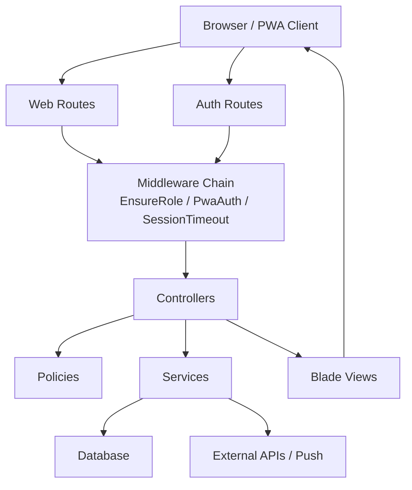
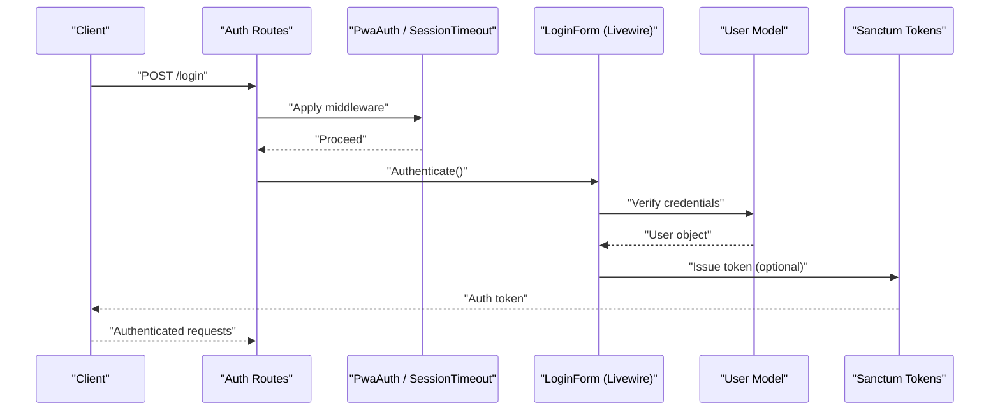
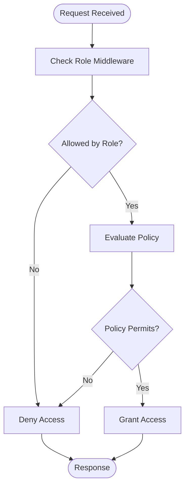
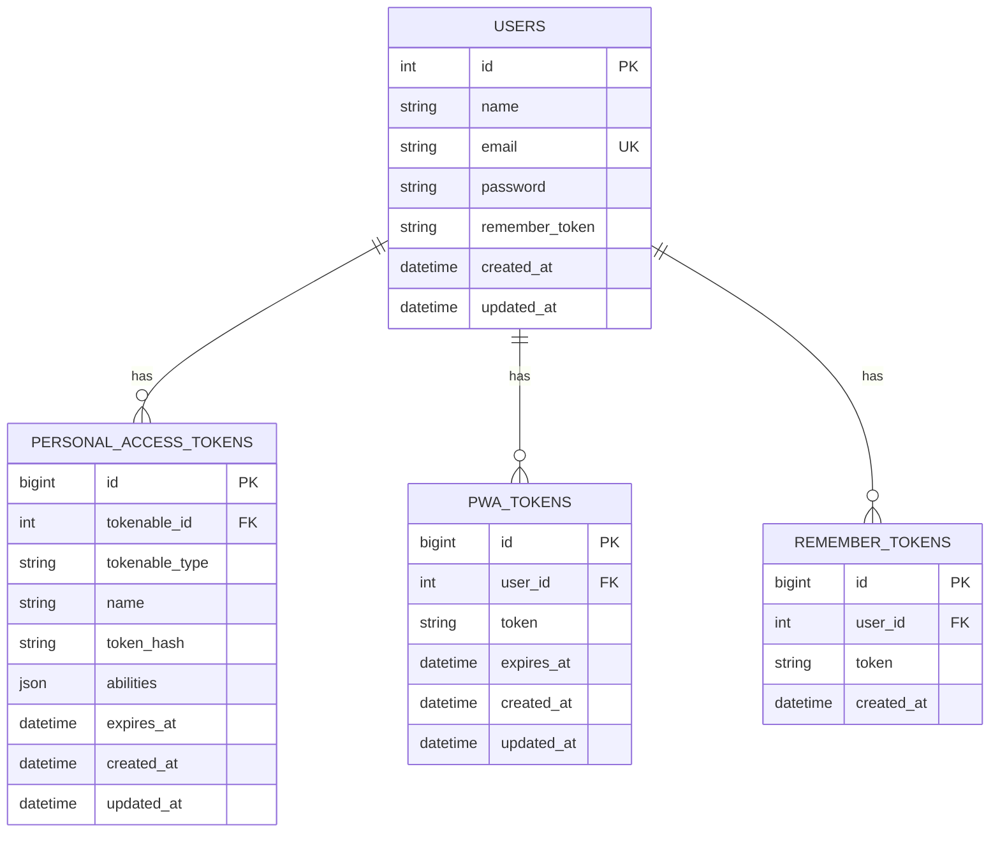
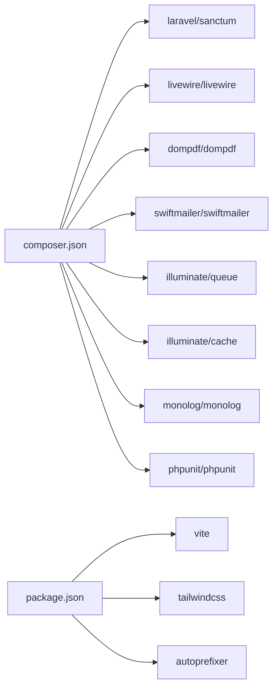

# Security & Best Practices

<cite>
**Referenced Files in This Document**
- [app.php](file://config/app.php)
- [auth.php](file://config/auth.php)
- [session.php](file://config/session.php)
- [sanctum.php](file://config/sanctum.php)
- [EnsureRole.php](file://app/Http/Middleware/EnsureRole.php)
- [PwaAuth.php](file://app/Http/Middleware/PwaAuth.php)
- [SessionTimeout.php](file://app/Http/Middleware/SessionTimeout.php)
- [LoginForm.php](file://app/Livewire/Forms/LoginForm.php)
- [Logout.php](file://app/Livewire/Actions/Logout.php)
- [web.php](file://routes/web.php)
- [auth.php](file://routes/auth.php)
- [User.php](file://app/Models/User.php)
- [UserPolicy.php](file://app/Policies/UserPolicy.php)
- [NilaiMapelPolicy.php](file://app/Policies/NilaiMapelPolicy.php)
- [KelasPolicy.php](file://app/Policies/KelasPolicy.php)
- [SiswaPolicy.php](file://app/Policies/SiswaPolicy.php)
- [ExportService.php](file://app/Services/ExportService.php)
- [ImportService.php](file://app/Services/ImportService.php)
- [NilaiService.php](file://app/Services/NilaiService.php)
- [DapodikService.php](file://app/Services/DapodikService.php)
- [PushService.php](file://app/Services/PushService.php)
- [activitylog.php](file://config/activitylog.php)
- [logging.php](file://config/logging.php)
- [mail.php](file://config/mail.php)
- [filesystems.php](file://config/filesystems.php)
- [dompdf.php](file://config/dompdf.php)
- [push.php](file://config/push.php)
- [database.php](file://config/database.php)
- [cache.php](file://config/cache.php)
- [queue.php](file://config/queue.php)
- [livewire.php](file://config/livewire.php)
- [services.php](file://config/services.php)
- [e-rapor.php](file://config/e-rapor.php)
- [0001_01_01_000000_create_users_table.php](file://database/migrations/0001_01_01_000000_create_users_table.php)
- [0001_01_01_000001_create_cache_table.php](file://database/migrations/0001_01_01_000001_create_cache_table.php)
- [0001_01_01_000002_create_jobs_table.php](file://database/migrations/0001_01_01_000002_create_jobs_table.php)
- [2026_06_01_010827_create_personal_access_tokens_table.php](file://database/migrations/2026_06_01_010827_create_personal_access_tokens_table.php)
- [2026_06_01_010827_create_pwa_tokens_table.php](file://database/migrations/2026_06_01_010827_create_pwa_tokens_table.php)
- [2026_06_01_010828_create_remember_tokens_table.php](file://database/migrations/2026_06_01_010828_create_remember_tokens_table.php)
- [2026_06_04_120000_create_ptk_table_and_migrate_from_users.php](file://database/migrations/2026_06_04_120000_create_ptk_table_and_migrate_from_users.php)
- [2026_06_10_000001_add_fcm_token_to_users_table.php](file://database/migrations/2026_06_10_000001_add_fcm_token_to_users_table.php)
- [2026_06_10_090001_add_gps_fields_to_sekolah_table.php](file://database/migrations/2026_06_10_090001_add_gps_fields_to_sekolah_table.php)
- [2026_06_10_090002_create_presensi_guru_tu_table.php](file://database/migrations/2026_06_10_090002_create_presensi_guru_tu_table.php)
- [2026_06_08_100000_create_push_subscriptions_table.php](file://database/migrations/2026_06_08_100000_create_push_subscriptions_table.php)
- [2026_06_02_040000_create_dapodik_sync_logs_table.php](file://database/migrations/2026_06_02_040000_create_dapodik_sync_logs_table.php)
- [2026_06_01_010657_create_activity_log_table.php](file://database/migrations/2026_06_01_010657_create_activity_log_table.php)
- [2026_06_01_010801_create_ref_agama_table.php](file://database/migrations/2026_06_01_010801_create_ref_agama_table.php)
- [2026_06_01_010808_create_sekolah_table.php](file://database/migrations/2026_06_01_010808_create_sekolah_table.php)
- [2026_06_01_010808_create_siswa_table.php](file://database/migrations/2026_06_01_010808_create_siswa_table.php)
- [2026_06_01_010809_create_kelas_table.php](file://database/migrations/2026_06_01_010809_create_kelas_table.php)
- [2026_06_01_010816_create_mapel_kelas_table.php](file://database/migrations/2026_06_01_010816_create_mapel_kelas_table.php)
- [2026_06_01_010816_create_mapel_siswa_table.php](file://database/migrations/2026_06_01_010816_create_mapel_siswa_table.php)
- [2026_06_01_010816_create_siswa_kelas_table.php](file://database/migrations/2026_06_01_010816_create_siswa_kelas_table.php)
- [2026_06_01_010817_create_nilai_mapel_table.php](file://database/migrations/2026_06_01_010817_create_nilai_mapel_table.php)
- [2026_06_01_010817_create_nilai_sumatif_as_table.php](file://database/migrations/2026_06_01_010817_create_nilai_sumatif_as_table.php)
- [2026_06_01_010817_create_nilai_sumatif_ph_table.php](file://database/migrations/2026_06_01_010817_create_nilai_sumatif_ph_table.php)
- [2026_06_01_010817_create_nilai_sumatif_ts_table.php](file://database/migrations/2026_06_01_010817_create_nilai_sumatif_ts_table.php)
- [2026_06_01_010817_create_nilai_formatif_table.php](file://database/migrations/2026_06_01_010817_create_nilai_formatif_table.php)
- [2026_06_01_010817_create_nilai_kelas_table.php](file://database/migrations/2026_06_01_010817_create_nilai_kelas_table.php)
- [2026_06_01_010817_create_nilai_mata_pelajaran_table.php](file://database/migrations/2026_06_01_010817_create_nilai_mata_pelajaran_table.php)
- [2026_06_01_010818_create_proyek_kelas_table.php](file://database/migrations/2026_06_01_010818_create_proyek_kelas_table.php)
- [2026_06_01_010818_create_proyek_subelemen_table.php](file://database/migrations/2026_06_01_010818_create_proyek_subelemen_table.php)
- [2026_06_01_010818_create_nilai_proyek_table.php](file://database/migrations/2026_06_01_010818_create_nilai_proyek_table.php)
- [2026_06_01_010818_create_nilai_kokurikuler_table.php](file://database/migrations/2026_06_01_010818_create_nilai_kokurikuler_table.php)
- [2026_06_01_010818_create_nilai_prakerin_table.php](file://database/migrations/2026_06_01_010818_create_nilai_prakerin_table.php)
- [2026_06_01_010818_create_prakerin_table.php](file://database/migrations/2026_06_01_010818_create_prakerin_table.php)
- [2026_06_01_010819_create_mapel_proyek_table.php](file://database/migrations/2026_06_01_010819_create_mapel_proyek_table.php)
- [2026_06_01_010819_create_nilai_assesmen_subelemen_table.php](file://database/migrations/2026_06_01_010819_create_nilai_assesmen_subelemen_table.php)
- [2026_06_01_010819_create_proyek_tujuan_table.php](file://database/migrations/2026_06_01_010819_create_proyek_tujuan_table.php)
- [2026_06_01_010819_create_proyek_tema_table.php](file://database/migrations/2026_06_01_010819_create_proyek_tema_table.php)
- [2026_06_01_010819_create_siswa_prakerin_table.php](file://database/migrations/2026_06_01_010819_create_siswa_prakerin_table.php)
- [2026_06_01_010820_create_catatan_wali_table.php](file://database/migrations/2026_06_01_010820_create_catatan_wali_table.php)
- [2026_06_01_010820_create_piket_harian_table.php](file://database/migrations/2026_06_01_010820_create_piket_harian_table.php)
- [2026_06_01_010820_create_presensi_table.php](file://database/migrations/2026_06_01_010820_create_presensi_table.php)
- [2026_06_01_010820_create_siswa_eskul_table.php](file://database/migrations/2026_06_01_010820_create_siswa_eskul_table.php)
- [2026_06_01_010821_create_lulusan_table.php](file://database/migrations/2026_06_01_010821_create_lulusan_table.php)
- [2026_06_01_010821_create_mutasi_keluar_table.php](file://database/migrations/2026_06_01_010821_create_mutasi_keluar_table.php)
- [2026_06_01_010821_create_mutasi_masuk_table.php](file://database/migrations/2026_06_01_010821_create_mutasi_masuk_table.php)
- [2026_06_01_010821_create_prestasi_table.php](file://database/migrations/2026_06_01_010821_create_prestasi_table.php)
- [2026_06_01_010827_create_dapodik_sync_logs_table.php](file://database/migrations/2026_06_01_010827_create_dapodik_sync_logs_table.php)
- [2026_06_02_040000_create_dapodik_sync_logs_table.php](file://database/migrations/2026_06_02_040000_create_dapodik_sync_logs_table.php)
- [2026_06_02_050000_add_dapodik_pd_id_to_siswa_table.php](file://database/migrations/2026_06_02_050000_add_dapodik_pd_id_to_siswa_table.php)
- [2026_06_02_080000_add_dapodik_id_to_sekolah_table.php](file://database/migrations/2026_06_02_080000_add_dapodik_id_to_sekolah_table.php)
- [2026_06_02_080001_add_dapodik_id_to_kelas_table.php](file://database/migrations/2026_06_02_080001_add_dapodik_id_to_kelas_table.php)
- [2026_06_02_080002_add_dapodik_id_to_mapel_table.php](file://database/migrations/2026_06_02_080002_add_dapodik_id_to_mapel_table.php)
- [2026_06_02_080003_add_dapodik_id_to_mapel_kelas_table.php](file://database/migrations/2026_06_02_080003_add_dapodik_id_to_mapel_kelas_table.php)
- [2026_06_02_090000_make_user_id_nullable_in_mapel_kelas_table.php](file://database/migrations/2026_06_02_090000_make_user_id_nullable_in_mapel_kelas_table.php)
- [2026_06_02_100000_add_urutan_to_mapel_table.php](file://database/migrations/2026_06_02_100000_add_urutan_to_mapel_table.php)
- [2026_06_03_044817_add_favicon_to_sekolah_table.php](file://database/migrations/2026_06_03_044817_add_favicon_to_sekolah_table.php)
- [2026_06_04_000001_add_batch_fields_to_dapodik_sync_logs_table.php](file://database/migrations/2026_06_04_000001_add_batch_fields_to_dapodik_sync_logs_table.php)
- [2026_06_04_120000_create_ptk_table_and_migrate_from_users.php](file://database/migrations/2026_06_04_120000_create_ptk_table_and_migrate_from_users.php)
- [2026_06_04_130000_create_guru_menu_akses_table.php](file://database/migrations/2026_06_04_130000_create_guru_menu_akses_table.php)
- [2026_06_08_100000_create_push_subscriptions_table.php](file://database/migrations/2026_06_08_100000_create_push_subscriptions_table.php)
- [2026_06_10_000001_add_fcm_token_to_users_table.php](file://database/migrations/2026_06_10_000001_add_fcm_token_to_users_table.php)
- [2026_06_10_090001_add_gps_fields_to_sekolah_table.php](file://database/migrations/2026_06_10_090001_add_gps_fields_to_sekolah_table.php)
- [2026_06_10_090002_create_presensi_guru_tu_table.php](file://database/migrations/2026_06_10_090002_create_presensi_guru_tu_table.php)
- [2026_06_13_150000_add_format_rapor_to_sekolah_table.php](file://database/migrations/2026_06_13_150000_add_format_rapor_to_sekolah_table.php)
- [backup-db.sh](file://scripts/backup-db.sh)
- [deploy.sh](file://deploy.sh)
- [deploy.yml](file://.github/workflows/deploy.yml)
- [test.yml](file://.github/workflows/test.yml)
- [phpunit.xml](file://phpunit.xml)
- [composer.json](file://composer.json)
- [package.json](file://package.json)
- [tailwind.config.js](file://tailwind.config.js)
- [postcss.config.js](file://postcss.config.js)
- [vite.config.js](file://vite.config.js)
</cite>

## Table of Contents
1. [Introduction](#introduction)
2. [Project Structure](#project-structure)
3. [Core Components](#core-components)
4. [Architecture Overview](#architecture-overview)
5. [Detailed Component Analysis](#detailed-component-analysis)
6. [Dependency Analysis](#dependency-analysis)
7. [Performance Considerations](#performance-considerations)
8. [Troubleshooting Guide](#troubleshooting-guide)
9. [Conclusion](#conclusion)
10. [Appendices](#appendices)

## Introduction
This document provides comprehensive security and best practices guidance for RaporKM Laravel. It focuses on authentication security, authorization and access control, input validation, CSRF/XSS protections, encryption and secure communications, middleware and request filtering, dependency management, vulnerability assessments, database security, file upload/image processing safety, deployment hardening, and incident response. The content is grounded in the repository’s configuration, middleware, policies, services, and migration schemas.

## Project Structure
Security-relevant areas include:
- Configuration: Authentication, sessions, Sanctum tokens, logging, mail, filesystems, PDF generation, push notifications, database, cache, queues, Livewire, and service integrations.
- Middleware: Role enforcement, PWA authentication, session timeout.
- Policies: Authorization rules for Users, Classes, Students, and Grading.
- Services: Export, Import, Grading, Dapodik sync, Push notifications.
- Migrations: User and token tables, school/student/class/grade entities, attendance, extracurriculars, projects, and sync logs.
- Routes: Web and authentication routes.
- Livewire: Login form and logout actions.
- CI/CD and testing: GitHub workflows and PHPUnit configuration.

```mermaid
graph TB
subgraph "Config"
CFG_APP["config/app.php"]
CFG_AUTH["config/auth.php"]
CFG_SESS["config/session.php"]
CFG_SANC["config/sanctum.php"]
CFG_LOG["config/logging.php"]
CFG_MAIL["config/mail.php"]
CFG_FS["config/filesystems.php"]
CFG_PDF["config/dompdf.php"]
CFG_PUSH["config/push.php"]
CFG_DB["config/database.php"]
CFG_CACHE["config/cache.php"]
CFG_QUEUE["config/queue.php"]
CFG_LIVE["config/livewire.php"]
CFG_SERV["config/services.php"]
CFG_ER["config/e-rapor.php"]
end
subgraph "Middleware"
MW_ROLE["EnsureRole.php"]
MW_PWA["PwaAuth.php"]
MW_TIMEOUT["SessionTimeout.php"]
end
subgraph "Policies"
POL_USER["UserPolicy.php"]
POL_KELAS["KelasPolicy.php"]
POL_SISWA["SiswaPolicy.php"]
POL_NILAI["NilaiMapelPolicy.php"]
end
subgraph "Services"
SVC_EXPORT["ExportService.php"]
SVC_IMPORT["ImportService.php"]
SVC_NILAI["NilaiService.php"]
SVC_DAPODIK["DapodikService.php"]
SVC_PUSH["PushService.php"]
end
subgraph "Routes"
RT_WEB["routes/web.php"]
RT_AUTH["routes/auth.php"]
end
subgraph "Livewire"
LW_LOGIN["LoginForm.php"]
LW_LOGOUT["Logout.php"]
end
CFG_APP --> MW_ROLE
CFG_APP --> MW_PWA
CFG_APP --> MW_TIMEOUT
CFG_APP --> POL_USER
CFG_APP --> POL_KELAS
CFG_APP --> POL_SISWA
CFG_APP --> POL_NILAI
CFG_APP --> SVC_EXPORT
CFG_APP --> SVC_IMPORT
CFG_APP --> SVC_NILAI
CFG_APP --> SVC_DAPODIK
CFG_APP --> SVC_PUSH
CFG_APP --> RT_WEB
CFG_APP --> RT_AUTH
CFG_APP --> LW_LOGIN
CFG_APP --> LW_LOGOUT
```

**Diagram sources**
- [app.php](file://config/app.php)
- [auth.php](file://config/auth.php)
- [session.php](file://config/session.php)
- [sanctum.php](file://config/sanctum.php)
- [EnsureRole.php](file://app/Http/Middleware/EnsureRole.php)
- [PwaAuth.php](file://app/Http/Middleware/PwaAuth.php)
- [SessionTimeout.php](file://app/Http/Middleware/SessionTimeout.php)
- [UserPolicy.php](file://app/Policies/UserPolicy.php)
- [KelasPolicy.php](file://app/Policies/KelasPolicy.php)
- [SiswaPolicy.php](file://app/Policies/SiswaPolicy.php)
- [NilaiMapelPolicy.php](file://app/Policies/NilaiMapelPolicy.php)
- [ExportService.php](file://app/Services/ExportService.php)
- [ImportService.php](file://app/Services/ImportService.php)
- [NilaiService.php](file://app/Services/NilaiService.php)
- [DapodikService.php](file://app/Services/DapodikService.php)
- [PushService.php](file://app/Services/PushService.php)
- [web.php](file://routes/web.php)
- [auth.php](file://routes/auth.php)
- [LoginForm.php](file://app/Livewire/Forms/LoginForm.php)
- [Logout.php](file://app/Livewire/Actions/Logout.php)

**Section sources**
- [app.php](file://config/app.php)
- [auth.php](file://config/auth.php)
- [session.php](file://config/session.php)
- [sanctum.php](file://config/sanctum.php)

## Core Components
- Authentication and Sessions
  - Centralized via configuration for guards, providers, password broker, and session lifetime.
  - Sanctum personal access tokens and PWA tokens support API-like flows for PWAs.
  - Remember tokens enable “remember me” functionality.
- Authorization and Access Control
  - Policies define fine-grained permissions for Users, Classes, Students, and Grading.
  - Middleware enforces roles at route/controller boundaries.
- Request Security
  - CSRF protection through framework defaults; input validation via requests and policies.
  - XSS mitigations through Blade escaping and controlled HTML rendering.
- Data Protection
  - Logging, mail, filesystems, and PDF generation configured for safe handling.
  - Push notifications configured separately for secure delivery channels.
- Data Integrity and Access Patterns
  - Extensive migrations model student, teacher, class, grade, attendance, and sync logs.
  - Services encapsulate business logic and data access for export/import/grading/Dapodik.

**Section sources**
- [auth.php](file://config/auth.php)
- [session.php](file://config/session.php)
- [sanctum.php](file://config/sanctum.php)
- [UserPolicy.php](file://app/Policies/UserPolicy.php)
- [KelasPolicy.php](file://app/Policies/KelasPolicy.php)
- [SiswaPolicy.php](file://app/Policies/SiswaPolicy.php)
- [NilaiMapelPolicy.php](file://app/Policies/NilaiMapelPolicy.php)
- [EnsureRole.php](file://app/Http/Middleware/EnsureRole.php)
- [ExportService.php](file://app/Services/ExportService.php)
- [ImportService.php](file://app/Services/ImportService.php)
- [NilaiService.php](file://app/Services/NilaiService.php)
- [DapodikService.php](file://app/Services/DapodikService.php)
- [PushService.php](file://app/Services/PushService.php)

## Architecture Overview
High-level security architecture integrates configuration-driven authentication, middleware-based enforcement, policy-based authorization, and service-layer data handling.

**Diagram sources**
- [web.php](file://routes/web.php)
- [auth.php](file://routes/auth.php)
- [EnsureRole.php](file://app/Http/Middleware/EnsureRole.php)
- [PwaAuth.php](file://app/Http/Middleware/PwaAuth.php)
- [SessionTimeout.php](file://app/Http/Middleware/SessionTimeout.php)
- [UserPolicy.php](file://app/Policies/UserPolicy.php)
- [KelasPolicy.php](file://app/Policies/KelasPolicy.php)
- [SiswaPolicy.php](file://app/Policies/SiswaPolicy.php)
- [NilaiMapelPolicy.php](file://app/Policies/NilaiMapelPolicy.php)
- [ExportService.php](file://app/Services/ExportService.php)
- [ImportService.php](file://app/Services/ImportService.php)
- [NilaiService.php](file://app/Services/NilaiService.php)
- [DapodikService.php](file://app/Services/DapodikService.php)
- [PushService.php](file://app/Services/PushService.php)

## Detailed Component Analysis

### Authentication Security
- Password Policies and Management
  - Password hashing and reset flows are configured centrally; enforce strong hashing and secure reset channels.
  - Consider adding password history, complexity rules, lockout policies, and multi-factor authentication.
- Session Management
  - Session lifetime and driver are configurable; ensure secure cookie flags and HTTPS-only sessions in production.
  - Implement concurrent session limits and last activity checks to reduce hijack risks.
- Secure Authentication Flows
  - Use HTTPS/TLS termination at the edge; enforce HSTS.
  - Implement rate limiting for login attempts; integrate with external auth providers if applicable.
  - Sanitize credentials in logs; avoid logging sensitive fields.

**Diagram sources**
- [auth.php](file://routes/auth.php)
- [PwaAuth.php](file://app/Http/Middleware/PwaAuth.php)
- [SessionTimeout.php](file://app/Http/Middleware/SessionTimeout.php)
- [LoginForm.php](file://app/Livewire/Forms/LoginForm.php)
- [User.php](file://app/Models/User.php)
- [sanctum.php](file://config/sanctum.php)

**Section sources**
- [auth.php](file://config/auth.php)
- [session.php](file://config/session.php)
- [sanctum.php](file://config/sanctum.php)
- [LoginForm.php](file://app/Livewire/Forms/LoginForm.php)
- [Logout.php](file://app/Livewire/Actions/Logout.php)

### Authorization and Access Control
- Role-Based Enforcement
  - Middleware validates roles per route/controller; ensure roles align with organizational hierarchy.
- Policy-Based Permissions
  - Policies restrict actions on Users, Classes, Students, and Grading; centralize authorization logic.
- Permission Propagation
  - Map roles to granular permissions; avoid broad allowances; apply least privilege.

**Diagram sources**
- [EnsureRole.php](file://app/Http/Middleware/EnsureRole.php)
- [UserPolicy.php](file://app/Policies/UserPolicy.php)
- [KelasPolicy.php](file://app/Policies/KelasPolicy.php)
- [SiswaPolicy.php](file://app/Policies/SiswaPolicy.php)
- [NilaiMapelPolicy.php](file://app/Policies/NilaiMapelPolicy.php)

**Section sources**
- [EnsureRole.php](file://app/Http/Middleware/EnsureRole.php)
- [UserPolicy.php](file://app/Policies/UserPolicy.php)
- [KelasPolicy.php](file://app/Policies/KelasPolicy.php)
- [SiswaPolicy.php](file://app/Policies/SiswaPolicy.php)
- [NilaiMapelPolicy.php](file://app/Policies/NilaiMapelPolicy.php)

### Input Validation, CSRF, and XSS Prevention
- Input Validation
  - Use form requests and policies to validate and authorize inputs; reject unexpected fields.
- CSRF Protection
  - Rely on framework CSRF middleware; ensure forms include tokens and AJAX requests handle tokens.
- XSS Prevention
  - Blade auto-escapes by default; sanitize dynamic content and avoid raw HTML unless absolutely necessary.
  - Restrict content types for uploads and sanitize filenames.

**Section sources**
- [LoginForm.php](file://app/Livewire/Forms/LoginForm.php)
- [web.php](file://routes/web.php)

### Data Encryption and Secure Communication
- Transport Security
  - Enforce TLS at ingress; configure HSTS and secure cookies.
- At-Rest Encryption
  - Encrypt sensitive columns (e.g., GPS coordinates) at the application level; rotate keys regularly.
- Secrets Management
  - Store secrets in environment variables; avoid committing secrets to VCS.

**Section sources**
- [app.php](file://config/app.php)
- [database.php](file://config/database.php)

### Security Middleware and Request Filtering
- Middleware Stack
  - Ensure role enforcement, PWA auth, and session timeout are applied consistently.
- Request Filtering
  - Limit payload sizes; validate content types; block suspicious patterns.
- Audit Trail
  - Enable activity logging for sensitive actions.

**Section sources**
- [EnsureRole.php](file://app/Http/Middleware/EnsureRole.php)
- [PwaAuth.php](file://app/Http/Middleware/PwaAuth.php)
- [SessionTimeout.php](file://app/Http/Middleware/SessionTimeout.php)
- [activitylog.php](file://config/activitylog.php)

### Database Security and Injection Prevention
- ORM and Parameter Binding
  - Use Eloquent and query builder to prevent SQL injection; avoid raw queries.
- Schema Hardening
  - Define strict column types and constraints; limit nullable fields on sensitive data.
- Migration Review
  - Audit migrations for sensitive fields and indexes; ensure proper foreign keys.

**Diagram sources**
- [2026_06_01_010827_create_personal_access_tokens_table.php](file://database/migrations/2026_06_01_010827_create_personal_access_tokens_table.php)
- [2026_06_01_010827_create_pwa_tokens_table.php](file://database/migrations/2026_06_01_010827_create_pwa_tokens_table.php)
- [2026_06_01_010828_create_remember_tokens_table.php](file://database/migrations/2026_06_01_010828_create_remember_tokens_table.php)
- [0001_01_01_000000_create_users_table.php](file://database/migrations/0001_01_01_000000_create_users_table.php)

**Section sources**
- [database.php](file://config/database.php)
- [0001_01_01_000000_create_users_table.php](file://database/migrations/0001_01_01_000000_create_users_table.php)
- [2026_06_01_010827_create_personal_access_tokens_table.php](file://database/migrations/2026_06_01_010827_create_personal_access_tokens_table.php)
- [2026_06_01_010827_create_pwa_tokens_table.php](file://database/migrations/2026_06_01_010827_create_pwa_tokens_table.php)
- [2026_06_01_010828_create_remember_tokens_table.php](file://database/migrations/2026_06_01_010828_create_remember_tokens_table.php)

### File Uploads, Image Processing, and Attachments
- Upload Security
  - Validate MIME types and extensions; scan files for malware; store uploads outside public web root.
- Image Processing Safety
  - Use trusted libraries; process images server-side; sanitize metadata.
- Attachment Management
  - Enforce access controls per file; track ownership and permissions.

**Section sources**
- [filesystems.php](file://config/filesystems.php)
- [dompdf.php](file://config/dompdf.php)

### Code Security Practices and Dependency Management
- Dependency Updates
  - Pin major versions; monitor advisories; automate scans.
- Vulnerability Assessment
  - Run static analysis and SCA; address critical/high severity issues first.
- Secure Coding
  - Avoid eval/exec; escape output; prefer prepared statements; minimize shared mutable state.

**Section sources**
- [composer.json](file://composer.json)
- [package.json](file://package.json)

### Secure Deployment and Production Hardening
- Environment Configuration
  - Set APP_ENV=production; disable debug; secure APP_KEY; configure cache/session drivers.
- Infrastructure
  - Use load balancers with TLS termination; segment networks; restrict inbound/outbound traffic.
- Backups and Recovery
  - Automate encrypted backups; test restoration; maintain immutable snapshots.

**Section sources**
- [app.php](file://config/app.php)
- [backup-db.sh](file://scripts/backup-db.sh)
- [deploy.sh](file://deploy.sh)
- [.github/workflows/deploy.yml](file://.github/workflows/deploy.yml)

### Monitoring, Auditing, and Incident Response
- Activity Logging
  - Track login/logout, role changes, and sensitive operations.
- Observability
  - Integrate structured logs and metrics; alert on anomalies.
- Incident Response
  - Define escalation paths; isolate affected systems; remediate and review.

**Section sources**
- [activitylog.php](file://config/activitylog.php)
- [logging.php](file://config/logging.php)
- [test.yml](file://.github/workflows/test.yml)
- [phpunit.xml](file://phpunit.xml)

## Dependency Analysis
Security-related dependencies include framework components, Sanctum, Livewire, and external integrations.

**Diagram sources**
- [composer.json](file://composer.json)
- [package.json](file://package.json)

**Section sources**
- [composer.json](file://composer.json)
- [package.json](file://package.json)

## Performance Considerations
- Optimize authentication and authorization checks; cache policy decisions where appropriate.
- Tune session storage and cache drivers for scale.
- Minimize heavy computations in middleware; offload to queues.

## Troubleshooting Guide
- Authentication Failures
  - Verify guard/provider configuration; check session driver and cookie settings; confirm Sanctum token issuance.
- Authorization Errors
  - Confirm middleware application order; review policy logic and user roles.
- Logging and Auditing
  - Ensure activity log and logging channels are configured; verify retention and rotation policies.
- Testing
  - Use PHPUnit and Dusk to simulate attacks and validate protections.

**Section sources**
- [auth.php](file://config/auth.php)
- [session.php](file://config/session.php)
- [sanctum.php](file://config/sanctum.php)
- [activitylog.php](file://config/activitylog.php)
- [logging.php](file://config/logging.php)
- [phpunit.xml](file://phpunit.xml)

## Conclusion
RaporKM Laravel incorporates foundational security mechanisms via configuration, middleware, policies, and services. To achieve robust security posture, complement these with explicit password policies, transport encryption, stricter session controls, comprehensive input validation, secure file handling, hardened deployments, continuous monitoring, and disciplined vulnerability management.

## Appendices
- Appendix A: Recommended Security Controls
  - Enforce MFA, adaptive authentication, and behavioral analytics.
  - Harden database connections and encrypt sensitive columns.
  - Automate secret rotation and key management.
- Appendix B: Compliance Notes
  - Align configurations with local regulations (data residency, retention).
  - Document security controls for audits.