# Attendance Management

<cite>
**Referenced Files in This Document**
- [Presensi.php](file://app/Models/Presensi.php)
- [PresensiGuruTu.php](file://app/Models/PresensiGuruTu.php)
- [JenisAbsen.php](file://app/Models/JenisAbsen.php)
- [index.blade.php](file://resources/views/guru/absensi/index.blade.php)
- [index.blade.php](file://resources/views/tu/absensi-guru/index.blade.php)
- [rekap.blade.php](file://resources/views/tu/absensi-guru/rekap.blade.php)
- [index.blade.php](file://resources/views/guru/presensi/index.blade.php)
- [rekap.blade.php](file://resources/views/guru/presensi/rekap.blade.php)
- [rekap.blade.php](file://resources/views/tu/presensi/rekap.blade.php)
- [2026_06_01_010820_create_presensi_table.php](file://database/migrations/2026_06_01_010820_create_presensi_table.php)
- [2026_06_10_090002_create_presensi_guru_tu_table.php](file://database/migrations/2026_06_10_090002_create_presensi_guru_tu_table.php)
- [07-ekstra-presensi.md](file://docs/manual-guru/07-ekstra-presensi.md)
</cite>

## Table of Contents
1. [Introduction](#introduction)
2. [Project Structure](#project-structure)
3. [Core Components](#core-components)
4. [Architecture Overview](#architecture-overview)
5. [Detailed Component Analysis](#detailed-component-analysis)
6. [Dependency Analysis](#dependency-analysis)
7. [Performance Considerations](#performance-considerations)
8. [Troubleshooting Guide](#troubleshooting-guide)
9. [Conclusion](#conclusion)
10. [Appendices](#appendices)

## Introduction
This document describes the attendance management system used by teachers and staff within the educational platform. It explains how student presence is tracked, how attendance records are captured and updated, and how absences are categorized and reported. The system supports multiple attendance types (present, absent, late, excused) and provides teacher-facing daily roll-call functionality, bulk attendance entry, and real-time updates. Reporting capabilities include class summaries and individual student attendance histories. The system integrates with class management and student enrollment tracking, and offers analytics for attendance trends.

## Project Structure
The attendance module is organized around:
- Database models representing attendance records and attendance types
- Blade templates for teacher and staff interfaces
- Migration files defining the underlying database schema
- Documentation describing usage and workflows

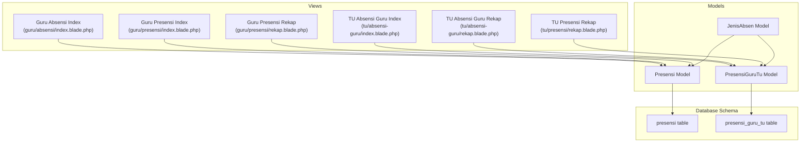

**Diagram sources**
- [index.blade.php](file://resources/views/guru/absensi/index.blade.php)
- [index.blade.php](file://resources/views/tu/absensi-guru/index.blade.php)
- [rekap.blade.php](file://resources/views/tu/absensi-guru/rekap.blade.php)
- [index.blade.php](file://resources/views/guru/presensi/index.blade.php)
- [rekap.blade.php](file://resources/views/guru/presensi/rekap.blade.php)
- [rekap.blade.php](file://resources/views/tu/presensi/rekap.blade.php)
- [Presensi.php](file://app/Models/Presensi.php)
- [PresensiGuruTu.php](file://app/Models/PresensiGuruTu.php)
- [JenisAbsen.php](file://app/Models/JenisAbsen.php)
- [2026_06_01_010820_create_presensi_table.php](file://database/migrations/2026_06_01_010820_create_presensi_table.php)
- [2026_06_10_090002_create_presensi_guru_tu_table.php](file://database/migrations/2026_06_10_090002_create_presensi_guru_tu_table.php)

**Section sources**
- [index.blade.php](file://resources/views/guru/absensi/index.blade.php)
- [index.blade.php](file://resources/views/tu/absensi-guru/index.blade.php)
- [rekap.blade.php](file://resources/views/tu/absensi-guru/rekap.blade.php)
- [index.blade.php](file://resources/views/guru/presensi/index.blade.php)
- [rekap.blade.php](file://resources/views/guru/presensi/rekap.blade.php)
- [rekap.blade.php](file://resources/views/tu/presensi/rekap.blade.php)

## Core Components
- Attendance record models:
  - Student attendance: Presensi model and presensi table
  - Staff attendance: PresensiGuruTu model and presensi_guru_tu table
- Attendance type classification: JenisAbsen model and related lookup/reference data
- Teacher interface:
  - Daily roll-call page for selecting class and date
  - Bulk entry page for capturing multiple students at once
  - Real-time updates via form submissions and refresh actions
- Reporting:
  - Class summary reports
  - Individual student history
- Integration points:
  - Class management (class selection)
  - Student enrollment tracking (active roster)
  - Analytics (trend analysis across dates and classes)

**Section sources**
- [Presensi.php](file://app/Models/Presensi.php)
- [PresensiGuruTu.php](file://app/Models/PresensiGuruTu.php)
- [JenisAbsen.php](file://app/Models/JenisAbsen.php)
- [2026_06_01_010820_create_presensi_table.php](file://database/migrations/2026_06_01_010820_create_presensi_table.php)
- [2026_06_10_090002_create_presensi_guru_tu_table.php](file://database/migrations/2026_06_10_090002_create_presensi_guru_tu_table.php)

## Architecture Overview
The attendance system follows a layered MVC pattern:
- Views render teacher and staff interfaces for roll-call and reporting
- Models encapsulate attendance data and relationships
- Database migrations define schema and constraints
- Controllers (not detailed here) orchestrate requests and responses

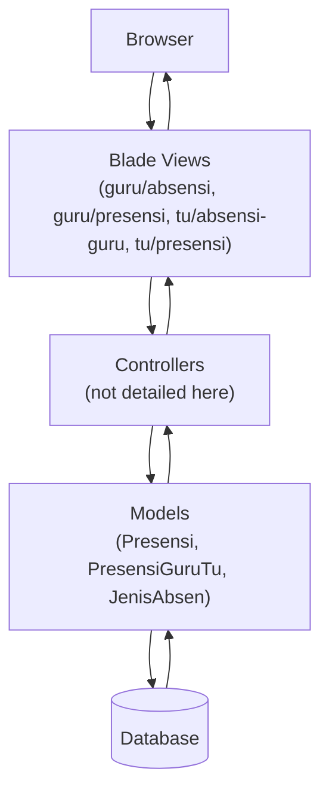

[No sources needed since this diagram shows conceptual workflow, not actual code structure]

## Detailed Component Analysis

### Attendance Record Models
Student and staff attendance are represented by dedicated models with associated tables. These models define relationships to classes, students, staff, and attendance types.

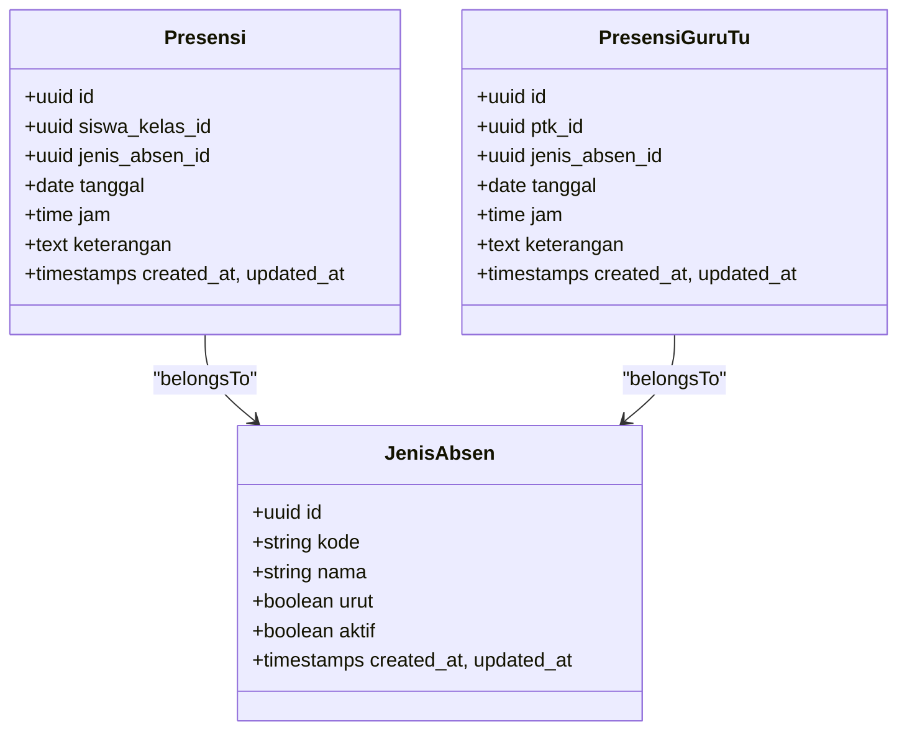

**Diagram sources**
- [Presensi.php](file://app/Models/Presensi.php)
- [PresensiGuruTu.php](file://app/Models/PresensiGuruTu.php)
- [JenisAbsen.php](file://app/Models/JenisAbsen.php)

**Section sources**
- [Presensi.php](file://app/Models/Presensi.php)
- [PresensiGuruTu.php](file://app/Models/PresensiGuruTu.php)
- [JenisAbsen.php](file://app/Models/JenisAbsen.php)

### Database Schema
The schema defines two primary tables for attendance:
- presensi: stores student attendance with foreign keys to student enrollment and attendance type
- presensi_guru_tu: stores staff attendance with foreign keys to staff and attendance type

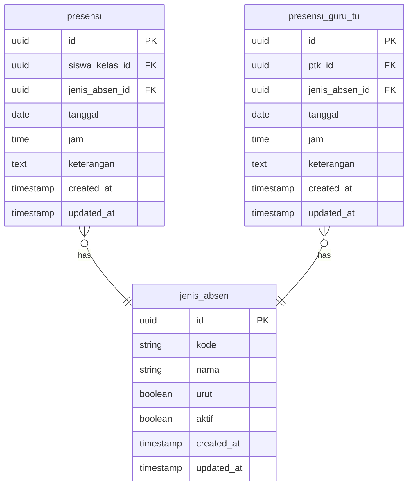

**Diagram sources**
- [2026_06_01_010820_create_presensi_table.php](file://database/migrations/2026_06_01_010820_create_presensi_table.php)
- [2026_06_10_090002_create_presensi_guru_tu_table.php](file://database/migrations/2026_06_10_090002_create_presensi_guru_tu_table.php)

**Section sources**
- [2026_06_01_010820_create_presensi_table.php](file://database/migrations/2026_06_01_010820_create_presensi_table.php)
- [2026_06_10_090002_create_presensi_guru_tu_table.php](file://database/migrations/2026_06_10_090002_create_presensi_guru_tu_table.php)

### Teacher Interface: Daily Roll Call
Teachers use the daily roll-call interface to mark attendance for students in a selected class and date. The process includes:
- Selecting class and date
- Loading enrolled students
- Marking present, absent, late, or excused
- Saving entries and refreshing the view

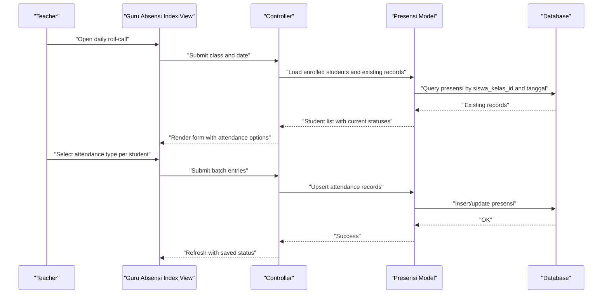

**Diagram sources**
- [index.blade.php](file://resources/views/guru/absensi/index.blade.php)
- [Presensi.php](file://app/Models/Presensi.php)

**Section sources**
- [index.blade.php](file://resources/views/guru/absensi/index.blade.php)
- [Presensi.php](file://app/Models/Presensi.php)

### Bulk Attendance Entry
Bulk entry allows teachers to quickly capture attendance for all students in a class on a given date. The workflow includes:
- Loading the class roster
- Applying a single attendance type to all students
- Persisting the batch records

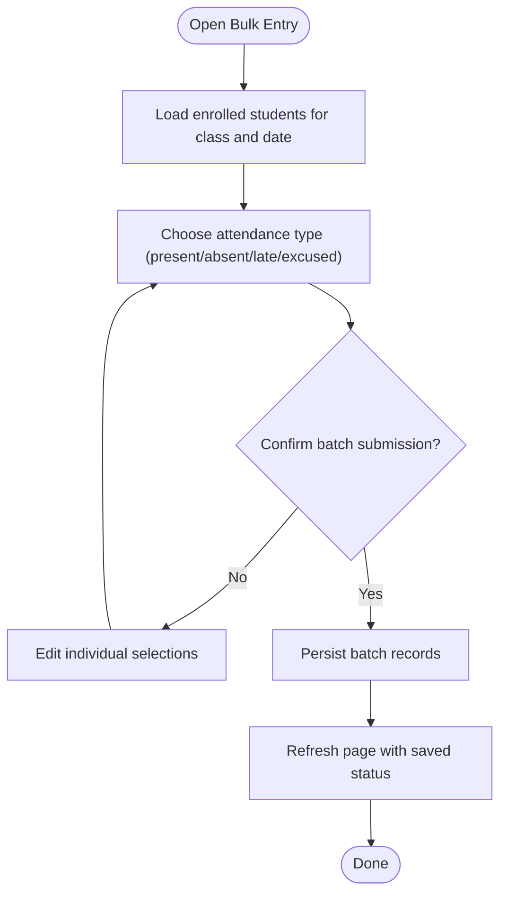

**Diagram sources**
- [index.blade.php](file://resources/views/guru/absensi/index.blade.php)
- [Presensi.php](file://app/Models/Presensi.php)

**Section sources**
- [index.blade.php](file://resources/views/guru/absensi/index.blade.php)
- [Presensi.php](file://app/Models/Presensi.php)

### Real-Time Attendance Updates
Real-time updates occur after saving individual or bulk entries. The system reflects new statuses immediately upon reload, ensuring accuracy and reducing re-keying.

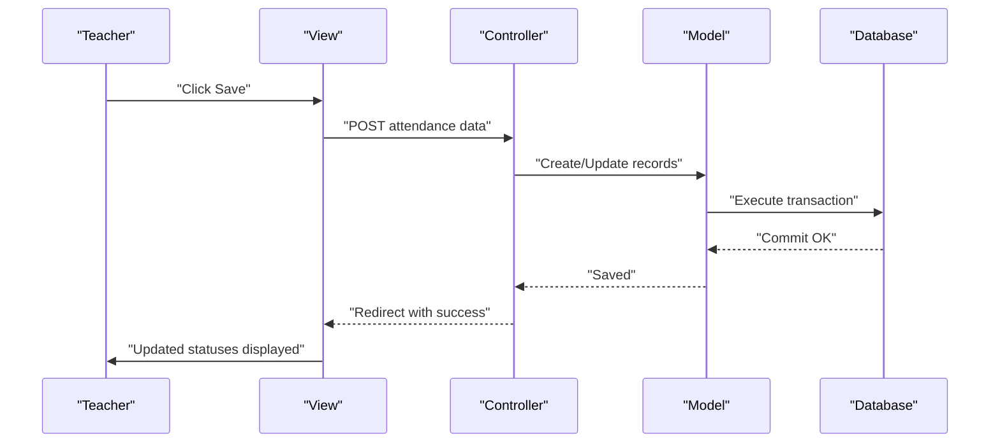

**Diagram sources**
- [index.blade.php](file://resources/views/guru/absensi/index.blade.php)
- [Presensi.php](file://app/Models/Presensi.php)

**Section sources**
- [index.blade.php](file://resources/views/guru/absensi/index.blade.php)
- [Presensi.php](file://app/Models/Presensi.php)

### Absence Types and Configuration
Attendance types are defined by the JenisAbsen model and include categories such as present, absent, late, and excused. These types are referenced by attendance records to categorize entries consistently.

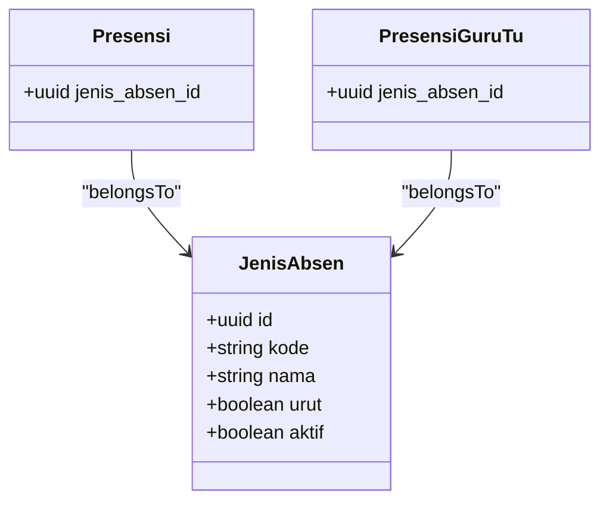

**Diagram sources**
- [JenisAbsen.php](file://app/Models/JenisAbsen.php)
- [Presensi.php](file://app/Models/Presensi.php)
- [PresensiGuruTu.php](file://app/Models/PresensiGuruTu.php)

**Section sources**
- [JenisAbsen.php](file://app/Models/JenisAbsen.php)
- [Presensi.php](file://app/Models/Presensi.php)
- [PresensiGuruTu.php](file://app/Models/PresensiGuruTu.php)

### Reporting Features
Reporting includes:
- Class summary displays: totals for each attendance type per class and date
- Individual student attendance history: chronological view of a student’s attendance records
- Staff attendance reporting: similar summaries for teachers and staff

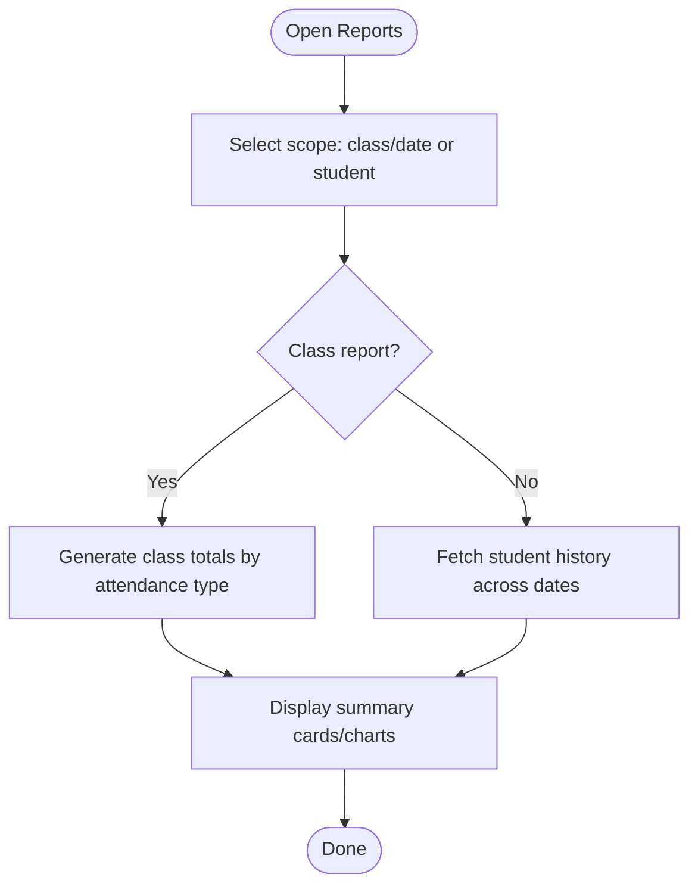

**Diagram sources**
- [index.blade.php](file://resources/views/guru/presensi/index.blade.php)
- [rekap.blade.php](file://resources/views/guru/presensi/rekap.blade.php)
- [rekap.blade.php](file://resources/views/tu/presensi/rekap.blade.php)
- [index.blade.php](file://resources/views/tu/absensi-guru/index.blade.php)
- [rekap.blade.php](file://resources/views/tu/absensi-guru/rekap.blade.php)

**Section sources**
- [index.blade.php](file://resources/views/guru/presensi/index.blade.php)
- [rekap.blade.php](file://resources/views/guru/presensi/rekap.blade.php)
- [rekap.blade.php](file://resources/views/tu/presensi/rekap.blade.php)
- [index.blade.php](file://resources/views/tu/absensi-guru/index.blade.php)
- [rekap.blade.php](file://resources/views/tu/absensi-guru/rekap.blade.php)

### Integration with Class Management and Enrollment
- Class selection drives the roll-call interface, ensuring only enrolled students appear for attendance
- Student enrollment tracking ensures only active students in a class are included
- Attendance analytics leverage class and student data to compute summaries and trends

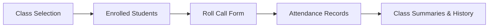

[No sources needed since this diagram shows conceptual workflow, not actual code structure]

## Dependency Analysis
The attendance system exhibits clear separation of concerns:
- Views depend on controllers and models to render and submit data
- Models encapsulate domain logic and enforce referential integrity via foreign keys
- Migrations define schema dependencies and constraints
- Attendance types (JenisAbsen) are shared across student and staff attendance records

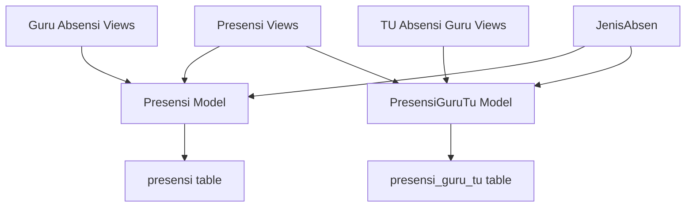

**Diagram sources**
- [index.blade.php](file://resources/views/guru/absensi/index.blade.php)
- [index.blade.php](file://resources/views/tu/absensi-guru/index.blade.php)
- [index.blade.php](file://resources/views/guru/presensi/index.blade.php)
- [Presensi.php](file://app/Models/Presensi.php)
- [PresensiGuruTu.php](file://app/Models/PresensiGuruTu.php)
- [JenisAbsen.php](file://app/Models/JenisAbsen.php)
- [2026_06_01_010820_create_presensi_table.php](file://database/migrations/2026_06_01_010820_create_presensi_table.php)
- [2026_06_10_090002_create_presensi_guru_tu_table.php](file://database/migrations/2026_06_10_090002_create_presensi_guru_tu_table.php)

**Section sources**
- [Presensi.php](file://app/Models/Presensi.php)
- [PresensiGuruTu.php](file://app/Models/PresensiGuruTu.php)
- [JenisAbsen.php](file://app/Models/JenisAbsen.php)
- [2026_06_01_010820_create_presensi_table.php](file://database/migrations/2026_06_01_010820_create_presensi_table.php)
- [2026_06_10_090002_create_presensi_guru_tu_table.php](file://database/migrations/2026_06_10_090002_create_presensi_guru_tu_table.php)

## Performance Considerations
- Batch operations: Prefer bulk entry for large classes to minimize round-trips
- Indexing: Ensure foreign keys and composite indexes (e.g., siswa_kelas_id + tanggal) are indexed for fast lookups
- Pagination: For long histories, implement pagination in reporting views
- Caching: Cache frequently accessed attendance types (JenisAbsen) to reduce database queries
- Transactions: Wrap batch saves in transactions to maintain consistency

[No sources needed since this section provides general guidance]

## Troubleshooting Guide
Common issues and resolutions:
- Duplicate entries: Verify uniqueness constraints and handle upsert logic carefully
- Incorrect student lists: Confirm class enrollment and active status filters
- Type mismatches: Ensure attendance type codes align with JenisAbsen definitions
- Date/time drift: Standardize timestamps and validate server timezone settings
- Permission errors: Confirm role-based access controls for teacher and staff views

**Section sources**
- [Presensi.php](file://app/Models/Presensi.php)
- [PresensiGuruTu.php](file://app/Models/PresensiGuruTu.php)
- [JenisAbsen.php](file://app/Models/JenisAbsen.php)

## Conclusion
The attendance management system provides a robust foundation for teachers and staff to track student and staff presence. Its modular design, clear data models, and integrated reporting support efficient daily operations and long-term analytics. By following best practices for batch entry, indexing, and validation, institutions can maintain accurate and reliable attendance records.

## Appendices

### Typical Workflows
- Daily roll call: Select class and date → load students → mark statuses → save → review updates
- Bulk entry: Select class and date → choose attendance type → apply to all → confirm and save
- Reporting: Navigate to reports → select scope → view summaries and histories

**Section sources**
- [index.blade.php](file://resources/views/guru/absensi/index.blade.php)
- [index.blade.php](file://resources/views/guru/presensi/index.blade.php)
- [rekap.blade.php](file://resources/views/guru/presensi/rekap.blade.php)
- [index.blade.php](file://resources/views/tu/absensi-guru/index.blade.php)
- [rekap.blade.php](file://resources/views/tu/absensi-guru/rekap.blade.php)
- [rekap.blade.php](file://resources/views/tu/presensi/rekap.blade.php)

### Best Practices for Accurate Record-Keeping
- Use standardized attendance types and ensure consistent labeling
- Regularly reconcile class rosters and enrollment status
- Train users on bulk entry and real-time update expectations
- Back up attendance data regularly and monitor audit trails

**Section sources**
- [JenisAbsen.php](file://app/Models/JenisAbsen.php)
- [07-ekstra-presensi.md](file://docs/manual-guru/07-ekstra-presensi.md)