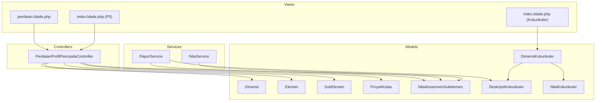
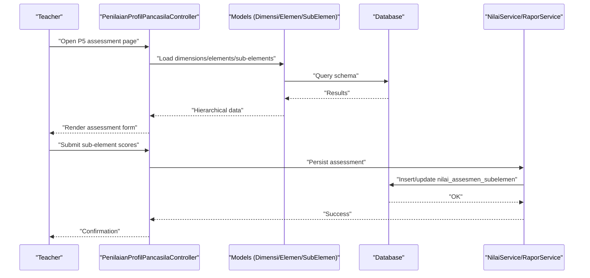
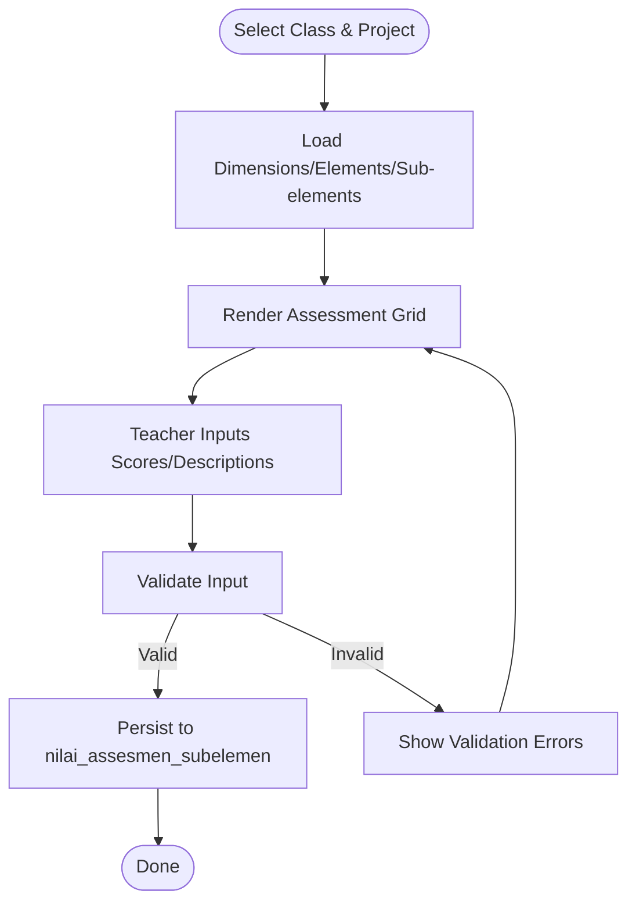
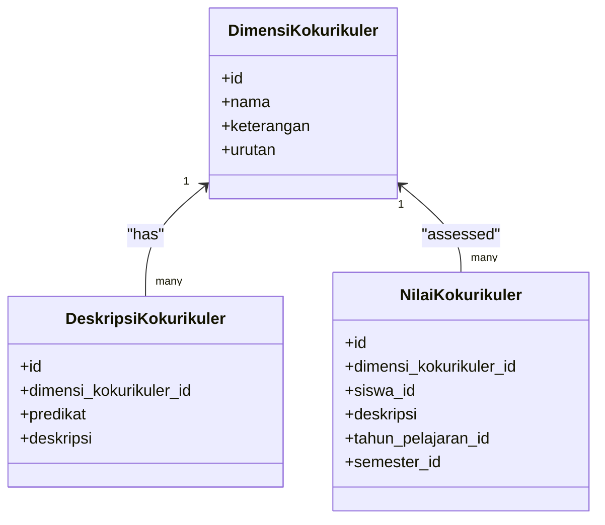
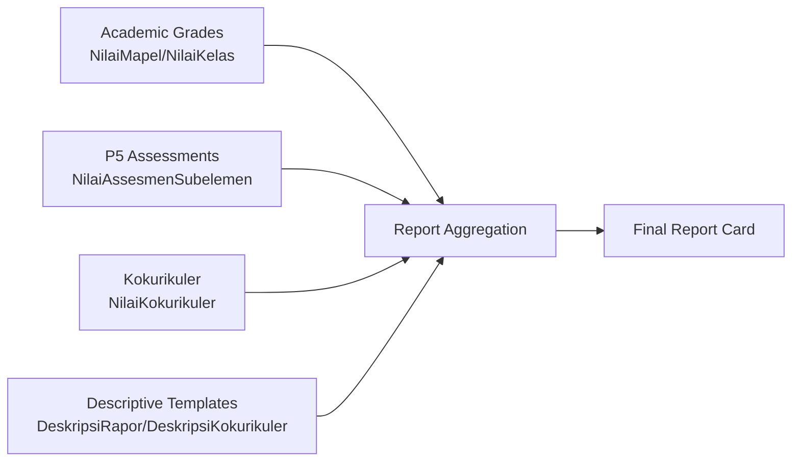
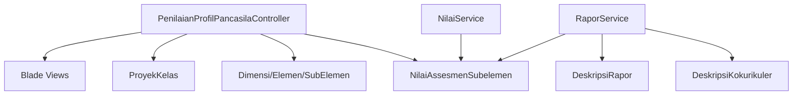

# Behavioral Assessment

<cite>
**Referenced Files in This Document**
- [PenilaianProfilPancasilaController.php](file://app/Http/Controllers/Guru/PenilaianProfilPancasilaController.php)
- [NilaiAssesmenSubelemen.php](file://app/Models/NilaiAssesmenSubelemen.php)
- [Dimensi.php](file://app/Models/Dimensi.php)
- [Elemen.php](file://app/Models/Elemen.php)
- [SubElemen.php](file://app/Models/SubElemen.php)
- [ProyekKelas.php](file://app/Models/ProyekKelas.php)
- [NilaiKokurikuler.php](file://app/Models/NilaiKokurikuler.php)
- [DimensiKokurikuler.php](file://app/Models/DimensiKokurikuler.php)
- [DeskripsiKokurikuler.php](file://app/Models/DeskripsiKokurikuler.php)
- [2026_06_01_010819_create_nilai_assesmen_subelemen_table.php](file://database/migrations/2026_06_01_010819_create_nilai_assesmen_subelemen_table.php)
- [2026_06_01_010809_create_deskripsi_kokurikuler_table.php](file://database/migrations/2026_06_01_010809_create_deskripsi_kokurikuler_table.php)
- [penilaian.blade.php](file://resources/views/guru/penilaian-profil-pancasila/penilaian.blade.php)
- [index.blade.php](file://resources/views/guru/penilaian-profil-pancasila/index.blade.php)
- [index.blade.php](file://resources/views/guru/kokurikuler/index.blade.php)
- [06-kokurikuler.md](file://docs/manual-guru/06-kokurikuler.md)
- [05-p5-profil-pancasila.md](file://docs/manual-guru/05-p5-profil-pancasila.md)
- [05-p5-kokurikuler.md](file://docs/manual-tu/05-p5-kokurikuler.md)
- [PRD-rapor-migrasi.md](file://PRD-rapor-migrasi.md)
- [NilaiService.php](file://app/Services/NilaiService.php)
- [RaporService.php](file://app/Services/RaporService.php)
- [NilaiKelas.php](file://app/Models/NilaiKelas.php)
- [NilaiMapel.php](file://app/Models/NilaiMapel.php)
- [CatatanWali.php](file://app/Models/CatatanWali.php)
- [DeskripsiRapor.php](file://app/Models/DeskripsiRapor.php)
- [PembagianRaport.php](file://app/Models/PembagianRaport.php)
- [2026_06_01_010809_create_deskripsi_rapor_table.php](file://database/migrations/2026_06_01_010809_create_deskripsi_rapor_table.php)
- [2026_06_01_010819_create_nilai_kokurikuler_table.php](file://database/migrations/2026_06_01_010819_create_nilai_kokurikuler_table.php)
- [2026_06_01_010818_create_nilai_kelas_table.php](file://database/migrations/2026_06_01_010818_create_nilai_kelas_table.php)
- [2026_06_01_010817_create_nilai_mapel_table.php](file://database/migrations/2026_06_01_010817_create_nilai_mapel_table.php)
- [2026_06_01_010820_create_catatan_wali_table.php](file://database/migrations/2026_06_01_010820_create_catatan_wali_table.php)
- [2026_06_01_010810_create_pembagian_raport_table.php](file://database/migrations/2026_06_01_010810_create_pembagian_raport_table.php)
</cite>

## Table of Contents
1. [Introduction](#introduction)
2. [Project Structure](#project-structure)
3. [Core Components](#core-components)
4. [Architecture Overview](#architecture-overview)
5. [Detailed Component Analysis](#detailed-component-analysis)
6. [Dependency Analysis](#dependency-analysis)
7. [Performance Considerations](#performance-considerations)
8. [Troubleshooting Guide](#troubleshooting-guide)
9. [Conclusion](#conclusion)
10. [Appendices](#appendices)

## Introduction
This document describes the behavioral assessment capabilities in RaporKM Laravel, focusing on:
- Character development evaluation via the Pancasila Profil (P5) system
- Co-curricular (non-academic) activity assessments
- Student behavior tracking across dimensions and elements
- Integration with report card generation and progress tracking
- Parent communication features

It consolidates functional workflows, evaluation standards, rubrics, and best practices derived from the codebase and official documentation.

## Project Structure
The behavioral assessment domain spans controllers, models, views, migrations, services, and documentation. Key areas:
- Controllers: manage teacher and TU workflows for P5 and kokurikuler
- Models: define domain entities and relationships
- Views: present assessment forms and dashboards
- Migrations: define database schema for assessments and reports
- Services: encapsulate business logic for grading and report generation
- Docs: procedural manuals for TU and teacher roles

**Diagram sources**
- [PenilaianProfilPancasilaController.php:1-42](file://app/Http/Controllers/Guru/PenilaianProfilPancasilaController.php#L1-L42)
- [Dimensi.php](file://app/Models/Dimensi.php)
- [Elemen.php](file://app/Models/Elemen.php)
- [SubElemen.php](file://app/Models/SubElemen.php)
- [ProyekKelas.php](file://app/Models/ProyekKelas.php)
- [NilaiAssesmenSubelemen.php](file://app/Models/NilaiAssesmenSubelemen.php)
- [DimensiKokurikuler.php](file://app/Models/DimensiKokurikuler.php)
- [DeskripsiKokurikuler.php](file://app/Models/DeskripsiKokurikuler.php)
- [NilaiKokurikuler.php](file://app/Models/NilaiKokurikuler.php)
- [NilaiService.php](file://app/Services/NilaiService.php)
- [RaporService.php](file://app/Services/RaporService.php)
- [penilaian.blade.php:1-39](file://resources/views/guru/penilaian-profil-pancasila/penilaian.blade.php#L1-L39)
- [index.blade.php:1-27](file://resources/views/guru/penilaian-profil-pancasila/index.blade.php#L1-L27)
- [index.blade.php:1-19](file://resources/views/guru/kokurikuler/index.blade.php#L1-L19)

**Section sources**
- [PenilaianProfilPancasilaController.php:1-42](file://app/Http/Controllers/Guru/PenilaianProfilPancasilaController.php#L1-L42)
- [PRD-rapor-migrasi.md:194-229](file://PRD-rapor-migrasi.md#L194-L229)

## Core Components
- Pancasila Profil (P5) assessment controller orchestrates selection of classes and projects, and renders assessment forms grouped by dimensions and elements.
- Kokurikuler assessment supports descriptive ratings per dimension with standardized predicates.
- Report card integration leverages shared grading and reporting services.

Key responsibilities:
- Validate teacher access to class/project
- Load dimensions, elements, and sub-elements for form rendering
- Persist sub-element assessments per student
- Generate descriptive reports and integrate with overall report card

**Section sources**
- [PenilaianProfilPancasilaController.php:15-42](file://app/Http/Controllers/Guru/PenilaianProfilPancasilaController.php#L15-L42)
- [06-kokurikuler.md:1-38](file://docs/manual-guru/06-kokurikuler.md#L1-L38)
- [05-p5-kokurikuler.md:75-91](file://docs/manual-tu/05-p5-kokurikuler.md#L75-L91)

## Architecture Overview
The behavioral assessment architecture follows MVC with service-layer support:
- Teachers select a class and project, then assess students per sub-element
- Data is persisted to assessment tables
- Reports aggregate academic and behavioral components

**Diagram sources**
- [PenilaianProfilPancasilaController.php:15-42](file://app/Http/Controllers/Guru/PenilaianProfilPancasilaController.php#L15-L42)
- [NilaiAssesmenSubelemen.php](file://app/Models/NilaiAssesmenSubelemen.php)
- [2026_06_01_010819_create_nilai_assesmen_subelemen_table.php:14-31](file://database/migrations/2026_06_01_010819_create_nilai_assesmen_subelemen_table.php#L14-L31)
- [NilaiService.php](file://app/Services/NilaiService.php)

## Detailed Component Analysis

### Pancasila Profil (P5) Assessment System
- Purpose: Evaluate students against six dimensions of Pancasila with elements and sub-elements
- Workflow:
  - Teacher selects class and project
  - System displays dimensions → elements → sub-elements → students
  - Teacher inputs scores/descriptions per sub-element per student
  - Data stored in nilai_assesmen_subelemen

**Diagram sources**
- [penilaian.blade.php:19-39](file://resources/views/guru/penilaian-profil-pancasila/penilaian.blade.php#L19-L39)
- [2026_06_01_010819_create_nilai_assesmen_subelemen_table.php:14-31](file://database/migrations/2026_06_01_010819_create_nilai_assesmen_subelemen_table.php#L14-L31)

Assessment criteria and rubrics:
- Scoring is captured per sub-element with a textual value and optional description
- Predicates for kokurikuler are standardized (e.g., "Sangat Baik", "Baik", "Cukup", "Perlu Bimbingan")

Best practices:
- Ensure consistent interpretation of sub-element descriptors across teachers
- Provide training materials and exemplars for each sub-element
- Use descriptive feedback to guide improvement

**Section sources**
- [PenilaianProfilPancasilaController.php:15-42](file://app/Http/Controllers/Guru/PenilaianProfilPancasilaController.php#L15-L42)
- [Dimensi.php](file://app/Models/Dimensi.php)
- [Elemen.php](file://app/Models/Elemen.php)
- [SubElemen.php](file://app/Models/SubElemen.php)
- [ProyekKelas.php](file://app/Models/ProyekKelas.php)
- [NilaiAssesmenSubelemen.php](file://app/Models/NilaiAssesmenSubelemen.php)
- [2026_06_01_010819_create_nilai_assesmen_subelemen_table.php:14-31](file://database/migrations/2026_06_01_010819_create_nilai_assesmen_subelemen_table.php#L14-L31)
- [05-p5-profil-pancasila.md](file://docs/manual-guru/05-p5-profil-pancasila.md)

### Co-Curricular (Kokurikuler) Assessment
- Purpose: Capture descriptive progress per dimension (e.g., leadership, creativity, physical fitness)
- Setup:
  - TU manages kokurikuler dimensions and descriptive templates per predicate
  - Teachers assess students per dimension with descriptive text
- Data model:
  - DimensiKokurikuler defines dimensions
  - DeskripsiKokurikuler defines templates for each predicate
  - NilaiKokurikuler stores teacher-entered assessments per student

**Diagram sources**
- [DimensiKokurikuler.php](file://app/Models/DimensiKokurikuler.php)
- [DeskripsiKokurikuler.php](file://app/Models/DeskripsiKokurikuler.php)
- [NilaiKokurikuler.php](file://app/Models/NilaiKokurikuler.php)
- [2026_06_01_010809_create_deskripsi_kokurikuler_table.php:14-23](file://database/migrations/2026_06_01_010809_create_deskripsi_kokurikuler_table.php#L14-L23)
- [2026_06_01_010819_create_nilai_kokurikuler_table.php](file://database/migrations/2026_06_01_010819_create_nilai_kokurikuler_table.php)

Assessment criteria and rubrics:
- Predicates are standardized: "Sangat Baik", "Baik", "Cukup", "Perlu Bimbingan"
- Descriptive templates are maintained centrally by TU for consistency

Best practices:
- Align descriptive templates with school values and expectations
- Train teachers on using objective, constructive language
- Review and update templates periodically

**Section sources**
- [index.blade.php:1-19](file://resources/views/guru/kokurikuler/index.blade.php#L1-L19)
- [06-kokurikuler.md:1-38](file://docs/manual-guru/06-kokurikuler.md#L1-L38)
- [05-p5-kokurikuler.md:75-91](file://docs/manual-tu/05-p5-kokurikuler.md#L75-L91)

### Report Card Integration and Progress Tracking
- Academic and behavioral data are integrated into report cards
- Descriptive templates for report grades are managed separately
- Progress tracking leverages repeated assessments across semesters

**Diagram sources**
- [NilaiMapel.php](file://app/Models/NilaiMapel.php)
- [NilaiKelas.php](file://app/Models/NilaiKelas.php)
- [NilaiAssesmenSubelemen.php](file://app/Models/NilaiAssesmenSubelemen.php)
- [NilaiKokurikuler.php](file://app/Models/NilaiKokurikuler.php)
- [DeskripsiRapor.php](file://app/Models/DeskripsiRapor.php)
- [2026_06_01_010809_create_deskripsi_rapor_table.php](file://database/migrations/2026_06_01_010809_create_deskripsi_rapor_table.php)
- [2026_06_01_010818_create_nilai_kelas_table.php](file://database/migrations/2026_06_01_010818_create_nilai_kelas_table.php)
- [2026_06_01_010817_create_nilai_mapel_table.php](file://database/migrations/2026_06_01_010817_create_nilai_mapel_table.php)
- [2026_06_01_010820_create_catatan_wali_table.php](file://database/migrations/2026_06_01_010820_create_catatan_wali_table.php)
- [2026_06_01_010810_create_pembagian_raport_table.php](file://database/migrations/2026_06_01_010810_create_pembagian_raport_table.php)

Parent communication:
- Notes and observations can be recorded for report inclusion
- Report distribution and sharing are configured via report division settings

**Section sources**
- [PRD-rapor-migrasi.md:194-229](file://PRD-rapor-migrasi.md#L194-L229)
- [CatatanWali.php](file://app/Models/CatatanWali.php)
- [PembagianRaport.php](file://app/Models/PembagianRaport.php)

## Dependency Analysis
- Controllers depend on models for hierarchical data retrieval and persistence
- Views render assessment grids based on loaded models
- Services encapsulate business logic for validation and aggregation
- Migrations define schema dependencies and foreign keys

**Diagram sources**
- [PenilaianProfilPancasilaController.php:1-42](file://app/Http/Controllers/Guru/PenilaianProfilPancasilaController.php#L1-L42)
- [NilaiService.php](file://app/Services/NilaiService.php)
- [RaporService.php](file://app/Services/RaporService.php)

**Section sources**
- [PRD-rapor-migrasi.md:194-229](file://PRD-rapor-migrasi.md#L194-L229)

## Performance Considerations
- Batch operations: Group submissions per project/class to minimize round-trips
- Pagination: For large classes, paginate student lists in assessment views
- Indexing: Ensure foreign keys (proyek_kelas_id, sub_elemen_id, siswa_id) are indexed
- Caching: Cache dimension/element metadata where appropriate
- Validation: Perform client-side validation to reduce server load

## Troubleshooting Guide
Common issues and resolutions:
- Access denied: Ensure the teacher is class wali for the selected class and project
- Missing kokurikuler data: Confirm TU has created dimensions and descriptive templates
- Assessment not saved: Verify required fields and predicate values match allowed sets
- Report missing behavior data: Confirm assessments were submitted for the current semester

**Section sources**
- [PenilaianProfilPancasilaController.php:22-29](file://app/Http/Controllers/Guru/PenilaianProfilPancasilaController.php#L22-L29)
- [06-kokurikuler.md:19-37](file://docs/manual-guru/06-kokurikuler.md#L19-L37)

## Conclusion
RaporKM provides structured pathways for assessing student character (P5) and co-curricular engagement (kokurikuler). By leveraging standardized predicates, hierarchical descriptors, and integrated report services, schools can maintain fairness and consistency while communicating meaningful progress to parents.

## Appendices

### Assessment Criteria and Rubrics Reference
- Pancasila Profil (P5):
  - Sub-element scores captured per student
  - Optional descriptive comments encouraged
- Kokurikuler:
  - Predicates: "Sangat Baik", "Baik", "Cukup", "Perlu Bimbingan"
  - Descriptive templates managed centrally

**Section sources**
- [06-kokurikuler.md:27-36](file://docs/manual-guru/06-kokurikuler.md#L27-L36)
- [StoreDeskripsiKokurikulerRequest.php:14-21](file://app/Http/Requests/TU/Kokurikuler/StoreDeskripsiKokurikulerRequest.php#L14-L21)

### Best Practices Checklist
- Train teachers on P5 and kokurikuler frameworks
- Establish rubric alignment meetings across departments
- Regularly review and refine descriptive templates
- Monitor assessment completion rates and provide support
- Communicate report card timelines to parents