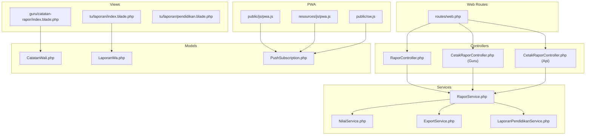
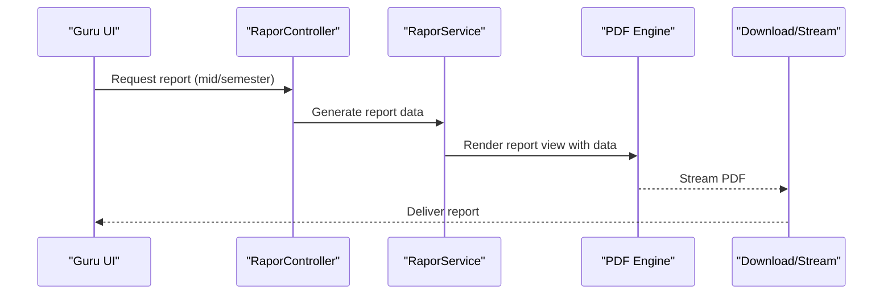
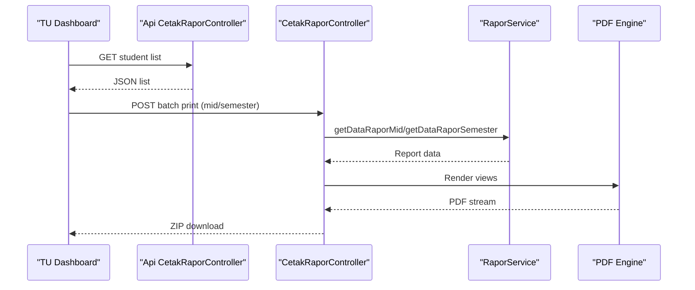
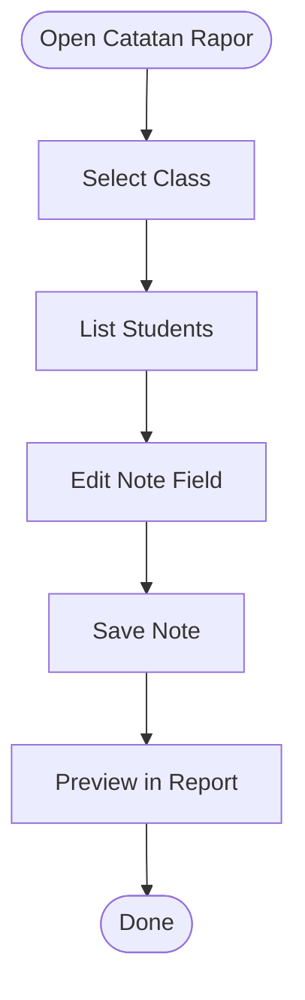
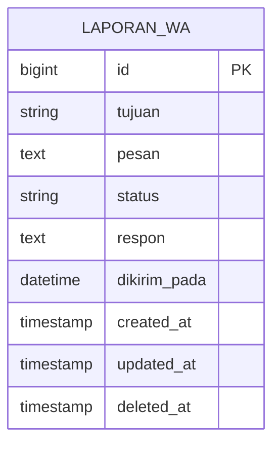
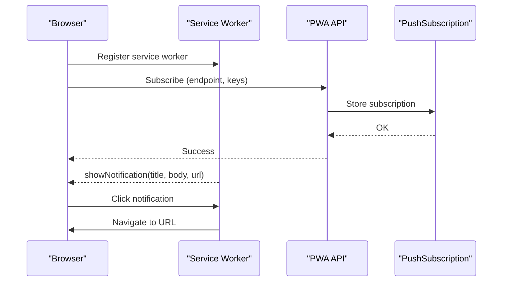
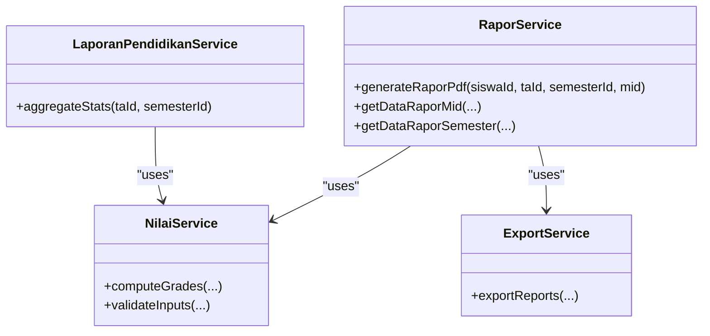
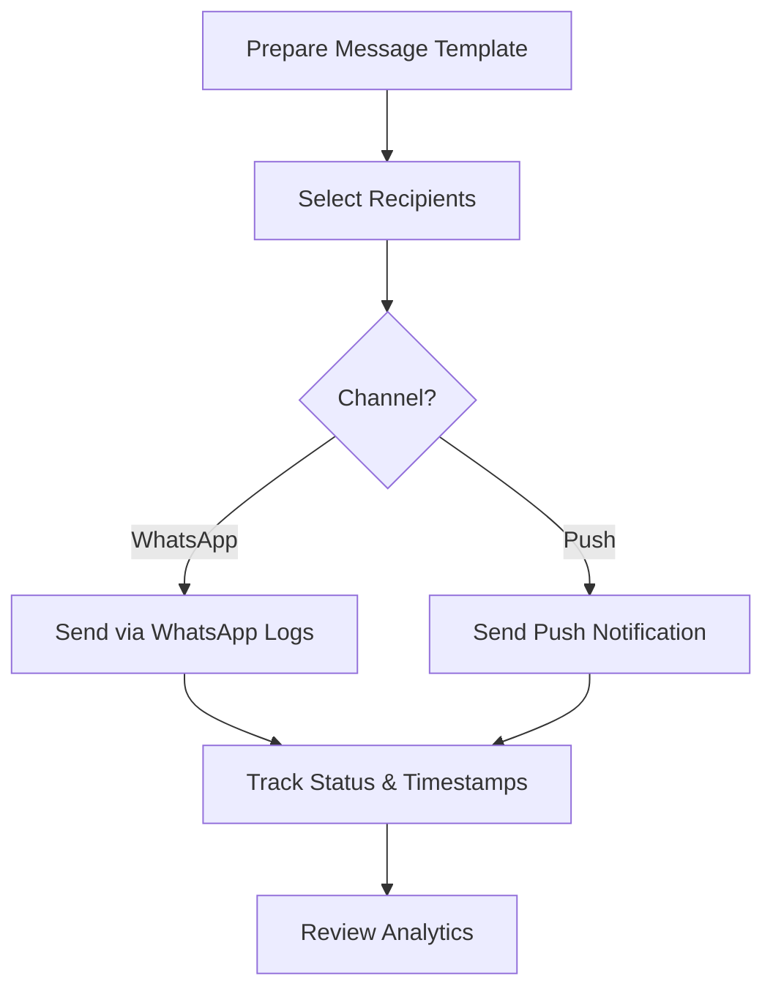
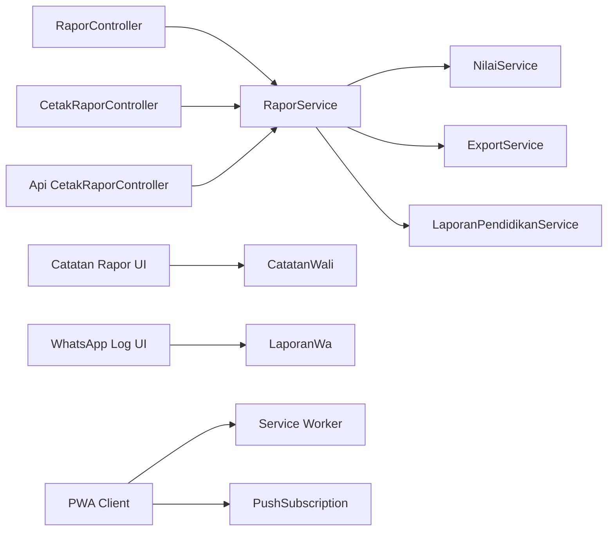

# Communication Tools

<cite>
**Referenced Files in This Document**
- [web.php](file://routes/web.php)
- [RaporController.php](file://app/Http/Controllers/RaporController.php)
- [CetakRaporController.php](file://app/Http/Controllers/Guru/CetakRaporController.php)
- [CetakRaporController.php (Api)](file://app/Http/Controllers/Api/V1/Tu/CetakRaporController.php)
- [index.blade.php](file://resources/views/tu/laporan/index.blade.php)
- [pendidikan.blade.php](file://resources/views/tu/laporan/pendidikan.blade.php)
- [index.blade.php (Catatan Rapor)](file://resources/views/guru/catatan-rapor/index.blade.php)
- [04-catatan-rapor.md](file://docs/manual-guru/04-catatan-rapor.md)
- [pwa.js](file://public/js/pwa.js)
- [pwa.js (Vue)](file://resources/js/pwa.js)
- [sw.js](file://public/sw.js)
- [2026_06_01_010810_create_laporan_wa_table.php](file://database/migrations/2026_06_01_010810_create_laporan_wa_table.php)
- [CatatanWali.php](file://app/Models/CatatanWali.php)
- [LaporanWa.php](file://app/Models/LaporanWa.php)
- [PushSubscription.php](file://app/Models/PushSubscription.php)
- [RaporService.php](file://app/Services/RaporService.php)
- [NilaiService.php](file://app/Services/NilaiService.php)
- [ExportService.php](file://app/Services/ExportService.php)
- [LaporanPendidikanService.php](file://app/Services/LaporanPendidikanService.php)
- [PengingatFactory.php](file://database/factories/PengingatFactory.php)
- [guru.blade.php](file://resources/views/layouts/guru.blade.php)
- [tu.blade.php](file://resources/views/layouts/tu.blade.php)
</cite>

## Table of Contents
1. [Introduction](#introduction)
2. [Project Structure](#project-structure)
3. [Core Components](#core-components)
4. [Architecture Overview](#architecture-overview)
5. [Detailed Component Analysis](#detailed-component-analysis)
6. [Dependency Analysis](#dependency-analysis)
7. [Performance Considerations](#performance-considerations)
8. [Troubleshooting Guide](#troubleshooting-guide)
9. [Conclusion](#conclusion)
10. [Appendices](#appendices)

## Introduction
This document explains the teacher communication and reporting tools within the system, focusing on:
- Parent-teacher communication pathways
- Progress report generation and printing
- Student feedback mechanisms (guardian notes)
- WhatsApp integration for automated notifications and analytics
- Real-time messaging and push notifications
- Integration between academic performance data and communication tools
- Templates and standardized messaging
- Best practices for professional communication

## Project Structure
The communication and reporting capabilities span controllers, services, models, views, and PWA-related assets. Key areas:
- Reporting and printing: RaporController, CetakRaporController, RaporService
- Communication logs and WhatsApp analytics: LaporanWa model and TU report page
- Guardian notes: CatatanWali model and Guru note-taking UI
- Push notifications: PWA service worker and subscription model
- Academic data integration: NilaiService and LaporanPendidikanService

**Diagram sources**
- [web.php](file://routes/web.php)
- [RaporController.php](file://app/Http/Controllers/RaporController.php)
- [CetakRaporController.php](file://app/Http/Controllers/Guru/CetakRaporController.php)
- [CetakRaporController.php (Api)](file://app/Http/Controllers/Api/V1/Tu/CetakRaporController.php)
- [RaporService.php](file://app/Services/RaporService.php)
- [NilaiService.php](file://app/Services/NilaiService.php)
- [ExportService.php](file://app/Services/ExportService.php)
- [LaporanPendidikanService.php](file://app/Services/LaporanPendidikanService.php)
- [CatatanWali.php](file://app/Models/CatatanWali.php)
- [LaporanWa.php](file://app/Models/LaporanWa.php)
- [PushSubscription.php](file://app/Models/PushSubscription.php)
- [index.blade.php](file://resources/views/tu/laporan/index.blade.php)
- [index.blade.php (Catatan Rapor)](file://resources/views/guru/catatan-rapor/index.blade.php)
- [pendidikan.blade.php](file://resources/views/tu/laporan/pendidikan.blade.php)
- [pwa.js](file://public/js/pwa.js)
- [pwa.js (Vue)](file://resources/js/pwa.js)
- [sw.js](file://public/sw.js)

**Section sources**
- [web.php](file://routes/web.php)
- [RaporController.php](file://app/Http/Controllers/RaporController.php)
- [CetakRaporController.php](file://app/Http/Controllers/Guru/CetakRaporController.php)
- [CetakRaporController.php (Api)](file://app/Http/Controllers/Api/V1/Tu/CetakRaporController.php)
- [RaporService.php](file://app/Services/RaporService.php)
- [index.blade.php](file://resources/views/tu/laporan/index.blade.php)
- [index.blade.php (Catatan Rapor)](file://resources/views/guru/catatan-rapor/index.blade.php)
- [pwa.js](file://public/js/pwa.js)
- [pwa.js (Vue)](file://resources/js/pwa.js)
- [sw.js](file://public/sw.js)

## Core Components
- Report generation and printing:
  - RaporController orchestrates PDF generation and selection between mid-year and semester reports.
  - CetakRaporController (Guru) and Api version support single and batch PDF generation and ZIP packaging.
  - RaporService integrates academic data to produce report content.
- Communication logs and WhatsApp analytics:
  - LaporanWa model stores WhatsApp send logs with status and timestamps.
  - TU report page displays historical WhatsApp activity for monitoring.
- Guardian notes:
  - CatatanWali model persists class teacher notes included in reports.
  - Guru UI enables teachers to write, preview, and save notes per student.
- Push notifications:
  - PWA service worker handles push notifications and navigation on click.
  - PushSubscription model stores device subscriptions for targeted messaging.
- Academic data integration:
  - NilaiService and LaporanPendidikanService aggregate performance metrics for reporting and alerts.

**Section sources**
- [RaporController.php](file://app/Http/Controllers/RaporController.php)
- [CetakRaporController.php](file://app/Http/Controllers/Guru/CetakRaporController.php)
- [CetakRaporController.php (Api)](file://app/Http/Controllers/Api/V1/Tu/CetakRaporController.php)
- [RaporService.php](file://app/Services/RaporService.php)
- [2026_06_01_010810_create_laporan_wa_table.php](file://database/migrations/2026_06_01_010810_create_laporan_wa_table.php)
- [index.blade.php](file://resources/views/tu/laporan/index.blade.php)
- [CatatanWali.php](file://app/Models/CatatanWali.php)
- [index.blade.php (Catatan Rapor)](file://resources/views/guru/catatan-rapor/index.blade.php)
- [pwa.js](file://public/js/pwa.js)
- [sw.js](file://public/sw.js)
- [PushSubscription.php](file://app/Models/PushSubscription.php)
- [NilaiService.php](file://app/Services/NilaiService.php)
- [LaporanPendidikanService.php](file://app/Services/LaporanPendidikanService.php)

## Architecture Overview
The system integrates academic data with communication channels:
- Teachers write notes and generate reports via controllers and services.
- Reports are printed or streamed as PDFs.
- WhatsApp logs are maintained for analytics.
- Push notifications are delivered via PWA to subscribed devices.

**Diagram sources**
- [RaporController.php](file://app/Http/Controllers/RaporController.php)
- [RaporService.php](file://app/Services/RaporService.php)

## Detailed Component Analysis

### Report Generation and Printing
- RaporController:
  - Validates access by role and academic session.
  - Delegates PDF generation to RaporService and streams results.
- CetakRaporController (Guru):
  - Generates mid-year and semester PDFs per student.
  - Supports batch generation and ZIP packaging for class-wide distribution.
- CetakRaporController (Api):
  - Exposes student list for batch operations.
- RaporService:
  - Aggregates academic data (grades, competencies, descriptors).
  - Provides structured data for report views.

**Diagram sources**
- [CetakRaporController.php (Api)](file://app/Http/Controllers/Api/V1/Tu/CetakRaporController.php)
- [CetakRaporController.php](file://app/Http/Controllers/Guru/CetakRaporController.php)
- [RaporService.php](file://app/Services/RaporService.php)

**Section sources**
- [RaporController.php](file://app/Http/Controllers/RaporController.php)
- [CetakRaporController.php](file://app/Http/Controllers/Guru/CetakRaporController.php)
- [CetakRaporController.php (Api)](file://app/Http/Controllers/Api/V1/Tu/CetakRaporController.php)
- [RaporService.php](file://app/Services/RaporService.php)

### Guardian Notes and Feedback Mechanisms
- CatatanWali model:
  - Stores teacher notes linked to students and classes.
- Guru UI:
  - Lists students and allows inline note editing and saving.
  - Includes a preview workflow prior to report inclusion.

**Diagram sources**
- [index.blade.php (Catatan Rapor)](file://resources/views/guru/catatan-rapor/index.blade.php)
- [CatatanWali.php](file://app/Models/CatatanWali.php)

**Section sources**
- [index.blade.php (Catatan Rapor)](file://resources/views/guru/catatan-rapor/index.blade.php)
- [04-catatan-rapor.md](file://docs/manual-guru/04-catatan-rapor.md)
- [CatatanWali.php](file://app/Models/CatatanWali.php)

### WhatsApp Integration and Analytics
- LaporanWa model:
  - Tracks destination, message content, status, response, and sent timestamps.
- TU report page:
  - Displays WhatsApp log history with status badges and timestamps.
- Migration:
  - Defines the laporan_wa table schema.

**Diagram sources**
- [2026_06_01_010810_create_laporan_wa_table.php](file://database/migrations/2026_06_01_010810_create_laporan_wa_table.php)

**Section sources**
- [index.blade.php](file://resources/views/tu/laporan/index.blade.php)
- [2026_06_01_010810_create_laporan_wa_table.php](file://database/migrations/2026_06_01_010810_create_laporan_wa_table.php)
- [LaporanWa.php](file://app/Models/LaporanWa.php)

### Push Notifications and Real-Time Messaging
- PWA service worker:
  - Handles incoming push notifications and opens target URLs on click.
- PWA client scripts:
  - Subscribe/unsubscribe to push using VAPID keys.
  - Persist subscription state locally and sync with backend.
- PushSubscription model:
  - Stores device endpoints and keys for targeted messaging.

**Diagram sources**
- [pwa.js](file://public/js/pwa.js)
- [pwa.js (Vue)](file://resources/js/pwa.js)
- [sw.js](file://public/sw.js)
- [PushSubscription.php](file://app/Models/PushSubscription.php)

**Section sources**
- [pwa.js](file://public/js/pwa.js)
- [pwa.js (Vue)](file://resources/js/pwa.js)
- [sw.js](file://public/sw.js)
- [PushSubscription.php](file://app/Models/PushSubscription.php)

### Academic Data Integration and Reporting
- RaporService:
  - Integrates grades, descriptors, and competencies to build report content.
- LaporanPendidikanService:
  - Aggregates educational statistics for school-level reporting.
- NilaiService:
  - Provides grade computation and validation for report generation.
- ExportService:
  - Supports export of reports and related data.

**Diagram sources**
- [RaporService.php](file://app/Services/RaporService.php)
- [LaporanPendidikanService.php](file://app/Services/LaporanPendidikanService.php)
- [NilaiService.php](file://app/Services/NilaiService.php)
- [ExportService.php](file://app/Services/ExportService.php)

**Section sources**
- [RaporService.php](file://app/Services/RaporService.php)
- [LaporanPendidikanService.php](file://app/Services/LaporanPendidikanService.php)
- [NilaiService.php](file://app/Services/NilaiService.php)
- [ExportService.php](file://app/Services/ExportService.php)

### Communication Workflows and Templates
- Standardized messaging:
  - Use a consistent structure for progress updates and reminders.
  - Template pattern: student overview → strengths → improvement areas → suggestions.
- Automated notifications:
  - Combine push notifications and WhatsApp logs for multi-channel communication.
  - Schedule reminders via Pengingat entries and broadcast via push.

[No sources needed since this diagram shows conceptual workflow, not actual code structure]

## Dependency Analysis
- Controllers depend on Services for report generation and data aggregation.
- Views rely on models for rendering logs and notes.
- PWA client scripts depend on service worker and backend APIs for subscription lifecycle.
- Academic data services underpin report content and analytics.

**Diagram sources**
- [RaporController.php](file://app/Http/Controllers/RaporController.php)
- [CetakRaporController.php](file://app/Http/Controllers/Guru/CetakRaporController.php)
- [CetakRaporController.php (Api)](file://app/Http/Controllers/Api/V1/Tu/CetakRaporController.php)
- [RaporService.php](file://app/Services/RaporService.php)
- [NilaiService.php](file://app/Services/NilaiService.php)
- [ExportService.php](file://app/Services/ExportService.php)
- [LaporanPendidikanService.php](file://app/Services/LaporanPendidikanService.php)
- [index.blade.php (Catatan Rapor)](file://resources/views/guru/catatan-rapor/index.blade.php)
- [CatatanWali.php](file://app/Models/CatatanWali.php)
- [index.blade.php](file://resources/views/tu/laporan/index.blade.php)
- [LaporanWa.php](file://app/Models/LaporanWa.php)
- [pwa.js](file://public/js/pwa.js)
- [sw.js](file://public/sw.js)
- [PushSubscription.php](file://app/Models/PushSubscription.php)

**Section sources**
- [RaporController.php](file://app/Http/Controllers/RaporController.php)
- [CetakRaporController.php](file://app/Http/Controllers/Guru/CetakRaporController.php)
- [CetakRaporController.php (Api)](file://app/Http/Controllers/Api/V1/Tu/CetakRaporController.php)
- [RaporService.php](file://app/Services/RaporService.php)
- [NilaiService.php](file://app/Services/NilaiService.php)
- [ExportService.php](file://app/Services/ExportService.php)
- [LaporanPendidikanService.php](file://app/Services/LaporanPendidikanService.php)
- [index.blade.php (Catatan Rapor)](file://resources/views/guru/catatan-rapor/index.blade.php)
- [CatatanWali.php](file://app/Models/CatatanWali.php)
- [index.blade.php](file://resources/views/tu/laporan/index.blade.php)
- [LaporanWa.php](file://app/Models/LaporanWa.php)
- [pwa.js](file://public/js/pwa.js)
- [sw.js](file://public/sw.js)
- [PushSubscription.php](file://app/Models/PushSubscription.php)

## Performance Considerations
- Batch report generation:
  - Prefer ZIP packaging for class-wide downloads to reduce server load.
- Background synchronization:
  - Use PWA background sync for delayed submissions to minimize real-time overhead.
- Efficient queries:
  - Aggregate data in services to avoid N+1 queries during report rendering.
- Push notification scaling:
  - Limit broadcast size and segment recipients by role to manage push delivery costs.

[No sources needed since this section provides general guidance]

## Troubleshooting Guide
- Push notification not received:
  - Verify VAPID keys configured and browser permissions granted.
  - Confirm subscription stored in PushSubscription and local state synced.
- WhatsApp logs empty:
  - Ensure logs are populated after sending attempts; check migration schema.
- Report generation errors:
  - Validate academic session selection and user authorization in RaporController.
  - Confirm RaporService data availability for requested student and term.

**Section sources**
- [pwa.js](file://public/js/pwa.js)
- [sw.js](file://public/sw.js)
- [PushSubscription.php](file://app/Models/PushSubscription.php)
- [2026_06_01_010810_create_laporan_wa_table.php](file://database/migrations/2026_06_01_010810_create_laporan_wa_table.php)
- [RaporController.php](file://app/Http/Controllers/RaporController.php)
- [RaporService.php](file://app/Services/RaporService.php)

## Conclusion
The system provides a cohesive set of tools for teacher communication and reporting:
- Teachers can efficiently capture student feedback via guardian notes.
- Reports are generated from integrated academic data and exported for printing or distribution.
- WhatsApp logs enable transparency and analytics for automated parent notifications.
- Push notifications enhance real-time engagement through PWA technology.
Adopting standardized templates and scheduled reminders ensures consistent, timely communication with parents and guardians.

[No sources needed since this section summarizes without analyzing specific files]

## Appendices

### Best Practices for Professional Communication
- Keep messages concise, objective, and solution-oriented.
- Use templates for recurring communications while personalizing per student.
- Respect privacy by avoiding sensitive identifiers in shared messages.
- Confirm receipt and follow up on unresolved concerns.

[No sources needed since this section provides general guidance]