# Dashboard & Analytics

<cite>
**Referenced Files in This Document**
- [dashboard.blade.php](file://resources/views/dashboard.blade.php)
- [guru-dashboard.blade.php](file://resources/views/guru/dashboard.blade.php)
- [tu-dashboard.blade.php](file://resources/views/tu/dashboard.blade.php)
- [sidebar-guru.blade.php](file://resources/views/components/sidebar-guru.blade.php)
- [sidebar-tu.blade.php](file://resources/views/components/sidebar-tu.blade.php)
- [topbar-guru.blade.php](file://resources/views/components/topbar-guru.blade.php)
- [topbar.blade.php](file://resources/views/components/topbar.blade.php)
- [quick-action.blade.php](file://resources/views/components/quick-action.blade.php)
- [stat-card.blade.php](file://resources/views/components/stat-card.blade.php)
- [progress-card.blade.php](file://resources/views/components/progress-card.blade.php)
- [app-layout.blade.php](file://resources/views/layouts/app.blade.php)
- [guru.blade.php](file://resources/views/layouts/guru.blade.php)
- [tu.blade.php](file://resources/views/layouts/tu.blade.php)
- [datang-soon.blade.php](file://resources/views/guru/datang-soon.blade.php)
- [nav-link.blade.php](file://resources/views/components/nav-link.blade.php)
- [semester-switcher.blade.php](file://resources/views/components/semester-switcher.blade.php)
- [GuruMenuService.php](file://app/Services/GuruMenuService.php)
- [NilaiService.php](file://app/Services/NilaiService.php)
- [RaporService.php](file://app/Services/RaporService.php)
- [web.php](file://routes/web.php)
- [GuruController.php](file://app/Http/Controllers/Guru/GuruController.php)
- [TUController.php](file://app/Http/Controllers/TU/TUController.php)
- [UserController.php](file://app/Http/Controllers/UserController.php)
- [Setting.php](file://app/Models/Setting.php)
- [Kelas.php](file://app/Models/Kelas.php)
- [Siswa.php](file://app/Models/Siswa.php)
- [NilaiMapel.php](file://app/Models/NilaiMapel.php)
- [NilaiKelas.php](file://app/Models/NilaiKelas.php)
- [PembagianRaport.php](file://app/Models/PembagianRaport.php)
- [TahunPelajaran.php](file://app/Models/TahunPelajaran.php)
- [Semester.php](file://app/Models/Semester.php)
- [GuruMenuAkses.php](file://app/Models/GuruMenuAkses.php)
</cite>

## Table of Contents
1. [Introduction](#introduction)
2. [Project Structure](#project-structure)
3. [Core Components](#core-components)
4. [Architecture Overview](#architecture-overview)
5. [Detailed Component Analysis](#detailed-component-analysis)
6. [Dependency Analysis](#dependency-analysis)
7. [Performance Considerations](#performance-considerations)
8. [Troubleshooting Guide](#troubleshooting-guide)
9. [Conclusion](#conclusion)
10. [Appendices](#appendices)

## Introduction
This document describes the teacher and staff dashboard/analytics system built with Laravel and Blade. It covers the main dashboard interface, quick-access tools, personalized workflow shortcuts, class overview displays, student performance summaries, upcoming task notifications, menu customization, frequently accessed tools, workflow automation features, analytics integration, sidebar navigation, shortcut creation, and personalized layouts. It also includes practical examples for optimizing dashboard usage, setting up custom workflows, and leveraging analytics for instructional decision-making.

## Project Structure
The dashboard system is organized around role-specific layouts and views:
- Global dashboard templates and shared components reside under resources/views.
- Role-specific dashboards are located under resources/views/{role}/dashboard.blade.php.
- Shared components include quick actions, statistics cards, progress indicators, and navigation elements.
- Layouts define the base structure for teacher and staff dashboards.
- Services encapsulate analytics and workflow logic.
- Models represent domain entities such as classes, students, grades, and academic periods.

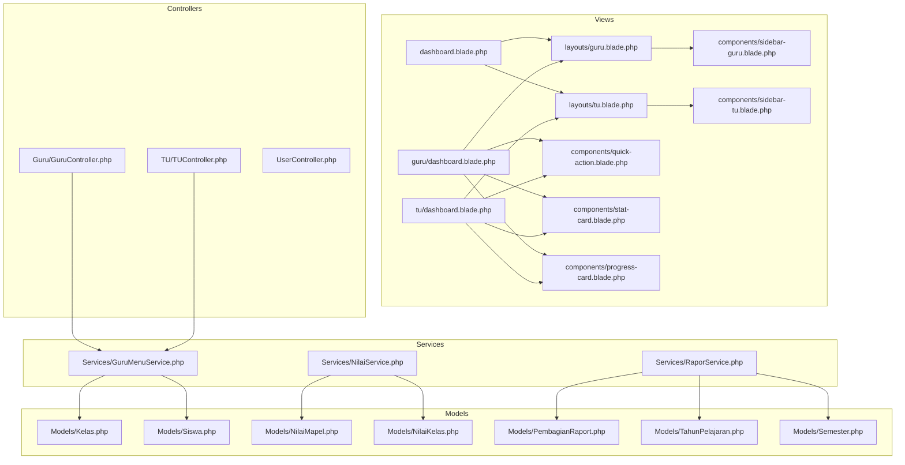

**Diagram sources**
- [dashboard.blade.php](file://resources/views/dashboard.blade.php)
- [guru-dashboard.blade.php](file://resources/views/guru/dashboard.blade.php)
- [tu-dashboard.blade.php](file://resources/views/tu/dashboard.blade.php)
- [guru.blade.php](file://resources/views/layouts/guru.blade.php)
- [tu.blade.php](file://resources/views/layouts/tu.blade.php)
- [sidebar-guru.blade.php](file://resources/views/components/sidebar-guru.blade.php)
- [sidebar-tu.blade.php](file://resources/views/components/sidebar-tu.blade.php)
- [quick-action.blade.php](file://resources/views/components/quick-action.blade.php)
- [stat-card.blade.php](file://resources/views/components/stat-card.blade.php)
- [progress-card.blade.php](file://resources/views/components/progress-card.blade.php)
- [GuruController.php](file://app/Http/Controllers/Guru/GuruController.php)
- [TUController.php](file://app/Http/Controllers/TU/TUController.php)
- [GuruMenuService.php](file://app/Services/GuruMenuService.php)
- [NilaiService.php](file://app/Services/NilaiService.php)
- [RaporService.php](file://app/Services/RaporService.php)
- [Kelas.php](file://app/Models/Kelas.php)
- [Siswa.php](file://app/Models/Siswa.php)
- [NilaiMapel.php](file://app/Models/NilaiMapel.php)
- [NilaiKelas.php](file://app/Models/NilaiKelas.php)
- [PembagianRaport.php](file://app/Models/PembagianRaport.php)
- [TahunPelajaran.php](file://app/Models/TahunPelajaran.php)
- [Semester.php](file://app/Models/Semester.php)

**Section sources**
- [dashboard.blade.php](file://resources/views/dashboard.blade.php)
- [guru-dashboard.blade.php](file://resources/views/guru/dashboard.blade.php)
- [tu-dashboard.blade.php](file://resources/views/tu/dashboard.blade.php)
- [guru.blade.php](file://resources/views/layouts/guru.blade.php)
- [tu.blade.php](file://resources/views/layouts/tu.blade.php)
- [sidebar-guru.blade.php](file://resources/views/components/sidebar-guru.blade.php)
- [sidebar-tu.blade.php](file://resources/views/components/sidebar-tu.blade.php)
- [quick-action.blade.php](file://resources/views/components/quick-action.blade.php)
- [stat-card.blade.php](file://resources/views/components/stat-card.blade.php)
- [progress-card.blade.php](file://resources/views/components/progress-card.blade.php)

## Core Components
- Role-specific dashboards:
  - Teacher dashboard template for displaying class lists, quick actions, analytics summaries, and upcoming tasks.
  - Staff dashboard template for administrative analytics and workflow shortcuts.
- Shared components:
  - Quick action buttons for frequent operations.
  - Statistic cards for class and performance metrics.
  - Progress cards for individual student progress tracking.
  - Navigation components for sidebar and topbar menus.
- Layouts:
  - Base layouts for teacher and staff roles, including shared header, sidebar, and content areas.
- Services:
  - Menu customization service for teachers.
  - Analytics services for grade and report calculations.
- Models:
  - Entities representing classes, students, subjects, grades, academic periods, and report distribution.

**Section sources**
- [guru-dashboard.blade.php](file://resources/views/guru/dashboard.blade.php)
- [tu-dashboard.blade.php](file://resources/views/tu/dashboard.blade.php)
- [quick-action.blade.php](file://resources/views/components/quick-action.blade.php)
- [stat-card.blade.php](file://resources/views/components/stat-card.blade.php)
- [progress-card.blade.php](file://resources/views/components/progress-card.blade.php)
- [guru.blade.php](file://resources/views/layouts/guru.blade.php)
- [tu.blade.php](file://resources/views/layouts/tu.blade.php)
- [GuruMenuService.php](file://app/Services/GuruMenuService.php)
- [NilaiService.php](file://app/Services/NilaiService.php)
- [RaporService.php](file://app/Services/RaporService.php)
- [Kelas.php](file://app/Models/Kelas.php)
- [Siswa.php](file://app/Models/Siswa.php)
- [NilaiMapel.php](file://app/Models/NilaiMapel.php)
- [NilaiKelas.php](file://app/Models/NilaiKelas.php)
- [PembagianRaport.php](file://app/Models/PembagianRaport.php)
- [TahunPelajaran.php](file://app/Models/TahunPelajaran.php)
- [Semester.php](file://app/Models/Semester.php)

## Architecture Overview
The dashboard architecture follows a layered MVC pattern:
- Controllers handle role-specific requests and delegate analytics to services.
- Services encapsulate business logic for menu customization, grade analytics, and report generation.
- Views render role-specific dashboards and reusable components.
- Models represent domain entities and relationships.

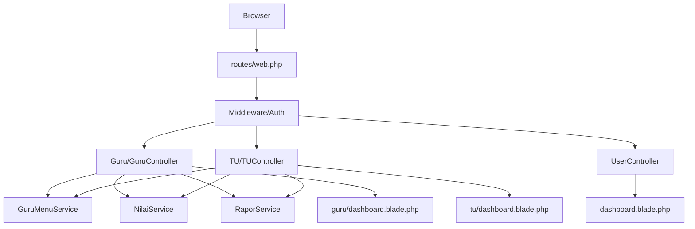

**Diagram sources**
- [web.php](file://routes/web.php)
- [GuruController.php](file://app/Http/Controllers/Guru/GuruController.php)
- [TUController.php](file://app/Http/Controllers/TU/TUController.php)
- [UserController.php](file://app/Http/Controllers/UserController.php)
- [GuruMenuService.php](file://app/Services/GuruMenuService.php)
- [NilaiService.php](file://app/Services/NilaiService.php)
- [RaporService.php](file://app/Services/RaporService.php)
- [dashboard.blade.php](file://resources/views/dashboard.blade.php)
- [guru-dashboard.blade.php](file://resources/views/guru/dashboard.blade.php)
- [tu-dashboard.blade.php](file://resources/views/tu/dashboard.blade.php)

## Detailed Component Analysis

### Teacher Dashboard Interface
The teacher dashboard presents:
- Class overview: Lists the teacher’s classes with quick links to class-specific tools.
- Personalized workflow shortcuts: Buttons for frequent tasks such as grading, attendance, reports, and extracurricular activities.
- Student performance summaries: Cards summarizing class averages, passing rates, and subject-specific insights.
- Upcoming task notifications: Alerts for deadlines, report distributions, and reminders.

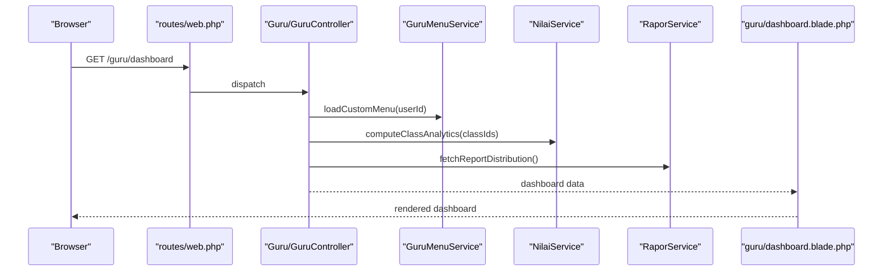

**Diagram sources**
- [web.php](file://routes/web.php)
- [GuruController.php](file://app/Http/Controllers/Guru/GuruController.php)
- [GuruMenuService.php](file://app/Services/GuruMenuService.php)
- [NilaiService.php](file://app/Services/NilaiService.php)
- [RaporService.php](file://app/Services/RaporService.php)
- [guru-dashboard.blade.php](file://resources/views/guru/dashboard.blade.php)

**Section sources**
- [guru-dashboard.blade.php](file://resources/views/guru/dashboard.blade.php)
- [GuruMenuService.php](file://app/Services/GuruMenuService.php)
- [NilaiService.php](file://app/Services/NilaiService.php)
- [RaporService.php](file://app/Services/RaporService.php)

### Staff Dashboard Interface
The staff dashboard focuses on administrative analytics:
- Class and student enrollment summaries.
- Report generation and distribution analytics.
- Workflow shortcuts for managing schedules, exports, and sync operations.

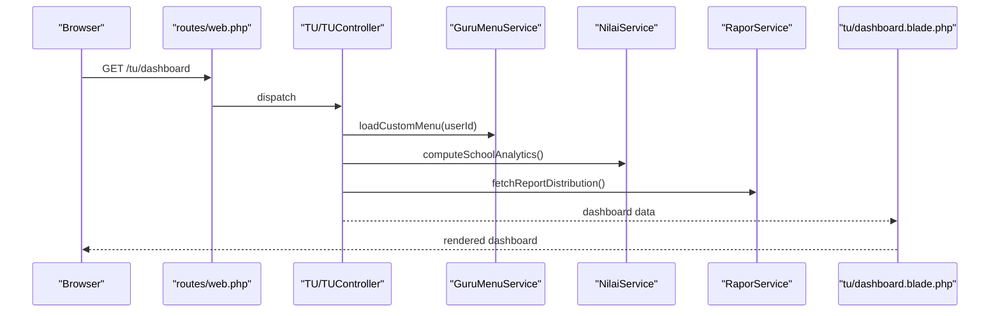

**Diagram sources**
- [web.php](file://routes/web.php)
- [TUController.php](file://app/Http/Controllers/TU/TUController.php)
- [GuruMenuService.php](file://app/Services/GuruMenuService.php)
- [NilaiService.php](file://app/Services/NilaiService.php)
- [RaporService.php](file://app/Services/RaporService.php)
- [tu-dashboard.blade.php](file://resources/views/tu/dashboard.blade.php)

**Section sources**
- [tu-dashboard.blade.php](file://resources/views/tu/dashboard.blade.php)
- [GuruMenuService.php](file://app/Services/GuruMenuService.php)
- [NilaiService.php](file://app/Services/NilaiService.php)
- [RaporService.php](file://app/Services/RaporService.php)

### Quick Access Tools and Personalized Shortcuts
Quick action components provide one-click access to common tasks. Personalized shortcuts are derived from menu customization services and saved user preferences.

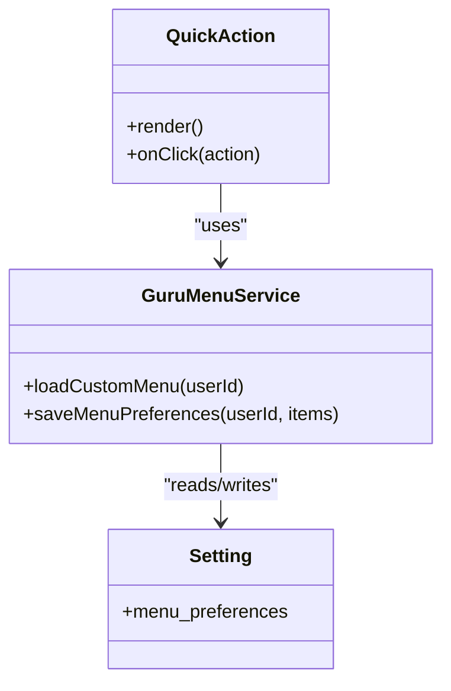

**Diagram sources**
- [quick-action.blade.php](file://resources/views/components/quick-action.blade.php)
- [GuruMenuService.php](file://app/Services/GuruMenuService.php)
- [Setting.php](file://app/Models/Setting.php)

**Section sources**
- [quick-action.blade.php](file://resources/views/components/quick-action.blade.php)
- [GuruMenuService.php](file://app/Services/GuruMenuService.php)
- [Setting.php](file://app/Models/Setting.php)

### Class Overview and Student Performance Summaries
Class overview displays class lists and performance summaries. Student performance summaries leverage grade analytics computed by services.

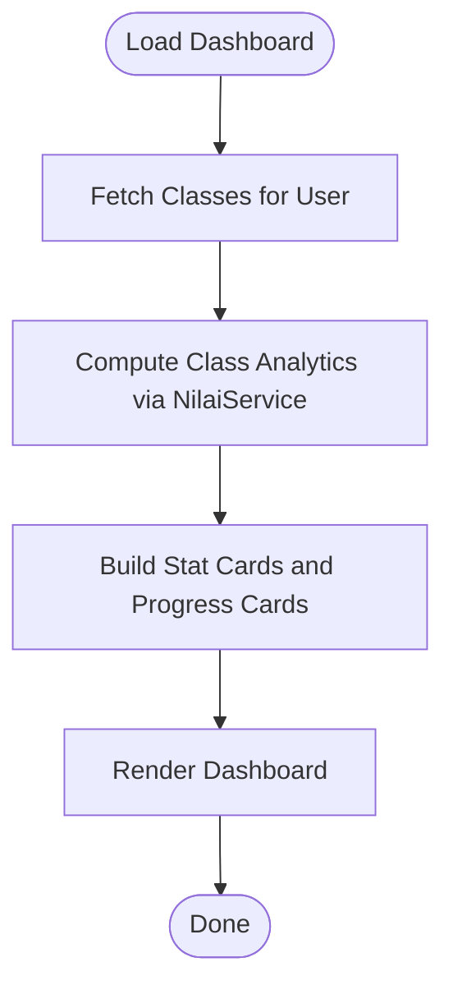

**Diagram sources**
- [NilaiService.php](file://app/Services/NilaiService.php)
- [stat-card.blade.php](file://resources/views/components/stat-card.blade.php)
- [progress-card.blade.php](file://resources/views/components/progress-card.blade.php)

**Section sources**
- [NilaiService.php](file://app/Services/NilaiService.php)
- [stat-card.blade.php](file://resources/views/components/stat-card.blade.php)
- [progress-card.blade.php](file://resources/views/components/progress-card.blade.php)

### Upcoming Task Notifications
Notifications surface deadlines and reminders. They are populated from report distribution schedules and user-specific tasks.

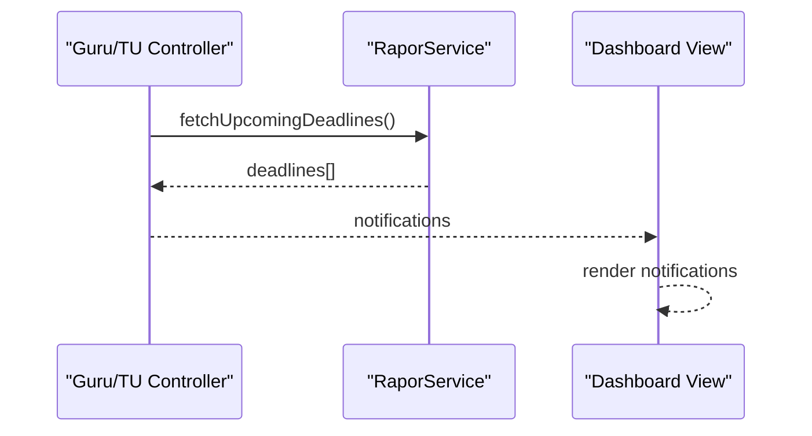

**Diagram sources**
- [RaporService.php](file://app/Services/RaporService.php)
- [guru-dashboard.blade.php](file://resources/views/guru/dashboard.blade.php)
- [tu-dashboard.blade.php](file://resources/views/tu/dashboard.blade.php)

**Section sources**
- [RaporService.php](file://app/Services/RaporService.php)
- [guru-dashboard.blade.php](file://resources/views/guru/dashboard.blade.php)
- [tu-dashboard.blade.php](file://resources/views/tu/dashboard.blade.php)

### Menu Customization and Frequently Accessed Tools
Menu customization allows teachers to tailor their dashboard by adding/removing frequently accessed tools. Preferences are stored and applied during dashboard rendering.

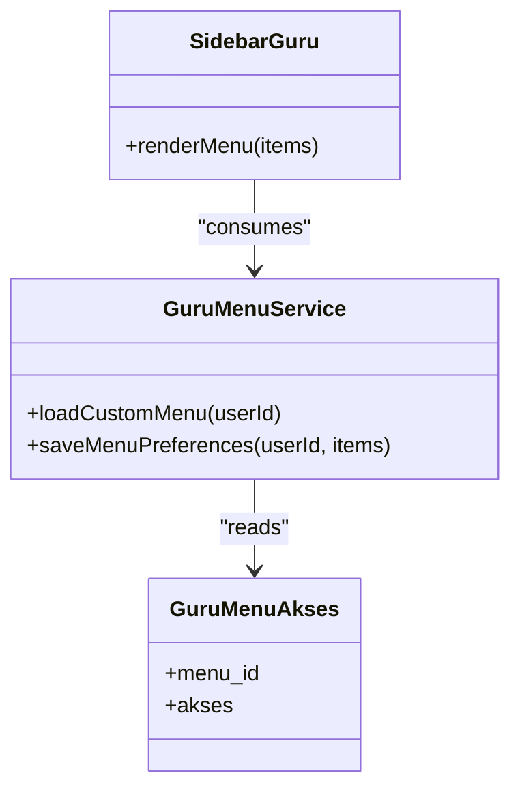

**Diagram sources**
- [GuruMenuAkses.php](file://app/Models/GuruMenuAkses.php)
- [GuruMenuService.php](file://app/Services/GuruMenuService.php)
- [sidebar-guru.blade.php](file://resources/views/components/sidebar-guru.blade.php)

**Section sources**
- [GuruMenuAkses.php](file://app/Models/GuruMenuAkses.php)
- [GuruMenuService.php](file://app/Services/GuruMenuService.php)
- [sidebar-guru.blade.php](file://resources/views/components/sidebar-guru.blade.php)

### Workflow Automation Features
Workflow automation integrates with services to streamline tasks such as report generation and grade aggregation. These features reduce manual effort and improve consistency.

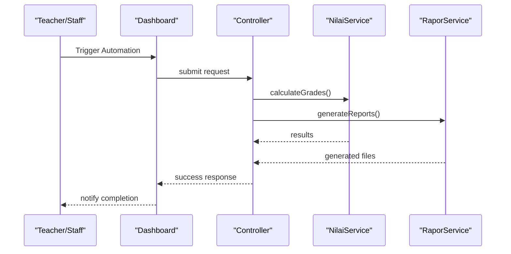

**Diagram sources**
- [NilaiService.php](file://app/Services/NilaiService.php)
- [RaporService.php](file://app/Services/RaporService.php)
- [guru-dashboard.blade.php](file://resources/views/guru/dashboard.blade.php)
- [tu-dashboard.blade.php](file://resources/views/tu/dashboard.blade.php)

**Section sources**
- [NilaiService.php](file://app/Services/NilaiService.php)
- [RaporService.php](file://app/Services/RaporService.php)
- [guru-dashboard.blade.php](file://resources/views/guru/dashboard.blade.php)
- [tu-dashboard.blade.php](file://resources/views/tu/dashboard.blade.php)

### Analytics Integration
Analytics integration provides:
- Class performance trends: aggregated grade analytics across semesters.
- Individual student progress tracking: per-student trend cards and progress indicators.
- Comparative analysis tools: compare class averages, subject performance, and cohort outcomes.

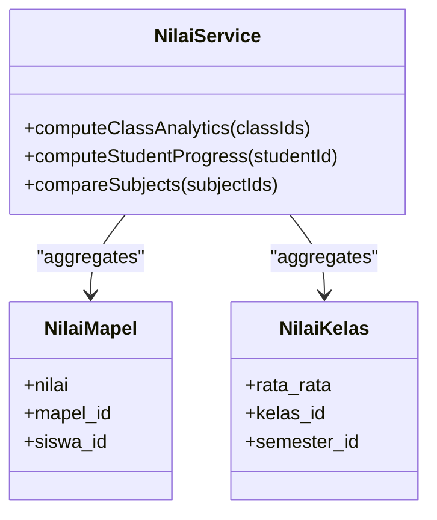

**Diagram sources**
- [NilaiService.php](file://app/Services/NilaiService.php)
- [NilaiMapel.php](file://app/Models/NilaiMapel.php)
- [NilaiKelas.php](file://app/Models/NilaiKelas.php)

**Section sources**
- [NilaiService.php](file://app/Services/NilaiService.php)
- [NilaiMapel.php](file://app/Models/NilaiMapel.php)
- [NilaiKelas.php](file://app/Models/NilaiKelas.php)

### Sidebar Navigation System
The sidebar organizes navigation by role:
- Teacher sidebar includes class navigation, grading tools, reports, and personal shortcuts.
- Staff sidebar includes administrative tools, exports, and system management.

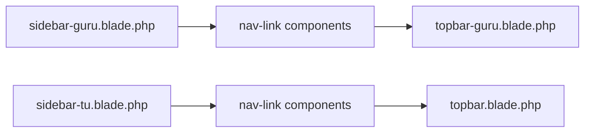

**Diagram sources**
- [sidebar-guru.blade.php](file://resources/views/components/sidebar-guru.blade.php)
- [sidebar-tu.blade.php](file://resources/views/components/sidebar-tu.blade.php)
- [nav-link.blade.php](file://resources/views/components/nav-link.blade.php)
- [topbar-guru.blade.php](file://resources/views/components/topbar-guru.blade.php)
- [topbar.blade.php](file://resources/views/components/topbar.blade.php)

**Section sources**
- [sidebar-guru.blade.php](file://resources/views/components/sidebar-guru.blade.php)
- [sidebar-tu.blade.php](file://resources/views/components/sidebar-tu.blade.php)
- [nav-link.blade.php](file://resources/views/components/nav-link.blade.php)
- [topbar-guru.blade.php](file://resources/views/components/topbar-guru.blade.php)
- [topbar.blade.php](file://resources/views/components/topbar.blade.php)

### Shortcut Creation and Personalized Layouts
Teachers can create and reorder shortcuts through menu customization. Personalized layouts adapt to user preferences and role-specific needs.

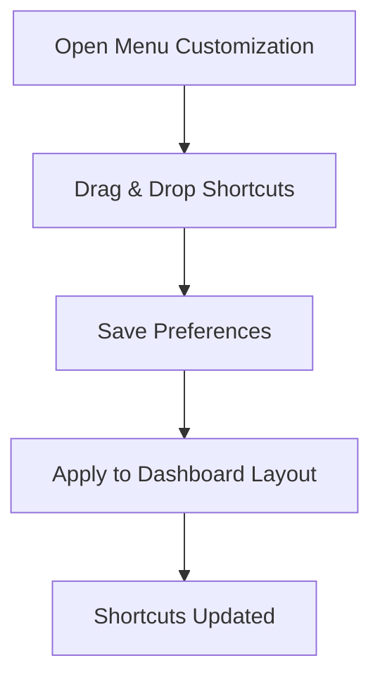

**Diagram sources**
- [GuruMenuService.php](file://app/Services/GuruMenuService.php)
- [GuruMenuAkses.php](file://app/Models/GuruMenuAkses.php)

**Section sources**
- [GuruMenuService.php](file://app/Services/GuruMenuService.php)
- [GuruMenuAkses.php](file://app/Models/GuruMenuAkses.php)

### Examples: Optimizing Dashboard Usage
- Use quick actions to batch-grade assessments and immediately update class analytics.
- Leverage progress cards to monitor at-risk students and schedule interventions.
- Customize the sidebar to prioritize frequently used tools for your role.
- Set up automated report generation to reduce end-of-term workload.

### Examples: Setting Up Custom Workflows
- Configure menu preferences to include shortcuts for attendance, grading, and report generation.
- Use semester switcher to compare performance across terms and adjust instruction accordingly.

### Examples: Leveraging Analytics for Instructional Decision-Making
- Review class performance trends to identify topics needing reinforcement.
- Track individual student progress to differentiate instruction and support struggling learners.
- Use comparative analysis to benchmark class performance against school averages.

**Section sources**
- [semester-switcher.blade.php](file://resources/views/components/semester-switcher.blade.php)
- [datang-soon.blade.php](file://resources/views/guru/datang-soon.blade.php)

## Dependency Analysis
The dashboard system exhibits clear separation of concerns:
- Controllers depend on services for analytics and workflow automation.
- Services depend on models for data retrieval and aggregation.
- Views depend on components and controllers for rendering.

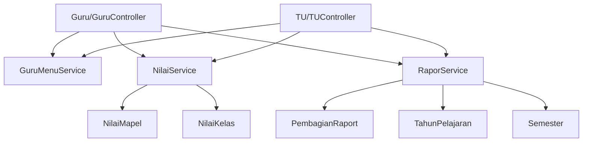

**Diagram sources**
- [GuruController.php](file://app/Http/Controllers/Guru/GuruController.php)
- [TUController.php](file://app/Http/Controllers/TU/TUController.php)
- [GuruMenuService.php](file://app/Services/GuruMenuService.php)
- [NilaiService.php](file://app/Services/NilaiService.php)
- [RaporService.php](file://app/Services/RaporService.php)
- [NilaiMapel.php](file://app/Models/NilaiMapel.php)
- [NilaiKelas.php](file://app/Models/NilaiKelas.php)
- [PembagianRaport.php](file://app/Models/PembagianRaport.php)
- [TahunPelajaran.php](file://app/Models/TahunPelajaran.php)
- [Semester.php](file://app/Models/Semester.php)

**Section sources**
- [GuruController.php](file://app/Http/Controllers/Guru/GuruController.php)
- [TUController.php](file://app/Http/Controllers/TU/TUController.php)
- [GuruMenuService.php](file://app/Services/GuruMenuService.php)
- [NilaiService.php](file://app/Services/NilaiService.php)
- [RaporService.php](file://app/Services/RaporService.php)
- [NilaiMapel.php](file://app/Models/NilaiMapel.php)
- [NilaiKelas.php](file://app/Models/NilaiKelas.php)
- [PembagianRaport.php](file://app/Models/PembagianRaport.php)
- [TahunPelajaran.php](file://app/Models/TahunPelajaran.php)
- [Semester.php](file://app/Models/Semester.php)

## Performance Considerations
- Minimize database queries by aggregating analytics in services and caching results where appropriate.
- Use pagination and lazy loading for large class lists and student performance datasets.
- Optimize dashboard rendering by deferring non-critical components until after initial load.
- Employ semantic versioning for analytics data to enable efficient trend comparisons.

## Troubleshooting Guide
Common issues and resolutions:
- Missing analytics data: Verify that grade aggregation jobs are running and that report distribution dates are configured.
- Menu customization not applying: Confirm that user preferences are saved and that the menu service loads the correct items.
- Slow dashboard load: Review controller actions for unnecessary computations and optimize queries in services.

**Section sources**
- [GuruMenuService.php](file://app/Services/GuruMenuService.php)
- [NilaiService.php](file://app/Services/NilaiService.php)
- [RaporService.php](file://app/Services/RaporService.php)

## Conclusion
The dashboard and analytics system provides a robust foundation for teacher and staff productivity. By leveraging role-specific dashboards, quick-access tools, personalized shortcuts, and integrated analytics, educators can make informed instructional decisions and automate routine workflows. Adhering to the recommended practices ensures maintainable, scalable enhancements to the platform.

## Appendices
- Additional resources and manuals are available under docs/manual-{role}.