# Extracurricular Activities

<cite>
**Referenced Files in This Document**
- [Eskul.php](file://app/Models/Eskul.php)
- [Organisasi.php](file://app/Models/Organisasi.php)
- [SiswaEskul.php](file://app/Models/SiswaEskul.php)
- [PembinaEskul.php](file://app/Models/PembinaEskul.php)
- [DeskripsiKokurikuler.php](file://app/Models/DeskripsiKokurikuler.php)
- [Prestasi.php](file://app/Models/Prestasi.php)
- [2026_06_01_010809_create_eskul_table.php](file://database/migrations/2026_06_01_010809_create_eskul_table.php)
- [2026_06_01_010809_create_organisasi_table.php](file://database/migrations/2026_06_01_010809_create_organisasi_table.php)
- [2026_06_01_010816_create_pembina_eskul_table.php](file://database/migrations/2026_06_01_010816_create_pembina_eskul_table.php)
- [2026_06_01_010820_create_siswa_eskul_table.php](file://database/migrations/2026_06_01_010820_create_siswa_eskul_table.php)
- [2026_06_01_010809_create_deskripsi_kokurikuler_table.php](file://database/migrations/2026_06_01_010809_create_deskripsi_kokurikuler_table.php)
- [2026_06_01_010821_create_prestasi_table.php](file://database/migrations/2026_06_01_010821_create_prestasi_table.php)
- [index.blade.php (TU Organisasi)](file://resources/views/tu/organisasi/index.blade.php)
- [index.blade.php (Guru Organisasi)](file://resources/views/guru/organisasi/index.blade.php)
- [index.blade.php (TU Prestasi)](file://resources/views/tu/prestasi/index.blade.php)
- [06-ekstra-organisasi.md](file://docs/manual-tu/06-ekstra-organisasi.md)
- [09-piket-organisasi.md](file://docs/manual-guru/09-piket-organisasi.md)
- [NilaiKokurikuler.php](file://app/Models/NilaiKokurikuler.php)
- [Siswa.php](file://app/Models/Siswa.php)
- [web.php](file://routes/web.php)
- [GuruMenuService.php](file://app/Services/GuruMenuService.php)
- [ExportService.php](file://app/Services/ExportService.php)
- [RaporService.php](file://app/Services/RaporService.php)
</cite>

## Table of Contents
1. [Introduction](#introduction)
2. [Project Structure](#project-structure)
3. [Core Components](#core-components)
4. [Architecture Overview](#architecture-overview)
5. [Detailed Component Analysis](#detailed-component-analysis)
6. [Dependency Analysis](#dependency-analysis)
7. [Performance Considerations](#performance-considerations)
8. [Troubleshooting Guide](#troubleshooting-guide)
9. [Conclusion](#conclusion)
10. [Appendices](#appendices)

## Introduction
This document describes the extracurricular activities management capabilities implemented in the system, focusing on student organization participation tracking, club membership management, and sports program coordination. It explains how activities are set up, how students register, and how activity schedules are maintained. It also covers the relationship between academic subjects and extracurricular involvement, including time management and academic impact considerations, and documents evaluation systems, participation certificates, and achievement recognition. Finally, it outlines integrations with student profiles, activity reports, and school-wide dashboards, with practical examples, best practices, and troubleshooting guidance.

## Project Structure
The extracurricular domain spans database models, migrations, views, documentation, and services:
- Models define entities such as extracurricular clubs, organizations, student memberships, advisors, descriptors, and achievements.
- Migrations establish the relational schema for activity setup and scheduling.
- Views provide teacher and TU dashboards for managing organizations and recognizing achievements.
- Documentation offers procedural guidance for activity setup and organization management.
- Services support reporting and export functionalities.

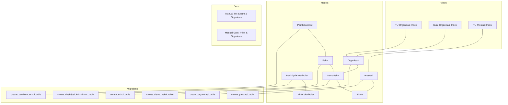

**Diagram sources**
- [Eskul.php](file://app/Models/Eskul.php)
- [Organisasi.php](file://app/Models/Organisasi.php)
- [SiswaEskul.php](file://app/Models/SiswaEskul.php)
- [PembinaEskul.php](file://app/Models/PembinaEskul.php)
- [DeskripsiKokurikuler.php](file://app/Models/DeskripsiKokurikuler.php)
- [Prestasi.php](file://app/Models/Prestasi.php)
- [2026_06_01_010809_create_eskul_table.php](file://database/migrations/2026_06_01_010809_create_eskul_table.php)
- [2026_06_01_010809_create_organisasi_table.php](file://database/migrations/2026_06_01_010809_create_organisasi_table.php)
- [2026_06_01_010816_create_pembina_eskul_table.php](file://database/migrations/2026_06_01_010816_create_pembina_eskul_table.php)
- [2026_06_01_010820_create_siswa_eskul_table.php](file://database/migrations/2026_06_01_010820_create_siswa_eskul_table.php)
- [2026_06_01_010809_create_deskripsi_kokurikuler_table.php](file://database/migrations/2026_06_01_010809_create_deskripsi_kokurikuler_table.php)
- [2026_06_01_010821_create_prestasi_table.php](file://database/migrations/2026_06_01_010821_create_prestasi_table.php)
- [index.blade.php (TU Organisasi)](file://resources/views/tu/organisasi/index.blade.php)
- [index.blade.php (Guru Organisasi)](file://resources/views/guru/organisasi/index.blade.php)
- [index.blade.php (TU Prestasi)](file://resources/views/tu/prestasi/index.blade.php)
- [06-ekstra-organisasi.md](file://docs/manual-tu/06-ekstra-organisasi.md)
- [09-piket-organisasi.md](file://docs/manual-guru/09-piket-organisasi.md)

**Section sources**
- [Eskul.php](file://app/Models/Eskul.php)
- [Organisasi.php](file://app/Models/Organisasi.php)
- [SiswaEskul.php](file://app/Models/SiswaEskul.php)
- [PembinaEskul.php](file://app/Models/PembinaEskul.php)
- [DeskripsiKokurikuler.php](file://app/Models/DeskripsiKokurikuler.php)
- [Prestasi.php](file://app/Models/Prestasi.php)
- [2026_06_01_010809_create_eskul_table.php](file://database/migrations/2026_06_01_010809_create_eskul_table.php)
- [2026_06_01_010809_create_organisasi_table.php](file://database/migrations/2026_06_01_010809_create_organisasi_table.php)
- [2026_06_01_010816_create_pembina_eskul_table.php](file://database/migrations/2026_06_01_010816_create_pembina_eskul_table.php)
- [2026_06_01_010820_create_siswa_eskul_table.php](file://database/migrations/2026_06_01_010820_create_siswa_eskul_table.php)
- [2026_06_01_010809_create_deskripsi_kokurikuler_table.php](file://database/migrations/2026_06_01_010809_create_deskripsi_kokurikuler_table.php)
- [2026_06_01_010821_create_prestasi_table.php](file://database/migrations/2026_06_01_010821_create_prestasi_table.php)
- [index.blade.php (TU Organisasi)](file://resources/views/tu/organisasi/index.blade.php)
- [index.blade.php (Guru Organisasi)](file://resources/views/guru/organisasi/index.blade.php)
- [index.blade.php (TU Prestasi)](file://resources/views/tu/prestasi/index.blade.php)
- [06-ekstra-organisasi.md](file://docs/manual-tu/06-ekstra-organisasi.md)
- [09-piket-organisasi.md](file://docs/manual-guru/09-piket-organisasi.md)

## Core Components
- Activity catalog and scheduling: managed via the extracurricular club entity and associated advisor records.
- Student participation tracking: recorded through membership junction entries linking students to activities.
- Organization oversight: managed via organizational units that can host multiple activities.
- Academic descriptors and evaluations: linked to co-curricular descriptors for grading and reporting.
- Achievement recognition: captured through achievement records tied to students.
- Dashboards and reporting: surfaced in TU and Guru views for oversight and export.

Key implementation anchors:
- Activity setup and scheduling: [Eskul.php](file://app/Models/Eskul.php), [2026_06_01_010809_create_eskul_table.php](file://database/migrations/2026_06_01_010809_create_eskul_table.php)
- Student membership: [SiswaEskul.php](file://app/Models/SiswaEskul.php), [2026_06_01_010820_create_siswa_eskul_table.php](file://database/migrations/2026_06_01_010820_create_siswa_eskul_table.php)
- Organization hosting: [Organisasi.php](file://app/Models/Organisasi.php), [2026_06_01_010809_create_organisasi_table.php](file://database/migrations/2026_06_01_010809_create_organisasi_table.php)
- Advisor assignment: [PembinaEskul.php](file://app/Models/PembinaEskul.php), [2026_06_01_010816_create_pembina_eskul_table.php](file://database/migrations/2026_06_01_010816_create_pembina_eskul_table.php)
- Descriptors and evaluations: [DeskripsiKokurikuler.php](file://app/Models/DeskripsiKokurikuler.php), [NilaiKokurikuler.php](file://app/Models/NilaiKokurikuler.php)
- Achievements: [Prestasi.php](file://app/Models/Prestasi.php), [2026_06_01_010821_create_prestasi_table.php](file://database/migrations/2026_06_01_010821_create_prestasi_table.php)
- Dashboards and views: [index.blade.php (TU Organisasi)](file://resources/views/tu/organisasi/index.blade.php), [index.blade.php (Guru Organisasi)](file://resources/views/guru/organisasi/index.blade.php), [index.blade.php (TU Prestasi)](file://resources/views/tu/prestasi/index.blade.php)
- Procedures and guidance: [06-ekstra-organisasi.md](file://docs/manual-tu/06-ekstra-organisasi.md), [09-piket-organisasi.md](file://docs/manual-guru/09-piket-organisasi.md)

**Section sources**
- [Eskul.php](file://app/Models/Eskul.php)
- [SiswaEskul.php](file://app/Models/SiswaEskul.php)
- [Organisasi.php](file://app/Models/Organisasi.php)
- [PembinaEskul.php](file://app/Models/PembinaEskul.php)
- [DeskripsiKokurikuler.php](file://app/Models/DeskripsiKokurikuler.php)
- [NilaiKokurikuler.php](file://app/Models/NilaiKokurikuler.php)
- [Prestasi.php](file://app/Models/Prestasi.php)
- [2026_06_01_010809_create_eskul_table.php](file://database/migrations/2026_06_01_010809_create_eskul_table.php)
- [2026_06_01_010820_create_siswa_eskul_table.php](file://database/migrations/2026_06_01_010820_create_siswa_eskul_table.php)
- [2026_06_01_010809_create_organisasi_table.php](file://database/migrations/2026_06_01_010809_create_organisasi_table.php)
- [2026_06_01_010816_create_pembina_eskul_table.php](file://database/migrations/2026_06_01_010816_create_pembina_eskul_table.php)
- [2026_06_01_010809_create_deskripsi_kokurikuler_table.php](file://database/migrations/2026_06_01_010809_create_deskripsi_kokurikuler_table.php)
- [2026_06_01_010821_create_prestasi_table.php](file://database/migrations/2026_06_01_010821_create_prestasi_table.php)
- [index.blade.php (TU Organisasi)](file://resources/views/tu/organisasi/index.blade.php)
- [index.blade.php (Guru Organisasi)](file://resources/views/guru/organisasi/index.blade.php)
- [index.blade.php (TU Prestasi)](file://resources/views/tu/prestasi/index.blade.php)
- [06-ekstra-organisasi.md](file://docs/manual-tu/06-ekstra-organisasi.md)
- [09-piket-organisasi.md](file://docs/manual-guru/09-piket-organisasi.md)

## Architecture Overview
The extracurricular subsystem integrates data modeling, UI dashboards, and administrative procedures:
- Data model: clubs, organizations, memberships, advisors, descriptors, and achievements form a cohesive schema.
- UI: TU and Guru views present organization management and achievement recognition interfaces.
- Procedures: documented workflows guide setup, scheduling, and oversight.

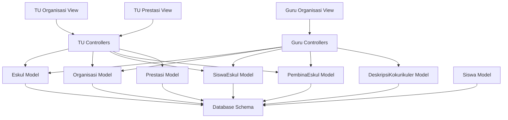

**Diagram sources**
- [index.blade.php (TU Organisasi)](file://resources/views/tu/organisasi/index.blade.php)
- [index.blade.php (Guru Organisasi)](file://resources/views/guru/organisasi/index.blade.php)
- [index.blade.php (TU Prestasi)](file://resources/views/tu/prestasi/index.blade.php)
- [Eskul.php](file://app/Models/Eskul.php)
- [Organisasi.php](file://app/Models/Organisasi.php)
- [SiswaEskul.php](file://app/Models/SiswaEskul.php)
- [PembinaEskul.php](file://app/Models/PembinaEskul.php)
- [DeskripsiKokurikuler.php](file://app/Models/DeskripsiKokurikuler.php)
- [Prestasi.php](file://app/Models/Prestasi.php)
- [Siswa.php](file://app/Models/Siswa.php)

## Detailed Component Analysis

### Activity Catalog and Scheduling (Clubs)
- Purpose: Define and schedule extracurricular clubs.
- Entities:
  - Club: [Eskul.php](file://app/Models/Eskul.php)
  - Organization: [Organisasi.php](file://app/Models/Organisasi.php)
  - Advisor: [PembinaEskul.php](file://app/Models/PembinaEskul.php)
- Schema:
  - Clubs: [2026_06_01_010809_create_eskul_table.php](file://database/migrations/2026_06_01_010809_create_eskul_table.php)
  - Organizations: [2026_06_01_010809_create_organisasi_table.php](file://database/migrations/2026_06_01_010809_create_organisasi_table.php)
  - Advisors: [2026_06_01_010816_create_pembina_eskul_table.php](file://database/migrations/2026_06_01_010816_create_pembina_eskul_table.php)

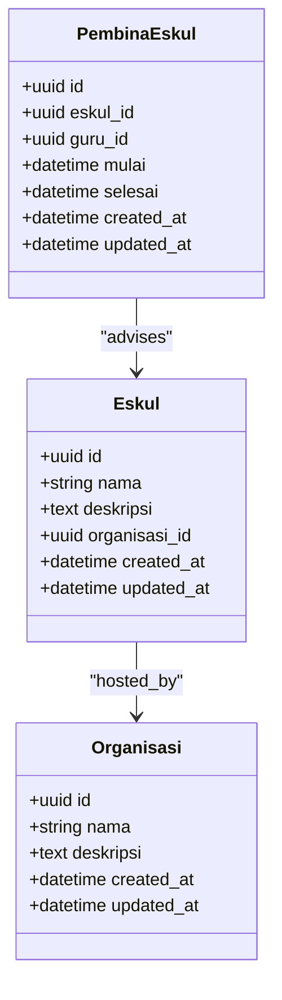

**Diagram sources**
- [Eskul.php](file://app/Models/Eskul.php)
- [Organisasi.php](file://app/Models/Organisasi.php)
- [PembinaEskul.php](file://app/Models/PembinaEskul.php)
- [2026_06_01_010809_create_eskul_table.php](file://database/migrations/2026_06_01_010809_create_eskul_table.php)
- [2026_06_01_010809_create_organisasi_table.php](file://database/migrations/2026_06_01_010809_create_organisasi_table.php)
- [2026_06_01_010816_create_pembina_eskul_table.php](file://database/migrations/2026_06_01_010816_create_pembina_eskul_table.php)

**Section sources**
- [Eskul.php](file://app/Models/Eskul.php)
- [Organisasi.php](file://app/Models/Organisasi.php)
- [PembinaEskul.php](file://app/Models/PembinaEskul.php)
- [2026_06_01_010809_create_eskul_table.php](file://database/migrations/2026_06_01_010809_create_eskul_table.php)
- [2026_06_01_010809_create_organisasi_table.php](file://database/migrations/2026_06_01_010809_create_organisasi_table.php)
- [2026_06_01_010816_create_pembina_eskul_table.php](file://database/migrations/2026_06_01_010816_create_pembina_eskul_table.php)

### Student Participation Tracking (Membership)
- Purpose: Track which students participate in which activities.
- Entities:
  - Membership: [SiswaEskul.php](file://app/Models/SiswaEskul.php)
  - Student: [Siswa.php](file://app/Models/Siswa.php)
- Schema:
  - Membership: [2026_06_01_010820_create_siswa_eskul_table.php](file://database/migrations/2026_06_01_010820_create_siswa_eskul_table.php)

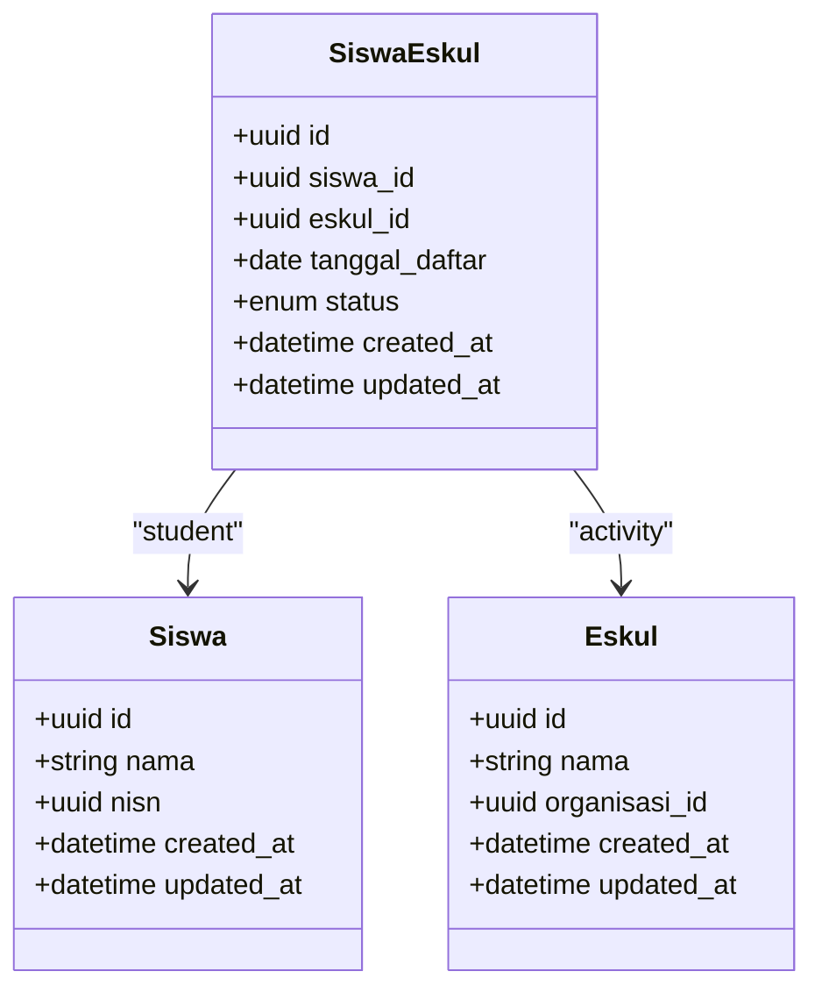

**Diagram sources**
- [SiswaEskul.php](file://app/Models/SiswaEskul.php)
- [Siswa.php](file://app/Models/Siswa.php)
- [Eskul.php](file://app/Models/Eskul.php)
- [2026_06_01_010820_create_siswa_eskul_table.php](file://database/migrations/2026_06_01_010820_create_siswa_eskul_table.php)

**Section sources**
- [SiswaEskul.php](file://app/Models/SiswaEskul.php)
- [Siswa.php](file://app/Models/Siswa.php)
- [Eskul.php](file://app/Models/Eskul.php)
- [2026_06_01_010820_create_siswa_eskul_table.php](file://database/migrations/2026_06_01_010820_create_siswa_eskul_table.php)

### Organization Hosting and Oversight
- Purpose: Manage organizational units that host activities and coordinate schedules.
- Entities:
  - Organization: [Organisasi.php](file://app/Models/Organisasi.php)
  - Views: [index.blade.php (TU Organisasi)](file://resources/views/tu/organisasi/index.blade.php), [index.blade.php (Guru Organisasi)](file://resources/views/guru/organisasi/index.blade.php)
- Schema:
  - Organizations: [2026_06_01_010809_create_organisasi_table.php](file://database/migrations/2026_06_01_010809_create_organisasi_table.php)

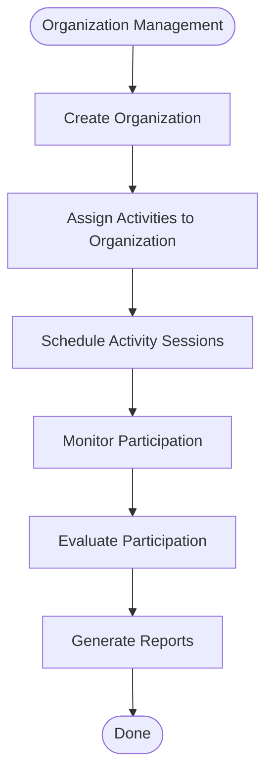

**Diagram sources**
- [Organisasi.php](file://app/Models/Organisasi.php)
- [2026_06_01_010809_create_organisasi_table.php](file://database/migrations/2026_06_01_010809_create_organisasi_table.php)
- [index.blade.php (TU Organisasi)](file://resources/views/tu/organisasi/index.blade.php)
- [index.blade.php (Guru Organisasi)](file://resources/views/guru/organisasi/index.blade.php)

**Section sources**
- [Organisasi.php](file://app/Models/Organisasi.php)
- [2026_06_01_010809_create_organisasi_table.php](file://database/migrations/2026_06_01_010809_create_organisasi_table.php)
- [index.blade.php (TU Organisasi)](file://resources/views/tu/organisasi/index.blade.php)
- [index.blade.php (Guru Organisasi)](file://resources/views/guru/organisasi/index.blade.php)

### Academic Descriptors and Evaluation
- Purpose: Link co-curricular descriptors to academic evaluation and reporting.
- Entities:
  - Descriptor: [DeskripsiKokurikuler.php](file://app/Models/DeskripsiKokurikuler.php)
  - Evaluation: [NilaiKokurikuler.php](file://app/Models/NilaiKokurikuler.php)
- Schema:
  - Descriptors: [2026_06_01_010809_create_deskripsi_kokurikuler_table.php](file://database/migrations/2026_06_01_010809_create_deskripsi_kokurikuler_table.php)

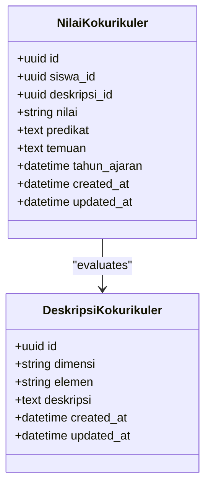

**Diagram sources**
- [DeskripsiKokurikuler.php](file://app/Models/DeskripsiKokurikuler.php)
- [NilaiKokurikuler.php](file://app/Models/NilaiKokurikuler.php)
- [2026_06_01_010809_create_deskripsi_kokurikuler_table.php](file://database/migrations/2026_06_01_010809_create_deskripsi_kokurikuler_table.php)

**Section sources**
- [DeskripsiKokurikuler.php](file://app/Models/DeskripsiKokurikuler.php)
- [NilaiKokurikuler.php](file://app/Models/NilaiKokurikuler.php)
- [2026_06_01_010809_create_deskripsi_kokurikuler_table.php](file://database/migrations/2026_06_01_010809_create_deskripsi_kokurikuler_table.php)

### Achievement Recognition and Certificates
- Purpose: Recognize student achievements and manage certificates.
- Entities:
  - Achievement: [Prestasi.php](file://app/Models/Prestasi.php)
  - Views: [index.blade.php (TU Prestasi)](file://resources/views/tu/prestasi/index.blade.php)
- Schema:
  - Achievements: [2026_06_01_010821_create_prestasi_table.php](file://database/migrations/2026_06_01_010821_create_prestasi_table.php)

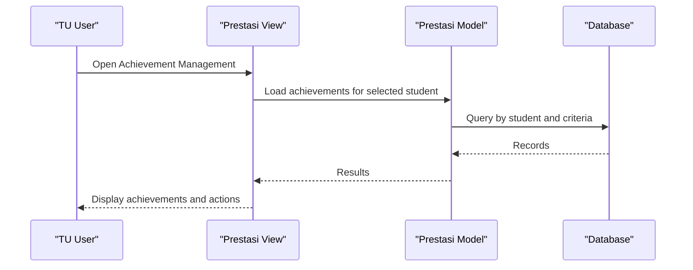

**Diagram sources**
- [index.blade.php (TU Prestasi)](file://resources/views/tu/prestasi/index.blade.php)
- [Prestasi.php](file://app/Models/Prestasi.php)
- [2026_06_01_010821_create_prestasi_table.php](file://database/migrations/2026_06_01_010821_create_prestasi_table.php)

**Section sources**
- [Prestasi.php](file://app/Models/Prestasi.php)
- [index.blade.php (TU Prestasi)](file://resources/views/tu/prestasi/index.blade.php)
- [2026_06_01_010821_create_prestasi_table.php](file://database/migrations/2026_06_01_010821_create_prestasi_table.php)

### Relationship Between Academic Subjects and Extracurricular Involvement
- Purpose: Understand how academic subjects relate to co-curricular participation and how time allocation affects academic performance.
- Entities:
  - Subject enrollment: [MapelSiswa.php](file://app/Models/MapelSiswa.php)
  - Student profile: [Siswa.php](file://app/Models/Siswa.php)
  - Co-curricular evaluation: [NilaiKokurikuler.php](file://app/Models/NilaiKokurikuler.php)
- Guidance:
  - Time management and academic impact considerations are covered in the documentation for teachers and TU staff.

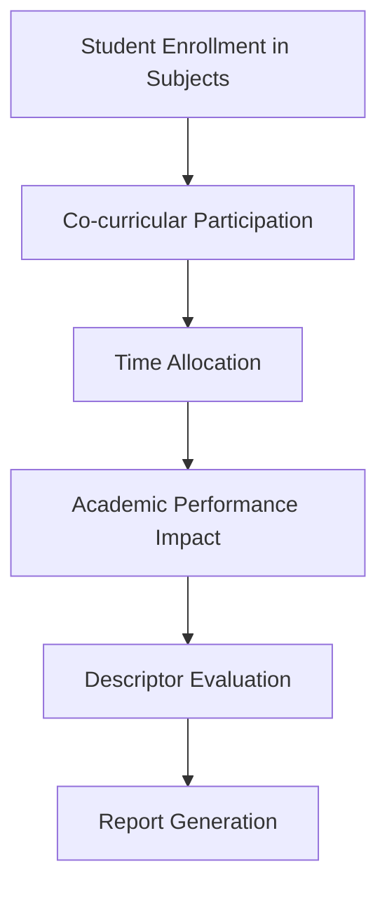

[No sources needed since this diagram shows conceptual workflow, not actual code structure]

**Section sources**
- [Siswa.php](file://app/Models/Siswa.php)
- [NilaiKokurikuler.php](file://app/Models/NilaiKokurikuler.php)

### Activity Setup, Registration, and Scheduling Processes
- Setup:
  - Create organizations and assign activities.
  - Define clubs and associate advisors.
- Registration:
  - Students enroll in activities via membership records.
- Scheduling:
  - Activities are scheduled under organizations; advisors manage sessions.

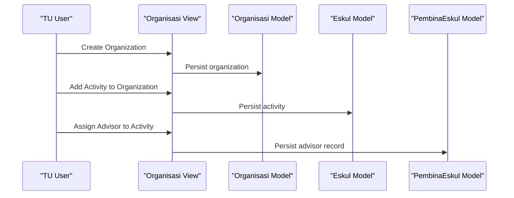

**Diagram sources**
- [index.blade.php (TU Organisasi)](file://resources/views/tu/organisasi/index.blade.php)
- [Organisasi.php](file://app/Models/Organisasi.php)
- [Eskul.php](file://app/Models/Eskul.php)
- [PembinaEskul.php](file://app/Models/PembinaEskul.php)

**Section sources**
- [index.blade.php (TU Organisasi)](file://resources/views/tu/organisasi/index.blade.php)
- [Organisasi.php](file://app/Models/Organisasi.php)
- [Eskul.php](file://app/Models/Eskul.php)
- [PembinaEskul.php](file://app/Models/PembinaEskul.php)

### Integration with Student Profiles, Reports, and Dashboards
- Student profiles:
  - Student membership and achievements integrate with student records.
- Reports:
  - Export and report generation supported by services.
- Dashboards:
  - TU and Guru views provide oversight and action surfaces.

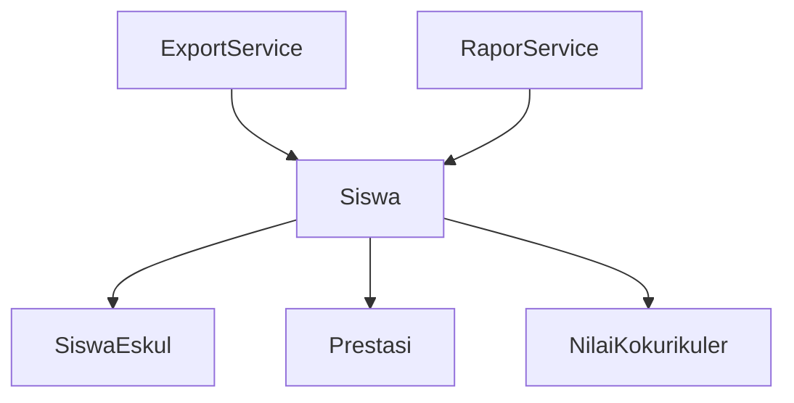

**Diagram sources**
- [Siswa.php](file://app/Models/Siswa.php)
- [SiswaEskul.php](file://app/Models/SiswaEskul.php)
- [Prestasi.php](file://app/Models/Prestasi.php)
- [NilaiKokurikuler.php](file://app/Models/NilaiKokurikuler.php)
- [ExportService.php](file://app/Services/ExportService.php)
- [RaporService.php](file://app/Services/RaporService.php)

**Section sources**
- [Siswa.php](file://app/Models/Siswa.php)
- [SiswaEskul.php](file://app/Models/SiswaEskul.php)
- [Prestasi.php](file://app/Models/Prestasi.php)
- [NilaiKokurikuler.php](file://app/Models/NilaiKokurikuler.php)
- [ExportService.php](file://app/Services/ExportService.php)
- [RaporService.php](file://app/Services/RaporService.php)

## Dependency Analysis
The extracurricular domain exhibits clear separation of concerns:
- Models encapsulate domain entities and relationships.
- Migrations define the schema and enforce referential integrity.
- Views provide role-specific dashboards.
- Services support export/reporting.

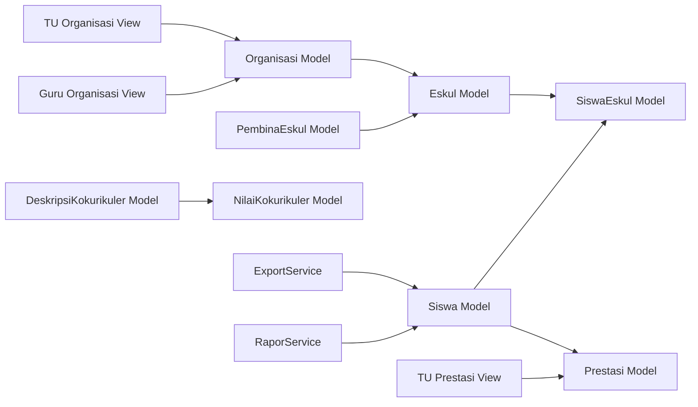

**Diagram sources**
- [Eskul.php](file://app/Models/Eskul.php)
- [SiswaEskul.php](file://app/Models/SiswaEskul.php)
- [Organisasi.php](file://app/Models/Organisasi.php)
- [PembinaEskul.php](file://app/Models/PembinaEskul.php)
- [DeskripsiKokurikuler.php](file://app/Models/DeskripsiKokurikuler.php)
- [NilaiKokurikuler.php](file://app/Models/NilaiKokurikuler.php)
- [Siswa.php](file://app/Models/Siswa.php)
- [Prestasi.php](file://app/Models/Prestasi.php)
- [index.blade.php (TU Organisasi)](file://resources/views/tu/organisasi/index.blade.php)
- [index.blade.php (Guru Organisasi)](file://resources/views/guru/organisasi/index.blade.php)
- [index.blade.php (TU Prestasi)](file://resources/views/tu/prestasi/index.blade.php)
- [ExportService.php](file://app/Services/ExportService.php)
- [RaporService.php](file://app/Services/RaporService.php)

**Section sources**
- [Eskul.php](file://app/Models/Eskul.php)
- [SiswaEskul.php](file://app/Models/SiswaEskul.php)
- [Organisasi.php](file://app/Models/Organisasi.php)
- [PembinaEskul.php](file://app/Models/PembinaEskul.php)
- [DeskripsiKokurikuler.php](file://app/Models/DeskripsiKokurikuler.php)
- [NilaiKokurikuler.php](file://app/Models/NilaiKokurikuler.php)
- [Siswa.php](file://app/Models/Siswa.php)
- [Prestasi.php](file://app/Models/Prestasi.php)
- [index.blade.php (TU Organisasi)](file://resources/views/tu/organisasi/index.blade.php)
- [index.blade.php (Guru Organisasi)](file://resources/views/guru/organisasi/index.blade.php)
- [index.blade.php (TU Prestasi)](file://resources/views/tu/prestasi/index.blade.php)
- [ExportService.php](file://app/Services/ExportService.php)
- [RaporService.php](file://app/Services/RaporService.php)

## Performance Considerations
- Indexing: Ensure foreign keys and frequently queried columns (e.g., student ID, activity ID, organization ID) are indexed to optimize joins and lookups.
- Pagination: Apply pagination in dashboards and reports to avoid heavy result sets.
- Caching: Cache static lookup data such as organization lists and activity categories.
- Batch operations: Use batch inserts/updates for mass enrollment or advisor assignments.
- Reporting: Offload heavy report generation to queued jobs and leverage export services.

[No sources needed since this section provides general guidance]

## Troubleshooting Guide
Common issues and resolutions:
- Duplicate memberships: Validate uniqueness of student-activity combinations before insertion.
- Missing advisor assignments: Ensure advisor records exist for activities before scheduling sessions.
- Inconsistent status updates: Implement atomic transactions for enrollment and status changes.
- Report discrepancies: Verify descriptor-to-evaluation mappings and ensure academic year boundaries are respected.
- Dashboard filters: Confirm filters align with user roles and permissions.

[No sources needed since this section provides general guidance]

## Conclusion
The extracurricular module integrates activity setup, student membership, organization oversight, academic descriptors, and achievement recognition into a cohesive system. With role-specific dashboards and documented procedures, schools can efficiently manage clubs, sports programs, and organizations while maintaining academic balance and generating actionable reports.

[No sources needed since this section summarizes without analyzing specific files]

## Appendices
- Examples:
  - Managing a sports program: create an organization for sports, define teams/clubs, assign advisors, enable student registration, track participation, and evaluate descriptors.
  - Managing a debate club: create the organization and club, schedule weekly meetings, manage membership, and record descriptors and achievements.
- Best practices:
  - Clearly define activity categories and advisor responsibilities.
  - Establish transparent registration deadlines and communication channels.
  - Regularly review participation and academic performance trends.
  - Use certificates and achievement records to motivate continued engagement.
- References:
  - Procedures: [06-ekstra-organisasi.md](file://docs/manual-tu/06-ekstra-organisasi.md), [09-piket-organisasi.md](file://docs/manual-guru/09-piket-organisasi.md)
  - Routes and menus: [web.php](file://routes/web.php), [GuruMenuService.php](file://app/Services/GuruMenuService.php)

[No sources needed since this section aggregates previously cited materials]