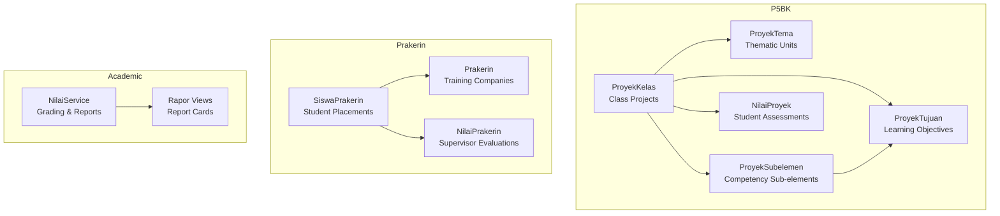
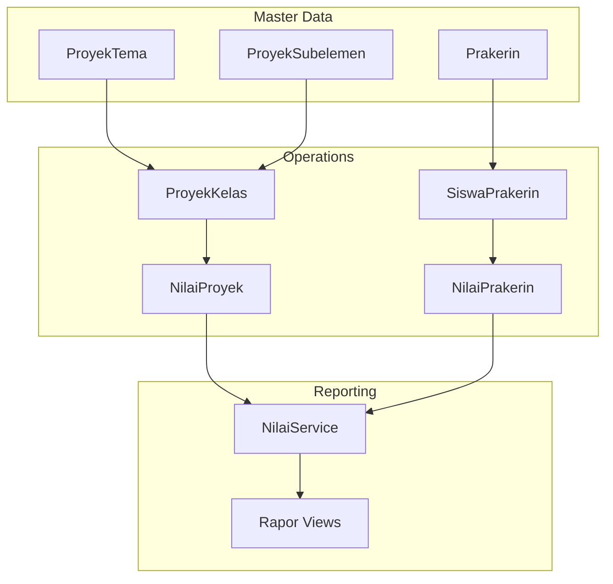
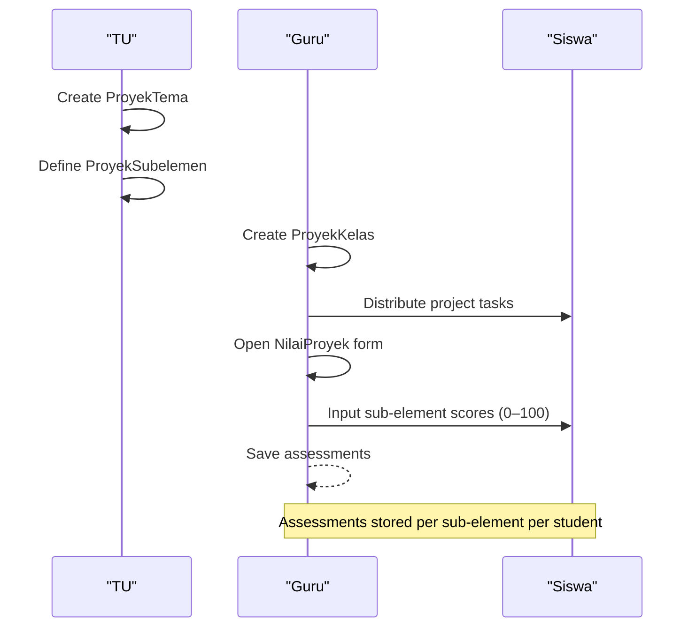
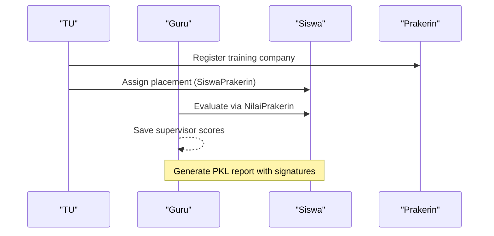
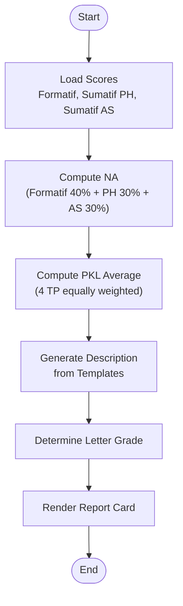
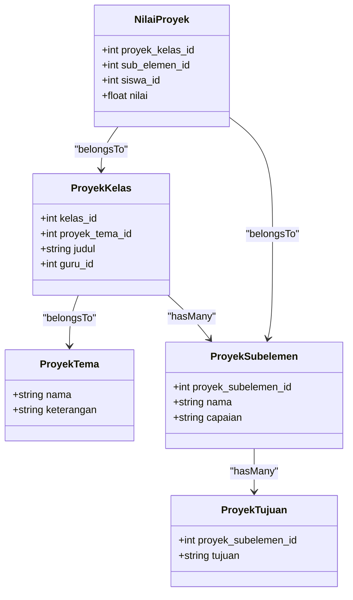

# Project Supervision

<cite>
**Referenced Files in This Document**
- [README.md](file://README.md)
- [PRD-rapor-migrasi.md](file://PRD-rapor-migrasi.md)
- [05-p5-kokurikuler.md](file://docs/manual-tu/05-p5-kokurikuler.md)
- [05-p5-profil-pancasila.md](file://docs/manual-guru/05-p5-profil-pancasila.md)
- [07-prakerin.md](file://docs/manual-tu/07-prakerin.md)
- [2026_06_01_010818_create_prakerin_table.php](file://database/migrations/2026_06_01_010818_create_prakerin_table.php)
- [PrakerinFactory.php](file://database/factories/PrakerinFactory.php)
- [DemoDataSeeder.php](file://database/seeders/DemoDataSeeder.php)
- [NilaiServiceTest.php](file://tests/Unit/Services/NilaiServiceTest.php)
- [P5bkApiTest.php](file://tests/Feature/API/V1/P5bkApiTest.php)
- [P5bkProyekTest.php](file://tests/Feature/TU/P5bk/P5bkProyekTest.php)
- [PrakerinApiTest.php](file://tests/Feature/API/V1/PrakerinApiTest.php)
- [NilaiPrakerinTest.php](file://tests/Feature/Guru/NilaiPrakerin/NilaiPrakerinTest.php)
- [PrakerinTest.php](file://tests/Feature/Guru/Prakerin/PrakerinTest.php)
- [PrakerinPesertaTest.php](file://tests/Feature/TU/Prakerin/PrakerinPesertaTest.php)
- [NilaiPrakerinController.php](file://app/Http/Controllers/Api/V1/Guru/NilaiPrakerinController.php)
- [PrakerinController.php](file://app/Http/Controllers/Api/V1/Tu/PrakerinController.php)
- [NilaiPrakerinController.php](file://app/Http/Controllers/Guru/NilaiPrakerinController.php)
- [PrakerinController.php](file://app/Http/Controllers/TU/PrakerinController.php)
- [NilaiPrakerin.php](file://app/Models/NilaiPrakerin.php)
- [Prakerin.php](file://app/Models/Prakerin.php)
- [SiswaPrakerin.php](file://app/Models/SiswaPrakerin.php)
- [ProyekKelas.php](file://app/Models/ProyekKelas.php)
- [ProyekTema.php](file://app/Models/ProyekTema.php)
- [ProyekSubelemen.php](file://app/Models/ProyekSubelemen.php)
- [ProyekTujuan.php](file://app/Models/ProyekTujuan.php)
- [NilaiProyek.php](file://app/Models/NilaiProyek.php)
- [MapelProyek.php](file://app/Models/MapelProyek.php)
- [NilaiAssesmenSubelemen.php](file://app/Models/NilaiAssesmenSubelemen.php)
- [NilaiService.php](file://app/Services/NilaiService.php)
- [NilaiPrakerinFactory.php](file://database/factories/NilaiPrakerinFactory.php)
- [rapor-pkl.blade.php](file://resources/views/rapor/rapor-pkl.blade.php)
- [penilaian.blade.php](file://resources/views/guru/p5bk/penilaian.blade.php)
</cite>

## Table of Contents
1. [Introduction](#introduction)
2. [Project Structure](#project-structure)
3. [Core Components](#core-components)
4. [Architecture Overview](#architecture-overview)
5. [Detailed Component Analysis](#detailed-component-analysis)
6. [Dependency Analysis](#dependency-analysis)
7. [Performance Considerations](#performance-considerations)
8. [Troubleshooting Guide](#troubleshooting-guide)
9. [Conclusion](#conclusion)
10. [Appendices](#appendices)

## Introduction
This document provides comprehensive documentation for project supervision and practical learning management within the educational reporting system. It focuses on:
- Project-based learning implementation and P5BK (Pancasila, Bhinneka, Keragaman Budaya) thematic units
- Theme-based curriculum integration and competency-based assessment systems
- Class project management, individual student project tracking, and collaborative learning facilitation
- Practical training supervision, internships, and hands-on learning experiences
- Project documentation, progress monitoring, and final project evaluation processes
- Examples of implementing project-based curricula, managing student groups, and integrating practical learning with theoretical subjects

The system supports both academic grading and practical training through dedicated workflows for P5BK projects and Praktik Kerja Lapangan (PKL/Prakerin).

## Project Structure
The system organizes functionality around three pillars:
- P5BK (Project-based Learning): thematic units, competency dimensions, and student assessments
- Practical Training (Prakerin): company placements, student assignments, and supervisor evaluations
- Academic Grading: competency-based calculations and report generation

**Diagram sources**
- [ProyekKelas.php](file://app/Models/ProyekKelas.php)
- [ProyekTema.php](file://app/Models/ProyekTema.php)
- [ProyekSubelemen.php](file://app/Models/ProyekSubelemen.php)
- [ProyekTujuan.php](file://app/Models/ProyekTujuan.php)
- [NilaiProyek.php](file://app/Models/NilaiProyek.php)
- [Prakerin.php](file://app/Models/Prakerin.php)
- [SiswaPrakerin.php](file://app/Models/SiswaPrakerin.php)
- [NilaiPrakerin.php](file://app/Models/NilaiPrakerin.php)
- [NilaiService.php](file://app/Services/NilaiService.php)
- [rapor-pkl.blade.php](file://resources/views/rapor/rapor-pkl.blade.php)

**Section sources**
- [README.md](file://README.md)
- [PRD-rapor-migrasi.md](file://PRD-rapor-migrasi.md)

## Core Components
- P5BK Thematic Units and Competency Framework
  - ProyekTema: thematic units aligned with Pancasila, Bhinneka, and cultural diversity
  - ProyekKelas: class-level project assignments linked to themes and sub-elements
  - ProyekSubelemen: competency sub-elements under each element
  - ProyekTujuan: learning objectives tied to competencies
  - NilaiProyek: student-level assessments per sub-element
- Practical Training (Prakerin)
  - Prakerin: training companies and placement details
  - SiswaPrakerin: student placements with academic year and semester
  - NilaiPrakerin: supervisor evaluations per student
- Academic Grading and Reporting
  - NilaiService: calculation engine for competency-based grades and report generation
  - Report templates: standardized report card views

**Section sources**
- [05-p5-kokurikuler.md](file://docs/manual-tu/05-p5-kokurikuler.md)
- [05-p5-profil-pancasila.md](file://docs/manual-guru/05-p5-profil-pancasila.md)
- [07-prakerin.md](file://docs/manual-tu/07-prakerin.md)
- [PRD-rapor-migrasi.md](file://PRD-rapor-migrasi.md)

## Architecture Overview
The system integrates three major domains: P5BK project management, Prakerin supervision, and academic grading. Data flows from master configurations (themes, competencies, companies) to operational workflows (class projects, placements, evaluations) and culminates in standardized reports.

**Diagram sources**
- [ProyekTema.php](file://app/Models/ProyekTema.php)
- [ProyekSubelemen.php](file://app/Models/ProyekSubelemen.php)
- [Prakerin.php](file://app/Models/Prakerin.php)
- [ProyekKelas.php](file://app/Models/ProyekKelas.php)
- [SiswaPrakerin.php](file://app/Models/SiswaPrakerin.php)
- [NilaiProyek.php](file://app/Models/NilaiProyek.php)
- [NilaiPrakerin.php](file://app/Models/NilaiPrakerin.php)
- [NilaiService.php](file://app/Services/NilaiService.php)
- [rapor-pkl.blade.php](file://resources/views/rapor/rapor-pkl.blade.php)

## Detailed Component Analysis

### P5BK Project Management
P5BK enables theme-based, competency-driven project learning across classes. The workflow includes:
- Creating thematic units (ProyekTema)
- Defining competency sub-elements (ProyekSubelemen) and learning objectives (ProyekTujuan)
- Assigning class projects (ProyekKelas) linked to themes and sub-elements
- Tracking student assessments (NilaiProyek) per sub-element

**Diagram sources**
- [05-p5-kokurikuler.md](file://docs/manual-tu/05-p5-kokurikuler.md)
- [05-p5-profil-pancasila.md](file://docs/manual-guru/05-p5-profil-pancasila.md)
- [ProyekKelas.php](file://app/Models/ProyekKelas.php)
- [ProyekTema.php](file://app/Models/ProyekTema.php)
- [ProyekSubelemen.php](file://app/Models/ProyekSubelemen.php)
- [ProyekTujuan.php](file://app/Models/ProyekTujuan.php)
- [NilaiProyek.php](file://app/Models/NilaiProyek.php)
- [penilaian.blade.php](file://resources/views/guru/p5bk/penilaian.blade.php)

Implementation highlights:
- Thematic units and competency hierarchy are configured by TU
- Class project creation is handled by the class teacher (Guru)
- Student assessments are captured via a grid interface and persisted per sub-element

**Section sources**
- [05-p5-kokurikuler.md](file://docs/manual-tu/05-p5-kokurikuler.md)
- [05-p5-profil-pancasila.md](file://docs/manual-guru/05-p5-profil-pancasila.md)
- [ProyekKelas.php](file://app/Models/ProyekKelas.php)
- [ProyekTema.php](file://app/Models/ProyekTema.php)
- [ProyekSubelemen.php](file://app/Models/ProyekSubelemen.php)
- [ProyekTujuan.php](file://app/Models/ProyekTujuan.php)
- [NilaiProyek.php](file://app/Models/NilaiProyek.php)
- [penilaian.blade.php](file://resources/views/guru/p5bk/penilaian.blade.php)

### Practical Training (Prakerin) Supervision
Prakerin manages real-world training placements with structured supervision and evaluation:
- Company registration (Prakerin)
- Student placement (SiswaPrakerin) across academic years and semesters
- Supervisor evaluations (NilaiPrakerin) per student
- Report generation (rapor-pkl.blade.php) with signatures

**Diagram sources**
- [07-prakerin.md](file://docs/manual-tu/07-prakerin.md)
- [Prakerin.php](file://app/Models/Prakerin.php)
- [SiswaPrakerin.php](file://app/Models/SiswaPrakerin.php)
- [NilaiPrakerin.php](file://app/Models/NilaiPrakerin.php)
- [NilaiPrakerinController.php](file://app/Http/Controllers/Guru/NilaiPrakerinController.php)
- [rapor-pkl.blade.php](file://resources/views/rapor/rapor-pkl.blade.php)

Operational flow:
- TU registers training companies and assigns students to placements
- Supervising teachers input evaluations per student
- Reports include signatures for supervisor, headmaster, and parent/guardian

**Section sources**
- [07-prakerin.md](file://docs/manual-tu/07-prakerin.md)
- [2026_06_01_010818_create_prakerin_table.php](file://database/migrations/2026_06_01_010818_create_prakerin_table.php)
- [PrakerinFactory.php](file://database/factories/PrakerinFactory.php)
- [DemoDataSeeder.php](file://database/seeders/DemoDataSeeder.php)
- [NilaiPrakerinController.php](file://app/Http/Controllers/Guru/NilaiPrakerinController.php)
- [rapor-pkl.blade.php](file://resources/views/rapor/rapor-pkl.blade.php)

### Academic Grading and Reporting
The system calculates competency-based grades and generates standardized reports:
- Weighted average computation for regular subjects and PKL
- Automatic description generation based on templates
- Class average calculations and letter grade determination

**Diagram sources**
- [PRD-rapor-migrasi.md](file://PRD-rapor-migrasi.md)
- [NilaiService.php](file://app/Services/NilaiService.php)
- [NilaiServiceTest.php](file://tests/Unit/Services/NilaiServiceTest.php)

Key capabilities:
- NA calculation follows fixed weights for formatif, ph, and as components
- PKL average computed from four equal-weighted TP scores
- Automated description and grade assignment based on predefined thresholds

**Section sources**
- [PRD-rapor-migrasi.md](file://PRD-rapor-migrasi.md)
- [NilaiService.php](file://app/Services/NilaiService.php)
- [NilaiServiceTest.php](file://tests/Unit/Services/NilaiServiceTest.php)

## Dependency Analysis
The system exhibits clear separation of concerns across models, controllers, and services, with explicit dependencies between domain entities.

**Diagram sources**
- [ProyekKelas.php](file://app/Models/ProyekKelas.php)
- [ProyekTema.php](file://app/Models/ProyekTema.php)
- [ProyekSubelemen.php](file://app/Models/ProyekSubelemen.php)
- [ProyekTujuan.php](file://app/Models/ProyekTujuan.php)
- [NilaiProyek.php](file://app/Models/NilaiProyek.php)

Additional dependencies:
- Prakerin module depends on academic year and semester for placement validity
- Evaluation controllers depend on model factories and seeders for testing and demo data

**Section sources**
- [2026_06_01_010818_create_prakerin_table.php](file://database/migrations/2026_06_01_010818_create_prakerin_table.php)
- [PrakerinFactory.php](file://database/factories/PrakerinFactory.php)
- [DemoDataSeeder.php](file://database/seeders/DemoDataSeeder.php)

## Performance Considerations
- Batch operations for assessments: Group save operations for NilaiProyek to minimize database round-trips
- Indexing: Ensure foreign keys (kelas_id, proyek_tema_id, sub_elemen_id, siswa_id) are indexed for efficient joins
- Caching: Cache frequently accessed thematic units and competency hierarchies to reduce repeated queries
- Pagination: Apply pagination for large class project lists and student assessment grids
- Asynchronous processing: Offload report generation and export tasks to queues for scalability

## Troubleshooting Guide
Common issues and resolutions:
- Assessment validation errors
  - Ensure sub-element scores are within the allowed range (0–100)
  - Verify that all required sub-elements are populated before saving
- Placement mismatches
  - Confirm that student placements align with active academic year and semester
  - Recheck company registration and contact details
- Report generation failures
  - Validate that supervisor, headmaster, and parent signatures are present
  - Confirm report templates render correctly for selected student and class
- Test coverage gaps
  - Review unit and feature tests for NilaiService, P5BK project workflows, and Prakerin evaluations
  - Use factory and seeder data to simulate realistic scenarios during testing

**Section sources**
- [NilaiServiceTest.php](file://tests/Unit/Services/NilaiServiceTest.php)
- [P5bkProyekTest.php](file://tests/Feature/TU/P5bk/P5bkProyekTest.php)
- [PrakerinApiTest.php](file://tests/Feature/API/V1/PrakerinApiTest.php)
- [NilaiPrakerinTest.php](file://tests/Feature/Guru/NilaiPrakerin/NilaiPrakerinTest.php)
- [PrakerinTest.php](file://tests/Feature/Guru/Prakerin/PrakerinTest.php)
- [PrakerinPesertaTest.php](file://tests/Feature/TU/Prakerin/PrakerinPesertaTest.php)

## Conclusion
The project supervision system integrates P5BK thematic learning, competency-based assessments, and practical training supervision into a cohesive platform. By leveraging structured workflows, standardized formulas, and robust reporting, educators can effectively manage class projects, track individual progress, supervise internships, and produce reliable academic and practical reports.

## Appendices
- Implementation examples
  - Creating a P5BK theme and assigning it to class projects
  - Configuring competency sub-elements and learning objectives
  - Managing Prakerin placements and supervisor evaluations
  - Generating report cards with automated descriptions and grades
- Best practices
  - Align project themes with curriculum standards
  - Use competency matrices to guide assessment design
  - Maintain accurate company and placement records
  - Regularly review and update assessment rubrics and templates