# Teacher Tools & Features

<cite>
**Referenced Files in This Document**
- [README.md](file://README.md)
- [routes/web.php](file://routes/web.php)
- [routes/api.php](file://routes/api.php)
- [app/Http/Controllers/Guru/DashboardController.php](file://app/Http/Controllers/Guru/DashboardController.php)
- [app/Http/Controllers/Api/V1/Guru/DashboardController.php](file://app/Http/Controllers/Api/V1/Guru/DashboardController.php)
- [app/Http/Controllers/Guru/AbsensiGuruController.php](file://app/Http/Controllers/Guru/AbsensiGuruController.php)
- [app/Http/Controllers/Api/V1/Guru/AbsensiGuruController.php](file://app/Http/Controllers/Api/V1/Guru/AbsensiGuruController.php)
- [app/Http/Controllers/Guru/AbsensiBkController.php](file://app/Http/Controllers/Guru/AbsensiBkController.php)
- [app/Http/Controllers/Guru/EkstraController.php](file://app/Http/Controllers/Guru/EkstraController.php)
- [app/Http/Controllers/Api/V1/Guru/EkstraController.php](file://app/Http/Controllers/Api/V1/Guru/EkstraController.php)
- [app/Http/Controllers/Guru/KelasKuController.php](file://app/Http/Controllers/Guru/KelasKuController.php)
- [app/Http/Controllers/Api/V1/Guru/KelasKuController.php](file://app/Http/Controllers/Api/V1/Guru/KelasKuController.php)
- [app/Http/Controllers/Guru/PenilaianController.php](file://app/Http/Controllers/Guru/PenilaianController.php)
- [app/Http/Controllers/Api/V1/Guru/PenilaianController.php](file://app/Http/Controllers/Api/V1/Guru/PenilaianController.php)
- [app/Http/Controllers/Guru/CatatanRaporController.php](file://app/Http/Controllers/Guru/CatatanRaporController.php)
- [app/Http/Controllers/Api/V1/Guru/CatatanRaporController.php](file://app/Http/Controllers/Api/V1/Guru/CatatanRaporController.php)
- [app/Http/Controllers/Guru/CetakRaporController.php](file://app/Http/Controllers/Guru/CetakRaporController.php)
- [app/Http/Controllers/Api/V1/Guru/CetakRaporController.php](file://app/Http/Controllers/Api/V1/Guru/CetakRaporController.php)
- [app/Http/Controllers/Guru/TujuanPembelajaranController.php](file://app/Http/Controllers/Guru/TujuanPembelajaranController.php)
- [app/Http/Controllers/Api/V1/Guru/TujuanPembelajaranController.php](file://app/Http/Controllers/Api/V1/Guru/TujuanPembelajaranController.php)
- [app/Http/Controllers/Guru/NilaiPrakerinController.php](file://app/Http/Controllers/Guru/NilaiPrakerinController.php)
- [app/Http/Controllers/Api/V1/Guru/NilaiPrakerinController.php](file://app/Http/Controllers/Api/V1/Guru/NilaiPrakerinController.php)
- [app/Http/Controllers/Guru/P5bkController.php](file://app/Http/Controllers/Guru/P5bkController.php)
- [app/Http/Controllers/Api/V1/Guru/P5bkController.php](file://app/Http/Controllers/Api/V1/Guru/P5bkController.php)
- [app/Http/Controllers/Guru/KokurikulerController.php](file://app/Http/Controllers/Guru/KokurikulerController.php)
- [app/Http/Controllers/Api/V1/Guru/KokurikulerController.php](file://app/Http/Controllers/Api/V1/Guru/KokurikulerController.php)
- [app/Http/Controllers/Guru/PresensiController.php](file://app/Http/Controllers/Guru/PresensiController.php)
- [app/Http/Controllers/Api/V1/Guru/PresensiController.php](file://app/Http/Controllers/Api/V1/Guru/PresensiController.php)
- [app/Models/Presensi.php](file://app/Models/Presensi.php)
- [app/Models/Siswa.php](file://app/Models/Siswa.php)
- [app/Models/Kelas.php](file://app/Models/Kelas.php)
- [app/Models/Mapel.php](file://app/Models/Mapel.php)
- [app/Models/SiswaEskul.php](file://app/Models/SiswaEskul.php)
- [app/Models/Elemen.php](file://app/Models/Elemen.php)
- [app/Models/SubElemen.php](file://app/Models/SubElemen.php)
- [app/Models/DeskripsiKokurikuler.php](file://app/Models/DeskripsiKokurikuler.php)
- [app/Models/NilaiKokurikuler.php](file://app/Models/NilaiKokurikuler.php)
- [app/Models/NilaiMataPelajaran.php](file://app/Models/NilaiMataPelajaran.php)
- [app/Models/NilaiPrakerin.php](file://app/Models/NilaiPrakerin.php)
- [app/Models/NilaiFormatif.php](file://app/Models/NilaiFormatif.php)
- [app/Models/NilaiSumatifAs.php](file://app/Models/NilaiSumatifAs.php)
- [app/Models/NilaiSumatifPh.php](file://app/Models/NilaiSumatifPh.php)
- [app/Models/NilaiSumatifTs.php](file://app/Models/NilaiSumatifTs.php)
- [app/Models/Prakerin.php](file://app/Models/Prakerin.php)
- [app/Models/ProyekKelas.php](file://app/Models/ProyekKelas.php)
- [app/Models/MapelProyek.php](file://app/Models/MapelProyek.php)
- [app/Services/RaporService.php](file://app/Services/RaporService.php)
- [app/Services/NilaiService.php](file://app/Services/NilaiService.php)
- [app/Services/ExportService.php](file://app/Services/ExportService.php)
- [resources/views/components/sidebar-guru.blade.php](file://resources/views/components/sidebar-guru.blade.php)
- [resources/views/guru/dashboard.blade.php](file://resources/views/guru/dashboard.blade.php)
- [resources/views/guru/absensi/index.blade.php](file://resources/views/guru/absensi/index.blade.php)
- [resources/views/guru/ekstra/index.blade.php](file://resources/views/guru/ekstra/index.blade.php)
- [resources/views/guru/kelas-ku/index.blade.php](file://resources/views/guru/kelas-ku/index.blade.php)
- [resources/views/guru/penilaian/index.blade.php](file://resources/views/guru/penilaian/index.blade.php)
- [resources/views/guru/catatan-rapor/index.blade.php](file://resources/views/guru/catatan-rapor/index.blade.php)
- [resources/views/guru/cetak-rapor/index.blade.php](file://resources/views/guru/cetak-rapor/index.blade.php)
- [resources/views/guru/tujuan-pembelajaran/index.blade.php](file://resources/views/guru/tujuan-pembelajaran/index.blade.php)
- [resources/views/guru/nilai-prakerin/index.blade.php](file://resources/views/guru/nilai-prakerin/index.blade.php)
- [resources/views/guru/p5bk/index.blade.php](file://resources/views/guru/p5bk/index.blade.php)
- [resources/views/guru/kokurikuler/index.blade.php](file://resources/views/guru/kokurikuler/index.blade.php)
- [resources/views/guru/presensi/index.blade.php](file://resources/views/guru/presensi/index.blade.php)
- [tests/Feature/Api/V1/GuruDashboardTest.php](file://tests/Feature/Api/V1/GuruDashboardTest.php)
</cite>

## Table of Contents
1. [Introduction](#introduction)
2. [Project Structure](#project-structure)
3. [Core Components](#core-components)
4. [Architecture Overview](#architecture-overview)
5. [Detailed Component Analysis](#detailed-component-analysis)
6. [Dependency Analysis](#dependency-analysis)
7. [Performance Considerations](#performance-considerations)
8. [Troubleshooting Guide](#troubleshooting-guide)
9. [Conclusion](#conclusion)
10. [Appendices](#appendices)

## Introduction
This document describes the teacher-facing tools and features in RaporKM Laravel. It focuses on attendance management, behavioral assessment and conduct evaluation, extracurricular activity management, project supervision, communication tools, lesson planning and classroom management, and the teacher dashboard with quick access and workflow automation. The goal is to help teachers use the system effectively and understand how data flows through the platform.

## Project Structure
RaporKM separates teacher functionality into:
- Web controllers and Blade views under the teacher namespace
- API controllers under Api/V1/Guru for mobile and frontend integrations
- Domain models representing students, classes, subjects, assessments, and activities
- Services for report generation, grade computation, and exports
- Tests validating API endpoints and dashboard metrics

```mermaid
graph TB
subgraph "Web Layer"
GD["Guru Dashboard Controller<br/>and Views"]
GA["Absensi Guru Controller<br/>and Views"]
GE["Ekstra Controller<br/>and Views"]
GKK["KelasKu Controller<br/>and Views"]
GPN["Penilaian Controller<br/>and Views"]
GCR["CatatanRapor Controller<br/>and Views"]
GCRP["CetakRapor Controller<br/>and Views"]
GTUJ["TujuanPembelajaran Controller<br/>and Views"]
GNPR["NilaiPrakerin Controller<br/>and Views"]
GP5["P5bk Controller<br/>and Views"]
GKO["Kokurikuler Controller<br/>and Views"]
GPS["Presensi Controller<br/>and Views"]
end
subgraph "API Layer"
APIDash["Api/V1/Guru/DashboardController"]
APIAbs["Api/V1/Guru/AbsensiGuruController"]
APIEx["Api/V1/Guru/EkstraController"]
APIKK["Api/V1/Guru/KelasKuController"]
APIPN["Api/V1/Guru/PenilaianController"]
APICR["Api/V1/Guru/CatatanRaporController"]
APICRP["Api/V1/Guru/CetakRaporController"]
APITPJ["Api/V1/Guru/TujuanPembelajaranController"]
APINPR["Api/V1/Guru/NilaiPrakerinController"]
APIP5["Api/V1/Guru/P5bkController"]
APIKO["Api/V1/Guru/KokurikulerController"]
APIPS["Api/V1/Guru/PresensiController"]
end
subgraph "Domain Models"
MPres["Presensi"]
MSis["Siswa"]
MKelas["Kelas"]
MMapel["Mapel"]
MEsk["SiswaEskul"]
MNilAk["NilaiMataPelajaran"]
MNilFmt["NilaiFormatif"]
MNilSum["NilaiSumatif*"]
MNilPrak["NilaiPrakerin"]
MPrak["Prakerin"]
MProyek["ProyekKelas"]
MElem["Elemen/SubElemen"]
MDes["DeskripsiKokurikuler"]
MNilKok["NilaiKokurikuler"]
end
subgraph "Services"
SR["RaporService"]
SN["NilaiService"]
SX["ExportService"]
end
GD --> APIDash
GA --> APIAbs
GE --> APIEx
GKK --> APIKK
GPN --> APIPN
GCR --> APICR
GCRP --> APICRP
GTUJ --> APITPJ
GNPR --> APINPR
GP5 --> APIP5
GKO --> APIKO
GPS --> APIPS
APIAbs --> MPres
APIEx --> MEsk
APIKK --> MKelas
APIPN --> MNilAk
APICR --> MSis
APICRP --> SR
APITPJ --> MMapel
APINPR --> MNilPrak
APIP5 --> MSis
APIKO --> MNilKok
APIPS --> MPres
SR --> SN
SN --> MNilFmt
SN --> MNilSum
SN --> MNilAk
SX --> SR
```

**Diagram sources**
- [app/Http/Controllers/Guru/DashboardController.php](file://app/Http/Controllers/Guru/DashboardController.php)
- [app/Http/Controllers/Api/V1/Guru/DashboardController.php](file://app/Http/Controllers/Api/V1/Guru/DashboardController.php)
- [app/Http/Controllers/Guru/AbsensiGuruController.php](file://app/Http/Controllers/Guru/AbsensiGuruController.php)
- [app/Http/Controllers/Api/V1/Guru/AbsensiGuruController.php](file://app/Http/Controllers/Api/V1/Guru/AbsensiGuruController.php)
- [app/Http/Controllers/Guru/EkstraController.php](file://app/Http/Controllers/Guru/EkstraController.php)
- [app/Http/Controllers/Api/V1/Guru/EkstraController.php](file://app/Http/Controllers/Api/V1/Guru/EkstraController.php)
- [app/Http/Controllers/Guru/KelasKuController.php](file://app/Http/Controllers/Guru/KelasKuController.php)
- [app/Http/Controllers/Api/V1/Guru/KelasKuController.php](file://app/Http/Controllers/Api/V1/Guru/KelasKuController.php)
- [app/Http/Controllers/Guru/PenilaianController.php](file://app/Http/Controllers/Guru/PenilaianController.php)
- [app/Http/Controllers/Api/V1/Guru/PenilaianController.php](file://app/Http/Controllers/Api/V1/Guru/PenilaianController.php)
- [app/Http/Controllers/Guru/CatatanRaporController.php](file://app/Http/Controllers/Guru/CatatanRaporController.php)
- [app/Http/Controllers/Api/V1/Guru/CatatanRaporController.php](file://app/Http/Controllers/Api/V1/Guru/CatatanRaporController.php)
- [app/Http/Controllers/Guru/CetakRaporController.php](file://app/Http/Controllers/Guru/CetakRaporController.php)
- [app/Http/Controllers/Api/V1/Guru/CetakRaporController.php](file://app/Http/Controllers/Api/V1/Guru/CetakRaporController.php)
- [app/Http/Controllers/Guru/TujuanPembelajaranController.php](file://app/Http/Controllers/Guru/TujuanPembelajaranController.php)
- [app/Http/Controllers/Api/V1/Guru/TujuanPembelajaranController.php](file://app/Http/Controllers/Api/V1/Guru/TujuanPembelajaranController.php)
- [app/Http/Controllers/Guru/NilaiPrakerinController.php](file://app/Http/Controllers/Guru/NilaiPrakerinController.php)
- [app/Http/Controllers/Api/V1/Guru/NilaiPrakerinController.php](file://app/Http/Controllers/Api/V1/Guru/NilaiPrakerinController.php)
- [app/Http/Controllers/Guru/P5bkController.php](file://app/Http/Controllers/Guru/P5bkController.php)
- [app/Http/Controllers/Api/V1/Guru/P5bkController.php](file://app/Http/Controllers/Api/V1/Guru/P5bkController.php)
- [app/Http/Controllers/Guru/KokurikulerController.php](file://app/Http/Controllers/Guru/KokurikulerController.php)
- [app/Http/Controllers/Api/V1/Guru/KokurikulerController.php](file://app/Http/Controllers/Api/V1/Guru/KokurikulerController.php)
- [app/Http/Controllers/Guru/PresensiController.php](file://app/Http/Controllers/Guru/PresensiController.php)
- [app/Http/Controllers/Api/V1/Guru/PresensiController.php](file://app/Http/Controllers/Api/V1/Guru/PresensiController.php)
- [app/Models/Presensi.php](file://app/Models/Presensi.php)
- [app/Models/Siswa.php](file://app/Models/Siswa.php)
- [app/Models/Kelas.php](file://app/Models/Kelas.php)
- [app/Models/Mapel.php](file://app/Models/Mapel.php)
- [app/Models/SiswaEskul.php](file://app/Models/SiswaEskul.php)
- [app/Models/NilaiMataPelajaran.php](file://app/Models/NilaiMataPelajaran.php)
- [app/Models/NilaiFormatif.php](file://app/Models/NilaiFormatif.php)
- [app/Models/NilaiSumatifAs.php](file://app/Models/NilaiSumatifAs.php)
- [app/Models/NilaiSumatifPh.php](file://app/Models/NilaiSumatifPh.php)
- [app/Models/NilaiSumatifTs.php](file://app/Models/NilaiSumatifTs.php)
- [app/Models/NilaiPrakerin.php](file://app/Models/NilaiPrakerin.php)
- [app/Models/Prakerin.php](file://app/Models/Prakerin.php)
- [app/Models/ProyekKelas.php](file://app/Models/ProyekKelas.php)
- [app/Models/Elemen.php](file://app/Models/Elemen.php)
- [app/Models/SubElemen.php](file://app/Models/SubElemen.php)
- [app/Models/DeskripsiKokurikuler.php](file://app/Models/DeskripsiKokurikuler.php)
- [app/Models/NilaiKokurikuler.php](file://app/Models/NilaiKokurikuler.php)
- [app/Services/RaporService.php](file://app/Services/RaporService.php)
- [app/Services/NilaiService.php](file://app/Services/NilaiService.php)
- [app/Services/ExportService.php](file://app/Services/ExportService.php)

**Section sources**
- [README.md](file://README.md)
- [routes/web.php](file://routes/web.php)
- [routes/api.php](file://routes/api.php)

## Core Components
- Teacher Dashboard: Presents class summaries, student counts, grading progress, and pending notes. The dashboard controller renders the view and the API controller provides metrics consumed by the frontend.
- Attendance Management: Records daily presence with selfie capture, tracks absence types, and supports BK (Guidance) attendance for behavioral monitoring.
- Behavioral Assessment: Evaluates conduct dimensions and elements, stores narrative descriptors and numeric scores, and integrates with report generation.
- Extracurricular Activities: Manages student participation in clubs/sports and links to organizational records.
- Project Supervision: Supports project themes, sub-elements, and class-level project management for practical learning.
- Communication Tools: Provides class notes for reports and report printing/certification features.
- Lesson Planning & Classroom Management: Offers subject-class assignment, learning objectives, and class member lists.
- Reporting: Generates academic and cocurricular reports, exportable formats, and printable certificates.

**Section sources**
- [app/Http/Controllers/Guru/DashboardController.php](file://app/Http/Controllers/Guru/DashboardController.php)
- [app/Http/Controllers/Api/V1/Guru/DashboardController.php](file://app/Http/Controllers/Api/V1/Guru/DashboardController.php)
- [resources/views/guru/dashboard.blade.php](file://resources/views/guru/dashboard.blade.php)
- [resources/views/components/sidebar-guru.blade.php](file://resources/views/components/sidebar-guru.blade.php)

## Architecture Overview
The teacher tools follow a layered architecture:
- Controllers orchestrate requests and render views or return JSON via API endpoints.
- Models encapsulate domain entities and relationships.
- Services compute grades, generate reports, and handle exports.
- Views present data to teachers with navigation tailored to their roles.

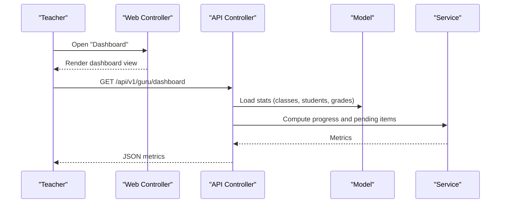

**Diagram sources**
- [app/Http/Controllers/Guru/DashboardController.php](file://app/Http/Controllers/Guru/DashboardController.php)
- [app/Http/Controllers/Api/V1/Guru/DashboardController.php](file://app/Http/Controllers/Api/V1/Guru/DashboardController.php)
- [app/Models/Kelas.php](file://app/Models/Kelas.php)
- [app/Models/Siswa.php](file://app/Models/Siswa.php)
- [app/Services/RaporService.php](file://app/Services/RaporService.php)

## Detailed Component Analysis

### Attendance Management
- Daily Presence Recording: Teachers record in/out with selfie uploads, linked to school location and date. The controller handles image storage and creates presence records.
- BK Attendance: Separate view for guidance staff to track student behavioral attendance.
- Reporting: Presence records are queryable by date and class for reporting.

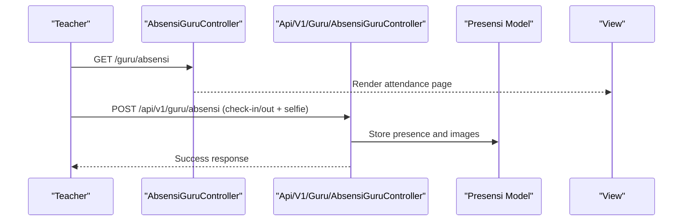

**Diagram sources**
- [app/Http/Controllers/Guru/AbsensiGuruController.php](file://app/Http/Controllers/Guru/AbsensiGuruController.php)
- [app/Http/Controllers/Api/V1/Guru/AbsensiGuruController.php](file://app/Http/Controllers/Api/V1/Guru/AbsensiGuruController.php)
- [app/Models/Presensi.php](file://app/Models/Presensi.php)
- [resources/views/guru/absensi/index.blade.php](file://resources/views/guru/absensi/index.blade.php)

**Section sources**
- [app/Http/Controllers/Guru/AbsensiGuruController.php](file://app/Http/Controllers/Guru/AbsensiGuruController.php)
- [app/Http/Controllers/Api/V1/Guru/AbsensiGuruController.php](file://app/Http/Controllers/Api/V1/Guru/AbsensiGuruController.php)
- [app/Http/Controllers/Guru/AbsensiBkController.php](file://app/Http/Controllers/Guru/AbsensiBkController.php)
- [app/Models/Presensi.php](file://app/Models/Presensi.php)
- [resources/views/guru/absensi/index.blade.php](file://resources/views/guru/absensi/index.blade.php)

### Behavioral Assessment and Conduct Evaluation
- Dimensions and Elements: Behavior is evaluated against predefined dimensions and sub-elements.
- Descriptors and Scores: Narrative descriptors and numeric scores are stored per student and dimension.
- Report Integration: Behavior scores are included in report generation.

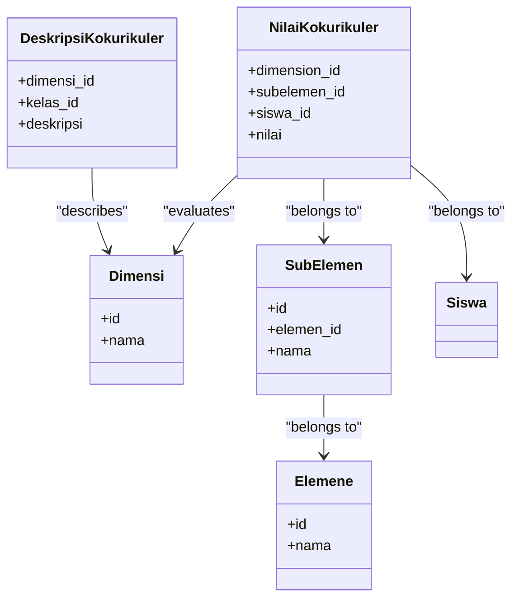

**Diagram sources**
- [app/Models/NilaiKokurikuler.php](file://app/Models/NilaiKokurikuler.php)
- [app/Models/DeskripsiKokurikuler.php](file://app/Models/DeskripsiKokurikuler.php)
- [app/Models/Elemen.php](file://app/Models/Elemen.php)
- [app/Models/SubElemen.php](file://app/Models/SubElemen.php)

**Section sources**
- [app/Http/Controllers/Guru/KokurikulerController.php](file://app/Http/Controllers/Guru/KokurikulerController.php)
- [app/Http/Controllers/Api/V1/Guru/KokurikulerController.php](file://app/Http/Controllers/Api/V1/Guru/KokurikulerController.php)
- [app/Models/NilaiKokurikuler.php](file://app/Models/NilaiKokurikuler.php)
- [app/Models/DeskripsiKokurikuler.php](file://app/Models/DeskripsiKokurikuler.php)
- [resources/views/guru/kokurikuler/index.blade.php](file://resources/views/guru/kokurikuler/index.blade.php)

### Extracurricular Activity Management
- Student Participation Tracking: Students enrolled in extracurricular activities are tracked per class and activity.
- Activity Management: Teachers can manage activity entries and student registrations.

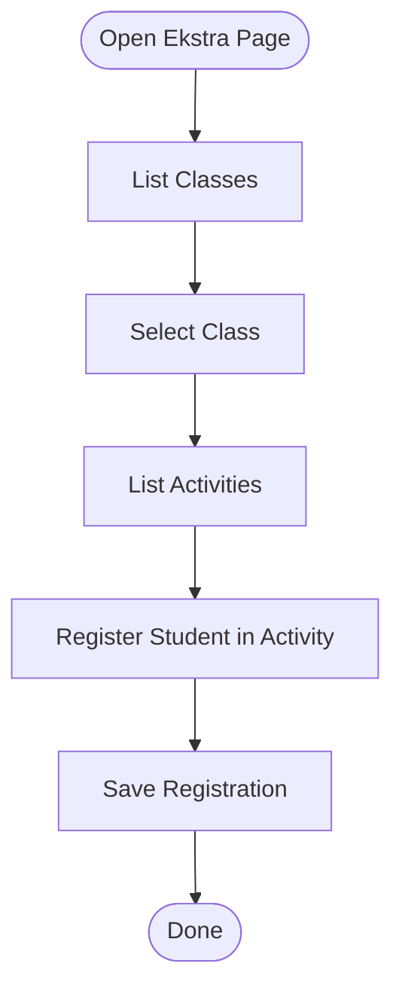

**Diagram sources**
- [app/Http/Controllers/Guru/EkstraController.php](file://app/Http/Controllers/Guru/EkstraController.php)
- [app/Http/Controllers/Api/V1/Guru/EkstraController.php](file://app/Http/Controllers/Api/V1/Guru/EkstraController.php)
- [app/Models/SiswaEskul.php](file://app/Models/SiswaEskul.php)
- [resources/views/guru/ekstra/index.blade.php](file://resources/views/guru/ekstra/index.blade.php)

**Section sources**
- [app/Http/Controllers/Guru/EkstraController.php](file://app/Http/Controllers/Guru/EkstraController.php)
- [app/Http/Controllers/Api/V1/Guru/EkstraController.php](file://app/Http/Controllers/Api/V1/Guru/EkstraController.php)
- [app/Models/SiswaEskul.php](file://app/Models/SiswaEskul.php)
- [resources/views/guru/ekstra/index.blade.php](file://resources/views/guru/ekstra/index.blade.php)

### Project Supervision Tools
- Project Themes and Sub-elements: Define learning objectives and assessment criteria for projects.
- Class-level Project Management: Teachers can manage projects per class and associate subjects to projects.

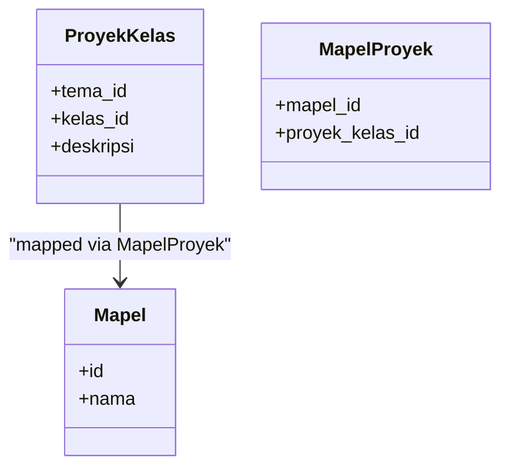

**Diagram sources**
- [app/Models/ProyekKelas.php](file://app/Models/ProyekKelas.php)
- [app/Models/MapelProyek.php](file://app/Models/MapelProyek.php)
- [app/Models/Mapel.php](file://app/Models/Mapel.php)

**Section sources**
- [app/Http/Controllers/Guru/TujuanPembelajaranController.php](file://app/Http/Controllers/Guru/TujuanPembelajaranController.php)
- [app/Http/Controllers/Api/V1/Guru/TujuanPembelajaranController.php](file://app/Http/Controllers/Api/V1/Guru/TujuanPembelajaranController.php)
- [app/Models/ProyekKelas.php](file://app/Models/ProyekKelas.php)
- [app/Models/MapelProyek.php](file://app/Models/MapelProyek.php)
- [resources/views/guru/tujuan-pembelajaran/index.blade.php](file://resources/views/guru/tujuan-pembelajaran/index.blade.php)

### Practical Training (Prakerin) Grading
- Supervision and Grading: Teachers evaluate students during practical training periods with dedicated grading records.
- Integration: Practical training data integrates with report generation.

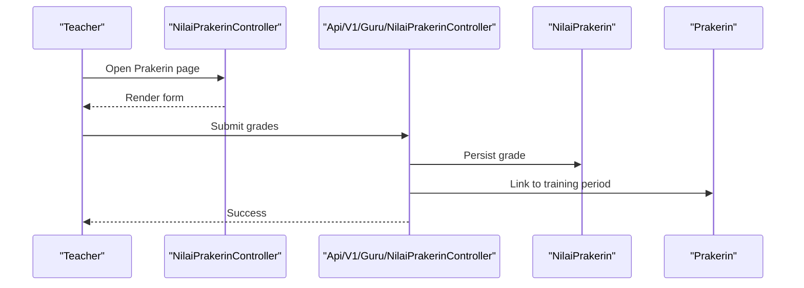

**Diagram sources**
- [app/Http/Controllers/Guru/NilaiPrakerinController.php](file://app/Http/Controllers/Guru/NilaiPrakerinController.php)
- [app/Http/Controllers/Api/V1/Guru/NilaiPrakerinController.php](file://app/Http/Controllers/Api/V1/Guru/NilaiPrakerinController.php)
- [app/Models/NilaiPrakerin.php](file://app/Models/NilaiPrakerin.php)
- [app/Models/Prakerin.php](file://app/Models/Prakerin.php)
- [resources/views/guru/nilai-prakerin/index.blade.php](file://resources/views/guru/nilai-prakerin/index.blade.php)

**Section sources**
- [app/Http/Controllers/Guru/NilaiPrakerinController.php](file://app/Http/Controllers/Guru/NilaiPrakerinController.php)
- [app/Http/Controllers/Api/V1/Guru/NilaiPrakerinController.php](file://app/Http/Controllers/Api/V1/Guru/NilaiPrakerinController.php)
- [app/Models/NilaiPrakerin.php](file://app/Models/NilaiPrakerin.php)
- [app/Models/Prakerin.php](file://app/Models/Prakerin.php)
- [resources/views/guru/nilai-prakerin/index.blade.php](file://resources/views/guru/nilai-prakerin/index.blade.php)

### Communication Tools and Progress Reporting
- Class Notes for Reports: Teachers can add notes per class that appear in report cards.
- Report Printing: Teachers can print official reports and certificates.

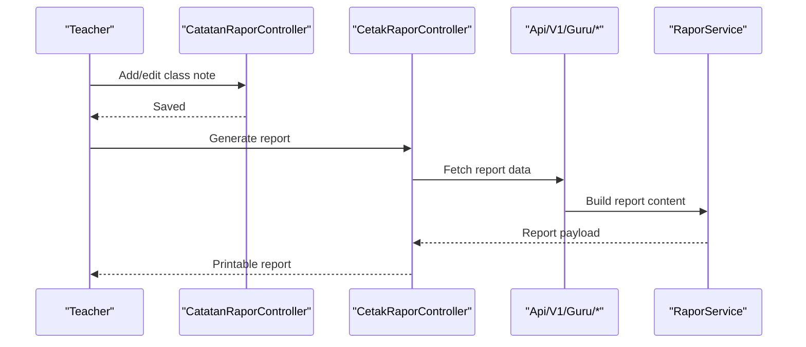

**Diagram sources**
- [app/Http/Controllers/Guru/CatatanRaporController.php](file://app/Http/Controllers/Guru/CatatanRaporController.php)
- [app/Http/Controllers/Api/V1/Guru/CatatanRaporController.php](file://app/Http/Controllers/Api/V1/Guru/CatatanRaporController.php)
- [app/Http/Controllers/Guru/CetakRaporController.php](file://app/Http/Controllers/Guru/CetakRaporController.php)
- [app/Http/Controllers/Api/V1/Guru/CetakRaporController.php](file://app/Http/Controllers/Api/V1/Guru/CetakRaporController.php)
- [app/Services/RaporService.php](file://app/Services/RaporService.php)
- [resources/views/guru/catatan-rapor/index.blade.php](file://resources/views/guru/catatan-rapor/index.blade.php)
- [resources/views/guru/cetak-rapor/index.blade.php](file://resources/views/guru/cetak-rapor/index.blade.php)

**Section sources**
- [app/Http/Controllers/Guru/CatatanRaporController.php](file://app/Http/Controllers/Guru/CatatanRaporController.php)
- [app/Http/Controllers/Api/V1/Guru/CatatanRaporController.php](file://app/Http/Controllers/Api/V1/Guru/CatatanRaporController.php)
- [app/Http/Controllers/Guru/CetakRaporController.php](file://app/Http/Controllers/Guru/CetakRaporController.php)
- [app/Http/Controllers/Api/V1/Guru/CetakRaporController.php](file://app/Http/Controllers/Api/V1/Guru/CetakRaporController.php)
- [app/Services/RaporService.php](file://app/Services/RaporService.php)
- [resources/views/guru/catatan-rapor/index.blade.php](file://resources/views/guru/catatan-rapor/index.blade.php)
- [resources/views/guru/cetak-rapor/index.blade.php](file://resources/views/guru/cetak-rapor/index.blade.php)

### Lesson Planning Support and Classroom Management
- Class Assignment and Members: Teachers can view and manage class lists and subject assignments.
- Learning Objectives: Teachers define and manage learning objectives aligned to subjects.

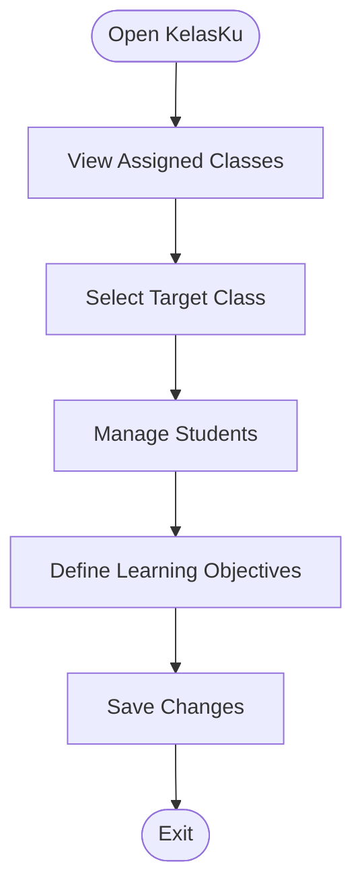

**Diagram sources**
- [app/Http/Controllers/Guru/KelasKuController.php](file://app/Http/Controllers/Guru/KelasKuController.php)
- [app/Http/Controllers/Api/V1/Guru/KelasKuController.php](file://app/Http/Controllers/Api/V1/Guru/KelasKuController.php)
- [app/Models/Kelas.php](file://app/Models/Kelas.php)
- [resources/views/guru/kelas-ku/index.blade.php](file://resources/views/guru/kelas-ku/index.blade.php)

**Section sources**
- [app/Http/Controllers/Guru/KelasKuController.php](file://app/Http/Controllers/Guru/KelasKuController.php)
- [app/Http/Controllers/Api/V1/Guru/KelasKuController.php](file://app/Http/Controllers/Api/V1/Guru/KelasKuController.php)
- [app/Models/Kelas.php](file://app/Models/Kelas.php)
- [resources/views/guru/kelas-ku/index.blade.php](file://resources/views/guru/kelas-ku/index.blade.php)

### Academic Grading and Assessment
- Subject Grades: Teachers enter and manage formative and summative assessments per subject and student.
- Grade Aggregation: Services compute averages and contribute to report generation.

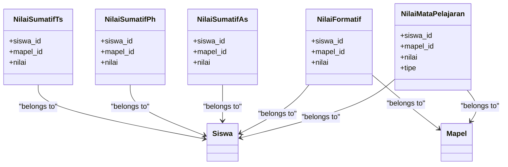

**Diagram sources**
- [app/Models/NilaiMataPelajaran.php](file://app/Models/NilaiMataPelajaran.php)
- [app/Models/NilaiFormatif.php](file://app/Models/NilaiFormatif.php)
- [app/Models/NilaiSumatifAs.php](file://app/Models/NilaiSumatifAs.php)
- [app/Models/NilaiSumatifPh.php](file://app/Models/NilaiSumatifPh.php)
- [app/Models/NilaiSumatifTs.php](file://app/Models/NilaiSumatifTs.php)

**Section sources**
- [app/Http/Controllers/Guru/PenilaianController.php](file://app/Http/Controllers/Guru/PenilaianController.php)
- [app/Http/Controllers/Api/V1/Guru/PenilaianController.php](file://app/Http/Controllers/Api/V1/Guru/PenilaianController.php)
- [app/Models/NilaiMataPelajaran.php](file://app/Models/NilaiMataPelajaran.php)
- [resources/views/guru/penilaian/index.blade.php](file://resources/views/guru/penilaian/index.blade.php)

### Teacher Dashboard, Quick Access, and Workflow Automation
- Dashboard: Summarizes total classes, students, subjects taught, grading progress, and pending notes.
- Sidebar Navigation: Provides quick links to frequently used tools.
- API Metrics: Ensures the frontend receives real-time statistics for automation and alerts.

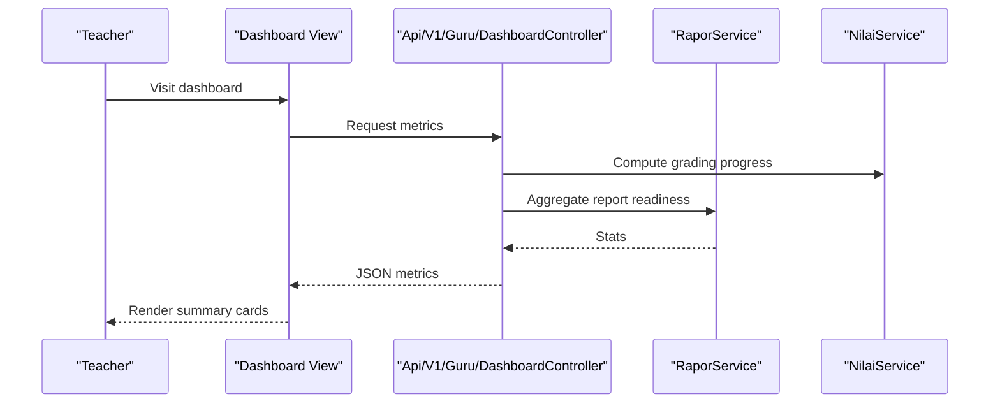

**Diagram sources**
- [app/Http/Controllers/Guru/DashboardController.php](file://app/Http/Controllers/Guru/DashboardController.php)
- [app/Http/Controllers/Api/V1/Guru/DashboardController.php](file://app/Http/Controllers/Api/V1/Guru/DashboardController.php)
- [app/Services/RaporService.php](file://app/Services/RaporService.php)
- [app/Services/NilaiService.php](file://app/Services/NilaiService.php)
- [resources/views/guru/dashboard.blade.php](file://resources/views/guru/dashboard.blade.php)
- [resources/views/components/sidebar-guru.blade.php](file://resources/views/components/sidebar-guru.blade.php)

**Section sources**
- [app/Http/Controllers/Guru/DashboardController.php](file://app/Http/Controllers/Guru/DashboardController.php)
- [app/Http/Controllers/Api/V1/Guru/DashboardController.php](file://app/Http/Controllers/Api/V1/Guru/DashboardController.php)
- [resources/views/guru/dashboard.blade.php](file://resources/views/guru/dashboard.blade.php)
- [resources/views/components/sidebar-guru.blade.php](file://resources/views/components/sidebar-guru.blade.php)
- [tests/Feature/Api/V1/GuruDashboardTest.php](file://tests/Feature/Api/V1/GuruDashboardTest.php)

## Dependency Analysis
Key dependencies among teacher tools:
- Controllers depend on models for persistence and on services for report generation and grade aggregation.
- Views rely on controllers for data rendering and on sidebar components for navigation.
- API controllers provide decoupled data sources for dashboards and mobile clients.

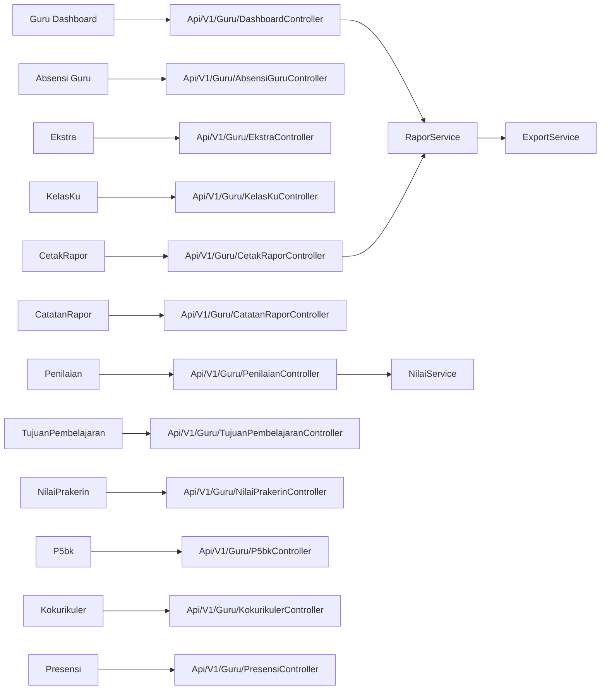

**Diagram sources**
- [app/Http/Controllers/Guru/DashboardController.php](file://app/Http/Controllers/Guru/DashboardController.php)
- [app/Http/Controllers/Api/V1/Guru/DashboardController.php](file://app/Http/Controllers/Api/V1/Guru/DashboardController.php)
- [app/Http/Controllers/Guru/AbsensiGuruController.php](file://app/Http/Controllers/Guru/AbsensiGuruController.php)
- [app/Http/Controllers/Api/V1/Guru/AbsensiGuruController.php](file://app/Http/Controllers/Api/V1/Guru/AbsensiGuruController.php)
- [app/Http/Controllers/Guru/EkstraController.php](file://app/Http/Controllers/Guru/EkstraController.php)
- [app/Http/Controllers/Api/V1/Guru/EkstraController.php](file://app/Http/Controllers/Api/V1/Guru/EkstraController.php)
- [app/Http/Controllers/Guru/KelasKuController.php](file://app/Http/Controllers/Guru/KelasKuController.php)
- [app/Http/Controllers/Api/V1/Guru/KelasKuController.php](file://app/Http/Controllers/Api/V1/Guru/KelasKuController.php)
- [app/Http/Controllers/Guru/PenilaianController.php](file://app/Http/Controllers/Guru/PenilaianController.php)
- [app/Http/Controllers/Api/V1/Guru/PenilaianController.php](file://app/Http/Controllers/Api/V1/Guru/PenilaianController.php)
- [app/Http/Controllers/Guru/CatatanRaporController.php](file://app/Http/Controllers/Guru/CatatanRaporController.php)
- [app/Http/Controllers/Api/V1/Guru/CatatanRaporController.php](file://app/Http/Controllers/Api/V1/Guru/CatatanRaporController.php)
- [app/Http/Controllers/Guru/CetakRaporController.php](file://app/Http/Controllers/Guru/CetakRaporController.php)
- [app/Http/Controllers/Api/V1/Guru/CetakRaporController.php](file://app/Http/Controllers/Api/V1/Guru/CetakRaporController.php)
- [app/Http/Controllers/Guru/TujuanPembelajaranController.php](file://app/Http/Controllers/Guru/TujuanPembelajaranController.php)
- [app/Http/Controllers/Api/V1/Guru/TujuanPembelajaranController.php](file://app/Http/Controllers/Api/V1/Guru/TujuanPembelajaranController.php)
- [app/Http/Controllers/Guru/NilaiPrakerinController.php](file://app/Http/Controllers/Guru/NilaiPrakerinController.php)
- [app/Http/Controllers/Api/V1/Guru/NilaiPrakerinController.php](file://app/Http/Controllers/Api/V1/Guru/NilaiPrakerinController.php)
- [app/Http/Controllers/Guru/P5bkController.php](file://app/Http/Controllers/Guru/P5bkController.php)
- [app/Http/Controllers/Api/V1/Guru/P5bkController.php](file://app/Http/Controllers/Api/V1/Guru/P5bkController.php)
- [app/Http/Controllers/Guru/KokurikulerController.php](file://app/Http/Controllers/Guru/KokurikulerController.php)
- [app/Http/Controllers/Api/V1/Guru/KokurikulerController.php](file://app/Http/Controllers/Api/V1/Guru/KokurikulerController.php)
- [app/Http/Controllers/Guru/PresensiController.php](file://app/Http/Controllers/Guru/PresensiController.php)
- [app/Http/Controllers/Api/V1/Guru/PresensiController.php](file://app/Http/Controllers/Api/V1/Guru/PresensiController.php)
- [app/Services/RaporService.php](file://app/Services/RaporService.php)
- [app/Services/NilaiService.php](file://app/Services/NilaiService.php)
- [app/Services/ExportService.php](file://app/Services/ExportService.php)

**Section sources**
- [app/Http/Controllers/Guru/DashboardController.php](file://app/Http/Controllers/Guru/DashboardController.php)
- [app/Http/Controllers/Api/V1/Guru/DashboardController.php](file://app/Http/Controllers/Api/V1/Guru/DashboardController.php)
- [app/Services/RaporService.php](file://app/Services/RaporService.php)
- [app/Services/NilaiService.php](file://app/Services/NilaiService.php)
- [app/Services/ExportService.php](file://app/Services/ExportService.php)

## Performance Considerations
- Prefer API endpoints for dashboard widgets to minimize server-side rendering overhead.
- Use pagination and filtering in list views to reduce payload sizes.
- Cache frequently accessed metadata (e.g., class lists, subjects) to improve responsiveness.
- Batch operations for grading and attendance to reduce round trips.

## Troubleshooting Guide
- Dashboard metrics missing or zero: Verify teacher role and assigned classes/subjects; confirm service computations are functioning.
- Attendance selfie upload failing: Check file permissions for storage and image validation rules.
- Report generation errors: Confirm report service initialization and export service availability.
- Permission denied: Ensure the teacher has access to the requested class or subject.

**Section sources**
- [tests/Feature/Api/V1/GuruDashboardTest.php](file://tests/Feature/Api/V1/GuruDashboardTest.php)

## Conclusion
RaporKM provides a comprehensive set of teacher tools covering attendance, behavior evaluation, extracurricular management, project supervision, communication, lesson planning, and reporting. The modular architecture with controllers, models, services, and views enables efficient workflows and scalable maintenance. Teachers can streamline daily tasks through the dashboard and API-backed widgets while ensuring accurate and timely report generation.

## Appendices
- Typical Teacher Workflows
  - Morning Routine: Check dashboard metrics, mark attendance, review pending notes.
  - Midday: Enter formative assessments, update extracurricular participation.
  - Afternoon: Record practical training grades, prepare report notes, print reports.
  - Weekly Review: Aggregate grades, finalize behavior descriptors, export reports.

- Best Practices
  - Keep class lists and subject assignments up-to-date.
  - Use descriptive notes for report clarity.
  - Regularly back up report data and maintain consistent grading standards.
  - Leverage API endpoints for automated dashboards and notifications.