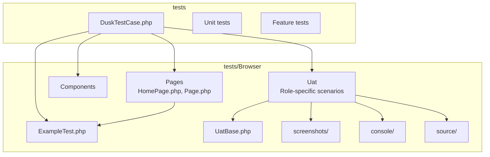
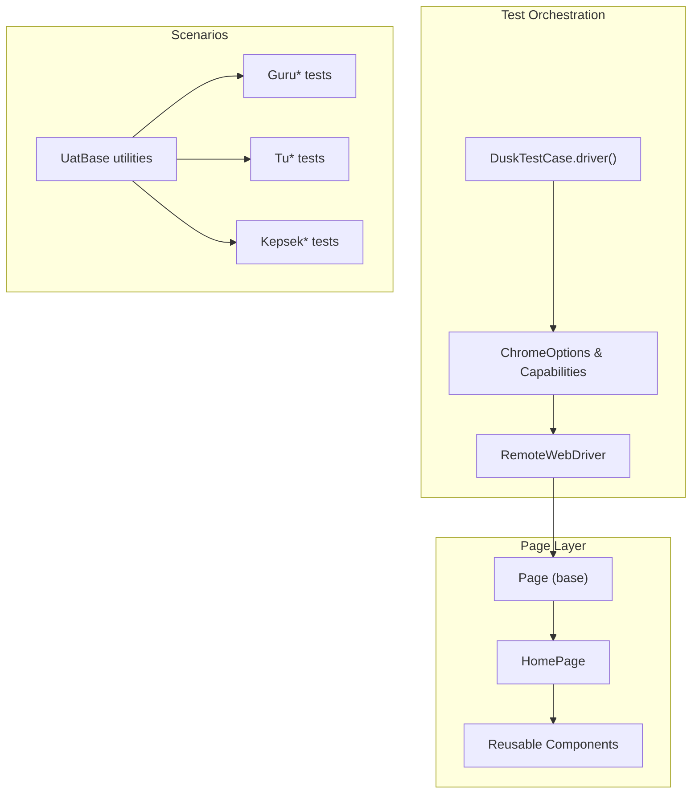
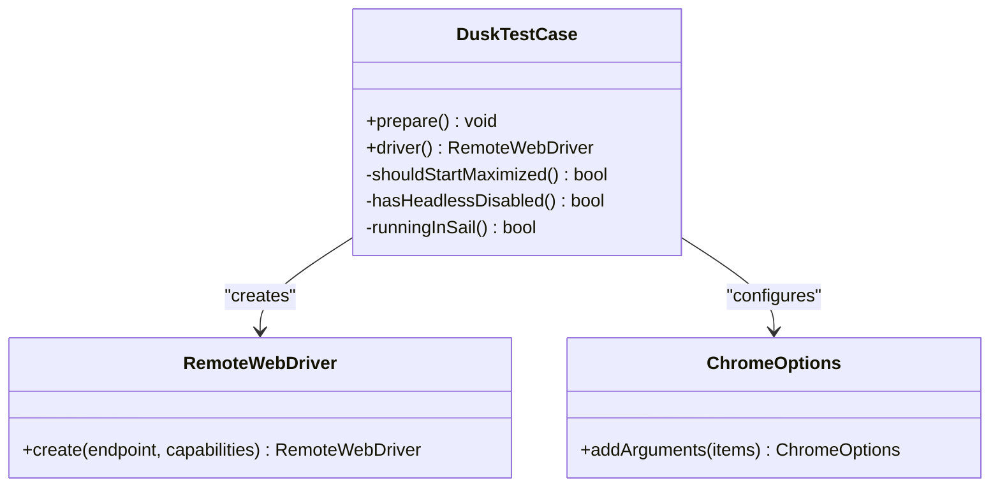
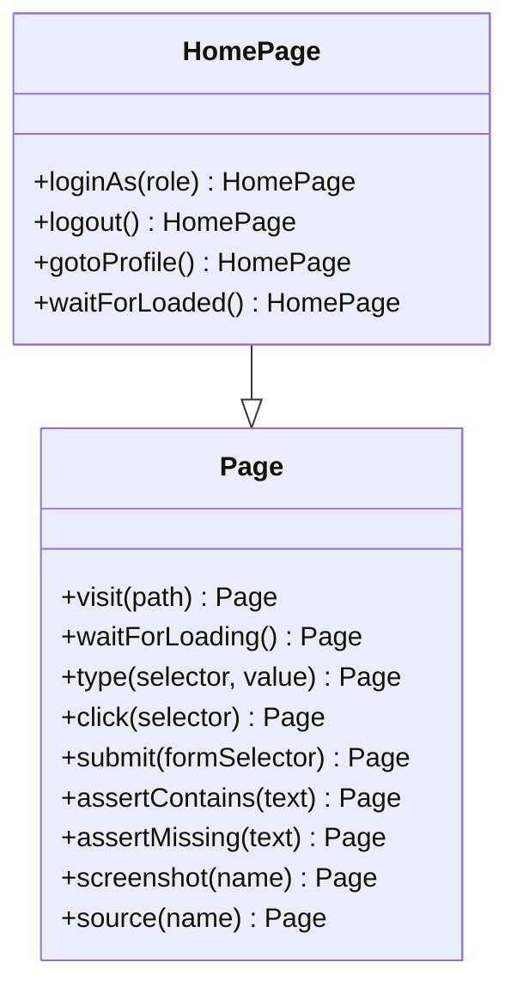
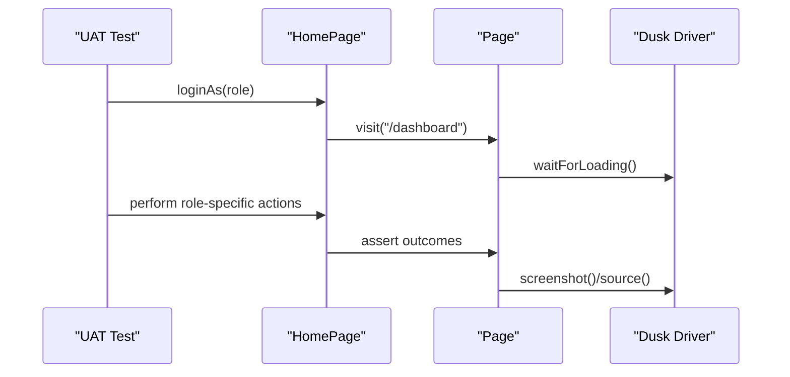
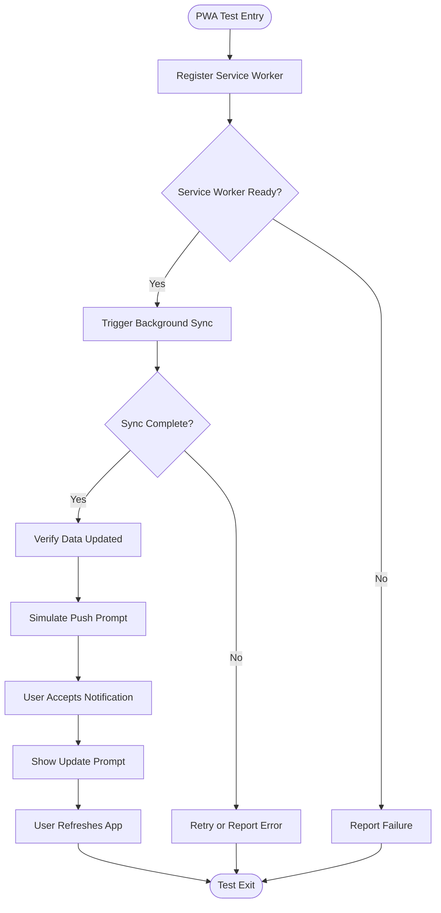
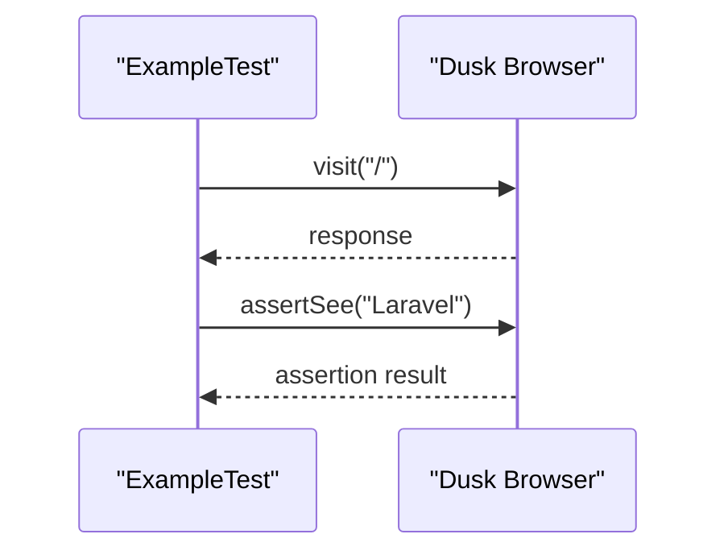
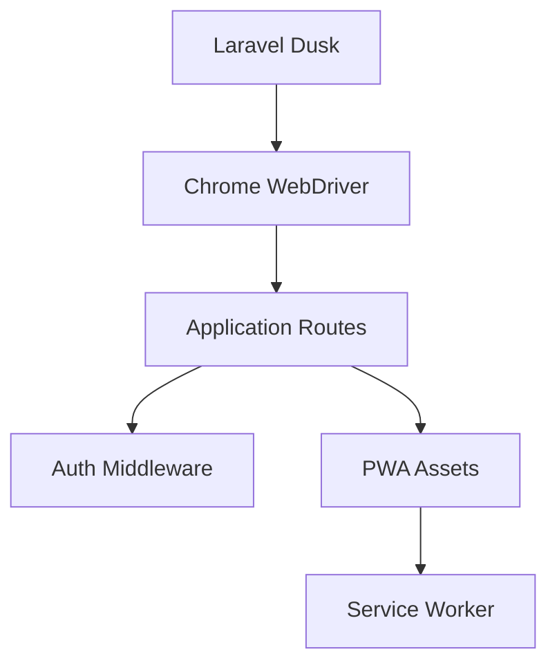

# Browser Testing

<cite>
**Referenced Files in This Document**
- [DuskTestCase.php](file://tests/DuskTestCase.php)
- [HomePage.php](file://tests/Browser/Pages/HomePage.php)
- [Page.php](file://tests/Browser/Pages/Page.php)
- [UatBase.php](file://tests/Browser/UatBase.php)
- [ExampleTest.php](file://tests/Browser/ExampleTest.php)
- [PwaBackgroundSyncTest.php](file://tests/Browser/Uat/PwaBackgroundSyncTest.php)
- [PwaPushTest.php](file://tests/Browser/Uat/PwaPushTest.php)
- [PwaUpdatePromptTest.php](file://tests/Browser/Uat/PwaUpdatePromptTest.php)
- [GuruInputNilaiTest.php](file://tests/Browser/Uat/GuruInputNilaiTest.php)
- [GuruCetakRaporTest.php](file://tests/Browser/Uat/GuruCetakRaporTest.php)
- [GuruCatatanRaporTest.php](file://tests/Browser/Uat/GuruCatatanRaporTest.php)
- [GuruProjectP5Test.php](file://tests/Browser/Uat/GuruProjectP5Test.php)
- [TuSetupKurikulumTest.php](file://tests/Browser/Uat/TuSetupKurikulumTest.php)
- [TuAssignGuruTest.php](file://tests/Browser/Uat/TuAssignGuruTest.php)
- [KepsekTtdTest.php](file://tests/Browser/Uat/KepsekTtdTest.php)
- [MenuAksesOverrideTest.php](file://tests/Browser/Uat/MenuAksesOverrideTest.php)
- [DapodikSyncTest.php](file://tests/Browser/Uat/DapodikSyncTest.php)
- [phpunit.dusk.xml](file://phpunit.dusk.xml)
- [test.yml](file://.github/workflows/test.yml)
- [manifest.json](file://public/manifest.json)
- [sw.js](file://public/sw.js)
- [pwa.js](file://public/js/pwa.js)
- [app.js](file://resources/js/app.js)
</cite>

## Table of Contents
1. [Introduction](#introduction)
2. [Project Structure](#project-structure)
3. [Core Components](#core-components)
4. [Architecture Overview](#architecture-overview)
5. [Detailed Component Analysis](#detailed-component-analysis)
6. [Dependency Analysis](#dependency-analysis)
7. [Performance Considerations](#performance-considerations)
8. [Troubleshooting Guide](#troubleshooting-guide)
9. [Conclusion](#conclusion)
10. [Appendices](#appendices)

## Introduction
This document provides comprehensive browser testing documentation for cross-browser compatibility and user experience validation using Laravel Dusk. It explains the User Acceptance Testing (UAT) framework with real user workflow scenarios, page object modeling via HomePage and a generic Page base class, and covers interactive UI testing, form submissions, dynamic content updates, and PWA functionality. It also documents driver configuration, headless execution, CI/CD integration, screenshot capture for visual regression, and debugging techniques.

## Project Structure
The browser testing suite is organized under the tests/Browser directory with three main layers:
- Pages: Page object abstractions for reusable UI interactions
- Components: Shared UI components used across pages
- Uat: UAT scenarios grouped by functional roles and features

**Diagram sources**
- [DuskTestCase.php:12-48](file://tests/DuskTestCase.php#L12-L48)
- [HomePage.php](file://tests/Browser/Pages/HomePage.php)
- [Page.php](file://tests/Browser/Pages/Page.php)
- [UatBase.php](file://tests/Browser/UatBase.php)
- [ExampleTest.php](file://tests/Browser/ExampleTest.php)

**Section sources**
- [DuskTestCase.php:12-48](file://tests/DuskTestCase.php#L12-L48)
- [HomePage.php](file://tests/Browser/Pages/HomePage.php)
- [Page.php](file://tests/Browser/Pages/Page.php)
- [UatBase.php](file://tests/Browser/UatBase.php)
- [ExampleTest.php](file://tests/Browser/ExampleTest.php)

## Core Components
- DuskTestCase: Centralized driver setup, Chrome options, and lifecycle hooks for Dusk tests
- Page base class: Shared UI interaction primitives and navigation helpers
- HomePage: Role-specific page abstraction for authenticated user journeys
- UatBase: Shared utilities and assertions for UAT scenarios
- UAT test suites: Role-based scenarios covering teacher, staff, and admin workflows

Key capabilities:
- Cross-browser readiness with Chrome driver configuration
- Headless mode support for CI environments
- Screenshot capture and source dumping for debugging
- PWA feature coverage including service worker lifecycle and push notifications

**Section sources**
- [DuskTestCase.php:12-48](file://tests/DuskTestCase.php#L12-L48)
- [Page.php](file://tests/Browser/Pages/Page.php)
- [HomePage.php](file://tests/Browser/Pages/HomePage.php)
- [UatBase.php](file://tests/Browser/UatBase.php)

## Architecture Overview
The browser testing architecture follows a layered approach:
- Test orchestration via DuskTestCase
- Page object pattern for maintainable UI interactions
- Role-specific HomePage abstractions
- UAT scenarios leveraging shared base utilities

**Diagram sources**
- [DuskTestCase.php:28-47](file://tests/DuskTestCase.php#L28-L47)
- [Page.php](file://tests/Browser/Pages/Page.php)
- [HomePage.php](file://tests/Browser/Pages/HomePage.php)
- [UatBase.php](file://tests/Browser/UatBase.php)

## Detailed Component Analysis

### DuskTestCase: Driver Setup and Configuration
DuskTestCase centralizes:
- Chrome driver lifecycle management
- Chrome options for window sizing, headless mode, and GPU acceleration
- Environment-driven driver URL configuration

**Diagram sources**
- [DuskTestCase.php:12-48](file://tests/DuskTestCase.php#L12-L48)

**Section sources**
- [DuskTestCase.php:12-48](file://tests/DuskTestCase.php#L12-L48)

### Page Object Model: Page and HomePage
The page object model separates UI concerns from test logic:
- Page: Base class with common navigation and interaction helpers
- HomePage: Role-specific home abstraction extending Page

**Diagram sources**
- [Page.php](file://tests/Browser/Pages/Page.php)
- [HomePage.php](file://tests/Browser/Pages/HomePage.php)

**Section sources**
- [Page.php](file://tests/Browser/Pages/Page.php)
- [HomePage.php](file://tests/Browser/Pages/HomePage.php)

### UAT Scenarios: Real User Workflows
UAT scenarios cover end-to-end user journeys across roles:
- Teacher workflows: grade input, report generation, co-curricular activities
- Staff workflows: curriculum setup, student management, exports
- Principal workflows: approvals and signatures
- System integrations: Dapodik sync
- PWA features: background sync, push notifications, update prompts

**Diagram sources**
- [HomePage.php](file://tests/Browser/Pages/HomePage.php)
- [Page.php](file://tests/Browser/Pages/Page.php)
- [DuskTestCase.php:28-47](file://tests/DuskTestCase.php#L28-L47)

**Section sources**
- [GuruInputNilaiTest.php](file://tests/Browser/Uat/GuruInputNilaiTest.php)
- [GuruCetakRaporTest.php](file://tests/Browser/Uat/GuruCetakRaporTest.php)
- [GuruCatatanRaporTest.php](file://tests/Browser/Uat/GuruCatatanRaporTest.php)
- [GuruProjectP5Test.php](file://tests/Browser/Uat/GuruProjectP5Test.php)
- [TuSetupKurikulumTest.php](file://tests/Browser/Uat/TuSetupKurikulumTest.php)
- [TuAssignGuruTest.php](file://tests/Browser/Uat/TuAssignGuruTest.php)
- [KepsekTtdTest.php](file://tests/Browser/Uat/KepsekTtdTest.php)
- [MenuAksesOverrideTest.php](file://tests/Browser/Uat/MenuAksesOverrideTest.php)
- [DapodikSyncTest.php](file://tests/Browser/Uat/DapodikSyncTest.php)

### PWA Functionality Testing
The application includes PWA assets and service worker logic. Browser tests validate:
- Service worker registration and lifecycle
- Background synchronization triggers
- Push notification prompts and handling
- Update prompt visibility and user actions

**Diagram sources**
- [PwaBackgroundSyncTest.php](file://tests/Browser/Uat/PwaBackgroundSyncTest.php)
- [PwaPushTest.php](file://tests/Browser/Uat/PwaPushTest.php)
- [PwaUpdatePromptTest.php](file://tests/Browser/Uat/PwaUpdatePromptTest.php)
- [manifest.json](file://public/manifest.json)
- [sw.js](file://public/sw.js)
- [pwa.js](file://public/js/pwa.js)

**Section sources**
- [PwaBackgroundSyncTest.php](file://tests/Browser/Uat/PwaBackgroundSyncTest.php)
- [PwaPushTest.php](file://tests/Browser/Uat/PwaPushTest.php)
- [PwaUpdatePromptTest.php](file://tests/Browser/Uat/PwaUpdatePromptTest.php)
- [manifest.json](file://public/manifest.json)
- [sw.js](file://public/sw.js)
- [pwa.js](file://public/js/pwa.js)

### Example Browser Test
A minimal example demonstrates the Dusk pattern:
- Using browse() to execute browser commands
- Visiting a route and asserting content presence

**Diagram sources**
- [ExampleTest.php:8-19](file://tests/Browser/ExampleTest.php#L8-L19)

**Section sources**
- [ExampleTest.php:8-19](file://tests/Browser/ExampleTest.php#L8-L19)

## Dependency Analysis
The browser testing stack integrates with:
- Laravel Dusk for browser automation
- Chrome WebDriver for rendering and scripting
- Application routes and middleware for authenticated flows
- PWA assets for service worker and offline behavior

**Diagram sources**
- [DuskTestCase.php:28-47](file://tests/DuskTestCase.php#L28-L47)
- [HomePage.php](file://tests/Browser/Pages/HomePage.php)

**Section sources**
- [DuskTestCase.php:28-47](file://tests/DuskTestCase.php#L28-L47)
- [HomePage.php](file://tests/Browser/Pages/HomePage.php)

## Performance Considerations
- Window sizing: Maximized vs fixed viewport impacts rendering and element detection
- Headless mode: Faster execution in CI but fewer screenshots
- GPU acceleration: Disabled in headless mode to avoid rendering differences
- Asynchronous operations: Use explicit waits and loading indicators
- Screenshot frequency: Limit to critical failure points to reduce overhead

## Troubleshooting Guide
Common browser testing challenges and resolutions:
- Driver connection failures: Verify DUSK_DRIVER_URL and port availability
- Headless rendering differences: Compare screenshots across environments
- Timing issues: Add explicit waits for dynamic content and AJAX responses
- PWA behavior: Ensure service worker registration and network conditions are simulated
- Debugging aids: Use screenshot() and source() to capture state during failures

**Section sources**
- [DuskTestCase.php:17-23](file://tests/DuskTestCase.php#L17-L23)
- [DuskTestCase.php:41-47](file://tests/DuskTestCase.php#L41-L47)
- [Page.php](file://tests/Browser/Pages/Page.php)

## Conclusion
The browser testing framework leverages Laravel Dusk with a robust page object model and role-specific home pages to deliver reliable cross-browser UAT. By combining headless execution, screenshot capture, and PWA-specific scenarios, teams can validate real user workflows, interactive components, and dynamic content updates effectively. CI/CD integration ensures continuous validation across environments.

## Appendices

### Test Environment Configuration
- Driver URL: Configurable via DUSK_DRIVER_URL environment variable
- Headless mode: Controlled by headless flags in Chrome options
- Window sizing: Maximized by default unless disabled

**Section sources**
- [DuskTestCase.php:41-47](file://tests/DuskTestCase.php#L41-L47)

### CI/CD Integration
GitHub Actions workflow executes browser tests in headless mode. Configure secrets for driver connectivity and adjust matrix builds for cross-browser testing.

**Section sources**
- [.github/workflows/test.yml](file://.github/workflows/test.yml)

### Running the Suite
- Local execution: Use phpunit with Dusk configuration
- Headless execution: Enable headless flags in Chrome options
- Screenshots and source dumps: Captured automatically per scenario

**Section sources**
- [phpunit.dusk.xml](file://phpunit.dusk.xml)
- [DuskTestCase.php:34-39](file://tests/DuskTestCase.php#L34-L39)