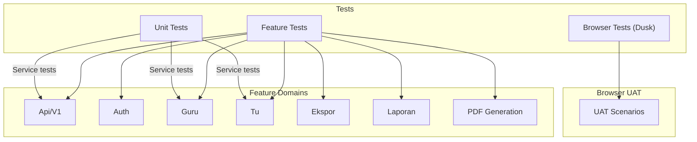
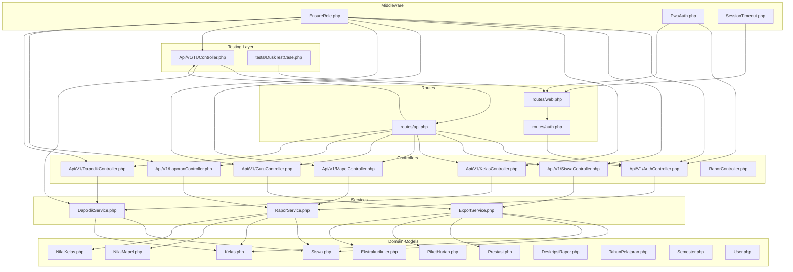
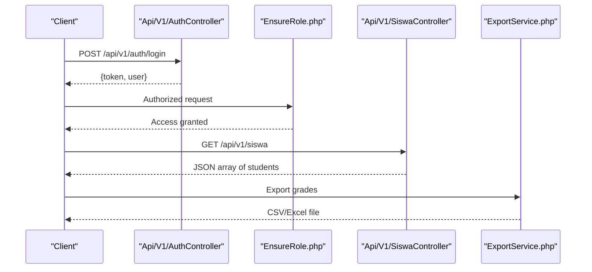
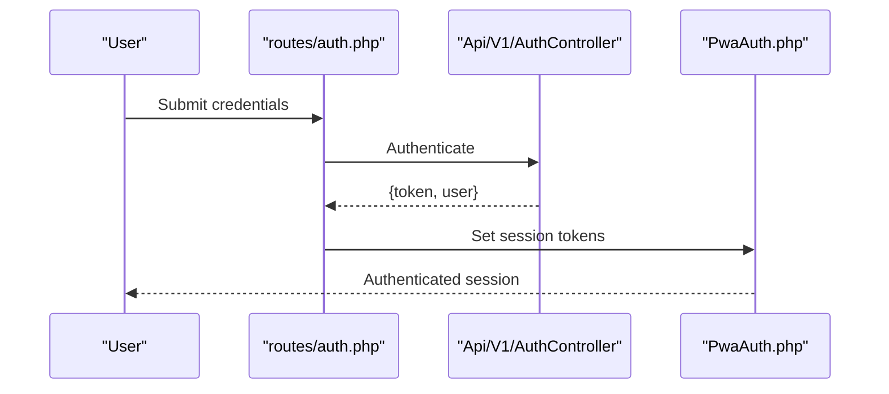
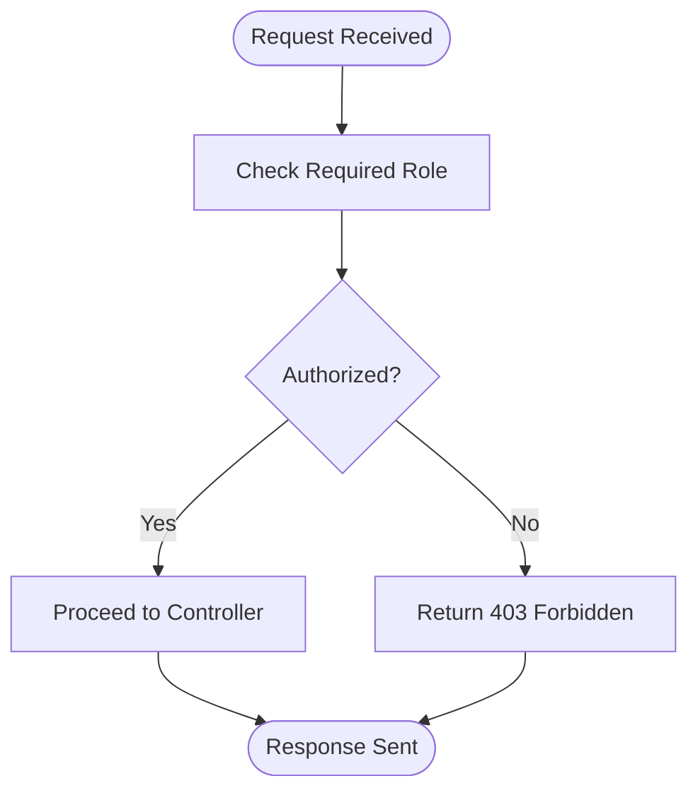
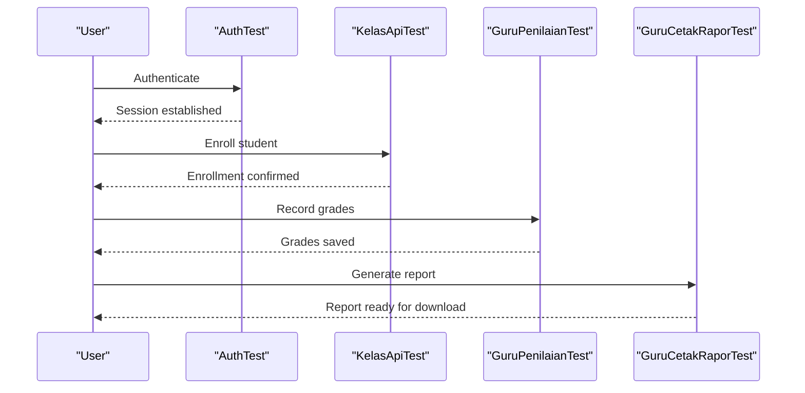
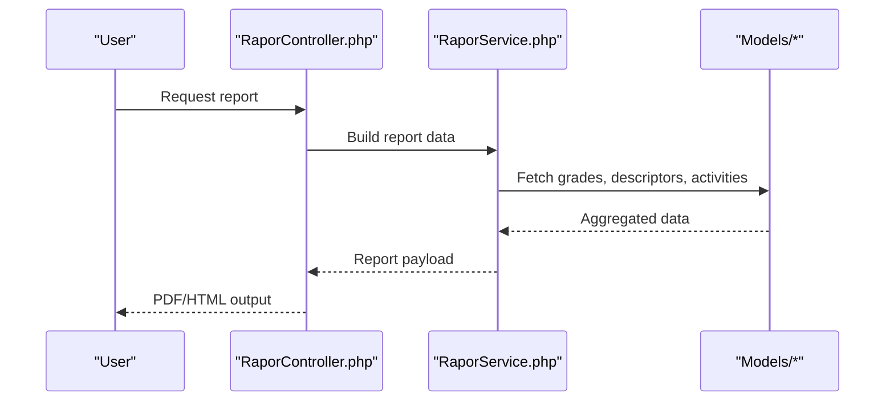
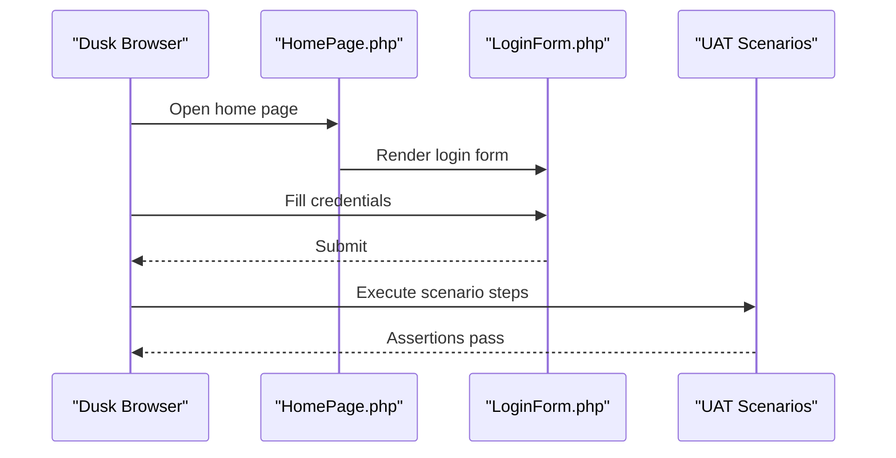
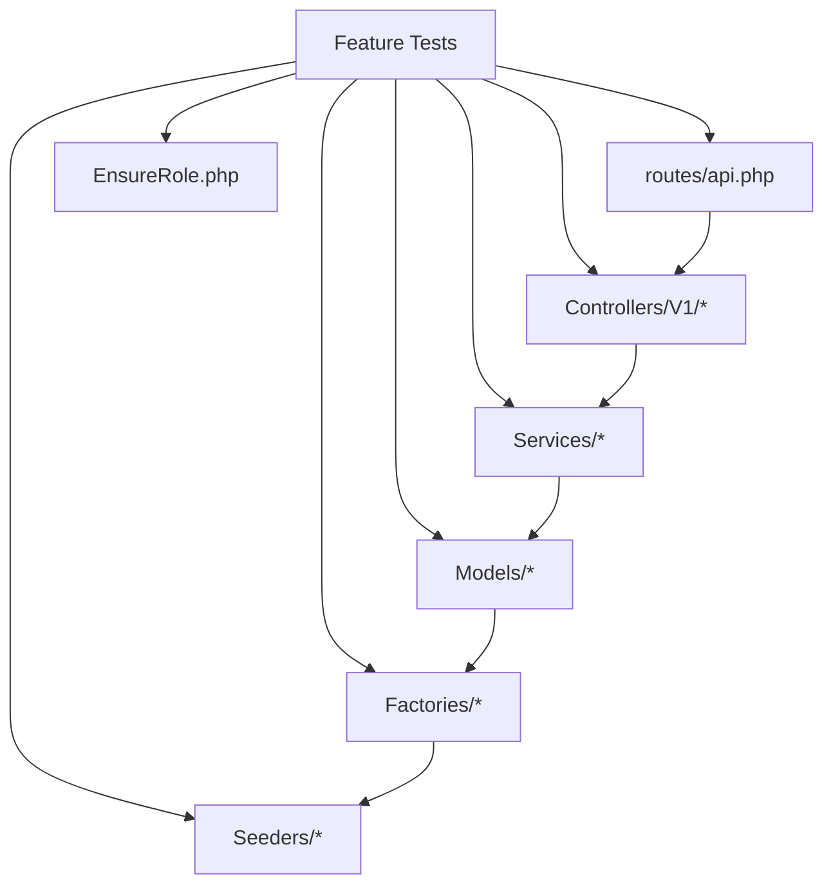

# Feature Testing

<cite>
**Referenced Files in This Document**
- [README.md](file://README.md)
- [routes/api.php](file://routes/api.php)
- [routes/web.php](file://routes/web.php)
- [routes/auth.php](file://routes/auth.php)
- [app/Http/Middleware/EnsureRole.php](file://app/Http/Middleware/EnsureRole.php)
- [app/Http/Middleware/PwaAuth.php](file://app/Http/Middleware/PwaAuth.php)
- [app/Http/Middleware/SessionTimeout.php](file://app/Http/Middleware/SessionTimeout.php)
- [app/Http/Controllers/Api/V1/AuthController.php](file://app/Http/Controllers/Api/V1/AuthController.php)
- [app/Http/Controllers/Api/V1/SiswaController.php](file://app/Http/Controllers/Api/V1/SiswaController.php)
- [app/Http/Controllers/Api/V1/KelasController.php](file://app/Http/Controllers/Api/V1/KelasController.php)
- [app/Http/Controllers/Api/V1/MapelController.php](file://app/Http/Controllers/Api/V1/MapelController.php)
- [app/Http/Controllers/Api/V1/GuruController.php](file://app/Http/Controllers/Api/V1/GuruController.php)
- [app/Http/Controllers/Api/V1/TUController.php](file://app/Http/Controllers/Api/V1/TUController.php)
- [app/Http/Controllers/Api/V1/LaporanController.php](file://app/Http/Controllers/Api/V1/LaporanController.php)
- [app/Http/Controllers/Api/V1/DapodikController.php](file://app/Http/Controllers/Api/V1/DapodikController.php)
- [app/Http/Controllers/RaporController.php](file://app/Http/Controllers/RaporController.php)
- [app/Services/RaporService.php](file://app/Services/RaporService.php)
- [app/Services/ExportService.php](file://app/Services/ExportService.php)
- [app/Services/DapodikService.php](file://app/Services/DapodikService.php)
- [app/Models/Siswa.php](file://app/Models/Siswa.php)
- [app/Models/Kelas.php](file://app/Models/Kelas.php)
- [app/Models/NilaiMapel.php](file://app/Models/NilaiMapel.php)
- [app/Models/NilaiKelas.php](file://app/Models/NilaiKelas.php)
- [app/Models/Prestasi.php](file://app/Models/Prestasi.php)
- [app/Models/PiketHarian.php](file://app/Models/PiketHarian.php)
- [app/Models/Ekstrakurikuler.php](file://app/Models/Ekstrakurikuler.php)
- [app/Models/DeskripsiRapor.php](file://app/Models/DeskripsiRapor.php)
- [app/Models/TahunPelajaran.php](file://app/Models/TahunPelajaran.php)
- [app/Models/Semester.php](file://app/Models/Semester.php)
- [app/Models/User.php](file://app/Models/User.php)
- [database/factories/SiswaFactory.php](file://database/factories/SiswaFactory.php)
- [database/factories/KelasFactory.php](file://database/factories/KelasFactory.php)
- [database/factories/NilaiMapelFactory.php](file://database/factories/NilaiMapelFactory.php)
- [database/factories/NilaiKelasFactory.php](file://database/factories/NilaiKelasFactory.php)
- [database/seeders/UatDataSeeder.php](file://database/seeders/UatDataSeeder.php)
- [database/seeders/UserSeeder.php](file://database/seeders/UserSeeder.php)
- [tests/TestCase.php](file://tests/TestCase.php)
- [tests/DuskTestCase.php](file://tests/DuskTestCase.php)
- [tests/Feature/Api/V1/AuthTest.php](file://tests/Feature/Api/V1/AuthTest.php)
- [tests/Feature/Api/V1/SiswaApiTest.php](file://tests/Feature/Api/V1/SiswaApiTest.php)
- [tests/Feature/Api/V1/KelasApiTest.php](file://tests/Feature/Api/V1/KelasApiTest.php)
- [tests/Feature/Api/V1/MapelApiTest.php](file://tests/Feature/Api/V1/MapelApiTest.php)
- [tests/Feature/Api/V1/GuruCatatanRaporTest.php](file://tests/Feature/Api/V1/GuruCatatanRaporTest.php)
- [tests/Feature/Api/V1/GuruCetakRaporTest.php](file://tests/Feature/Api/V1/GuruCetakRaporTest.php)
- [tests/Feature/Api/V1/TuCetakRaporTest.php](file://tests/Feature/Api/V1/TuCetakRaporTest.php)
- [tests/Feature/Api/V1/TuDashboardTest.php](file://tests/Feature/Api/V1/TuDashboardTest.php)
- [tests/Feature/Api/V1/ReferensiTest.php](file://tests/Feature/Api/V1/ReferensiTest.php)
- [tests/Feature/Api/V1/P5bkApiTest.php](file://tests/Feature/Api/V1/P5bkApiTest.php)
- [tests/Feature/Api/V1/KelasWaliApiTest.php](file://tests/Feature/Api/V1/KelasWaliApiTest.php)
- [tests/Feature/Api/V1/RekapPresensiApiTest.php](file://tests/Feature/Api/V1/RekapPresensiApiTest.php)
- [tests/Feature/Api/V1/PrakerinApiTest.php](file://tests/Feature/Api/V1/PrakerinApiTest.php)
- [tests/Feature/Api/V1/KokurikulerApiTest.php](file://tests/Feature/Api/V1/KokurikulerApiTest.php)
- [tests/Feature/Api/V1/EkstraApiTest.php](file://tests/Feature/Api/V1/EkstraApiTest.php)
- [tests/Feature/Api/V1/PegawaiApiTest.php](file://tests/Feature/Api/V1/PegawaiApiTest.php)
- [tests/Feature/Api/V1/ProfileApiTest.php](file://tests/Feature/Api/V1/ProfileApiTest.php)
- [tests/Feature/Api/V1/P5bkReferenceTest.php](file://tests/Feature/Api/V1/P5bkReferenceTest.php)
- [tests/Feature/Api/V1/SekolahApiTest.php](file://tests/Feature/Api/V1/SekolahApiTest.php)
- [tests/Feature/Api/V1/MapelKelasApiTest.php](file://tests/Feature/Api/V1/MapelKelasApiTest.php)
- [tests/Feature/Api/V1/GuruDashboardTest.php](file://tests/Feature/Api/V1/GuruDashboardTest.php)
- [tests/Feature/Api/V1/GuruPenilaianTest.php](file://tests/Feature/Api/V1/GuruPenilaianTest.php)
- [tests/Feature/Api/V1/PengaturanApiTest.php](file://tests/Feature/Api/V1/PengaturanApiTest.php)
- [tests/Feature/Api/V1/DapodikApiTest.php](file://tests/Feature/Api/V1/DapodikApiTest.php)
- [tests/Feature/Auth/AuthenticationTest.php](file://tests/Feature/Auth/AuthenticationTest.php)
- [tests/Feature/Auth/PasswordResetTest.php](file://tests/Feature/Auth/PasswordResetTest.php)
- [tests/Feature/Auth/PasswordUpdateTest.php](file://tests/Feature/Auth/PasswordUpdateTest.php)
- [tests/Feature/Auth/RegistrationTest.php](file://tests/Feature/Auth/RegistrationTest.php)
- [tests/Feature/Auth/PasswordConfirmationTest.php](file://tests/Feature/Auth/PasswordConfirmationTest.php)
- [tests/Feature/Auth/EmailVerificationTest.php](file://tests/Feature/Auth/EmailVerificationTest.php)
- [tests/Feature/Guru/AbsensiBk/AbsensiBkTest.php](file://tests/Feature/Guru/AbsensiBk/AbsensiBkTest.php)
- [tests/Feature/Guru/CetakRapor/CetakRaporTest.php](file://tests/Feature/Guru/CetakRapor/CetakRaporTest.php)
- [tests/Feature/Guru/Ekstra/EkstraTest.php](file://tests/Feature/Guru/Ekstra/EkstraTest.php)
- [tests/Feature/Guru/MenuAkses/MenuAksesTest.php](file://tests/Feature/Guru/MenuAkses/MenuAksesTest.php)
- [tests/Feature/Guru/NilaiPrakerin/NilaiPrakerinTest.php](file://tests/Feature/Guru/NilaiPrakerin/NilaiPrakerinTest.php)
- [tests/Feature/Guru/Organisasi/OrganisasiTest.php](file://tests/Feature/Guru/Organisasi/OrganisasiTest.php)
- [tests/Feature/Guru/PenilaianProfilPancasila/PenilaianProfilPancasilaTest.php](file://tests/Feature/Guru/PenilaianProfilPancasila/PenilaianProfilPancasilaTest.php)
- [tests/Feature/Guru/PiketHarian/PiketHarianTest.php](file://tests/Feature/Guru/PiketHarian/PiketHarianTest.php)
- [tests/Feature/Guru/Prakerin/PrakerinTest.php](file://tests/Feature/Guru/Prakerin/PrakerinTest.php)
- [tests/Feature/Guru/Presensi/PresensiTest.php](file://tests/Feature/Guru/Presensi/PresensiTest.php)
- [tests/Feature/Guru/RaporPkl/RaporPklTest.php](file://tests/Feature/Guru/RaporPkl/RaporPklTest.php)
- [tests/Feature/Guru/AuthorizationTest.php](file://tests/Feature/Guru/AuthorizationTest.php)
- [tests/Feature/Tu/BukuInduk/BukuIndukTest.php](file://tests/Feature/Tu/BukuInduk/BukuIndukTest.php)
- [tests/Feature/Tu/Dapodik/DapodikJobTest.php](file://tests/Feature/Tu/Dapodik/DapodikJobTest.php)
- [tests/Feature/Tu/Dapodik/DapodikSyncTest.php](file://tests/Feature/Tu/Dapodik/DapodikSyncTest.php)
- [tests/Feature/Tu/Ekstra/EkstraTest.php](file://tests/Feature/Tu/Ekstra/EkstraTest.php)
- [tests/Feature/Tu/Import/ImportTest.php](file://tests/Feature/Tu/Import/ImportTest.php)
- [tests/Feature/Tu/Kokurikuler/KokurikulerTest.php](file://tests/Feature/Tu/Kokurikuler/KokurikulerTest.php)
- [tests/Feature/Tu/Lulusan/LulusanTest.php](file://tests/Feature/Tu/Lulusan/LulusanTest.php)
- [tests/Feature/Tu/P5bk/P5bkTest.php](file://tests/Feature/Tu/P5bk/P5bkTest.php)
- [tests/Feature/Tu/Pengingat/PengingatTest.php](file://tests/Feature/Tu/Pengingat/PengingatTest.php)
- [tests/Feature/Tu/PiketHarian/PiketHarianTest.php](file://tests/Feature/Tu/PiketHarian/PiketHarianTest.php)
- [tests/Feature/Tu/Prakerin/PrakerinTest.php](file://tests/Feature/Tu/Prakerin/PrakerinTest.php)
- [tests/Feature/Tu/Presensi/PresensiTest.php](file://tests/Feature/Tu/Presensi/PresensiTest.php)
- [tests/Feature/Tu/Prestasi/PrestasiTest.php](file://tests/Feature/Tu/Prestasi/PrestasiTest.php)
- [tests/Feature/Tu/FactorySmokeTest.php](file://tests/Feature/Tu/FactorySmokeTest.php)
- [tests/Feature/Tu/TuWorkflowIntegrationTest.php](file://tests/Feature/Tu/TuWorkflowIntegrationTest.php)
- [tests/Feature/Ekspor/NilaiExportTest.php](file://tests/Feature/Ekspor/NilaiExportTest.php)
- [tests/Feature/Ekspor/PresensiExportTest.php](file://tests/Feature/Ekspor/PresensiExportTest.php)
- [tests/Feature/Ekspor/SiswaExportTest.php](file://tests/Feature/Ekspor/SiswaExportTest.php)
- [tests/Feature/Laporan/PendidikanTest.php](file://tests/Feature/Laporan/PendidikanTest.php)
- [tests/Feature/RaporPdfTest.php](file://tests/Feature/RaporPdfTest.php)
- [tests/Feature/RaporMidPdfTest.php](file://tests/Feature/RaporMidPdfTest.php)
- [tests/Feature/RaporPklPdfTest.php](file://tests/Feature/RaporPklPdfTest.php)
- [tests/Feature/LagerNilaiPdfTest.php](file://tests/Feature/LagerNilaiPdfTest.php)
- [tests/Feature/NilaiSumatifAsObserverTest.php](file://tests/Feature/NilaiSumatifAsObserverTest.php)
- [tests/Feature/PenilaianFormatifTest.php](file://tests/Feature/PenilaianFormatifTest.php)
- [tests/Feature/ProfileTest.php](file://tests/Feature/ProfileTest.php)
- [tests/Browser/Uat/DapodikSyncTest.php](file://tests/Browser/Uat/DapodikSyncTest.php)
- [tests/Browser/Uat/GuruCatatanRaporTest.php](file://tests/Browser/Uat/GuruCatatanRaporTest.php)
- [tests/Browser/Uat/GuruCetakRaporTest.php](file://tests/Browser/Uat/GuruCetakRaporTest.php)
- [tests/Browser/Uat/GuruInputNilaiTest.php](file://tests/Browser/Uat/GuruInputNilaiTest.php)
- [tests/Browser/Uat/GuruProjectP5Test.php](file://tests/Browser/Uat/GuruProjectP5Test.php)
- [tests/Browser/Uat/KepsekTtdTest.php](file://tests/Browser/Uat/KepsekTtdTest.php)
- [tests/Browser/Uat/MenuAksesOverrideTest.php](file://tests/Browser/Uat/MenuAksesOverrideTest.php)
- [tests/Browser/Uat/PwaBackgroundSyncTest.php](file://tests/Browser/Uat/PwaBackgroundSyncTest.php)
- [tests/Browser/Uat/PwaPushTest.php](file://tests/Browser/Uat/PwaPushTest.php)
- [tests/Browser/Uat/PwaUpdatePromptTest.php](file://tests/Browser/Uat/PwaUpdatePromptTest.php)
- [tests/Browser/Uat/TuAssignGuruTest.php](file://tests/Browser/Uat/TuAssignGuruTest.php)
- [tests/Browser/Uat/TuKelolaSiswaTest.php](file://tests/Browser/Uat/TuKelolaSiswaTest.php)
- [tests/Browser/Uat/TuSetupKurikulumTest.php](file://tests/Browser/Uat/TuSetupKurikulumTest.php)
- [tests/Browser/UatBase.php](file://tests/Browser/UatBase.php)
- [tests/Browser/Pages/HomePage.php](file://tests/Browser/Pages/HomePage.php)
- [tests/Browser/Components/LoginForm.php](file://tests/Browser/Components/LoginForm.php)
</cite>

## Table of Contents
1. [Introduction](#introduction)
2. [Project Structure](#project-structure)
3. [Core Components](#core-components)
4. [Architecture Overview](#architecture-overview)
5. [Detailed Component Analysis](#detailed-component-analysis)
6. [Dependency Analysis](#dependency-analysis)
7. [Performance Considerations](#performance-considerations)
8. [Troubleshooting Guide](#troubleshooting-guide)
9. [Conclusion](#conclusion)
10. [Appendices](#appendices)

## Introduction
This document describes the feature testing suite for the e-learning reporting platform. It covers end-to-end workflow testing, component integration validation, and API testing for V1 endpoints. It explains authentication workflows, role-specific functionality, and complete user journeys from request initiation to response validation. It also documents testing of teacher tools, administrative features, and report generation workflows, along with test organization by feature areas, request/response validation, status code verification, database state management, transaction rollback strategies, test data isolation, and guidelines for robust feature tests and asynchronous operation handling.

## Project Structure
The testing suite is organized into three main categories:
- Feature tests: High-level behavioral tests for controllers, services, and workflows.
- Browser tests: UAT-style tests using Dusk for realistic user interactions.
- Unit tests: Focused tests for services and helpers.

Key directories and files:
- Feature tests grouped by domain: Api/V1, Auth, Guru, Tu, Ekspor, Laporan, and PDF generation tests.
- Browser UAT tests under tests/Browser/Uat for real user scenarios.
- Shared base test classes for bootstrapping and assertions.
- Route definitions for API and web endpoints.
- Middleware enforcing roles and session policies.
- Domain models and factories for deterministic test data.

**Section sources**
- [tests/Feature/Api/V1/AuthTest.php](file://tests/Feature/Api/V1/AuthTest.php)
- [tests/Feature/Api/V1/SiswaApiTest.php](file://tests/Feature/Api/V1/SiswaApiTest.php)
- [tests/Feature/Api/V1/KelasApiTest.php](file://tests/Feature/Api/V1/KelasApiTest.php)
- [tests/Feature/Api/V1/MapelApiTest.php](file://tests/Feature/Api/V1/MapelApiTest.php)
- [tests/Feature/Api/V1/GuruCatatanRaporTest.php](file://tests/Feature/Api/V1/GuruCatatanRaporTest.php)
- [tests/Feature/Api/V1/GuruCetakRaporTest.php](file://tests/Feature/Api/V1/GuruCetakRaporTest.php)
- [tests/Feature/Api/V1/TuCetakRaporTest.php](file://tests/Feature/Api/V1/TuCetakRaporTest.php)
- [tests/Feature/Api/V1/TuDashboardTest.php](file://tests/Feature/Api/V1/TuDashboardTest.php)
- [tests/Feature/Api/V1/ReferensiTest.php](file://tests/Feature/Api/V1/ReferensiTest.php)
- [tests/Feature/Api/V1/P5bkApiTest.php](file://tests/Feature/Api/V1/P5bkApiTest.php)
- [tests/Feature/Api/V1/KelasWaliApiTest.php](file://tests/Feature/Api/V1/KelasWaliApiTest.php)
- [tests/Feature/Api/V1/RekapPresensiApiTest.php](file://tests/Feature/Api/V1/RekapPresensiApiTest.php)
- [tests/Feature/Api/V1/PrakerinApiTest.php](file://tests/Feature/Api/V1/PrakerinApiTest.php)
- [tests/Feature/Api/V1/KokurikulerApiTest.php](file://tests/Feature/Api/V1/KokurikulerApiTest.php)
- [tests/Feature/Api/V1/EkstraApiTest.php](file://tests/Feature/Api/V1/EkstraApiTest.php)
- [tests/Feature/Api/V1/PegawaiApiTest.php](file://tests/Feature/Api/V1/PegawaiApiTest.php)
- [tests/Feature/Api/V1/ProfileApiTest.php](file://tests/Feature/Api/V1/ProfileApiTest.php)
- [tests/Feature/Api/V1/P5bkReferenceTest.php](file://tests/Feature/Api/V1/P5bkReferenceTest.php)
- [tests/Feature/Api/V1/SekolahApiTest.php](file://tests/Feature/Api/V1/SekolahApiTest.php)
- [tests/Feature/Api/V1/MapelKelasApiTest.php](file://tests/Feature/Api/V1/MapelKelasApiTest.php)
- [tests/Feature/Api/V1/GuruDashboardTest.php](file://tests/Feature/Api/V1/GuruDashboardTest.php)
- [tests/Feature/Api/V1/GuruPenilaianTest.php](file://tests/Feature/Api/V1/GuruPenilaianTest.php)
- [tests/Feature/Api/V1/PengaturanApiTest.php](file://tests/Feature/Api/V1/PengaturanApiTest.php)
- [tests/Feature/Api/V1/DapodikApiTest.php](file://tests/Feature/Api/V1/DapodikApiTest.php)
- [tests/Feature/Auth/AuthenticationTest.php](file://tests/Feature/Auth/AuthenticationTest.php)
- [tests/Feature/Auth/PasswordResetTest.php](file://tests/Feature/Auth/PasswordResetTest.php)
- [tests/Feature/Auth/PasswordUpdateTest.php](file://tests/Feature/Auth/PasswordUpdateTest.php)
- [tests/Feature/Auth/RegistrationTest.php](file://tests/Feature/Auth/RegistrationTest.php)
- [tests/Feature/Auth/PasswordConfirmationTest.php](file://tests/Feature/Auth/PasswordConfirmationTest.php)
- [tests/Feature/Auth/EmailVerificationTest.php](file://tests/Feature/Auth/EmailVerificationTest.php)
- [tests/Feature/Guru/AbsensiBk/AbsensiBkTest.php](file://tests/Feature/Guru/AbsensiBk/AbsensiBkTest.php)
- [tests/Feature/Guru/CetakRapor/CetakRaporTest.php](file://tests/Feature/Guru/CetakRapor/CetakRaporTest.php)
- [tests/Feature/Guru/Ekstra/EkstraTest.php](file://tests/Feature/Guru/Ekstra/EkstraTest.php)
- [tests/Feature/Guru/MenuAkses/MenuAksesTest.php](file://tests/Feature/Guru/MenuAkses/MenuAksesTest.php)
- [tests/Feature/Guru/NilaiPrakerin/NilaiPrakerinTest.php](file://tests/Feature/Guru/NilaiPrakerin/NilaiPrakerinTest.php)
- [tests/Feature/Guru/Organisasi/OrganisasiTest.php](file://tests/Feature/Guru/Organisasi/OrganisasiTest.php)
- [tests/Feature/Guru/PenilaianProfilPancasila/PenilaianProfilPancasilaTest.php](file://tests/Feature/Guru/PenilaianProfilPancasila/PenilaianProfilPancasilaTest.php)
- [tests/Feature/Guru/PiketHarian/PiketHarianTest.php](file://tests/Feature/Guru/PiketHarian/PiketHarianTest.php)
- [tests/Feature/Guru/Prakerin/PrakerinTest.php](file://tests/Feature/Guru/Prakerin/PrakerinTest.php)
- [tests/Feature/Guru/Presensi/PresensiTest.php](file://tests/Feature/Guru/Presensi/PresensiTest.php)
- [tests/Feature/Guru/RaporPkl/RaporPklTest.php](file://tests/Feature/Guru/RaporPkl/RaporPklTest.php)
- [tests/Feature/Guru/AuthorizationTest.php](file://tests/Feature/Guru/AuthorizationTest.php)
- [tests/Feature/Tu/BukuInduk/BukuIndukTest.php](file://tests/Feature/Tu/BukuInduk/BukuIndukTest.php)
- [tests/Feature/Tu/Dapodik/DapodikJobTest.php](file://tests/Feature/Tu/Dapodik/DapodikJobTest.php)
- [tests/Feature/Tu/Dapodik/DapodikSyncTest.php](file://tests/Feature/Tu/Dapodik/DapodikSyncTest.php)
- [tests/Feature/Tu/Ekstra/EkstraTest.php](file://tests/Feature/Tu/Ekstra/EkstraTest.php)
- [tests/Feature/Tu/Import/ImportTest.php](file://tests/Feature/Tu/Import/ImportTest.php)
- [tests/Feature/Tu/Kokurikuler/KokurikulerTest.php](file://tests/Feature/Tu/Kokurikuler/KokurikulerTest.php)
- [tests/Feature/Tu/Lulusan/LulusanTest.php](file://tests/Feature/Tu/Lulusan/LulusanTest.php)
- [tests/Feature/Tu/P5bk/P5bkTest.php](file://tests/Feature/Tu/P5bk/P5bkTest.php)
- [tests/Feature/Tu/Pengingat/PengingatTest.php](file://tests/Feature/Tu/Pengingat/PengingatTest.php)
- [tests/Feature/Tu/PiketHarian/PiketHarianTest.php](file://tests/Feature/Tu/PiketHarian/PiketHarianTest.php)
- [tests/Feature/Tu/Prakerin/PrakerinTest.php](file://tests/Feature/Tu/Prakerin/PrakerinTest.php)
- [tests/Feature/Tu/Presensi/PresensiTest.php](file://tests/Feature/Tu/Presensi/PresensiTest.php)
- [tests/Feature/Tu/Prestasi/PrestasiTest.php](file://tests/Feature/Tu/Prestasi/PrestasiTest.php)
- [tests/Feature/Tu/FactorySmokeTest.php](file://tests/Feature/Tu/FactorySmokeTest.php)
- [tests/Feature/Tu/TuWorkflowIntegrationTest.php](file://tests/Feature/Tu/TuWorkflowIntegrationTest.php)
- [tests/Feature/Ekspor/NilaiExportTest.php](file://tests/Feature/Ekspor/NilaiExportTest.php)
- [tests/Feature/Ekspor/PresensiExportTest.php](file://tests/Feature/Ekspor/PresensiExportTest.php)
- [tests/Feature/Ekspor/SiswaExportTest.php](file://tests/Feature/Ekspor/SiswaExportTest.php)
- [tests/Feature/Laporan/PendidikanTest.php](file://tests/Feature/Laporan/PendidikanTest.php)
- [tests/Feature/RaporPdfTest.php](file://tests/Feature/RaporPdfTest.php)
- [tests/Feature/RaporMidPdfTest.php](file://tests/Feature/RaporMidPdfTest.php)
- [tests/Feature/RaporPklPdfTest.php](file://tests/Feature/RaporPklPdfTest.php)
- [tests/Feature/LagerNilaiPdfTest.php](file://tests/Feature/LagerNilaiPdfTest.php)
- [tests/Feature/NilaiSumatifAsObserverTest.php](file://tests/Feature/NilaiSumatifAsObserverTest.php)
- [tests/Feature/PenilaianFormatifTest.php](file://tests/Feature/PenilaianFormatifTest.php)
- [tests/Feature/ProfileTest.php](file://tests/Feature/ProfileTest.php)
- [tests/Browser/Uat/DapodikSyncTest.php](file://tests/Browser/Uat/DapodikSyncTest.php)
- [tests/Browser/Uat/GuruCatatanRaporTest.php](file://tests/Browser/Uat/GuruCatatanRaporTest.php)
- [tests/Browser/Uat/GuruCetakRaporTest.php](file://tests/Browser/Uat/GuruCetakRaporTest.php)
- [tests/Browser/Uat/GuruInputNilaiTest.php](file://tests/Browser/Uat/GuruInputNilaiTest.php)
- [tests/Browser/Uat/GuruProjectP5Test.php](file://tests/Browser/Uat/GuruProjectP5Test.php)
- [tests/Browser/Uat/KepsekTtdTest.php](file://tests/Browser/Uat/KepsekTtdTest.php)
- [tests/Browser/Uat/MenuAksesOverrideTest.php](file://tests/Browser/Uat/MenuAksesOverrideTest.php)
- [tests/Browser/Uat/PwaBackgroundSyncTest.php](file://tests/Browser/Uat/PwaBackgroundSyncTest.php)
- [tests/Browser/Uat/PwaPushTest.php](file://tests/Browser/Uat/PwaPushTest.php)
- [tests/Browser/Uat/PwaUpdatePromptTest.php](file://tests/Browser/Uat/PwaUpdatePromptTest.php)
- [tests/Browser/Uat/TuAssignGuruTest.php](file://tests/Browser/Uat/TuAssignGuruTest.php)
- [tests/Browser/Uat/TuKelolaSiswaTest.php](file://tests/Browser/Uat/TuKelolaSiswaTest.php)
- [tests/Browser/Uat/TuSetupKurikulumTest.php](file://tests/Browser/Uat/TuSetupKurikulumTest.php)
- [tests/Browser/UatBase.php](file://tests/Browser/UatBase.php)
- [tests/Browser/Pages/HomePage.php](file://tests/Browser/Pages/HomePage.php)
- [tests/Browser/Components/LoginForm.php](file://tests/Browser/Components/LoginForm.php)

## Core Components
- Test base classes:
  - tests/TestCase.php: Base for all tests, provides container bootstrapping and shared utilities.
  - tests/DuskTestCase.php: Base for browser tests, integrates Laravel Dusk.
- Middleware:
  - app/Http/Middleware/EnsureRole.php: Enforces role-based access for controllers.
  - app/Http/Middleware/PwaAuth.php: Handles PWA authentication flows.
  - app/Http/Middleware/SessionTimeout.php: Manages session lifecycle.
- API routes:
  - routes/api.php: Defines V1 API endpoints for authentication, academic management, administrative functions, and reports.
- Web routes:
  - routes/web.php: Application UI routes.
  - routes/auth.php: Authentication web routes.
- Controllers:
  - app/Http/Controllers/Api/V1/*: V1 API controllers for students, classes, subjects, teachers, TU, reports, and Dapodik.
  - app/Http/Controllers/RaporController.php: Report generation controller.
- Services:
  - app/Services/RaporService.php: Generates report-related data and artifacts.
  - app/Services/ExportService.php: Handles export functionality.
  - app/Services/DapodikService.php: Integrates with Dapodik sync operations.
- Models:
  - app/Models/*: Domain models representing entities such as students, classes, grades, activities, and descriptors.
- Factories and Seeders:
  - database/factories/*: Deterministic factories for model creation.
  - database/seeders/UatDataSeeder.php and database/seeders/UserSeeder.php: Populate test environments with realistic data.

**Section sources**
- [tests/TestCase.php](file://tests/TestCase.php)
- [tests/DuskTestCase.php](file://tests/DuskTestCase.php)
- [app/Http/Middleware/EnsureRole.php](file://app/Http/Middleware/EnsureRole.php)
- [app/Http/Middleware/PwaAuth.php](file://app/Http/Middleware/PwaAuth.php)
- [app/Http/Middleware/SessionTimeout.php](file://app/Http/Middleware/SessionTimeout.php)
- [routes/api.php](file://routes/api.php)
- [routes/web.php](file://routes/web.php)
- [routes/auth.php](file://routes/auth.php)
- [app/Http/Controllers/Api/V1/AuthController.php](file://app/Http/Controllers/Api/V1/AuthController.php)
- [app/Http/Controllers/Api/V1/SiswaController.php](file://app/Http/Controllers/Api/V1/SiswaController.php)
- [app/Http/Controllers/Api/V1/KelasController.php](file://app/Http/Controllers/Api/V1/KelasController.php)
- [app/Http/Controllers/Api/V1/MapelController.php](file://app/Http/Controllers/Api/V1/MapelController.php)
- [app/Http/Controllers/Api/V1/GuruController.php](file://app/Http/Controllers/Api/V1/GuruController.php)
- [app/Http/Controllers/Api/V1/TUController.php](file://app/Http/Controllers/Api/V1/TUController.php)
- [app/Http/Controllers/Api/V1/LaporanController.php](file://app/Http/Controllers/Api/V1/LaporanController.php)
- [app/Http/Controllers/Api/V1/DapodikController.php](file://app/Http/Controllers/Api/V1/DapodikController.php)
- [app/Http/Controllers/RaporController.php](file://app/Http/Controllers/RaporController.php)
- [app/Services/RaporService.php](file://app/Services/RaporService.php)
- [app/Services/ExportService.php](file://app/Services/ExportService.php)
- [app/Services/DapodikService.php](file://app/Services/DapodikService.php)
- [app/Models/Siswa.php](file://app/Models/Siswa.php)
- [app/Models/Kelas.php](file://app/Models/Kelas.php)
- [app/Models/NilaiMapel.php](file://app/Models/NilaiMapel.php)
- [app/Models/NilaiKelas.php](file://app/Models/NilaiKelas.php)
- [app/Models/Prestasi.php](file://app/Models/Prestasi.php)
- [app/Models/PiketHarian.php](file://app/Models/PiketHarian.php)
- [app/Models/Ekstrakurikuler.php](file://app/Models/Ekstrakurikuler.php)
- [app/Models/DeskripsiRapor.php](file://app/Models/DeskripsiRapor.php)
- [app/Models/TahunPelajaran.php](file://app/Models/TahunPelajaran.php)
- [app/Models/Semester.php](file://app/Models/Semester.php)
- [app/Models/User.php](file://app/Models/User.php)
- [database/factories/SiswaFactory.php](file://database/factories/SiswaFactory.php)
- [database/factories/KelasFactory.php](file://database/factories/KelasFactory.php)
- [database/factories/NilaiMapelFactory.php](file://database/factories/NilaiMapelFactory.php)
- [database/factories/NilaiKelasFactory.php](file://database/factories/NilaiKelasFactory.php)
- [database/seeders/UatDataSeeder.php](file://database/seeders/UatDataSeeder.php)
- [database/seeders/UserSeeder.php](file://database/seeders/UserSeeder.php)

## Architecture Overview
The feature testing architecture spans API, web, and browser layers, with middleware enforcing roles and session policies. Controllers expose V1 endpoints for academic and administrative functions. Services encapsulate business logic for reports, exports, and Dapodik integration. Factories and seeders provide deterministic test data. Middleware ensures that requests adhere to role-based access and session constraints.

**Diagram sources**
- [tests/TestCase.php](file://tests/TestCase.php)
- [tests/DuskTestCase.php](file://tests/DuskTestCase.php)
- [app/Http/Middleware/EnsureRole.php](file://app/Http/Middleware/EnsureRole.php)
- [app/Http/Middleware/PwaAuth.php](file://app/Http/Middleware/PwaAuth.php)
- [app/Http/Middleware/SessionTimeout.php](file://app/Http/Middleware/SessionTimeout.php)
- [routes/api.php](file://routes/api.php)
- [routes/web.php](file://routes/web.php)
- [routes/auth.php](file://routes/auth.php)
- [app/Http/Controllers/Api/V1/AuthController.php](file://app/Http/Controllers/Api/V1/AuthController.php)
- [app/Http/Controllers/Api/V1/SiswaController.php](file://app/Http/Controllers/Api/V1/SiswaController.php)
- [app/Http/Controllers/Api/V1/KelasController.php](file://app/Http/Controllers/Api/V1/KelasController.php)
- [app/Http/Controllers/Api/V1/MapelController.php](file://app/Http/Controllers/Api/V1/MapelController.php)
- [app/Http/Controllers/Api/V1/GuruController.php](file://app/Http/Controllers/Api/V1/GuruController.php)
- [app/Http/Controllers/Api/V1/TUController.php](file://app/Http/Controllers/Api/V1/TUController.php)
- [app/Http/Controllers/Api/V1/LaporanController.php](file://app/Http/Controllers/Api/V1/LaporanController.php)
- [app/Http/Controllers/Api/V1/DapodikController.php](file://app/Http/Controllers/Api/V1/DapodikController.php)
- [app/Http/Controllers/RaporController.php](file://app/Http/Controllers/RaporController.php)
- [app/Services/RaporService.php](file://app/Services/RaporService.php)
- [app/Services/ExportService.php](file://app/Services/ExportService.php)
- [app/Services/DapodikService.php](file://app/Services/DapodikService.php)
- [app/Models/Siswa.php](file://app/Models/Siswa.php)
- [app/Models/Kelas.php](file://app/Models/Kelas.php)
- [app/Models/NilaiMapel.php](file://app/Models/NilaiMapel.php)
- [app/Models/NilaiKelas.php](file://app/Models/NilaiKelas.php)
- [app/Models/Prestasi.php](file://app/Models/Prestasi.php)
- [app/Models/PiketHarian.php](file://app/Models/PiketHarian.php)
- [app/Models/Ekstrakurikuler.php](file://app/Models/Ekstrakurikuler.php)
- [app/Models/DeskripsiRapor.php](file://app/Models/DeskripsiRapor.php)
- [app/Models/TahunPelajaran.php](file://app/Models/TahunPelajaran.php)
- [app/Models/Semester.php](file://app/Models/Semester.php)
- [app/Models/User.php](file://app/Models/User.php)

## Detailed Component Analysis

### API Testing Suite (V1 Endpoints)
The V1 API testing suite validates authentication, academic management, administrative functions, and reporting endpoints. Tests cover request/response validation, status code verification, and role-specific access control.

- Authentication APIs:
  - tests/Feature/Api/V1/AuthTest.php: Validates login, logout, and session lifecycle.
  - routes/api.php defines authentication endpoints routed via web auth routes.
  - Middleware EnsureRole enforces role-based access for protected endpoints.

- Academic management endpoints:
  - tests/Feature/Api/V1/SiswaApiTest.php: Student CRUD and enrollment workflows.
  - tests/Feature/Api/V1/KelasApiTest.php: Class management and roster operations.
  - tests/Feature/Api/V1/MapelApiTest.php: Subject management and curriculum operations.
  - tests/Feature/Api/V1/MapelKelasApiTest.php: Subject-class associations.
  - tests/Feature/Api/V1/KelasWaliApiTest.php: Homeroom teacher assignments.
  - tests/Feature/Api/V1/ReferensiTest.php: Reference data retrieval.

- Teacher tools and reporting:
  - tests/Feature/Api/V1/GuruDashboardTest.php: Teacher dashboard metrics.
  - tests/Feature/Api/V1/GuruPenilaianTest.php: Formative assessment recording.
  - tests/Feature/Api/V1/GuruCatatanRaporTest.php: Report comment management.
  - tests/Feature/Api/V1/GuruCetakRaporTest.php: Report generation API.
  - tests/Feature/Api/V1/P5bkApiTest.php: Civic and patriotism assessments.
  - tests/Feature/Api/V1/KokurikulerApiTest.php: Co-curricular activities.
  - tests/Feature/Api/V1/EkstraApiTest.php: Extracurricular activities.
  - tests/Feature/Api/V1/PrakerinApiTest.php: Internship management.
  - tests/Feature/Api/V1/RekapPresensiApiTest.php: Attendance summary.

- Administrative functions:
  - tests/Feature/Api/V1/TuDashboardTest.php: TU dashboard operations.
  - tests/Feature/Api/V1/TuCetakRaporTest.php: Report generation for administration.
  - tests/Feature/Api/V1/PegawaiApiTest.php: Staff management.
  - tests/Feature/Api/V1/PengaturanApiTest.php: System settings.
  - tests/Feature/Api/V1/SekolahApiTest.php: School profile and configuration.

- Reports and exports:
  - tests/Feature/Api/V1/LaporanController.php: Reporting endpoints.
  - tests/Feature/Ekspor/NilaiExportTest.php: Grade export.
  - tests/Feature/Ekspor/PresensiExportTest.php: Attendance export.
  - tests/Feature/Ekspor/SiswaExportTest.php: Student roster export.

- Dapodik integration:
  - tests/Feature/Api/V1/DapodikApiTest.php: Dapodik sync endpoints.
  - tests/Feature/Tu/Dapodik/DapodikJobTest.php: Background job testing.
  - tests/Feature/Tu/Dapodik/DapodikSyncTest.php: Full sync workflow.

**Diagram sources**
- [tests/Feature/Api/V1/AuthTest.php](file://tests/Feature/Api/V1/AuthTest.php)
- [app/Http/Middleware/EnsureRole.php](file://app/Http/Middleware/EnsureRole.php)
- [app/Http/Controllers/Api/V1/SiswaController.php](file://app/Http/Controllers/Api/V1/SiswaController.php)
- [app/Services/ExportService.php](file://app/Services/ExportService.php)

**Section sources**
- [tests/Feature/Api/V1/AuthTest.php](file://tests/Feature/Api/V1/AuthTest.php)
- [tests/Feature/Api/V1/SiswaApiTest.php](file://tests/Feature/Api/V1/SiswaApiTest.php)
- [tests/Feature/Api/V1/KelasApiTest.php](file://tests/Feature/Api/V1/KelasApiTest.php)
- [tests/Feature/Api/V1/MapelApiTest.php](file://tests/Feature/Api/V1/MapelApiTest.php)
- [tests/Feature/Api/V1/MapelKelasApiTest.php](file://tests/Feature/Api/V1/MapelKelasApiTest.php)
- [tests/Feature/Api/V1/KelasWaliApiTest.php](file://tests/Feature/Api/V1/KelasWaliApiTest.php)
- [tests/Feature/Api/V1/ReferensiTest.php](file://tests/Feature/Api/V1/ReferensiTest.php)
- [tests/Feature/Api/V1/GuruDashboardTest.php](file://tests/Feature/Api/V1/GuruDashboardTest.php)
- [tests/Feature/Api/V1/GuruPenilaianTest.php](file://tests/Feature/Api/V1/GuruPenilaianTest.php)
- [tests/Feature/Api/V1/GuruCatatanRaporTest.php](file://tests/Feature/Api/V1/GuruCatatanRaporTest.php)
- [tests/Feature/Api/V1/GuruCetakRaporTest.php](file://tests/Feature/Api/V1/GuruCetakRaporTest.php)
- [tests/Feature/Api/V1/P5bkApiTest.php](file://tests/Feature/Api/V1/P5bkApiTest.php)
- [tests/Feature/Api/V1/KokurikulerApiTest.php](file://tests/Feature/Api/V1/KokurikulerApiTest.php)
- [tests/Feature/Api/V1/EkstraApiTest.php](file://tests/Feature/Api/V1/EkstraApiTest.php)
- [tests/Feature/Api/V1/PrakerinApiTest.php](file://tests/Feature/Api/V1/PrakerinApiTest.php)
- [tests/Feature/Api/V1/RekapPresensiApiTest.php](file://tests/Feature/Api/V1/RekapPresensiApiTest.php)
- [tests/Feature/Api/V1/TuDashboardTest.php](file://tests/Feature/Api/V1/TuDashboardTest.php)
- [tests/Feature/Api/V1/TuCetakRaporTest.php](file://tests/Feature/Api/V1/TuCetakRaporTest.php)
- [tests/Feature/Api/V1/PegawaiApiTest.php](file://tests/Feature/Api/V1/PegawaiApiTest.php)
- [tests/Feature/Api/V1/PengaturanApiTest.php](file://tests/Feature/Api/V1/PengaturanApiTest.php)
- [tests/Feature/Api/V1/SekolahApiTest.php](file://tests/Feature/Api/V1/SekolahApiTest.php)
- [tests/Feature/Api/V1/LaporanController.php](file://tests/Feature/Api/V1/LaporanController.php)
- [tests/Feature/Ekspor/NilaiExportTest.php](file://tests/Feature/Ekspor/NilaiExportTest.php)
- [tests/Feature/Ekspor/PresensiExportTest.php](file://tests/Feature/Ekspor/PresensiExportTest.php)
- [tests/Feature/Ekspor/SiswaExportTest.php](file://tests/Feature/Ekspor/SiswaExportTest.php)
- [tests/Feature/Api/V1/DapodikApiTest.php](file://tests/Feature/Api/V1/DapodikApiTest.php)
- [tests/Feature/Tu/Dapodik/DapodikJobTest.php](file://tests/Feature/Tu/Dapodik/DapodikJobTest.php)
- [tests/Feature/Tu/Dapodik/DapodikSyncTest.php](file://tests/Feature/Tu/Dapodik/DapodikSyncTest.php)

### Authentication Workflows
Authentication tests validate login, logout, password reset/update, registration, email verification, and password confirmation. These tests ensure secure session establishment and lifecycle management.

**Diagram sources**
- [routes/auth.php](file://routes/auth.php)
- [app/Http/Controllers/Api/V1/AuthController.php](file://app/Http/Controllers/Api/V1/AuthController.php)
- [app/Http/Middleware/PwaAuth.php](file://app/Http/Middleware/PwaAuth.php)

**Section sources**
- [tests/Feature/Auth/AuthenticationTest.php](file://tests/Feature/Auth/AuthenticationTest.php)
- [tests/Feature/Auth/PasswordResetTest.php](file://tests/Feature/Auth/PasswordResetTest.php)
- [tests/Feature/Auth/PasswordUpdateTest.php](file://tests/Feature/Auth/PasswordUpdateTest.php)
- [tests/Feature/Auth/RegistrationTest.php](file://tests/Feature/Auth/RegistrationTest.php)
- [tests/Feature/Auth/PasswordConfirmationTest.php](file://tests/Feature/Auth/PasswordConfirmationTest.php)
- [tests/Feature/Auth/EmailVerificationTest.php](file://tests/Feature/Auth/EmailVerificationTest.php)

### Role-Specific Functionality Testing
Role enforcement is handled by EnsureRole middleware, ensuring that endpoints are accessible only to authorized roles (teacher, TU, admin). Tests validate that unauthorized access is rejected and that authorized users can access their designated features.

**Diagram sources**
- [app/Http/Middleware/EnsureRole.php](file://app/Http/Middleware/EnsureRole.php)

**Section sources**
- [app/Http/Middleware/EnsureRole.php](file://app/Http/Middleware/EnsureRole.php)
- [tests/Feature/Guru/AuthorizationTest.php](file://tests/Feature/Guru/AuthorizationTest.php)

### Complete User Journeys
End-to-end journeys include:
- Student enrollment: Login → Select class → Enroll student → Verify enrollment in class roster.
- Grade recording: Login as teacher → Navigate to class → Record formative grades → Validate persistence.
- Report generation: Login as teacher → Generate report → Export PDF → Verify output.

**Diagram sources**
- [tests/Feature/Api/V1/AuthTest.php](file://tests/Feature/Api/V1/AuthTest.php)
- [tests/Feature/Api/V1/KelasApiTest.php](file://tests/Feature/Api/V1/KelasApiTest.php)
- [tests/Feature/Api/V1/GuruPenilaianTest.php](file://tests/Feature/Api/V1/GuruPenilaianTest.php)
- [tests/Feature/Api/V1/GuruCetakRaporTest.php](file://tests/Feature/Api/V1/GuruCetakRaporTest.php)

**Section sources**
- [tests/Feature/Api/V1/AuthTest.php](file://tests/Feature/Api/V1/AuthTest.php)
- [tests/Feature/Api/V1/KelasApiTest.php](file://tests/Feature/Api/V1/KelasApiTest.php)
- [tests/Feature/Api/V1/GuruPenilaianTest.php](file://tests/Feature/Api/V1/GuruPenilaianTest.php)
- [tests/Feature/Api/V1/GuruCetakRaporTest.php](file://tests/Feature/Api/V1/GuruCetakRaporTest.php)

### Teacher Tools and Administrative Features
Teacher tools include:
- Absences BK, extracurriculars, co-curricular activities, Piket Harian, and practical training.
Administrative features include:
- Dapodik synchronization, imports, exports, student records, class management, and report generation.

```mermaid
graph TB
subgraph "Teacher Tools"
ABK["AbsensiBkTest.php"]
EK["EkstraTest.php"]
OK["OrganisasiTest.php"]
PK["PiketHarianTest.php"]
PRK["PrakerinTest.php"]
NP["NilaiPrakerinTest.php"]
end
subgraph "Administration"
DI["DapodikSyncTest.php"]
DJ["DapodikJobTest.php"]
IM["ImportTest.php"]
BU["BukuIndukTest.php"]
KO["KokurikulerTest.php"]
LU["LulusanTest.php"]
P5["P5bkTest.php"]
PG["PengingatTest.php"]
PS["PresensiTest.php"]
PT["PrestasiTest.php"]
end
ABK --> EK
EK --> OK
OK --> PK
PK --> PRK
PRK --> NP
DI --> DJ
DJ --> IM
IM --> BU
BU --> KO
KO --> LU
LU --> P5
P5 --> PG
PG --> PS
PS --> PT
```

**Diagram sources**
- [tests/Feature/Guru/AbsensiBk/AbsensiBkTest.php](file://tests/Feature/Guru/AbsensiBk/AbsensiBkTest.php)
- [tests/Feature/Guru/Ekstra/EkstraTest.php](file://tests/Feature/Guru/Ekstra/EkstraTest.php)
- [tests/Feature/Guru/Organisasi/OrganisasiTest.php](file://tests/Feature/Guru/Organisasi/OrganisasiTest.php)
- [tests/Feature/Guru/PiketHarian/PiketHarianTest.php](file://tests/Feature/Guru/PiketHarian/PiketHarianTest.php)
- [tests/Feature/Guru/Prakerin/PrakerinTest.php](file://tests/Feature/Guru/Prakerin/PrakerinTest.php)
- [tests/Feature/Guru/NilaiPrakerin/NilaiPrakerinTest.php](file://tests/Feature/Guru/NilaiPrakerin/NilaiPrakerinTest.php)
- [tests/Feature/Tu/Dapodik/DapodikSyncTest.php](file://tests/Feature/Tu/Dapodik/DapodikSyncTest.php)
- [tests/Feature/Tu/Dapodik/DapodikJobTest.php](file://tests/Feature/Tu/Dapodik/DapodikJobTest.php)
- [tests/Feature/Tu/Import/ImportTest.php](file://tests/Feature/Tu/Import/ImportTest.php)
- [tests/Feature/Tu/BukuInduk/BukuIndukTest.php](file://tests/Feature/Tu/BukuInduk/BukuIndukTest.php)
- [tests/Feature/Tu/Kokurikuler/KokurikulerTest.php](file://tests/Feature/Tu/Kokurikuler/KokurikulerTest.php)
- [tests/Feature/Tu/Lulusan/LulusanTest.php](file://tests/Feature/Tu/Lulusan/LulusanTest.php)
- [tests/Feature/Tu/P5bk/P5bkTest.php](file://tests/Feature/Tu/P5bk/P5bkTest.php)
- [tests/Feature/Tu/Pengingat/PengingatTest.php](file://tests/Feature/Tu/Pengingat/PengingatTest.php)
- [tests/Feature/Tu/Presensi/PresensiTest.php](file://tests/Feature/Tu/Presensi/PresensiTest.php)
- [tests/Feature/Tu/Prestasi/PrestasiTest.php](file://tests/Feature/Tu/Prestasi/PrestasiTest.php)

**Section sources**
- [tests/Feature/Guru/AbsensiBk/AbsensiBkTest.php](file://tests/Feature/Guru/AbsensiBk/AbsensiBkTest.php)
- [tests/Feature/Guru/Ekstra/EkstraTest.php](file://tests/Feature/Guru/Ekstra/EkstraTest.php)
- [tests/Feature/Guru/Organisasi/OrganisasiTest.php](file://tests/Feature/Guru/Organisasi/OrganisasiTest.php)
- [tests/Feature/Guru/PiketHarian/PiketHarianTest.php](file://tests/Feature/Guru/PiketHarian/PiketHarianTest.php)
- [tests/Feature/Guru/Prakerin/PrakerinTest.php](file://tests/Feature/Guru/Prakerin/PrakerinTest.php)
- [tests/Feature/Guru/NilaiPrakerin/NilaiPrakerinTest.php](file://tests/Feature/Guru/NilaiPrakerin/NilaiPrakerinTest.php)
- [tests/Feature/Tu/Dapodik/DapodikSyncTest.php](file://tests/Feature/Tu/Dapodik/DapodikSyncTest.php)
- [tests/Feature/Tu/Dapodik/DapodikJobTest.php](file://tests/Feature/Tu/Dapodik/DapodikJobTest.php)
- [tests/Feature/Tu/Import/ImportTest.php](file://tests/Feature/Tu/Import/ImportTest.php)
- [tests/Feature/Tu/BukuInduk/BukuIndukTest.php](file://tests/Feature/Tu/BukuInduk/BukuIndukTest.php)
- [tests/Feature/Tu/Kokurikuler/KokurikulerTest.php](file://tests/Feature/Tu/Kokurikuler/KokurikulerTest.php)
- [tests/Feature/Tu/Lulusan/LulusanTest.php](file://tests/Feature/Tu/Lulusan/LulusanTest.php)
- [tests/Feature/Tu/P5bk/P5bkTest.php](file://tests/Feature/Tu/P5bk/P5bkTest.php)
- [tests/Feature/Tu/Pengingat/PengingatTest.php](file://tests/Feature/Tu/Pengingat/PengingatTest.php)
- [tests/Feature/Tu/Presensi/PresensiTest.php](file://tests/Feature/Tu/Presensi/PresensiTest.php)
- [tests/Feature/Tu/Prestasi/PrestasiTest.php](file://tests/Feature/Tu/Prestasi/PrestasiTest.php)

### Report Generation Workflows
Report generation involves selecting academic terms, generating transcripts, and exporting PDFs. Tests validate data correctness and output formatting.

**Diagram sources**
- [app/Http/Controllers/RaporController.php](file://app/Http/Controllers/RaporController.php)
- [app/Services/RaporService.php](file://app/Services/RaporService.php)
- [app/Models/NilaiMapel.php](file://app/Models/NilaiMapel.php)
- [app/Models/NilaiKelas.php](file://app/Models/NilaiKelas.php)
- [app/Models/DeskripsiRapor.php](file://app/Models/DeskripsiRapor.php)

**Section sources**
- [tests/Feature/RaporPdfTest.php](file://tests/Feature/RaporPdfTest.php)
- [tests/Feature/RaporMidPdfTest.php](file://tests/Feature/RaporMidPdfTest.php)
- [tests/Feature/RaporPklPdfTest.php](file://tests/Feature/RaporPklPdfTest.php)
- [tests/Feature/LagerNilaiPdfTest.php](file://tests/Feature/LagerNilaiPdfTest.php)
- [app/Http/Controllers/RaporController.php](file://app/Http/Controllers/RaporController.php)
- [app/Services/RaporService.php](file://app/Services/RaporService.php)

### Browser UAT Testing
Browser tests simulate real user journeys using Dusk, validating navigation, form submission, and asynchronous updates. UAT scenarios include:
- Dapodik sync operations.
- Teacher input of grades and report printing.
- TU assignment of teachers and student management.
- PWA background sync and push notifications.

**Diagram sources**
- [tests/Browser/UatBase.php](file://tests/Browser/UatBase.php)
- [tests/Browser/Pages/HomePage.php](file://tests/Browser/Pages/HomePage.php)
- [tests/Browser/Components/LoginForm.php](file://tests/Browser/Components/LoginForm.php)
- [tests/Browser/Uat/DapodikSyncTest.php](file://tests/Browser/Uat/DapodikSyncTest.php)
- [tests/Browser/Uat/GuruInputNilaiTest.php](file://tests/Browser/Uat/GuruInputNilaiTest.php)
- [tests/Browser/Uat/GuruCetakRaporTest.php](file://tests/Browser/Uat/GuruCetakRaporTest.php)
- [tests/Browser/Uat/TuAssignGuruTest.php](file://tests/Browser/Uat/TuAssignGuruTest.php)
- [tests/Browser/Uat/TuKelolaSiswaTest.php](file://tests/Browser/Uat/TuKelolaSiswaTest.php)

**Section sources**
- [tests/Browser/Uat/DapodikSyncTest.php](file://tests/Browser/Uat/DapodikSyncTest.php)
- [tests/Browser/Uat/GuruCatatanRaporTest.php](file://tests/Browser/Uat/GuruCatatanRaporTest.php)
- [tests/Browser/Uat/GuruCetakRaporTest.php](file://tests/Browser/Uat/GuruCetakRaporTest.php)
- [tests/Browser/Uat/GuruInputNilaiTest.php](file://tests/Browser/Uat/GuruInputNilaiTest.php)
- [tests/Browser/Uat/GuruProjectP5Test.php](file://tests/Browser/Uat/GuruProjectP5Test.php)
- [tests/Browser/Uat/KepsekTtdTest.php](file://tests/Browser/Uat/KepsekTtdTest.php)
- [tests/Browser/Uat/MenuAksesOverrideTest.php](file://tests/Browser/Uat/MenuAksesOverrideTest.php)
- [tests/Browser/Uat/PwaBackgroundSyncTest.php](file://tests/Browser/Uat/PwaBackgroundSyncTest.php)
- [tests/Browser/Uat/PwaPushTest.php](file://tests/Browser/Uat/PwaPushTest.php)
- [tests/Browser/Uat/PwaUpdatePromptTest.php](file://tests/Browser/Uat/PwaUpdatePromptTest.php)
- [tests/Browser/Uat/TuAssignGuruTest.php](file://tests/Browser/Uat/TuAssignGuruTest.php)
- [tests/Browser/Uat/TuKelolaSiswaTest.php](file://tests/Browser/Uat/TuKelolaSiswaTest.php)
- [tests/Browser/Uat/TuSetupKurikulumTest.php](file://tests/Browser/Uat/TuSetupKurikulumTest.php)
- [tests/Browser/UatBase.php](file://tests/Browser/UatBase.php)
- [tests/Browser/Pages/HomePage.php](file://tests/Browser/Pages/HomePage.php)
- [tests/Browser/Components/LoginForm.php](file://tests/Browser/Components/LoginForm.php)

## Dependency Analysis
The feature tests depend on:
- Routes for endpoint definitions.
- Middleware for role enforcement and session management.
- Controllers for request handling.
- Services for business logic.
- Models for data access.
- Factories and seeders for deterministic test data.

**Diagram sources**
- [routes/api.php](file://routes/api.php)
- [app/Http/Middleware/EnsureRole.php](file://app/Http/Middleware/EnsureRole.php)
- [app/Http/Controllers/Api/V1/AuthController.php](file://app/Http/Controllers/Api/V1/AuthController.php)
- [app/Services/RaporService.php](file://app/Services/RaporService.php)
- [app/Services/ExportService.php](file://app/Services/ExportService.php)
- [app/Services/DapodikService.php](file://app/Services/DapodikService.php)
- [app/Models/Siswa.php](file://app/Models/Siswa.php)
- [database/factories/SiswaFactory.php](file://database/factories/SiswaFactory.php)
- [database/seeders/UatDataSeeder.php](file://database/seeders/UatDataSeeder.php)

**Section sources**
- [routes/api.php](file://routes/api.php)
- [app/Http/Middleware/EnsureRole.php](file://app/Http/Middleware/EnsureRole.php)
- [app/Http/Controllers/Api/V1/AuthController.php](file://app/Http/Controllers/Api/V1/AuthController.php)
- [app/Services/RaporService.php](file://app/Services/RaporService.php)
- [app/Services/ExportService.php](file://app/Services/ExportService.php)
- [app/Services/DapodikService.php](file://app/Services/DapodikService.php)
- [app/Models/Siswa.php](file://app/Models/Siswa.php)
- [database/factories/SiswaFactory.php](file://database/factories/SiswaFactory.php)
- [database/seeders/UatDataSeeder.php](file://database/seeders/UatDataSeeder.php)

## Performance Considerations
- Minimize database writes in tests; prefer factories and in-memory datasets.
- Use transactions around test runs to avoid cross-test contamination.
- Mock external integrations (e.g., Dapodik) during unit-level validations.
- Batch related assertions to reduce repeated network calls in browser tests.
- Leverage service-layer tests to validate heavy computations without UI overhead.

## Troubleshooting Guide
Common issues and resolutions:
- Role access failures: Verify EnsureRole middleware configuration and test user roles.
- Session timeouts: Confirm PwaAuth and SessionTimeout middleware behavior in test environment.
- Asynchronous jobs: Use Dusk waits and polling strategies for PWA background sync and push notifications.
- Data isolation: Use database transactions and per-test factories to prevent cross-contamination.
- Export failures: Validate file permissions and temporary storage paths.

**Section sources**
- [app/Http/Middleware/EnsureRole.php](file://app/Http/Middleware/EnsureRole.php)
- [app/Http/Middleware/PwaAuth.php](file://app/Http/Middleware/PwaAuth.php)
- [app/Http/Middleware/SessionTimeout.php](file://app/Http/Middleware/SessionTimeout.php)
- [tests/Browser/Uat/PwaBackgroundSyncTest.php](file://tests/Browser/Uat/PwaBackgroundSyncTest.php)
- [tests/Browser/Uat/PwaPushTest.php](file://tests/Browser/Uat/PwaPushTest.php)

## Conclusion
The feature testing suite comprehensively validates API endpoints, authentication workflows, role-specific functionality, teacher tools, administrative features, and report generation. By organizing tests by feature areas, enforcing request/response validation and status code checks, managing database state with transactions and factories, and leveraging browser UAT scenarios, the suite ensures robust and reliable behavior across the platform.

## Appendices
- Test organization guidelines:
  - Group tests by feature area (Api/V1, Auth, Guru, Tu, Ekspor, Laporan, PDF).
  - Use descriptive test names indicating intent and outcome.
  - Centralize shared assertions in base test classes.
  - Prefer service-layer tests for complex workflows to isolate UI concerns.
- Asynchronous operation handling:
  - Use Dusk waits and explicit waits for PWA updates.
  - Validate job queues and background processing outcomes.
  - Mock third-party integrations to stabilize CI runs.