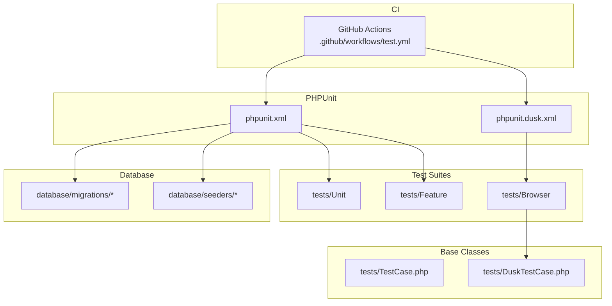
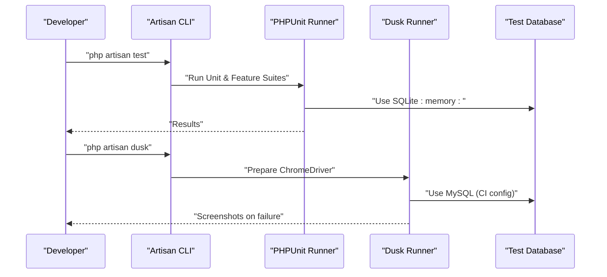
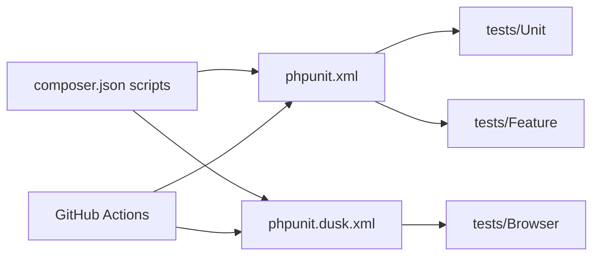
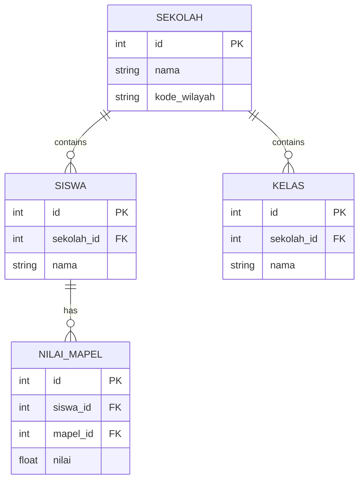

# Test Configuration & Setup

<cite>
**Referenced Files in This Document**
- [phpunit.xml](file://phpunit.xml)
- [phpunit.dusk.xml](file://phpunit.dusk.xml)
- [composer.json](file://composer.json)
- [tests/TestCase.php](file://tests/TestCase.php)
- [tests/DuskTestCase.php](file://tests/DuskTestCase.php)
- [.github/workflows/test.yml](file://.github/workflows/test.yml)
- [database/seeders/DemoDataSeeder.php](file://database/seeders/DemoDataSeeder.php)
- [database/migrations/2026_06_01_010808_create_sekolah_table.php](file://database/migrations/2026_06_01_010808_create_sekolah_table.php)
- [database/migrations/2026_06_01_010808_create_siswa_table.php](file://database/migrations/2026_06_01_010808_create_siswa_table.php)
- [database/migrations/2026_06_01_010816_create_kelas_table.php](file://database/migrations/2026_06_01_010816_create_kelas_table.php)
- [database/migrations/2026_06_01_010817_create_nilai_mapel_table.php](file://database/migrations/2026_06_01_010817_create_nilai_mapel_table.php)
- [database/migrations/2026_06_02_040000_create_dapodik_sync_logs_table.php](file://database/migrations/2026_06_02_040000_create_dapodik_sync_logs_table.php)
- [database/migrations/2026_06_04_120000_create_ptk_table_and_migrate_from_users.php](file://database/migrations/2026_06_04_120000_create_ptk_table_and_migrate_from_users.php)
- [database/migrations/2026_06_08_100000_create_push_subscriptions_table.php](file://database/migrations/2026_06_08_100000_create_push_subscriptions_table.php)
- [database/migrations/2026_06_10_000001_add_fcm_token_to_users_table.php](file://database/migrations/2026_06_10_000001_add_fcm_token_to_users_table.php)
- [database/migrations/2026_06_10_090001_add_gps_fields_to_sekolah_table.php](file://database/migrations/2026_06_10_090001_add_gps_fields_to_sekolah_table.php)
- [database/migrations/2026_06_10_090002_create_presensi_guru_tu_table.php](file://database/migrations/2026_06_10_090002_create_presensi_guru_tu_table.php)
- [database/migrations/2026_06_13_150000_add_format_rapor_to_sekolah_table.php](file://database/migrations/2026_06_13_150000_add_format_rapor_to_sekolah_table.php)
- [database/migrations/2026_06_01_010801_create_ref_agama_table.php](file://database/migrations/2026_06_01_010801_create_ref_agama_table.php)
- [database/migrations/2026_06_01_010802_create_ref_jenis_kelamin_table.php](file://database/migrations/2026_06_01_010802_create_ref_jenis_kelamin_table.php)
- [database/migrations/2026_06_01_010802_create_ref_jenis_siswa_table.php](file://database/migrations/2026_06_01_010802_create_ref_jenis_siswa_table.php)
- [database/migrations/2026_06_01_010802_create_ref_kepegawaian_table.php](file://database/migrations/2026_06_01_010802_create_ref_kepegawaian_table.php)
- [database/migrations/2026_06_01_010802_create_ref_tugas_tambahan_table.php](file://database/migrations/2026_06_01_010802_create_ref_tugas_tambahan_table.php)
- [database/migrations/2026_06_01_010803_create_jenis_absen_table.php](file://database/migrations/2026_06_01_010803_create_jenis_absen_table.php)
- [database/migrations/2026_06_01_010807_create_tahun_pelajaran_table.php](file://database/migrations/2026_06_01_010807_create_tahun_pelajaran_table.php)
- [database/migrations/2026_06_01_010808_create_semester_table.php](file://database/migrations/2026_06_01_010808_create_semester_table.php)
- [database/migrations/2026_06_01_010808_create_tingkat_table.php](file://database/migrations/2026_06_01_010808_create_tingkat_table.php)
- [database/migrations/2026_06_01_010809_create_dimensi_table.php](file://database/migrations/2026_06_01_010809_create_dimensi_table.php)
- [database/migrations/2026_06_01_010809_create_eskul_table.php](file://database/migrations/2026_06_01_010809_create_eskul_table.php)
- [database/migrations/2026_06_01_010809_create_organisasi_table.php](file://database/migrations/2026_06_01_010809_create_organisasi_table.php)
- [database/migrations/2026_06_01_010810_create_kepala_sekolah_table.php](file://database/migrations/2026_06_01_010810_create_kepala_sekolah_table.php)
- [database/migrations/2026_06_01_010810_create_laporan_wa_table.php](file://database/migrations/2026_06_01_010810_create_laporan_wa_table.php)
- [database/migrations/2026_06_01_010810_create_pembagian_raport_table.php](file://database/migrations/2026_06_01_010810_create_pembagian_raport_table.php)
- [database/migrations/2026_06_01_010810_create_pengingat_table.php](file://database/migrations/2026_06_01_010810_create_pengingat_table.php)
- [database/migrations/2026_06_01_010810_create_settings_table.php](file://database/migrations/2026_06_01_010810_create_settings_table.php)
- [database/migrations/2026_06_01_010810_create_surat_masuk_table.php](file://database/migrations/2026_06_01_010810_create_surat_masuk_table.php)
- [database/migrations/2026_06_01_010816_create_kelas_wali_table.php](file://database/migrations/2026_06_01_010816_create_kelas_wali_table.php)
- [database/migrations/2026_06_01_010816_create_mapel_kelas_table.php](file://database/migrations/2026_06_01_010816_create_mapel_kelas_table.php)
- [database/migrations/2026_06_01_010816_create_mapel_siswa_table.php](file://database/migrations/2026_06_01_010816_create_mapel_siswa_table.php)
- [database/migrations/2026_06_01_010816_create_pembina_eskul_table.php](file://database/migrations/2026_06_01_010816_create_pembina_eskul_table.php)
- [database/migrations/2026_06_01_010816_create_siswa_kelas_table.php](file://database/migrations/2026_06_01_010816_create_siswa_kelas_table.php)
- [database/migrations/2026_06_01_010816_create_tujuan_pembelajaran_table.php](file://database/migrations/2026_06_01_010816_create_tujuan_pembelajaran_table.php)
- [database/migrations/2026_06_01_010817_create_lager_nilai_mapel_table.php](file://database/migrations/2026_06_01_010817_create_lager_nilai_mapel_table.php)
- [database/migrations/2026_06_01_010817_create_lager_nilai_mid_table.php](file://database/migrations/2026_06_01_010817_create_lager_nilai_mid_table.php)
- [database/migrations/2026_06_01_010817_create_nilai_formatif_table.php](file://database/migrations/2026_06_01_010817_create_nilai_formatif_table.php)
- [database/migrations/2026_06_01_010817_create_nilai_sumatif_as_table.php](file://database/migrations/2026_06_01_010817_create_nilai_sumatif_as_table.php)
- [database/migrations/2026_06_01_010817_create_nilai_sumatif_ph_table.php](file://database/migrations/2026_06_01_010817_create_nilai_sumatif_ph_table.php)
- [database/migrations/2026_06_01_010817_create_nilai_sumatif_ts_table.php](file://database/migrations/2026_06_01_010817_create_nilai_sumatif_ts_table.php)
- [database/migrations/2026_06_01_010817_create_proyek_tema_table.php](file://database/migrations/2026_06_01_010817_create_proyek_tema_table.php)
- [database/migrations/2026_06_01_010818_create_elemen_table.php](file://database/migrations/2026_06_01_010818_create_elemen_table.php)
- [database/migrations/2026_06_01_010818_create_nilai_kelas_mid_table.php](file://database/migrations/2026_06_01_010818_create_nilai_kelas_mid_table.php)
- [database/migrations/2026_06_01_010818_create_nilai_kelas_table.php](file://database/migrations/2026_06_01_010818_create_nilai_kelas_table.php)
- [database/migrations/2026_06_01_010818_create_nilai_mapel_mid_table.php](file://database/migrations/2026_06_01_010818_create_nilai_mapel_mid_table.php)
- [database/migrations/2026_06_01_010818_create_nilai_mata_pelajaran_table.php](file://database/migrations/2026_06_01_010818_create_nilai_mata_pelajaran_table.php)
- [database/migrations/2026_06_01_010818_create_prakerin_table.php](file://database/migrations/2026_06_01_010818_create_prakerin_table.php)
- [database/migrations/2026_06_01_010818_create_proyek_kelas_table.php](file://database/migrations/2026_06_01_010818_create_proyek_kelas_table.php)
- [database/migrations/2026_06_01_010818_create_sub_elemen_table.php](file://database/migrations/2026_06_01_010818_create_sub_elemen_table.php)
- [database/migrations/2026_06_01_010819_create_mapel_proyek_table.php](file://database/migrations/2026_06_01_010819_create_mapel_proyek_table.php)
- [database/migrations/2026_06_01_010819_create_nilai_assesmen_subelemen_table.php](file://database/migrations/2026_06_01_010819_create_nilai_assesmen_subelemen_table.php)
- [database/migrations/2026_06_01_010819_create_nilai_kokurikuler_table.php](file://database/migrations/2026_06_01_010819_create_nilai_kokurikuler_table.php)
- [database/migrations/2026_06_01_010819_create_nilai_proyek_table.php](file://database/migrations/2026_06_01_010819_create_nilai_proyek_table.php)
- [database/migrations/2026_06_01_010819_create_proyek_subelemen_table.php](file://database/migrations/2026_06_01_010819_create_proyek_subelemen_table.php)
- [database/migrations/2026_06_01_010819_create_proyek_tujuan_table.php](file://database/migrations/2026_06_01_010819_create_proyek_tujuan_table.php)
- [database/migrations/2026_06_01_010819_create_siswa_prakerin_table.php](file://database/migrations/2026_06_01_010819_create_siswa_prakerin_table.php)
- [database/migrations/2026_06_01_010820_create_catatan_wali_table.php](file://database/migrations/2026_06_01_010820_create_catatan_wali_table.php)
- [database/migrations/2026_06_01_010820_create_nilai_prakerin_table.php](file://database/migrations/2026_06_01_010820_create_nilai_prakerin_table.php)
- [database/migrations/2026_06_01_010820_create_piket_harian_table.php](file://database/migrations/2026_06_01_010820_create_piket_harian_table.php)
- [database/migrations/2026_06_01_010820_create_presensi_table.php](file://database/migrations/2026_06_01_010820_create_presensi_table.php)
- [database/migrations/2026_06_01_010820_create_siswa_eskul_table.php](file://database/migrations/2026_06_01_010820_create_siswa_eskul_table.php)
- [database/migrations/2026_06_01_010821_create_lulusan_table.php](file://database/migrations/2026_06_01_010821_create_lulusan_table.php)
- [database/migrations/2026_06_01_010821_create_mutasi_keluar_table.php](file://database/migrations/2026_06_01_010821_create_mutasi_keluar_table.php)
- [database/migrations/2026_06_01_010821_create_mutasi_masuk_table.php](file://database/migrations/2026_06_01_010821_create_mutasi_masuk_table.php)
- [database/migrations/2026_06_01_010821_create_prestasi_table.php](file://database/migrations/2026_06_01_010821_create_prestasi_table.php)
- [database/migrations/2026_06_01_010827_create_personal_access_tokens_table.php](file://database/migrations/2026_06_01_010827_create_personal_access_tokens_table.php)
- [database/migrations/2026_06_01_010827_create_pwa_tokens_table.php](file://database/migrations/2026_06_01_010827_create_pwa_tokens_table.php)
- [database/migrations/2026_06_01_010828_create_remember_tokens_table.php](file://database/migrations/2026_06_01_010828_create_remember_tokens_table.php)
- [database/migrations/2026_06_02_050000_add_dapodik_pd_id_to_siswa_table.php](file://database/migrations/2026_06_02_050000_add_dapodik_pd_id_to_siswa_table.php)
- [database/migrations/2026_06_02_080000_add_dapodik_id_to_sekolah_table.php](file://database/migrations/2026_06_02_080000_add_dapodik_id_to_sekolah_table.php)
- [database/migrations/2026_06_02_080001_add_dapodik_id_to_kelas_table.php](file://database/migrations/2026_06_02_080001_add_dapodik_id_to_kelas_table.php)
- [database/migrations/2026_06_02_080002_add_dapodik_id_to_mapel_table.php](file://database/migrations/2026_06_02_080002_add_dapodik_id_to_mapel_table.php)
- [database/migrations/2026_06_02_080003_add_dapodik_id_to_mapel_kelas_table.php](file://database/migrations/2026_06_02_080003_add_dapodik_id_to_mapel_kelas_table.php)
- [database/migrations/2026_06_02_090000_make_user_id_nullable_in_mapel_kelas_table.php](file://database/migrations/2026_06_02_090000_make_user_id_nullable_in_mapel_kelas_table.php)
- [database/migrations/2026_06_02_100000_add_urutan_to_mapel_table.php](file://database/migrations/2026_06_02_100000_add_urutan_to_mapel_table.php)
- [database/migrations/2026_06_03_044817_add_favicon_to_sekolah_table.php](file://database/migrations/2026_06_03_044817_add_favicon_to_sekolah_table.php)
- [database/migrations/2026_06_04_000001_add_batch_fields_to_dapodik_sync_logs_table.php](file://database/migrations/2026_06_04_000001_add_batch_fields_to_dapodik_sync_logs_table.php)
- [database/migrations/2026_06_04_130000_create_guru_menu_akses_table.php](file://database/migrations/2026_06_04_130000_create_guru_menu_akses_table.php)
- [database/migrations/2026_06_08_100000_create_push_subscriptions_table.php](file://database/migrations/2026_06_08_100000_create_push_subscriptions_table.php)
- [database/migrations/2026_06_10_000001_add_fcm_token_to_users_table.php](file://database/migrations/2026_06_10_000001_add_fcm_token_to_users_table.php)
- [database/migrations/2026_06_10_090001_add_gps_fields_to_sekolah_table.php](file://database/migrations/2026_06_10_090001_add_gps_fields_to_sekolah_table.php)
- [database/migrations/2026_06_10_090002_create_presensi_guru_tu_table.php](file://database/migrations/2026_06_10_090002_create_presensi_guru_tu_table.php)
- [database/migrations/2026_06_13_150000_add_format_rapor_to_sekolah_table.php](file://database/migrations/2026_06_13_150000_add_format_rapor_to_sekolah_table.php)
</cite>

## Table of Contents
1. [Introduction](#introduction)
2. [Project Structure](#project-structure)
3. [Core Components](#core-components)
4. [Architecture Overview](#architecture-overview)
5. [Detailed Component Analysis](#detailed-component-analysis)
6. [Dependency Analysis](#dependency-analysis)
7. [Performance Considerations](#performance-considerations)
8. [Troubleshooting Guide](#troubleshooting-guide)
9. [Conclusion](#conclusion)
10. [Appendices](#appendices)

## Introduction
This document describes the complete testing configuration and setup for the RaporKM Laravel application. It covers PHPUnit test suites, Laravel Dusk browser tests, database initialization strategies, seeding for realistic test data, continuous integration with GitHub Actions, environment isolation, parallel execution, resource management, coverage and artifacts, and guidance for local development and debugging.

## Project Structure
The testing infrastructure is organized around:
- PHPUnit configuration for unit and feature tests
- Laravel Dusk configuration for browser tests
- Test base classes extending Laravel’s testing framework
- GitHub Actions workflow orchestrating CI test runs
- Database migrations and seeders supporting deterministic test environments

**Diagram sources**
- [phpunit.xml:1-37](file://phpunit.xml#L1-L37)
- [phpunit.dusk.xml:1-16](file://phpunit.dusk.xml#L1-L16)
- [tests/TestCase.php:1-11](file://tests/TestCase.php#L1-L11)
- [tests/DuskTestCase.php:1-49](file://tests/DuskTestCase.php#L1-L49)
- [.github/workflows/test.yml:152-168](file://.github/workflows/test.yml#L152-L168)

**Section sources**
- [phpunit.xml:1-37](file://phpunit.xml#L1-L37)
- [phpunit.dusk.xml:1-16](file://phpunit.dusk.xml#L1-L16)
- [tests/TestCase.php:1-11](file://tests/TestCase.php#L1-L11)
- [tests/DuskTestCase.php:1-49](file://tests/DuskTestCase.php#L1-L49)
- [.github/workflows/test.yml:152-168](file://.github/workflows/test.yml#L152-L168)

## Core Components
- PHPUnit configuration defines test suites, source inclusion, and environment variables for isolated testing.
- Dusk configuration controls browser test execution and suite discovery.
- Base test classes provide shared setup for unit/feature and browser tests.
- Composer scripts expose convenient commands for setup, dev, and test execution.
- GitHub Actions workflow executes unit/feature and browser tests with dedicated database configuration.

Key configuration highlights:
- Environment variables set during test runs ensure fast, isolated execution using SQLite in-memory database and array-backed stores.
- Dusk driver preparation and headless/headful modes are supported.
- CI workflow runs browser tests against a MySQL database with explicit credentials.

**Section sources**
- [phpunit.xml:7-35](file://phpunit.xml#L7-L35)
- [phpunit.dusk.xml:1-16](file://phpunit.dusk.xml#L1-L16)
- [tests/TestCase.php:1-11](file://tests/TestCase.php#L1-L11)
- [tests/DuskTestCase.php:17-47](file://tests/DuskTestCase.php#L17-L47)
- [composer.json:47-67](file://composer.json#L47-L67)
- [.github/workflows/test.yml:152-168](file://.github/workflows/test.yml#L152-L168)

## Architecture Overview
The testing architecture separates concerns across unit, feature, and browser tests, with environment-specific configuration and CI orchestration.

**Diagram sources**
- [composer.json:60-63](file://composer.json#L60-L63)
- [phpunit.xml:20-35](file://phpunit.xml#L20-L35)
- [phpunit.dusk.xml:1-16](file://phpunit.dusk.xml#L1-L16)
- [.github/workflows/test.yml:152-168](file://.github/workflows/test.yml#L152-L168)

## Detailed Component Analysis

### PHPUnit Configuration
- Test suites: Unit and Feature directories are registered.
- Source coverage: Includes the app directory for coverage calculation.
- Environment variables:
  - APP_ENV/testing ensures Laravel runs in test mode.
  - CACHE_STORE/array and SESSION_DRIVER/array minimize persistence.
  - QUEUE_CONNECTION/sync removes async overhead.
  - DB_CONNECTION/sqlite and DB_DATABASE/:memory: provide fast, isolated DB per process.
  - MAIL_MAILER/array captures emails without external delivery.
  - PULSE_ENABLED=false, TELESCOPE_ENABLED=false, NIGHTWATCH_ENABLED=false disable telemetry for speed.

Best practices derived from repository configuration:
- Keep database in-memory for speed.
- Use array drivers for cache/session/mail for determinism.
- Reduce cryptographic cost in tests (e.g., lower bcrypt rounds) to accelerate hashing-heavy tests.

**Section sources**
- [phpunit.xml:7-35](file://phpunit.xml#L7-L35)

### Laravel Dusk Configuration
- Dusk test suite discovery under tests/Browser.
- Static preparation starts ChromeDriver unless running in Sail.
- WebDriver creation supports headless mode and window sizing.
- DUSK_DRIVER_URL allows overriding the remote driver endpoint.

Operational notes:
- CI sets DB_CONNECTION=mysql for Dusk tests to match production-like behavior.
- On failure, screenshots are uploaded as artifacts for debugging.

**Section sources**
- [phpunit.dusk.xml:1-16](file://phpunit.dusk.xml#L1-L16)
- [tests/DuskTestCase.php:17-47](file://tests/DuskTestCase.php#L17-L47)
- [.github/workflows/test.yml:152-168](file://.github/workflows/test.yml#L152-L168)

### Test Base Classes
- TestCase extends Laravel’s base test case; minimal customization.
- DuskTestCase extends Laravel Dusk base, providing driver configuration and Chrome options.

Usage:
- Extend TestCase for unit/feature tests.
- Extend DuskTestCase for browser tests requiring a real browser.

**Section sources**
- [tests/TestCase.php:1-11](file://tests/TestCase.php#L1-L11)
- [tests/DuskTestCase.php:1-49](file://tests/DuskTestCase.php#L1-L49)

### Continuous Integration with GitHub Actions
- Workflow runs unit/feature tests using SQLite and browser tests using MySQL.
- MySQL service is provisioned with a dedicated database and user.
- On Dusk failure, screenshots are uploaded as artifacts for inspection.

Recommendations:
- Store DB credentials in GitHub Secrets for security.
- Consider matrix jobs to parallelize test suites across PHP/Laravel versions.

**Section sources**
- [.github/workflows/test.yml:152-168](file://.github/workflows/test.yml#L152-L168)

### Test Database Setup, Migrations, and Seeding
- Default test environment uses SQLite in-memory database for speed.
- For browser tests, CI uses MySQL with explicit credentials.
- Seeders populate realistic reference and demo data for integration-style tests.

Recommended patterns:
- Use Lazy or Refresh database traits to keep migrations fast.
- Prefer model factories and seeder-driven data for deterministic scenarios.
- For heavy datasets, consider partitioning or selective seeding.

**Section sources**
- [phpunit.xml:26-27](file://phpunit.xml#L26-L27)
- [.github/workflows/test.yml:152-159](file://.github/workflows/test.yml#L152-L159)
- [database/seeders/DemoDataSeeder.php:60-84](file://database/seeders/DemoDataSeeder.php#L60-L84)

### Test Environment Isolation and Parallel Execution
- Environment variables isolate caches, sessions, queues, and mailers.
- SQLite in-memory database prevents cross-test contamination.
- Array cache/session drivers reduce I/O and contention.

Parallel execution:
- PHPUnit supports parallelization via process isolation and test separation.
- For browser tests, limit concurrency to avoid port conflicts and resource exhaustion.

**Section sources**
- [phpunit.xml:20-35](file://phpunit.xml#L20-L35)
- [phpunit.dusk.xml:1-16](file://phpunit.dusk.xml#L1-L16)

### Resource Management and Cleanup
- In-memory database eliminates cleanup after tests.
- Array drivers prevent persistent state across runs.
- Dusk driver lifecycle is managed via prepare/static method.

Cleanup tips:
- Ensure Dusk driver is stopped after tests.
- Clear temporary files and logs generated during tests.

**Section sources**
- [tests/DuskTestCase.php:17-23](file://tests/DuskTestCase.php#L17-L23)

### Code Coverage, Formatting, and Artifacts
Coverage:
- Source include targets the app directory for coverage reports.
- Combine with coverage tools to generate reports.

Formatting:
- PHPUnit color output enabled for readability.
- Dusk runner uses no-tty in CI for consistent output.

Artifacts:
- CI uploads Dusk screenshots on failure for visual debugging.

**Section sources**
- [phpunit.xml:15-19](file://phpunit.xml#L15-L19)
- [composer.json:60-63](file://composer.json#L60-L63)
- [.github/workflows/test.yml:162-168](file://.github/workflows/test.yml#L162-L168)

### Configuration Across Environments
- Development: Use default phpunit.xml with SQLite in-memory database.
- Staging/Production CI: Use GitHub Actions workflow with MySQL for browser tests.
- Local overrides: Set environment variables to switch drivers or enable/disable telemetry.

Environment-specific guidance:
- For heavy test suites, consider switching to a persistent in-memory SQLite or a dedicated ephemeral MySQL container.
- Disable Telescope/Pulse in CI to reduce overhead.

**Section sources**
- [phpunit.xml:20-35](file://phpunit.xml#L20-L35)
- [.github/workflows/test.yml:152-168](file://.github/workflows/test.yml#L152-L168)

### Performance Optimization, Memory, and Timeouts
- Lower bcrypt rounds in tests to reduce CPU cost.
- Use array drivers for cache/session/mail.
- Prefer SQLite in-memory for unit/feature tests.
- Limit browser test concurrency; adjust window size/headless mode to balance speed and stability.
- Configure queue timeouts and worker retries appropriately.

**Section sources**
- [phpunit.xml:23-31](file://phpunit.xml#L23-L31)
- [tests/DuskTestCase.php:30-47](file://tests/DuskTestCase.php#L30-L47)

### Local Development and Debugging
- Use Composer scripts to run tests locally.
- For browser tests, ensure ChromeDriver is available or use Sail.
- Capture screenshots and logs on failures; review CI artifacts if applicable.
- For slow tests, profile and refactor to use factories and seeded data efficiently.

**Section sources**
- [composer.json:60-63](file://composer.json#L60-L63)
- [tests/DuskTestCase.php:17-23](file://tests/DuskTestCase.php#L17-L23)
- [.github/workflows/test.yml:162-168](file://.github/workflows/test.yml#L162-L168)

### Integration with External Tools and QA Processes
- Chrome DevTools MCP skill enables agent-driven browser inspection and debugging.
- Combine with automated screenshots and logs for visual regression checks.
- Use CI artifacts (screenshots, logs) as part of QA review.

**Section sources**
- [skills/browser-testing-with-devtools/README.md:1-220](file://skills/browser-testing-with-devtools/README.md#L1-L220)

## Dependency Analysis
The testing stack depends on:
- PHPUnit for unit and feature test execution
- Laravel Dusk for browser automation
- Composer scripts for streamlined developer workflows
- GitHub Actions for CI orchestration

**Diagram sources**
- [composer.json:47-67](file://composer.json#L47-L67)
- [phpunit.xml:1-37](file://phpunit.xml#L1-L37)
- [phpunit.dusk.xml:1-16](file://phpunit.dusk.xml#L1-L16)
- [.github/workflows/test.yml:152-168](file://.github/workflows/test.yml#L152-L168)

**Section sources**
- [composer.json:47-67](file://composer.json#L47-L67)
- [phpunit.xml:1-37](file://phpunit.xml#L1-L37)
- [phpunit.dusk.xml:1-16](file://phpunit.dusk.xml#L1-L16)
- [.github/workflows/test.yml:152-168](file://.github/workflows/test.yml#L152-L168)

## Performance Considerations
- Favor SQLite in-memory for unit/feature tests.
- Use array drivers for cache/session/mail.
- Minimize cryptographic work in tests.
- Limit browser test concurrency and leverage headless mode.
- Use selective seeding and factories to avoid loading unnecessary data.

[No sources needed since this section provides general guidance]

## Troubleshooting Guide
Common issues and resolutions:
- ChromeDriver not found: Ensure driver is started or use Sail; verify DUSK_DRIVER_URL.
- Port conflicts in parallel Dusk runs: Adjust port or run sequentially.
- Slow tests: Switch to factories, seeded data, and array drivers.
- CI failures without logs: Inspect uploaded Dusk screenshots.

**Section sources**
- [tests/DuskTestCase.php:17-23](file://tests/DuskTestCase.php#L17-L23)
- [.github/workflows/test.yml:162-168](file://.github/workflows/test.yml#L162-L168)

## Conclusion
RaporKM’s testing infrastructure leverages PHPUnit for unit and feature tests, Laravel Dusk for browser automation, and GitHub Actions for CI. The configuration emphasizes speed and isolation via SQLite in-memory databases, array-backed stores, and controlled environment variables. By following the recommended practices—selective seeding, factory usage, and CI artifact collection—you can maintain reliable, fast, and debuggable tests across development, staging, and production environments.

[No sources needed since this section summarizes without analyzing specific files]

## Appendices

### Appendix A: Database Migration and Seeder Reference
- Representative migrations illustrate the domain model shape used by tests.
- DemoDataSeeder composes realistic data for integration-style scenarios.

**Diagram sources**
- [database/migrations/2026_06_01_010808_create_sekolah_table.php](file://database/migrations/2026_06_01_010808_create_sekolah_table.php)
- [database/migrations/2026_06_01_010808_create_siswa_table.php](file://database/migrations/2026_06_01_010808_create_siswa_table.php)
- [database/migrations/2026_06_01_010816_create_kelas_table.php](file://database/migrations/2026_06_01_010816_create_kelas_table.php)
- [database/migrations/2026_06_01_010817_create_nilai_mapel_table.php](file://database/migrations/2026_06_01_010817_create_nilai_mapel_table.php)

**Section sources**
- [database/seeders/DemoDataSeeder.php:60-84](file://database/seeders/DemoDataSeeder.php#L60-L84)