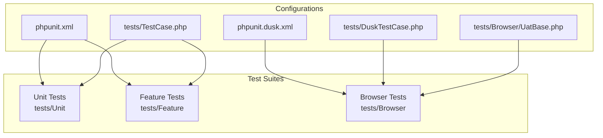
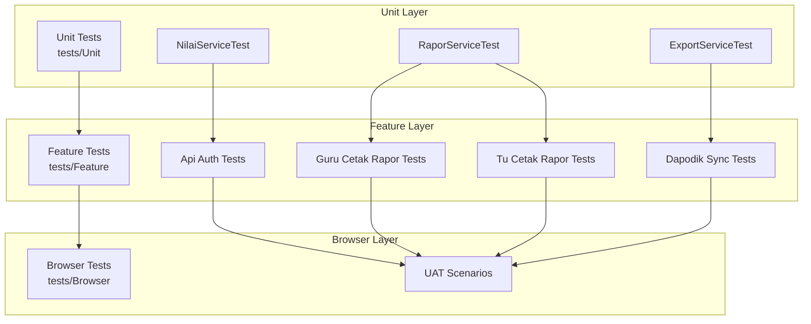
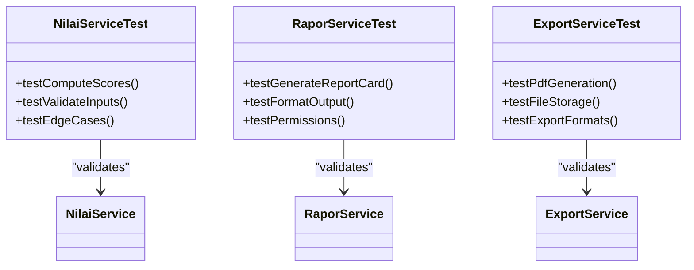
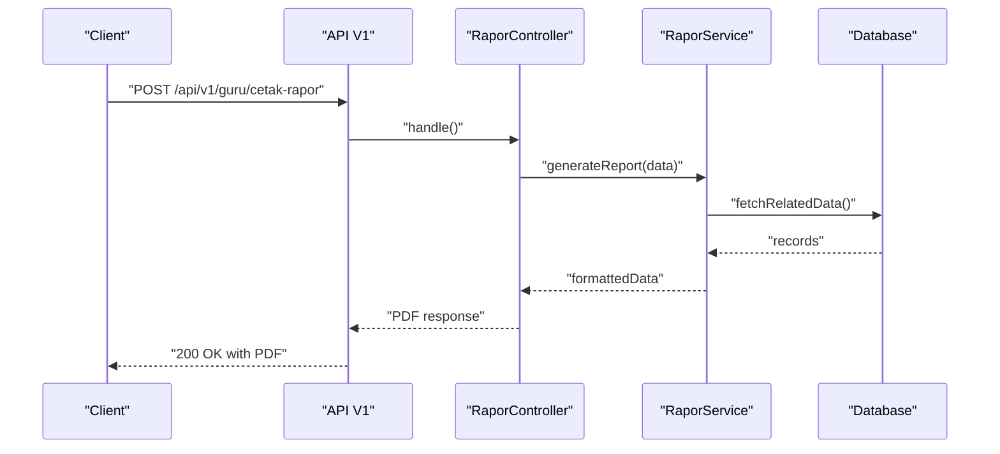
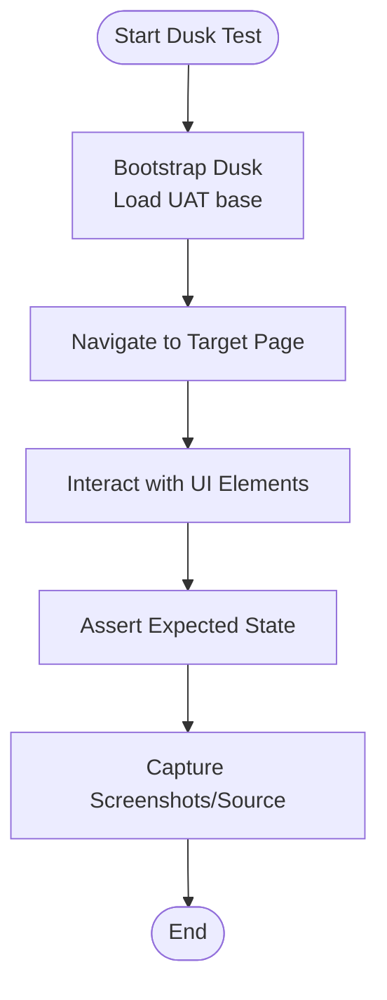
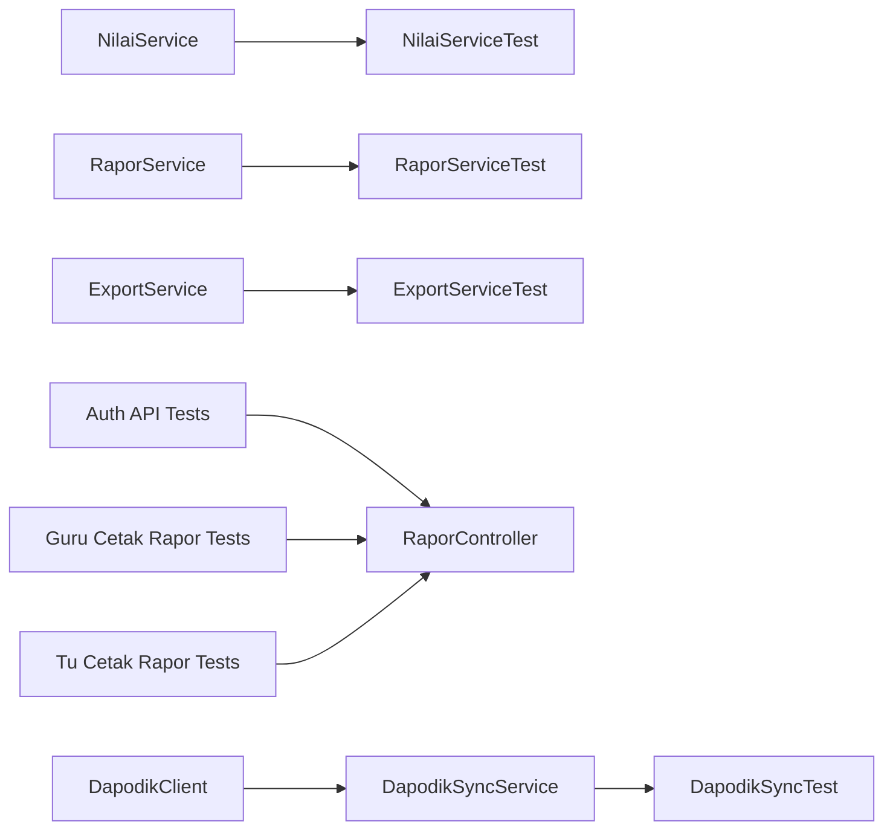

# Testing Strategy

<cite>
**Referenced Files in This Document**
- [phpunit.xml](file://phpunit.xml)
- [phpunit.dusk.xml](file://phpunit.dusk.xml)
- [DuskTestCase.php](file://tests/DuskTestCase.php)
- [TestCase.php](file://tests/TestCase.php)
- [UatBase.php](file://tests/Browser/UatBase.php)
- [AuthTest.php](file://tests/Feature/Api/V1/AuthTest.php)
- [GuruCetakRaporTest.php](file://tests/Feature/Guru/CetakRapor/CetakRaporTest.php)
- [TuCetakRaporTest.php](file://tests/Feature/Api/V1/TuCetakRaporTest.php)
- [NilaiServiceTest.php](file://tests/Unit/Services/NilaiServiceTest.php)
- [RaporServiceTest.php](file://tests/Unit/Services/RaporServiceTest.php)
- [ExportServiceTest.php](file://tests/Unit/Services/ExportServiceTest.php)
- [DapodikSyncTest.php](file://tests/Feature/Tu/Dapodik/DapodikSyncTest.php)
- [test.yml](file://.github/workflows/test.yml)
- [deploy.yml](file://.github/workflows/deploy.yml)
- [NilaiSumatifAsObserverTest.php](file://tests/Feature/NilaiSumatifAsObserverTest.php)
- [LagerNilaiPdfTest.php](file://tests/Feature/LagerNilaiPdfTest.php)
- [RaporPdfTest.php](file://tests/Feature/RaporPdfTest.php)
- [RaporPklPdfTest.php](file://tests/Feature/RaporPklPdfTest.php)
- [PenilaianFormatifTest.php](file://tests/Feature/PenilaianFormatifTest.php)
- [ProfileTest.php](file://tests/Feature/ProfileTest.php)
- [GuruAuthorizationTest.php](file://tests/Feature/Guru/AuthorizationTest.php)
- [TuWorkflowIntegrationTest.php](file://tests/Feature/Tu/TuWorkflowIntegrationTest.php)
- [FactorySmokeTest.php](file://tests/Feature/Tu/FactorySmokeTest.php)
- [database.php](file://config/database.php)
- [DatabaseSeeder.php](file://database/seeders/DatabaseSeeder.php)
- [DemoDataSeeder.php](file://database/seeders/DemoDataSeeder.php)
- [UserSeeder.php](file://database/seeders/UserSeeder.php)
- [CatatanWaliFactory.php](file://database/factories/CatatanWaliFactory.php)
- [SiswaFactory.php](file://database/factories/SiswaFactory.php)
- [NilaiMapelFactory.php](file://database/factories/NilaiMapelFactory.php)
- [NilaiService.php](file://app/Services/NilaiService.php)
- [RaporService.php](file://app/Services/RaporService.php)
- [ExportService.php](file://app/Services/ExportService.php)
- [DapodikService.php](file://app/Services/DapodikService.php)
- [DapodikSyncService.php](file://app/Services/Dapodik/DapodikSyncService.php)
- [SiswaSyncService.php](file://app/Services/Dapodik/SiswaSyncService.php)
- [SekolahSyncService.php](file://app/Services/Dapodik/SekolahSyncService.php)
- [GtkSyncService.php](file://app/Services/Dapodik/GtkSyncService.php)
- [DapodikClient.php](file://app/Services/Dapodik/DapodikClient.php)
- [RaporController.php](file://app/Http/Controllers/RaporController.php)
- [api.php](file://routes/api.php)
- [web.php](file://routes/web.php)
- [kompetensi_keahlian_table.php](file://database/migrations/2026_06_01_010808_create_kompetensi_keahlian_table.php)
- [mapel_kelas_table.php](file://database/migrations/2026_06_01_010816_create_mapel_kelas_table.php)
- [users_table.php](file://database/migrations/0001_01_01_000000_create_users_table.php)
- [jobs_table.php](file://database/migrations/0001_01_01_000002_create_jobs_table.php)
- [cache_table.php](file://database/migrations/0001_01_01_000001_create_cache_table.php)
- [activity_log_table.php](file://database/migrations/2026_06_01_010657_create_activity_log_table.php)
- [personal_access_tokens_table.php](file://database/migrations/2026_06_01_010827_create_personal_access_tokens_table.php)
- [pwa_tokens_table.php](file://database/migrations/2026_06_02_080000_create_pwa_tokens_table.php)
- [remember_tokens_table.php](file://database/migrations/2026_06_01_010828_create_remember_tokens_table.php)
- [dapodik_sync_logs_table.php](file://database/migrations/2026_06_02_040000_create_dapodik_sync_logs_table.php)
- [2026_06_04_120000_create_ptk_table_and_migrate_from_users.php](file://database/migrations/2026_06_04_120000_create_ptk_table_and_migrate_from_users.php)
- [2026_06_10_000001_add_fcm_token_to_users_table.php](file://database/migrations/2026_06_10_000001_add_fcm_token_to_users_table.php)
- [2026_06_10_090001_add_gps_fields_to_sekolah_table.php](file://database/migrations/2026_06_10_090001_add_gps_fields_to_sekolah_table.php)
- [2026_06_10_090002_create_presensi_guru_tu_table.php](file://database/migrations/2026_06_10_090002_create_presensi_guru_tu_table.php)
</cite>

## Table of Contents
1. [Introduction](#introduction)
2. [Project Structure](#project-structure)
3. [Core Components](#core-components)
4. [Architecture Overview](#architecture-overview)
5. [Detailed Component Analysis](#detailed-component-analysis)
6. [Dependency Analysis](#dependency-analysis)
7. [Performance Considerations](#performance-considerations)
8. [Troubleshooting Guide](#troubleshooting-guide)
9. [Conclusion](#conclusion)
10. [Appendices](#appendices)

## Introduction
This document defines a comprehensive testing strategy for RaporKM Laravel, covering unit testing, feature testing, browser testing, and test automation. It documents the testing framework setup (PHPUnit configuration, test database management, and environment isolation), unit testing approaches for services and business logic, feature testing for end-to-end workflows and API endpoints, browser testing with Laravel Dusk, test case organization, mocking strategies, test data management, continuous integration testing, automated execution, coverage reporting, performance and load testing guidance, and best practices for writing maintainable test suites.

## Project Structure
The testing suite is organized into three primary categories:
- Unit tests: Focused on isolated components and services.
- Feature tests: Validate end-to-end workflows and API interactions.
- Browser tests: Cross-browser user experience validation via Laravel Dusk.

Key configuration and base classes:
- PHPUnit configuration for unit and feature tests.
- PHPUnit configuration for browser tests.
- Base test case classes for shared setup and helpers.

**Diagram sources**
- [phpunit.xml:1-36](file://phpunit.xml#L1-L36)
- [phpunit.dusk.xml:1-15](file://phpunit.dusk.xml#L1-L15)
- [TestCase.php](file://tests/TestCase.php)
- [DuskTestCase.php](file://tests/DuskTestCase.php)
- [UatBase.php](file://tests/Browser/UatBase.php)

**Section sources**
- [phpunit.xml:1-36](file://phpunit.xml#L1-L36)
- [phpunit.dusk.xml:1-15](file://phpunit.dusk.xml#L1-L15)
- [TestCase.php](file://tests/TestCase.php)
- [DuskTestCase.php](file://tests/DuskTestCase.php)
- [UatBase.php](file://tests/Browser/UatBase.php)

## Core Components
- PHPUnit configuration for unit and feature tests:
  - Defines test suites, source inclusion, and environment variables for testing.
  - Sets SQLite in-memory database for speed and isolation.
- PHPUnit configuration for browser tests:
  - Dedicated suite for Dusk tests.
- Base test case classes:
  - Shared bootstrapping, database transactions, and helpers.
- Browser test base:
  - Common setup for Dusk tests (navigation, assertions, page objects).
- Seeders and Factories:
  - Populate deterministic test data for repeatable tests.

Environment and database isolation:
- Environment variables set APP_ENV=testing and disable external integrations.
- Database configured to sqlite with in-memory storage for fast, isolated runs.

**Section sources**
- [phpunit.xml:1-36](file://phpunit.xml#L1-L36)
- [phpunit.dusk.xml:1-15](file://phpunit.dusk.xml#L1-L15)
- [TestCase.php](file://tests/TestCase.php)
- [UatBase.php](file://tests/Browser/UatBase.php)
- [DatabaseSeeder.php](file://database/seeders/DatabaseSeeder.php)
- [DemoDataSeeder.php](file://database/seeders/DemoDataSeeder.php)
- [UserSeeder.php](file://database/seeders/UserSeeder.php)
- [CatatanWaliFactory.php](file://database/factories/CatatanWaliFactory.php)
- [SiswaFactory.php](file://database/factories/SiswaFactory.php)
- [NilaiMapelFactory.php](file://database/factories/NilaiMapelFactory.php)

## Architecture Overview
The testing architecture separates concerns across layers:
- Unit layer validates service logic in isolation.
- Feature layer validates controller and API behavior with realistic requests.
- Browser layer validates end-user journeys across browsers.

**Diagram sources**
- [NilaiServiceTest.php](file://tests/Unit/Services/NilaiServiceTest.php)
- [RaporServiceTest.php](file://tests/Unit/Services/RaporServiceTest.php)
- [ExportServiceTest.php](file://tests/Unit/Services/ExportServiceTest.php)
- [AuthTest.php](file://tests/Feature/Api/V1/AuthTest.php)
- [GuruCetakRaporTest.php](file://tests/Feature/Guru/CetakRapor/CetakRaporTest.php)
- [TuCetakRaporTest.php](file://tests/Feature/Api/V1/TuCetakRaporTest.php)
- [DapodikSyncTest.php](file://tests/Feature/Tu/Dapodik/DapodikSyncTest.php)
- [UatBase.php](file://tests/Browser/UatBase.php)

## Detailed Component Analysis

### PHPUnit Configuration and Environment Isolation
- Unit and feature tests:
  - Test suites for Unit and Feature.
  - Source includes app directory for coverage.
  - Environment variables set APP_ENV=testing and isolate caches, queues, sessions, and mailers.
  - Database configured to sqlite with in-memory storage for speed and isolation.
- Browser tests:
  - Separate suite dedicated to Dusk tests.

Best practices:
- Keep environment variables minimal and deterministic.
- Use in-memory database for unit and feature tests; use real database for browser tests when needed.
- Disable telemetry and external integrations during tests.

**Section sources**
- [phpunit.xml:1-36](file://phpunit.xml#L1-L36)
- [phpunit.dusk.xml:1-15](file://phpunit.dusk.xml#L1-L15)

### Unit Testing: Services and Business Logic
Focus areas:
- Validation and computation services.
- Export and report generation services.
- Domain-specific workflows (e.g., nilai, rapor, export).

Recommended patterns:
- Mock external dependencies (HTTP clients, databases).
- Use factories and seeders to construct deterministic scenarios.
- Assert side effects and return values separately.

Examples of covered services:
- NilaiService: compute and validate academic scores.
- RaporService: generate report cards and related workflows.
- ExportService: produce PDFs and exports.

**Diagram sources**
- [NilaiServiceTest.php](file://tests/Unit/Services/NilaiServiceTest.php)
- [RaporServiceTest.php](file://tests/Unit/Services/RaporServiceTest.php)
- [ExportServiceTest.php](file://tests/Unit/Services/ExportServiceTest.php)
- [NilaiService.php](file://app/Services/NilaiService.php)
- [RaporService.php](file://app/Services/RaporService.php)
- [ExportService.php](file://app/Services/ExportService.php)

**Section sources**
- [NilaiServiceTest.php](file://tests/Unit/Services/NilaiServiceTest.php)
- [RaporServiceTest.php](file://tests/Unit/Services/RaporServiceTest.php)
- [ExportServiceTest.php](file://tests/Unit/Services/ExportServiceTest.php)
- [NilaiService.php](file://app/Services/NilaiService.php)
- [RaporService.php](file://app/Services/RaporService.php)
- [ExportService.php](file://app/Services/ExportService.php)

### Feature Testing: End-to-End Workflows and API Endpoints
Scope:
- API v1 endpoints for authentication, data retrieval, and updates.
- Role-based workflows for Guru and TU dashboards.
- Export and PDF generation validations.
- Observer and factory smoke tests.

Common patterns:
- Use authenticated requests and role-based fixtures.
- Validate response codes, JSON structure, and permissions.
- Verify side effects in database and file system.

Representative tests:
- Authentication API tests.
- Guru and TU report printing workflows.
- Dapodik synchronization tests.
- PDF export validations.

**Diagram sources**
- [GuruCetakRaporTest.php](file://tests/Feature/Guru/CetakRapor/CetakRaporTest.php)
- [RaporController.php](file://app/Http/Controllers/RaporController.php)
- [RaporService.php](file://app/Services/RaporService.php)
- [api.php](file://routes/api.php)

**Section sources**
- [AuthTest.php](file://tests/Feature/Api/V1/AuthTest.php)
- [GuruCetakRaporTest.php](file://tests/Feature/Guru/CetakRapor/CetakRaporTest.php)
- [TuCetakRaporTest.php](file://tests/Feature/Api/V1/TuCetakRaporTest.php)
- [DapodikSyncTest.php](file://tests/Feature/Tu/Dapodik/DapodikSyncTest.php)
- [NilaiSumatifAsObserverTest.php](file://tests/Feature/NilaiSumatifAsObserverTest.php)
- [LagerNilaiPdfTest.php](file://tests/Feature/LagerNilaiPdfTest.php)
- [RaporPdfTest.php](file://tests/Feature/RaporPdfTest.php)
- [RaporPklPdfTest.php](file://tests/Feature/RaporPklPdfTest.php)
- [PenilaianFormatifTest.php](file://tests/Feature/PenilaianFormatifTest.php)
- [ProfileTest.php](file://tests/Feature/ProfileTest.php)
- [GuruAuthorizationTest.php](file://tests/Feature/Guru/AuthorizationTest.php)
- [TuWorkflowIntegrationTest.php](file://tests/Feature/Tu/TuWorkflowIntegrationTest.php)
- [FactorySmokeTest.php](file://tests/Feature/Tu/FactorySmokeTest.php)

### Browser Testing with Laravel Dusk
Scope:
- User acceptance scenarios across browsers.
- PWA update prompts, background sync, and push notifications.
- Role-specific navigation and actions.

Base classes:
- DuskTestCase: shared Dusk setup.
- UatBase: reusable UAT helpers and page objects.

Guidelines:
- Prefer page objects and reusable components.
- Use screenshots and source dumps for debugging.
- Keep selectors stable and avoid brittle patterns.

**Diagram sources**
- [DuskTestCase.php](file://tests/DuskTestCase.php)
- [UatBase.php](file://tests/Browser/UatBase.php)

**Section sources**
- [DuskTestCase.php](file://tests/DuskTestCase.php)
- [UatBase.php](file://tests/Browser/UatBase.php)

### Test Case Organization and Naming Conventions
- Unit tests under tests/Unit/<Component>.
- Feature tests under tests/Feature/<Category>/<Feature>Test.php.
- Browser tests under tests/Browser/Uat/<Scenario>Test.php.
- Use descriptive names indicating intent and assertion outcomes.
- Group related tests by domain (e.g., Guru, TU, API).

### Mocking Strategies
- Mock external services (e.g., Dapodik client) to isolate unit tests.
- Use partial mocks for complex collaborators.
- Replace heavy dependencies with lightweight fakes for feature tests.

### Test Data Management
- Seeders for initial data and environment setup.
- Factories for generating domain-specific records.
- Deterministic data to ensure reproducibility.

**Section sources**
- [DatabaseSeeder.php](file://database/seeders/DatabaseSeeder.php)
- [DemoDataSeeder.php](file://database/seeders/DemoDataSeeder.php)
- [UserSeeder.php](file://database/seeders/UserSeeder.php)
- [CatatanWaliFactory.php](file://database/factories/CatatanWaliFactory.php)
- [SiswaFactory.php](file://database/factories/SiswaFactory.php)
- [NilaiMapelFactory.php](file://database/factories/NilaiMapelFactory.php)

## Dependency Analysis
Testing dependencies and relationships:
- Unit tests depend on service classes and mocked collaborators.
- Feature tests depend on controllers, routes, and database state.
- Browser tests depend on Dusk and page objects.

**Diagram sources**
- [NilaiService.php](file://app/Services/NilaiService.php)
- [NilaiServiceTest.php](file://tests/Unit/Services/NilaiServiceTest.php)
- [RaporService.php](file://app/Services/RaporService.php)
- [RaporServiceTest.php](file://tests/Unit/Services/RaporServiceTest.php)
- [ExportService.php](file://app/Services/ExportService.php)
- [ExportServiceTest.php](file://tests/Unit/Services/ExportServiceTest.php)
- [AuthTest.php](file://tests/Feature/Api/V1/AuthTest.php)
- [GuruCetakRaporTest.php](file://tests/Feature/Guru/CetakRapor/CetakRaporTest.php)
- [TuCetakRaporTest.php](file://tests/Feature/Api/V1/TuCetakRaporTest.php)
- [RaporController.php](file://app/Http/Controllers/RaporController.php)
- [DapodikSyncService.php](file://app/Services/Dapodik/DapodikSyncService.php)
- [DapodikSyncTest.php](file://tests/Feature/Tu/Dapodik/DapodikSyncTest.php)
- [DapodikClient.php](file://app/Services/Dapodik/DapodikClient.php)

**Section sources**
- [RaporController.php](file://app/Http/Controllers/RaporController.php)
- [api.php](file://routes/api.php)
- [web.php](file://routes/web.php)

## Performance Considerations
- Use SQLite in-memory database for unit and feature tests to minimize IO overhead.
- Parallelize independent tests where possible.
- Limit browser tests to critical user journeys; use unit and feature tests for exhaustive validation.
- Profile slow tests and refactor heavy setups into shared fixtures.

## Troubleshooting Guide
Common issues and resolutions:
- Database connection errors in tests:
  - Ensure APP_ENV=testing and DB_CONNECTION=sqlite with DB_DATABASE=:memory:.
- Dusk failures:
  - Verify driver availability and browser compatibility.
  - Use screenshots and source dumps to diagnose rendering issues.
- Coverage gaps:
  - Run with coverage enabled and target missing branches.
- Slow test runs:
  - Reduce external calls; mock or stub dependencies.
  - Use smaller datasets and deterministic factories.

**Section sources**
- [phpunit.xml:20-35](file://phpunit.xml#L20-L35)
- [DuskTestCase.php](file://tests/DuskTestCase.php)
- [UatBase.php](file://tests/Browser/UatBase.php)

## Conclusion
RaporKM’s testing strategy leverages a layered approach: unit tests for service logic, feature tests for API and workflow validation, and browser tests for cross-browser user experience. With proper environment isolation, deterministic test data, and robust mocking, the suite ensures reliability, maintainability, and confidence in releases. Continuous integration can automate execution and coverage reporting to sustain quality over time.

## Appendices

### Continuous Integration and Automated Execution
- GitHub Actions workflows:
  - test.yml: runs the test suite on pull requests and pushes.
  - deploy.yml: handles deployment after successful tests.

Recommendations:
- Run unit and feature tests on every commit.
- Run browser tests on schedule or on demand.
- Publish coverage reports and artifacts for debugging.

**Section sources**
- [.github/workflows/test.yml](file://.github/workflows/test.yml)
- [.github/workflows/deploy.yml](file://.github/workflows/deploy.yml)

### Test Coverage Reporting
- Enable coverage collection via PHPUnit configuration.
- Exclude generated files and third-party libraries.
- Integrate with CI to enforce minimum coverage thresholds.

**Section sources**
- [phpunit.xml:15-19](file://phpunit.xml#L15-L19)

### Performance and Load Testing Guidance
- Use synthetic load tools to simulate concurrent users on critical endpoints.
- Monitor response times and error rates; correlate with database and queue backends.
- Validate scaling assumptions with horizontal pod autoscaling in containerized environments.

[No sources needed since this section provides general guidance]

### Best Practices for Writing Effective Test Cases
- Keep tests focused and assert a single behavior per test.
- Use descriptive names and arrange setup, exercise, verify, teardown clearly.
- Prefer deterministic data and explicit assertions.
- Maintain a balance between browser tests and unit/feature tests.

[No sources needed since this section provides general guidance]