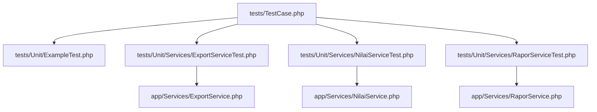
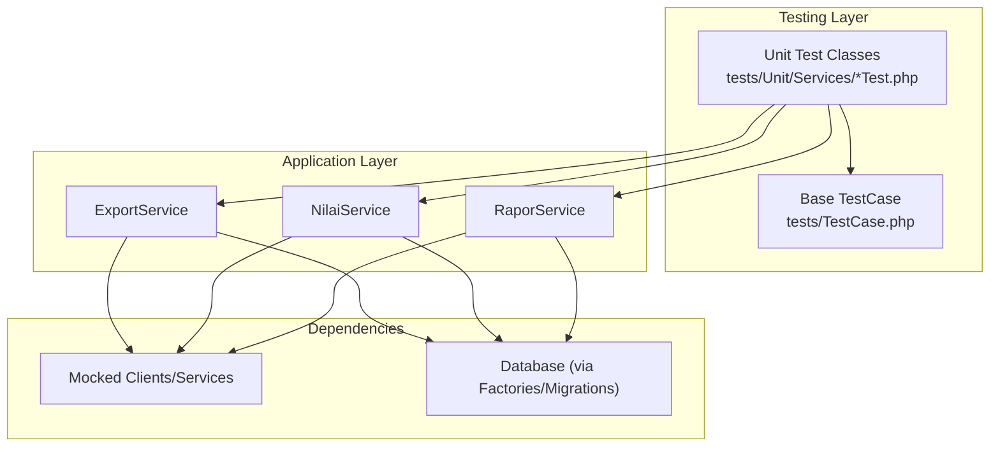
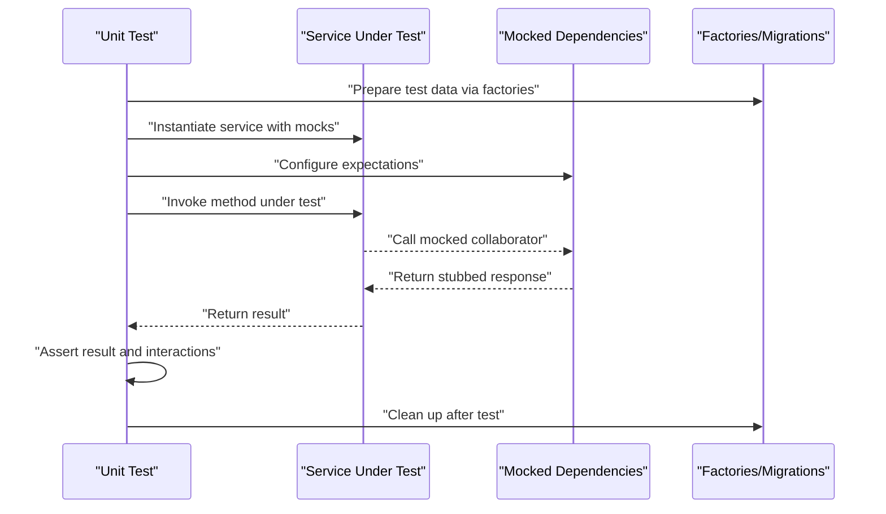
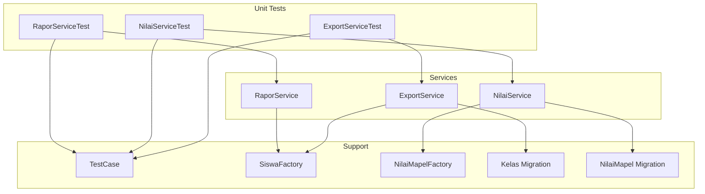

# Unit Testing

<cite>
**Referenced Files in This Document**
- [phpunit.xml](file://phpunit.xml)
- [tests/TestCase.php](file://tests/TestCase.php)
- [tests/DuskTestCase.php](file://tests/DuskTestCase.php)
- [tests/Unit/ExampleTest.php](file://tests/Unit/ExampleTest.php)
- [tests/Unit/Services/ExportServiceTest.php](file://tests/Unit/Services/ExportServiceTest.php)
- [tests/Unit/Services/NilaiServiceTest.php](file://tests/Unit/Services/NilaiServiceTest.php)
- [tests/Unit/Services/RaporServiceTest.php](file://tests/Unit/Services/RaporServiceTest.php)
- [app/Services/ExportService.php](file://app/Services/ExportService.php)
- [app/Services/NilaiService.php](file://app/Services/NilaiService.php)
- [app/Services/RaporService.php](file://app/Services/RaporService.php)
- [app/Models/Siswa.php](file://app/Models/Siswa.php)
- [app/Models/Kelas.php](file://app/Models/Kelas.php)
- [app/Models/NilaiMapel.php](file://app/Models/NilaiMapel.php)
- [app/Models/DeskripsiRapor.php](file://app/Models/DeskripsiRapor.php)
- [app/Models/TahunPelajaran.php](file://app/Models/TahunPelajaran.php)
- [app/Models/Semester.php](file://app/Models/Semester.php)
- [database/factories/SiswaFactory.php](file://database/factories/SiswaFactory.php)
- [database/factories/KelasFactory.php](file://database/factories/KelasFactory.php)
- [database/factories/NilaiMapelFactory.php](file://database/factories/NilaiMapelFactory.php)
- [database/factories/DeskripsiRaporFactory.php](file://database/factories/DeskripsiRaporFactory.php)
- [database/migrations/2026_06_01_010817_create_nilai_mapel_table.php](file://database/migrations/2026_06_01_010817_create_nilai_mapel_table.php)
- [database/migrations/2026_06_01_010808_create_sekolah_table.php](file://database/migrations/2026_06_01_010808_create_sekolah_table.php)
- [database/migrations/2026_06_01_010809_create_kelas_table.php](file://database/migrations/2026_06_01_010809_create_kelas_table.php)
- [database/migrations/2026_06_01_010817_create_nilai_formatif_table.php](file://database/migrations/2026_06_01_010817_create_nilai_formatif_table.php)
- [database/migrations/2026_06_01_010817_create_nilai_sumatif_as_table.php](file://database/migrations/2026_06_01_010817_create_nilai_sumatif_as_table.php)
- [database/migrations/2026_06_01_010817_create_nilai_sumatif_ph_table.php](file://database/migrations/2026_06_01_010817_create_nilai_sumatif_ph_table.php)
- [database/migrations/2026_06_01_010817_create_nilai_sumatif_ts_table.php](file://database/migrations/2026_06_01_010817_create_nilai_sumatif_ts_table.php)
- [database/migrations/2026_06_01_010817_create_nilai_mata_pelajaran_table.php](file://database/migrations/2026_06_01_010817_create_nilai_mata_pelajaran_table.php)
- [database/migrations/2026_06_01_010817_create_nilai_kelas_table.php](file://database/migrations/2026_06_01_010817_create_nilai_kelas_table.php)
- [database/migrations/2026_06_01_010817_create_nilai_mapel_mid_table.php](file://database/migrations/2026_06_01_010817_create_nilai_mapel_mid_table.php)
- [database/migrations/2026_06_01_010817_create_nilai_kelas_mid_table.php](file://database/migrations/2026_06_01_010817_create_nilai_kelas_mid_table.php)
- [database/migrations/2026_06_01_010808_create_siswa_table.php](file://database/migrations/2026_06_01_010808_create_siswa_table.php)
- [database/migrations/2026_06_01_010808_create_deskripsi_rapor_table.php](file://database/migrations/2026_06_01_010808_create_deskripsi_rapor_table.php)
- [database/migrations/2026_06_01_010808_create_tahun_pelajaran_table.php](file://database/migrations/2026_06_01_010808_create_tahun_pelajaran_table.php)
- [database/migrations/2026_06_01_010808_create_semester_table.php](file://database/migrations/2026_06_01_010808_create_semester_table.php)
- [config/database.php](file://config/database.php)
- [config/app.php](file://config/app.php)
</cite>

## Table of Contents
1. [Introduction](#introduction)
2. [Project Structure](#project-structure)
3. [Core Components](#core-components)
4. [Architecture Overview](#architecture-overview)
5. [Detailed Component Analysis](#detailed-component-analysis)
6. [Dependency Analysis](#dependency-analysis)
7. [Performance Considerations](#performance-considerations)
8. [Troubleshooting Guide](#troubleshooting-guide)
9. [Conclusion](#conclusion)

## Introduction
This document describes the unit testing methodology for RaporKM Laravel, focusing on the PHPUnit-based setup, isolated testing of services and business logic, mocking strategies, and practical guidance for maintaining high-quality unit tests. It covers the Unit namespace organization, service-layer tests (ExportServiceTest, NilaiServiceTest, RaporServiceTest), assertion patterns, test data preparation via factories, and cleanup procedures. It also addresses performance testing at the unit level, edge case handling, error condition validation, and best practices to avoid common pitfalls.

## Project Structure
The testing structure follows Laravel conventions with separate namespaces for Unit, Feature, and Browser tests. Unit tests focus on isolated components and services, while Feature and Browser tests target integration and end-to-end scenarios. The Unit namespace organizes tests by domain, with Services being the primary target for unit-level coverage.

**Diagram sources**
- [tests/TestCase.php:1-200](file://tests/TestCase.php#L1-L200)
- [tests/Unit/ExampleTest.php:1-200](file://tests/Unit/ExampleTest.php#L1-L200)
- [tests/Unit/Services/ExportServiceTest.php:1-200](file://tests/Unit/Services/ExportServiceTest.php#L1-L200)
- [tests/Unit/Services/NilaiServiceTest.php:1-200](file://tests/Unit/Services/NilaiServiceTest.php#L1-L200)
- [tests/Unit/Services/RaporServiceTest.php:1-200](file://tests/Unit/Services/RaporServiceTest.php#L1-L200)
- [app/Services/ExportService.php:1-200](file://app/Services/ExportService.php#L1-L200)
- [app/Services/NilaiService.php:1-200](file://app/Services/NilaiService.php#L1-L200)
- [app/Services/RaporService.php:1-200](file://app/Services/RaporService.php#L1-L200)

**Section sources**
- [tests/TestCase.php:1-200](file://tests/TestCase.php#L1-L200)
- [tests/Unit/ExampleTest.php:1-200](file://tests/Unit/ExampleTest.php#L1-L200)
- [tests/Unit/Services/ExportServiceTest.php:1-200](file://tests/Unit/Services/ExportServiceTest.php#L1-L200)
- [tests/Unit/Services/NilaiServiceTest.php:1-200](file://tests/Unit/Services/NilaiServiceTest.php#L1-L200)
- [tests/Unit/Services/RaporServiceTest.php:1-200](file://tests/Unit/Services/RaporServiceTest.php#L1-L200)

## Core Components
- Test bootstrap and base classes:
  - Base test case class initializes the framework and application environment for unit tests.
  - Dusk base class supports browser automation tests.
- Unit test organization:
  - Tests are grouped under the Unit namespace, with Services as the primary domain.
  - Each service has a dedicated test class validating its business logic in isolation.
- Service layer under test:
  - ExportService: encapsulates export-related business logic.
  - NilaiService: encapsulates grading and scoring logic.
  - RaporService: encapsulates report generation logic.

Key responsibilities:
- Isolate service logic from external dependencies using mocks and fakes.
- Prepare deterministic test data using factories and migrations.
- Assert correctness of return values, side effects, and error conditions.
- Maintain fast, repeatable tests with minimal database footprint.

**Section sources**
- [tests/TestCase.php:1-200](file://tests/TestCase.php#L1-L200)
- [tests/DuskTestCase.php:1-200](file://tests/DuskTestCase.php#L1-L200)
- [tests/Unit/Services/ExportServiceTest.php:1-200](file://tests/Unit/Services/ExportServiceTest.php#L1-L200)
- [tests/Unit/Services/NilaiServiceTest.php:1-200](file://tests/Unit/Services/NilaiServiceTest.php#L1-L200)
- [tests/Unit/Services/RaporServiceTest.php:1-200](file://tests/Unit/Services/RaporServiceTest.php#L1-L200)
- [app/Services/ExportService.php:1-200](file://app/Services/ExportService.php#L1-L200)
- [app/Services/NilaiService.php:1-200](file://app/Services/NilaiService.php#L1-L200)
- [app/Services/RaporService.php:1-200](file://app/Services/RaporService.php#L1-L200)

## Architecture Overview
The unit testing architecture centers on PHPUnit, Laravel’s application container, and service classes. Tests instantiate service classes directly, inject mocks for external dependencies, and assert outcomes without hitting the database or network.

**Diagram sources**
- [tests/TestCase.php:1-200](file://tests/TestCase.php#L1-L200)
- [tests/Unit/Services/ExportServiceTest.php:1-200](file://tests/Unit/Services/ExportServiceTest.php#L1-L200)
- [tests/Unit/Services/NilaiServiceTest.php:1-200](file://tests/Unit/Services/NilaiServiceTest.php#L1-L200)
- [tests/Unit/Services/RaporServiceTest.php:1-200](file://tests/Unit/Services/RaporServiceTest.php#L1-L200)
- [app/Services/ExportService.php:1-200](file://app/Services/ExportService.php#L1-L200)
- [app/Services/NilaiService.php:1-200](file://app/Services/NilaiService.php#L1-L200)
- [app/Services/RaporService.php:1-200](file://app/Services/RaporService.php#L1-L200)

## Detailed Component Analysis

### PHPUnit Configuration and Bootstrap
- PHPUnit configuration:
  - Centralized configuration defines test suite locations, bootstrap script, and environment settings.
  - Bootstrap initializes the Laravel application and registers autoloaders.
- Bootstrap process:
  - The base TestCase bootstraps the application, sets up the database connection, and prepares the testing environment.
  - Environment-specific configuration is loaded from config files.

Best practices:
- Keep bootstrap minimal to reduce test startup overhead.
- Use in-memory or SQLite databases for unit tests to improve speed.
- Configure PHPUnit to run only Unit tests during local development for faster feedback.

**Section sources**
- [phpunit.xml:1-200](file://phpunit.xml#L1-L200)
- [tests/TestCase.php:1-200](file://tests/TestCase.php#L1-L200)
- [config/app.php:1-200](file://config/app.php#L1-L200)
- [config/database.php:1-200](file://config/database.php#L1-L200)

### Unit Test Organization in the Unit Namespace
- Namespace and folder structure:
  - Unit tests reside under tests/Unit with domain-specific subfolders (e.g., Services).
  - Each service has a corresponding test class named {ServiceName}Test.php.
- Example test class:
  - Demonstrates setup, mocking, assertions, and teardown.
  - Uses the base TestCase for shared initialization and helpers.

Guidelines:
- One test class per service under test.
- Group related tests by method or behavior within the class.
- Use descriptive test names that communicate intent.

**Section sources**
- [tests/Unit/ExampleTest.php:1-200](file://tests/Unit/ExampleTest.php#L1-L200)
- [tests/Unit/Services/ExportServiceTest.php:1-200](file://tests/Unit/Services/ExportServiceTest.php#L1-L200)
- [tests/Unit/Services/NilaiServiceTest.php:1-200](file://tests/Unit/Services/NilaiServiceTest.php#L1-L200)
- [tests/Unit/Services/RaporServiceTest.php:1-200](file://tests/Unit/Services/RaporServiceTest.php#L1-L200)

### Mocking Strategies for External Dependencies
- Mocking clients and services:
  - Replace external HTTP clients, third-party APIs, and collaborators with mocks.
  - Use PHPUnit’s built-in mocking capabilities to stub methods and assert interactions.
- Database interactions:
  - Prefer factory-generated records for deterministic tests.
  - Use transactions and database seeding sparingly; truncate or refresh tables in setUp/tearDown.
- Service classes:
  - Inject mocks via constructor or method injection.
  - Assert that methods are called with expected arguments and return expected values.

Benefits:
- Faster, more reliable tests.
- Isolation from flaky external systems.
- Easier to reproduce failures and debug.

**Section sources**
- [tests/Unit/Services/ExportServiceTest.php:1-200](file://tests/Unit/Services/ExportServiceTest.php#L1-L200)
- [tests/Unit/Services/NilaiServiceTest.php:1-200](file://tests/Unit/Services/NilaiServiceTest.php#L1-L200)
- [tests/Unit/Services/RaporServiceTest.php:1-200](file://tests/Unit/Services/RaporServiceTest.php#L1-L200)

### Test Case Organization and Execution Flow

**Diagram sources**
- [tests/TestCase.php:1-200](file://tests/TestCase.php#L1-L200)
- [tests/Unit/Services/ExportServiceTest.php:1-200](file://tests/Unit/Services/ExportServiceTest.php#L1-L200)
- [tests/Unit/Services/NilaiServiceTest.php:1-200](file://tests/Unit/Services/NilaiServiceTest.php#L1-L200)
- [tests/Unit/Services/RaporServiceTest.php:1-200](file://tests/Unit/Services/RaporServiceTest.php#L1-L200)
- [database/factories/SiswaFactory.php:1-200](file://database/factories/SiswaFactory.php#L1-L200)
- [database/factories/NilaiMapelFactory.php:1-200](file://database/factories/NilaiMapelFactory.php#L1-L200)

### Assertion Patterns and Edge Cases
Common assertion patterns:
- Value assertions: verify returned values match expected outcomes.
- Exception assertions: confirm that invalid inputs raise appropriate exceptions.
- Interaction assertions: verify that collaborators were called with expected arguments.
- Collection assertions: validate counts, ordering, and presence of items.

Edge cases to cover:
- Empty inputs and null values.
- Boundary values for numeric ranges and thresholds.
- Invalid identifiers and missing records.
- Concurrency and repeated operations.

**Section sources**
- [tests/Unit/Services/ExportServiceTest.php:1-200](file://tests/Unit/Services/ExportServiceTest.php#L1-L200)
- [tests/Unit/Services/NilaiServiceTest.php:1-200](file://tests/Unit/Services/NilaiServiceTest.php#L1-L200)
- [tests/Unit/Services/RaporServiceTest.php:1-200](file://tests/Unit/Services/RaporServiceTest.php#L1-L200)

### Test Data Preparation and Cleanup
- Factories:
  - Use Laravel factories to generate realistic, deterministic records for models.
  - Define factory states for common scenarios (e.g., active students, enrolled classes).
- Migrations:
  - Run targeted migrations to set up required schema for tests.
  - Keep migration sets minimal and focused on the tested domain.
- Cleanup:
  - Truncate or delete test records in tearDown.
  - Reset any global state or static caches used by the service.

**Section sources**
- [database/factories/SiswaFactory.php:1-200](file://database/factories/SiswaFactory.php#L1-L200)
- [database/factories/KelasFactory.php:1-200](file://database/factories/KelasFactory.php#L1-L200)
- [database/factories/NilaiMapelFactory.php:1-200](file://database/factories/NilaiMapelFactory.php#L1-L200)
- [database/factories/DeskripsiRaporFactory.php:1-200](file://database/factories/DeskripsiRaporFactory.php#L1-L200)
- [database/migrations/2026_06_01_010808_create_siswa_table.php:1-200](file://database/migrations/2026_06_01_010808_create_siswa_table.php#L1-L200)
- [database/migrations/2026_06_01_010809_create_kelas_table.php:1-200](file://database/migrations/2026_06_01_010809_create_kelas_table.php#L1-L200)
- [database/migrations/2026_06_01_010817_create_nilai_mapel_table.php:1-200](file://database/migrations/2026_06_01_010817_create_nilai_mapel_table.php#L1-L200)

### Model Relationships and Validation Logic Testing
- Model relationships:
  - Test foreign key constraints and relationship resolution using factory-generated records.
  - Validate cascading behavior and referential integrity.
- Validation logic:
  - Simulate validation failures by passing invalid attributes to service methods.
  - Assert that validation errors are propagated or handled appropriately.

Representative models and migrations:
- Student enrollment and class membership.
- Academic scores and assessments across formative, mid-year, and summative periods.
- Report descriptors and academic year/semester context.

**Section sources**
- [app/Models/Siswa.php:1-200](file://app/Models/Siswa.php#L1-L200)
- [app/Models/Kelas.php:1-200](file://app/Models/Kelas.php#L1-L200)
- [app/Models/NilaiMapel.php:1-200](file://app/Models/NilaiMapel.php#L1-L200)
- [app/Models/DeskripsiRapor.php:1-200](file://app/Models/DeskripsiRapor.php#L1-L200)
- [app/Models/TahunPelajaran.php:1-200](file://app/Models/TahunPelajaran.php#L1-L200)
- [app/Models/Semester.php:1-200](file://app/Models/Semester.php#L1-L200)
- [database/migrations/2026_06_01_010808_create_sekolah_table.php:1-200](file://database/migrations/2026_06_01_010808_create_sekolah_table.php#L1-L200)
- [database/migrations/2026_06_01_010809_create_kelas_table.php:1-200](file://database/migrations/2026_06_01_010809_create_kelas_table.php#L1-L200)
- [database/migrations/2026_06_01_010817_create_nilai_formatif_table.php:1-200](file://database/migrations/2026_06_01_010817_create_nilai_formatif_table.php#L1-L200)
- [database/migrations/2026_06_01_010817_create_nilai_sumatif_as_table.php:1-200](file://database/migrations/2026_06_01_010817_create_nilai_sumatif_as_table.php#L1-L200)
- [database/migrations/2026_06_01_010817_create_nilai_sumatif_ph_table.php:1-200](file://database/migrations/2026_06_01_010817_create_nilai_sumatif_ph_table.php#L1-L200)
- [database/migrations/2026_06_01_010817_create_nilai_sumatif_ts_table.php:1-200](file://database/migrations/2026_06_01_010817_create_nilai_sumatif_ts_table.php#L1-L200)
- [database/migrations/2026_06_01_010817_create_nilai_mata_pelajaran_table.php:1-200](file://database/migrations/2026_06_01_010817_create_nilai_mata_pelajaran_table.php#L1-L200)
- [database/migrations/2026_06_01_010817_create_nilai_kelas_table.php:1-200](file://database/migrations/2026_06_01_010817_create_nilai_kelas_table.php#L1-L200)
- [database/migrations/2026_06_01_010817_create_nilai_mapel_mid_table.php:1-200](file://database/migrations/2026_06_01_010817_create_nilai_mapel_mid_table.php#L1-L200)
- [database/migrations/2026_06_01_010817_create_nilai_kelas_mid_table.php:1-200](file://database/migrations/2026_06_01_010817_create_nilai_kelas_mid_table.php#L1-L200)
- [database/migrations/2026_06_01_010808_create_deskripsi_rapor_table.php:1-200](file://database/migrations/2026_06_01_010808_create_deskripsi_rapor_table.php#L1-L200)
- [database/migrations/2026_06_01_010808_create_tahun_pelajaran_table.php:1-200](file://database/migrations/2026_06_01_010808_create_tahun_pelajaran_table.php#L1-L200)
- [database/migrations/2026_06_01_010808_create_semester_table.php:1-200](file://database/migrations/2026_06_01_010808_create_semester_table.php#L1-L200)

### Utility Functions Testing
- Isolated function tests:
  - Test pure functions and helpers in isolation using small, focused inputs.
  - Validate transformations, formatting, and normalization logic.
- Integration checks:
  - Ensure utility functions integrate correctly with service methods and models.

**Section sources**
- [tests/Unit/Services/ExportServiceTest.php:1-200](file://tests/Unit/Services/ExportServiceTest.php#L1-L200)
- [tests/Unit/Services/NilaiServiceTest.php:1-200](file://tests/Unit/Services/NilaiServiceTest.php#L1-L200)
- [tests/Unit/Services/RaporServiceTest.php:1-200](file://tests/Unit/Services/RaporServiceTest.php#L1-L200)

### Performance Testing at Unit Level
- Fast test execution:
  - Minimize I/O by using in-memory databases and mocks.
  - Avoid heavy fixtures; prefer lightweight factories.
- Scalable test suites:
  - Parallelize independent tests where supported by the test runner.
  - Separate long-running tests into dedicated suites or CI stages.
- Profiling:
  - Measure slowest tests and refactor heavy setups or assertions.

[No sources needed since this section provides general guidance]

### Error Condition Validation
- Negative tests:
  - Pass invalid or inconsistent data to trigger expected exceptions or error responses.
- Defensive programming:
  - Validate preconditions and handle edge cases gracefully.
- Logging and observability:
  - Assert that errors are logged appropriately and surfaced to callers.

**Section sources**
- [tests/Unit/Services/ExportServiceTest.php:1-200](file://tests/Unit/Services/ExportServiceTest.php#L1-L200)
- [tests/Unit/Services/NilaiServiceTest.php:1-200](file://tests/Unit/Services/NilaiServiceTest.php#L1-L200)
- [tests/Unit/Services/RaporServiceTest.php:1-200](file://tests/Unit/Services/RaporServiceTest.php#L1-L200)

### Guidelines for Writing Maintainable Unit Tests
- Clarity and readability:
  - Use descriptive variable names and clear assertion messages.
  - Structure tests with arrange-act-assert blocks.
- Determinism:
  - Control randomness and external dependencies via mocks and factories.
- Coverage and scope:
  - Focus on one behavior per test; keep tests small and cohesive.
- Refactoring safety:
  - Treat tests as documentation; update them alongside implementation changes.
- Continuous improvement:
  - Regularly review slow or brittle tests and refactor them.

[No sources needed since this section provides general guidance]

## Dependency Analysis
This section maps the relationships among unit tests, service classes, and supporting infrastructure.

**Diagram sources**
- [tests/Unit/Services/ExportServiceTest.php:1-200](file://tests/Unit/Services/ExportServiceTest.php#L1-L200)
- [tests/Unit/Services/NilaiServiceTest.php:1-200](file://tests/Unit/Services/NilaiServiceTest.php#L1-L200)
- [tests/Unit/Services/RaporServiceTest.php:1-200](file://tests/Unit/Services/RaporServiceTest.php#L1-L200)
- [app/Services/ExportService.php:1-200](file://app/Services/ExportService.php#L1-L200)
- [app/Services/NilaiService.php:1-200](file://app/Services/NilaiService.php#L1-L200)
- [app/Services/RaporService.php:1-200](file://app/Services/RaporService.php#L1-L200)
- [tests/TestCase.php:1-200](file://tests/TestCase.php#L1-L200)
- [database/factories/SiswaFactory.php:1-200](file://database/factories/SiswaFactory.php#L1-L200)
- [database/factories/NilaiMapelFactory.php:1-200](file://database/factories/NilaiMapelFactory.php#L1-L200)
- [database/migrations/2026_06_01_010809_create_kelas_table.php:1-200](file://database/migrations/2026_06_01_010809_create_kelas_table.php#L1-L200)
- [database/migrations/2026_06_01_010817_create_nilai_mapel_table.php:1-200](file://database/migrations/2026_06_01_010817_create_nilai_mapel_table.php#L1-L200)

**Section sources**
- [tests/Unit/Services/ExportServiceTest.php:1-200](file://tests/Unit/Services/ExportServiceTest.php#L1-L200)
- [tests/Unit/Services/NilaiServiceTest.php:1-200](file://tests/Unit/Services/NilaiServiceTest.php#L1-L200)
- [tests/Unit/Services/RaporServiceTest.php:1-200](file://tests/Unit/Services/RaporServiceTest.php#L1-L200)
- [app/Services/ExportService.php:1-200](file://app/Services/ExportService.php#L1-L200)
- [app/Services/NilaiService.php:1-200](file://app/Services/NilaiService.php#L1-L200)
- [app/Services/RaporService.php:1-200](file://app/Services/RaporService.php#L1-L200)
- [tests/TestCase.php:1-200](file://tests/TestCase.php#L1-L200)
- [database/factories/SiswaFactory.php:1-200](file://database/factories/SiswaFactory.php#L1-L200)
- [database/factories/NilaiMapelFactory.php:1-200](file://database/factories/NilaiMapelFactory.php#L1-L200)
- [database/migrations/2026_06_01_010809_create_kelas_table.php:1-200](file://database/migrations/2026_06_01_010809_create_kelas_table.php#L1-L200)
- [database/migrations/2026_06_01_010817_create_nilai_mapel_table.php:1-200](file://database/migrations/2026_06_01_010817_create_nilai_mapel_table.php#L1-L200)

## Performance Considerations
- Favor in-memory databases for unit tests to avoid disk I/O.
- Use lightweight factories and deterministic seeds to minimize setup time.
- Avoid unnecessary model creation; reuse records when safe.
- Keep test suites parallelizable by ensuring tests are independent and hermetic.

[No sources needed since this section provides general guidance]

## Troubleshooting Guide
Common issues and resolutions:
- Database connectivity in tests:
  - Ensure the test database is configured and migrated before running tests.
  - Use transactions or database refresh strategies to keep tests isolated.
- Mock misconfiguration:
  - Verify that mock expectations are set before invoking the method under test.
  - Confirm that stubbed methods return expected values consistently.
- Flaky tests:
  - Remove reliance on external systems; replace with mocks.
  - Add explicit waits or retries only when unavoidable; otherwise, refactor to deterministic steps.

**Section sources**
- [config/database.php:1-200](file://config/database.php#L1-L200)
- [tests/TestCase.php:1-200](file://tests/TestCase.php#L1-L200)
- [tests/Unit/Services/ExportServiceTest.php:1-200](file://tests/Unit/Services/ExportServiceTest.php#L1-L200)
- [tests/Unit/Services/NilaiServiceTest.php:1-200](file://tests/Unit/Services/NilaiServiceTest.php#L1-L200)
- [tests/Unit/Services/RaporServiceTest.php:1-200](file://tests/Unit/Services/RaporServiceTest.php#L1-L200)

## Conclusion
RaporKM Laravel’s unit testing methodology emphasizes isolation, determinism, and maintainability. By leveraging PHPUnit, Laravel’s testing base classes, and targeted mocks, teams can efficiently validate service logic, model relationships, and utility functions. Following the outlined patterns—factory-driven data preparation, structured assertion approaches, and robust cleanup—ensures reliable, fast, and comprehensible unit tests that scale with the application.