# Administrator User Manual

<cite>
**Referenced Files in This Document**
- [README.md](file://README.md)
- [docs/manual-tu/index.md](file://docs/manual-tu/index.md)
- [docs/manual-tu/01-persiapan.md](file://docs/manual-tu/01-persiapan.md)
- [docs/manual-tu/02-manajemen-pengguna.md](file://docs/manual-tu/02-manajemen-pengguna.md)
- [docs/manual-tu/03-manajemen-siswa.md](file://docs/manual-tu/03-manajemen-siswa.md)
- [docs/manual-tu/04-manajemen-kurikulum.md](file://docs/manual-tu/04-manajemen-kurikulum.md)
- [docs/manual-tu/05-p5-kokurikuler.md](file://docs/manual-tu/05-p5-kokurikuler.md)
- [docs/manual-tu/06-ekstra-organisasi.md](file://docs/manual-tu/06-ekstra-organisasi.md)
- [docs/manual-tu/07-prakerin.md](file://docs/manual-tu/07-prakerin.md)
- [docs/manual-tu/08-rapor-cetak.md](file://docs/manual-tu/08-rapor-cetak.md)
- [docs/manual-tu/09-ekspor-laporan.md](file://docs/manual-tu/09-ekspor-laporan.md)
- [docs/manual-tu/10-dapodik-sync.md](file://docs/manual-tu/10-dapodik-sync.md)
- [app/Models/User.php](file://app/Models/User.php)
- [app/Models/Siswa.php](file://app/Models/Siswa.php)
- [app/Models/Kelas.php](file://app/Models/Kelas.php)
- [app/Models/Mapel.php](file://app/Models/Mapel.php)
- [app/Models/Sekolah.php](file://app/Models/Sekolah.php)
- [app/Services/DapodikService.php](file://app/Services/DapodikService.php)
- [app/Jobs/SyncDapodikJob.php](file://app/Jobs/SyncDapodikJob.php)
- [app/Services/ExportService.php](file://app/Services/ExportService.php)
- [app/Services/RaporService.php](file://app/Services/RaporService.php)
- [app/Services/GuruMenuService.php](file://app/Services/GuruMenuService.php)
- [app/Http/Middleware/EnsureRole.php](file://app/Http/Middleware/EnsureRole.php)
- [routes/web.php](file://routes/web.php)
- [resources/views/layouts/tu.blade.php](file://resources/views/layouts/tu.blade.php)
- [resources/views/tu/dashboard.blade.php](file://resources/views/tu/dashboard.blade.php)
- [resources/views/tu/pengaturan/sekolah.blade.php](file://resources/views/tu/pengaturan/sekolah.blade.php)
- [resources/views/tu/kesiswaan/mutasi/mutasimasuk.blade.php](file://resources/views/tu/kesiswaan/mutasi/mutasimasuk.blade.php)
- [resources/views/tu/kelompok-mapel/index.blade.php](file://resources/views/tu/kelompok-mapel/index.blade.php)
- [resources/views/tu/mapel-kelas/index.blade.php](file://resources/views/tu/mapel-kelas/index.blade.php)
- [resources/views/tu/p5bk/index.blade.php](file://resources/views/tu/p5bk/index.blade.php)
- [resources/views/tu/ekstra/index.blade.php](file://resources/views/tu/ekstra/index.blade.php)
- [resources/views/tu/prakerin/index.blade.php](file://resources/views/tu/prakerin/index.blade.php)
- [resources/views/tu/rapor/index.blade.php](file://resources/views/tu/rapor/index.blade.php)
- [resources/views/tu/ekspor/index.blade.php](file://resources/views/tu/ekspor/index.blade.php)
- [resources/views/tu/dapodik/index.blade.php](file://resources/views/tu/dapodik/index.blade.php)
- [app/Models/DapodikSyncLog.php](file://app/Models/DapodikSyncLog.php)
- [app/Models/PembinaEskul.php](file://app/Models/PembinaEskul.php)
- [app/Models/Prestasi.php](file://app/Models/Prestasi.php)
- [app/Models/Presensi.php](file://app/Models/Presensi.php)
- [app/Models/NilaiKelas.php](file://app/Models/NilaiKelas.php)
- [app/Models/DeskripsiRapor.php](file://app/Models/DeskripsiRapor.php)
- [app/Models/PembagianRaport.php](file://app/Models/PembagianRaport.php)
- [app/Models/TahunPelajaran.php](file://app/Models/TahunPelajaran.php)
- [app/Models/Semester.php](file://app/Models/Semester.php)
- [app/Models/Setting.php](file://app/Models/Setting.php)
- [config/app.php](file://config/app.php)
- [config/auth.php](file://config/auth.php)
- [config/cache.php](file://config/cache.php)
- [config/database.php](file://config/database.php)
- [config/dompdf.php](file://config/dompdf.php)
- [config/e-rapor.php](file://config/e-rapor.php)
- [config/logging.php](file://config/logging.php)
- [config/mail.php](file://config/mail.php)
- [config/push.php](file://config/push.php)
- [config/queue.php](file://config/queue.php)
- [config/sanctum.php](file://config/sanctum.php)
- [config/services.php](file://config/services.php)
- [config/session.php](file://config/session.php)
- [database/migrations/..._create_users_table.php](file://database/migrations/0001_01_01_000000_create_users_table.php)
- [database/migrations/..._create_sekolah_table.php](file://database/migrations/2026_06_01_010808_create_sekolah_table.php)
- [database/migrations/..._create_siswa_table.php](file://database/migrations/2026_06_01_010808_create_siswa_table.php)
- [database/migrations/..._create_kelas_table.php](file://database/migrations/2026_06_01_010809_create_kelas_table.php)
- [database/migrations/..._create_mapel_table.php](file://database/migrations/2026_06_01_010808_create_mapel_table.php)
- [database/migrations/..._create_dapodik_sync_logs_table.php](file://database/migrations/2026_06_02_040000_create_dapodik_sync_logs_table.php)
- [database/seeders/UserSeeder.php](file://database/seeders/UserSeeder.php)
- [database/seeders/DemoDataSeeder.php](file://database/seeders/DemoDataSeeder.php)
- [database/seeders/RefDataSeeder.php](file://database/seeders/RefDataSeeder.php)
- [database/seeders/TahunPelajaranSemesterSeeder.php](file://database/seeders/TahunPelajaranSemesterSeeder.php)
- [app/Providers/AppServiceProvider.php](file://app/Providers/AppServiceProvider.php)
- [app/Providers/VoltServiceProvider.php](file://app/Providers/VoltServiceProvider.php)
- [bootstrap/app.php](file://bootstrap/app.php)
- [public/index.php](file://public/index.php)
- [storage/fonts/poppins/](file://storage/fonts/poppins/)
- [storage/app/public/](file://storage/app/public/)
- [deploy/raporkm-queue-worker.service](file://deploy/raporkm-queue-worker.service)
- [deploy/raporkm-logrotate.conf](file://deploy/raporkm-logrotate.conf)
- [scripts/backup-db.sh](file://scripts/backup-db.sh)
- [tests/Feature/Tu/](file://tests/Feature/Tu/)
- [tests/Feature/Ekspor/](file://tests/Feature/Ekspor/)
- [tests/Feature/Laporan/](file://tests/Feature/Laporan/)
- [tests/Unit/Services/](file://tests/Unit/Services/)
</cite>

## Table of Contents
1. [Introduction](#introduction)
2. [Project Structure](#project-structure)
3. [Core Components](#core-components)
4. [Architecture Overview](#architecture-overview)
5. [Detailed Component Analysis](#detailed-component-analysis)
6. [Dependency Analysis](#dependency-analysis)
7. [Performance Considerations](#performance-considerations)
8. [Troubleshooting Guide](#troubleshooting-guide)
9. [Conclusion](#conclusion)
10. [Appendices](#appendices)

## Introduction
This Administrator User Manual provides comprehensive guidance for managing the RaporKM Laravel system. It covers system setup, user administration, student enrollment and data management, curriculum configuration, personal and social education (P5BK) program management, extracurricular and organizational activities coordination, praktik kerja lapangan (praktikin) supervision, report card generation and printing, data export and reporting, and Dapodik data synchronization. The manual includes step-by-step instructions, administrative workflows, screenshots, and practical examples tailored for school administrators and TU (Kearsipan dan Umum) staff.

## Project Structure
RaporKM is a Laravel-based educational management system with a modular structure supporting multiple roles (administrator, teacher, staff). Administrative functions are primarily organized under the TU module, with dedicated controllers, services, jobs, and Blade views.

Key structural elements:
- Application core: app/
- HTTP layer: app/Http/Controllers/, app/Http/Middleware/
- Domain models: app/Models/
- Services: app/Services/
- Jobs: app/Jobs/
- Views: resources/views/tu/
- Configuration: config/
- Database: database/
- Tests: tests/

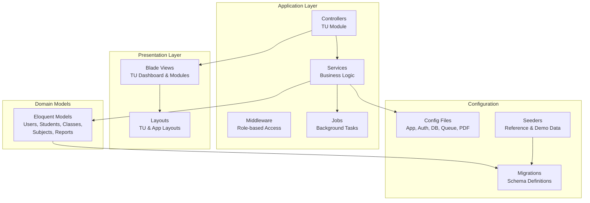

**Diagram sources**
- [app/Http/Controllers/](file://app/Http/Controllers/)
- [app/Http/Middleware/EnsureRole.php](file://app/Http/Middleware/EnsureRole.php)
- [app/Services/](file://app/Services/)
- [app/Jobs/](file://app/Jobs/)
- [app/Models/](file://app/Models/)
- [resources/views/tu/](file://resources/views/tu/)
- [resources/views/layouts/](file://resources/views/layouts/)
- [config/](file://config/)
- [database/migrations/](file://database/migrations/)
- [database/seeders/](file://database/seeders/)

**Section sources**
- [README.md](file://README.md)
- [routes/web.php](file://routes/web.php)
- [resources/views/layouts/tu.blade.php](file://resources/views/layouts/tu.blade.php)

## Core Components
Administrative capabilities are centered around several core components:

- Role-based access control via middleware ensuring only authorized users access administrative features
- Domain models representing school entities (users, students, classes, subjects, reports)
- Services encapsulating business logic for data operations, exports, reports, and Dapodik synchronization
- Jobs for asynchronous processing of heavy tasks like Dapodik sync
- Blade views implementing TU dashboards and functional modules

Administrative responsibilities include:
- Managing user accounts and roles
- Enrolling students and maintaining academic records
- Configuring curricula and subject mappings
- Overseeing P5BK programs
- Coordinating extracurricular and organizational activities
- Supervising praktikin (internship)
- Generating and printing report cards
- Exporting reports and performing data synchronization

**Section sources**
- [app/Http/Middleware/EnsureRole.php](file://app/Http/Middleware/EnsureRole.php)
- [app/Models/User.php](file://app/Models/User.php)
- [app/Models/Siswa.php](file://app/Models/Siswa.php)
- [app/Models/Kelas.php](file://app/Models/Kelas.php)
- [app/Models/Mapel.php](file://app/Models/Mapel.php)
- [app/Services/](file://app/Services/)
- [app/Jobs/](file://app/Jobs/)
- [resources/views/tu/](file://resources/views/tu/)

## Architecture Overview
The system follows a layered architecture with clear separation of concerns:
- Presentation: Blade views and layouts for TU module
- Application: Controllers orchestrating requests and delegating to services
- Domain: Eloquent models representing entities and relationships
- Infrastructure: Configuration, migrations, seeders, and external integrations

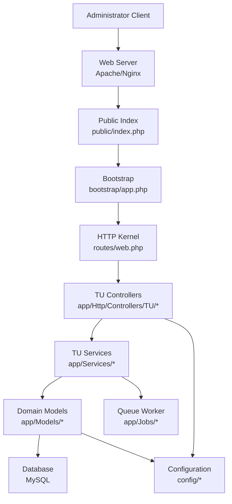

**Diagram sources**
- [public/index.php](file://public/index.php)
- [bootstrap/app.php](file://bootstrap/app.php)
- [routes/web.php](file://routes/web.php)
- [app/Http/Controllers/](file://app/Http/Controllers/)
- [app/Services/](file://app/Services/)
- [app/Models/](file://app/Models/)
- [app/Jobs/](file://app/Jobs/)
- [config/](file://config/)

## Detailed Component Analysis

### System Setup and Preparation
Administrators must prepare the system before enabling administrative functions:
- Install prerequisites (PHP, Composer, Node.js, MySQL)
- Configure environment variables (database connection, queue driver)
- Run database migrations to create schema
- Seed reference data and demo content
- Set up queue worker for background processing
- Configure PDF generation and file storage

Administrative steps:
1. Clone repository and install dependencies
2. Create database and configure .env
3. Run migrations and seeders
4. Build assets and set storage permissions
5. Start queue worker service
6. Verify system health and access TU dashboard

Quality assurance:
- Validate database connectivity
- Confirm migration completion
- Test file upload and PDF generation
- Verify queue worker status

**Section sources**
- [docs/manual-tu/01-persiapan.md](file://docs/manual-tu/01-persiapan.md)
- [database/migrations/](file://database/migrations/)
- [database/seeders/](file://database/seeders/)
- [deploy/raporkm-queue-worker.service](file://deploy/raporkm-queue-worker.service)
- [config/](file://config/)

### User Account Management
The system manages multiple user roles with distinct permissions:
- Administrator: Full system access
- TU (Kearsipan dan Umum): Administrative functions
- Guru (Teacher): Academic and student supervision
- Staff: Support functions

User management includes:
- Creating and editing user profiles
- Assigning roles and permissions
- Managing credentials and authentication
- Deactivating inactive accounts

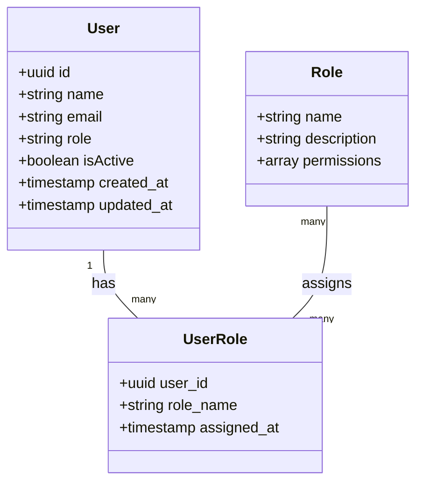

**Diagram sources**
- [app/Models/User.php](file://app/Models/User.php)
- [database/migrations/0001_01_01_000000_create_users_table.php](file://database/migrations/0001_01_01_000000_create_users_table.php)

**Section sources**
- [docs/manual-tu/02-manajemen-pengguna.md](file://docs/manual-tu/02-manajemen-pengguna.md)
- [app/Models/User.php](file://app/Models/User.php)
- [database/migrations/0001_01_01_000000_create_users_table.php](file://database/migrations/0001_01_01_000000_create_users_table.php)

### Student Enrollment and Data Management
Student enrollment encompasses registration, class assignment, and academic record maintenance:
- Register new students with demographic data
- Assign students to classes per academic year
- Manage transfers (incoming and outgoing)
- Track attendance and academic performance
- Maintain emergency contact and health information

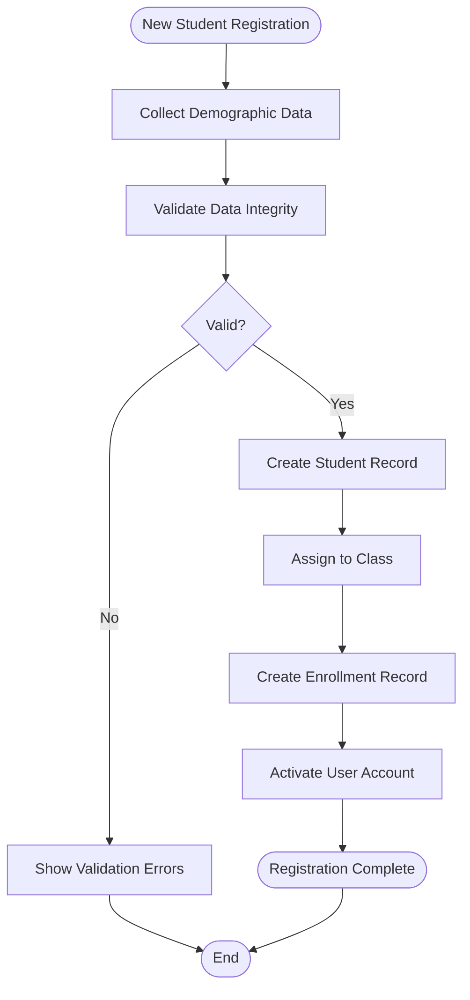

**Diagram sources**
- [app/Models/Siswa.php](file://app/Models/Siswa.php)
- [app/Models/SiswaKelas.php](file://app/Models/SiswaKelas.php)
- [app/Models/MutasiMasuk.php](file://app/Models/MutasiMasuk.php)
- [app/Models/MutasiKeluar.php](file://app/Models/MutasiKeluar.php)

**Section sources**
- [docs/manual-tu/03-manajemen-siswa.md](file://docs/manual-tu/03-manajemen-siswa.md)
- [app/Models/Siswa.php](file://app/Models/Siswa.php)
- [resources/views/tu/kesiswaan/mutasi/mutasimasuk.blade.php](file://resources/views/tu/kesiswaan/mutasi/mutasimasuk.blade.php)

### Curriculum Configuration and Subject Mapping
Curriculum management involves organizing subjects, grouping, and mapping to classes:
- Define subject groups and subject hierarchy
- Configure subject sequences and prerequisites
- Map subjects to classes and academic years
- Set competency indicators and assessment criteria
- Manage project-based learning themes

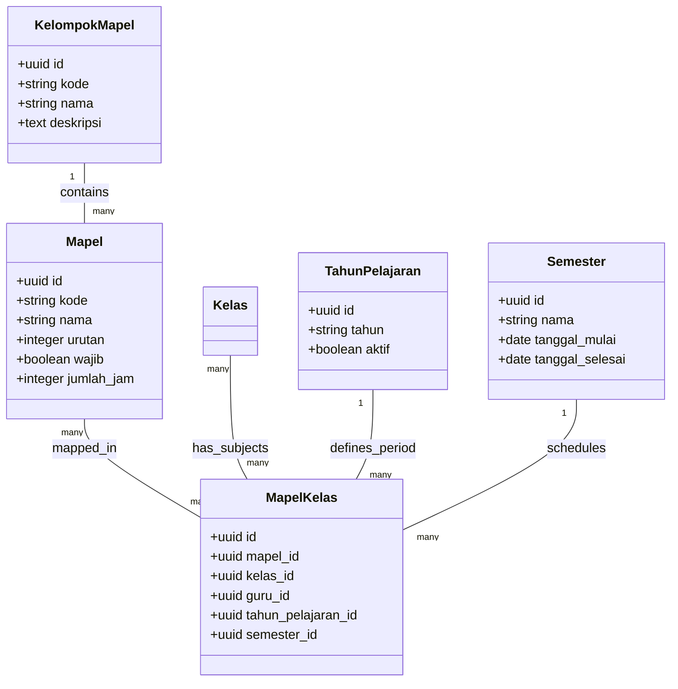

**Diagram sources**
- [app/Models/KelompokMapel.php](file://app/Models/KelompokMapel.php)
- [app/Models/Mapel.php](file://app/Models/Mapel.php)
- [app/Models/MapelKelas.php](file://app/Models/MapelKelas.php)
- [app/Models/TahunPelajaran.php](file://app/Models/TahunPelajaran.php)
- [app/Models/Semester.php](file://app/Models/Semester.php)

**Section sources**
- [docs/manual-tu/04-manajemen-kurikulum.md](file://docs/manual-tu/04-manajemen-kurikulum.md)
- [resources/views/tu/kelompok-mapel/index.blade.php](file://resources/views/tu/kelompok-mapel/index.blade.php)
- [resources/views/tu/mapel-kelas/index.blade.php](file://resources/views/tu/mapel-kelas/index.blade.php)

### Personal and Social Education (P5BK) Program Management
P5BK integrates character education and life skills development:
- Define P5BK dimensions and elements
- Create competency descriptors for report cards
- Track student participation and achievements
- Generate P5BK report summaries
- Coordinate with class advisors and counselors

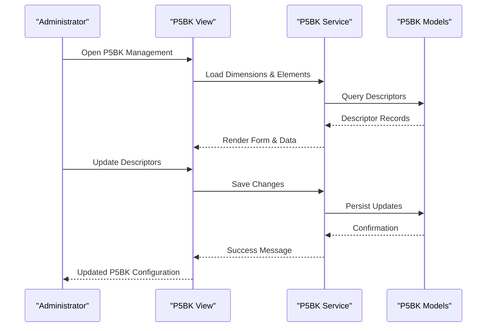

**Diagram sources**
- [resources/views/tu/p5bk/index.blade.php](file://resources/views/tu/p5bk/index.blade.php)
- [app/Models/Dimensi.php](file://app/Models/Dimensi.php)
- [app/Models/Elemen.php](file://app/Models/Elemen.php)
- [app/Models/DeskripsiRapor.php](file://app/Models/DeskripsiRapor.php)

**Section sources**
- [docs/manual-tu/05-p5-kokurikuler.md](file://docs/manual-tu/05-p5-kokurikuler.md)
- [resources/views/tu/p5bk/index.blade.php](file://resources/views/tu/p5bk/index.blade.php)

### Extracurricular and Organizational Activities Coordination
Extracurricular management coordinates student activities and organizational leadership:
- Create and manage extracurricular clubs
- Assign activity coordinators and mentors
- Track student participation and attendance
- Record achievements and awards
- Generate activity reports

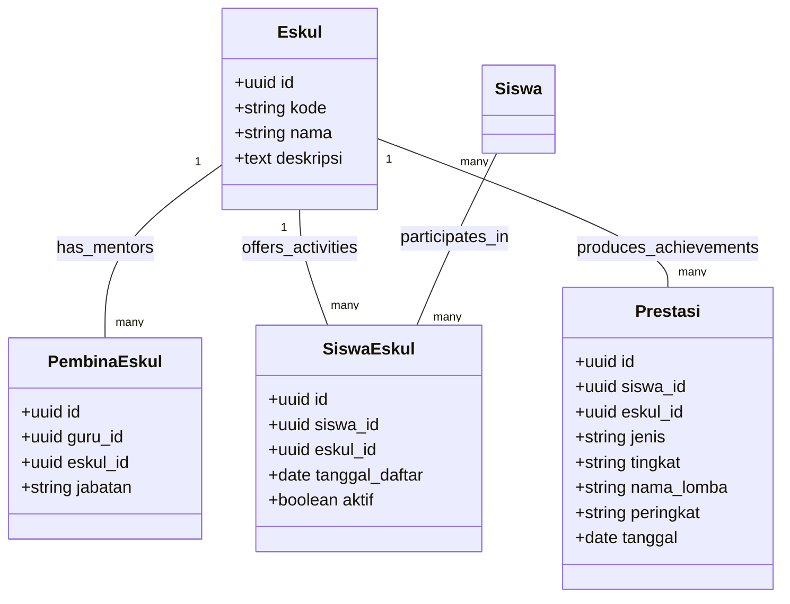

**Diagram sources**
- [app/Models/Eskul.php](file://app/Models/Eskul.php)
- [app/Models/PembinaEskul.php](file://app/Models/PembinaEskul.php)
- [app/Models/SiswaEskul.php](file://app/Models/SiswaEskul.php)
- [app/Models/Prestasi.php](file://app/Models/Prestasi.php)

**Section sources**
- [docs/manual-tu/06-ekstra-organisasi.md](file://docs/manual-tu/06-ekstra-organisasi.md)
- [resources/views/tu/ekstra/index.blade.php](file://resources/views/tu/ekstra/index.blade.php)

### Praktik Kerja Lapangan (Praktikin) Supervision
Praktikin supervision manages internship programs:
- Define practice locations and supervisors
- Assign students to practice sites
- Monitor practice progress and evaluations
- Record practice outcomes and certificates
- Generate practice reports

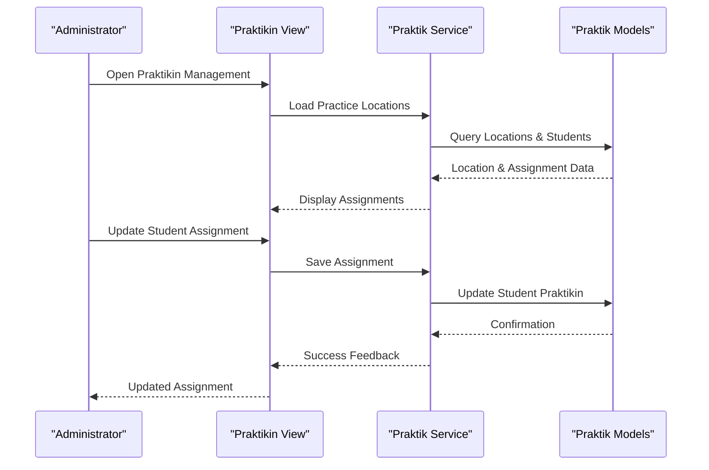

**Diagram sources**
- [resources/views/tu/prakerin/index.blade.php](file://resources/views/tu/prakerin/index.blade.php)
- [app/Models/Prakerin.php](file://app/Models/Prakerin.php)
- [app/Models/SiswaPrakerin.php](file://app/Models/SiswaPrakerin.php)
- [app/Models/NilaiPrakerin.php](file://app/Models/NilaiPrakerin.php)

**Section sources**
- [docs/manual-tu/07-prakerin.md](file://docs/manual-tu/07-prakerin.md)
- [resources/views/tu/prakerin/index.blade.php](file://resources/views/tu/prakerin/index.blade.php)

### Report Card Generation and Printing
Report card generation supports multiple formats and printing:
- Configure report templates and formats
- Generate mid-term and semester reports
- Print individual and class reports
- Export reports to various formats
- Manage report distribution and notifications

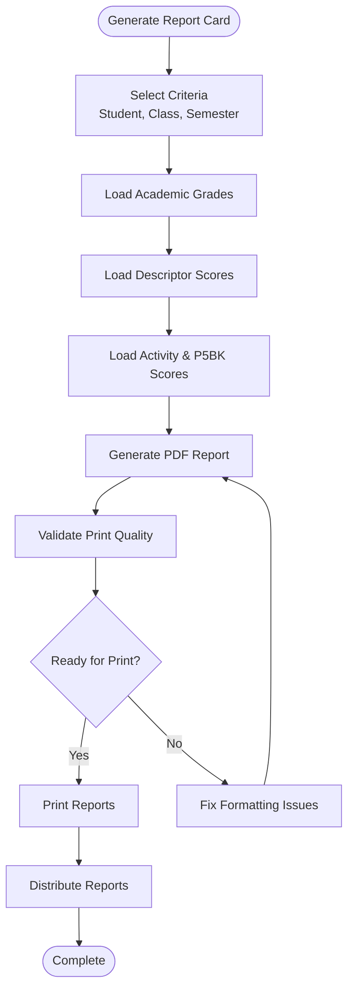

**Diagram sources**
- [app/Services/RaporService.php](file://app/Services/RaporService.php)
- [app/Models/NilaiKelas.php](file://app/Models/NilaiKelas.php)
- [app/Models/DeskripsiRapor.php](file://app/Models/DeskripsiRapor.php)
- [config/dompdf.php](file://config/dompdf.php)

**Section sources**
- [docs/manual-tu/08-rapor-cetak.md](file://docs/manual-tu/08-rapor-cetak.md)
- [resources/views/tu/rapor/index.blade.php](file://resources/views/tu/rapor/index.blade.php)
- [app/Services/RaporService.php](file://app/Services/RaporService.php)

### Data Export and Reporting
System supports comprehensive data export and reporting:
- Export student lists and academic records
- Generate institutional reports
- Create statistical summaries
- Export to CSV, Excel, and PDF formats
- Schedule automated report generation

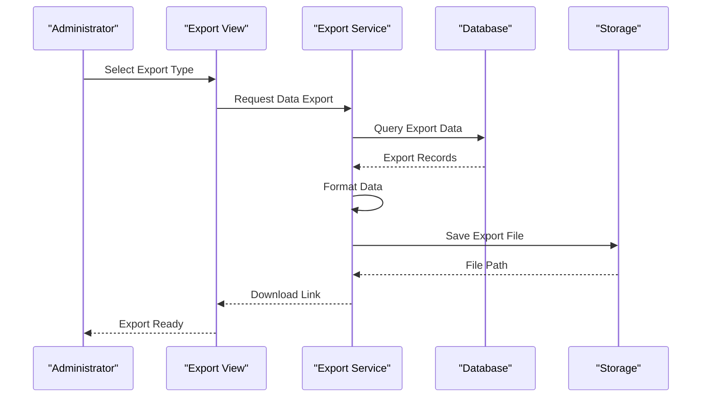

**Diagram sources**
- [app/Services/ExportService.php](file://app/Services/ExportService.php)
- [resources/views/tu/ekspor/index.blade.php](file://resources/views/tu/ekspor/index.blade.php)

**Section sources**
- [docs/manual-tu/09-ekspor-laporan.md](file://docs/manual-tu/09-ekspor-laporan.md)
- [resources/views/tu/ekspor/index.blade.php](file://resources/views/tu/ekspor/index.blade.php)
- [app/Services/ExportService.php](file://app/Services/ExportService.php)

### Dapodik Data Synchronization
Dapodik synchronization maintains data consistency with the national database:
- Configure Dapodik API credentials
- Schedule automatic synchronization
- Monitor sync progress and logs
- Resolve conflicts and errors
- Generate sync reports

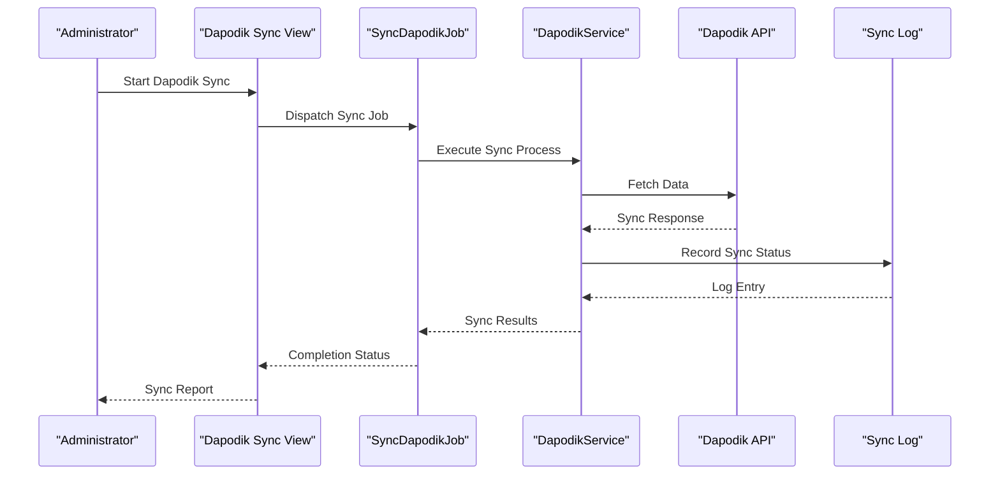

**Diagram sources**
- [resources/views/tu/dapodik/index.blade.php](file://resources/views/tu/dapodik/index.blade.php)
- [app/Jobs/SyncDapodikJob.php](file://app/Jobs/SyncDapodikJob.php)
- [app/Services/DapodikService.php](file://app/Services/DapodikService.php)
- [app/Models/DapodikSyncLog.php](file://app/Models/DapodikSyncLog.php)

**Section sources**
- [docs/manual-tu/10-dapodik-sync.md](file://docs/manual-tu/10-dapodik-sync.md)
- [resources/views/tu/dapodik/index.blade.php](file://resources/views/tu/dapodik/index.blade.php)
- [app/Jobs/SyncDapodikJob.php](file://app/Jobs/SyncDapodikJob.php)
- [app/Services/DapodikService.php](file://app/Services/DapodikService.php)

## Dependency Analysis
Administrative functions depend on well-defined internal and external dependencies:

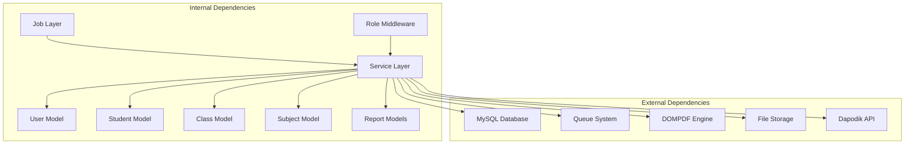

**Diagram sources**
- [app/Models/](file://app/Models/)
- [app/Services/](file://app/Services/)
- [app/Jobs/](file://app/Jobs/)
- [app/Http/Middleware/EnsureRole.php](file://app/Http/Middleware/EnsureRole.php)
- [config/](file://config/)

**Section sources**
- [app/Models/](file://app/Models/)
- [app/Services/](file://app/Services/)
- [app/Jobs/](file://app/Jobs/)
- [config/](file://config/)

## Performance Considerations
Administrative performance depends on efficient data handling and background processing:
- Use pagination for large datasets
- Optimize queries with proper indexing
- Leverage queue workers for heavy operations
- Cache frequently accessed reference data
- Minimize N+1 query patterns
- Compress exported files
- Monitor database performance

Best practices:
- Batch operations for mass updates
- Asynchronous processing for long-running tasks
- Efficient filtering and sorting
- Proper use of relationships and eager loading
- Regular database maintenance

## Troubleshooting Guide
Common administrative issues and resolutions:

Authentication and Authorization:
- Verify role assignments in user management
- Check middleware configuration for protected routes
- Confirm session timeout settings
- Review permission policies

Data Management Issues:
- Validate data integrity before bulk operations
- Check foreign key constraints
- Monitor database connections
- Review migration status

Export and Report Issues:
- Verify PDF engine configuration
- Check storage permissions
- Validate file formats
- Review export filters

Synchronization Problems:
- Confirm API credentials
- Check network connectivity
- Review sync logs
- Monitor queue worker status

Technical Support:
- Enable detailed logging during troubleshooting
- Capture error screenshots
- Document steps to reproduce issues
- Contact system administrator for persistent problems

**Section sources**
- [config/logging.php](file://config/logging.php)
- [config/queue.php](file://config/queue.php)
- [config/dompdf.php](file://config/dompdf.php)
- [app/Http/Middleware/EnsureRole.php](file://app/Http/Middleware/EnsureRole.php)

## Conclusion
The RaporKM Laravel system provides comprehensive administrative capabilities for modern educational institutions. Through structured workflows, robust data management, and seamless integration with national databases like Dapodik, administrators can efficiently manage all aspects of student lifecycle, curriculum delivery, and institutional reporting. The modular architecture ensures scalability and maintainability while the role-based access control guarantees appropriate security and accountability.

Administrative success requires adherence to established procedures, regular maintenance, and continuous staff training. The system's comprehensive documentation and built-in quality assurance mechanisms support effective implementation and ongoing operations.

## Appendices

### Administrative Workflows Reference
- User Onboarding: New user registration, role assignment, and credential setup
- Student Lifecycle: Enrollment, class assignment, transfer management, and graduation
- Academic Management: Subject configuration, grade recording, and report generation
- Activity Coordination: Extracurricular management and achievement tracking
- Institutional Reporting: Export generation and Dapodik synchronization

### Training Resources
- Administrator User Manual (this document)
- Teacher User Manual for role-specific guidance
- System Administrator Guide for technical setup
- Video tutorials and FAQ resources
- Support portal with knowledge base

### Support Channels
- Helpdesk for technical assistance
- Email support for administrative queries
- Community forum for peer-to-peer support
- Official documentation website
- Regular training workshops and webinars

**Section sources**
- [docs/manual-tu/index.md](file://docs/manual-tu/index.md)
- [README.md](file://README.md)