# Teacher User Manual

<cite>
**Referenced Files in This Document**
- [README.md](file://README.md)
- [index.md](file://docs/index.md)
- [01-mulai.md](file://docs/manual-guru/01-mulai.md)
- [02-kelas-saya.md](file://docs/manual-guru/02-kelas-saya.md)
- [03-penilaian-akademik.md](file://docs/manual-guru/03-penilaian-akademik.md)
- [04-catatan-rapor.md](file://docs/manual-guru/04-catatan-rapor.md)
- [05-p5-profil-pancasila.md](file://docs/manual-guru/05-p5-profil-pancasila.md)
- [06-kokurikuler.md](file://docs/manual-guru/06-kokurikuler.md)
- [07-ekstra-presensi.md](file://docs/manual-guru/07-ekstra-presensi.md)
- [08-prakerin.md](file://docs/manual-guru/08-prakerin.md)
- [09-piket-organisasi.md](file://docs/manual-guru/09-piket-organisasi.md)
- [10-cetak-rapor.md](file://docs/manual-guru/10-cetak-rapor.md)
- [guru.blade.php](file://resources/views/layouts/guru.blade.php)
- [sidebar-guru.blade.php](file://resources/views/components/sidebar-guru.blade.php)
- [topbar-guru.blade.php](file://resources/views/components/topbar-guru.blade.php)
- [dashboard.blade.php](file://resources/views/guru/dashboard.blade.php)
- [kelas-ku.blade.php](file://resources/views/guru/kelas-ku/index.blade.php)
- [anggota-kelas.blade.php](file://resources/views/guru/anggota-kelas/index.blade.php)
- [penilaian-akademik.blade.php](file://resources/views/guru/penilaian/index.blade.php)
- [catatan-rapor.blade.php](file://resources/views/guru/catatan-rapor/index.blade.php)
- [p5bk.blade.php](file://resources/views/guru/p5bk/index.blade.php)
- [kokurikuler.blade.php](file://resources/views/guru/kokurikuler/index.blade.php)
- [ekstra-presensi.blade.php](file://resources/views/guru/ekstra/index.blade.php)
- [prakerin.blade.php](file://resources/views/guru/prakerin/index.blade.php)
- [piket-organisasi.blade.php](file://resources/views/guru/piket-harian/index.blade.php)
- [cetak-rapor.blade.php](file://resources/views/guru/cetak-rapor/index.blade.php)
- [pwa.js](file://public/js/pwa.js)
- [sw.js](file://public/sw.js)
- [manifest.json](file://public/manifest.json)
- [EnsureRole.php](file://app/Http/Middleware/EnsureRole.php)
- [PwaAuth.php](file://app/Http/Middleware/PwaAuth.php)
- [NilaiService.php](file://app/Services/NilaiService.php)
- [RaporService.php](file://app/Services/RaporService.php)
- [ExportService.php](file://app/Services/ExportService.php)
- [GuruMenuService.php](file://app/Services/GuruMenuService.php)
- [web.php](file://routes/web.php)
- [api.php](file://routes/api.php)
- [Kelas.php](file://app/Models/Kelas.php)
- [Siswa.php](file://app/Models/Siswa.php)
- [NilaiMapel.php](file://app/Models/NilaiMapel.php)
- [Presensi.php](file://app/Models/Presensi.php)
- [Ekskul.php](file://app/Models/Ekskul.php)
- [Prakerin.php](file://app/Models/Prakerin.php)
- [PiketHarian.php](file://app/Models/PiketHarian.php)
- [Organisasi.php](file://app/Models/Organisasi.php)
- [CatatanWali.php](file://app/Models/CatatanWali.php)
- [DeskripsiRapor.php](file://app/Models/DeskripsiRapor.php)
- [PembagianRaport.php](file://app/Models/PembagianRaport.php)
- [TahunPelajaran.php](file://app/Models/TahunPelajaran.php)
- [Semester.php](file://app/Models/Semester.php)
- [Puskesmas.php](file://app/Models/Puskesmas.php)
- [PuskesmasService.php](file://app/Services/PuskesmasService.php)
</cite>

## Table of Contents
1. [Introduction](#introduction)
2. [Getting Started](#getting-started)
3. [Accessing the System](#accessing-the-system)
4. [Dashboard Overview](#dashboard-overview)
5. [Class Management](#class-management)
6. [Academic Grading](#academic-grading)
7. [Student Records](#student-records)
8. [Behavioral Reports](#behavioral-reports)
9. [Extracurricular Activities](#extracurricular-activities)
10. [Attendance Tracking](#attendance-tracking)
11. [Internship Supervision](#internship-supervision)
12. [Student Organization Participation](#student-organization-participation)
13. [Duty Schedules](#duty-schedules)
14. [Report Card Generation](#report-card-generation)
15. [Mobile Usage (PWA)](#mobile-usage-pwa)
16. [Workflow Diagrams](#workflow-diagrams)
17. [Troubleshooting Guide](#troubleshooting-guide)
18. [Best Practices](#best-practices)
19. [Keyboard Shortcuts](#keyboard-shortcuts)
20. [Conclusion](#conclusion)

## Introduction

RaporKM is a comprehensive school management system built with Laravel that streamlines academic administration for educational institutions. This teacher-focused manual provides step-by-step guidance for managing classroom activities, student records, and academic reporting through an intuitive web interface with optional mobile capabilities.

The system serves as a centralized platform for teachers to handle various academic responsibilities including class management, grade entry, attendance tracking, behavioral assessments, and report card generation. With its modern architecture and user-friendly interface, RaporKM eliminates the complexities traditionally associated with academic record-keeping.

## Getting Started

### System Requirements

RaporKM operates as a web-based application requiring minimal system requirements:

- **Web Browser**: Latest versions of Chrome, Firefox, Safari, or Edge
- **Internet Connection**: Stable broadband connection for optimal performance
- **Mobile Device**: Smartphone or tablet with modern web browser support
- **Screen Resolution**: Minimum 1024x768 pixels for desktop interface

### Initial Setup

Before accessing the system, ensure you have received proper credentials from your school's administration. The system supports multiple authentication methods including traditional username/password and modern single sign-on options.

**Section sources**
- [README.md](file://README.md)
- [index.md](file://docs/index.md)

## Accessing the System

### Login Process

1. **Navigate to Login Page**: Open your web browser and enter the school's designated URL
2. **Enter Credentials**: Input your username and password provided by administration
3. **Two-Factor Authentication**: Complete any additional verification steps if enabled
4. **Access Dashboard**: Click "Login" to access your teacher dashboard

### Role-Based Access Control

The system implements role-based permissions ensuring teachers only access authorized features:

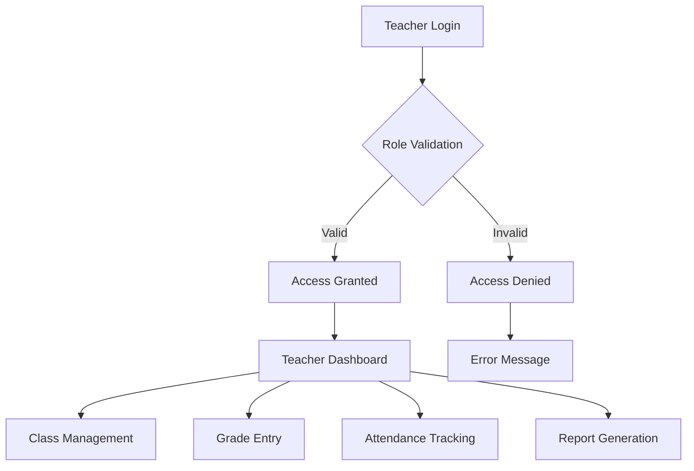

**Diagram sources**
- [EnsureRole.php](file://app/Http/Middleware/EnsureRole.php)
- [PwaAuth.php](file://app/Http/Middleware/PwaAuth.php)

### Mobile Access

Teachers can access the system via mobile devices using Progressive Web App (PWA) technology:

- **Install PWA**: Add the application to home screen for app-like experience
- **Offline Capability**: Limited functionality available without internet connection
- **Real-Time Updates**: Automatic synchronization when connectivity resumes

**Section sources**
- [guru.blade.php](file://resources/views/layouts/guru.blade.php)
- [sidebar-guru.blade.php](file://resources/views/components/sidebar-guru.blade.php)
- [topbar-guru.blade.php](file://resources/views/components/topbar-guru.blade.php)

## Dashboard Overview

### Navigation Interface

The teacher dashboard provides a centralized hub for all academic activities:

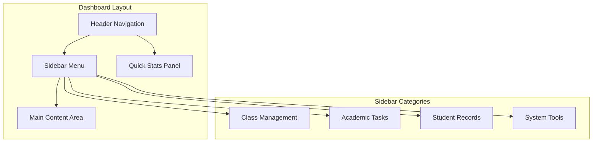

**Diagram sources**
- [dashboard.blade.php](file://resources/views/guru/dashboard.blade.php)
- [guru.blade.php](file://resources/views/layouts/guru.blade.php)

### Quick Access Features

The dashboard displays essential information at a glance:

- **Current Classes**: Active classroom assignments
- **Pending Tasks**: Unfinished academic activities
- **Recent Activity**: Last accessed features
- **System Notifications**: Important announcements

**Section sources**
- [dashboard.blade.php](file://resources/views/guru/dashboard.blade.php)

## Class Management

### Viewing Assigned Classes

Teachers can manage multiple classes within their assignment period:

1. **Access Class List**: Navigate to "My Classes" from the main menu
2. **View Class Details**: See student count, subject combinations, and schedule
3. **Select Specific Class**: Click on desired class for detailed management

### Class Composition Management

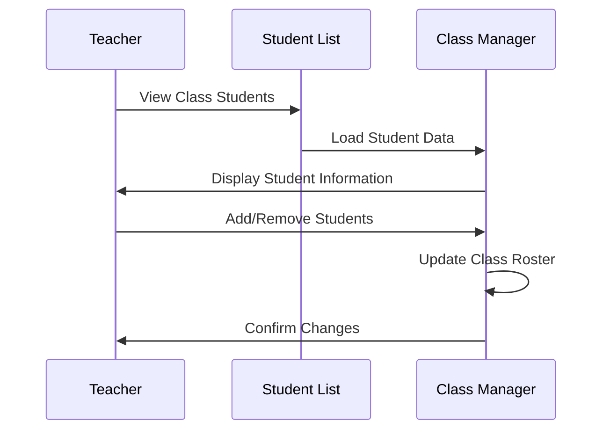

**Diagram sources**
- [kelas-ku.blade.php](file://resources/views/guru/kelas-ku/index.blade.php)
- [anggota-kelas.blade.php](file://resources/views/guru/anggota-kelas/index.blade.php)

### Managing Student Rosters

The system allows teachers to maintain accurate class enrollment:

- **Add New Students**: Register students who join mid-term
- **Remove Students**: Handle transfers or withdrawals
- **Update Personal Information**: Modify student details as needed
- **Print Class Lists**: Generate printable attendance sheets

**Section sources**
- [02-kelas-saya.md](file://docs/manual-guru/02-kelas-saya.md)
- [kelas-ku.blade.php](file://resources/views/guru/kelas-ku/index.blade.php)

## Academic Grading

### Grade Entry Process

Teachers can input various types of academic assessments:

1. **Select Subject & Class**: Choose the appropriate course and section
2. **Choose Assessment Type**: Select formative, summative, or project-based evaluations
3. **Enter Student Grades**: Input numerical scores or letter grades
4. **Save Assessments**: Confirm entries for each student

### Grade Categories

The system supports multiple grading formats:

- **Numerical Scores**: Percentage-based assessment (0-100 scale)
- **Letter Grades**: A+, B-, Pass/Fail classifications
- **Competency Levels**: Advanced, Proficient, Basic descriptors
- **Narrative Comments**: Qualitative feedback for student development

### Grade Calculation Methods

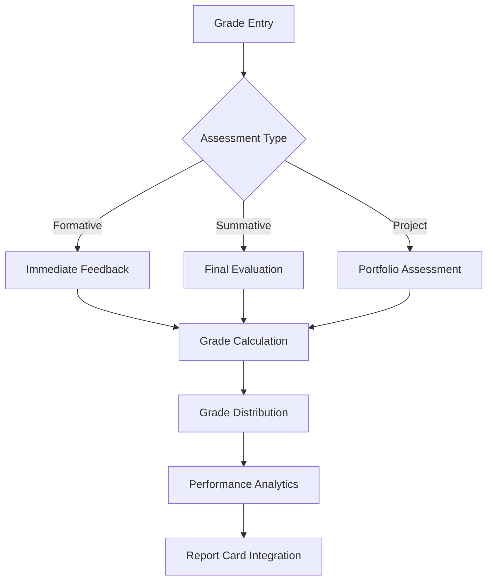

**Diagram sources**
- [penilaian-akademik.blade.php](file://resources/views/guru/penilaian/index.blade.php)
- [NilaiService.php](file://app/Services/NilaiService.php)

### Gradebook Management

Teachers can organize grades by:
- **Assessment Date**: Chronological sorting
- **Student Name**: Alphabetical arrangement
- **Grade Value**: Numerical ordering
- **Subject Category**: Academic discipline grouping

**Section sources**
- [03-penilaian-akademik.md](file://docs/manual-guru/03-penilaian-akademik.md)
- [penilaian-akademik.blade.php](file://resources/views/guru/penilaian/index.blade.php)

## Student Records

### Student Profile Management

Each student maintains a comprehensive digital profile containing:

- **Personal Information**: Full name, date of birth, contact details
- **Academic History**: Previous grades, achievements, and behavioral records
- **Health Information**: Medical conditions, allergies, emergency contacts
- **Family Background**: Parent/guardian information and family circumstances

### Record Updates Process

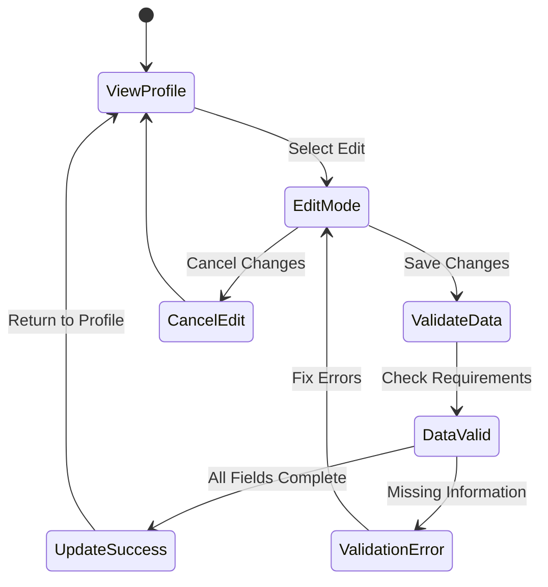

**Diagram sources**
- [anggota-kelas.blade.php](file://resources/views/guru/anggota-kelas/index.blade.php)

### Privacy and Security

Student records are protected by:
- **Role-Based Access**: Only authorized teachers can view profiles
- **Audit Trails**: All changes are logged with timestamps
- **Data Encryption**: Sensitive information is encrypted during transmission
- **Regular Backups**: Automated backup systems prevent data loss

**Section sources**
- [anggota-kelas.blade.php](file://resources/views/guru/anggota-kelas/index.blade.php)

## Behavioral Reports

### Character Education Assessment

Teachers evaluate students' moral and social development through structured assessments:

1. **Select Assessment Period**: Choose current semester or academic year
2. **Complete Behavior Rubrics**: Rate student conduct in various domains
3. **Add Narrative Comments**: Provide qualitative insights into student growth
4. **Submit Evaluations**: Finalize reports for official documentation

### P5/Profesionalitas Domain

The system includes specialized assessment criteria:

- **Pancasila Understanding**: National ideology comprehension
- **Citizenship Values**: Democratic participation and responsibility
- **Professional Attitude**: Work ethic and career preparation
- **Social Responsibility**: Community engagement and environmental awareness

### Report Card Integration

Behavioral assessments automatically integrate with:
- **Character Education Sections**: Dedicated report card spaces
- **Teacher Recommendations**: Narrative summary sections
- **Parent Conference Notes**: Communication channels for home-school collaboration

**Section sources**
- [04-catatan-rapor.md](file://docs/manual-guru/04-catatan-rapor.md)
- [05-p5-profil-pancasila.md](file://docs/manual-guru/05-p5-profil-pancasila.md)
- [catatan-rapor.blade.php](file://resources/views/guru/catatan-rapor/index.blade.php)
- [p5bk.blade.php](file://resources/views/guru/p5bk/index.blade.php)

## Extracurricular Activities

### Activity Registration

Teachers supervise and manage student participation in school activities:

1. **Activity Selection**: Browse available extracurricular programs
2. **Student Enrollment**: Register students in chosen activities
3. **Supervision Assignment**: Assign teachers as activity supervisors
4. **Progress Monitoring**: Track student involvement and achievement

### Activity Types Supported

The system accommodates diverse extracurricular offerings:

- **Sports Teams**: Basketball, soccer, volleyball, track and field
- **Academic Clubs**: Science Olympiad, debate team, literary society
- **Arts Programs**: Drama club, music ensemble, art workshop
- **Community Service**: Volunteer programs, environmental clubs
- **Student Government**: Class council, student parliament

### Activity Reporting

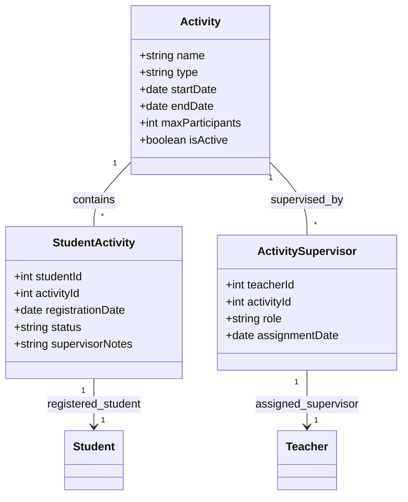

**Diagram sources**
- [ekstra-presensi.blade.php](file://resources/views/guru/ekstra/index.blade.php)
- [Ekskul.php](file://app/Models/Ekskul.php)

**Section sources**
- [06-kokurikuler.md](file://docs/manual-guru/06-kokurikuler.md)
- [07-ekstra-presensi.md](file://docs/manual-guru/07-ekstra-presensi.md)
- [ekstra-presensi.blade.php](file://resources/views/guru/ekstra/index.blade.php)

## Attendance Tracking

### Daily Attendance Management

Teachers can efficiently track student presence and tardiness:

1. **Select Date**: Choose the specific date for attendance recording
2. **View Class Roster**: See all enrolled students in the selected class
3. **Mark Attendance Status**: Indicate present, absent, late, or excused
4. **Enter Excuse Details**: Document reasons for absences when applicable
5. **Save Attendance Sheet**: Confirm all entries before finalizing

### Attendance Categories

The system recognizes various attendance statuses:

- **Present**: Regular class attendance
- **Late**: Arrived after scheduled start time
- **Absent**: Unexcused absence from class
- **Excused Absence**: Verified medical or family emergency
- **Leave of Absence**: Authorized extended absence
- **Early Departure**: Left class before scheduled end

### Attendance Analytics

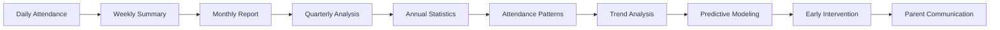

**Diagram sources**
- [presensi.blade.php](file://resources/views/guru/presensi/index.blade.php)
- [Presensi.php](file://app/Models/Presensi.php)

### Absence Documentation

Teachers must provide justification for significant absence patterns:

- **Medical Certificates**: For illness-related absences
- **Family Emergencies**: Death in the family, serious illness
- **School Events**: Authorized field trips or competitions
- **Religious Observances**: Recognized religious holidays

**Section sources**
- [07-ekstra-presensi.md](file://docs/manual-guru/07-ekstra-presensi.md)
- [presensi.blade.php](file://resources/views/guru/presensi/index.blade.php)

## Internship Supervision

### Praktik Kerja Lapangan (PKL) Management

Teachers coordinate and supervise students' practical training experiences:

1. **Company Placement**: Assign students to appropriate internship locations
2. **Supervisor Assignment**: Pair students with industry mentors
3. **Progress Monitoring**: Regular check-ins on student development
4. **Evaluation Process**: Assess student performance and learning outcomes

### Internship Tracking System

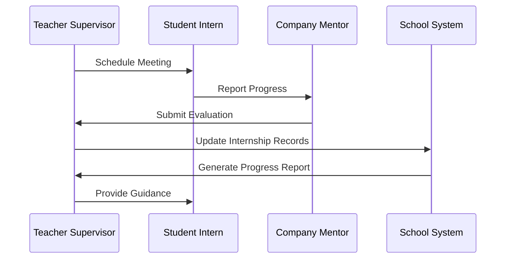

**Diagram sources**
- [prakerin.blade.php](file://resources/views/guru/prakerin/index.blade.php)
- [Prakerin.php](file://app/Models/Prakerin.php)

### Practical Training Assessment

Teachers evaluate internships across multiple dimensions:

- **Technical Skills**: Job-specific competency demonstration
- **Professional Conduct**: Workplace behavior and ethics
- **Learning Progress**: Skill acquisition and improvement
- **Adaptation Ability**: Adjustment to professional environment

**Section sources**
- [08-prakerin.md](file://docs/manual-guru/08-prakerin.md)
- [prakerin.blade.php](file://resources/views/guru/prakerin/index.blade.php)

## Student Organization Participation

### Organization Management

Teachers oversee student-led organizations and leadership development:

1. **Organization Registration**: Verify new student organizations
2. **Advisor Assignment**: Pair organizations with faculty advisors
3. **Activity Planning**: Review and approve organizational events
4. **Progress Evaluation**: Assess organizational effectiveness and growth

### Leadership Development Tracking

The system monitors student leadership progression:

- **Position Held**: Current roles in student government
- **Committee Participation**: Committee memberships and responsibilities
- **Event Organization**: Planning and executing school activities
- **Skill Development**: Leadership training completion and assessment

### Organization Reporting

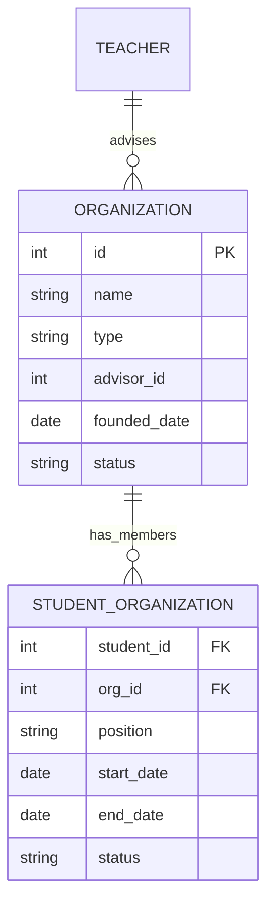

**Diagram sources**
- [organisasi.blade.php](file://resources/views/guru/organisasi/index.blade.php)
- [Organisasi.php](file://app/Models/Organisasi.php)

**Section sources**
- [09-piket-organisasi.md](file://docs/manual-guru/09-piket-organisasi.md)
- [organisasi.blade.php](file://resources/views/guru/organisasi/index.blade.php)

## Duty Schedules

### Daily Duty Management

Teachers participate in various school duties and responsibilities:

1. **Duty Assignment**: Receive duty schedule from administration
2. **Shift Management**: Coordinate duty hours and responsibilities
3. **Performance Monitoring**: Track adherence to duty requirements
4. **Evaluation Process**: Assess duty performance and completion

### Duty Types

Common duty assignments include:

- **Gate Supervision**: Student entry and exit monitoring
- **Library Assistance**: Book management and student assistance
- **Laboratory Support**: Science lab supervision and safety
- **Field Trip Supervision**: Student transportation and activity oversight
- **School Event Coverage**: Festival and ceremony assistance

### Duty Reporting System

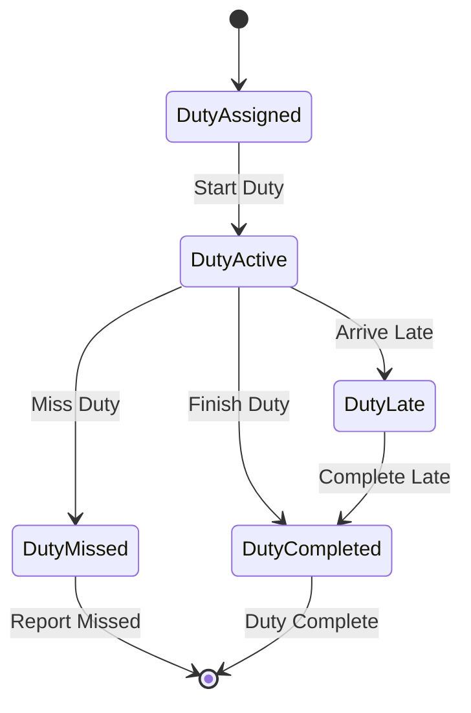

**Diagram sources**
- [piket-organisasi.blade.php](file://resources/views/guru/piket-harian/index.blade.php)
- [PiketHarian.php](file://app/Models/PiketHarian.php)

**Section sources**
- [09-piket-organisasi.md](file://docs/manual-guru/09-piket-organisasi.md)
- [piket-organisasi.blade.php](file://resources/views/guru/piket-harian/index.blade.php)

## Report Card Generation

### Report Card Creation Process

Teachers generate comprehensive academic reports for students:

1. **Select Academic Period**: Choose semester or academic year
2. **Generate Individual Reports**: Create reports for specific students
3. **Batch Processing**: Generate reports for entire classes
4. **Review and Approve**: Verify accuracy before finalization

### Report Card Components

Standard report card sections include:

- **Student Information**: Personal details and class placement
- **Academic Subjects**: Grade distribution across all subjects
- **Behavioral Assessment**: Conduct and character development
- **Extracurricular Activities**: Co-curricular involvement and achievements
- **Teacher Comments**: Personalized feedback and recommendations
- **Parent Conference Notes**: Communication summary

### Report Card Templates

```mermaid
classDiagram
class ReportCard {
+string studentName
+string className
+string academicPeriod
+date issueDate
+string status
}
class SubjectGrade {
+string subjectName
+float finalGrade
+string letterGrade
+string competencyLevel
}
class BehavioralAssessment {
+string domain
+string rating
+string comments
}
class ReportCard "1" -- "*" SubjectGrade : contains
ReportCard "1" -- "*" BehavioralAssessment : includes
```

**Diagram sources**
- [cetak-rapor.blade.php](file://resources/views/guru/cetak-rapor/index.blade.php)
- [RaporService.php](file://app/Services/RaporService.php)

### Digital vs Physical Reports

The system supports multiple report formats:

- **Digital PDF Generation**: Instant report creation with download option
- **Printable Versions**: High-quality print-ready documents
- **Electronic Submission**: Direct upload to student portals
- **Parent Portal Access**: Secure online viewing for families

**Section sources**
- [10-cetak-rapor.md](file://docs/manual-guru/10-cetak-rapor.md)
- [cetak-rapor.blade.php](file://resources/views/guru/cetak-rapor/index.blade.php)

## Mobile Usage (PWA)

### Progressive Web App Features

RaporKM offers mobile accessibility through modern PWA technology:

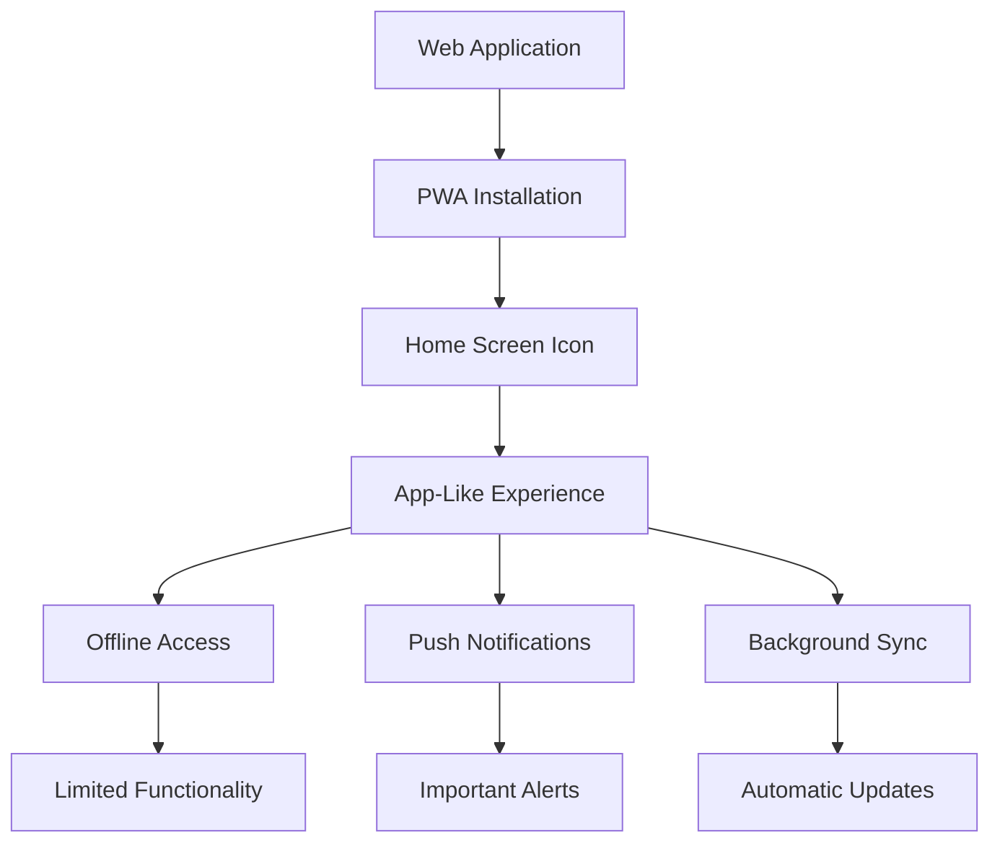

**Diagram sources**
- [pwa.js](file://public/js/pwa.js)
- [sw.js](file://public/sw.js)
- [manifest.json](file://public/manifest.json)

### Mobile Interface Benefits

- **Touch-Friendly Design**: Optimized for smartphone and tablet interaction
- **Quick Access**: Direct links to frequently used features
- **Location Services**: GPS integration for field activities
- **Camera Integration**: Photo submission for practical assessments

### Offline Functionality

Limited offline capabilities include:
- **Cached Data**: Previously accessed information remains available
- **Local Storage**: Temporary data storage for immediate use
- **Synchronization**: Automatic update when connectivity resumes
- **Downloaded Reports**: Pre-generated documents for offline review

**Section sources**
- [pwa.js](file://public/js/pwa.js)
- [sw.js](file://public/sw.js)
- [manifest.json](file://public/manifest.json)

## Workflow Diagrams

### Complete Academic Cycle

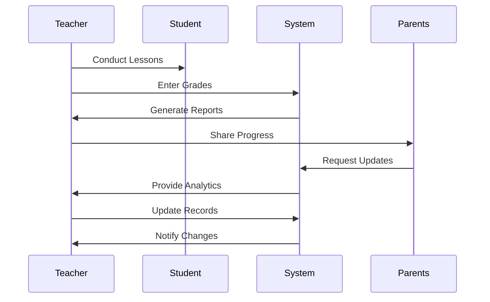

### Grade Entry Workflow

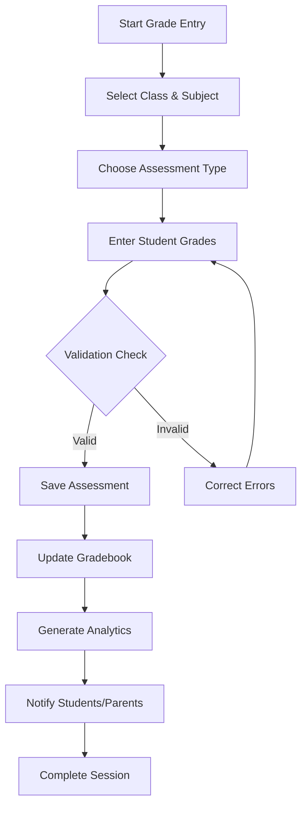

### Report Generation Process

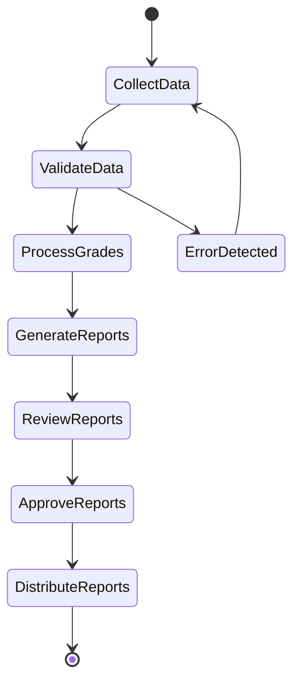

## Troubleshooting Guide

### Common Issues and Solutions

#### Login Problems
- **Issue**: Cannot access login page
- **Solution**: Clear browser cache and cookies, try incognito mode
- **Prevention**: Keep browser updated, avoid using unsupported browsers

#### Data Synchronization Issues
- **Issue**: Changes not appearing immediately
- **Solution**: Refresh page, check internet connection, wait for sync
- **Prevention**: Maintain stable internet connection during data entry

#### Mobile App Problems
- **Issue**: PWA installation fails
- **Solution**: Enable notifications, check browser compatibility, reinstall app
- **Prevention**: Use supported browsers, ensure sufficient storage space

#### Performance Issues
- **Issue**: Slow loading times
- **Solution**: Close unnecessary tabs, clear browser cache, restart device
- **Prevention**: Regular maintenance, avoid concurrent heavy tasks

### Technical Support Resources

- **Help Desk**: Available Monday-Friday, 8:00 AM - 4:00 PM
- **Online Documentation**: Comprehensive user manuals and tutorials
- **Video Tutorials**: Step-by-step instructional videos
- **Community Forum**: Peer-to-peer support and best practices sharing

**Section sources**
- [README.md](file://README.md)

## Best Practices

### Efficient Academic Management

#### Time Management Strategies
- **Batch Processing**: Group similar tasks together for better efficiency
- **Priority Scheduling**: Focus on urgent deadlines and high-impact activities
- **Automated Reminders**: Set up alerts for important dates and submissions
- **Template Usage**: Create reusable templates for recurring tasks

#### Data Entry Excellence
- **Consistency**: Use standardized formats for all entries
- **Accuracy**: Double-check all numerical data and calculations
- **Completeness**: Fill all required fields to avoid system errors
- **Timeliness**: Enter data promptly to maintain system integrity

#### Communication Protocols
- **Clear Documentation**: Provide detailed explanations for grade decisions
- **Regular Updates**: Keep parents informed about student progress
- **Professional Tone**: Maintain respectful communication in all interactions
- **Timely Responses**: Address inquiries within 24-48 hours

### Productivity Tips

#### Keyboard Shortcuts
- **Ctrl+S**: Save current work
- **Ctrl+Z**: Undo last action
- **Ctrl+Y**: Redo previous action
- **Tab**: Navigate between form fields
- **Enter**: Submit forms and confirm actions

#### Advanced Usage Patterns
- **Bulk Operations**: Use batch processing for multiple students
- **Filtering Techniques**: Utilize advanced search and filtering options
- **Export Capabilities**: Regularly export data for backup and analysis
- **Integration Features**: Connect with external systems and tools

## Keyboard Shortcuts

### Navigation Shortcuts
- **Alt + Home**: Return to dashboard
- **Alt + N**: Create new record
- **Alt + F**: Search functionality
- **Alt + E**: Edit current selection
- **Alt + D**: Delete current selection

### Data Entry Shortcuts
- **Ctrl + Enter**: Save and continue
- **Esc**: Cancel current operation
- **F2**: Edit selected item
- **Delete**: Remove selected item
- **Tab**: Move to next field
- **Shift + Tab**: Move to previous field

### Report Generation Shortcuts
- **Ctrl + P**: Print current report
- **Ctrl + Shift + P**: Preview report
- **Ctrl + Shift + S**: Save report as template
- **Ctrl + Shift + E**: Export report data

## Conclusion

RaporKM represents a comprehensive solution for modern academic administration, designed specifically to meet the needs of educators while maintaining the highest standards of data integrity and user experience. Through its intuitive interface, robust feature set, and commitment to continuous improvement, the system empowers teachers to focus on what matters most: student learning and development.

The platform's architecture ensures scalability and reliability, supporting educational institutions from small schools to large district networks. With its emphasis on security, accessibility, and user-centered design, RaporKM stands as a testament to thoughtful software engineering applied to education technology.

Teachers are encouraged to explore all available features, provide feedback for continuous improvement, and take advantage of the extensive training resources available. By leveraging RaporKM effectively, educational institutions can achieve greater efficiency, transparency, and ultimately, improved student outcomes.