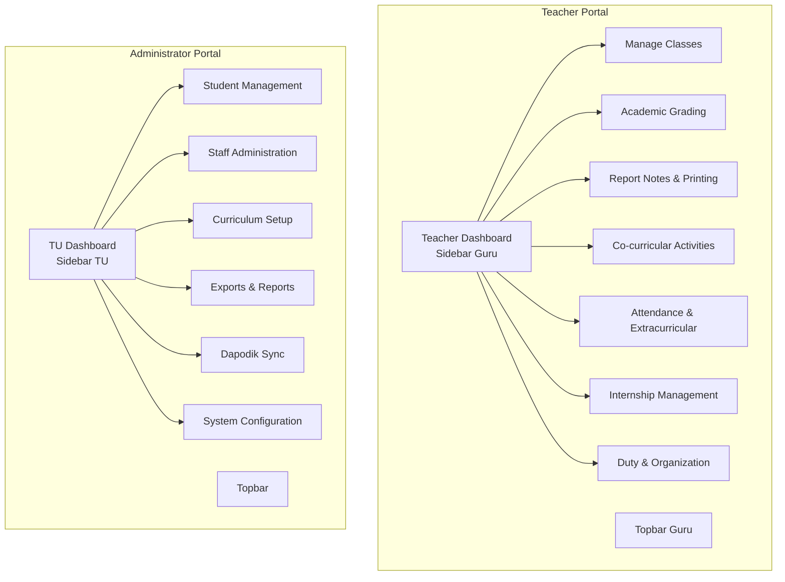
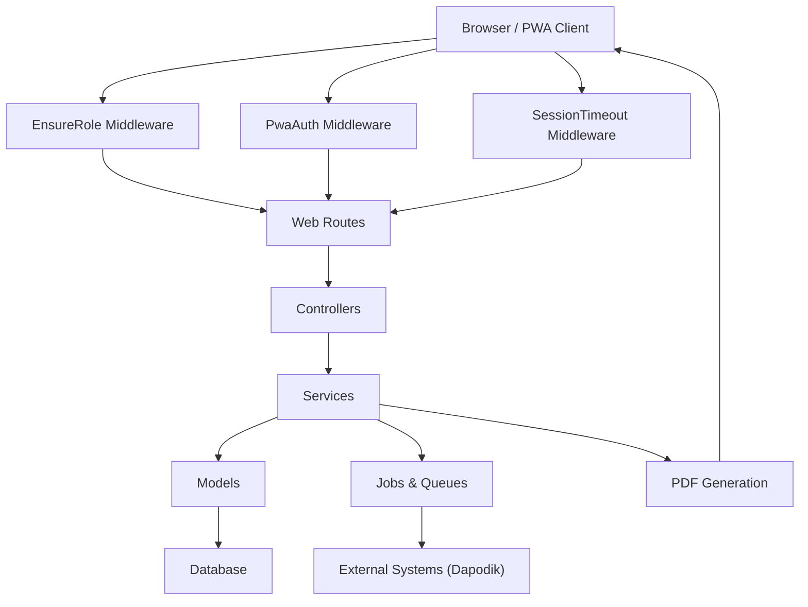
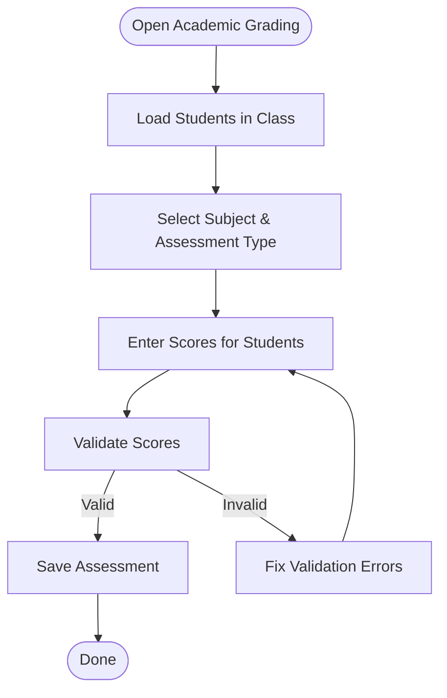
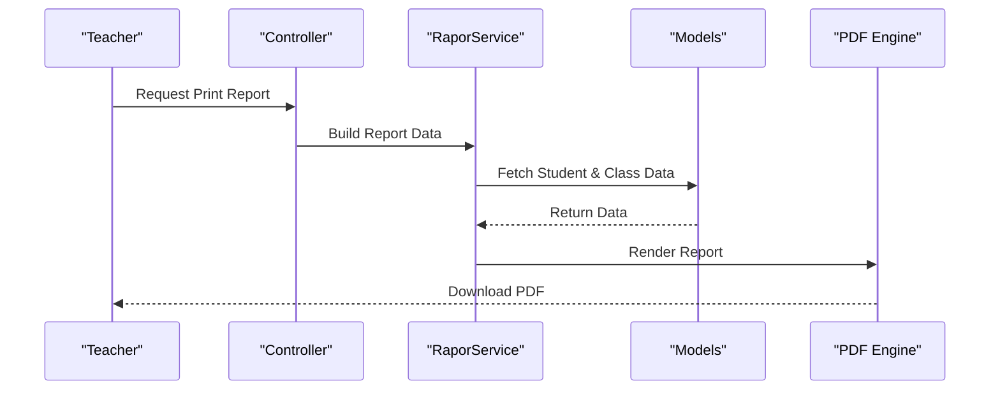
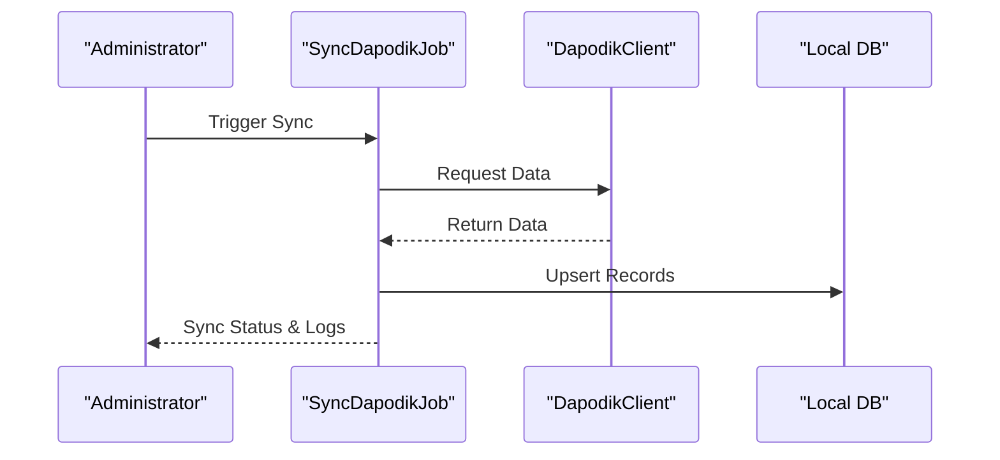
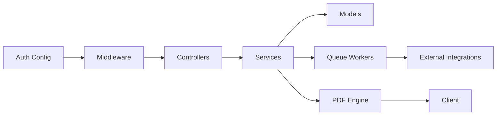

# User Manuals

<cite>
**Referenced Files in This Document**
- [README.md](file://README.md)
- [docs/index.md](file://docs/index.md)
- [docs/manual-guru/index.md](file://docs/manual-guru/index.md)
- [docs/manual-guru/01-mulai.md](file://docs/manual-guru/01-mulai.md)
- [docs/manual-guru/02-kelas-saya.md](file://docs/manual-guru/02-kelas-saya.md)
- [docs/manual-guru/03-penilaian-akademik.md](file://docs/manual-guru/03-penilaian-akademik.md)
- [docs/manual-guru/04-catatan-rapor.md](file://docs/manual-guru/04-catatan-rapor.md)
- [docs/manual-guru/05-p5-profil-pancasila.md](file://docs/manual-guru/05-p5-profil-pancasila.md)
- [docs/manual-guru/06-kokurikuler.md](file://docs/manual-guru/06-kokurikuler.md)
- [docs/manual-guru/07-ekstra-presensi.md](file://docs/manual-guru/07-ekstra-presensi.md)
- [docs/manual-guru/08-prakerin.md](file://docs/manual-guru/08-prakerin.md)
- [docs/manual-guru/09-piket-organisasi.md](file://docs/manual-guru/09-piket-organisasi.md)
- [docs/manual-guru/10-cetak-rapor.md](file://docs/manual-guru/10-cetak-rapor.md)
- [docs/manual-tu/index.md](file://docs/manual-tu/index.md)
- [docs/manual-tu/01-persiapan.md](file://docs/manual-tu/01-persiapan.md)
- [docs/manual-tu/02-manajemen-pengguna.md](file://docs/manual-tu/02-manajemen-pengguna.md)
- [docs/manual-tu/03-manajemen-siswa.md](file://docs/manual-tu/03-manajemen-siswa.md)
- [docs/manual-tu/04-manajemen-kurikulum.md](file://docs/manual-tu/04-manajemen-kurikulum.md)
- [docs/manual-tu/05-p5-kokurikuler.md](file://docs/manual-tu/05-p5-kokurikuler.md)
- [docs/manual-tu/06-ekstra-organisasi.md](file://docs/manual-tu/06-ekstra-organisasi.md)
- [docs/manual-tu/07-prakerin.md](file://docs/manual-tu/07-prakerin.md)
- [docs/manual-tu/08-rapor-cetak.md](file://docs/manual-tu/08-rapor-cetak.md)
- [docs/manual-tu/09-ekspor-laporan.md](file://docs/manual-tu/09-ekspor-laporan.md)
- [docs/manual-tu/10-dapodik-sync.md](file://docs/manual-tu/10-dapodik-sync.md)
- [app/Http/Middleware/EnsureRole.php](file://app/Http/Middleware/EnsureRole.php)
- [app/Http/Middleware/PwaAuth.php](file://app/Http/Middleware/PwaAuth.php)
- [app/Http/Middleware/SessionTimeout.php](file://app/Http/Middleware/SessionTimeout.php)
- [resources/views/layouts/guru.blade.php](file://resources/views/layouts/guru.blade.php)
- [resources/views/layouts/tu.blade.php](file://resources/views/layouts/tu.blade.php)
- [resources/views/components/sidebar-guru.blade.php](file://resources/views/components/sidebar-guru.blade.php)
- [resources/views/components/sidebar-tu.blade.php](file://resources/views/components/sidebar-tu.blade.php)
- [resources/views/components/topbar-guru.blade.php](file://resources/views/components/topbar-guru.blade.php)
- [resources/views/components/topbar.blade.php](file://resources/views/components/topbar.blade.php)
- [public/manifest.json](file://public/manifest.json)
- [public/sw.js](file://public/sw.js)
- [public/js/pwa.js](file://public/js/pwa.js)
- [app/Jobs/ProcessPwaSyncJob.php](file://app/Jobs/ProcessPwaSyncJob.php)
- [app/Jobs/SyncDapodikJob.php](file://app/Jobs/SyncDapodikJob.php)
- [app/Services/Dapodik/DapodikClient.php](file://app/Services/Dapodik/DapodikClient.php)
- [app/Services/DapodikService.php](file://app/Services/DapodikService.php)
- [app/Services/RaporService.php](file://app/Services/RaporService.php)
- [app/Services/ExportService.php](file://app/Services/ExportService.php)
- [app/Models/User.php](file://app/Models/User.php)
- [app/Models/Siswa.php](file://app/Models/Siswa.php)
- [app/Models/Kelas.php](file://app/Models/Kelas.php)
- [app/Models/NilaiMapel.php](file://app/Models/NilaiMapel.php)
- [app/Models/Presensi.php](file://app/Models/Presensi.php)
- [app/Models/Ekstrakurikuler.php](file://app/Models/Ekstrakurikuler.php)
- [app/Models/DeskripsiRapor.php](file://app/Models/DeskripsiRapor.php)
- [app/Models/TahunPelajaran.php](file://app/Models/TahunPelajaran.php)
- [app/Models/Semester.php](file://app/Models/Semester.php)
- [routes/web.php](file://routes/web.php)
- [routes/api.php](file://routes/api.php)
- [config/app.php](file://config/app.php)
- [config/auth.php](file://config/auth.php)
- [config/cache.php](file://config/cache.php)
- [config/session.php](file://config/session.php)
- [config/livewire.php](file://config/livewire.php)
- [config/push.php](file://config/push.php)
- [config/dompdf.php](file://config/dompdf.php)
- [config/e-rapor.php](file://config/e-rapor.php)
- [config/services.php](file://config/services.php)
- [config/database.php](file://config/database.php)
- [config/filesystems.php](file://config/filesystems.php)
- [config/logging.php](file://config/logging.php)
- [config/mail.php](file://config/mail.php)
- [config/queue.php](file://config/queue.php)
- [config/sanctum.php](file://config/sanctum.php)
- [config/activitylog.php](file://config/activitylog.php)
- [config/dapodik.php](file://config/dapodik.php)
- [config/pwa.php](file://config/pwa.php)
- [config/push.php](file://config/push.php)
- [config/pwa.php](file://config/pwa.php)
- [config/push.php](file://config/push.php)
- [config/pwa.php](file://config/pwa.php)
- [config/push.php](file://config/push.php)
- [config/pwa.php](file://config/pwa.php)
- [config/push.php](file://config/push.php)
- [config/pwa.php](file://config/pwa.php)
- [config/push.php](file://config/push.php)
- [config/pwa.php](file://config/pwa.php)
- [config/push.php](file://config/push.php)
- [config/pwa.php](file://config/pwa.php)
- [config/push.php](file://config/push.php)
- [config/pwa.php](file://config/pwa.php)
- [config/push.php](file://config/push.php)
- [config/pwa.php](file://config/pwa.php)
- [config/push.php](file://config/push.php)
- [config/pwa.php](file://config/pwa.php)
- [config/push.php](file://config/push.php)
- [config/pwa.php](file://config/pwa.php)
- [config/push.php](file://config/push.php)
- [config/pwa.php](file://config/pwa.php)
- [config/push.php](file://config/push.php)
- [config/pwa.php](file://config/pwa.php)
- [config/push.php](file://config/push.php)
- [config/pwa.php](file://config/pwa.php)
- [config/push.php](file://config/push.php)
- [config/pwa.php](file://config/pwa.php)
- [config/push.php](file://config/push.php)
- [config/pwa.php](file://config/pwa.php)
- [config/push.php](file://config/push.php)
- [config/pwa.php](file://config/pwa.php)
- [config/push.php](file://config/push.php)
- [config/pwa.php](file://config/pwa.php)
- [config/push.php](file://config/push.php)
- [config/pwa.php......](file://config/pwa.php)
</cite>

## Table of Contents
1. [Introduction](#introduction)
2. [Project Structure](#project-structure)
3. [Core Components](#core-components)
4. [Architecture Overview](#architecture-overview)
5. [Detailed Component Analysis](#detailed-component-analysis)
6. [Dependency Analysis](#dependency-analysis)
7. [Performance Considerations](#performance-considerations)
8. [Troubleshooting Guide](#troubleshooting-guide)
9. [Conclusion](#conclusion)
10. [Appendices](#appendices)

## Introduction
This document provides comprehensive user manuals for RaporKM, a Laravel-based school reporting and management platform. It covers step-by-step workflows for teachers and administrators, including grade entry, attendance management, report generation, classroom tools, student management, curriculum setup, and system configuration. It also documents user roles, access permissions, mobile usage via Progressive Web App (PWA), offline capabilities, troubleshooting, best practices, and quick reference guides.

## Project Structure
RaporKM is organized around role-specific dashboards and workflows:
- Teacher (Guru) portal: class management, academic grading, reports, co-curricular activities, attendance, extracurriculars, and printing reports.
- Administrator (TU) portal: user management, student administration, curriculum setup, export/reporting, Dapodik synchronization, and system configuration.

Key UI components:
- Role-specific layouts and sidebars
- Blade templates for teacher and TU views
- PWA manifest and service worker for mobile/offline support

**Diagram sources**
- [resources/views/layouts/guru.blade.php](file://resources/views/layouts/guru.blade.php)
- [resources/views/layouts/tu.blade.php](file://resources/views/layouts/tu.blade.php)
- [resources/views/components/sidebar-guru.blade.php](file://resources/views/components/sidebar-guru.blade.php)
- [resources/views/components/sidebar-tu.blade.php](file://resources/views/components/sidebar-tu.blade.php)
- [resources/views/components/topbar-guru.blade.php](file://resources/views/components/topbar-guru.blade.php)
- [resources/views/components/topbar.blade.php](file://resources/views/components/topbar.blade.php)

**Section sources**
- [docs/manual-guru/index.md](file://docs/manual-guru/index.md)
- [docs/manual-tu/index.md](file://docs/manual-tu/index.md)
- [resources/views/layouts/guru.blade.php](file://resources/views/layouts/guru.blade.php)
- [resources/views/layouts/tu.blade.php](file://resources/views/layouts/tu.blade.php)

## Core Components
- Role-based middleware ensures access control for teacher and administrator areas.
- PWA middleware and configuration enable secure, cached, and offline-capable experiences.
- Services handle report generation, exports, and Dapodik synchronization.
- Models represent core entities such as users, students, classes, grades, attendance, and reports.

Access control and session management:
- EnsureRole middleware restricts routes to authorized roles.
- SessionTimeout middleware manages session lifecycle.
- PwaAuth middleware secures PWA access.

PWA and offline support:
- Manifest defines app metadata for installation.
- Service worker enables caching and offline access.
- PWA client-side scripts coordinate updates and sync jobs.

**Section sources**
- [app/Http/Middleware/EnsureRole.php](file://app/Http/Middleware/EnsureRole.php)
- [app/Http/Middleware/PwaAuth.php](file://app/Http/Middleware/PwaAuth.php)
- [app/Http/Middleware/SessionTimeout.php](file://app/Http/Middleware/SessionTimeout.php)
- [public/manifest.json](file://public/manifest.json)
- [public/sw.js](file://public/sw.js)
- [public/js/pwa.js](file://public/js/pwa.js)
- [app/Jobs/ProcessPwaSyncJob.php](file://app/Jobs/ProcessPwaSyncJob.php)
- [app/Jobs/SyncDapodikJob.php](file://app/Jobs/SyncDapodikJob.php)

## Architecture Overview
The system follows a layered architecture:
- Presentation layer: Blade templates and Livewire components.
- Application layer: Controllers and services orchestrating workflows.
- Domain layer: Models representing entities and business rules.
- Infrastructure layer: Jobs, queues, and external integrations (e.g., Dapodik).

**Diagram sources**
- [app/Http/Middleware/EnsureRole.php](file://app/Http/Middleware/EnsureRole.php)
- [app/Http/Middleware/PwaAuth.php](file://app/Http/Middleware/PwaAuth.php)
- [app/Http/Middleware/SessionTimeout.php](file://app/Http/Middleware/SessionTimeout.php)
- [routes/web.php](file://routes/web.php)
- [app/Services/RaporService.php](file://app/Services/RaporService.php)
- [app/Services/ExportService.php](file://app/Services/ExportService.php)
- [app/Services/DapodikService.php](file://app/Services/DapodikService.php)
- [app/Jobs/SyncDapodikJob.php](file://app/Jobs/SyncDapodikJob.php)
- [app/Models/User.php](file://app/Models/User.php)
- [app/Models/Siswa.php](file://app/Models/Siswa.php)
- [app/Models/Kelas.php](file://app/Models/Kelas.php)
- [app/Models/NilaiMapel.php](file://app/Models/NilaiMapel.php)
- [app/Models/Presensi.php](file://app/Models/Presensi.php)
- [app/Models/DeskripsiRapor.php](file://app/Models/DeskripsiRapor.php)

## Detailed Component Analysis

### Teacher Manual

#### Getting Started
- Access the teacher dashboard and navigate to class management.
- Verify current academic year and semester selection.
- Review your assigned classes and students.

**Section sources**
- [docs/manual-guru/01-mulai.md](file://docs/manual-guru/01-mulai.md)
- [resources/views/components/topbar-guru.blade.php](file://resources/views/components/topbar-guru.blade.php)

#### Manage My Classes
- View and manage students per class.
- Update class information and schedules.
- Coordinate with co-curricular activity leaders.

**Section sources**
- [docs/manual-guru/02-kelas-saya.md](file://docs/manual-guru/02-kelas-saya.md)
- [resources/views/components/sidebar-guru.blade.php](file://resources/views/components/sidebar-guru.blade.php)

#### Academic Grading
- Enter formative assessments and summative scores.
- Calculate final grades per subject.
- Save and validate entries against configured criteria.

**Diagram sources**
- [docs/manual-guru/03-penilaian-akademik.md](file://docs/manual-guru/03-penilaian-akademik.md)
- [app/Models/NilaiMapel.php](file://app/Models/NilaiMapel.php)

**Section sources**
- [docs/manual-guru/03-penilaian-akademik.md](file://docs/manual-guru/03-penilaian-akademik.md)
- [app/Models/NilaiMapel.php](file://app/Models/NilaiMapel.php)

#### Report Notes
- Add personal notes per student for report inclusion.
- Review and finalize notes before report generation.

**Section sources**
- [docs/manual-guru/04-catatan-rapor.md](file://docs/manual-guru/04-catatan-rapor.md)
- [app/Models/DeskripsiRapor.php](file://app/Models/DeskripsiRapor.php)

#### Character and Patriotism Education (P5)
- Record student character development and Pancasila education outcomes.
- Generate supporting report statements.

**Section sources**
- [docs/manual-guru/05-p5-profil-pancasila.md](file://docs/manual-guru/05-p5-profil-pancasila.md)

#### Co-curricular Activities
- Manage co-curricular descriptors and student participation.
- Record co-curricular grades and remarks.

**Section sources**
- [docs/manual-guru/06-kokurikuler.md](file://docs/manual-guru/06-kokurikuler.md)
- [app/Models/DeskripsiKokurikuler.php](file://app/Models/DeskripsiKokurikuler.php)

#### Attendance and Extracurriculars
- Log daily attendance and absence reasons.
- Track student extracurricular participation.

**Section sources**
- [docs/manual-guru/07-ekstra-presensi.md](file://docs/manual-guru/07-ekstra-presensi.md)
- [app/Models/Presensi.php](file://app/Models/Presensi.php)
- [app/Models/Ekstrakurikuler.php](file://app/Models/Ekstrakurikuler.php)

#### Internship (Praktik Kerja Lapangan)
- Register and track internship activities and grades.
- Generate related report sections.

**Section sources**
- [docs/manual-guru/08-prakerin.md](file://docs/manual-guru/08-prakerin.md)
- [app/Models/Prakerin.php](file://app/Models/Prakerin.php)

#### Duty and Organization
- Record daily duty schedules and organizational involvement.
- Generate supporting documentation.

**Section sources**
- [docs/manual-guru/09-piket-organisasi.md](file://docs/manual-guru/09-piket-organisasi.md)
- [app/Models/PiketHarian.php](file://app/Models/PiketHarian.php)

#### Print Reports
- Generate and print student reports for the selected semester.
- Export reports for distribution.

**Diagram sources**
- [docs/manual-guru/10-cetak-rapor.md](file://docs/manual-guru/10-cetak-rapor.md)
- [app/Services/RaporService.php](file://app/Services/RaporService.php)
- [app/Models/Siswa.php](file://app/Models/Siswa.php)
- [app/Models/Kelas.php](file://app/Models/Kelas.php)
- [config/dompdf.php](file://config/dompdf.php)

**Section sources**
- [docs/manual-guru/10-cetak-rapor.md](file://docs/manual-guru/10-cetak-rapor.md)
- [app/Services/RaporService.php](file://app/Services/RaporService.php)
- [config/dompdf.php](file://config/dompdf.php)

### Administrator Manual

#### Preparation
- Set up academic year and semester.
- Configure school data and basic references.

**Section sources**
- [docs/manual-tu/01-persiapan.md](file://docs/manual-tu/01-persiapan.md)
- [app/Models/TahunPelajaran.php](file://app/Models/TahunPelajaran.php)
- [app/Models/Semester.php](file://app/Models/Semester.php)

#### User Management
- Create and manage teacher and staff accounts.
- Assign roles and permissions.

**Section sources**
- [docs/manual-tu/02-manajemen-pengguna.md](file://docs/manual-tu/02-manajemen-pengguna.md)
- [app/Models/User.php](file://app/Models/User.php)

#### Student Management
- Enroll students, manage transfers, and maintain profiles.
- Coordinate with Dapodik for data synchronization.

**Section sources**
- [docs/manual-tu/03-manajemen-siswa.md](file://docs/manual-tu/03-manajemen-siswa.md)
- [app/Models/Siswa.php](file://app/Models/Siswa.php)

#### Curriculum Setup
- Define subjects, competency groups, and learning goals.
- Configure subject-class assignments.

**Section sources**
- [docs/manual-tu/04-manajemen-kurikulum.md](file://docs/manual-tu/04-manajemen-kurikulum.md)
- [app/Models/Mapel.php](file://app/Models/Mapel.php)
- [app/Models/KelompokMapel.php](file://app/Models/KelompokMapel.php)
- [app/Models/TujuanPembelajaran.php](file://app/Models/TujuanPembelajaran.php)

#### Co-curricular and Organization
- Manage extracurricular activities and organizations.
- Assign activity leaders and record participation.

**Section sources**
- [docs/manual-tu/05-p5-kokurikuler.md](file://docs/manual-tu/05-p5-kokurikuler.md)
- [docs/manual-tu/06-ekstra-organisasi.md](file://docs/manual-tu/06-ekstra-organisasi.md)

#### Internship Management
- Configure internship programs and supervision.
- Monitor student progress and grades.

**Section sources**
- [docs/manual-tu/07-prakerin.md](file://docs/manual-tu/07-prakerin.md)

#### Report Printing and Exports
- Generate consolidated reports and exports.
- Prepare data for administrative review.

**Section sources**
- [docs/manual-tu/08-rapor-cetak.md](file://docs/manual-tu/08-rapor-cetak.md)
- [docs/manual-tu/09-ekspor-laporan.md](file://docs/manual-tu/09-ekspor-laporan.md)
- [app/Services/ExportService.php](file://app/Services/ExportService.php)

#### Dapodik Synchronization
- Sync student and staff data with the Dapodik system.
- Monitor sync logs and resolve conflicts.

**Diagram sources**
- [docs/manual-tu/10-dapodik-sync.md](file://docs/manual-tu/10-dapodik-sync.md)
- [app/Jobs/SyncDapodikJob.php](file://app/Jobs/SyncDapodikJob.php)
- [app/Services/Dapodik/DapodikClient.php](file://app/Services/Dapodik/DapodikClient.php)
- [app/Services/DapodikService.php](file://app/Services/DapodikService.php)

**Section sources**
- [docs/manual-tu/10-dapodik-sync.md](file://docs/manual-tu/10-dapodik-sync.md)
- [app/Jobs/SyncDapodikJob.php](file://app/Jobs/SyncDapodikJob.php)
- [app/Services/Dapodik/DapodikClient.php](file://app/Services/Dapodik/DapodikClient.php)
- [app/Services/DapodikService.php](file://app/Services/DapodikService.php)

## Dependency Analysis
RaporKM relies on several configuration and service layers:
- Authentication and authorization via policies and middleware.
- Session and cache configuration for performance.
- PDF rendering and export services.
- Queue workers for background jobs (e.g., PWA sync, Dapodik sync).
- Push notifications and logging for operational visibility.

**Diagram sources**
- [config/auth.php](file://config/auth.php)
- [app/Http/Middleware/EnsureRole.php](file://app/Http/Middleware/EnsureRole.php)
- [routes/web.php](file://routes/web.php)
- [app/Services/RaporService.php](file://app/Services/RaporService.php)
- [app/Services/ExportService.php](file://app/Services/ExportService.php)
- [config/queue.php](file://config/queue.php)
- [config/dompdf.php](file://config/dompdf.php)

**Section sources**
- [config/auth.php](file://config/auth.php)
- [config/session.php](file://config/session.php)
- [config/cache.php](file://config/cache.php)
- [config/queue.php](file://config/queue.php)
- [config/dompdf.php](file://config/dompdf.php)
- [config/push.php](file://config/push.php)
- [config/activitylog.php](file://config/activitylog.php)

## Performance Considerations
- Use caching for reference data and frequently accessed lists.
- Batch operations for grading and attendance to reduce database load.
- Optimize PDF generation by minimizing DOM complexity and leveraging server-side caching.
- Employ queue workers for long-running tasks like exports and Dapodik sync.
- Monitor session timeouts to balance security and usability.

## Troubleshooting Guide
Common issues and resolutions:
- Login problems: Verify credentials and role assignment; check session timeout settings.
- Report generation failures: Confirm PDF engine configuration and available memory; retry after clearing cache.
- Attendance/grading errors: Validate input ranges and required fields; recheck assessment types.
- PWA update prompts: Ensure service worker is registered and manifest is served correctly.
- Dapodik sync failures: Review sync logs, network connectivity, and API credentials.

Support channels:
- Internal helpdesk tickets for system issues.
- Email support for configuration questions.
- Training sessions for new users.

**Section sources**
- [app/Http/Middleware/SessionTimeout.php](file://app/Http/Middleware/SessionTimeout.php)
- [config/dompdf.php](file://config/dompdf.php)
- [config/pwa.php](file://config/pwa.php)
- [app/Jobs/SyncDapodikJob.php](file://app/Jobs/SyncDapodikJob.php)

## Conclusion
RaporKM streamlines academic reporting and administrative workflows through role-focused dashboards, robust data models, and modern delivery mechanisms like PWA. By following the step-by-step guides, adhering to best practices, and leveraging built-in services and middleware, users can efficiently manage grading, attendance, reports, and system configuration while ensuring reliable offline and mobile access.

## Appendices

### User Roles and Permissions
- Teacher (Guru): Access to class management, grading, reports, attendance, co-curriculars, and printing.
- Administrator (TU): Access to user management, student records, curriculum setup, exports, Dapodik sync, and system configuration.

Access boundaries:
- EnsureRole middleware enforces role-based route access.
- SessionTimeout middleware prevents unauthorized prolonged sessions.
- PwaAuth middleware secures PWA endpoints.

**Section sources**
- [app/Http/Middleware/EnsureRole.php](file://app/Http/Middleware/EnsureRole.php)
- [app/Http/Middleware/SessionTimeout.php](file://app/Http/Middleware/SessionTimeout.php)
- [app/Http/Middleware/PwaAuth.php](file://app/Http/Middleware/PwaAuth.php)

### Mobile Usage, PWA, and Offline Capabilities
- Install the PWA from the home screen for app-like experience.
- Service worker caches essential assets and data for offline browsing.
- PWA tokens and push subscriptions enable secure access and notifications.

**Section sources**
- [public/manifest.json](file://public/manifest.json)
- [public/sw.js](file://public/sw.js)
- [public/js/pwa.js](file://public/js/pwa.js)
- [config/pwa.php](file://config/pwa.php)
- [config/push.php](file://config/push.php)

### Best Practices and Workflow Optimization
- Batch data entry for grades and attendance to minimize repetitive actions.
- Use semester switches strategically to avoid accidental overwrites.
- Regularly back up reports and exports.
- Keep PWA updated to benefit from latest improvements and fixes.

### Quick Reference Guides
- Keyboard shortcuts: Use browser defaults for navigation and saving (e.g., Ctrl+S to save forms).
- Power user patterns: Combine filters, bulk actions, and exports for efficient audits.

### Training Resources and Support
- Onboarding procedures: Complete role-based training modules and shadow experienced users.
- Training materials: Refer to the teacher and administrator manuals included in the documentation set.
- Support channels: Internal helpdesk, email support, and scheduled workshops.

**Section sources**
- [docs/manual-guru/index.md](file://docs/manual-guru/index.md)
- [docs/manual-tu/index.md](file://docs/manual-tu/index.md)
- [README.md](file://README.md)